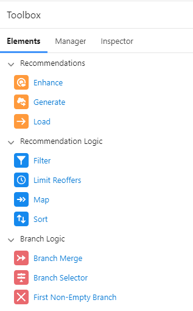
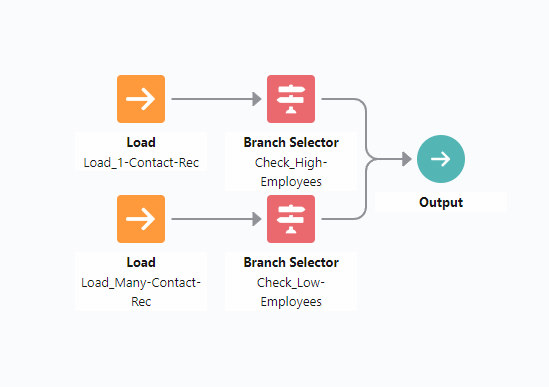
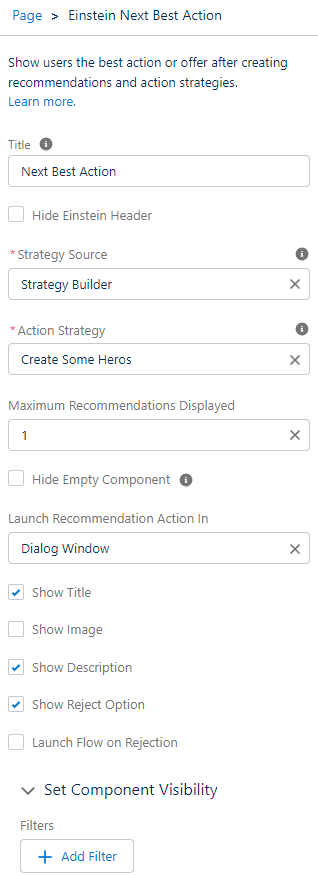

# Module - Einstein Next Best Action

This module discusses predictive modeling and the Einstein Next Best Action feature.

## Table of Contents

* [Einstein Next Best Action](#einstein-next-best-action)
* [Recommendations](#recommendations)
    * [Recommendation Fields](#recommendation-fields)
    * [Recommendations on Recommendations](#recommendations-on-recommendations)
* [Einstein Strategy Builder](#einstein-strategy-builder)
    * [Action Strategies](#action-strategies)
    * [Elements](#elements-expanded)
* [Einstein Next Best Action Component](#einstein-next-best-action-component)

### Helpful Links/References

* [Next Best Action (Salesforce Help)](https://help.salesforce.com/s/articleView?id=sf.einstein_next_best_action.htm&type=5)
* [Recommendations (Salesforce Help)](https://help.salesforce.com/s/articleView?id=sf.nba_recommendations_app.htm&type=5)
* [NBA Breakdown (Trailhead Module)](https://trailhead.salesforce.com/en/content/learn/modules/einstein-next-best-action/understand-how-einstein-next-best-action-works)

## Einstein Next Best Action

In modern day businesses, we have a lot of data. So much data, in fact, that most companies have no idea what to do with it or what it all means. From this data, you can actually draw a lot of conclusions you wouldn't expect. For example, a very common data analytics story is when someone at Target figured out whether women were pregnant based on the items they would purchase, and would then send coupons for baby items if they found a match. This process of going through data, analyzing it and drawing connections between data points and making predictions based on your findings is called **predictive modeling**, and it is the key to utilizing all the data modern businesses have.

The people who make predictive models are called data analysts or data scientists. Their job is to dig through all the data and come up with a model that can be used to get a number and a true/false value. The true/false is in response to the question the analyst is asking _(eg. Will this person cancel their subscription?)_ and the number represents how confident we are that the true/false value is correct. Often times, this will just be simplified down to a percentage chance that something happens _(eg. This person is 75% likely to cancel their subscription)_. Some companies will take this analysis a step further and incorporate AI and machine learning into the creation of their predictive models for even more accurate results. In fact, Salesforce has its own AI, called Einstein. However, this is where the analysis of the data ends and the data scientists have done their job and pack up to move on to a new project. We have the information, but now what? What do we do with it?

Now that we have meaningful information in English as to what all the data means, we can decide what to actually do and utilize the result of the predictive model to guide our decision. This is where our job starts, and `Einstein Next Best Action` comes into the picture.

## Recommendations

Let's simplify this talk of data analysis and predictions and actions. We will begin with an example of a person who is interested in exercising. The very first thing we need to do in order to help this person is to find out information about them: 
- How fit are they? 
- How old are they? 
- What kinds of exercises do they prefer? 
- What are their fitness goals?

Consider this part of the process as the predictive modeling and the data analysis. Now we are handed a list of information about this person in terms we can understand that contains the answers to the above questions. 

Our first step to using `Next Best Action` is to actually partially ignore the findings above. We need to create `Recommendations` for what to do, but at this point we don't actually care about any one person in particular. What we should focus on is the different categories the above findings can seperate people into. Once we know the categories, we can decide what `Recommendations` to make.

Speaking of `Recommendations`, let's define this. A `Recommendation` in Salesforce is extremely similar to a real-life recommendation; it is an actionable suggestion, actionable meaning that something happens depending on whether or not they agree to the suggestion. These `Recommendations` are what actually get displayed to the User in `Next Best Action`. Just like a recommendation in real life, a Salesforce `Recommendation` has several parts to it.

|  | Proposal | Agreement | Rejection | Action |
| ----- | ------ | ------ | ------ | ------ |
| Salesforce | Name and Description | Acceptance Label | Rejection Label | Action |
| Our Example | You should swim | Ok, I'll start swimming | No, I hate water | They swim 500m every day |

### Recommendation Fields

Let's take a closer look at all these fields I mentioned in the table:

And let's explain each of those numbers:

1. `Image`: A image file displayed as a banner at the top of the `Recommendation` (Optionally displayed)
2. `Name`: The title of the `Recommendation` (Optionally displayed)
3. `Description`: A more in-depth explanation of the `Recommendation` (Optionally displayed)
4. `Acceptance Label`: The text in the button to accept the `Recommendation`
5. `Rejection Label`: The text in the button to reject the `Recommendation` (Optionally displayed)

Most of these fields can be displayed optionally on the `Recommendation` as it shows up to the `User`, but the only field that's not actually a required field is the `Image`. Every other field must be filled out for a `Recommendation`. The last field to talk about for a `Recommendation` is the `Action` field. The `Action` field is what actually happens if the top button (the accept button) is clicked. This must be a `Flow`, and it can only be either a Screen Flow or an Autolaunched Flow.

### Recommendations on Recommendations

As mentioned earlier, we want to divide up what we do based on the actions, or `Flows` we have available for the object in question. This is what defining what categories our questions divide our data into is important: if we have these categories defined, we can then create `Flows` for each of these categories for their associated `Recommendations`. When we're starting out, there is a lot to do, so begin by simplifying the problem and creating these categories. Then, you can focus category by category.

At this point, there should be something still nagging on your mind. This should be "Well, if we have all these recommendations, and we have these categories, how do we tell Salesforce which one to use? And where does our predictive modeling come in?" The next step to using `Next Best Action` is to do just that: tell Salesforce which `Recommendation` we use.

## Einstein Strategy Builder

Let's take another look at our client who's interested in exercising. We've been ignoring their specific needs up until now, just looking at the questions we _would_ ask a client and how to categorize the results and what recommendations we should give them. Imagine we have come up with many `Recommendations`; zingers such as:

- Run a 5k
- Run a mile
- Walk a mile
- Swim 500m
- Total body weights
- Body weight exercise
- Push muscle weights
- Pull muscle weights

There's so much there! Surely we cannot use each of them in every situation, which one is the **best** one? We can use our information that we gathered earlier to help filter out the ones that are less effective or incompatible. If a person is not very fit, we can remove the "Run a 5k" recommendation. If they cannot swim, we can remove the "Swim 500m" recommendation. If they are not interested in building muscle, we can remove the weight lifting recommendations.

Narrowing down what `Recommendations` to display to the `User` is the entire purpose of the `Action Strategy`, which is built in the `Einstein Strategy Builder`. In order to access this tool, we can navigate to it through `Setup` > `Process Automation` > `Next Best Action`.

### Action Strategies

The `Action Strategy` is an automation tool that looks and is built very similarly to a `Flow`. It is a point and click tool that utilizes elements to perform actions or logic to determine which `Recommendations` to suggest. When we compare the `Action Strategy` to `Flow`, however, we see a lot of differences in our `Elements` that we have available.

First, let's discuss each of the tabs.

##### Elements

This is where we keep, as you might imagine, the elements that are actually going to be making up our `Action Strategy`. We'll be going into more detail about the elements, but for now just note that they are broken into 3 categories: `Recommendations`, `Recommendation Logic` and `Branch Logic`.

##### Manager

If you have an Apex invocable action, you can use it in the `Action Strategy` to pull in extra data sources into the strategy to factor in to which `Recommendations` you want to suggest. The `Manager` tab is where you do that configuration. In case you're unfamiliar with an invocable action, it's simply an Apex Class that accepts input from a declarative tool, does some processing and spits out a result. It's more commonly used with `Flows`, but we can write these for our `Action Strategies` as well.

##### Inspector

This is used to debug your `Action Strategy`. Input the ID for a record you want to test the strategy on, and it will display the results in JSON format. From there, you can click on each element to see what `Recommendations` it has at a certain point in the logic.

The place where we're going to be doing most of our work and spend most of our time on is the `Elements` tab, so let's take a closer look at each one of those categories and how we use them.

### Elements Expanded

First, let's explain the meaning and intention behind each of the 3 categories:

- `Recommendations`: This category is used to retrieve specific `Recommendations` in our org. Each branch starts off with one of these elements and this determines what collection of `Recommendations` future elements work off of
- `Recommendation Logic`: This category is used to perform logic on the `Recommendation` collection in the branch, such as filters and sorts
- `Branch Logic`: This category is used as a logic gate to eliminate branches based on criteria from the record

The main difference between `Recommendation` and `Branch` logic is that the `Recommendation Logic` works on the collection of `Recommendations` that is on a particular branch that we loaded in earlier, while the `Branch Logic` works on the entire branch as a whole. Using `Recommendation Logic`, we can be selective about (a) which `Recommendations` we want to let continue further in the branch or filter out or (b) the order those `Recommendations` are placed in. The `Branch Logic` is where we issue blanket statements and snip a branch of all `Recommendations` based on criteria. Let's take a look at a very simple example:

In our above example, we have 2 `Recommendations` for an `Account` record: 1 to create many associated `Contact` records, and 1 to only create a single associated `Contact` record. Both launch `Flows` that prompt the user for input, but in the option where we create many records, it will prompt the `User` multiple times instead of just once. The first step for any `Action Strategy` branch is to load in the `Recommendations` that go into that branch. Think of the branch as your categories that we devised earlier. In each category, there may be many `Recommendations` that may apply, and we can filter them out using our logic.

Once we've loaded in our `Recommendations` using one of the elements from the `Recommendations` category, we can now filter out certain branches or certain `Recommendations` based on the information found in the record. This is where our predictive modeling results finally come into play. As long as the results of the predictive modeling are made available on the record, or they are accessed using an Apex invocable action, we can use that information to guide our suggestion. In the simple example above, the only criteria is the number of employees the `Account` has. If the `Account` has a low number of employees, we cull the branch that gives a `Recommendation` to only create 1 `Contact`. If the `Account` has a large number of employees, we cull the branch that gives a `Recommendation` to create multiple `Contacts`.

One thing to note about an `Action Strategy` is that it is possible for multiple `Recommendations` to make it all the way to the end and be output. This is totally O.K, and this is where sorting becomes important. `Next Best Action` can only display up to 4 `Recommendations` at a time, so it will choose the top 4 from the list of `Recommendations` that make it all the way to the output. Sorting allows you to order your `Recommendations` and display only the top ones based off of custom criteria, such as how likely the `Recommendation` is to be correct as determined by your predictive modeling.

## Einstein Next Best Action Component

Alright, so we've done the predictive modeling, we created our categories, constructed incredible `Recommendations`, created an `Action Strategy` and are ready to go. The final piece to the puzzle is to display our `Recommendations` to the `User`. The way we do this is by using the standard component `Einstein Next Best Action` in the `Lightning App Builder` for the particular record page we want it to be displayed on. Once we've done that, we need to do some final configurations about how our `Recommendations` are displayed on the page:

Bringing back our reference image from earlier, we can see the configurations we can make to the `Next Best Action` tile that gets displayed to the `Users`. We can configure which particular `Action Strategy` to use, set how many `Recommendations` to display, and which fields of the `Recommendation` record to display on the tile. The `Einstein Header` is simply the little graphic at the top with the Einstein character and the clouds. Once we've made these changes, we've finally incorporated our predictive modeling into actionable suggestions to guide our `Users` through important records, especially useful on customer related records such as `Account` and `Contact`. `Next Best Action` use here allows sales and support representatives to be guided on actions to take while in contact with the customer, all without having to leave the page.
