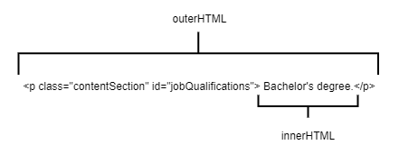
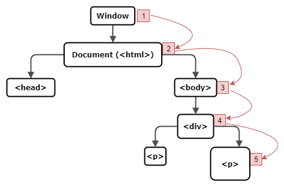

# Module - JavaScript

This module introduces JavaScript, the DOM, and AJAX.

## Table of Contents

* [JavaScript for Aura Component Developers](#javascript-for-aura-component-developers)
* [JavaScript Introduction](#javascript-introduction)
  * [JavaScript Comments and Printing to the Console](#javascript-comments-and-printing-to-the-console)
  * [JavaScript Variables](#javascript-variables)
  * [Falsy Values](#falsy-values)
  * [JavaScript Control Flow](#javascript-control-flow)
* [Running JavaScript in HTML](#running-javascript-in-html)
* [The JavaScript Browser Console](#the-javascript-browser-console)
* [The DOM](#the-dom)
* [Events and Event Listeners](#events-and-event-listeners)
  * [Event Propagation](#event-propagation)
  * [Adding and Removing Event Listeners](#adding-and-removing-event-listeners)
* [The Event Object](#the-event-object)
* [AJAX](#ajax)
* [Out of Scope](#out-of-scope)

### Helpful References/Links

* [JavaScript Data Types (w3schools)](https://www.w3schools.com/js/js_datatypes.asp)
* [Data types (JavaScript.info)](https://javascript.info/types)
* [JavaScript String Reference (w3schools)](https://www.w3schools.com/jsref/jsref_obj_string.asp)
* [JavaScript Array Reference (w3schools)](https://www.w3schools.com/jsref/jsref_obj_array.asp)
* [JavaScript HTML DOM (w3schools)](https://www.w3schools.com/js/js_htmldom.asp)
* [HTML DOM Events (w3schools)](https://www.w3schools.com/jsref/dom_obj_event.asp)
* [Equality comparisons and sameness (MDN web docs)](https://developer.mozilla.org/en-US/docs/Web/JavaScript/Equality_comparisons_and_sameness)
* [Comparison operators (MDN web docs)](https://developer.mozilla.org/en-US/docs/Web/JavaScript/Reference/Operators/Comparison_Operators)
* [Conditional (ternary) operator (MDN web docs)](https://developer.mozilla.org/en-US/docs/Web/JavaScript/Reference/Operators/Conditional_Operator)
* [JavaScript Arithmetic (w3schools)](https://www.w3schools.com/js/js_arithmetic.asp)
* [JavaScript Break and Continue (w3schools)](https://www.w3schools.com/js/js_break.asp)
* [for...in (MDN web docs)](https://developer.mozilla.org/en-US/docs/Web/JavaScript/Reference/Statements/for...in)
* [for await...of (MDN web docs)](https://developer.mozilla.org/en-US/docs/Web/JavaScript/Reference/Statements/for-await...of)
* [JavaScript HTML DOM Elements (Nodes) (w3schools)](https://www.w3schools.com/js/js_htmldom_nodes.asp)
* [The HTML DOM Element Object (w3schools)](https://www.w3schools.com/jsref/dom_obj_all.asp)
* [The XMLHttpRequest Object (w3schools)](https://www.w3schools.com/xml/dom_http.asp)
* [JSON - Introduction (w3schools)](https://www.w3schools.com/js/js_json_intro.asp)
* [JavaScript and HTML DOM Reference (w3schools)](https://www.w3schools.com/jsref/default.asp)
* [JavaScript (MDN web docs)](https://developer.mozilla.org/en-US/docs/Web/JavaScript)


## JavaScript Introduction

JavaScript (JS) is the main scripting language of the web - it's used for client-side functionality 
by a great deal of websites and can be interpreted by all major browsers. The language drawn from 
concepts of the C language, can be used for object-oriented, functional, or procedural programming, 
and was built mainly for modifying and interacting with the DOM (both the HTML elements and their 
associated CSS; we will discuss this in more detail later) on the client-side. As such, JS cannot 
normally be run outside of a web browser. We do have frameworks such as Node.js that were created 
to allow JS to be executed outside of a browser, however. In our studies, we will only deal with 
this language within the browser.

JS is case-sensitive, loosely typed, and dynamically typed. Loose typing means that we don't 
declare the type of a variable when declaring said variable. Dynamic typing means that the type of 
the variable is determined at runtime (instead of compile time) and can change throughout the program 
with implicit conversion. Lastly, JS is an interpreted language. Compiled languages (such as C) have 
a compiler - a sort of middleman translator that breaks the language down into machine code that can 
be understood and run by the processor; while interpreted languages can be read and run one line at 
a time by the interpreter (the browser in the case of JavaScript).

### JavaScript Comments and Printing to the Console

JS has single-line and block comments, with single line comments prepended by // and block comments 
wrapped within /* and */. The console.log() function allows us to print output to the console.

### JavaScript Variables

JavaScript variables, containers used to store values, are not declared with data types, but 
they are declared with one of three scope-enforcing keywords: var, let, and const. In non-strict 
JS, variables declared without a scope default to var, which gives either global or function 
scope depending on where the variable is defined. If the var variable is defined outside of any 
function, it has global scope and can be referenced anywhere within the file. If it is defined 
within a function, it has function scope and can be referenced anywhere within that function, but 
not outside of it. Variables declared with the let keyword can have block scope, meaning that they 
can be referred to in the block of code that declares them and any inner code blocks. Const can also 
enforce block scope, but cannot have its value changed after initial assignment (this rule gets a 
little funky with objects - we cannot assign a different _object_ to a const variable, but we can 
change the _properties_ of an object assigned to a const variable).

Although we do not declare data types for variables, JS still has data types. There are six 
primitive types: string, boolean, number, undefined, symbol, and null. Strings can be enclosed in 
either single or double quotes. Booleans again take true or false values. Numbers can have 
decimals, but are not required to - in contrast to some other languages, JS has just one data type for 
all numbers. Variables take an undefined value if they are not assigned a value when they are 
declared. The symbol data type is mostly used for the keys corresponding to an object's properties. 
Finally, the null type is similar to undefined except that it is explicitly assigned. All variables 
that do not hold one of these six primitive types are objects.

In order to determine a variable's type, we can use the typeof operator (except for the null type, 
where the typeof operator is a dirty liar), as below:

```
    var a = 5;
	var b;
	var c = null;
	
	//will print 'number'
    console.log(typeof(a));
	
	//will print 'undefined'
	console.log(typeof(b));
	
	//will print 'object'
	console.log(typeof(c));
```

### JavaScript Objects

The JS object type includes collections, which are either arrays or objects, (yes objects are part 
of, but not the entirety of, the object data type; for clarity, we will henceforth refer to these 
more specific objects as key-value objects), and functions. Arrays are zero-indexed lists of 
elements that can contain comma-separated values of different primitive or object data types. 
JS arrays have dynamic size. Arrays can be initialized with or without values and with square 
brackets or the Array constructor (although the latter is not considered a best practice); see below:

```
    var myArray = [];
    var myArray2 = [1, '2', 3];
```

The length of an array can be found through its length property.

We will almost always declare key-value objects with the object literal, i.e. curly braces, 
optionally with comma-separated key-value pairs, which are themselves colon-separated. Their 
values are accessed through dot notation (if the key is a symbol) or square brackets (if the key 
is a string literal) and can be either properties (i.e. variables) or methods (i.e. functions). 
Let's take a look at an example:

```
    var myObj = {};
    var myObj2 = {key1: 1, "key2": 2};
    console.log(myObj2.key1);
    console.log(myObj2["key2"]);
```

Lastly, functions are code blocks written to perform certain logic. They can be defined separately, 
with the function keyword, then a name, parameters in parentheses, and opening and closing curly 
braces. But they can also be assigned as values to variables, in which case a name is not included 
in the function declaration and they are classified as anonymous functions (because of the lack of 
a declared name). Take the following example:

```
    function myFunc(){
    }
    var myFunc2 = function(){
    };
```

### Falsy Values

Falsy (or falsey) values are those that evaluate to false in a conditional expression. There are 
six falsy values in JS: false (pretty unexpected, right?), 0, empty string (either '' or "" because 
the language accepts either single or double quotes), null, undefined, and NaN (which paradoxically 
is a number). Every other value in JS is truthy - 1, -2, "a", true, etc.

### JavaScript Operators/Comparison_Operators

[Check out this link for more info about operators!](https://www.w3schools.com/js/js_operators.asp)

### JavaScript Control Flow

Since we've just talked about values in conditional expressions, it's a great time to talk about 
control flow in JS. Control flow allows us to skip certain lines of code/only execute certain code 
or repeat code. 

An if statement evaluates the code wrapped in parentheses to either true or false. If true, the 
code block is executed. If false, nothing is executed.

```
if(conditionToTestIfTrue) {
		//code to be executed here
	}
```

You will often see an if statement used in combination with an else clause. An else clause is a 
fallback to an if statement and will only get executed if the previous if statement is false.

```
if(conditionToTestIfTrue) {
		//code to be executed here
	} else {
		//code to execute if condition was false
	}
```

Ff statements can also be combined with an else if clause. This is like an else statement, but 
with its own condition. It will only run if its condition is true, and the previous statement's 
condition was false.

```
if(conditionToTestIfTrue) {
		//code to be executed here
	} else if(conditionToTestIfTrue) {
		//code to execute if first condition was false
	} else {
		//code to execute if both were false
	}
```

The ternary operator is used as a shortcut for the if-else statement. This operator tests a 
condition; if the condition is true, it returns a certain value, otherwise it returns a different 
value:

```
	conditionToTest ? valueToBeReturnedIfTrue : valueToBeReturnedIfFalse
```


The switch statement begins with the switch keyword, followed by the tested expression in 
parentheses and the opening and closing curly braces. Within the curly braces, each value is 
preceded by the case keyword and succeeded by a colon and an inner code block. If the inner code 
block does not end in a break statement, the code will continue execution until it reaches a break 
statement. The default keyword will run its code block of no other case matches. See the code below 
for an example:

```
    var orderNumber = 1;
    switch(orderNumber){
        /* the switch expression has been evaluated (it's only evaluated once) and the 
        value 1 has replaced the expression orderNumber for equality checks */
        
        case 1:
            console.log('Ordered a hot dog.');
        case 2:
            /* perhaps we are running a promotion where every hot dog comes with a 
            free side of fries, in which case we would not want to have the first case
            end in a break statement */
            console.log('Ordered fries.');
            break;
        case 3:
            /* the break statement after the second case ensures that any number 1 or
            2 orders will not continue execution into this case */
            console.log('Ordered a hamburger.');
            break;
        default:
            console.log('Unknown order.');
    }
```

### Loops

Example of a 'for' loop. We define a variable to be used to increment, the evaulation, and then 
define our increment itself.

```
    var myArray = [];
    for(let i=0; i < myArray.length; i++){
        // iteration code
    }
```

Example of a 'while' loop. Notice we have to increment inside the loop or we could potentially 
create an infinite loop.
```
    var a = 0;
    while(a < 5){
        // iteration code
        a++;
    }
```

Example of a 'do-while' loop. Notice how we alsways run the loop once no matter what in our 
'do' block. Then we evaluate if we should continue with 'while'.
```
    var b = false;
    /* because b is false, this do-while loop will only execute once and stop
    iterating once it checks its condition after the first execution */
    do{
        // iteration code
    } while(b);
```

Example of a 'for-of' loop. This will iterate over iterable objects. 
```
    const array1 = ['a', 'b', 'c'];

	for (const element of array1) {
	  console.log(element);
	}

	// expected output: "a"
	// expected output: "b"
	// expected output: "c"
```

Example of a 'for-in' loop. This iterates over all enumerable properties of an object.
```
	const object = { a: 1, b: 2, c: 3 };

	for (const property in object) {
	  console.log(property + ': ' + object[property]);
	}

	// expected output:
	// "a: 1"
	// "b: 2"
	// "c: 3"
```


## Running JavaScript in HTML

We have three ways to make use of our JavaScript in HTML: inline, internally, or externally. We 
write inline code by adding it to the appropriate event attribute of the opening tag of an HTML 
element. Although it is common for the values of these attributes to be function calls, we can 
define all of the desired functionality in the tag (our code is not enclosed within a function if 
we do this). See the following button with an output statement tied to the onclick attribute:

```
    <button type="button" onclick="console.log('button clicked');">Hey, I'm a button!</button>
```

Internal and external JavaScript both make use of the \<script\> tag (a non-self-closing tag). 
With internal code, we define our functions in between the opening and closing \<script\> tags and 
later add function calls to our event attributes in our elements. Take the following example HTML 
file:

```
    <!DOCTYPE html>
    <html>
        <head>
            <script>
                function buttonClicked(){
                    console.log('button clicked');
                }
            </script>
        </head>
        <body>
            <button type="button" onclick="buttonClicked()">Hey, I'm a button!
            </button>
        </body>
    </html>
```

Recall that only the \<!DOCTYPE html\> line is required for all non-HTML5 pages, the rest 
(the \<html\>, \<head\>, and \<body\> tags) are just adhering to best practices.

External JS makes use of the same \<script\> tag, only this time with the src attribute of the 
tag set to the relative path to the JS file. For example, a file named buttonHandlers located in 
the same folder as our HTML page would be accessed through the tags 
\<script src="./buttonHandlers.js"\>\</script\> (all JS files end with the .js extension). 
It is advisible to keep our code external to our markup if we use the same logic in many different 
webpages, or if we simply want to keep our markup file as short and readable as possible.

We can use as many \<script\> tags, for either internal or external logic, as we would like to 
throughout our HTML file in the file's head, body, or both. However, because our HTML pages load 
sequentially, we may want to include all JS scripts at the end of our pages so that our 
visible elements can load first and the page does not appear slow to the user.

We could alternatively use the 'defer' attribute, like in our example below. 
This will ensure that the script is only run after the page has finished parsing and will function 
the same as placing our scripts at the end of the body. We also have the 'async' option. This will 
download the script in parallel to parsing the page, and then execute as soon as it's available. 
Your use case will determine the method you use.

```
<head>
	<title>My Title</title>
	<meta charset="utf-8">
	<meta name="description" content="Place the meta description text here.">
	<meta name="viewport" content="width=device-width, initial-scale=1.0">
	<link rel="stylesheet" type="text/css" href="path/to/css/file">
	<script src="demo_defer.js" defer></script>
</head>
```

## The JavaScript Browser Console

As we stated earlier, all modern browsers can interpret JavaScript code. This is why we include our JS 
in an HTML page to test it - when we open the HTML page, it will open in our default browser, which has a 
JS console in which we can execute our functions through direct function calls. To open up the JavaScript 
console in Chrome, click the button enclosed in the top red rectangle in the first below image, hover over 
More tools, then select Developer tools (enclosed in the lower red rectangle; you could also use the 
shortcut shown in the picture). The second below image shows the console that will be opened, through which 
we can call functions as shown.

<p align="center"></p>

<p align="center"></p>

To open a similar console in Firefox, click the button in the top red rectangle in the first following picture, then Web Developer (enclosed in another red rectangle), and finally Web Console (surrounded by a red rectangle in the second picture below). Other browser's consoles can be found through comparable paths, but we will not address those here - particularly for those weirdos who use Brave, they're on their own.

<p align="center"></p>

<p align="center"></p>

## The DOM

The Document Object Model (DOM) is the World Wide Web Consortium (W3C) standard for accessing documents - there is a core DOM, an XML DOM, and the HTML DOM. The last one will be our focus here - it's how our JavaScript can interact with and manipulate our HTML and CSS. In the HTML DOM, the Document is the html page/browser, the Objects are the elements in that page, and the Model is the way in which we access, interact with, change, add, and delete our elements. The DOM for any given HTML page can be represented by an object tree with individual nodes for each object. The root of this tree is the document object, i.e. the \<html\> tag (the window object represents the browser and contains the entire document). Let's write an example HTML file and then represent its DOM below (we'll refer back to this file throughout the remainder of this section):

    <!DOCTYPE html>
    <html>
        <head></head>
        <body>
            <div class="contentBlock">
                <p class="contentSection" id="jobDescription"></p>
                <p class="contentSection" id="jobQualifications"></p>
            </div>
        </body>
    </html>

<p align="center"></p>

We can access elements within the DOM through the getElementById, getElementsByClassName, and getElementsByTagName document methods. We enclose the desired property in quotes in each desired method call. For example, document.getElementById("jobDescription") would return the above paragraph element whose id is jobDescription. getElementsByClassName and getElementsByTagName return collections of HTML elements fitting the prescribed condition.

Additionally, we can retrieve objects through querySelector, which allows us to filter by id or class and/or tag utilizing CSS selector syntax. For example, document.querySelector("#jobDescription") and document.querySelector("p.contentSection") will return the above paragraph element whose id is jobDescription and the above paragraph elements that have the contentSection class, respectively.

Once we've retrieved the reference to the element, we can edit its innerHTML, which holds the markup between the tag, or outerHTML, which holds the entire element (including the markup between the tags). See below for further clarification.

<p align="center"></p>

[We have more options available than just innerHTML! Check out these differences!](https://dev.to/developertharun/javascript-dom-part-4-innerhtml-vs-innertext-vs-textcontent-video-article-1b90)

## Events and Event Listeners

Events are actions that happen inside the browser. These include user interaction, such as the click of a button or moving the mouse, as well as occurrences that are not directly caused by the user, such as a page finishing loading or the completion of a CSS animation. As we stated previously, the HTML DOM defines how we access, interact with, change, add, and delete elements. Many of these changes happen in response to events through event listeners, functions that are added to HTML elements, wait for an event to happen, and then react to and handle its occurrence. We add/remove event listeners in JS through use of the addEventListener and removeEventListener functions, respectively, both of which are methods of all DOM objects. As the existence of these methods would suggest, we do not have to declare event listeners in our HTML file, we can reserve that responsibility for our JS. We also have the ability to dynamically change which event listener is handling which event throughout the lifetime of our page. We will discuss the parameters of these methods and demonstrate their use shortly, after we address event propagation.

### Event Propagation

Event propagation is the order in which elements are able to handle events after they occur. There are two main methods of event propagation: bubbling and capturing - these correspond to an event's phases. When a DOM event happens, it goes through three phases. First is the capturing phase, in which the event travels down to the source element, where the event occurred (such as the button that was clicked), from the root of the DOM tree. Second is the target phase; it acts like a sort of bridge between the other two phases and occurs when the event is at the source element. The last phase is the bubbling phase, where the event moves from the source element back up to the root of the DOM tree.

In bubbling propagation, event listeners act in the target and bubbling phases - the source element gets first crack at handling the event and then any outer elements may handle the event in order as it travels up the DOM tree. In capturing, on the other hand, handlers fire in the capturing and target phases - the root element is first in line to handle the event, and then any inner elements may respond to the event as it moves down the object tree. Bubbling is much more common than capturing - it is the default method of event propagation. In fact, the capturing phase is usually obfuscated from us.

Let's take a look at figures of the order in which elements in the HTML file from The DOM section handle an event that occurs in one of the paragraph elements; first in bubbling (the first image below) and then in capturing (the second image below).

<p align="center"></p>

<p align="center"></p>

### Adding and Removing Event Listeners

Now that we have discussed propagation, we can return to the addEventListener and removeEventListener methods. Each take three parameters: the type of event to be handled, the code to execute when the event occurs (usually this is a function call, but it does not have to be - it can be an anonymous function; however, a function call is preferred to promote abstraction and code reusability), and whether to use capturing or bubbling. The third parameter, useCapture, is a boolean that defaults to false, meaning that bubbling is the default propagation method. It is common practice to pair these methods with the DOM selection methods we touched on earlier in order to retrieve and add/remove listeners easily. Let's look at some examples of these methods using elements from our HTML file we wrote in The DOM section:

    document.querySelector("div.contentBlock").addEventListener("mouseover", handleDivHover);
    document.querySelector("#jobDescription").addEventListener("mouseover", handleParHover);
    document.querySelector("#jobDescription").removeEventListener("mouseover", handleParHover);

**Note**: We do not follow up the function names with parenthesis as we do not want to call it yet, just provide the reference to it.

Let's take note of some things about the above code. First, because the third parameter in both methods has a default value, we don't have to specify an argument for it unless we want to use capturing instead of bubbling. Second, the events in our method calls differ from their corresponding attributes in HTML elements in that the "on" is removed - e.g., the event in our above code is "mouseover" instead of "onmouseover." Lastly, because we are using bubbling, when a user moves the mouse over the paragraph element with the jobDescription id, the handleParHover() method will be called first, followed by the handleDivHover() method. This correlates to the order in which the event arrives at the corresponding elements in the target and bubbling phases (assume that we have defined the handleParHover() and handleDivHover() methods elsewhere).

## The Event Object

JS has an Event object from which all other event objects (such as the KeyboardEvent object) inherit, giving common properties and methods to all events. Here, we will detail those methods and properties that assist us in stopping and cancelling events. The stopPropagation() and stopImmediatePropagation() functions end an event's journey through the object tree. stopPropagation() does not allow any other elements to handle the event - i.e. if we are in the capturing phase and an event listener calls this method, no children of the element holding that event listener can handle that event in the remainder of the capturing phase and no elements _period_ can handle the event in the bubbling phase. stopImmediatePropagation() is even more restrictive: in addition to performing the functionality of stopPropagation(), this method also prevents any not-yet-fired handlers on the element that holds the handler calling this method from firing. In contrast, cancelBubble() only stops the bubbling phase of an event.

Lastly, the cancellable property returns a boolean value that indicates if we can cancel an event's default action, at which point we can call the preventDefault() method to stop that action. Note that preventDefault() does not stop event propagation; it only stops the automatic action associated with the HTML element, such as a redirect to a url from an \<a\> element.

## AJAX

Our last major section in this module is about Asynchronous JavaScript and XML, commonly referred to as AJAX. As the name would suggest, AJAX is a protocol for asynchronous communication between the client-side webpage and a server. Let's look at an example JS function that makes an AJAX request to the balldontlie API and returns Kevin Durant's three-point shooting percentage for the 2018 season. We'll explain each line of code as we work our way through it:

    function get3PT(){
        var xhr = new XMLHttpRequest();
        xhr.onreadystatechange = function(){
            if(this.readyState == 4 && this.status == 200){
                console.log(returnedObject.data[0].fg3_pct);
            }
        }
        xhr.open("GET", "https://www.balldontlie.io/api/v1/season_averages?" + 
            "season=2018&player_ids[]=140", true);
        xhr.send();
    }

The XMLHttpRequest (XHR) object is the heart of our AJAX request, it's common to abbreviate our instantation of this object as xhr.

Each XHR object has an onreadystatechange property that holds a function that is called when the XHR 
object's readyState property, which indicates the current status of our request, changes. A table 
explaining the various readyState values is included later in this section, after we have further defined 
relevant methods, but a readyState value of 4 means that our request has completed and we have received a 
response from the server. A HTTP status code of 200 means "OK", corresponding to a successful request.

So the anonymous function assigned to the object's onreadystatechange property first checks for a completed and successful call, then executes logic to handle the returned response. In the case of our example, the balldontlie API returns its response in the form of a JSON object (we will not detail JavaScript Object Notation, or JSON, here, but it looks a lot like a JS object literal except all keys/names must be in double quotes). We parse this object for the value that we want - Kevin Durant's 2018 three-point field goal percentage - and log it to the console. Again, the function isn't called when it's defined, rather it's called every time the readyState property of the XHR object changes - no extra work required from us.

The XHR object's open() method creates our request. In total, this function can take five parameters. The first is the HTTP method to use ("GET" in our example). The second is the URL endpoint where our request should be sent. The third is a boolean value indicating whether the request should be asynchronous. Our value of true declares that the request should be asynchronous and this is commonplace - most, if not all, of our use cases for AJAX require or benefit from asynchronicity. The fourth and fifth parameters are a username and password for the server, because the balldontlie API is a public API that does not require authentication, we do not need to specify values for these variables in our example.

Optionally, we can use the setRequestHeader() method to set our request's header values after the request has been initialized with the open() function. setRequestHeader() takes two parameters, a label and a variable, and is commonly used for purposes such as specifying the data format of our request. Finally, the send() method makes the server call.

| readyState | Meaning | When It Occurs |
| ---------- | ------- | -------------- |
| 0 | Not Initialized | After the XMLHttpRequest object has been instantiated, but before object's open() method has been called |
| 1 | Set Up | After the object's open() method has been called, but before its send() method has been called |
| 2 | Sent | After the object's send() method has been called, but before a line of communication has been established with the server |
| 3 | In Process | After communication with the server has started, but before the full response has been received from the server |
| 4 | Completed | After the full response has been received from the server |

To summarize: AJAX allows our JS to make a server call (through the send method), parse the server's response, and optionally update our HTML page with data from that response (the latter two through our onreadystatechange function). Once the request has been sent, our code continues execution _because_ it is asynchronous - it doesn't spend time waiting around for the server to reply.

## Out of Scope

Our JavaScript introduction is not meant to be comprehensive. 
As such, there are many topics related to our studies that we did not discuss because they were out of the 
scope of this module. However, your author always seeks to be as helpful as possible, so links to 
documentation on some of these topics are included in the Helpful References/Links section. Let's touch on 
them and briefly explain some other topics.

First, useful string and array methods that we did not talk about in the JavaScript Variables section can be 
found at the JavaScript String Reference (w3schools) and JavaScript Array Reference (w3schools) links, 
respectively.

When discussing falsy values in the appropriately named Falsy Values section, we neglected to say that null 
and undefined values are only equal to other null and undefined values, respectively. In addition, NaN is 
not equal to any value, not even itself.

In our DOM sections, we did not talk about other ways to manipulate the DOM including creating, inserting, 
removing, and appending elements or getting the parents, siblings, or children nodes of an object on the DOM 
tree, information about these topics can be found at the JavaScript HTML DOM Elements (Nodes) (w3schools) 
and The HTML DOM Element Object (w3schools) references, respectively.

Additional methods and properties of the XMLHttpRequest object can be found at The XMLHttpRequest Object 
(w3schools). Some further information about JSON is located at JSON - Introduction (w3schools).

JS has no single authoritative documentation source. But this is not to say that there is not good 
documentation to be found. A couple particularly good websites are w3schools (see the JavaScript and HTML 
DOM Reference (w3schools) link) and the MDN web docs (see JavaScript (MDN web docs)); w3schools is your 
author's personal preference for a quick cheatsheet.

Some final words of caution: don't use the document.write() method or the eval() method; document.write() 
erases and replaces any existing DOM elements and eval() is a door to malicious code injection.

Alright, now go forth and script!