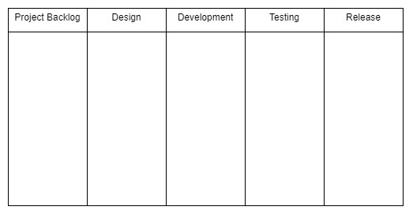

# Module - SDLC

## Software Development Lifecycle

- <mark>The Software Development Lifecycle (SDLC) is the series of steps that we go through when creating software</mark>
- Within SDLC, we have both methodologies and frameworks
  - Methodologies are categories of development concepts and practices
  - Frameworks are specific implementations of a methodology’s concepts
- The SDLC has 8 steps
  1. <mark>Requirements gathering</mark>
  2. <mark>Analyzing Requirements</mark>
  3. <mark>Design</mark>
  4. <mark>Development</mark>
  5. <mark>Testing</mark>
  6. <mark>User Acceptance Testing (UAT)</mark>
  7. <mark>Release</mark>
  8. <mark>Maintenance</mark>
- We can divide these 8 steps into 3 phases
  - The design phase (where we gather/analyze requirements and design our solution)
  - The development phase (where we develop the product, test it, and undergo UAT)
    - In UAT, the end client (or someone acting as them) manually testing our product to ensure that it fulfills their needs
    - UAT is useful because it can often surface bugs that our test code may not have caught and ensure client satisfaction
  - The delivery phase (where we release the product and maintain/support it)
 
> Mnemonic for the 8 steps: __RADDTURM__
 
## Big Bang Methodology

- The Big Bang methodology doesn’t have any specific practices, rather practitioners jump straight in to project development
- While it’s simple, flexible, and requires little planning, it’s not appropriate for anything beyond small projects
- The lack of planning can lead to a lack of understanding of requirements and time sinks where features may take longer than necessary to create or even need to be created multiple times because of nonexistent planning
 
## Waterfall Methodology

[SDLC - Waterfall Model (tutorialspoint)](https://www.tutorialspoint.com/sdlc/sdlc_waterfall_model.htm)

- <mark>Waterfall is rigid methodology that follows the SDLC steps strictly in order, never returning to a previous step</mark>
  - Like a natural waterfall, <mark>development using this methodology only flows in one direction</mark>
  - e.g., once development has started, Waterfall practitioners accept no new requirements from the client
- Benefits
  - <mark>Waterfall does not require any specific procedural knowledge</mark> - developers simply proceed from one step to the next
  - <mark>There’s a clear barrier between each step in the development, so it’s easy for developers to keep track of where they are in the project</mark>
    - e.g., when we’re moving from development to testing, we’ll have the full set of features that need to be tested, so we won’t have to worry about any new features popping up that need testing
  - <mark>Because we gather all requirements at the beginning of the project and finish designing before moving into development, we have an idea of what will look like before we begin developing it</mark>
- Drawbacks
  - <mark>Waterfall doesn’t involve the client between the gathering of requirements and the release of the product - this can make it difficult to ensure that the product being developed is what client wants</mark>
  - If we’re adhering to true Waterfall principles, <mark>it’s difficult to make changes because we can’t return to previous steps</mark>
  - <mark>When following Waterfall, developers don’t test until development has finished, meaning that a bug/problem that may have existed for months won’t be found until the entire project is entering the testing step</mark>
 
## Agile Methodology

[SDLC - Agile Model (tutorialspoint)](https://www.tutorialspoint.com/sdlc/sdlc_agile_model.htm)

- <mark>Agile is a more flexible methodology that allows developers to adapt to changing requirements and feature requests from the client</mark>
- Rather than going through each step in SDLC only once, we go through multiple iterations of the design, development, and release phases, with each iteration culminating in a release of part of the product
- Benefits
  - <mark>Allows us to adapt to changing/new feature requests from the client</mark>
    - We don’t need to set have a full set of requirements for the end product when starting a project
  - <mark>Lends itself to flexible release schedules</mark> - any feature that can’t be included in the next release can be made a part of a future release
  - <mark>Because we’re testing a smaller set of features at any given time and testing more frequently, we can catch any bugs in a shorter amount of time</mark>
- Drawbacks
  - <mark>Flexibility can lead to bad practices if we’re not disciplined</mark>
    - e.g., developers may be tempted to avoid fully designing their solutions before starting development because they know that they can return to the design phase later
  - <mark>Agile’s flexibility can also lead to a lack of predictability</mark> - new feature requests can come from the client throughout the development of the project
  - <mark>Following Agile practices requires specialized knowledges of those practices and a commitment from every developer on the team</mark>
 
### The Scrum Framework

[Scrum - Framework (tutorialspoint)](https://www.tutorialspoint.com/scrum/scrum_framework.htm)

- <mark>Scrum is a framework of the Agile methodology that includes ceremonies such as daily standups and retrospectives</mark>
- <mark>Scrum practitioners in to 2 to 4 week sprints that each culminate in a release</mark>
- The framework includes values such as
  - Commitment, where each team member dedicates themselves to following Scrum practices and helping the team achieve its goals
  - Courage, where team members don’t shy away from difficult tasks and aren’t afraid to be honest about any roadblocks they’re facing
  - Focus, meaning that developers concentrate on the features being developed in the current sprint
Openness, so that developers are open with each other about any challenges or difficulties that they encounter
  - Respect, meaning that everyone respects the opinions and contributions of each member of the team
- The Scrum environment includes a Scrum Master and Product Owner
  - <mark>The Product Owner represents and communicates with the customer</mark>
    - They use the information gathered from the customer to create the product backlog and prioritize the tasks within it
- <mark>The Scrum Master ensures that the team is following and committed to Scrum ceremonies</mark>

- Before the sprint beings, the team moves some requirements from the project backlog (which is list of all of the requirements for the entire project) to the sprint backlog (the list of features that team is planning complete in the upcoming sprint)
- Throughout the sprint, the Scrum Master will lead <mark>15 minute daily standups</mark>
  - Daily meetings where each team member will talk about what they did the previous day, their plans for the coming day, and any roadblocks they’ve run into
  - The standup allows each team member to have an idea of how the project as a whole is progressing
  - It allows for a set time where developers can ask their peers, who may have expertise and experience in a specific area, for help with any issues that they’ve run into
- After the product is released at the end of each sprint, the team holds a final Scrum ceremony - the <mark>retrospective</mark>
  - Teams put any unfinished tasks back into the project backlog
  - Discuss what went well in the sprint and how to continue that success, as well as what was unsuccessful and how to improve on those shortcomings in future sprints
- Benefits
  - <mark>Daily standups allow us to quickly identify any setbacks that members of the team are experiencing and solve them with the help of others</mark>
  - <mark>The relatively short sprints allow for constant releases, which in turn incorporate the client and gain their feedback throughout the entirety of the development process</mark>
  - <mark>Involving the client with these releases allows us to ensure that the end product more accurately reflects the client’s desires and leads to increased client satisfaction</mark>
- Drawbacks
  - The fluidity that can be beneficial can also bring uncertainty
    - The final deadline and complete requirement list may not be known at the beginning of the project, so <mark>it can be difficult to estimate overall cost or a final release date</mark>
    - <mark>Fluidity can also result in feature creep</mark>, i.e. a continuous expansion of proposed project features
      - Because Scrum followers aren’t held to a final firm release deadline, there’s no reason to exclude certain requirements to make sure that the project is finished by a set date
      - Developers can therefore continuously add features and never truly complete the project
    - <mark>The value of Scrum ceremonies depend on the commitment of the team members</mark> - e.g. the daily standup won’t be as helpful if developers never voice any difficulties that they’ve having
 
### The Kanban Framework

[Kanban (Atlassian)](https://www.atlassian.com/agile/kanban)

- <mark>An Agile framework that implements a Kanban board, a visual representation of the progress of a project</mark>
- e.g.

- There is no firm requirement for the number of columns on a Kanban board, but we should generally have at least column per SDLC phase
- <mark>Kanban cards, i.e. visual representation of a single requirement or work item, are placed in the columns</mark>
- <mark>Team members who have completed their current task can simply refer to the board and choose a new card from the backlog to work on</mark>
- A good best practice is to ensure that there are never more tasks in progress (i.e. not in the backlog or release columns of our board) than there are developers on our team
- Benefits
  - <mark>Event-driven, removing any pressure of deadlines</mark>
  - <mark>It more easily lends itself to specialists</mark>
    - e.g. one team member can be a quality assurance tester
  - As soon as a particular task is moved into the testing column, this developer can take over the card and begin testing it
  - Specialization can result in developers gaining expertise in a single area
  - <mark>The Kanban board can always take new client requirements and is persistent throughout releases</mark>
  - <mark>The board allows the entire team to view the current state and progress of the project</mark>
- Drawbacks
  - <mark>The board’s size may grow to a point where it becomes unnecessarily complex and difficult to understand/navigate</mark>
  - Like Scrum, <mark>Kanban requires commitment from the whole team - an out-of-date Kanban board doesn’t help and can even hurt development</mark>
    - e.g. developers can end up working on the same tasks if the board is not properly
    - We can also lose our wholistic picture of the project’s progress
  - <mark>Kanban doesn’t have any timing element</mark>
    - The danger of feature creep can be larger than even that of Scrum and it can cause constant release delays or uncertainty
 
### Scrumban Framework

- An Agile framework that combines the practices of the Scrum and Kanban methodologies
- Pairs the visual representation of the Kanban board with the ceremonies and sprints of Scrum
- This can mitigate Kanban’s timing issues through the deadlines enforced by Scrum’s sprints
- It allows developers to have a better idea of how the project and sprint are progressing through the Kanban board, something they may not have with Scrum practices alone
 
### Extreme Programming (XP)

[Extreme Programming (Agile Alliance)](https://www.agilealliance.org/glossary/xp/#q=~(infinite~false~filters~(postType~(~'post~'aa_book~'aa_event_session~'aa_experience_report~'aa_glossary~'aa_research_paper~'aa_video)~tags~(~'xp))~searchTerm~'~sort~false~sortDirection~'asc~page~1))
[The Benefits and Pitfalls of Pair Programming in the Workplace (freeCodeCamp)](https://www.freecodecamp.org/news/the-benefits-and-pitfalls-of-pair-programming-in-the-workplace-e68c3ed3c81f/)

- <mark>An Agile framework that incorporates a variety of procedures to ensure that developers are adhering to its values of communication, simplicity, feedback, courage, and respect</mark>
- The variety of procedures to follow can themselves end up taking away the framework’s simplicity
- <mark>XP seeks to go beyond improving product quality by also improving team cohesion and the lives of individual team members</mark>
- It includes practices such as <mark>weekly cycles</mark> (i.e. one-week sprints), <mark>quarterly cycles</mark> (i.e. quarterly releases), <mark>continuous integration, incremental design, test-driven development, and paired programming</mark>
- Incremental Design
  - Initially offer only a high-level, general design of proposed features and leave the specifics for later
- Test-Driven Development (TDD)
  - The practice of designing the tests that our code must pass before writing the actual code (in contrast to writing the code and then writing tests)
  - TDD can beneficial because it allows us to have a clearer understanding of what our program must accomplish at the outset
  - But we should be careful and ensure that we aren’t writing test-specific code, i.e. that our code can handle a variety of input and isn’t just tailored to the specific cases that we’re testing
- Paired Programming
  - A development approach where teams where are broken into groups of two developers
  - Each group includes a pilot and a navigator
  - The pilot is actively writing code, while the navigator is planning how the code that the pilot is writing will tie into the larger project code base
  - Although it might seem like paired programming will lengthen our development time because we have two people writing a single of code, it can be beneficial for us because
    - A second pair of eyes can quickly help catch any bugs or syntax issues
    - A more experienced (whether they’re the pilot or navigator) can teach the other and help them grow and improve
    - The pair can collaborate and tailor their focus to specific tasks (e.g. the pilot may not have to worry about how their code will tie into the larger project, because the navigator will be focusing on that)
  - XP team includes a customer in order to fulfill a goal of faster feedback
- Benefits
  - <mark>The close relationship to the customer</mark>
    - It almost or entirely eliminates the danger of sunk costs due to time spent developing that the client later decides they want changed or no longer want/need
  - XP’s use of paired programming can <mark>increase the development team’s cohesion, openness, and commitment to each other</mark>
  - Even though the pace can be stressful, <mark>the brief development periods can result in a quick delivery of working solutions</mark>
- Drawbacks
  - <mark>With the wide variety of development practices that it has, XP can be difficult for even the most dedicated teams to follow</mark>
  - The involvement of the client of the client on the development team can be a hindrance - non-technical clients can insist on inefficient implementations or question logically-sound approaches
  - <mark>XP’s weekly cycles are short enough that they can cause developers to sacrifice best practices in order to ensure that they’re making weekly deadlines</mark>
    - Frequent iterations and incremental design can cause developers to not revisit their solutions to refactor or increase efficiency, rather they may simply <mark>write a solution that clears the bar set by customer requirements and leave it as is</mark>
- <mark>These shortly weekly cycles can mean that any documentation can quickly become out-of-date</mark>
 
## Planning with Agile Development

[Story points and estimation (Atlassian)](https://www.atlassian.com/agile/project-management/estimation)

**User Story**: an individual feature of/requirement for a project in Agile development.

**Epic**: a group of related features that are broken down into multiple user stories.

**Story Points**: a level of difficulty assigned to a user story, through use of a sequence of numbers that increase with increasing user story difficulty.

**Velocity**: the sum of story points of all user stories completed during a sprint. Velocity allows Agile teams to more accurately predict how many user stories they can complete in future sprints.

### Agile Planning

- At the beginning of a project we’ll break down client requirements into epics and then break those epics into individual user stories
  - If we’re working with a Kanban board, we’ll put each user story on the backlog in our board
- Then at the beginning of a sprint (if we’re implementing Scrum, Scrumban, or XP), we’ll take a subset of user stories from the project backlog and assign them to our sprint backlog
- We’ll do so after having assigned story points to the individual stories
  - e.g. using the Fibonacci sequence
    - 1 will be the absolute easiest task
    - 2 the next most difficult
    - Followed by 3, 5, 8, etc.
  - Once we’ve assigned story points, we can use them to come up with a time estimate
  - Assigning story points and time estimates accurately is something takes practice
    - We need experience to gain a solid understanding of story difficulty, so we shouldn’t be discouraged if our initial attempts aren’t completely accurate
    - Even though our estimates may not be perfect, they’ll still be valuable for us because they’ll give us a better idea of which tasks and requirements have certain difficulties, so that we’ll able to plan future sprints
 
## Beneficial Waterfall Situations

- Waterfall is still used situations that have a strict deadline for a release date and strict budgetary constraints
  - e.g. government agencies/departments that are under pressure from legislators to stick to an allocated budget and fulfill requests within a set time frame
