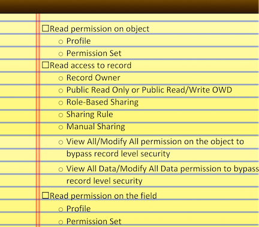

# Module - Security & Access

This module introduces org-level security, as well as the Salesforce security and sharing model.

## Table of Contents

* [Security in a Cloud Environment](#security-in-a-cloud-environment)
* [Salesforce Security](#salesforce-security)
* [Entering the Building](#entering-the-building)
* [Permission Sets](#permission-sets)
* [Feature Licenses](#feature-licenses)
* [Org Level Security](#org-level-security)
* [Data Security Motivations](#data-security-motivations)
* [Object Level Security](#object-level-security)
* [Record Ownership](#record-ownership)
* [Record Level Security](#record-level-security)
  * [OWDs](#owds)
  * [Role Hierarchies](#role-hierachies)
  * [Role-Based Sharing](#role-based-sharing)
  * [Public Groups](#public-groups)
  * [Sharing Rules](#sharing-rules)
  * [Manual Sharing](#manual-sharing)
  * [Apex Sharing](#apex-sharing)
  * [Detail Sharing Settings](#detail-sharing-settings)
  * [Sharing Overrides](#sharing-overrides)
  * [Record Level Security Conclusion](#record-level-security-conclusion)
* [Field Level Security](#field-level-security)
* [Operations](#operations)

### Helpful References/Links

* [Salesforce Security Guide](https://developer.salesforce.com/docs/atlas.en-us.securityImplGuide.meta/securityImplGuide/salesforce_security_guide.htm)
* [Control Who Sees What (Salesforce Help)](https://help.salesforce.com/articleView?id=security_data_access.htm&type=5)
* [Licenses Overview (Salesforce Help)](https://help.salesforce.com/articleView?id=users_licenses_overview.htm&type=5)
* [Object Permissions (Salesforce Help)](https://help.salesforce.com/articleView?id=users_profiles_object_perms.htm&type=5)
* [Salesforce Data Security Model - Explained Visually (Salesforce Developers Blog)](https://developer.salesforce.com/blogs/developer-relations/2017/04/salesforce-data-security-model-explained-visually.html)
* [Sharing Default Access Settings (Salesforce Help)](https://help.salesforce.com/articleView?id=sharing_model_fields.htm&type=5)
* [Filter Operators Reference (Salesforce Help)](https://help.salesforce.com/articleView?id=filter_operators.htm&type=5)
* [Transferring Records (Salesforce Help)](https://help.salesforce.com/articleView?id=data_about_transfer.htm&type=5)

## Security in a Cloud Environment

Increased security is one of the biggest benefits that many companies see when moving from hosting and managing applications on their own servers to cloud-hosted applications. The third-parties providing the cloud services generally have much greater resources and cybersecurity expertise than an individual company. The greater resources allow for more advanced physical defenses for the data centers themselves and because the continued existence of these cloud providers depends on their ability to provide a safe service, they will generally have larger and more experienced cybersecurity teams than can be found at their customer's companies.

Because Salesforce is a cloud-based platform, it has these resources and expertise. As such, it abstracts much of its underlying protections away from us - we don't have to worry about configuring firewalls, ensuring appropriate server port access, etc. However, we must understand the use and purpose of the tools that Salesforce does not abstract - it doesn't matter if we purchase the most impenetrable vault known to man if we leave the vault door wide open.

## Salesforce Security

Before we start making headway with our material for this module, let's give a little bit of explanation for the approach we'll be taking. The security model within Salesforce is one of the most difficult concepts for people new to the platform to completely grasp and understand. The different security levels in Salesforce are friends - they don't like to be apart. As such, we often have to consider the effects of, e.g., object level security when we are discussing record level security.

Because we often have to consider those other security levels, we'll have to leave asterisks next to some of our statements. Still, it may not be entirely clear which features control which levels of security. So in an effort to make this material as easy to understand as possible, we'll take a bit of a different approach in this module. At the beginning of each of our major sections, we'll introduce our toolbox, containing the features that are at play within that specific level. When we can make statements that are always true and don't require any of those asterisks, we'll make generalizations. These generalizations aren't hasty, but rather well thought out; so we'll call them strong generalizations.

We'll also frequently refer to what we'll call the "eligible user". We'll use this term as a shorthand when we need to address some of the other security levels while they're not our primary topic at hand; note that this term will change meaning throughout our use of it, so we'll be sure to clarify its definition in each context. Finally, we'll finish this module by discussing the requirements for performing certain operations within Salesforce.

## Entering the Building

>>>
 <strong>Tools</strong>: User License, Profile
>>>

One can think of an individual Salesforce org as an apartment building where access is controlled by key fobs. We'll get to what users can do once inside the building shortly, but first let's identify the key fob in this analogy. There are two things that a user must have to login to a Salesforce org: a user license and a profile. A user license is a cap on a user's power - it's the maximum of features they can access and use.

The number and type of licenses available in any given Salesforce org are determined by the edition of Salesforce that a company purchases. Our `Trailhead Playgrounds` and `Developer Edition` orgs are of course free, but they have a limited number of licenses.

There are various types of user licenses; but the two that we'll focus on are `Salesforce` and `Salesforce Platform`. `Trailhead Playgrounds` and `Developer Editions` each contain two `Salesforce` licenses which, when given to an eligible user (i.e. a user whose profile gives them maximum capabilities, we'll get to that in a second), allow them to perform any function in the org.

`Salesforce Platform` is more limited, but allows an eligible user (again, one whose profile gives them maximum capabilities) to access custom objects, tabs, and applications, in addition to standard objects and features such as Accounts, Contacts, reports, and dashboards. However, it will not allow a user to interact with standard objects (other than the two previously mentioned) or standard apps.

Time for our first strong generalization:

>>>
 <strong>Strong Generalization #1</strong>: A user license determines the maximum capabilities of a user, but doesn't actually bestow that access.
>>>

Wait, what? Well, bestowing that access is actually the job of the second component of our fob, the profile. But the user license still has some say here - strong generalization time again!

>>>
 <strong>Strong Generalization #2</strong>: The user license we choose for a particular user determines the profiles that we can assign to that user.
>>>

To put it simply, we can't assign a profile that gives a user more access and capabilities than the maximum power allowed by their license. Because of this relationship between the user license and profile, we need - you guessed it - another strong generalization.

>>>
 <strong>Strong Generalization #3</strong>: Each user must have _exactly_ one user license and one profile.
>>>

Profiles can be found by navigating to `Setup` | `Users` | `Profiles` (a page which also displays the user license required to give the profile) and come in two main flavors: standard and custom. Standard profiles come with our org, but we can't customize many of their settings, such as the object permissions. In fact....

>>>
 <strong>Strong Generalization #4</strong>: Only one standard profile (`System Administrator`) gets full access to custom objects; no other standard profile gets any access to any custom object.
>>>

Making custom objects that our users can't access is pretty pointless, so to give them access, we should follow the best practice of finding the standard profile that most closely fits our needs, cloning it (by clicking the `Clone` link on the `Profiles` page or the `Clone` button on the profile detail page; thereby creating a custom profile), and modifying the clone to fulfill our requirements.

To assist in this endeavor, let's briefly discuss some of the common standard profiles. `Minimum Access - Salesforce` is, as the name would suggest, the least powerful profile available with the `Salesforce` license. It allows the user holding it to access activities and use Chatter, but they cannot interact with any objects. `Standard User` is another profile of the `Salesforce` license, allowing the holding user to create and edit records of most standard objects, create reports (but not dashboards), and view (but not edit) `Setup`. The `Read-Only` profile is almost a replica of `Standard User`, except `Read-Only` users can only _view_ records of most standard objects, rather than being able to edit them. Finally, the `System Administrator` profile gives the maximum capabilities available with the `Salesforce` license - it's the profile that we have in our own `Trailhead Playgrounds` and `Developer Editions`, allowing us to configure `Setup` and perform any operation on any record of any object.

The most common profile for the `Salesforce Platform` license is the `Salesforce Platform User`, which bestows the maximum capabilities permitted by the license, with the exception of interacting with custom objects and creating dashboards.

## Permission Sets

>>>
 <strong>Tools</strong>: Permission Set
>>>

 When following the best practice we set out in the previous section, wherein we clone the most appropriate standard profile and modify the clone to fit our needs, we want to keep our clones as broadly applicable as possible. I.e., users who perform largely the same job function should hold the same profile. If we need to provide additional permissions (either temporarily or permanently) to a small subset of users or individual users, we can use permission sets, found at `Setup` | `Users` | `Permission Sets`.

 As we'll see throughout the remainder of this module, profiles and permission sets have many of the same settings. So before we move on, let's address this conflict with another strong generalization.

>>>
 <strong>Strong Generalization #5</strong>: Permission sets can only add access, they never remove access that a user gains through their profile.
>>>

So where profiles and permission sets may conflict (object and field level security for our purposes), the user's capabilities will be those set out by their profile, along with any _additional_ access granted through permission sets.

## Feature Licenses

>>>
 <strong>Tools</strong>: Feature License
>>>

We're just about to get into the levels of security, but let's first address feature licenses. Feature licenses can be given out to individual users and allow a user access to one specific capability within Salesforce. Unlike user licenses, feature licenses _do_ bestow the permission, therefore bypassing the profile entirely. We'll encounter some feature licenses throughout training, such as the `Marketing User` and `Knowledge User` licenses.

## Org Level Security

>>>
 <strong>Tools</strong>: Profile, Login Hours, Login IP Ranges
>>>

Org level security deals with access to our Salesforce org. As we said earlier, Salesforce takes care of and abstracts many of the more tedious and difficult parts of securing a web application, but it's important that we understand the tools that are made available to us. We'll focus on two settings that are configured on profiles - `Login Hours`, determining when a user can login, and `Login IP Ranges`, determining the range of IP addresses that a user's own IP address must be within to login.

Let's take a look at the default interface to edit these settings, shown in the image below. This section is near the bottom of the page, but you can click on the `Login IP Ranges` link to navigate to it (there's no analogous link for login hours because Salesforce).

By clicking the `Edit` button in the `Login Hours` section, we'll be able to set the hours that users can login between for each day of the week. If a user is logged in when their hours expire, they'll be able to continue viewing the page their currently on, but they'll be logged out as soon as they attempt an action (such as clicking the save button). If we click the `New` button in the `Login IP Ranges` section, we'll be prompted to enter a starting and ending IP range.

In the `Enhanced Profile User Interface` (which we can enable by navigating to `Setup` | `Users` | `User Management Settings`), we can simply click on the `Login Hours` and `Login IP Ranges` links (surrounded in the red rectangle below) after selecting a profile.

These settings are valuable both for security and operational purposes. For example, with `Login IP Ranges`, we can ensure that users only enter our org through our company's network or on a company VPN. With `Login Hours`, we can altruistically make sure that our users aren't spending an unhealthy amount of time working or (perhaps more realistically) ensure that no user is logged in to our org while we're performing major updates at off-hours.

## Data Security Motivations

Before we get into data security in Salesforce, we should articulate our motivations for doing so. Of course, Salesforce takes care of securing our org against unauthorized users, so why restrict data access at all? Let's offer two reasons.

First, we want to protect sensitive data. There's certain information, such as social security or bank account numbers, that should only be available to a very small subset of users, _not_ all users within our org.

Second, we want to declutter our users' views. For example, our sales representatives won't have to worry about searching through all opportunities in our org to be able to find the records they're assigned to if we only allow access to those particular records in the first place.

## Object Level Security

>>>
 <strong>Tools</strong>: Profile, Permission Set
>>>

Object level security deals with access to CRM objects (both standard and custom) and the actions we can perform on accessible records of those objects. We control this level through profiles and permission sets.

If we're editing these settings on a profile with the default interface, we can navigate to either the `Standard Object Permissions` or `Custom Object Permissions` section of the profile page. If we're editing the profile with the enhanced interface or a permission set (permission sets only have the enhanced interface), we can choose the desired object after clicking the `Object Settings` link.

Either way, once we're editing the object settings, we have six levels of access to choose from: `Read`, `Create`, `Edit`, `Delete`, `View All`, and `Modify All`, some of which are automatically given out when we select another permission. You know what we haven't had in a while? A strong generalization.

>>>
 <strong>Strong Generalization #6</strong>: If a user has any other level of access to an object, they'll automatically be granted read access to that object.
>>>

In addition, `Edit` access is given if we select `Delete` or `Modify All`, and `Delete` and `View All` come with `Modify All` as well.

The first four settings (`Read`, `Create`, `Edit`, and `Delete`) determine the functions that we can perform on records that we own or help determine our capabilities with records that we have access to through record level security. To address the other two permissions, we'll need another strong generalization.

>>>
 <strong>Strong Generalization #7</strong>: The `View All`, `Modify All`, `View All Data`, and `Modify All Data` permissions bypass record level security.
>>>

We'll address those last two permissions in a second, but let's start with `View All` and `Modify All`. Any user with these permissions will be able to view all records of the object or view, edit, delete, change the owner of, and manually share all records of the object, respectively, no matter what record level security says.

`View All Data` and `Modify All Data` are even more powerful - `View All Data` gives a user `View All` access to all objects and `Modify All Data` gives a user `Modify All` permissions on all objects. Both settings bypass our record level security entirely and additionally give users the ability to view `Setup`. Therefore, even though these permissions still respect field level security (which we'll discuss later), we'll still want to be very selective when handing them out.

## Record Ownership

In the previous section, we said that some permissions (e.g. `Modify All`) allow us to change the owner of a record, but why is this so important anyway? Two reasons: in Salesforce, the owner of a record gets additional permissions and some record sharing depends on who the record owner is (as we'll see later).

Record owners are given the ability to view the record, edit it, delete it, change the owner, and manually share it with others (through tools that we'll discuss shortly), provided that the combination of their profile and (optionally) permission set(s) gives them the ability to do so. So to have full powers as a record owner, a user must have the `Read` (to be able to own the record in the first place), `Edit` (to edit the record or change the owner), and `Delete` (to delete the record) object permissions. In fact, that first point is important enough that we'll make it into a strong generalization.

>>>
 <strong>Strong Generalization #8</strong>: To own a record, a user must have read access to the corresponding object.
>>>

## Record Level Security

>>>
 <strong>Tools</strong>: OWDs, Role-Based Sharing, Sharing Rules, Manual Sharing, Apex Sharing
>>>

So what happens when we're not the record owner? That's where record level security, also known as sharing, comes in - it determines our access to records that we don't own. Let's take a look at the sharing reverse-pyramid:

As the above image suggests, the upper levels of the reverse-pyramid can only provide additional access beyond the lower levels - they cannot restrict access. Therefore...

>>>
 <strong>Strong Generalization #9</strong>: Nothing can be more restrictive than Organization-Wide Defaults (OWDs).
>>>

This security level is where things will start to get messy because we'll frequently have to consider the effects of object level security and how the various levels of the reverse-pyramid interact with each other. To address this first point, let's introduce another strong generalization.

>>>
 <strong>Strong Generalization #10</strong>: When object and record level security settings conflict, the most restrictive settings win.
>>>

That's all there is to it! We'll still address each possible conflict specifically as we get to it, but that generalization will be underpinning each of our clarifications.

Let's also introduce a final tool to help us understand record level security - after discussing each level of the pyramid, we'll review what we've learned by answering three record access questions. First, what levels of access can this tool give? Second, who does this tool apply to (i.e. who is the eligible user)? Finally, how does this tool interact with other record level security tools?

Okay, we're ready to get going.

### OWDs

>>>
 <strong>Tools</strong>: OWDs (well... yeah)
>>>

OWDs are the base level of record access, applying to everyone in our org. We configure them by navigating to `Setup` | `Security` | `Sharing Settings`, where we'll see a screen similar to the image below.

As the screenshot shows, we set the `Default Internal Access` and `Default External Access` OWDs on an object-by-object basis. The latter column controls record access for external users such as community users and Chatter external users, so we'll set it aside.

When selecting the access for internal users, we generally have three options - `Private`, `Public Read Only`, and `Public Read/Write`. Because we can never be more restrictive than our OWDs, we'll generally want to stick with the `Private` setting and open up access using our other tools. We should only choose `Public Read Only` if we determine that _all_ eligible users (i.e. those with at least read access to the corresponding object) should be able to see _all_ records of the object. Similarly, we should only choose `Public Read/Write` (which is the default OWD when we create a custom object) if _all_ eligible users (in this case, those with at least read and edit access to the object) should be able to read and change the field values of _all_ records of the object.

As usual, some standard objects play by different rules - there are some OWD levels that are only available for certain standard objects. `Public Full Access` can only be selected for `Campaigns`, and will give all users the ownership capabilities we discussed earlier (i.e., to read, edit, change the owner of, and delete the record, provided that they have the permissions we laid out in the `Record Ownership` section; the users won't be able to manually share the record with others because OWDs apply to everyone - all internal users will already have access to the record). `Public Read/Write/Transfer` can be chosen for either `Cases` or `Leads`, and lets all internal users read, edit, and change the owner of all records of those objects (assuming they have read and edit access on the object).

`Controlled By Parent` is a bit of a hybrid setting - we can choose it for standard objects such as `Contact`, in which case the `Contact` OWD will be the same as the OWD applied to the `Account` object, but this level also displays for any custom object that is the detail in a master-detail relationship. Strong generalization time:

>>>
 <strong>Strong Generalization #11</strong>: We can't set the OWD for a detail object separately - it's inherited from the OWD applied to the master.
>>>

This is one of the consequences of the detail inheriting the master's security settings.

Alright, let's recap by answering our record access questions. First, levels of access. OWDs mostly give read or read and edit access, but for certain objects, they can give other levels as well. For example, we can choose the `Public Full Access` for `Campaigns` and thereby give read, edit, and delete permissions, as well as the ability to transfer record ownership to all eligible users. We can also give the ability to read, write, and change the owner of a record using the `Public Read/Write/Transfer` setting for either `Cases` or `Leads`.

Next up: the eligible user. Our eligible user depends on the level of access we're giving. If we're setting an OWD to `Public Read Only`, the eligible user is any user with read permissions on the corresponding object. If we choose `Public Read/Write` or `Public Read/Write/Transfer`, the eligible user also has edit permissions on the corresponding object (if they only have read access to the object, they'll only be able to read the record, remember Strong Generalization #10). Finally, the eligible user is one who has read, edit, and delete permissions if we choose the `Public Full Access` setting for `Campaigns`. If a user only has read capabilities for `Campaign`, they'll only be able to read the record and if they only have read and edit access to the object, they'll only be able to read, edit, and change the owner of the record.

Last question: how OWDs interact with other tools. As we've previously generalized, OWDs are the most restrictive level of record access. The remainder of the tools that we'll explore in our reverse-pyramid can only provide additional access beyond what OWDs give, they can never restrict access.

### Role Hierarchies

Before we move on to role-based sharing, let's define what role hierarchies are in the first place. A role hierarchy is a diagram relating positions within our company. As a best practice, our role hierarchy shouldn't be an exact copy of our organization's structure, by rather be as minimalistic as possible. We can achieve this through combining similar positions within our company into one role in the hierarchy and excluding the positions held by those who won't login to Salesforce.

We can see our org's role hierarchy by navigating to `Setup` | `Users` | `Roles` and selecting `Set Up Roles`. If we're using a `Trailhead Playground` or `Developer Edition`, we'll see that it comes with a default hierarchy (a diagram of which is shown below).

Once we've configured the hierarchy to our liking, we can navigate to each user's detail page by clicking their name from the list of users at `Setup` | `Users` | `Users` and assign a role to them (users can have either one role or no role at all).

### Role-Based Sharing

>>>
 <strong>Tools</strong>: Role Hierarchy
>>>

When discussing the `Sharing Settings` page earlier, we neglected to talk about the `Grant Access Using Hierarchies` column. But now that we've introduced the role hierarchy, we're prepared to revisit it. Role-based sharing is automatically enabled for both standard and custom objects, but we can only disable it (i.e. uncheck the `Grant Access Using Hierarchies` checkbox) for custom objects.

With role-based sharing, the access that roles in the hierarchy have "rolls up" to those above them. Sharing does not travel down, across, or diagonally through the hierarchy. Take our example hierarchy above: because of role-based sharing, any record access that a user with the `Channel Sales Team` role has on, e.g., records of the `Account` object, will also be given to users with the `Director, Direct Sales`, the `VP, North American Sales`, etc. However, the access will not translate to other users in the `Channel Sales Team` role, users in the `Western Sales Team` role, or users in the `VP International Sales` role, among others.

>>>
 <strong>Strong Generalization #12</strong>: Access through any record level security avenue rolls up the role hierarchy if role-based sharing is enabled for an object.
>>>

That's right - it doesn't matter if a lower role has access through a Sharing Rule or Manual Sharing, eligible users in a hierarchically superior role will gain that access as well. Eligible users (see the `Record Ownership` section) above a record owner in the role hierarchy will inherit all permissions that come with record ownership as well (i.e., the ability read, edit, transfer ownership of, delete, and manually share a record). To put it simply, if role-based sharing is enabled, users in a certain role will have at least the same capabilities as their subordinates, so long as their combination of profile and permission set(s) allow them and _unless_ their subordinates gained that access through a bypassing permission (`View All` or `Modify All` on the corresponding object or `View All Data`/`Modify All Data`).

Let's finish out this section by answering our three record access questions. What levels of access does role-based sharing provide? All sorts - role-based sharing can pass on read permissions, read and edit permissions, and full access (read, edit, and delete permissions, in addition to the ability to change the owner of the record and manually share it with others).

Who is the eligible user? Just as with our OWD discussion, it depends on the level of access. For inheriting read access, the eligible user is one who is in a superior role to a user with read access to the record and has read permissions on the object. For inheriting read and edit access, the edit object permission is required as well. Finally, for inheriting full access, the eligible user is one who has read, edit, and delete capabilities on the object and whose subordinate has full access to the record (note that a user above one who has full access will still be able to change the record owner, even if they don't have delete capabilities for the corresponding object).

Lastly, how does role-based sharing interact with other sharing tools? Of course, role-based sharing provides additional access beyond our OWDs (even if the OWD for a particular object is `Public Read/Write`, a user can still gain additional privileges through role-based sharing). But, as we said earlier, users also gain any access provided to their subordinates through Sharing Rules or Manual Sharing when `Grant Access Using Hierarchies` is enabled.

### Public Groups

>>>
 <strong>Tools</strong>: Public Groups (suprising)
>>>

We'll discuss Sharing Rules shortly, but let's first introduce the Public Group. Public Groups are collections of users, users with specific roles, users with specific roles and their subordinates, and/or other public groups that we use to provide record access to groups of users through Sharing Rules or Manual Sharing.

We can create a Public Group by clicking the `New` button after navigating to `Setup` | `Users` | `Public Groups`, but all of our orgs contain a default Public Group, named `All Internal Users`, that (appropriately enough) holds all the internal users in our org.

### Sharing Rules

>>>
 <strong>Tools</strong>: Role Hierarchy, Public Groups, Sharing Rules
>>>

Let's return to the `Sharing Settings` page to begin our discussion of Sharing Rules. We use Sharing Rules to grant either read or read and edit access to certain records based on either the record's field values or the owner of the record. If we choose to create an ownership-based Sharing Rule, we'll be able to share records that are owned by members of a Public Group, users holding a certain role, or users holding a certain role and their subordinates. Note that any access provided through an ownership-based sharing rule is removed if the owner changes such that the ownership criteria is no longer fulfilled.

To create a Sharing Rule, we'll first scroll further down the `Sharing Settings` page and select the `New` button in the appropriate section. The sections follow the naming format "object name Sharing Rules", e.g. `Account Sharing Rules`. After clicking the button, we'll be presented with the below screen.

To create a Sharing Rule, we'll first give a name for the rule in the `Label` input box (the `Rule Name` box will be automatically populated). If we choose to create a criteria-based rule (as in the above image), we'll be able to choose the field values that will fulfill the criteria. Possible operators for this type of rule include `equals`, `not equal to`, `starts with`, `contains`, `does not contain`, `less than`, `greater than`, `less or equal`, `greater or equal`, `includes` (used with multi-select picklists), `excludes` (also used with multi-select picklists), and `within` (used with geolocation fields).

Next, we'll select the Public Group, role, or role and its subordinates that we're providing access to (regardless of whether we chose an ownership or criteria-based sharing rule) before finishing by selecting the level of access to grant (either read or read and edit).

We can create Sharing Rules for a variety of standard objects, including `Account`, `Campaign`, `Case`, `Contact`, `Lead`, and `Opportunity`, as well as most custom objects -

>>>
 <strong>Strong Generalization #13</strong>: We can't create Sharing Rules for detail objects.
>>>

Just as we saw with OWDs, the detail inherits the security settings applied to the master, so access to the detail is provided with Sharing Rules set on the master. Similarly, the `Contact` object does not allow Sharing Rules if its OWD is set to `Controlled By Parent`. To expand our generalization further - we can't create a Sharing Rule on any object with a `Controlled By Parent` OWD, whether it's a standard object for which we've selected that level, such as `Contact`, or the detail in a master-detail relationship.

Alright, let's finish out this section with our record access questions. What levels of access can Sharing Rules provide? Unlike the OWDs and role-based sharing that we've encountered so far, Sharing Rules can only provide read or read and edit access, _not_ full access capabilities.

Who is the eligible user? If we're providing `Read` permissions on the records that satisfy criteria/ownership conditions, the eligible user is one who is in the Public Group we're sharing with, holds the role we're sharing with, or holds that role or one of the subordinate roles _and_ has at least read capabilities on the corresponding object. If we're providing both `Read` and `Edit` access to the records, then the eligible user is one who is part of the previously identified groups (again, depending on who we've chosen to share with) and who has at least read and edit permissions on the corresponding object to gain the additional privilege.

Finally, how do Sharing Rules interact with our other sharing tools? Sharing Rules allow us to get around some of the limitations of role-based sharing - because we can construct our Public Groups however we choose and share down the Role Hierarchy with Sharing Rules, we can provide access to users in lower roles, the same role, or in horizontally equivalent roles, none of which we can be done with role-based sharing. Although we can create Sharing Rules for an object with a `Public Read/Write` OWD and create Sharing Rules that give access to users who already have read and edit permissions through role-based sharing, they won't provide any additional access to the users because the OWD already gives the maximum capabilities possible through Sharing Rules.

### Manual Sharing

>>>
 <strong>Tools</strong>: Public Groups, Role Hierarchy
>>>

Alright, time for the final level of the sharing reverse-pyramid. Manual Sharing allows eligible users (i.e. those who own the record, inherit record ownership permissions through role-based sharing, have the `System Administrator` profile, have the `Modify All` permission for the corresponding object, or have the `Modify All Data` permission) to provide record access to other users, members of a Public Group, or users holding a particular role. But any access provided through Manual Sharing is removed when the record owner changes.

In `Salesforce Classic`, there is a `Sharing` button that can be added to page layouts to implement Manual Sharing. But that button got lost somewhere along the way during the journey to `Lightning Experience`, so we have to install the official `Lightning Sharing` lightning component from `AppExchange` to be able to manually share a record in this new interface. Let's walk through the process to do so.

Before we get started, if we're working in a `Developer Edition`, we first need to setup a domain to be able to create and install custom lightning components. To do so, we'll navigate to `Setup` | `Company Settings` | `My Domain` and enter a unique domain name. Once we've chosen the domain name, we then click `Check Availability` and `Register Domain`. After we've received the email that our domain is ready, we revisit the `My Domain` page, click the `Log In` button, enter our login credentials, and click `Log In` again. This second login button will return us to the `My Domain` page, where we conclude by clicking the `Deploy to Users` button and selecting `OK` on the resulting popup.

Now that our setup is done, we open `App Launcher` (shown in the image below) by selecting the three-dot-by-three-dot square in the upper left hand corner of the page and the `View All` link. Then we click the `Visit AppExchange` link (surrounded by the red rectangle in the image) in `App Launcher` to open `AppExchange`.

Next, we click the dropdown button next to `AppExchange Home` (surrounded by the top red rectangle in the following picture) and select `Components` (enclosed in the bottom red rectangle in the following picture).

On the resulting screen, we enter `Lightning Sharing` in the `Search AppExchange` search box and select `Lightning Sharing`. Once we've done so, we click the `Get It Now` button, the `Open Login Screen` button on the popup window, enter our credentials for our `Trailhead Playground` or `Developer Edition`, click `Log In`, and finally select `Allow` on the resulting popup.

On the following screen, we click `Install Here`. This button will direct us to another screen where we select the `I have read and agree to the terms and conditions` checkbox and click `Confirm and Install`, which will take us to a final screen where we'll select `Install for All Users` and click `Install`.

Once the component has finished installing, we'll add it as a quick action to the desired object. First, we navigate to `Setup` | `Object Manager`, select the name of the object, choose `Buttons, Links, and Actions` on the left sidebar, and click `New Action`.

We'll then select `Lightning Component` from the `Action Type` dropdown. If there are no other lightning components in our org, the appropriate component will be automatically selected. If we do have other lightning components, we select `ltngsharing:LightningSharingAction` from the `Lightning Component` dropdown. Lastly, we enter a label (the name autopopulates) and select `Save`. The `New Action` page just before we hit `Save` is shown in the following picture (in this example, we've chosen to name the action `Lightning Sharing` and created the button on the `Account` object).

Now that we've created the quick action, we navigate back to the object detail page from `Object Manager`, select `Page Layouts` from the left sidebar, and select the page layout we wish to edit.

On the following screen, we click `Mobile & Lightning Actions` from the left sidebar on the palette, click the wrench icon (surrounded by the bottom red rectangle in the following image) to customize the actions, drag-and-drop our new action (enclosed by the top red rectangle in the image) into the `Salesforce Mobile and Lightning Experience Actions` section, and click `Save`.

On the record page of the object that we added the quick action to, we can click the `Lightning Sharing` button (or whatever we named the button), which will take us to the first of the following screenshots, displaying the current access for the record. If we click on the `Add New Permission` tab (shown in the second of the screenshots), we'll be able to search for a user, Public Group, or role and give them either read or read and edit access to the record.

Whew, we've now enabled Manual Sharing in our Salesforce org, so let's close out this section by answering our record access questions. First, access levels: we can give either read or read and edit access to a record through Manual Sharing.

That was quick and easy; next up, let's define the eligible user. If we're providing read access, the eligible user is one who is either the specific user we choose to share with, a member of the Public Group we share with, or holds the role we share with and has at least `Read` permissions on the corresponding object. If we're providing read and edit access, the user must also have edit access on the object to gain the additional capabilities.

Finally, let's address how Manual Sharing interacts with our other record level security tools. As the name implies, this is the only method of sharing that our users can implement themselves. In addition, we - wait, what's that? It's a strong generalization!

>>>
 <strong>Strong Generalization #14</strong>: We can't manually share a record of an object with a `Public Read/Write` OWD.
>>>

In fact, if we attempt to do so, we'll get an error because the user already has the maximum access we can provide through Manual Sharing - i.e., to manually share a record, the OWD of the corresponding object must be `Public Read Only` or `Private`. We won't get an error when sharing with someone who already has access through their role or a Sharing Rule, but we won't be able to provide additional permissions beyond what these tools have already given (assuming that the Sharing Rule gives read and edit access).

### Apex Sharing

>>>
 <strong>Tools</strong>: Apex
>>>

Let's briefly mention Apex Sharing - we'll further explore it in the `Apex Security & Sharing` module. For now, suffice it to say that Apex Sharing allows us to programatically share a record and can be preferable over Manual Sharing because, in some cases, record access is not removed when the record owner changes.

### Detail Sharing Settings

Earlier, when exploring sharing rules, we said that access to a detail record is provided with access to the master record. This is true, but we can be a little more specific. If a user has read access to a master record, they will automatically have read access to the detail record. But getting create, edit, and delete access to detail records depends on the settings configured when creating the relationship.

The following image displays the detail `Sharing Setting` that we set on the third step of the field creation wizard when making the master-detail relationship field. By default, a user must have read and edit access to the master record to have the ability to create detail records and edit and delete existing details. However, we can configure our settings so that a user only needs read access to the master record to perform those operations.

### Sharing Overrides

Let's return to the `Sharing Settings` page one last time. We've stayed on the default page that allows us to view and manage settings for all objects, but we can switch to viewing the OWD, Sharing Rules, and Sharing Overrides for a specific object by choosing said object from the `Manage sharing settings for:` dropdown (surrounded in the red rectangle in the following image).

After selecting an object, we'll be taken to a screen similar to the below, where we can view the `Profiles That Override X Sharing`  section at the bottom of the page (where x is the name of the object) to see if any of the bypassing permissions we earlier discussed affect the object through profile assignments.

### Record Level Security Conclusion

Before we move on to field level security, let's summarize the different access levels our sharing tools can give one more time in the following table.

| Tool | Read Access | Edit Access | Change Owner | Delete Record | Share Record |
| ---- | ----------- | ----------- | ------------ | -------- | ----- |
| OWD | &#x2611; | &#x2611; | &#x2611; | &#x2611; | |
| Role-Based Sharing | &#x2611; | &#x2611; | &#x2611; | &#x2611; | &#x2611; |
| Sharing Rules | &#x2611; | &#x2611; | | | |
| Manual Sharing | &#x2611; | &#x2611; | | | |

## Field Level Security

>>>
 <strong>Tools</strong>: Profile, Permission Set
>>>

We'll finish our exploration of the security levels in Salesforce with the most specific level - field level security (FLS), which deals with the operations that users can perform on specific fields of a record of an object. Like with object permissions, we control FLS through profiles and permission sets. There are three possible levels of access to any field on a record - no access (the field is not visible and the value is uneditable), read access, and read and edit access.

If we're editing the FLS settings for a profile, there are a couple of places to do so that offer mass-edit capabilities. First, the field itself, which we can get to by navigating to `Setup` | `Object Manager`, selecting the corresponding object, clicking `Fields & Relationships` from the left sidebar (enclosed in the leftmost red rectangle in the following picture), and choosing the desired field from the list. After choosing the field, we'll arrive at the field detail page where we can click the `Set Field-Level Security` button (surrounded by the rightmost red rectangle in the following screenshot).

We'll then be able to configure the access to the field for every profile at once on a screen similar to the below image, which shows the other instance in which we can set FLS - during one of the latter steps of creating the field. If we select the `Visible` checkbox for a given profile, users holding that profile will have read and edit capabilities for the field. If we select `Read-Only`, `Visible` will automatically be checked as well, and users holding the profile will only have read permissions on the field. Finally, if we leave both checkboxes unselected, the corresponding profile will have no access to the field.

If we're editing a profile in the default interface, we can mass-edit the FLS for all fields on an object at once by navigating to the `Field-Level Security` section of the profile detail page and clicking the `View` link next to the desired object, which will take us to a page containing all of the object's fields.

Lastly, if we're editing FLS for a profile with the `Enhanced Profile User Interface` or a permission set, we can similarly mass-edit FLS for all fields on a particular object by clicking the `Object Settings` link, the name of the desired object, and the `Edit` button on the resulting page (note that this page contains both the FLS for the fields of the object and object permissions for that object).

## Operations

Let's conclude this module by discussing the permissions needed to perform various operations on records. But first, let's expand one of our earlier strong generalizations:

>>>
 <strong>Strong Generalization #15</strong>: When object, record, and field level security conflict, the most restrictive settings win.
>>>

To put it simply, for a user to perform a certain operation on a record, all three levels of security have to agree that the user can perform that _particular_ operation on that _particular_ record. If any link in that chain is broken, the user won't be able to perform the desired operation. The Salesforce security model is like a tripod: object, record, and field level settings each have equally important roles to play.

Your author may or may not have been accused of writing "wordy" lecture notes in the past, and this module has been fairly long already, so let's abandon the longform and go through a series of checklists identifying what's needed to perform each operation. Items preceded by a box must be satisfied to perform the operation by having at least one of the corresponding items preceded by a circle fulfilled. First, a checklist to read a field value of a record:

Next, a checklist to edit a value of a field on a record:

To create a record, we need:

If we wish to delete a record, we must have:

To change the owner of a record, there are a couple of niche tools that we didn't previously discuss that can also be used:

Lastly, to manually share a record with others, we need to have:

