* [SalesforceA (Salesforce Help)](https://help.salesforce.com/articleView?id=salesforcea_overview.htm&type=5)
* [Salesforce on Every Device: Salesforce1 has a New Name! (Salesforce Blog)](https://www.salesforce.com/blog/2017/10/salesforce1-has-a-new-name.html)
* [Salesforce Mobile App (Salesforce Help)](https://help.salesforce.com/articleView?id=salesforce_app.htm&type=5)
* [Data Access and Views: What's Different or Not Available in the Salesforce App (Salesforce Help)](https://help.salesforce.com/articleView?id=limits_mobile_sf1_data.htm&type=5)
* [Entering Data: What's Different or Not Available in the Salesforce Mobile App (Salesforce Help)](https://help.salesforce.com/articleView?id=limits_mobile_sf1_create_edit.htm&type=5)
* [Customize the Salesforce Mobile App Navigation Menu and Navigation Bar (Salesforce Help)](https://help.salesforce.com/articleView?id=salesforce_app_customize_nav_menu.htm&type=5)

## List Views

List views are different ways in which we can view the collection of records in a tab, we can use them to filter or sort in specific ways. We also have a few kinds of list views: table, kanban, and split.
Table is the default and behaves, well, like a table. We can see an example of that below.

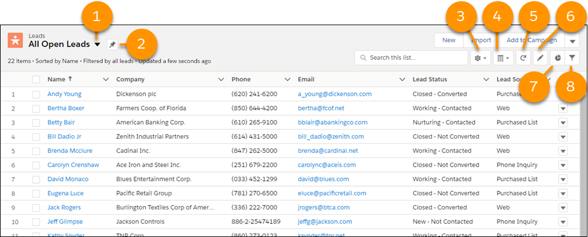

1. Access your list views here.
2. Pin a default list view.
3. Access to list view options where you can create new list views, clone, rename, and more.
4. Toggle between table, kanban, and split views.
5. Refresh the view without reloading the whole page (It's faster).
6. Update fields in your list.
7. Create charts to visualize your data.
8. Manage filters for your list view.

Below we see an example of a kanban list view. The possibilities are endless, here we can see that we are tracking opportunites by their stage. Either qualification, proposal, closed, ect. We can even see the dollar ammount summary for each stage. We can easily drag and drop opportunites on the kanban view to change their stage.

Below we can see an example of the split list view. For this example we can select a case on the left, and then see details for that case on the right.

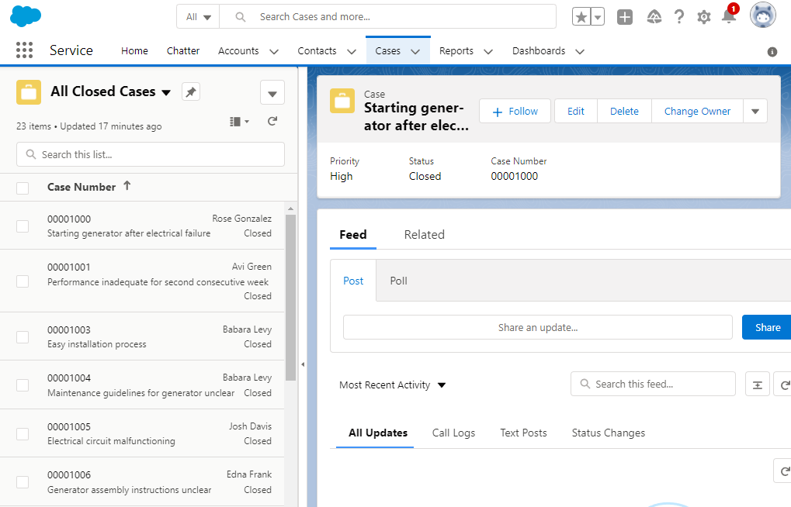

## Salesforce Apps

First what is Lightning Experience???
Lightning experience is the newer user experience for Salesforce. It has a more modern look and features. Salesforce classic is still available, but many are moving to the new experience!

An app is a group of items that serve some common functionality. They can allow access to objects, tabs, and other items all in one place in the navigation bar. Salesforce apps have two varieties: Classic and Lighting. Classic apps are handled in Salesforce classic, go figure. While Lighting apps are managed in the Lighting experience.

Things you can put in a classic app?
* Most standard objects, including home, the main chatter feed, groups, and people
* Custom objects
* Visualforce tabs
* Lightning component tabs
* Canvas apps via Visualforce tabs
* Web tabs

Lightning apps have all the options classic does, with the addition of Lighting page tabs and certain utilites such as the Sales Dialer.

We also have options to give our lightning apps custom branding, such as with a logo or custom color for the navigation bar. All these options allow us to provide end users with a custom experience that is tailored to their working role.
For example, a sales manager can have an app for reports and dashboards. While a sales rep could have an app for accounts, events, and contacts.

For our purposes, we will be working with a Lightning app to comform to the newer standard. Let's take a look at a typical app!

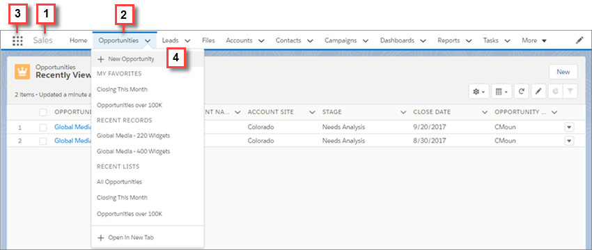

1. The app name. 
2. Custom colors can show up here. Notice the blue highlights.
3. The app launcher icon. Users can select other items and apps from here.
4. Users can create records and access objects from this navigation bar.

How do we create an app or manage current ones? The App Manager!

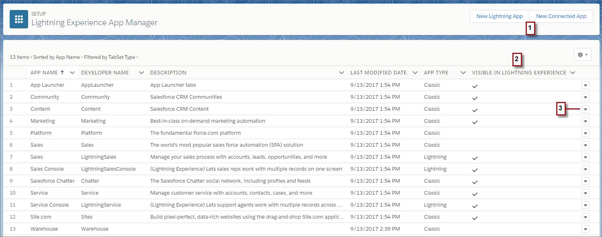

From here you can view and manage all your Salesforce apps!
1. Create an app!
2. See which apps are available for use in Lightning Experience!
3. Manage your apps!

## Custom Tabs

But wait, what were those custom tabs we mentioned in the last section?! 

Well, yes, aside from being able to put objects in a custom app we also mentioned tabs as well. Custom tabs, when created, appear in the app's navigation bar and we can have: 
1. Custom object tabs: Shows data for custom objects. Behaves just like standard tabs.
2. Web tabs: Used to display external web apps or web pages. 
3. Visualforce tabs: Show data from a Visualforce page. 
4. Lightning component tabs: These tabs make lightning components available in the Salesforce mobile app and in Lightning experience. (Lightning components aren't supported in Salesforce classic)
5. Lightning page tabs: These allow you to use Lighting app pages with the Salesforce mobile app and Lighting experience navigation bar. (subtab apps only support web tabs and visualforce tabs)

Here is a look at where we can manage our tabs:

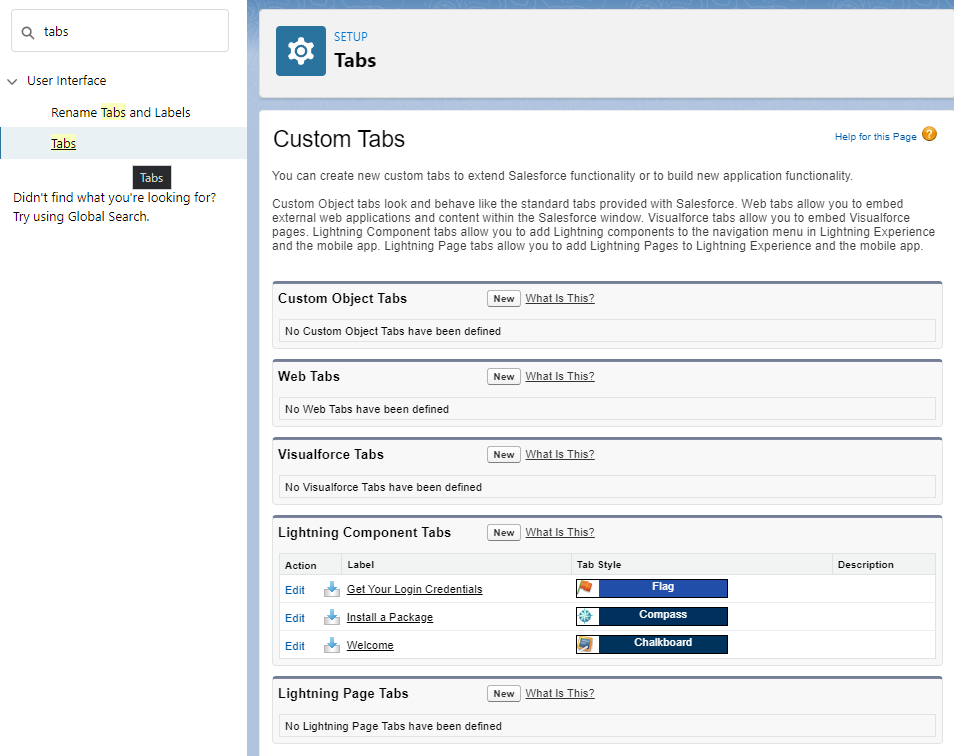

## Page Layouts, Marking fields as required or read-only

Page layouts allow us to have different versions of the same record page. We can customize them to ensure only the applicable fields and data are visible to specific roles.
The page layout editor lets you: 
1. Control which fields, related lists, and custom links user see.
2. Customize the order that the fields appear in the page details.
3. Determine whether fields are visible, read only, or required.
4. Control which standard and custom buttons appear on records and related lists.
5. Control which quick actions appear on the page.

Below we can see that (1) We have a pallete of options to choose from and (2) we have a layout section to drag those options into. This allows us to customize our page layouts. 

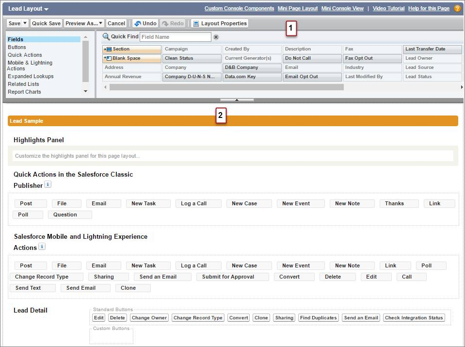

To create and magage page layouts, you can navigate to the object manager > the object you want to manage > page layouts > then you can create a new one or manage existing layouts. You also have the option here "page layout assignent" that will allow you to assign page layouts to different profiles. 

Concerning page layouts, we have a security consideration that we should highlight. When creating a field, you can select the Required checkbox to make sure that the field is always populated - if a user tries to save a record without giving a value for a required field, Salesforce will block the save from happening. Alternatively, we can make a field required for only a specific page layout, rather than universally for the object, so that only the people who see that page layout will be obliged to populate the field. This is considered a soft field level security, and is no replacement for marking the field required in Fields & Relationships in the object manager.
Here is what the process would look like to manage required and read-only in the page layout:

We can see that when hovering over a field, a minus symbol (enclosed in the the bottom left red rectangle) and wrench (enclosed in the bottom right red rectangle) will appear. Selecting the minus symbol will remove all access to the field for the selected page layout. Choosing the wrench will open a Field Properties popup (shown in the second picture). If Read-Only is selected, the field will have read-only access on the layout; if it is not selected, the field will have both read and edit access on the layout. We can see the option to make it required or not is here as well.

## Related Lists

Related Lists are collections of records of a specific type related to a given record. As you'll recall from our last section, we can add related lists to our page layouts so that they will display on the related tab of the record detail page. For example, the standard Account page layout has different related lists for Contacts, Opportunities, and Cases, among others. In addition to displaying related records, related lists also allow the creation of related records without leaving the parent object's record detail page.

## Quick Actions

Quick actions allow users to work more productively in Salesforce, both on the web client as well as the mobile app. You can enable options for your users such as creating/updating records or even logging calls from their chatter feed, and much more. 

Quick actions have 2 varieties: Object-specific quick actions and global quick actions.

Object-specific quick actions are context aware, meaning they have automatic relationships to other records. So a user is able to create/update records, send an email, or more in the context of a certain object. For example, on the Account object you could have an object-specific quick action that creates contacts related to that account. 
To create object-specific actions, the option can be found in object manager > object > Buttons, Links, and Actions > "New Action" button

Here is an idea of what that looks like, as well as some of the options available when creating a quick object-specific action.

Global quick actions can be put, well, globally wherever they are supported. These actions can be used to let users log calls, create/update records, or send emails. Because global quick actions are not context aware, any new records created with them will not automatically have direct relationships with other records.
Global actions use a special layout called the Global publisher layout. This layout is not associated with any object, and it is seen in the global actions menu in Lighting experience. This can be found by clicking the "+" on the Salesforce header. The global publisher layout, similarly to page layouts, can be assigned to certain profiles.

Here is an example of where to find the global quick actions menu, as well as the settings options for adding new global options and publisher layouts.

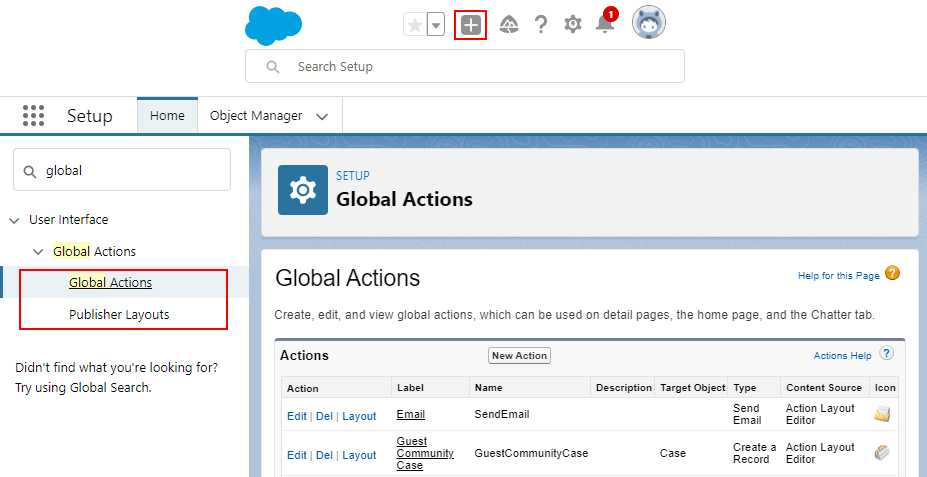

## Custom links and buttons

Custom links and buttons can help boost productivity by allowing users to have the information they need when they need it.
Custom links can link to an external url, visualforce page, or a company's intranet. Custom buttons can connect users to external apps, such as web pages, and launch custom links. These options help our users stay agile and productive. 

In our previous section, covering quick actions, we already took note of where we can manage custom links and buttons. That is object manager > object > Buttons, Links, and Actions.
From here we can click "New Button or Link" to begin. 

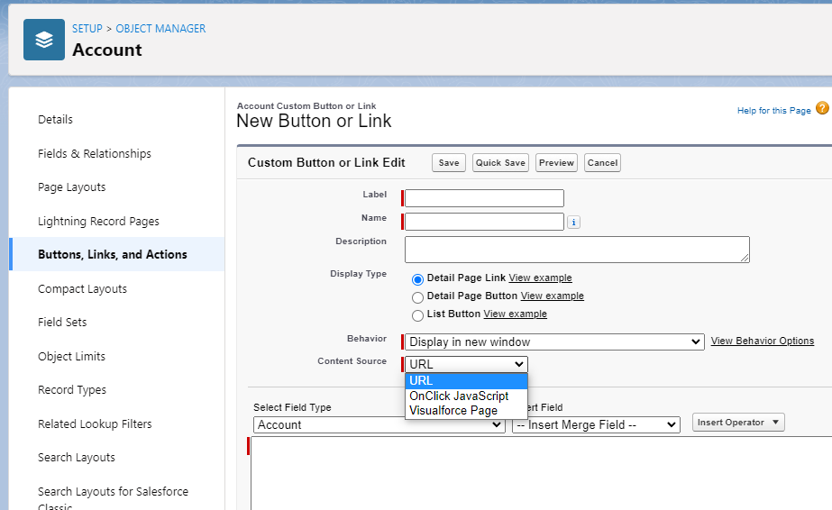

Here we can see that we have options to create a detail page link, detail page button, and a list button. We can also select the content source. We can navigate to a URL, run some javascript, or go to a visualforce page.

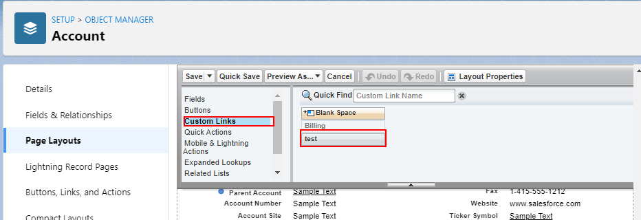

We can not forget to add our links and buttons to our page layouts! Notice here I've created a detail page link named test, I will have to add it to the page layout to make it usable.

## Record Types

Record types are a classification of an object that allow you to display different business processes, picklist values, and page layouts to different users. This can be usefull in a variety of scenarios. Record types are commonly used to differentiate between, for example, accounts in different industries so that only those fields relating to the industry are shown.
For another example, consider an asset for a pizza company. Perhaps we have delivery vehicles, but also store assets such as an oven. We can use record types on record creation to select which kind of asset we are entering in the system. A vehicle will probably need a VIN number field, while an oven may need a field for serial number. We can offer these different options based on our record type. 

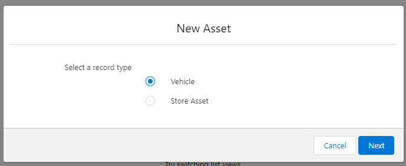

By default, each object has a Master type. To find Record types for an object, go to Setup | Object Manager, select an object, and then choose Record Types from the left sidebar (enclosed in the bottom left red rectangle in the below image). You can create new types by clicking the New button (enclosed in the top left red rectangle) and manage page layout-Record type pairs by clicking the Page Layout Assignment button (enclosed in the top right red rectangle).

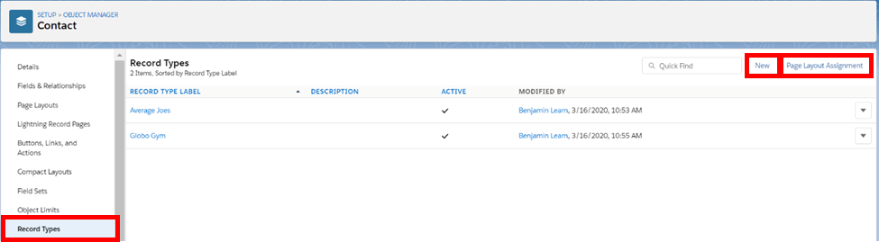

Let's further detail these buttons. Upon clicking the New button, you will be presented with the first below screen, where you will be prompted to choose an existing record type to use as a starting point for your new type (generally, this will be the Master type), input a label (as with objects and fields, the name will autopopulate based off your chosen label), make the feature active (so that your users can actually use it), choose which profiles can utilize the type, and finally determine whether the type is the default for those profiles. As the ability to set a default suggests, multiple record types can be made available for any one profile.

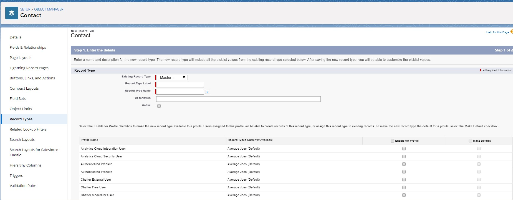

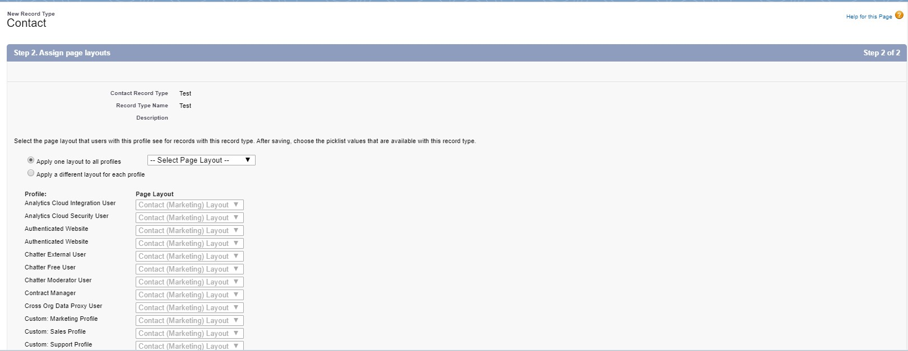

The second figure above shows the next screen in type creation, which allows for assignment of page layouts to profiles for the record type. In order to edit page layout-record type pairs for all record types at once, click the Page Layout Assignment button on the Record Types page and then click Edit Assignment; the below image shows the screen that will appear and details instructions for editing pairs.

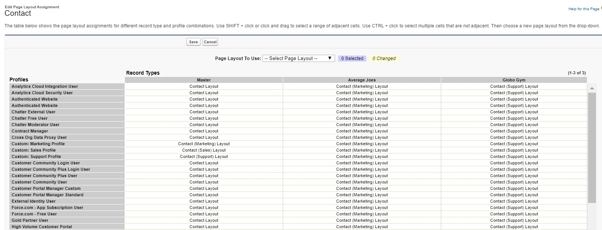

Finally, as previously stated, record types allow for picklist value specification. Selecting a record type from the Record Types page will display details about the type as well as the editable picklists; clicking the Edit button next to any of the picklists will invoke this functionality.

### Record Type, Page Layout, and Profile Interplay

Let's discuss field level security for a moment by discussing the ways record types, page layouts, and profiles interact. First, page layouts can be more restrictive than profiles - if a field is marked as read-only on a page layout, non-admin users will not be able to edit the field value after they create the record, regardless of their profile permissions. Similarly, a field that does not appear on the page layout will not be visible to users after the creation of the record, regardless of their profile permissions. Note, however, that page layouts cannot expand access - if a user's profile does not give them edit abilities for a field, they will not be able to edit that field, even if the field is editable on the page layout.

In record type-page layout interactions, record types function analogously to profiles - they set the base tier of field permissions and page layouts can restrict, but not expand, this access. Record type field level security can be set independently of the field level security for the corresponding page layout, but this is not considered a best practice because it increases the complexity of the data model and number of places you may have to look in order to edit the data model to fulfill new requirements.

Page layouts control what users see when viewing a record page and are useful for removing irrelevant fields that only serve to clutter up a user's view or for removing fields with sensitive information that not all users have the need (or privileges) to see. When editing a page layout, we can add/remove non-required fields (required fields must always be displayed on a page layout), buttons, custom links, Visualforce pages, and related lists.

## Lightning Pages

A Lightning page gives you free reign to create custom experiences for users that can be used in the Salesforce mobile app or the lightning experience.
Ligthing pages sit firmly in a middle ground between page layouts and Visualforce pages. You can add custom items to a page, much like a page layout. But these custom items will be made of lightning components. 
When creating a lighting page, you will choose a template that will determine how the page is displayed on different devices. The lighting components are the building blocks that will make up the page. These are placed using the Lightning App Builder.

Lightning pages support a few types of components: 
1. Standard components: Built by Salesforce
2. Custom components: Built by us! The devs!
3. Third-party components on the AppExchange: Built by others!

To create a new Lightning page navigate to the Lightning app builder in settings and click "new". (Not to be confused with the App Manager!)

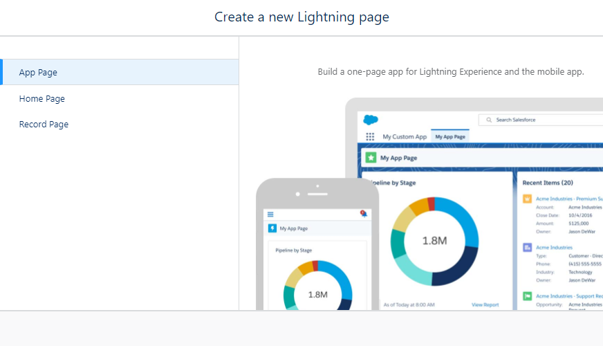

Here we can see that we can create lightning pages as an app page, home page, or a record page. An app page can be added to the navigation bar of a lighting app and is available in the lightning experience as well as mobile app. This gives quick access to the objects and items that are most important for that app.
A custom home page can be used in the lightning experience to create a branded and professional landing page for an app. A record page can be used with lightning experience and the mobile app and enables a very custom record detail experience for users.

Below we see an example of the lighting app builder. We can drag components (on the left) to the center page to customize our page. Our component options will appear on the right page when selected. We can then save (and don't forget to activate!) our lightning page. The next options will let us name our page, and then if we wish to add it to any apps.

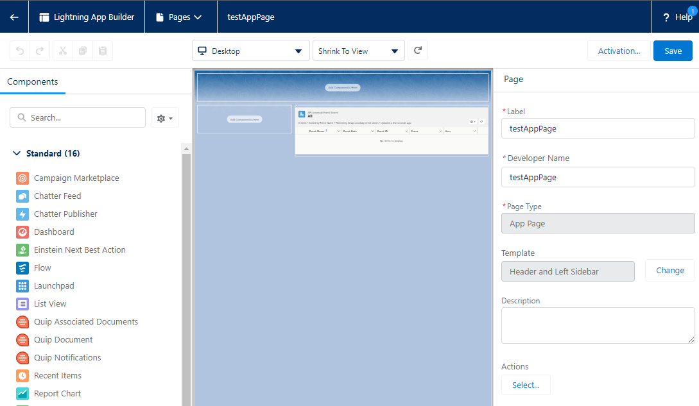

## Dynamic Forms

Dynamic Forms are a bit of an upgrade to page layouts. They allow you to use visibility rules to show or hide fields and sections dynamically. This can improve the user experience by reducing clutter. It also greatly improves layout management by reducing the number of page layouts you need due to those visibility rules. Also, you can take advantage of the single assignment model for lightning pages instead of the dual model of assignning a lightning page and a page layout.
There is a catch, however, it is not a replacement for page layouts quite yet. For example, dynamic forms are only available for record pages for custom objects. Another consideration is that dynamic forms are not available to users with Internet Explorer 11. 

We create dynamic forms in two ways: 
1. By creating a custom object record page in Lightning App Builder, then drag Field and Field Section components onto it.
2. By opening an existing record page and clicking "Upgrade Now" to start the Dynamic Forms migration wizard.

We can see an example below of what a dynamic form looks like in the Lightning App Builder.

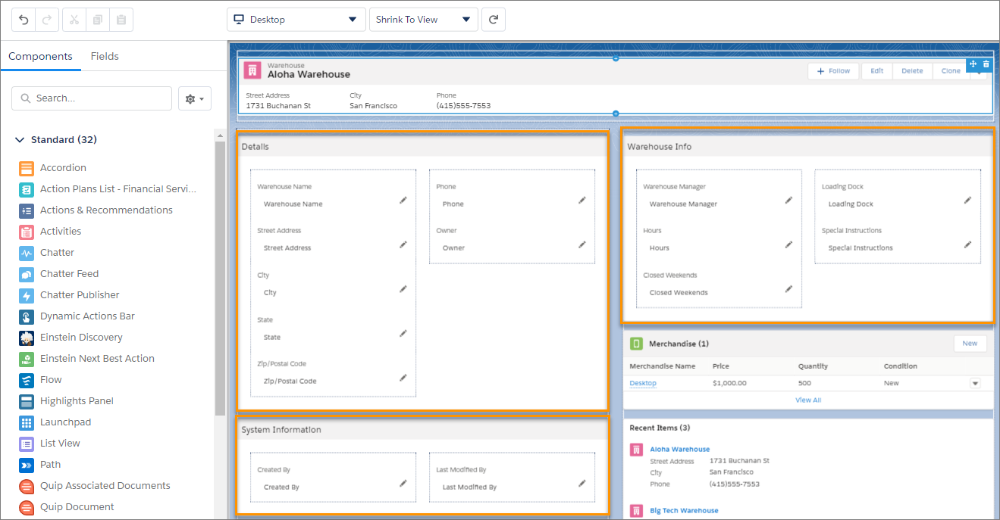

## Search Layouts

Search layouts determine what users see from Einstein Search results. Each user profile can have search layouts for both standard and custom objects. Only objects with customizable layouts support profile-specific layouts. The search layout you create applies to global and lookup searches.

Below is an example of where and how to edit a search layout. Once found in settings we select the object, then profile, finally we can edit the search layout for that profile. In this example we moved "Phone" up one in selected fields so it will appear in the next image.

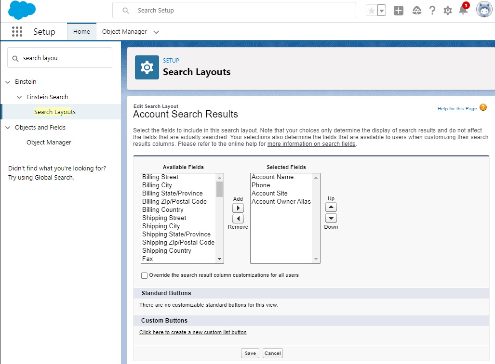

Notice how we see the account phone number displayed.

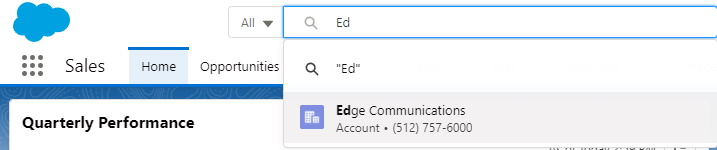

## Compact Layouts

Compact layouts are used to highlight key fields in the Salesforce mobile app, lighting experience, and even in Outlook and Gmail integrations.
When creating a compact layout, you can add up to 10 fields and sort them by priority for your business needs. This will determine the order in which they appear. In different contexts, a different number of fields will be available to appear.
For example in lighting experience, the first seven fields appear in the highlights panel of an object record.

To create a compact layout, navigate to the object in object manager and select compact layouts, from here you can manage them.

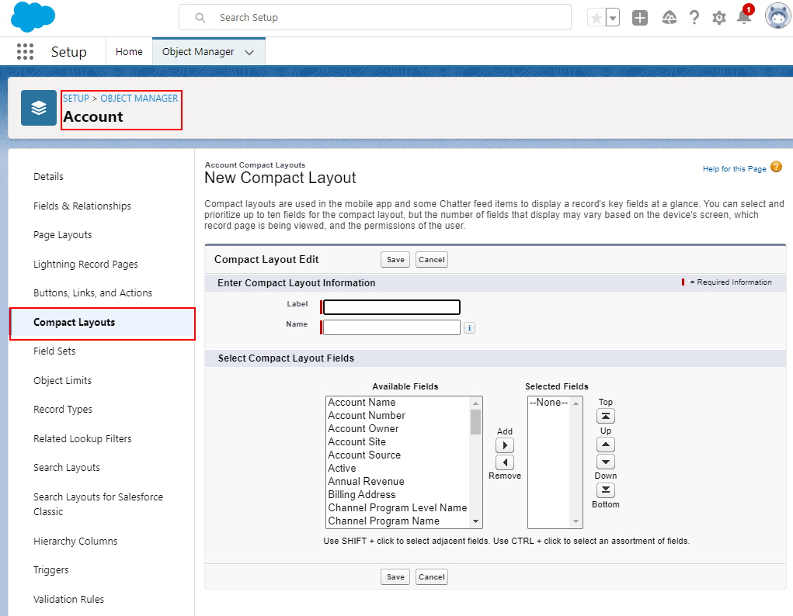

## Salesforce Mobile Apps

A quick search for "Salesforce" on the Google Play store will return a variety of apps, Salesforce, Salesforce Events, Trailmoji, Salesforce Authenticator, Field Service Lightning, SalesforceA, Salesforce Einstein Analytics, and Salesforce Inbox. A similar search on the Apple App Store displays the same apps, with the exception of Trailmoji and the addition of Trailhead GO. That's a lot of apps, but we're going to focus on two in particular: SalesforceA and Salesforce.

### SalesforceA

SalesforceA is the mobile administrative application for Salesforce; it's fairly simple and doesn't offer a ton of functionality. When you open the app, you will be met with an `Overview` screen that shows the number of frozen and locked out users for your org, recently viewed users, and your org's trust status (which details information such as org performance and availability). After navigating to the `Users` screen, you will be presented with a list of users. Upon clicking on a user, you can freeze them, deactivate them, reactivate them, or reset their password by clicking the &vellip; and choosing the appropriate option. If you're using an iOS device, you can also creat users and reassign user licenses. The user `Details` page displays information about the user (the left screen in the below image) and the `Related` tab (the right screen in the below image) shows a user's assigned permission sets and login history.

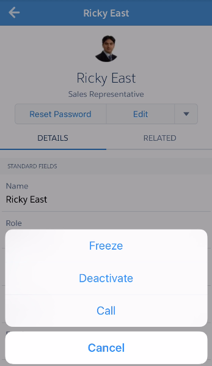

When you click the &vellip;, you will also see an `Edit in Salesforce1` option. Choosing this item will take you to the Salesforce app (formerly known as Salesforce1), where you can edit a user's information.

The final menu item in SalesforceA is `Resources` (shown in the below picture). This page contains information about your org's performance and availability (`Salesforce Optimizer` and `Salesforce Trust`), ability to transition from Salesforce Classic to Lightning Experience (`Readiness Check`), and links to documentation (`Release Notes`), community resources (`Salesforce Answers` and `Trailhead`), and relevant information (`Admin News and Events`).

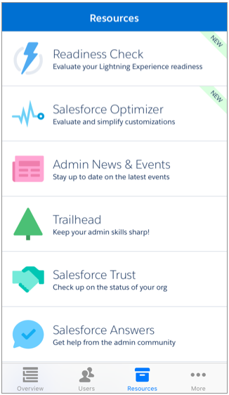

### Salesforce (Mobile App)

The Salesforce mobile app is designed for internal users to be able to perform a lot of the same functionality as in Lightning Experience, but while they're away from their desk (or I guess, in early 2020, while their laptops in their office and that is just too far of a journey from the living room). By default, all users in an org can use this app, where they can view, edit, and create records of all custom objects that have a tab and many standard objects such as Tasks, Opportunities, Leads, Events, Contacts, Cases, and Accounts, among others. However, there are some standard objects, such as products, that don't have mobile availability. For a full list of mobile-supported objects, see the `Data Access and Views: What's Different or Not Available in the Salesforce App` in the `Helpful Links/References` section.

There are some other limitations with the application: users can view reports or dashboards, but can't create them. They also can't merge existing duplicate records or access the utility bar. Additionally, users can only change the owner for records of certain objects (among them Accounts, Campaigns, Cases, Contacts, Leads, Opportunities, and custom objects) and there is no inline editing functionality. But despite these and other constraints, the app is very useful for a quickly editing or creating records of many objects in a similar way to that of Lightning Experience.

The interface of the app is slightly different from Lightning Experience. To start, the default app is `Mobile Only` (as shown in the first image below). This application contains items that you can edit at `Setup` > `Apps` > `Mobile Apps` > `Salesforce` > `Salesforce Navigation` (this page is displayed in the second image below), the `Selected` items are those shown in the navigation menu (`Smart Search Items` displays a user's recently viewed objects and tabs). The side navigation menu contains all the items that would normally be hosted in the navigation bar at the top of an application in Lightning Experience. As you can see, the first four `Navigation Menu Items` are displayed in a smaller navigation bar at the bottom of the app, while the fifth item in that bar is the menu leading to the remainder of the items. If you wish to switch from the `Mobile Only` app, you can change to any available app through the `App Launcher`.

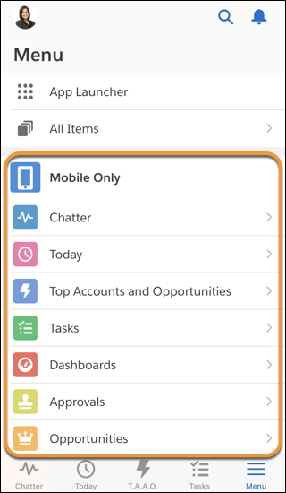

To make a Lightning app available for mobile use, navigate to `Setup` > `Apps` > `App Manager` in Lightning Experience, select the dropdown at the far end of the row holding the desired application, choose `Edit` to open `Lightning App Builder`, navigate to `App Options`, and ensure that an appropriate form factor (either `Desktop and phone` or `Phone` is selected). The image below displays an example `App Options` page, with an appropriate selected option enclosed in a red rectangle.

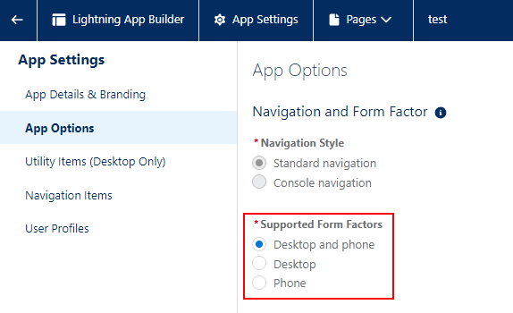

Finally, you can change the coloring of the mobile interface and the logo of the app's loading page by navigating to `Setup` > `Apps` > `Mobile Apps` > `Salesforce` > `Salesforce Branding` in Lightning Experience.

