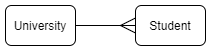
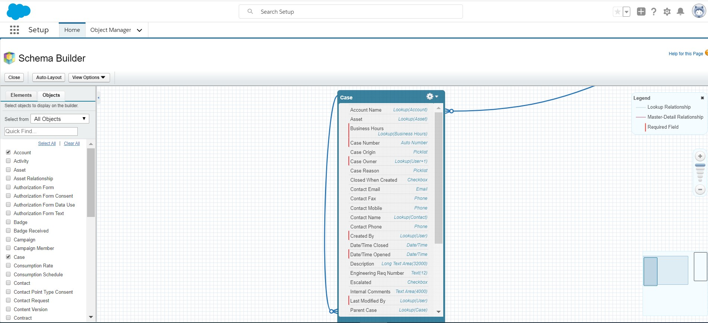
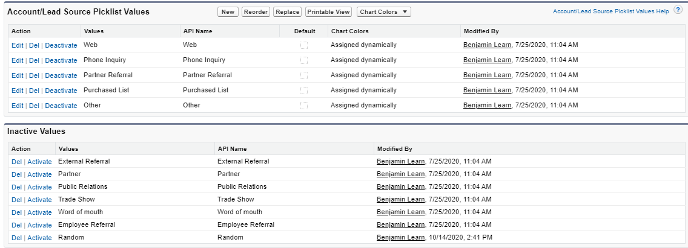
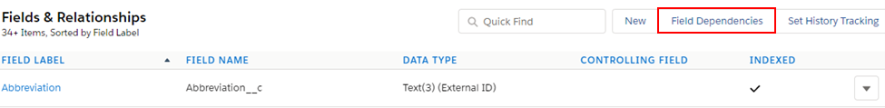
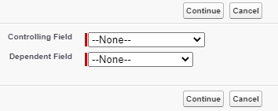
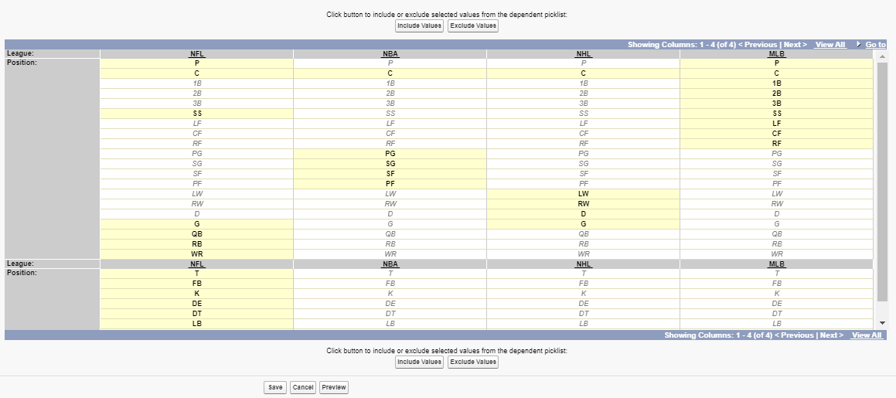
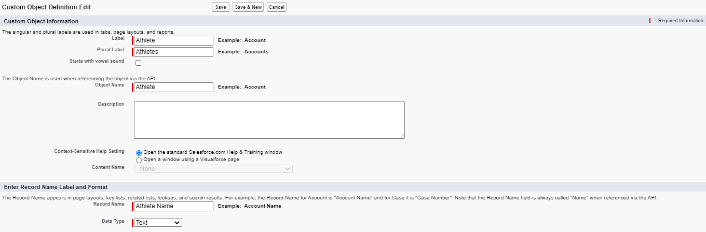
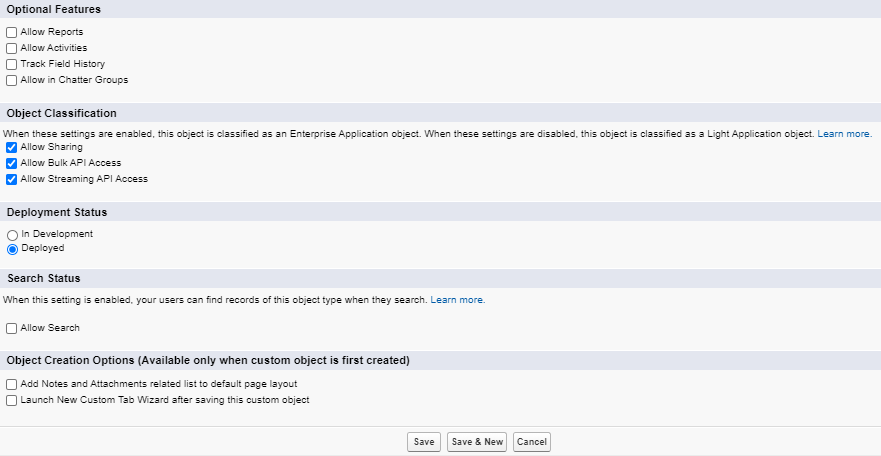

# Module - Data Model

This module introduces the Salesforce data model including the `Schema Builder`, standard objects, custom objects, and relationships; it also defines the concept of an ERD.

## Table of Contents

* [Basic Definitions](#basic-definitions)
* [MVC](#mvc)
* [Entity Relationship Diagram (ERD)](#entity-relationship-diagram-erd)
* [Schema Builder](#schema-builder)
* [CRM Object Fields](#crm-object-fields)
    * [Field Data Types](#field-data-types)
	* [Picklist Fields](#picklist-fields)
	* [Global Picklist Value Sets](#global-picklist-value-sets)
	* [Field Dependencies](#field-dependencies)
* [Standard Objects](#standard-objects)
* [Custom Objects](#custom-objects)
* [Creating Custom Objects and Custom Fields](#creating-custom-objects-and-custom-fields)
* [Relationships](#relationships)
	* [One-to-One Relationships](#one-to-one-relationships)
	* [One-to-Many Relationships](#one-to-many-relationships)
		* [Master-Detail Relationships](#master-detail-relationships)
		* [Lookup and Hierarchical Relationships](#lookup-and-hierarchical-relationships)
		* [Many-to-Many Relationships and Junction Objects](#many-to-many-relationships-and-junction-objects)
* [External Object Fields and Relationships](#external-object-fields-and-relationships)
* [API Names](#api-names)

### Helpful References/Links

* [Design Your Own Data Model (Salesforce Help)](https://help.salesforce.com/articleView?id=schema_builder.htm&type=5)
* [System Fields (Object Reference for Salesforce and Lightning Platform)](https://developer.salesforce.com/docs/atlas.en-us.object_reference.meta/object_reference/system_fields.htm)
* [Custom Field Types (Salesforce Help)](https://help.salesforce.com/articleView?id=custom_field_types.htm&type=5)
* [Classic Encryption for Custom Fields (Salesforce Help)](https://help.salesforce.com/articleView?id=fields_about_encrypted_fields.htm&type=5)
* [Define Dependent Picklists (Salesforce Help)](https://help.salesforce.com/articleView?id=fields_defining_field_dependencies.htm&type=5)
* [Object Relationships Overview (Salesforce Help)](https://help.salesforce.com/articleView?id=overview_of_custom_object_relationships.htm&type=5)

## Basic Definitions

Before we get into the nitty-gritty, let's define some basic terms so we can talk intelligently about the Salesforce platform.

**Org:** Our instance of Salesforce; our org holds all of our data, configuration, and customizations.

**App:** A collection of tabs; a set of fields, objects, permissions, and functionality to support a business process.

**Object Tab:** A collection of objects. Tabs for standard objects are provided out of the box, but we can create `Custom Object Tabs` for our custom objects.

**Object:** Analogous to a table in the database or a sheet in a spreadsheet; contains a set of standard and custom fields.

**Standard Object:** An object, such as `Account`, that comes included with our org and contains numerous standard fields (such as `AnnualRevenue` in the case of the `Account` standard object).

**Custom Object:** An object that we create, by default it includes `Identity`, `Name`, and `System` fields.

**Record:** A row in a table; an instance of the object.

**Field:** A column in a table; a place where we store a value that describes the object. Each record may or may not contain a value for the field depending on the information given when creating the record and whether or not the field is required.

## MVC

We'll move into our discussion of the data model in Salesforce shortly, but first let's talk about its place in the context of our application architecture. The applications that our users make use of in Salesforce use a common architecture pattern known as `Model View Controller` (MVC). Let's quickly address each of these layers.

The Model layer, also referred to in Salesforce as the Data Model, is our topic at hand in this module. This tier is where we define the structure of our database by configuring our objects, the fields that they contain, and the relationships between them.

The next layer is the View, which is also referred to as the User Interface in Salesforce. This tier, as the name would suggest, is what our end users interact with and contains both declarative customizations (such as page layouts and tabs) and programmatic customizations (such as Visualforce pages and Lightning components).

The final part of our application architecture is the Controller, also known as the Business Logic in Salesforce. This layer also contains both declarative customizations (such as workflow rules and processes) and programmatic customizations (like the Apex that we write for our Visualforce pages and Lightning components). 

## Entity Relationship Diagram (ERD)

When we start development, it's generally a good idea to begin with our Data Model layer. But before we actually start to configure that layer, we should plan. The ERD is one of the main weapons in our planning arsenal. While we might want to skip the planning process and just get into development, we shouldn't - it's a bad idea. Think of it like taking a pre-GPS road trip: we might be able to get by without planning out our route in advance, but we're probably going to end up getting lost, taking some wrong turns, and making the drive much longer than it needs to be. Making an ERD _before_ we start developement will save us from a lot of wasted time, headaches, and stress later.

Alright, now that we've sung the praises of ERDs, let's define them. An ERD is a visual aide that shows the objects in our database and the relationships between them. Below is an example of a very simple ERD relating only two objects.

<p align="center"></p>

Let's break down this diagram. First, we need to contain our objects (in this case `University` and `Student`) in some shape (such as rectangles) to indicate that they are objects. Next, we need to have a connection between our related objects that indicates what type of relationship they have. When we discuss relationships in general and relationships in Salesforce specifically later in this module, we'll talk more about relationship types; but for now we'll just accept that this is a one-to-many relationship (i.e. that one `University` can have many `Students`), which is indicated by the fork at the end of the line, located on the "many" side of the relationship.

## Schema Builder

`Schema Builder` is a robust data visualization tool in Salesforce with many built-in, useful features that allow us to both visualize and edit our org's data model, but it's important to start with this: `Schema Builder` is _not_ an ERD. An ERD is a simple diagram that _only_ shows objects and their relationships, it's meant to give a readable, easily understandable view of our data model at a glance, `Schema Builder` is much more detailed.

We can think of an ERD like the window sticker on a car for sale at a car dealership - it gives us a general idea of the car with just a few seconds of reading (if that). `Schema Builder`, on the other hand, is the Carfax for that same car: very detailed and useful in its own right, but not always the best option if we're just trying to get a basic idea about the vehicle (or in our case, data model).  

Now that we've established that distinction, let's talk about where to find `Schema Builder` in our orgs, what it looks like, and some of its features and limitations. To find `Schema Builder`, we start by clicking the gear icon (), then we select `Setup`, click the `Object Manager` tab, and click the `Schema Builder` button on the top right of the tab, which will take us to something like the following page:



We can drag our mouse throughout the map in the bottom right corner, adjust the magnification on the middle-right side, and drag and drop the objects themselves throughout the diagram in order to include everything we want to see in the window.

`Schema Builder` has many useful features, among them the ability to create custom objects, lookup and master-detail relationships, and all custom fields except those with the geolocation data type. However, there are some limitations to `Schema Builder`, such as the aforementioned inability to create geolocation fields and verbosity that can at times be overwhelming. Additionally, we should be aware that we cannot set field-level security or add a field to a page layout when creating a field in `Schema Builder`.

## CRM Object Fields

In Salesforce, each object record (i.e. each instantiation of an object) has a unique 15 character-long ID. This record ID is a primary key - it allows the system to identify and keep each record separate from every other record. While Salesforce itself is case-sensitive, it cannot ensure that any other systems that use exported record data are also case-sensitive, so each record also has an 18 character-long ID as a hedge against case-insensitive systems.

In fact, it is this second, longer ID, that we'll most often see, even within Salesforce itself. When viewing a record's detail page, the URL will display the 18 digit ID (an example of which is enclosed in the red rectangle in the following image). This 18 digit ID will also appear in any list views and anytime we interact with a record in Apex or Visualforce pages, or through the SOAP API. The main places we'll see the 15 digit ID in Lightning Experience are in reports and formulas (although we can convert the 15 digit ID in a formula to an 18 digit value using the `CASESAFEID()` function).

<p align="center"></p>

The record ID is an example of an `Identity` field, one of the five types of fields in Salesforce (the others being `Name`, `System`, `Standard`, and `Custom`). `Name` fields require us to input a human-readable name that means a lot more to you or I than would 15 random alphanumeric characters. These names can be strings that we input when create the record or an `Auto Number` that automatically increments with each new record, e.g. `Account-0001`.

System fields, used to display audit information about records, include such fields as `CreatedDate`, `CreatedBy`, `LastModifiedDate`, `LastModifiedBy`, and `SystemModstamp`, the last of which is useful because it holds the date and time that the record was last modified, regardless of whether it was a user or an automated tool that performed the update. `Standard` fields are those fields like `AnnualRevenue` on the `Account` object that come included with standard objects and don't fit into one of our prior categories. Finally, custom fields are any field that we create on a standard or custom object.

Note that `Identity` and `System` fields are automatically populated and read-only - we cannot change their value. The same applies to `Name` fields if they are `Auto Numbers`.

### Field Data Types

In the last section, we detailed field types. Now, we're going to look at field data types. What's the difference? Field types categorize our fields: they tell us who made them (the system or us) and whether the field is used to differentiate the record from other records (`Identity` and `Name` fields), track who made changes to the record and when they made them (`System` fields), or store actionable information that we want to know about a record (`Standard` and `Custom` fields).

On the other hand, field data types tell us what values or kinds of values we can input for that specific field whenever we are creating or editing a record. There are 26 field data types in total; let's list them below.

```
1. Auto Number
2. Formula
3. Roll-Up Summary
4. Lookup Relationship
5. Master-Detail Relationship
6. Hierarchical Relationship
7. External Lookup Relationship
8. Indirect Lookup Relationship
9. Checkbox
10. Picklist
11. Picklist (Multi-Select)
12. Number
13. Percent
14. Currency
15. Text
16. Text Area
17. Text Area (Long)
18. Text Area (Rich)
19. Text (Encrypted)
20. Date
21. Date/Time
22. Time
23. Geolocation
24. Phone
25. Email
26. URL
```

Whew, that's a lot! We don't have to memorize all 26, but we should try to understand each of them. So with that goal in mind, let's categorize.

Data types one through three are read-only: whenever we're creating the field, we set a formula which is used to automatically calculate the value of the field when a new record is created. At the time of record creation we don't (and can't) input a value to these fields ourselves - Salesforce does it for us. As we said earlier, `Auto Numbers` are alphanumeric strings such as `Record-0000` that are incremented for each new record and can be used for the record's `Name` field. `Formulas` are just what they sound like - rules that used to determine field values; we'll get more in-depth with them when we discuss process automation. Finally `Roll-Up Summaries` are another topic we'll set aside for the moment and detail when we talk about relationships in-depth.

Our next group is data types four through eight, which are all relationships. However, as we just alluded to, we're going to provide more detail on each of these later, so let's set them aside for now.

Group number three: types nine thorugh eleven are controlled-value fields and are related by their ability to be involved in field dependencies. A `Checkbox` is pretty self-explanatory: if a prompt is true, we check the checkbox when creating or editing the record. Because picklists will get their own section, we'll again set them aside for the moment.

The fourth category, types twelve to fourteen are straightforward number fields; the only thing we'll note here is that the currency type (dollars, euros, North Korean won) is determined by our organization-wide currency.

Group number five: data types 15-19 are text fields. `Text` and `Text Area` fields allow up to 255 characters, the difference between them is that `Text Areas` can be multi-line. `Text Area (Long)` and `Text Area (Rich)` fields allow up to about 130,000 characters, the difference between being that `Text Area (Rich)` fields allow formatted text. Finally, `Text (Encrypted)` fields are masked before they are retrieved from the database and shown to users. These fields can contain up to 175 characters.

Group number six! Types 20-22 are Date/Time fields. Do we only want a date? We should use `Date`. Do we want a time? We should use `Time`. Do we want both? We can use `Date/Time`. It's that simple.

Group number seven is a lonely group, it only contains `Geolocation` fields, which can take a longitude and latitude when we are creating/editing a record. However, as we saw in our section on `Schema Builder`, `Geolocation` is the only field data type that we can't select when creating a field using this tool.

Group number eight - last group! Data types 24-26 are miscellaneous format-enforcing fields. Users input a series of numbers in `Phone` fields and Salesforce automatically formats it as a phone number. `Email` fields enforce the input format `username@website.com`. Finally, `URLs` enforce a `URL` format.

### Picklist Fields

Picklist fields are pretty useful and common, so let's go into a little more depth on them. A `Picklist` is a dropdown field that allows us to choose one of the available, predefined values when we are creating or editing a record. `Picklist (Multi-Select)` is just like a `Picklist`, except we have the ability to select more than one value.

When we create a new picklist, we have some configuration options to choose from, such as determining if the picklist is restricted by selecting the `Restrict picklist to the values defined in the value set` checkbox. A restricted picklist only allows a user to choose one of the existing, pre-defined values when creating or editing a record, while an unrestricted picklist allows users to provide their own picklist values that weren't predefined when working with the record.

Restricting the values allows us to ensure data integrity and consistency. Consider a state picklist field: if the values were unrestricted, some users might provide the full names of states, while others might use their two-letter abbreviations. By making a restricted picklist containing only the two-letter abbreviations, we can ensure that our data will be consistent no matter who enters it.

While there aren't any out-of-the-box multi-select picklists, there are standard, single-value selection picklists. These standard picklists are unrestricted and we don't have the ability to make them restricted - so we'll have to turn to other tools if we want to ensure that our users aren't able to insert their own values. 

Standard picklists can also share values. For example, the values for the `AccountSource` and `LeadSource` fields are the same, so the changes we make to one field will be reflected in the other field as well.

Of course, standard picklists come with values already made for us, but we can edit the values of an existing standard or custom picklist quite easily by navigating to `Setup` > `Object Manager`, selecting the name of the object holding the picklist, choosing the `Fields & Relationships` tab from the left sidebar, and selecting the label of the desired picklist. Once we've done that, we can scroll down to the end of the picklist field detail page, which will look something like the following image that displays the detail page for the `AccountSource` field.

<p align="center"></p>

This page gives us a variety of options to explore; let's start with the buttons and then move our way down to the links next to the values. The `New` button will allow us to add new picklist values and the `Reorder` button lets us change the order in which the values display when a user is working with a record. Clicking the `Replace` button will direct us to a screen where we can change the values of the field on all existing records that have a specified value by entering the old value and then selecting the new value to change to from a list of existing values.

Moving on to the links, we can use the `Edit` link to change the API name or label of a specific value, or select that value as the default for the field. Clicking the `Del` link will remove the picklist value from our org as well as clear the field for any records that had that value. Therefore, to preserve the values of existing records, we probably want to use the `Deactivate` link instead, which will remove the value from the field for selection when we're creating or updating a record, but persist it on records already using it. If we'd like to reactivate an inactive value, we can simply click the `Activate` link.

### Global Picklist Value Sets

Within an application, we might have multiple picklists across different objects that nonetheless need the same values. If we created a separate set of picklist values for each of these fields and needed to change a value later, we'd have to visit _every_ _one_ of those fields to do so.

Rather than bothering with all that hassle, we can make use of a `Global Value Set`, which allows us to use the same set of picklist values across multiple picklist fields. If we change a given value, remove one, or add a new one, our modifications are reflected in all picklist fields using the set. We can create these sets by navigating to `Setup` > `Objects and Fields` > `Picklist Value Sets`, clicking `New`, and adding the label, name, and values for our new set.

Alternatively, we can make the values for an existing picklist into a global set by navigating to `Setup` > `Object Manager`, choosing the object holding the picklist, selecting `Fields & Relationships` from the left sidebar, and then selecting the name of the picklist. Once we've arrived at the picklist detail page, we can click `Edit`, `Promote to Global Value Set`, provide a name and label for the set, and click `Promote to Global Value Set` again.

After we've configured our global sets, we can use them in a new picklist by staying with the default `Use global picklist value set` radio button rather than the `Enter values, with each value separated by a new line` radio button when creating the picklist and choosing our desired set from the dropdown.

### Field Dependencies

Now that we've talked about picklists, we can move one to field dependencies, which are filters where the value of a controlling field (a picklist or checkbox) determines the values available to us in a dependent field (a picklist or multi-select picklist).

These filters are useful because they can help remove unnecessary options and thus reduce the amount of choices through which a user must sort. For example, consider a sports agency using Salesforce. They can store the athletes that they represent as a record of a custom `Athlete` object which holds a controlling picklist specifying the professional sports league that the athlete plays in that determines the values available in a dependent picklist specifying the athlete's position. The table below clarifies which of the data types we can use to configure such a relationship.

| Field Data Type | Can be a controlling field? | Can be a dependent field? |
| --------------- | --------------------------- | ------------------------- |
| Checkbox | Yes | No |
| Picklist | Yes | Yes |
| Multi-Select Picklist | No | Yes |
| Standard Picklist | Yes | No |

To establish this filter, we navigate to `Setup` > `Object Manager`, select the object we want to create the dependency on, and select `Fields & Relationships` from the left sidebar, which will take us to the screen shown below.

<p align="center"></p>

Next, we click `Field Dependencies` (surrounded in the red rectangle in the above image) and then `New`. On the resulting screen (pictured in the following screenshot), we select the controlling and dependent fields before clicking `Continue`.

<p align="center"></p>

We'll then be taken to a screen similar to the one below where we can configure the values for our dependencies by selecting all values that should be available to a controlling value in the appropriate column and selecting `Include Values`. Once we're satisfied with our selections, we finish by clicking `Save`. Note that all values are excluded (i.e. not highlighted) by default when we first configure the dependency.

<p align="center"></p>

## Standard Objects

We already defined standard objects at the beginning of this module, but let's quickly discuss some additional information about them. Standard objects cannot be deleted or have their API names changed. However, we do have the ability to change the labels of standard object's tab by navigating to `Setup` > `User Interface` > `Rename Tabs and Labels` and selecting the `Edit` link next to the name of the tab we want to change.

Note that while our custom objects all play by the same set of rules, which we'll define shortly, some standard objects have unique implementations. We'll encounter the consequences of these implementations throughout training.

## Custom Objects

Custom objects are those created by a user with administrator permissions and used to represent a set of data. Much like standard objects, custom objects automatically have `Identity`, `Name`, and `System` fields. However, they cannot have any `Standard` fields (because they do not come standard with Salesforce... how would Salesforce know what fields we want included on the object it didn't know we were going to make?).

Custom objects also differ from standard objects in that they can be deleted and have their API name changed. We also have the ability to change the label of the custom object's tab (if we make one).

## Creating Custom Objects and Custom Fields

We've discussed custom objects and fields in theory, but haven't actually put that into practice. So let's do that now by creating the `Athlete` object and its `League` field that we referred to in the `Field Dependencies` section.

There are many different ways to navigate to the object creation screen from `Setup`. We can either click the dropdown next to `Object Manager` (&or;) and select `+ New Object`, select `Create` &#9660; and `Custom Object` from the `Setup Home` page, or click `Object Manager` and then click `Create` &#9660; and `Custom Object`. Any of those options will take us to a screen that we'll break into two images.

<p align="center"></p>

In the first section above, we enter a label and plural label for our new object. The `Object Name` is populated with a default value when we leave the `Label` field, but we can change it. The `Record Name` also autopopulates when we leave the label field, but similarly can be changed. We can switch to an `Auto Number` name by selecting `Auto Number` in the `Data Type` dropdown.

Alright, let's take a look at our next screenshot:

<p align="center"></p>

This section deals more with the configuration of our new object. Selecting the `Allow Reports` checkbox will create `Standard Report Types` for our object and selecting `Allow Activities` will allow us to use tasks and events for the object. In the `Deployment Status` section, the `Deployed` radio button (which is chosen by default) must be selected to allow non-administrator users to use the object. Lastly, selecting the `Allow Search` checkbox will let us search for records of the object in the global search box.

All of the aforementioned settings can be configured either when creating the object or when editing it later, but there are some options we can only choose at the time of creation: whether to add the `Notes` and `Attachments` related lists to the page layout and whether to launch the custom tab wizard after clicking `Save`. Of course, we can create a tab for the object and modify the related lists shown on the page layout after creation through other means.

Once we're satisifed with our selections, we can click `Save`. If we want to later modify the configuration of a custom object, we can navigate to `Setup` > `Object Manager`, select the &#9660; next to the name of the desired object and click `Edit`. Alternatively, we can select the name of the object from the `Object Manager` page and then click the `Edit` button on the object detail page to which we're taken.

To create a custom field on a standard or custom object, we first navigate to `Setup` > `Object Manager`, select the object that will hold the field, choose `Fields & Relationships` from the left sidebar, and then click `New`. This button will launch the field creation wizard, whose first step prompts us to choose the data type of our new field. Note that only a subset of data types will be available (for example, we can't choose `Hierarchical Relationship` unless we're working with the `User` object).

After we click `Next`, we'll configure further options based on our chosen data type, which vary between different types. However, the last two steps of the wizard are the same regardless of the data type we choose. In the next-to-last step, we configure field level security for the field. The final step is where we choose the page layouts our field appears on (the field is added to all page layouts for the object by default) and click `Save`.

## Relationships

Of course, our objects don't live in isolation and wouldn't be very useful if they did. We can show relationships in our data by creating relationships between our objects. To this end, we'll talk about relationships in databases in general and then apply these concepts to relationships in Salesforce specifically.

Relationships are not just the connections between objects in our database, but the type of that connection - one-to-one, one-to-many, or many-to-many - as well. Let's tackle each type.

### One-to-One Relationships

One-to-one relates at most one instance (record in Salesforce) of one object to one instance (record) of a different object. In general, we don't use one-to-one relationships in Salesforce because we can just include what would be a separate child object as a field on the parent object.

For example, rather than giving the `Account` object a one-to-one relationship with an "AnnualRevenue" object, Salesforce has `AnnualRevenue` as a standard field on `Account`. This is the approach we should aim for as well because it will make our ERDs simpler and take away unnecessary complexity in our data model in general.

### One-to-Many Relationships

The next kind of relationship, one-to-many, relates one "parent" object to many "children" objects. There are various ways to implement this type in Salesforce, including three of the field data types we set aside earlier: `Lookup`, `Master-Detail`, and `Hierarchical Relationships`. All of these relationships (and all other types of relationships in Salesforce) are created as fields on the child object (either the detail in the master-detail or the object that "looks up" to another object in a lookup) that then relate to the parent.

#### Master-Detail Relationships

`Master-Detail Relationships` are closer bindings than `Lookup Relationships`, and as such have different features and limitations. With the master-detail, we can create fields with the `Roll-Up Summary` data type, another subject that we didn't address earlier. `Roll-Up Summary` fields are created on the master object and allow us to configure mathematical operations that operate on all of a master's related detail records.

These operations can be a count of detail records, the maximum or minimum value of a field across all details (if the field is a `Number`, `Currency`, `Percent`, `Date`, or `Date/Time` field), or the sum of all values of a field across all details (provided that the field is a `Number`, `Currency`, or `Percent`).

As for the detail object, the relationship field is automatically required - no detail record can be saved without specifying its master - and we cannot change this. Another factor of this strongly coupled relationship is that we can't set independent security settings on the detail record, rather part of its security is inherited from the master.

We are also limited in the number of master-detail relationships we can create and the objects on which we create those relationships. A standard object cannot be a detail in a custom `Master-Detail Relationship` and no object can be the detail in more than two master-details. In addition, we cannot chain more than three master-details consecutively (for a total of four related objects).

Finally, the tight coupling of these relationships necessitates cascading delete - if a master record is deleted, all of its details are automatically deleted as well.

#### Lookup and Hierarchical Relationships

`Lookup Relationships` are much less tightly-coupled than `Master-Detail Relationships.` Lookups don't allow us to create `Roll-Up Summary` fields, but they do let us relate an object to itself.

This looser relationship is also reflected in the fact that the `Lookup Relationship` field on the child is optional (i.e. not required) by default and the variety of options for what happens when a parent record is deleted. We can configure our lookups such that the value of the field on the child record is cleared when the parent is deleted or we block the deletion of the parent as long as it has children. Finally, we can contact Salesforce to enable a third option, cascading delete, for our `Lookup Relationships` (though again, this is not the default or only option).

`Hierarchical Relationships` are a special type of lookup that can only be used on the `User` object. While lookups are used to implement self-relationships (where an object relates to itself) for all other objects, a `Hierarchical Relationship` is used to create such a relationship for the `User`. In fact, there is a standard `Hierarchical Relationship` field - the `Manager` field on `User` that represents a user's supervisor in Salesforce.

#### Many-to-Many Relationships and Junction Objects

Many-to-many relationships join records of one object to multiple records of another object. To make such a relationship in Salesforce, we create junction objects. These junction objects are the detail in a `Master-Detail Relationship` to each of the objects between which we're establishing the many-to-many.

A true junction object should only consist of `Identity`/`Name`/`System` fields and the two custom `Master-Detail Relationships`. In addition, we generally want to make the `Name` on the junction object field an `Auto Number` to save our users time when creating records.

The existence of a junction object record establishes the many-to-many relationship. For example, consider our sports agency from earlier. They'll need a many-to-many relationship between contracts offered by sports teams and the athletes that they represent for free agency - one team can offer the same contract to multiple athletes, but one athlete can also receive contract offers from multiple teams.

By creating a custom junction object named `Contract Offer` to relate their `Contract` and `Athlete` objects, our sports agency can create this many-to-many. Because a junction object contains two master-details, deleting either the parent `Contract` or `Athlete` will remove the `Contract Offer` record through cascading delete and therefore remove the relationship between the records as well.

## External Object Fields and Relationships

While we're discussing relationships, let's return to the `Indirect` and `External Lookup Relationships` we left earlier. External objects are a topic we'll further explore when discussing `Salesforce Connect`, so we'll only quickly define them here: external objects are those that map to data stored outside of our Salesforce org.

The process of creating external objects is outside of our current scope, but we can touch on some of their limitations compared to standard and custom objects. For example, external objects cannot have fields of the `Auto Number`, `Formula`, `Master-Detail Relationship`, `Picklist (Multi-Select)`, `Text Area (Rich)`, `Text (Encrypted)`, or `Geolocation` data types. But they can use those two special types of relationships (external and indirect), even though their data isn't actually stored in our org.

The external lookup relates either a standard, custom, or external object to a parent external object, while the indirect lookup relates a child external object to a parent standard or custom object. Take note that the role of the external object is determined by the relationship - if it is an `External Lookup Relationship`, the parent object _must_ be an external object. In the case of an `Indirect Lookup Relationship`, the child object _must_ be an external object.

## API Names

Let's finish this module by quickly talking about API names, a term that we've seen a couple times but haven't really been defined yet. 

Once we start programming on the Salesforce platform, we'll deal with them much more frequently, but for now a brief explanation: labels are human-readable names displayed on tabs (in the case of objects) or page layouts (in the case of fields). On the other hand, API names, as we just suggested, are what we'll use when we programatically interact with those same objects and fields.

API names generally look like labels, with some minor exceptions. Spaces in labels for standard fields or objects are generally removed in their corresponding API names. For custom objects and fields, the default API names will follow the default `Object Name`, which replaces the spaces in labels with underscores, but this can be changed. However, we cannot change the `__c` suffix given to custom objects and fields.
