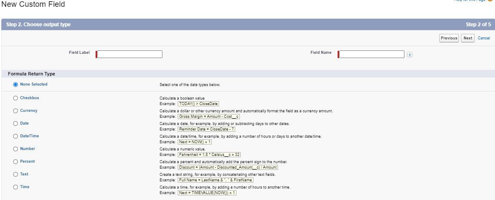

# Module - Admin Process Automation

This module introduces process automation in Salesforce.

#### Helpful References/Links

* [Formulas: How Do I ... ? (Salesforce Help)](https://help.salesforce.com/articleView?id=how_do_i.htm&type=0)
* [Formulas Quick Reference](https://resources.docs.salesforce.com/224/latest/en-us/sfdc/pdf/salesforce_formulas_cheatsheet.pdf)
* [Formula Data Types (Salesforce Help)](https://help.salesforce.com/articleView?id=choosing_a_formula_data_type.htm&type=5)

## The Declarative Frontier

We've discussed previously that it is a best practice to use declarative customizations over programmatic customizations whenever possible and we have now arrived at the limit of those declarative tools. We will begin this module by discussing basic automation tools such as formula fields, validation rules, duplicate rules, and matching rules, before moving on to more complex devices such as workflows and approval processes and ending with the most powerful declarative instruments available to us: processes and flows. Behold the landscape, beyond the declarative tools discussed in this module lies only wilderness.... well actually code is what lies beyond this module, but that's beside the point.

## Formula Fields

We briefly touched on formula fields in the `Admin Data Model` module, but let's give a more comprehensive overview here. When creating formula fields, we build a formula that will be evaluated to a value of the data type we select. At the time that users are creating or updating records, formula fields are read-only - their values are determined by the equation we wrote when creating the field and they cannot be directly edited. Let's walk through the process of creating one of these fields.

After selecting the `Formula` field data type in the first step of creating a new field, you will be presented with the following screen.

Here, we choose the return type of our formula. The available options are `Checkbox` (i.e. a Boolean), `Currency`, `Date`, `Date/Time`, `Number`, `Percent`, `Text`, and `Time`. Note that when choosing the `Currency`, `Number`, or `Percent` return types, we are prompted to choose the number of decimal places for our returned value. If we choose to use a whole number for currency (e.g. zero decimal places), Salesforce will round the returned value to the nearest even number to give that whole number (e.g. $16.50 becomes $16 and $99.3 becomes $100).

* Process Automation
  * Workflows
    * Outbound Calls/Email Alerts
    * Field Update/Create Task
  * Approval Process
  * Process Builder
    * Process Builder & Apex
  * Duplicate & Matching Rules
  * Cloud Flow Designer & Flows
  * Formula Fields
  * Validation Rules

# Process Automation
### Workflows
##### What is a workflow?
		A workflow is an automatic process triggered by specific criteria set when it is created. A workflow rule is the container of this process and can be summed up as an if/then statement.

##### What are the possible evaluation criteria for a workflow rule?
		When the record is:
			Created  - The rule is evaluated only once, when the record is created.
			Created and every time it is edited - The rule is evaluated multiple times, both when it is initially created and every time it is edited regardless of if the edit pertains to the criteria.
			Created, and any time is is edited to subsequently meet criteria (default) - Allows the rule to be run multiple times. When the record is created, and when edited, but not when the edits are unrelated to the rule criteria.

##### What are the types of rule criteria settings you can choose?
		Criteria are met - You select a field from the record, an evaluation, and value. e.g. Amount equal or greater than 50,000.
		Formula evaluates to true - You build a formula that evaluates to a boolean value. These can be more complex than a 'simple criteria are met' evaluation.

##### What automated actions can be taken by a workflow?
		Email Alert - Sends an email to the designated user using an email template.
		Field Update - Updates a field on the record the workflow was invoked on.
		Outbound Message - Sends an outbound message via the soap api.
		Create Task - Creates a task.
		Bonus: Flow Trigger - Launches a flow, this is currently pilot program only.

### Approval Process
##### What is an approval process?
		Approval processes allow you to create a multi-step process through which you can designate specific actions in reaction to the stage and approval status.

##### What actions can you perform as part of an approval process?
		Create Task, Email Alert, Field Update, Outbound Message. These behave identically to the workflow actions of the same name.
		Additionally you can lock or unlock the record in specific steps.

##### What are the different types of steps in an approval process?
		Initial Submission - When the record is submitted for approval, what actions are to be taken.
		Approval steps - We can designate multiple steps each with their own actions.
		Final approval - After it finshes all steps and finally approved, what do we want to have happen?
		Final rejection - After it finishes all steps and finally rejected, what do we want to have happen?
		Recall - If the submission is recalled, what do we want to have happen?

##### Who can edit a locked record?
		Admins, or users with the view and modify all permissions, always have access. Further we can designate during the creation of the approval process if the approver has access to editing the record.

### Process Builder
##### What is process builder?
		Process builder allows you to create automated processes execute upon specific criteria being met. It is similar in this respect to workflows, but has many additional features and enhanced capabilities.

##### What types of processes are there?
		A record change process starts when a record is created or updated.
		An event process starts when a platform event message is received.
		An invocable process starts when something else, like another process, invokes it.

##### What are the trigger options for when to start a process for a record change process?
		Record created.
		Record created or edited.

##### What are the potential criteria for a process?
		Conditions are met - the process evaluates specific fields to see if they meet the designated values.
		Formula evaluates to true - a formula built evaluates true, this allows for more complex criteria.
		No Criteria - The actions are always executed.
		Optionally at this point you can also select for it to only evaluate when the record is created or edited to meet criteria.

##### What actions can a process take?
		Create Record - creates a new record using either the values you type or values of related records.
		Invoke Process - invokes an invocable process.
		Create Chatter Post - creates a chatter post on the feed of a user, group, or the record that started the process.
		Use Quick Action - calls a quick action allowing for record creation, updates, or logging calls.
		Work with Quip documents. - create quip documents, chat rooms and folder.
		Launch a flow - launches a flow.
		Send an Email - sends an email through the use of an email alert.
		Send custom notification - sends a custom notification through salesforce.
		Submit a record for approval - submits a record for an approval process. 
		Send a survey - sends an email invitation linking to a survey question.
		Update records - Update the fields of the launching record or related record.
		Call Apex - call an invocable method from an apex class. With this it is essentially possible to do anything possible in salesforce with a process.

### Process Builder & Apex
##### How do you invoke apex from a process?
		First the class must annotate the method you want to use with @InvocableMethod.
		Select the call apex action and name the action.
		Choose the apex class.

### Duplicate and Matching Rules
##### What are duplicate rules?
		Duplicate rules are administrative tools to automatically detect duplicate records, and determine if they are allowed with warning, or prevented from being created. To determine if a duplicate exists they use matching rules.

##### What are matching rules?
		Matching rules specify what and how we check if a duplicate exists. We determine the fields that are checked, and if we check for a exact or fuzzy match.

##### What is fuzzy matching.
		Fuzzy matching is a type of matching that is allowed on certain fields, like name fields. An exact match would only catch John Smith, whereas a fuzzy match rule would also catch Jon Smith, Johnny Smith, Jonathan Smith, etc. However, fuzzy matching is not perfect, and when it comes to names tends to mainly work with western names.

### Flow Builder & Flows
##### What are flows?
		Flows are a powerful click-not-code tool to perform actions in either your salesforce org or even exernal systems. 
		Three types of flows exist: screen flows, before-save flows, and autolaunched flows.

##### What is a screen flow?
		Screen flows are used to automate processes that require user input. Through it we can create guided wizards that take a user through a complex process in a guided experience.

##### What is an autolaunched flow?
		When user input is not needed, we can leverage the same powerful capabilities of a flow that can act behind the scenes. Examples can include starting a flow on a button push or through a process.

##### What is a before-save flow?
		A before-save (or before-save update) flow is a new feature in the Spring '20 release of Salesforce; they allow for similar record-update functionality as processes, but are much faster because they occur much earlier in the Order of Execution, and therefore do not require a record to go through the entire Order of Execution again.

##### What are the flow elements?
		Flow elements represent actions that a flow can execute, such as reading/writing data, displaying information through screens, and executing business logic.

##### What are flow resources?
		Flow resources reference values that can be referenced throughout the flow.

##### What is the flow builder?
		The flow builder is a gui for flow creation. It features a canvas which represents the flow itself, and a toolbox which includes the elements and resources you can use to build the flow.

### Validation Rules
##### What are validation rules?
		Validation rules are used to improve the quality of your data, ensuring that the data imput meets the requirments of your org.
		Validation can use formulas, which must return a true or false value, and when true is returned an error is displayed.

##### What is regex?      
		RegEx, or Regular Expressions are a sequence of characters that define a search pattern. This can be used in conjunction with validation rules to ensure things like phone numbers, zip codes, and more match the desired input format.

https://help.salesforce.com/articleView?id=process_which_tool.htm&type=5