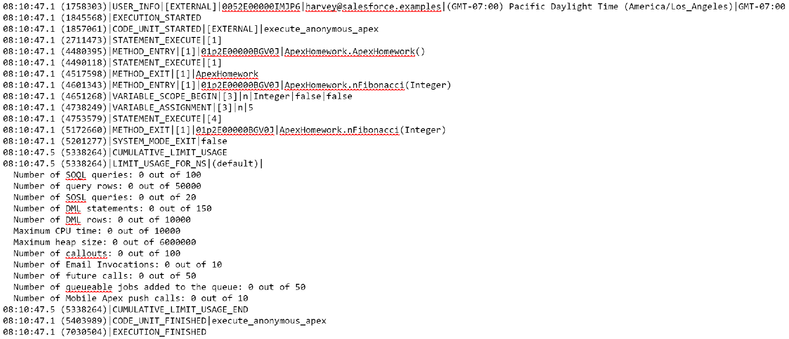
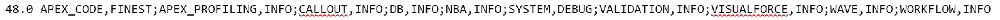

# Apex Debug Logs

Debug logs are logs detailing the execution of certain events within salesforce, providing information on those event executions. We can access our debug logs through the logs tab in the developer console, through the setup menu under debug logs, and through SFDX CLI commands.

#### SFDX CLI Commands

1. Open the developer console in your connected org, this is required to activate the listener the force:apex:log commands need.
2. sfdx force:apex:log:list _(This will return a list of logs, including their ID)_
3. sfdx force:apex:log:get --logid idoflogyouwant _(This will retrieve the specific log you passed in the ID for.)_

>>>
   
 <strong>Gail Phorsh Says</strong>: Why would we bother to do this if we already have to log into the org and open up the developer console? Beats me!
>>>

#### Helpful references/Links

* [Documentation](https://developer.salesforce.com/docs/atlas.en-us.apexcode.meta/apexcode/apex_debugging_debug_log.htm)
* [Help](https://help.salesforce.com/articleView?id=code_debug_log.htm&type=5)

## Debug Categories

Debug categories are sets of information related to specific aspects of salesforce.

| Category | Topics covered |
| --- | --- |
| Database | Includes data related to the database. |
| Workflow | Includes data relating to workflow rules, flows, and processes. |
| NBA | Includes data relating to Eistein Next Best Action. |
| Validation | Includes data relating to validation rules. |
| Callout | Includes data on external callouts. |
| Apex Code | Includes data on apex code. |
| Apex Profiling | Includes data such as namespace limits and emails sent. |
| Visualforce | Includes data on visualforce events. |
| System | Includes data relating to system methods, such as system.debug. |

>>>
   
 <strong>Gail Phorsh Says</strong>: Under traceflags you'll also see a Wave category. Not even the documentation says what this is, though it probably relates to wave analytics. I just hope it has fun doing what it does!
>>>

## Debug Log Levels

Salesforce has 8 log levels, starting at none, and increasing in granularity and detail up to finest. Each level contains new details, as well as all the information provided by the levels above them. These levels in combination with category determine what gets written to the debug log.

* None
* Error
* Warn
* Info
* Debug
* Fine
* Finer
* Finest

>>>
   
 <strong>Gail Phorsh Says</strong>: Mnemonics can help you remember! Try "Noblemen Expelled Warlocks If Dragons Flew From France" 
>>>

## Reading a Debug Log

Debug logs are made up of a series of log lines that contain a specific information relating to a debug event. Additionally they feature a header which gives an overview of information relating to the debug log.

### Debug Header

The debug header contains the api version, the log catergory, and its log level.

> 48.0

This is the API version.

> APEX_CODE, FINEST;

This is the category, followed by the debug level for it. Each of these are separated by a semi-colon.

### Debug Events

`08:10:47.1 (4601343)|METHOD_ENTRY|[1]|01p2E00000BGV0J|ApexHomework.nFibonacci(Integer)`

> 08:10:47.1 (4601343)

This is the timestamp, indicating when the event took place.

> METHOD_ENTRY

This is the event itself, what happened.

> [1]

The line number where this event took place.

> 01p2E00000BGV0J

The lightning platform ID of the class.

> ApexHomework.nFibonacci(Integer)

The method signature (with namespace where applicable).

>>>
   
 <strong>Gail Phorsh Says</strong>: System.debug lines are one of the most common tools used with debug logs. Feel free when writing out code to make heavy use of them to check your values and state, you can always refactor them out later. 
>>>

[Check out this link for more info on setting up debug logging and trace flags!](https://help.salesforce.com/s/articleView?id=sf.code_add_users_debug_log.htm&type=5)