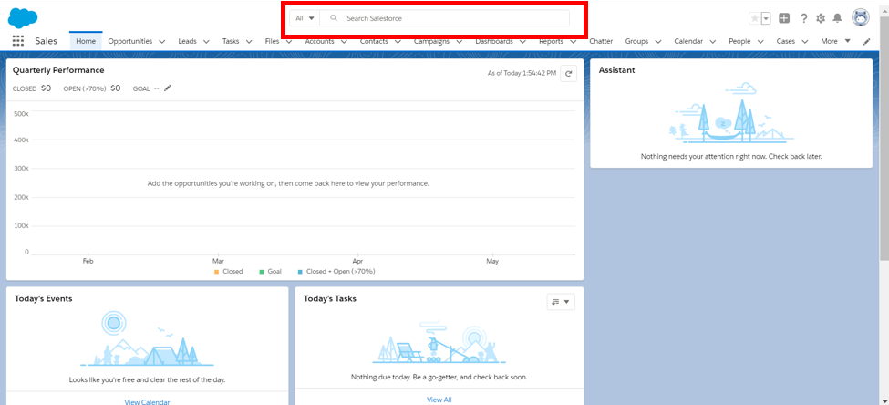
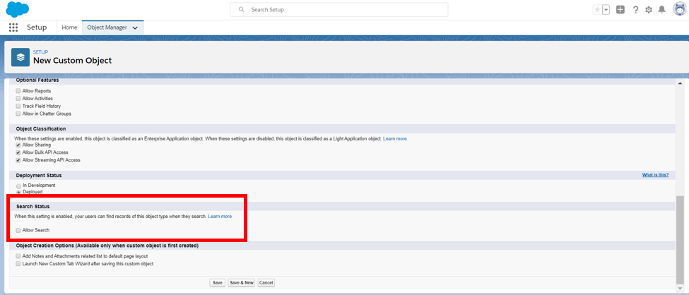
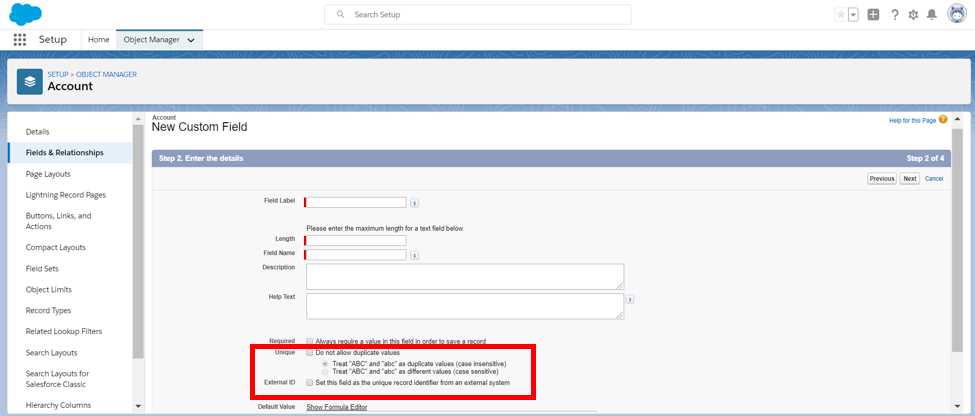

# Module - Indexing

This module introduces indexing in Salesforce.

## Table of Contents

* [Indexing (What Is It Good For?)](#indexing-(what-is-it-good-for?))
  * [Searchable Objects](#searchable-objects)
  * [Indexed Fields](#indexed-fields)

### Helpful References/Links

* [Indexes](https://developer.salesforce.com/docs/atlas.en-us.salesforce_large_data_volumes_bp.meta/salesforce_large_data_volumes_bp/ldv_deployments_infrastructure_indexes.htm)
* [Searchable Fields by Standard Object in Lightning Experience](https://help.salesforce.com/articleView?id=search_fields_lex.htm&type=5)
* [Custom Index Considerations for Selective SOQL Queries Section](https://help.salesforce.com/articleView?id=000325247&language=en_US%C2%A0&type=1&mode=1)

## Indexing (What Is It Good For?)

Generally speaking, Salesforce is designed to be used by large companies whose orgs store hundreds of thousands or even millions of records. A Salesforce Enterprise Edition org can contain up to 500 custom fields per object (note the word _custom_, this limit doesn't include Identity, Name, System, or Standard fields). Thankfully, each Salesforce org has a Global Search Box (enclosed in the red rectangle in the picture below) designed to allow us to sort through this mountain of data to find the record(s) we want quickly and easily!

... but wait! That's a potentially staggering amount of data to search through and we'd like to have our searches complete and return results sometime before Star Wars Episode LV: You Really Fell for the Whole 'Palpatine Being Dead' Thing Again?!? is released! Salesforce agrees with this sentiment; and that is where indexing and the search index enter. The Global Search Box doesn't search what we enter against every field on every object record, only against the Search Index: _indexed fields_ on _searchable objects_. This greatly reduces the computational expenses of searching. Also, as we'll see in a future module, the search index is the underlying SOSL engine. Let's discuss those two italicized phrases, indexed fields and searchable objects. We'll hit searchable objects first.

### Searchable Objects

Let's talk about each of our types of objects (standard and custom objects) separately. First, standard objects; we cannot control whether standard objects are searchable - Salesforce dictates that to us. Some standard objects, such as Assets, are not searchable. But generally speaking, the standard objects we'll deal with most (e.g. Accounts and Contacts) are searchable.

On the other hand, we can control whether custom objects are searchable. As the picture below shows, we do so by checking the Allow Search checkbox in the Search Status section of the New Custom Object page, or on the edit page of an existing custom object. It's that simple!

### Indexed Fields

Hopefully we're not searching for an analogous "Allow Index" checkbox on the field edit page because we'll be looking for a long time! This is because custom fields cannot be directly manually indexed, rather they're indexed when they are marked as an External Id or Unique field. We mark a custom field as such by checking the corresponding box (enclosed in the red rectangle in the picture below) in the custom field creation/edit wizard.

However, there are some restrictions on which fields can be Unique or an External Id. External Id fields can only have the Auto Number, Email, Number, or Text data type. In addition, fields with Picklist (Multi-Select), Currency (if our org has multiple currencies enabled), Text Area (Long), and Text Area (Encrypted) data types cannot be made unique.

As well as indexing these custom fields, Salesforce automatically indexes primary keys (i.e. Id, Name, and Owner fields), foreign keys (Lookup/Master-Detail Relationship fields), and Audit dates (such as CreatedDate). In fact, some standard fields on standard objects that do not fall into the above categories are indexed as well, as we can see by visiting the `Searchable Fields by Standard Object in Lightning Experience` link in the `Helpful References/Links` section. Lastly, we should note that we are able to request that Salesforce index specific, non-automatically-indexed custom fields in our org, but we must contact Salesforce Customer Support to do so.
