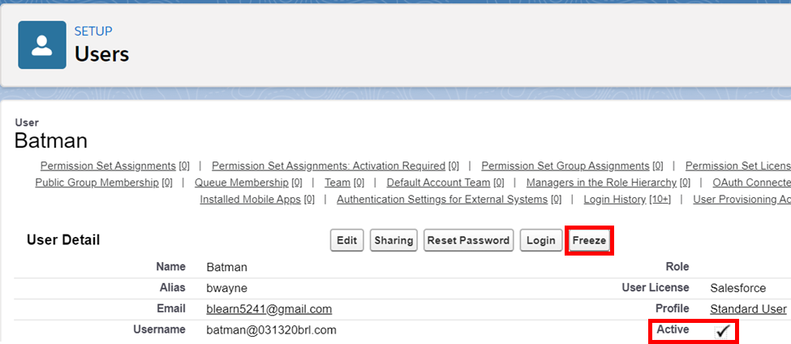
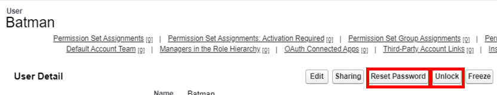
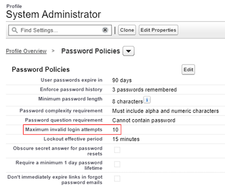

# Module - User Setup

This module introduces users within Salesforce, how to create them, and user statuses.

## Table of Contents

* [Creating a User](#creating-a-user)
* [User Statuses](#user-statuses)
  * [Managing User Statuses](#managing-user-statuses)

### Helpful References/Links

* [User Management (Salesforce Help)](https://help.salesforce.com/articleView?id=users_mgmt_overview.htm&type=5)

## Creating a User

Each user that logs in to our Salesforce org is represented as a record of the `User` object. So to create a new user, we simply create a new record of that object. But unlike most other standard objects, we create these records from within the `Setup` menu.

To do so, we can navigate to `Setup` | `Users` | `Users` and click the `New User` button. When creating this user, there are some fields that we are required to populate, including `Last Name`, `Alias` (which autopopulates when we tab out of `Last Name`), `Email`, `Username`, `Nickname` (which autopopulates when we tab out of `Email`), `User License`, and `Profile`.

As we discussed in the `Security & Access` module, the profiles available to choose are determined by the user license that we select. The username that we choose must be in the form of an email, but it does not have to be a valid, working email address. But the username must be unique across all Salesforce orgs - if we create a user with a given username, we'll _never_ be able to use that username again.

Once we click the `Save` button, our user automatically becomes `Active` - we can't create a user with any other status.

We can also create multiple users at once (Up to 10 at a time). Although we will only be able to specify their first/last name, username, profile, and role. When creating individual users, we have much more fine grain details we can give.

## User Statuses

In addition to the Active status, the remaining three user statuses are Inactive, Frozen, and Locked. As we said in the previous section, the Active status is the default. This status consumes the associated user license and allows the user to login to our org.

Inactive users are those with the `Active` checkbox unchecked on their user record. Inactive users cannot login to the org, and the license that they had been using is freed. Commonly, inactive users are those who have left the company for another job or been fired. Why aren't these users just deleted? Simple: Salesforce doesn't allow us to delete users.

Consider an example to illustrate why this limitation is in place: a disgruntled employee at our company deletes/maliciously edits records before quitting their job. If an admin was able to and did delete that user before discovering the tampered records, all of the System fields that had a value of that user's Id (crucially `Last Modified By` on the tampered records) would go blank, effectively covering the offender's tracks. So this restriction is enforced to maintain the integrity of the System fields on all records.

The last two user statuses, Frozen and Locked, have some similarities. Both statuses disable a user's ability to login, but do not free the license that user is consuming. The difference between the two lies in _who_ does the disabling. Locked users are locked by the _system_ itself after a user has entered incorrect credentials too many times. Frozen users, on the other hand, are locked by the _admin_. We might freeze a user in the case that their login credentials may have been compromised. Although the system locks users, we have the ability to both unlock and unfreeze (defrost, if you will) locked and frozen users, respectively.

### Managing User Statuses

Although users are automatically Active when we create them, we can edit their status after creation by selecting an individual user record from the `All Users` page (which can be found at `Setup` | `Users` | `Users`).

If we click the the button enclosed by the furthest left red rectangle in the following image showing a user record, we will freeze that user. The `Freeze` button will then be replaced by an `Unfreeze` button that (you guessed it!) unfreezes (defrosts) the user. To toggle a user between being inactive and active, we can click the `Edit` button to the left of the `Freeze` button and uncheck or check, respectively, the checkbox enclosed by the furthest right red rectangle.

Perhaps frustratingly for users, there is no specific message that will inform them that they have been locked out and will need to contact the admin to be unlocked. If they enter an incorrect password once, they will see a message that says `Please check your username and password. If you still can't log in, contact your Salesforce administrator.`

If they enter an incorrect password ten times in a row and become locked out, they will receive the same message, with nothing specifically stating that they have been locked. But once they are locked out, the `Unlock` button (enclosed by the right red rectangle in the image below) will appear on their `User Detail` page. Once we have unlocked the user, they can login with their old password. However, it's a safe bet to assume that the user got locked because they didn't remember their old password to begin with, so we should probably also click the `Reset Password` button (enclosed in the left red rectangle in the image below) to send a password reset email to that user while we're at it.

While ten is the default number of times that a user can incorrectly answer their password before being locked, we can edit this setting by navigating to the user's profile (at `Setup` | `Users` | `Profiles`), selecting `Password Policies` in the `Enhanced Profile User Interface` , and editing the `Maximum invalid login attempts` field (surrounded by the red rectangle in the following image). The same section is available near the end of the page in the default profile interface. We can navigate to that section by clicking the `Login IP Ranges` link on the profile detail page and scrolling up slightly.

