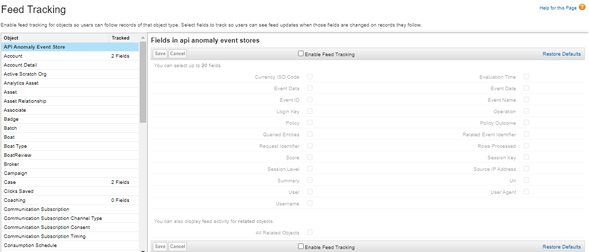

# Module - Chatter

This module introduces Chatter and its features, including the feed, groups, following, and security.

## Table of Contents

* [Chatter](#chatter)
* [Post Anatomy](#post-anatomy)
* [Polls](#polls)
* [Questions](#questions)
* [Chatter and Global Search](#chatter-and-global-search)
* [Chatter Feeds](#chatter-feeds)
    * [Record Feeds and Feed Tracking](#record-feeds-and-feed-tracking)
* [Following in Chatter](#following-in-chatter)
* [The Chatter Tab](#the-chatter-tab)
* [Chatter Groups](#chatter-groups)
* [Security in Chatter](#security-in-chatter)
* [Notifications](#notifications)
* [Creating Tasks from Posts](#creating-tasks-from-posts)

### Helpful References/Links

* [Welcome to Chatter in Lightning Experience (Salesforce Help)](https://help.salesforce.com/articleView?id=chatter_lex_homepage.htm&type=5)
* [Work with Posts (Salesforce Help)](https://help.salesforce.com/articleView?id=collab_posts_parent.htm&type=5)
* [Polls (Salesforce Help)](https://help.salesforce.com/articleView?id=collab_feed_polls.htm&type=5)
* [Questions (Salesforce Help)](https://help.salesforce.com/articleView?id=collab_questions_parent.htm&type=5)
* [Work with Feeds (Salesforce Help)](https://help.salesforce.com/articleView?id=collab_feeds_parent.htm&type=5)
* [Feed Tracking (Salesforce Help)](https://help.salesforce.com/articleView?id=collab_feed_tracking_overview.htm&type=5)
* [View a Particular Feed (Salesforce Help)](https://help.salesforce.com/articleView?id=collab_feed_filters.htm&type=5)
* [Chatter Streams (Salesforce Help)](https://help.salesforce.com/articleView?id=collab_chatter_streams_overview.htm&type=5)
* [Create Chatter Streams (Salesforce Help)](https://help.salesforce.com/articleView?id=collab_chatter_streams_create.htm&type=5)
* [Collaborate in Chatter Groups (Salesforce Help)](https://help.salesforce.com/articleView?id=collab_groups_parent.htm&type=5)
* [Collaborate with Partners and Customers (Salesforce Help)](
https://help.salesforce.com/articleView?id=collab_with_customers.htm&type=5)
* [What Your Chatter Group Role Lets You Do (Salesforce Help)](https://help.salesforce.com/articleView?id=collab_group_roles_overview.htm&type=5)
* [Archived Chatter Groups (Salesforce Help)](https://help.salesforce.com/articleView?id=collab_group_archive.htm&type=5)
* [Chatter Group Archiving (Salesforce Help)](https://help.salesforce.com/articleView?id=collab_group_archive_admin.htm&type=5)
* [Mute a Post (Salesforce Help)](https://help.salesforce.com/articleView?id=collab_feed_mute.htm&type=5
)
* [Enable Create New Tasks on Posts (Salesforce Help)](https://help.salesforce.com/articleView?id=collab_admin_feed_actions.htm&type=5)
* [Chatter: What's Different or Not Available in Lightning Experience (Salesforce Help)](https://help.salesforce.com/articleView?id=lex_gaps_limitations_collaboration.htm&type=5)
* [Chatter Feature Availability (Salesforce Help)](https://help.salesforce.com/articleView?id=collab_features_compare.htm&type=5)

## Chatter

The Cambridge English Dictionary defines chatter as "the quick, repeated noises that some animals make." The diversity in these noises throughout the animal kingdom is comparable to the diversity of the animals themselves. Monkeys shriek, birds chirp, bullfrogs croak, and - wait... what's that? Wrong type of chatter? Oh yeah, now that we think about it, it makes sense that the chatter we should talk about is the feature within Salesforce since... ya know... we're learning about Salesforce.

Chatter (the Salesforce one) is a communication channel/social network that is designed to allow end users to share information and collaborate without needing to leave their Salesforce orgs. Users can join relevant groups, get updates about changes to records, and communicate with customers. In fact, we'll explore each of those features - and more - throughout this module.

## Post Anatomy

In terms of design and appearance, Chatter looks fairly similar to Twitter. Where Twitter has tweets, Chatter has posts. Both networks make use of the hashtag, which signifies a topic in Chatter. Like in Twitter, Chatter users can tag others through use of the `@` symbol.

But this Salesforce tool offers greater functionality than the basic capabilities available when writing a tweet. We access said functionality through the Chatter Publisher, which is displayed in the following image.

As we can see, the publisher has three tabs - `Post`, `Poll`, and `Question`. We'll tackle each of these, beginning with `Post`. When we click in the `Share an update...` input, the publisher expands to the rich text editor shown in the following image.

In addition to having standard features such as creating bold and italicized text, the editor gives the option to create hyperlinks by selecting the desired text then clicking the button labeled `1` in the above image, adding the link URL, and clicking `Save`. We can also attach up to ten files by walking through the wizard that pops up when we click the button labeled `2`.

As we said earlier, we can tag other users (and even groups) through use of the `@` symbol, but we can also click the button labeled `3` to do so. Either way, we'll then start typing the name of the desired user/group and select the desired entity from the resulting popup suggestion box, which is shown in the picture below. Once we've done so, the system will take care of the rest.

When we've finished writing our post, we can click the `Share` button to publish it. Once shared, all users who can see the post can like it, comment on it, or share it to other places in our org by clicking the `Share` button surrounded by the red rectangle in the following image.

Note that when we share a Chatter post, _only_ the post is shared - any comments or attached files are not copied.

The publisher offers functionality beyond what the buttons display. For example, we can also link to records without having to use the hyperlink button by typing the forward slash (`/`) and then the record name. Similar to what we saw with mentioning users, a suggestion box will popup, we'll select the desired record, and the system will finish the job. We can link to as many as 25 records in a single post.

Finally, harkening back to its Twitter similarities, the publisher allows us to include topics through hashtags. We'll begin by typing the hashtag character (`#`), which will bring up yet another suggestion popup (shown below) that will prompt us to press `Enter` to accept our topic.

Note that we can create multi-word topics (as in the above image) and that any topic is a searchable item, so we'll be able to find posts by their topics through the global search.

## Polls

Let's continue our exploration of the Chatter publisher with polls. The `Poll` tab, shown in the following image, allows us to create a place for users to choose one of a series of options in response to a prompt.

We can click the `+Add new choice` button on this tab (shown in the above image) to add additional choices between the two that we are required to include - including up to eight additional choices for a total of ten options all together - before clicking the `Ask` button to publish our referendum.

## Questions

We can think of questions as a sort of open-ended poll. Rather than limiting our responders to choosing one of a series of predefined options, the question allows us to ask for suggestions/help from other users.

As we can see from the image below, the rich text editor for the `Details` section of a question looks similar to the editor for a regular post. In fact, we can add up to ten file attachments to our detail in addition to tagging users, linking to records, creating hyperlinks, and other standard publisher functionality.

Once a question is published by clicking the `Ask` button, users who have access to the post can organically promote the best solutions given by the community by liking the appropriate comment. Moderators and the user who asked the question can explicitly elevate the best response by clicking the `Select as Best` link (surrounded by the red rectangle in the following picture). Once an answer has been selected as the best answer, it will automatically be the first comment shown whenever anyone views the related post.

## Chatter and Global Search

Before we move on to the Chatter feed, let's briefly discuss using the Global Search to find posts. The Global Search box, shown in the following image, is present at the top center of every page in our Salesforce orgs.

When we look for a word or phrase, we can pre-filter the returned items by clicking the `All` &#9660; dropdown and choosing, e.g., `Chatter` or `Topics`. Rather than scrolling through this entire list of options, we can begin typing the desired filter and select it from the reduced list of choices.

Let's walk through an example. We'll search for `test` in the Global Search box. Instead of pre-filtering the results before they're returned, we'll filter the search results after the fact by clicking `Topics` from the left sidebar (surrounded by the left red rectangle in the following image).

Note that the search only returns records to which we have access. When we click the `Test` link in the above image (surrounded by the right red rectangle), we're taken to the topic detail page, which we can see below.

Wondering what that `+ Follow` button is all about? Don't worry, we'll get to that in a bit.

## Chatter Feeds

So once we publish a post, poll, or question, where does it go? Into the Chatter feed. The Chatter feed appears all over the place - in Chatter groups (which we'll discuss later in this module), the `Chatter` tab, a topic detail page, a record detail page (assuming that the page contains the `Chatter` standard Lightning component, which is present on these pages by default), and a user's profile, which we can reach by clicking the link on the user's name in one of their posts.

### Record Feeds and Feed Tracking

If a record detail page contains the `Chatter` standard Lightning component and we have access to the record, we'll be able to see its feed on the detail page, as in the following example, where we've selected the `Chatter` tab.

Here, we see our old friend, the Chatter Publisher. In fact, the publisher is present anywhere there's a feed - although sometimes we can only comment on a feed instead of creating a new post, so only the rich text editor portion will appear (this is the case on topic detail pages).

Note also the `Search this feed...` box, surrounded by the red rectangle in the above image. This feature is a more targeted version of the Global Search we discussed earlier - it allows us to search through this feed specifically.

We make use of the feed on the record to collaborate with other internal users on the data. However, we can also have the system make automatic posts to the record's feed when changes are made to the values of certain fields. To do so, we'll enable Chatter feed tracking by navigating to `Setup` > `Feature Settings` > `Chatter` > `Feed Tracking`, which we can see in the following picture.

Once we've arrived at this page, we can select an object from the sidebar on the left. We'll then move to the panel on the right, where we'll select the `Enable Feed Tracking` checkbox, choose up to 20 fields to track, and then click `Save`.

The standard objects that can use feed tracking are predetermined, but it includes widely-used standard objects such as `Account`, `Campaign`, `Case`, `Contact`, `Contract`, `Event`, `Lead`, `Opportunity`, `Product`, and `Task`. Topics and users are represented through standard objects whose fields can be tracked as well. Although the objects representing reports and dashboards can also be configured to give automatic updates, these objects do not have record detail pages. So instead of displaying in a feed on a detail page, any updates will be shown in feeds elsewhere, such as the ones on the `Chatter` tab.

Some of the common standard objects we listed above have automatic feed tracking already enabled, as shown in the following table.

| Standard Object | Automatically Tracked Fields |
| --------------- | ---------------------------- |
| Account | Account Name, Account Owner |
| Case | Case Owner, Priority, Status |
| Contact | Account Name, Contact Owner, Name |
| Lead | Lead Owner, Lead Status, Name |
| Opportunity | Amount, Close Date, Opportunity Name, Opportunity Owner, Stage |
| Topic | Description |
| User | About Me, Address, Email, Manager, Phone, Title |

Note that some fields on the `Chatter Group` standard object are also automatically tracked, but we've excluded these for simplicity. All custom objects can be tracked and we can select any custom fields for tracking - whether on standard or custom objects - so long as they don't have the `Auto Number`, `Formula`, `Roll-Up Summary`, `Geolocation`, or `Text (Encrypted)` data types.

## Following in Chatter

We determine what shows up in our personal feeds on the `Chatter` tab through following. In order to have posts that aren't from the groups we're a part of and don't mention us appear on our personal threads, we'll need to follow the record, person, or topic to which the post is related.

To follow an entity, we just navigate to its feed and click the `+ Follow` button that we saw on the topic detail page earlier. This means that we can follow anything or anyone that we can access through the declarative security model. When we follow something, we'll see posts, comments, attached files, any applicable record field change messages, and any hyperlinks or linked records. Note that we can follow up to 500 entities, so we can end up signing ourselves up for a lot of updates.

## The Chatter Tab

Let's dive deeper into the standard `Chatter` tab because it's one of the main places we'll see our own personal feed. The tools available for the feeds displayed on the tab - posts, comments, the publisher, etc. - aren't any different from those on the feeds we've seen so far, so we'll focus on the tab's sidebar, pictured below.

Let's tackle the first five of these options through the following table.

| Sidebar Option | Aggregates... |
| -------------- | ------------- |
| `What I Follow` | The feed from everything we follow. |
| `To Me` | All posts/comments where we're mentioned, all posts made to our profile page, and any posts that we've made that have comments (our posts without comments will not be shown here). |
| `Bookmarked` | Every post that we've bookmarked (we can bookmark a post by clicking &#9660; next to the post and then choosing `Bookmark`). |
| `Company Higlights` | Trending posts in our org using relevance ranking through Einstein. This is the default feed when we enter the `Chatter` tab until we've followed ten entities, at which point `What I Follow` becomes the default. |
| `My Drafts` | All saved posts that we've made but haven't yet published or deleted. |

Following these feeds, we have the `Streams` category, which is where we see self-created combinations of feeds from many different entities, including individual users, groups, records, and topics. We can create up to 100 streams that each have as many as 25 combined feeds each, although only our first five streams will be displayed on the `Chatter` tab. If we have more than five streams, we can click the `Streams` category from the sidebar, which is a link to the `Streams` page.

Every combination that we create is entirely personal - no one else can see them - and we populate them by visiting desired entities and clicking the `+ Follow` button. Once we've created a stream, this button will bring a popup similar to the one shown in the image below. This popup allows us to add the record, person, or topic to our `What I Follow` feed, an existing stream, and/or create a new stream that will hold the related feed. Note that we do not have to be following an entity in general to make it part of a stream.

If we no longer want to include a feed in a stream, we can remove it. But this will only stop new activity on the feed from appearing - existing posts, comments, files (PCFs, collectively), and so on will not be removed.

Alright, time for the last part of our sidebar: `Recent Groups`, which displays the last groups we looked at (up to five groups in total will be shown in this category). What are Chatter groups? Well...

## Chatter Groups

Chatter groups are collections of related users made to make it easier for those who work together often to collaborate. Let's walk through each type of group, from least to most restrictive, beginning with the `Public` group.

Any user in an org can see a `Public` group and the PCFs that it contains. Additionally, anyone in the org can join the group of their own volition, but they do not need to do so to add their own PCFs.

If we want a more restricted option, we can turn to the `Private` group. Here, only group members can see/add PCFs and, while any user can ask to join a `Private` group, their request must be approved before they'll be able to see the team's contents. 

`Unlisted` groups are even more restricted - only current group members or those who have the `Manage Unlisted Groups` system permission can see the group's discussions. Others in the org don't even know that these groups exist! The only way they can find out about the team and join it is by receiving an invitation from the group owner or manager. Of course, we'll have to enable `Unlisted` groups before we can make them, so we'll need to select `Enable Unlisted Groups` once we've navigated to `Setup` > `Feature Settings` > `Chatter` > `Chatter Settings`. In addition to having internal users, `Private` and `Unlisted` groups can also be `Groups with Customers`, meaning that they can include people external to our org.

Chatter groups are controlled by the owner (who is the user who created the group by default) and the group's managers. To create a group, we must have the `Create and Own New Chatter Groups` system permission. We'll then be able to navigate to the `Groups` tab and select `New`. Alternatively, we could click the `+` next to the `Recent Groups` category on the `Chatter` tab to create our team. Either of these options will bring up the form we see below.

Here, we choose a group `Name`, `Owner`, and `Access Type` - the last of which can be either `Public`, `Private`, or `Unlisted` (if we have `Unlisted` groups enabled). We can also optionally create a `Group with Customers` by selecting the `Allow customers` checkbox. Finally, we can create a `Broadcast Only` group - a `Public`, `Private`, or `Unlisted` group where only the owner/managers can post, but other members can comment - by selecting `Broadcast Only`.

Once we've created the team, we can navigate to the group detail page. Any group owners or managers will see the `Manage Members` component surrounded by the red rectangle in the following picture.

Once we select the `+ Add` button for any user, we can click the resulting `X` to remove them from the group or select the &#9660; arrow to change the user's role in the group and elevate them to a group manager. Group managers have the same capabilities as owners, except they can't change the group owner or delete the group entirely. The manager/owner permissions include editing posts that others have made in the group, inviting others to join the team, removing members, and approving join requests. But we should note that neither the owner nor the manager(s) can delete posts made by other users to the group or the automatic posts made from feed tracked changes to record fields.

If our group goes stale, it will automatically be `Archived` when there haven't been any new posts or comments in the team for 90 days. When a group is archived, no one can make a new post, although existing posts can still be seen and users can add new comments to them. To disable automatic archiving, we can navigate to our group detail page, select &#9660;, `Edit Group`, `Disable automatic archiving`, and click `Save`. 

If a group has been archived, the owner or any manager can reactivate it by clicking the `Activate Group` button shown in the picture below.

We've detailed many types and characteristics of Chatter groups throughout this section, so let's summarize what we've learned in the following table.

| Characteristic/Feature | `Public` Group | `Private` Group | `Unlisted` Group |
| ---------------------- | -------------- | --------------- | ---------------- |
| Non-Members Can See that Group Exists |  |  | |
| Non-Members Can See Group's Contents |  | | |
| Non-Members Can Post |  | | |
| Can Be `Broadcast Only` |  |  |  |
| Can Include Customers | |  |  |
| Need Approval to Join | |  |  |
| Can Ask to Join | |  | |

Note that any activity in a group that we're a part of will be included in our personal Chatter feeds, regardless of that group's characteristics.

## Security in Chatter

Chatter respects the declarative security model that we discussed in our `Security & Access` module. This means that users won't be able to see or follow a record's feed if they don't have access to the corresponding record. If someone posts a link to a record in a place where a given user can see the post, but the viewing user doesn't have permission to access the record, a `[Record Not Available]` message will display, as in the following image.

Further, if a user is mentioned in a group or record feed that they can't access, they'll never even know that the post was made. Finally, the Chatter Questions that we post can only be answered by those who have access to the feed where we asked them. This means that we can choose our desired feed to reach a targeted group and ensure that, e.g., all of our follows, only the members of a specific group, or only the users with access to a specific record can respond.

## Notifications

Whenever a post is made to our profile, others comment on a post that we made, or someone `@` mentions us in a post or comment, we'll get an in-app notification. This alert will arrive by way of the notification bell, which is surrounded by the red rectangle in the following image and holds the 20 most recent notifications sent by features such as Chatter and approval processes in the past 90 days.

By default, any post that is included in one of our Chatter streams will give us both in-app and email notifications. This can be useful because automatic field tracking posts for records don't give notifications on their own, so we can use streams as a way to get alerted when records change.

But we should be aware that email notifications are much more common than in-app ones - by default, we'll receive emails in all of the cases listed in the following table.

<table align="center">
    <tr>
        <th colspan="2">By default, we receive emails when...</th>
    </tr>
    <tr>
        <td>We're mentioned in a post/comment</td>
        <td>Another user follows us</td>
    </tr>
        <td>Another user posts or comments on a post on our profile</td>
        <td>Someone likes our post/comment</td>
    </tr>
    <tr>
        <td>Another user comments on our post</td>
        <td>Another user comments on a post that we also commented on</td>
    </tr>
    <tr>
        <td>Another user comments on a post that we liked/bookmarked</td>
        <td></td>
    </tr>
</table>

That's..... a lot. So to maintain some sort of sanity and ensure our inbox doesn't cry, we can edit our email notification settings by clicking our avatar, then `Settings`, selecting `Chatter` > `Email Notifications` from the left sidebar, and making changes as we see fit. We also have the ability to set our email settings for groups that we join on this same page, as displayed below.

Note that the `Limited` option is less frequent than weekly digests.

Additionally, we can mute individual posts by navigating to the `What I Follow` feed on the `Chatter` tab or going to the corresponding post detail page, selecting &#9660;, and choosing `Mute`. Once we've muted a post, we'll no longer receive notifications about it until another user mentions us in a new comment on the same post, at which point it'll automatically be unmuted.

## Creating Tasks from Posts

Let's conclude this module by discussing how we can create tasks from Chatter posts. Before we can take advantage of this feature, we need to do some setup. We'll appropriately navigate to `Setup`... then `Feature Settings` > `Chatter` > `Feed Item` > `Feed Item Layouts` and click the `Edit` link.

Once we're editing the layout, we'll click the wrench icon in the `Quick Actions in the Salesforce Classic Publisher` section (`1` in the above image) then drag `Create New Task` (`2`) from the `Quick Actions` category to the same section - even if we're working in Lightning Experience. Once we've saved the layout, users will be able to select the &#9660; arrow and `Create New Task` to make a Task record that will have the contents of the post as its `Comments` by default.
