# Module - Admin Data Visualization

This module introduces reports and dashboards in Salesforce.

[[_TOC_]]

#### Helpful References/Links

* [Report Type Reference (Salesforce Help)](https://help.salesforce.com/articleView?id=reports_report_type_reference.htm&type=5)

## Data Visualization Motivation

Having records in our Salesforce org is great: storing data allows us to keep information on our most 
successful products, our biggest customers, points of contact at the accounts we sell to, and other 
important metrics. But what if we really want to understand the records in our org? Perhaps we want to 
quickly determine the total amount of our won opportunities in a given year, how quickly cases are closed, 
our most popular products, or some other actionable data; this is where our Salesforce data visualization tools, 
reports and dashboards, come in - they allow us to quickly and efficiently create visuals that help us to not 
just report on, but truly understand the data stored in our organization.

## Reports

A report is simply a list of records that meet some kind of criteria that we define. We can do a lot with reports, 
such as: filter, group, and make calculations. We can even make charts. 

#### Report Types

A report type is what determines the fields and records that we can include in our report. This is based on 
the relationships between a primary object and up to four related objects. There are two types 
of reports: standard and custom. Standard types are Salesforce-made, the fields and records available 
through a standard report type are predefined for us. All standard objects have standard reports. When creating
custom objects, we can specify that we want standard report types generated by selecting the "Allow Reports" 
checkbox. While some standard objects have a diverse set of standard report types, 
custom objects only have standard report types that reflect their relationships to other objects. 

>>>
   
 <strong>Gail Phorsh Says</strong>: Remember when we selected 'Allow Reports' on our objects? This determines 
 whether or not standard report types are generated. This has no effect on custom report types.
>>>

Each report type has a primary object relationship and a field layout.

The object relationhip determines which records to include. If only one object is chosen, then the report type 
will only include records for that object. If a related object is also chosen (remember up to 4), then the report 
type includes records from the primary object with (or without, depending on configuration) related objects. 
Each of the (up to 4) related objects can have the "with" or "with or without" configuration. 

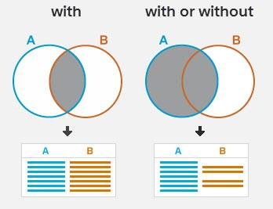

The field layout determines which fields the report type includes. These will be the columns in our report. 
If you don't see the fields we want after we select our report type or if there are too many fields, 
we can always create or edit a custom report type. Note: You can't edit standard report types.

#### What is the custom report type?
Users with the manage custom report types permission have the ability to create custom reports. 
This allows the user to define the information they want available in it. To create a custom report, simply navigate 
to "Report Types" in your org settings. Here is what that looks like below. 

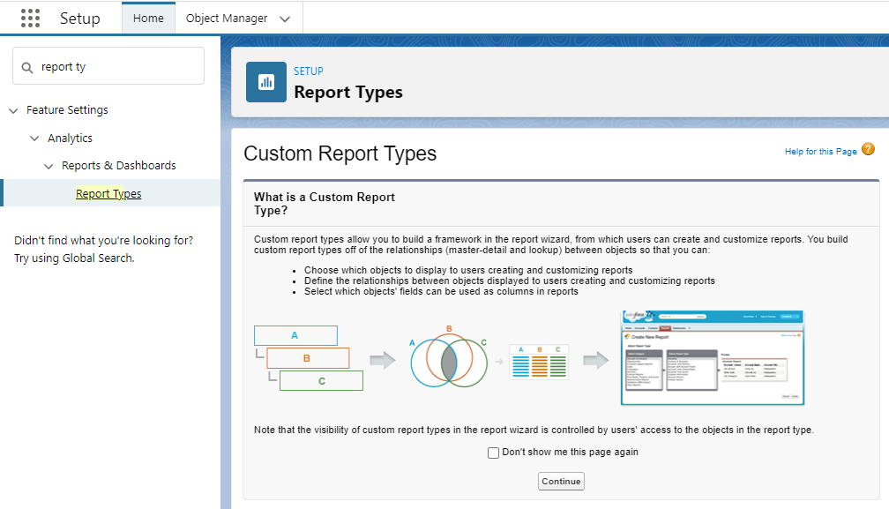

#### Filters

While in the report builder, we can use filters and filter logic to allow us to get more specific about the kind of 
data we are trying to view. Here are some of our filter options:

* Standard filter - Applied by defualt to most objects. Different objects will have different standard filters, but most 
	will include the standard filters Show Me and Date Field. Show Me filters the object around common groupings 
	(like “My accounts” or “All accounts”). Date Field filters by a field (such as Created Date or Last Activity ) 
	and a date range (such as “All Time” or “Last Month”).

* Field Filter - Field filters are available for reports, list views, workflow rules, and other areas of the application. 
For each filter, set the field, operator, and value. With tabular, summary, and matrix reports, you can drag a field 
from the Fields pane to the Filters pane to add a report filter.

* Filter Logic - Add Boolean conditions to control how field filters are evaluated. You must add 1 field filter before 
applying filter logic.

* Cross Filter - Filter a report by the child object using WITH or WITHOUT conditions. Add subfilters to further filter 
by fields on the child object. For example, if you have a cross filter of Accounts with Opportunities, click Add 
Opportunity Filter and create the Opportunity Name equals ACME subfilter to only include those opportunities.

* Row Limit - For tabular reports, select the maximum number of rows to display, then choose a field to sort by and the 
sort order. You can use a tabular report as the source report for a dashboard table or chart component, if you limit the 
number of rows it returns.

Below we can see an example of using a field filter to show only my accounts where the type is "Customer - Direct".
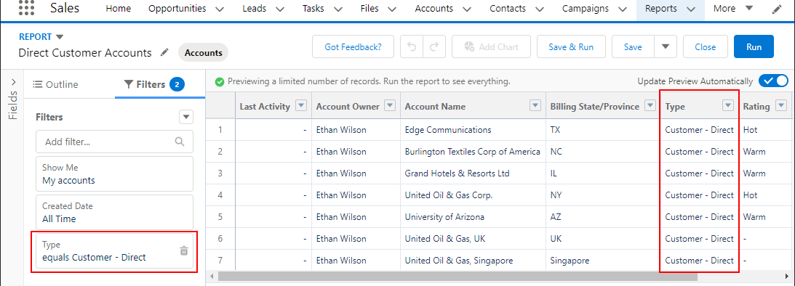

Pretty cool stuff. But it's time to get a little more advanced by using Cross-Object filters. These will allow us to get more 
insight into our data by also throwing related objects in the mix. 

#### Cross-Object Filters

This type of filter allows us to include related objects in our report that relate to the original object that is defined in 
the report type. As an example, let's see what the process looks like for creating a report that gets all of our accounts 
that have opportunities that are in the early stages.

First we must create a report with the "Accounts" report type. Then we can go to our filters and set the Created Date range 
to "All Time". Then click the dropdown and select "Add Cross Filter". 

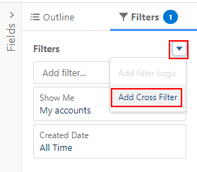

After that we can specify our cross filter configuration. In our case, we want Accounts with Opportunities so we will do just 
that. Notice we could have also specified "without" opportunities, or any other secondary objects available in the dropdown menu.

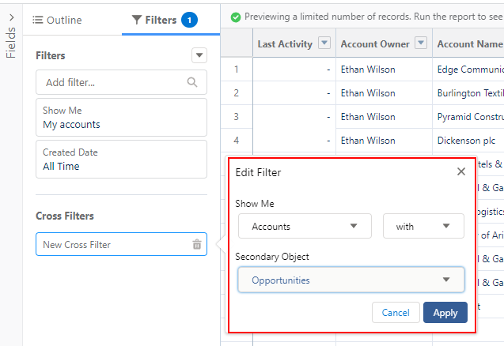

Once we have our cross filter set up, you can then even include a sub-filter on our cross filter. We will utilize that to 
specify that we only want opportunities that have the early stages we are looking for. You can see that below. 

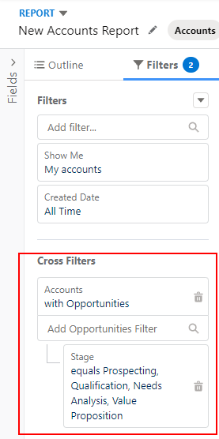

#### Filter Logic

We have another tool at our disposal to help with filters, filter logic. In a previous example we created a report that 
returned accounts that have a type of "Customer - Direct". But what if we wanted our report to return all accounts with 
a type of "Customer - Direct" OR "Channel Partner / Reseller"? Well if we were to add both of those field filters, we 
would get no matching records. That is because they conflict with each other. We can use filter logic in this situation 
to help us out. Let's take a look at that below.

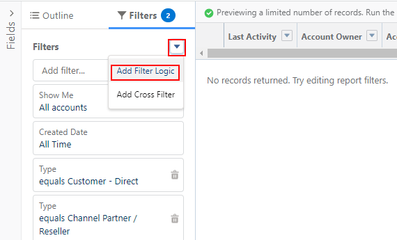
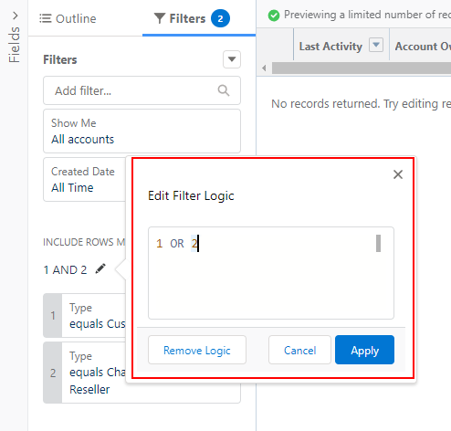

As we can see, we are saying filter by "1 OR 2". So we get the results we are looking for. You can have more complex logic 
here as well if need be. Maybe your filter logic is based on three filters? It could look like this: "1 AND (2 OR 3)". It 
really just depends on your business case needs. You have three operators to choose from when using filter logic: AND, OR, and NOT.
		
#### Report Formats

There are four main types of report formats: Tabular, Summary, Matrix, and Joined.

Quite simply, these formats allow us to look at our reports in different ways. This helps us better 
visualize our data based on business requirments. 
	
##### What is the tabular format?
It provides a list of records including what fields you selected, and ordered by the field the user that made the report defined.
Similar to a spreadsheet.
Cannot be used for charts.
Cannot be used in dashboards unless rows are limited.

##### What is the summary report format?
It provides the aggregate information Sum, Average, Min, Max, based on a selected column.
They can be used to generate charts, and be used as a source report for a dashboard component.

Let's take a look at a quick example below. 

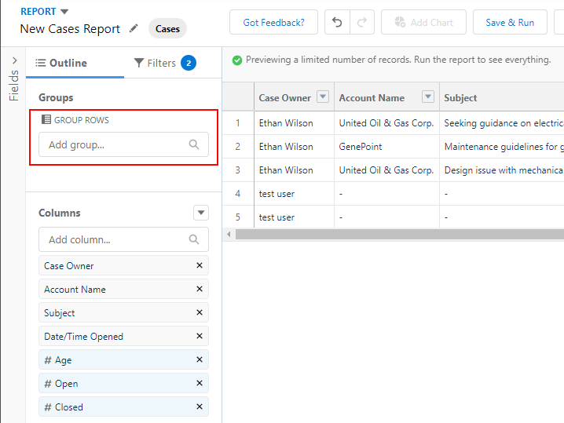

Here we can see that we are in a cases report. In the outline pane, we can simply group rows by the field 
we wish. If we were to group by priority, for example, we can get a quick summary report of our cases broken 
down by their priority. 
	
##### What is the matrix report format?
Similar to summary, but can be grouped by both rows and columns.
They can be used to generate charts, and be used as a source report for a dashboard component.

Let's see an example below. 

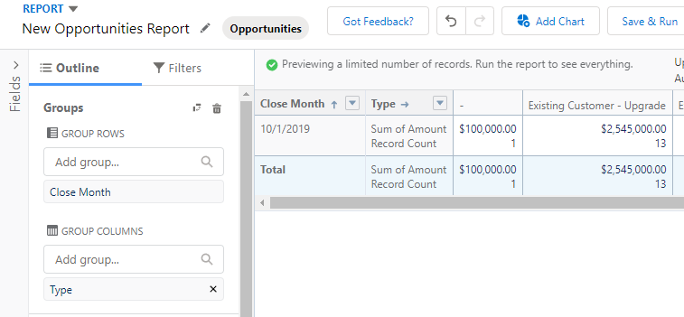

Here we can see, that to create a matrix format, we must specify a grouping both for rows and columns. This 
example shows a matrix format of summed opportunity ammounts by close month and by type. 

##### What is the joined report format?
Joined reports let you create multiple report blocks that provide different views of your data. Each block acts like a “sub-report,” with its own fields, columns, sorting, and filtering. A joined report can even contain data from different report types.
Joined reports are available only in Enterprise, Performance, Unlimited, and Developer Editions.

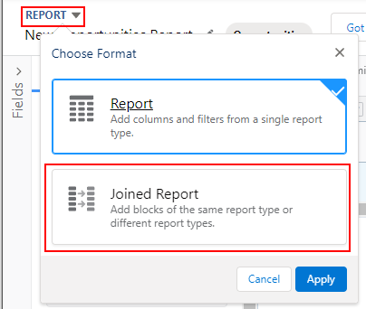

#### Report Folders

Reports are stored in folders, through which we can grant three levels of access.
	* View - Allows user/group to view.
	* Edit - Allow user/group to view/edit.
	* Manage - Allow user to view/edit, and grant access to other users.
	
Folders can be:
	* Public
	* Hidden
	* Shared
	
You can control access to folder contents based on:
 * roles
 * permissions
 * public groups
 * territories
 * license types
 
With all these options we can easily make a folder available to the entire orginization or only the original owner. 
We can even create sub-folders (up to 3 levels deep), they will have the same contol access as their root folder.

## Report Charts 

Before we get into dashboards, if you just want to add a chart to your report we can do that as well. Simply 
click the chart icon on your report to set that up. 

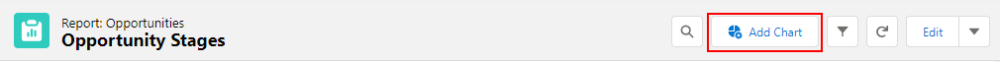

#### Exporting Reports

You can export reports for use outside of your Salesforce org. Simply click export in the dropdown selection 
beside the name of your report. 

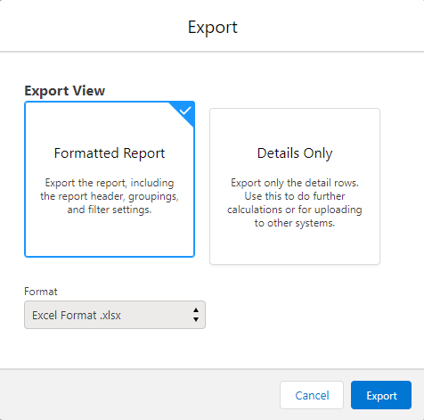

As you can see, we can choose to export the report as formatted or details only. Formatted allows an Excel file. 
While Details Only allow Excel or CSV file. Both options can handle up to 100,000 rows and 100 columns.

#### Scheduling Reports

We have the ability to schedule reports to run at a time we specify. Simply select "Subscribe" on the 
report we wish to set up a schedule for. We will then see this:

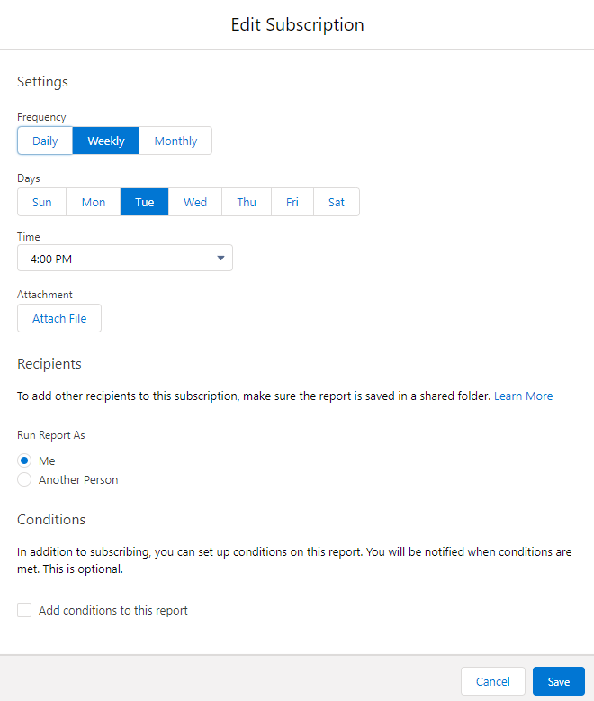

As you can see we can specify: the time to run the report, an attachment (the exported report see above), and we can 
additionally specify recipients (if in shared folder), who the report is run as, as well as any custom conditions.

#### Summary Formulas

We have yet another tool to get more information from our reports, summary formulas. 
These are a great way to get additional calculations from the data in our reports. You can 
add up to five summary formulas to summary and matrix reports. Let's take a look at a quick 
example below.

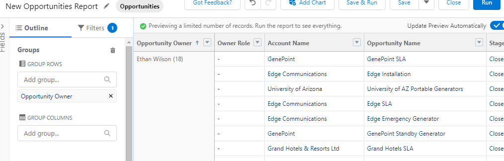

Here we have a report of closed opportunities that is grouped by the owner. Now what if we wanted to include the 
opportunity win percentage for each of our opportunity owners? We can do that with formulas!

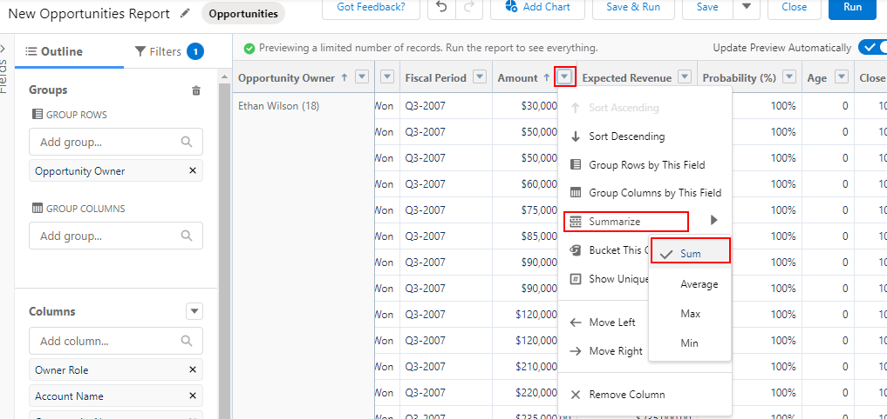

First, as we can see above, let's also include a sum of amount for our opportunity owners.

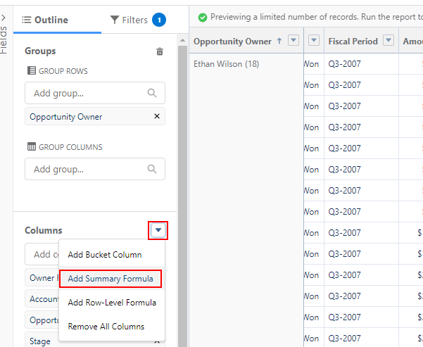

Then, as we demonstrate above, let's click the dropdown by "Columns" on the outline pane and 
select "Add Summary Formula". 

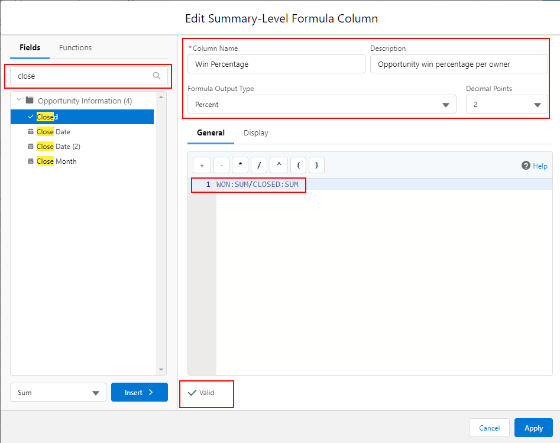

That brings us to where we can edit our summary formula column, as seen above. We have many 
options available, but pay attention to the key areas highlighted. We have: An area where we 
can search/import specific fields into our formula, a place to give the column a name and 
specifiy the output type, as well as our formula editor and syntax checker button. (Notice the 
syntax checker already says valid. This is because your author already clicked the button)

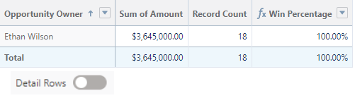

After we click "Apply" and toggle "Detail Rows" towards the botton of the page we can see our 
finished product above. We now have a report that shows all our opportunity owners, the sum 
of their opportunities, the total number of their opportunities, as well as their win percentage. 
That's a lot of useful data thanks to summary formulas!

#### Row-Level formulas

While summary formulas acted on a column, we can also make calculations per row as well. Let's walk through the 
steps of how to do that. 

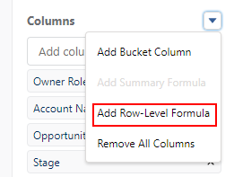

Above, we can see we add a row level formula quite the same as a summary formula. 

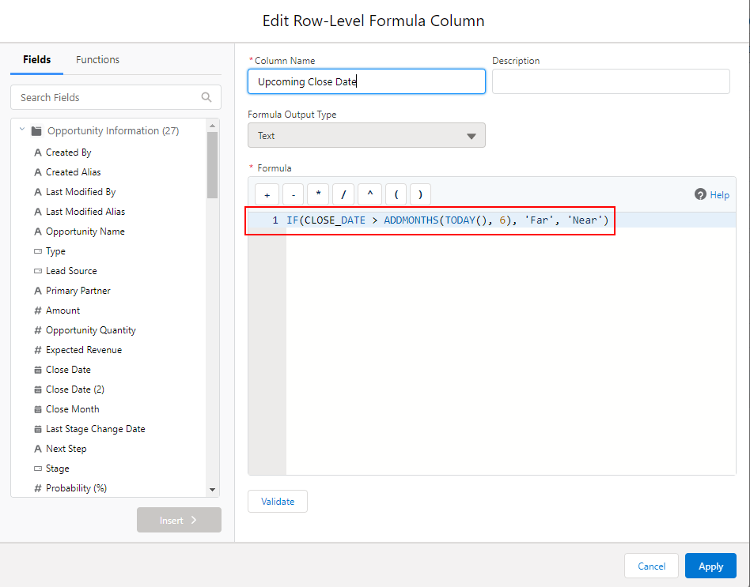

In this example, we are adding a column to each row that will display "Far" if an opportunity is farther away 
than six months, or "Near" otherwise. As you can see, you can get really creative with the formulas at your disposal. 

#### Report Buckets

Report buckets are a way to quickly orgnazie report records without needing to create formulas or a custom field. 
When you define a bucket column, you can create multitple categories(buckets) to organize your report values. You 
can also sort, filter, and group by these bucket columns as well. 

Here is an example below of creating a bucket column on accounts that can organize these accounts based of their 
number of employees. 

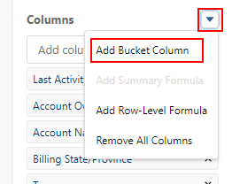
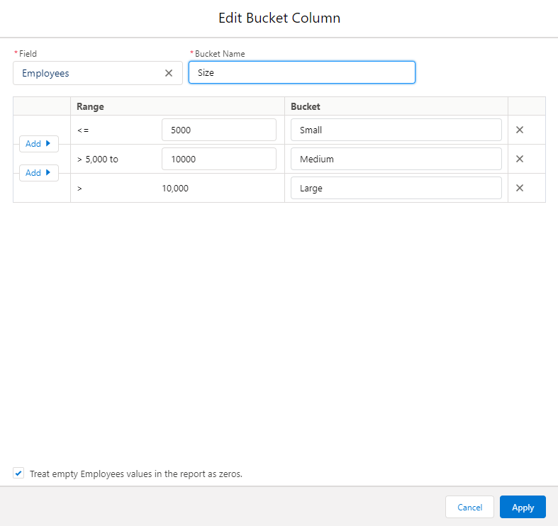
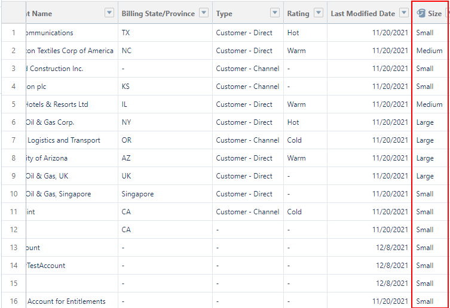

## Dashboards

#### What is a dashboard?
A dashboard offers a way to visually display, through charts, the information available in reports 
through dashboard components. They can be created by navigating to the dashboard object and clicking 
"New Dashboard". This will bring you to the Lightning Dashboard Builder. 

#### What is a dashboard component?
A dashboard component allows the user to select a report, and then display the information from the 
report in a variety of charts, such as donut, bar, and even a tabular display. Joined reports and 
historical trend reports are not available to be a source report for a component. 

#### Dashboard Folders, Security, and Dynamic Dashboards

Dashboards are stored in folders that control who has access, much like reports. So if you have access to a 
folder, you can see all the dashboards it contains. To view a certain dashboard component, however, you also need
access to the source report for the component as well. 

We have another major security concern to keep in mind: the dashboard running user. The running user for the 
dashboard determines what data to display, based on the running user's security settings. 
So everone who views the dashboard will see data based off the security settings of the running user, 
regardless of their own security settings. For this reason we should be very selective of who is the running user. 
We do have yet another option, however.

Enter, Dynamic dashboards. These types of dashboards set the running user to always be the currently logged-in user.
This way, users will only ever be able to see data based on their own access level. To achieve this, navigate 
to a dashboard's properties by clicking the cog icon while in the Lightning Dashboard Builder. Under "View 
Dashboard As" you can select: Me, Another Person, or The dashboard viewer(dynamic dashboard). Take note that 
there are limitations on how many dynamic dashboards an org can have at one time. This is based on the edition 
of the org.

#### How many components can exist on a dashboard?
20.
	
	
	
	
----------------------- stuff to be potentially added in the future	

historical trend reporting