# Module - Sales Cloud

This module introduces Sales Cloud, its standard objects, and its automation tools.

## Table of Contents

* [The Cloud of Sales](#the-cloud-of-sales)
* [Leads and Lead Creation](#leads-and-lead-creation)
* [Lead Assignment](#lead-assignment)
* [The Lead Lifecycle](#the-lead-lifecycle)
* [Account Teams](#account-teams)
* [Opportunity Teams](#opportunity-teams)
* [Sales Processes](#sales-processes)
* [Path](#path)
* [Products and Price Books](#products-and-price-books)
* [Marketing User and Campaigns](#marketing-user-and-campaigns)
* [Data Model](#data-model)

### Helpful References/Links

* [What if my company reaches the limit for web-generated leads? (Salesforce Help)](https://help.salesforce.com/articleView?id=faq_leads_what_if_my_company.htm&type=5)
* [Map Custom Lead Fields for Lead Conversion (Salesforce Help)](https://help.salesforce.com/articleView?id=customize_mapleads.htm&type=5)
* [Lead Conversion Field Mapping (Salesforce Help)](https://help.salesforce.com/articleView?id=lead_conversion_mapping.htm&type=5)
* [Guidelines for Mapping Custom Lead Fields for Lead Conversion (Salesforce Help)](https://help.salesforce.com/articleView?id=customize_mapleads_guidelines.htm&type=5)
* [Customize Account Team Roles (Salesforce Help)](https://help.salesforce.com/articleView?id=accountteam_customize_roles.htm&type=5)
* [Manage Your Account Teams (Salesforce Help)](https://help.salesforce.com/articleView?id=accountteam_add.htm&type=5)
* [Account Team Fields (Salesforce Help)](https://help.salesforce.com/articleView?id=accountteam_fields.htm&type=5)
* [Guidelines for Using Opportunity Teams (Salesforce Help)](https://help.salesforce.com/articleView?id=salesteam_def.htm&type=5)
* [Opportunity Splits (Salesforce Help)](https://help.salesforce.com/articleView?id=teamselling_opp_splits_overview.htm&type=5)
* [Guide Users with Path (Salesforce Help)](https://help.salesforce.com/articleView?id=path_overview.htm&type=5)
* [Products and Price Books (Salesforce Help)](https://help.salesforce.com/articleView?id=products_pricebooks.htm&type=5)
* [Difference between Sales Price and List Price (Salesforce Help)](https://help.salesforce.com/articleView?id=000315315&type=1&mode=1)
* [Available Feature Licenses (Salesforce Help)](https://help.salesforce.com/articleView?id=users_feature_licenses_available.htm&type=5)
* [Campaigns (Salesforce Help)](https://help.salesforce.com/articleView?id=campaigns_def.htm&type=5)
* [View Campaign Hierarchy Statistics (Salesforce Help)](https://help.salesforce.com/articleView?id=campaigns_hierarchy.htm&type=5)

## The Cloud of Sales

Sales Cloud is a Salesforce-made, cloud-based app that provides a variety of sales functionality. Salesforce itself says that Sales Cloud is its most popular product (which now that we think about Salesforce.... Sales Cloud... kind of makes sense).

There are a variety of standard objects included with Sales Cloud, including Account, Contact, Opportunity, Lead, Product, Price Book, Quote, Contract, and Order. The app also includes standard Salesforce automation tools (workflow rules, process builder, approval processes, etc.) as well as some app-specific automation features (i.e. `Lead Assignment Rules`, `Lead Auto-Response Rules`, `Web-to-Lead`, `Sales Processes`, `Lead Processes`, and `Paths`).

Because of our experience with Trailhead Playgrounds and Developer Editions, we may think that even those app-specific features come standard with all Salesforce orgs, but this is not the case. While Sales Cloud is included with our practice orgs, production Salesforce orgs only get the app if they purchase it in addition to their base license.

Now that we've clarified, let's move on to the rest of this module, where we'll detail these features as well as the use of standard objects in Sales Cloud.

## Leads and Lead Creation

We will begin with the Lead. A lead is a potential customer - someone who has expressed interest in our company and products, but is not yet qualified, and should therefore be kept separate from our existing customers. The criteria for becoming qualified is different from company to company, but the criteria should be such that we'll have enough information and interest from the potential customer to believe that we can land a deal with them. For example, we could require that we have an email address/phone number, company name, and company industry for any lead for it to be determined to be qualified to convert.

The Lead has many tools that are analogous to those we saw for Case in our exploration of Service Cloud, so we'll walk through each of these, from creation to conversion, addressing related features as appropriate. We can of course create Lead records from the user interface just as we can create records of other objects, but there are declarative tools that allow us to let our customers create Lead records representing themselves as well.

For example, we have `Web-to-Lead`, which functions analogously to `Web-to-Case`. This tool is located at `Setup` > `Feature Settings` > `Marketing` > `Web-to-Lead` and allows us to generate an HTML form that we can then include as markup in a separate location, like our company's website. When end users fill this form and submit it, a Lead record will be created in our Salesforce org. In fact, we can use this tool to generate as many as 500 leads per day.

So how do we go about generating this form? On the feature setup page, we click `Create Web-to-Lead Form`, which directs us to a page similar to the one shown in the following image. Here, we'll select the fields that will be included on our form, the URL that users will be redirected to once they submit the form, and whether our form will include a reCAPTCHA (a common additional form of verification to ensure the operation is being performed by a human and we're not being spammed by a bot). Once we're all set up, we'll select `Generate`, which takes us to a page containing the metadata elements to place in the head of our HTML page and a `<form>` to place in our page's body.

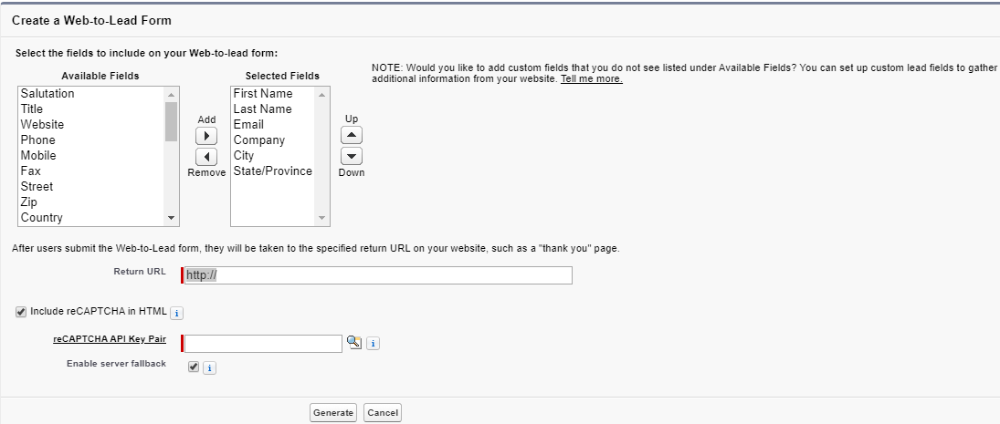

Once Lead records have been created through this tool, automated tools such as `Lead Auto-Response Rules` will execute. We use lead auto-responses to notify customers that we have received their submission and welcome them to our business. To configure them, we navigate to `Setup` > `Feature Settings` > `Marketing` > `Lead Auto-Response Rules` and select `New`. We'll then be directed to a page asking for a rule name and activation. Our org can only have one active `Lead Auto-Response Rule` at a time, but each rule can have multiple rule entries.

Once we've created our rule, we can add an entry by clicking the name of the parent rule and selecting `New` from the rule detail page. Each rule entry has a `Sort Order`, which specifies the order in which the system evalutes the entries. Rule entries are similar to control flow - the first entry with fulfilled criteria will be the only entry to execute - so we want our most specific entries to run first in order to ensure that they execute whenever their conditions are satisfied. If we don't do this, a more general, earlier entry may catch all records before they ever have a chance to reach our targeted one.

After determining our rule order, we define criteria - the field values that a record must have to satisfy our conditions and execute the entry. Next, we specify the name and email address that will be listed as the sender on our auto-response email, which will be delivered to the email address of the lead that was created through the `Web-to-Lead` feature. The final step allows us to choose a template for the mail.

## Lead Assignment

Once our leads have been created through `Web-to-Lead`, we identify the user or queue of users who is responsible for qualifying the lead by giving them ownership of the record through assignment rules. We can find these rules at `Setup` > `Feature Settings` > `Marketing` > `Lead Assignment Rules`, where we'll click `New` to create a rule. After clicking the button, we'll be prompted to name our rule and activate it.

Again, we should be aware that our org can only have one active `Lead Assignment Rule` at a time, but each rule can have multiple rule entries. After we've created the rule, we can create entries by clicking the name of the rule from the `Lead Assignment Rules` page, at which point we'll be directed to a separate screen where we can click another `New` button to create the entry.

Each entry has an order and criteria, which are analogous to the similar parts of an entry for an auto-response rule. However, our assignment rule entries end with the granting of record ownership to a user or queue, as we can see from the entry creation page pictured below. We can also optionally choose an email template that will be used to notify the new record owner that.... well that they now own this record.

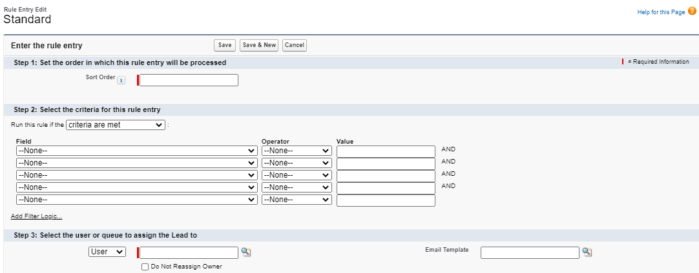

While we're certainly familiar with users, queues may be an unfamiliar term, so let's define them. Queues are groups of related users that can take temporary ownership of a newly created record. We access them at `Setup` > `Users` > `Queues`, where we can create a new queue with the `New` button. When creating a queue for lead assignment, we should be sure to move the Lead object from the `Available Objects` column to the `Selected Objects` column on the lead creation page - we can't assign a record to a queue if the queue isn't enabled for the corresponding object.

We can add individual users, users who hold a role, users who hold a role and their subordinates, and/or public groups to our queue. In addition, we can specify queue email notification settings, which will only be utilized with our Leads if an email template is chosen when creating an assignment rule entry.

There's no limit to the number of queues we can create and any user within a queue will have full access to the records assigned to that queue. When a user has bandwidth, they can claim sole ownership of the record with the `Change Owner` button. This is incredibly valuable because it eliminates overhead.

Without queues, a sales representative who just finished all of their tasks would have to contact their manager, inform them of this, and wait for the manager to get back to them with another lead to explore. In addition, leads may not be distributed evenly among all reps. Sure, we could assign every person the same number of records, but no two leads are equal - some may be customers that we don't have a chance with who will quickly shut us out, others may be eager buyers who are ready to sign on the dotted line, and still others may be interested parties who still need a lot of time and attention from our reps to make their final decision.

With assignment through queues, we take away all of these concerns. Whenever a sales rep needs more work, they can simply visit the queue and claim ownership of a lead. It's that simple.

## The Lead Lifecycle

Just as we have the `Support Process` in Service Cloud, Sales Cloud contains a `Lead Process`, an automation tool that allows us to provide guidance for our users and determine where a lead is in the recruitment journey as we try to convert them to a paying customer.

We can find these processes and add new ones at `Setup` > `Feature Settings` > `Marketing` > `Lead Processes`. After clicking `New`, we'll be prompted to choose an `Existing Lead Process` and a `Lead Process Name`. The base process determines the initial setup of process steps, which are values of the Lead `Status` picklist field. The default base process is named `Master`, which includes all possible `Status` values. After we click `Save`, we'll be redirected to the screen for the process we just created, where we'll be able to see the statuses used throughout the process in the `Selected Values` column.

Like `Support Processes`, `Lead Processes` will not be used for new records until we associate it with a record type of the corresponding object. To create this assoication, we'll choose the desired process from the `Lead Process` dropdown when creating a Lead record type. In fact, we cannot create a Lead record type until we've made such a process.

Once we've performed this setup, the record type used when creating a Lead will determine the process through which the lead travels. Note that editing the `Lead Process` is the _only_ way to edit the Lead `Status` values for a record type. We can edit the values for picklist fields for a given object on its record types, so long as the picklist field is not associated with a process - whether that's a `Lead Process`, a `Support Process`, or a `Sales Process`, the last of which we'll detail shortly.

The following image displays an example of a lead within a `Lead Process`. Note that we can advance the `Status` by clicking the `Mark Status as Complete` button on the far right side of the path. Alternatively, we could click a future stage in the path and choose the `Mark as Current Status` button or `Select Converted Status` (this latter option will only appear when we choose the `Converted` `Status`, but both buttons will take the place of `Mark Status as Complete`). Lastly, we could accomplish the same goal by editing the record's `Lead Status` field.

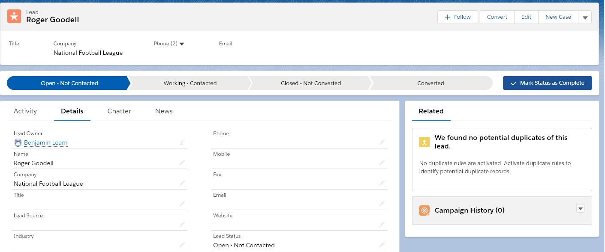

When we change the `Status` to `Converted`, the Lead conversion wizard - which is shown in the following picture - appears. Here, we create a new account or associate an existing account in addition to creating a new contact or associating an existing one with our lead. If we choose to associate both an existing account and an existing contact, the two records must already be related in our org. Finally, we can optionally create a new Opportunity record or associate an existing one. Even though this last step is not required, the end goal of any lead is to create a paying customer, and we use the Opportunity object to represent potential sales - i.e. the qualified deals our sales team is exploring - so we'll often want to make an opportunity.

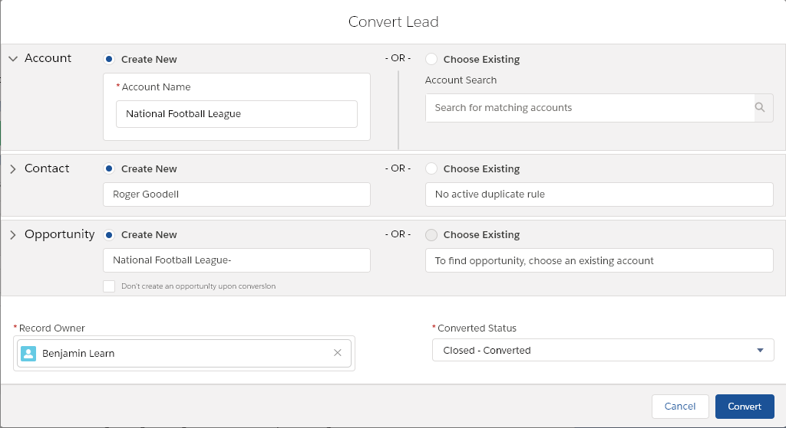

The system populates standard fields of accounts, contacts, and opportunities created from a lead with information from that lead's standard fields. Most of these mappings are displayed in the following table.

| Lead Field | Mapped Account Field | Mapped Contact Field | Mapped Opportunity Field |
| ---------- | -------------------- | -------------------- | ------------------------ |
| `Address` | `Billing Address` | `Mailing Address` | N/A |
| `Annual Revenue` | `Annual Revenue` | N/A | N/A |
| `City` | `Billing City` | `Mailing City` | N/A |
| `Company` | `Account Name` | `Account` | `Opportunity Name` and `Account Name` |
| `Country` | `Billing Country` | `Mailing Country` | N/A |
| `Description` | N/A | `Description` | N/A |
| `Email` | N/A | `Email` | N/A |
| `First Name` | N/A | `First Name` | N/A |
| `Industry` | `Industry` | N/A | N/A |
| `Last Name` | N/A | `Last Name` | N/A |
| `Lead Owner` | `Owner` | `Owner` | `Owner` |
| `Lead Source` | `Lead Source` | `Lead Source` | `Lead Source` |
| `Mobile` | N/A | `Mobile` | N/A |
| `No. of Employees` | `Employees` | N/A | N/A |
| `Phone` | `Phone` | `Phone` | N/A |
| `Postal Code` | `Billing Postal Code` | `Mailing Postal Code` | N/A |
| `Rating` | `Rating` | N/A | N/A |
| `State` | `Billing State` | `Mailing State` | N/A |
| `Street` | `Billing Street` | `Mailing Street` | N/A |
| `Title` | N/A | `Title` | N/A |
| `Website` | `Website` | N/A | N/A |

Although we don't have control over standard field mappings, we can configure the system to automatically populate custom fields of the created objects with the values from the custom fields on the Lead object. To do so, we'll navigate to `Setup` > `Object Manager` > `Lead` > `Fields & Relationships` and select `Map Lead Fields`, which is enclosed by the red rectangle in the image below.

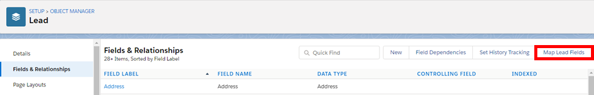

Once we arrive at this page, we can map fields for the Account, Contact, and/or Opportunity objects, as we've done by associating the `Current Generator(s)` Lead field and the `Current Generator(s)` Opportunity field in the following picture.

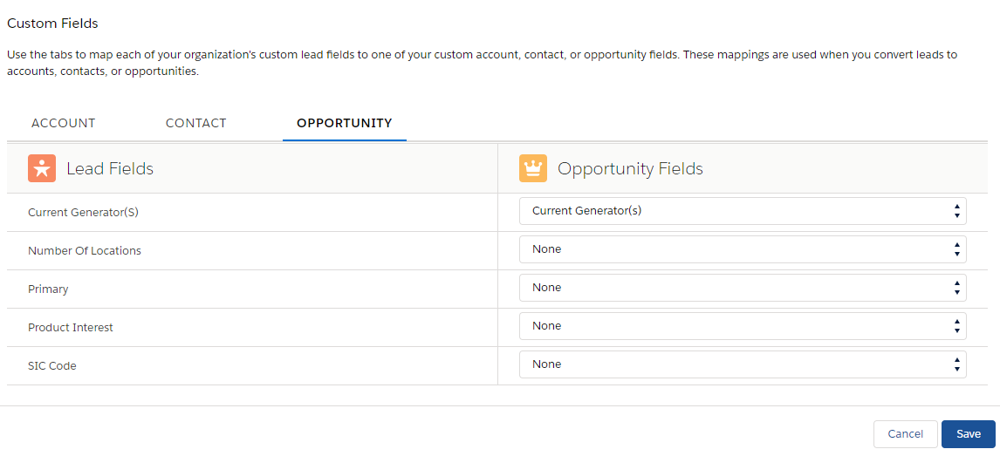

## Account Teams

Before we address opportunities, let's discuss collaboration in Sales Cloud. We'll begin with `Account Teams`, which are collections of users with diverse skills and profiles from across our company who work together and collaborate on a record or records.

We can enable this feature by navigating to `Setup` > `Feature Settings` > `Sales` > `Account Teams`, selecting the `Enable Account Teams` link, checking the `Account Teams Enabled` checkbox, and finally clicking the `Save` button. We'll then be directed to a page where we can add the `Account Team` related list to the object's page layouts.

We can view and modify the member roles for this sales team by clicking the `Team Roles` link on the `Account Teams` page. Unlike with `Case Teams`, there are no predefined sales teams. Instead, users create their own default groups. Assuming that our organization-wide default (OWD) for the User object is set to `Public Read Only` or we have the `View All Users` permission, we can create our default team by clicking our user avatar (enclosed in the top right red rectangle in the image below) and then `Settings` (enclosed in the bottom red rectangle in the image).

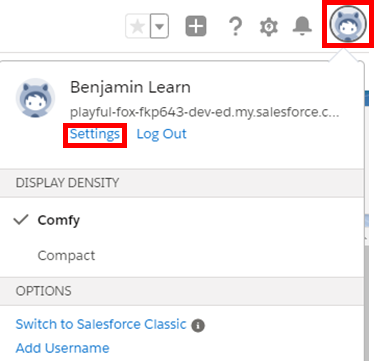

When editing our settings, we'll click `Advanced User Details` and scroll to the `Default Account Team` section. The `Add` button in this section will take us to a screen similar to the below image, which displays the default `Account Team` creation screen.

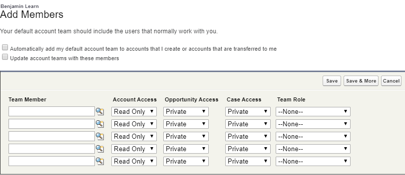

Here we can add up to five users to our team, set their access to the account and its related records, and choose a role for them. If our OWD for Contact is set to `Controlled by Parent` (like it is for the above image), we won't be able to provide access to the related contacts separately because any user with access to the account will automatically get access to those related records. Any access provided to the records, whether it's to the account or its related contacts, cases, and/or opportunities, must be less restrictive than or equal to the OWD for the corresponding object.

Once teams have been enabled and the corresponding (or "related") related list has been added to a page layout, members can be modified from the record detail page by clicking the `Add Default Team` button, which adds the default team of the record owner. Any user that has the ability to edit the account will be able to add team members, but only system administrators, the record owner, a user holding a role that is hierarchically above that of the record owner, or a user with full access to the record can edit or delete existing team members.

## Opportunity Teams

`Opportunity Teams`, another form of Sales Cloud collaboration, can be enabled by navigating to `Setup` > `Feature Settings` > `Sales` > `Opportunities` > `Opportunity Team Settings`, selecting the `Enable Team Selling` checkbox, and clicking the `Save` button. Upon selecting `Save`, we'll be directed to a page where we'll be prompted to add the `Opportunity Team` related list to the page layouts for the object.

`Opportunity Teams` are similar to their Account counterparts in that they again allow for diverse groups of users to collaborate on a record. In fact, both of these sales teams share member roles - so the roles we edit by clicking `Team Roles` from the `Account Teams` page will be used for both types of groups. Note that although the teams share roles, the roles do not necessarily have to be occupied by the same members.

To create our default `Opportunity Team`, we'll navigate back to our user settings, click `Advanced User Details`, and scroll to the `Default Opportunity Team` section. The `Opportunity Team` creation page differs from the analogous page for `Account Teams` in that the we can only set access for the Opportunity record and the `Opportunity Access` dropdowns on this page do not have the `Private` access option, just `Read Only` and `Read/Write`. 

Only the record owner and those holding a role that is hierarchically above the record owner can modify team members on Opportunity records. The `Opportunity Team` related list on the Opportunity record page has a `Add Default Team` button that functions analogously to the one for the Account page. In addition, `Opportunity Teams` have the ability to enable Opportunity Splits, which can be configured at `Setup` > `Feature Settings` > `Sales` > `Opportunities` > `Opportunity Splits Settings`. This feature allows the revenue from an opportunity to be credited to multiple users in the team, rather than to just the record owner.

## Sales Processes

`Sales Processes` are used to provide a visual aide to users as an opportunity progresses towards becoming a signed deal. We configure this feature by navigating to `Setup` > `Feature Settings` > `Sales` > `Sales Processes`.

The `Sales Process` is set up in a way that's largely analogous to how we configure `Lead Processes` - we first create the process, choose the steps that the process contains (which in this case are drawn from the values of the `Stage` picklist field on Opportunity), and add the process to an Opportunity record type to use it with new opportunities. Again, we'll be unable to create an Opportunity record type until we've made a `Sales Process` with which we can associate it.

## Path

While `Sales Processes` and `Lead Processes` allow us to visualize where a record is in a given lifecycle, the `Path` is a more visual tool. We can create a `Path` for the `Account`, `Campaign`, `Case`, `Contact`, `Contract`, `Fulfillment Order`, `Lead`, `Opportunity`, `Order`, `Quote`, `Service Appointment`, `Work Order`, and `Work Order Line Item` standard objects (in addition to all custom objects that have at least one `Picklist` field).

As we've just seen, this feature can be used with more objects than processes, but it offers additional advantages. Rather than just displaying the place of a record in a lifecycle, we can create user guidance on a step-by-step basis because each step has its own screen that can be modified. These screens can be used to display instructions on how to progress a record to the next step in the `Path`, as well as showing only the fields relevant for that specfic step.

To activate `Path`, we navigate to `Setup` > `User Interface` > `Path Settings` and click `Enable`, at which point the `Enable` button will be replaced by a `New Path` button. On the first step in the `Path`, we'll input a name for the instance and choose the its object and record type (each record type can be associated with up to one `Path`). We'll also choose the corresponding picklist, which determines the different step values in the `Path`.

After we click `Next`, we'll arrive at a screen similar to the below image, which displays the `Fields and Text` page for a `Path` on Opportunity associated with the `Stage` picklist. Here, we can add up to five fields per step in the `Fields` section and include text instructions in the `Guidance for Success` input. This wizard contains a separate step for each existing picklist value present in the chosen record type for the selected field.

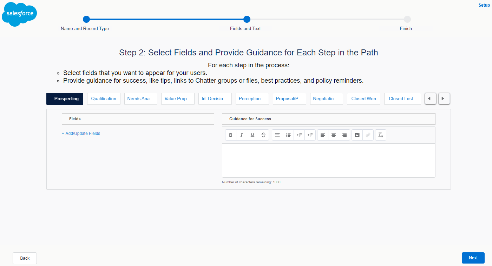

When we click `Next` on the `Fields and Text` page, we'll be taken to a final page where we can activate our `Path` and optionally add confetti to its steps.

The following screenshot displays an example of an active `Path`. We should note that the `Path` is automatically added to the related object's record detail page, assuming that we created the feature for the Opportunity, Lead, or Case objects because these objects already have the relevant Lightning component on their detail pages.

Because we created our example for Opportunity, it's already on our record page as soon as we activate it, as shown by the following image. Note that the button enclosed in the red rectangle can be used to toggle the display of the step-specific fields and guidance.

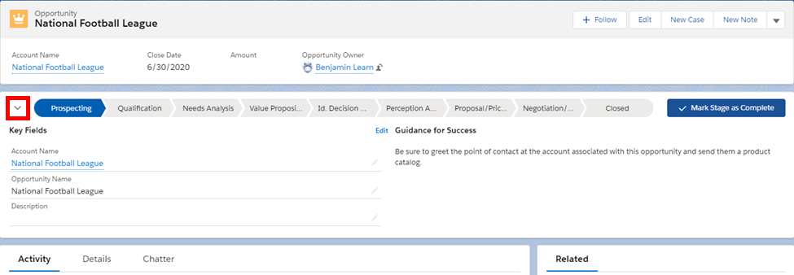

If we created the `Path` for a different object, we'll need to edit the related Lightning record page and add the `Path` standard Lightning component.

## Products and Price Books

Products and Price Books are the standard objects that store information about the items/services our company sells and their associated prices, respectively. Even though the `Products` tab is not included in the `Sales` app by default, Product is still a part of Sales Cloud. 

Once we create a product, we can add it to a price book, which holds a list of products and their prices. Price books come in one of two flavors: standard and custom. Trailhead Playgrounds and Developer Editions have premade standard price books, but we can make our own by selecting the `Is Standard Price Book` checkbox when creating or editing a Price Book record.

Before we can add a product to a custom price book, it must have a standard price, which it gains by being added to one of these standard price books. The standard price book functions as our master catalog, holding the default cost of each product we sell. To perform this operation, we can navigate to either the Product or Price Book record and click the `Related` tab. If we're on a product, we'll select `Add Standard Price` (enclosed in the red rectangle in the following image), which will bring a popup that prompts us to enter the standard price in the `List Price` field.

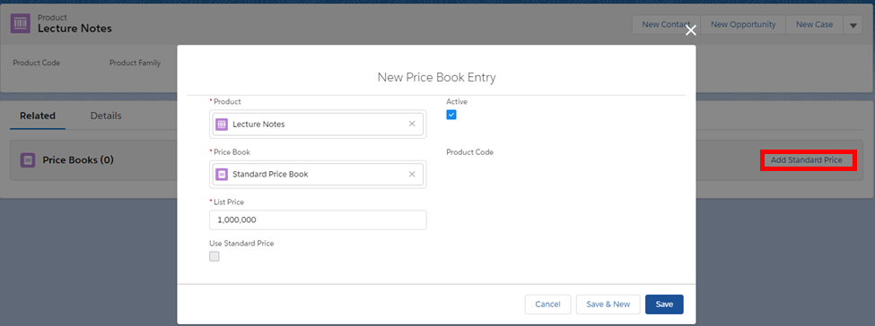

Once the product is in a standard price book, we can add it to custom price books by revisiting the `Price Books` related list on the product record and clicking the button that is now labeled `Add to Price Book`. Alternatively, we can first give a product a standard price and then add it to a custom price book by visiting the desired Price Book record (beginning with the standard one), clicking the `Related` tab, and selecting the `Add Products` button in the `Price Book Entries` related list.

How can we have a single product in multiple price books? Because the two objects aren't directly related. Rather, they're associated through the `Price Book Entry` junction object, which is a child of both `Price Book` and `Product` that's used to associate a product with its price in a specific catalog.

We'll frequently take advantage of this junction in order to group product prices by, e.g., the industry/location of our customer or the customer's service level agreement in books made specifically for that purpose. Note that we can configure our price books such that a product has the same price in both standard and custom books, but this is not a requirement.

Once our products are in the desired price books, we can add them to opportunities by navigating to the opportunity and selecting &#9660; and `Add Products` (both of which are surrounded by red rectangles in the following image).

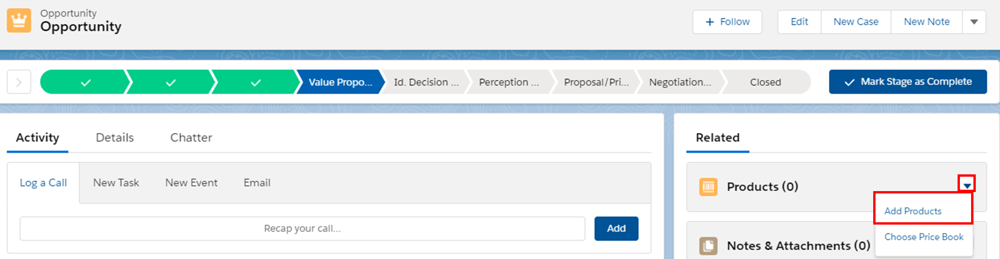

If this is our first time adding products to this particular opportunity, we'll be prompted to choose our price book, as shown below (if we've already chosen a price book for the opportunity, we can select the `Choose Price Book` button in the image above). Whether we choose a standard or custom catalog, our choice will determine the list (i.e. default) prices with which we'll be working.

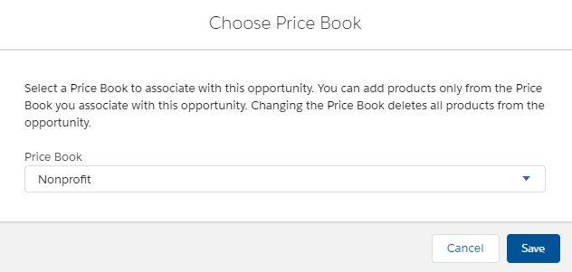

After we select our book and click `Save`, we'll be taken to a screen where we can choose products to add to the opportunity before clicking `Next`. This latter button will take us to the following screen.

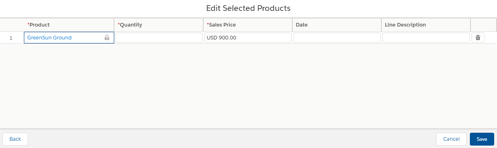

Here, we'll choose the `Quantity` and `Sales Price` of each product. The default `Sales Price` (`$900.00` in our example above) is the list price from our chosen price book. We can leave the list price as the `Sales Price`, but we can also modify it and we'll frequently choose this latter option if, e.g., our customers getting discounts because they're making bulk orders. Once we've configured things to our liking, we can click `Save` to relate the products to our opportunity.

Note the use of the word "relate" in the last sentence. Even though it's mostly happening under the hood here, what we're actually doing is creating records of the OpportunityLineItem object, which serves as a junction between Price Book Entry and Opportunity.

## Marketing User and Campaigns

Although Sales and Marketing Clouds are two distinct Salesforce products, Sales Cloud does have some marketing features. These tools are not used to create marketing materials, but rather to track the outcomes of our marketing.

In order to work with marketing features in Sales Cloud, a user must be a `Marketing User`. To create such a configuration, we can edit the user's record and select the `Marketing User` checkbox, which grants them the `Marketing User` feature license.

When a user has this license, they can create and manage campaigns and campaign members. Campaigns represent our external marketing efforts and we can use the records of this object to group marketing programs together in a hierarchy to be able to analyze them at multiple levels.

To relate multiple campaigns, we make use of the `Parent Campaign` field on the Campaign object. With this self-lookup, we can group campaigns into up to five different levels organized by factors such as marketing strategy, media channel, or time period, going from general parent campaigns to more granular children.

Let's take a look at an example record page for a Campaign record.

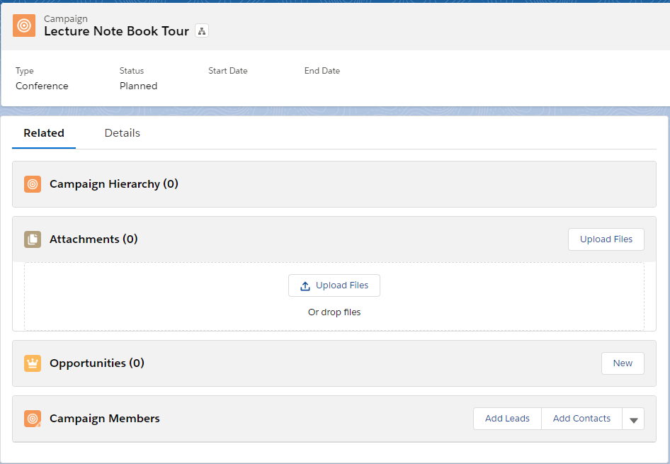

The `Campaign Hierarchy` related list displays the children campaigns that we can configure through that `Parent Campaign` field. It also shows statistics for the Campaign record we're viewing as well as those of its direct children campaigns. These statistics include information such as the number of contacts and leads generated, as well as our expected revenue from each of these programs. Although any grandchildren, great-grandchildren, or great-great-grandchildren won't be shown separately in this related list, their statistics will be aggregated as part of those for the children campaigns.

Our next related list, `Opportunities`, lets us associate an opportunity with a campaign, so we can track and later report on how much revenue came as a direct result of that specific effort. Finally, the `Campaign Members` related list displays the contacts and leads that we land as a result of our marketing, connecting these people to our campaigns. We can also add leads or contacts to a campaign by visiting the Lead or Contact record detail pages and selecting the `Add to Campaign` button on the `Campaign History` related list.

## Data Model

Let's conclude this module with an abbreviated Sales Cloud data model - shown below - containing all of the objects we've discussed in this unit. Note that this is an abbreviated data model - there are many more objects involved in Sales Cloud that are out of our current scope. We should take special note of the relationship between `Price Book` and `Opportunity`, representing that one price book can be used for many opportunities.

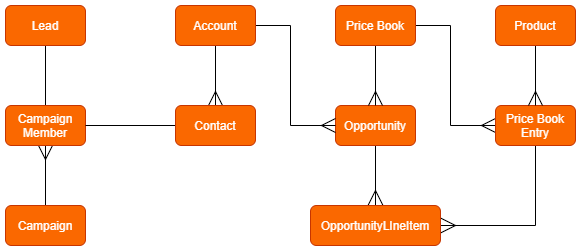

