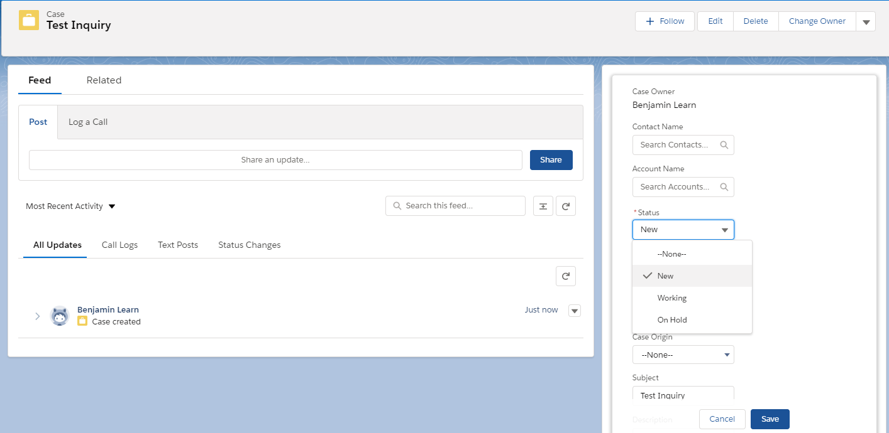
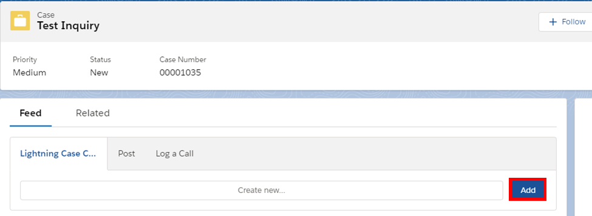

# Module - Admin Service Cloud

This module introduces Service Cloud in Salesforce.

#### Helpful References/Links

* [Get to Know Service Setup and Install Service Features (Salesforce Help)](https://help.salesforce.com/articleView?id=console_lex_service_setup.htm&type=5)
* [Create a Case Close Quick Action (Salesforce Help)](https://help.salesforce.com/articleView?id=cases_set_up_lex_close_case.htm&type=5)
* [Case Comments (Salesforce Help)](https://help.salesforce.com/articleView?id=rss_case_comments.htm&type=5)
* [Set Business Hours (Salesforce Help)](https://help.salesforce.com/articleView?id=customize_supporthours.htm&type=5)
* [Set Up Web-to-Case (Salesforce Help)](https://help.salesforce.com/articleView?id=setting_up_web-to-case.htm&type=5)
* [Set Up Case Teams (Salesforce Help)](https://help.salesforce.com/articleView?id=caseteam_setup.htm&type=5)
* [Set Up Email-to-Case (Salesforce Help)](https://help.salesforce.com/articleView?id=setting_up_email-to-case.htm&type=5)
* [Build Your Knowledge Base in Lightning Experience (Salesforce Help)](https://help.salesforce.com/articleView?id=knowledge_lightning_parent_admin.htm&type=5)
* [Encourage Idea Creation and Sharing in Salesforce Communities (Salesforce Help)](https://help.salesforce.com/articleView?id=ideas_salesforce_communities.htm&type=5)
* [Enable and Customize Ideas Settings (Salesforce Help)](https://help.salesforce.com/articleView?id=ideas_settings.htm&type=5)

## Customer Service - Service Cloud

Customer service is an essential part of any business. Ensuring that any problems with products are quickly and efficiently resolved will not only allow a business to continue operations, but grow and thrive as well. As we've said before, Salesforce is a customer relationship management platform, so naturally it comes with an app for customer service and support - Service Cloud. Service Cloud is one of the most commonly used Salesforce apps and is included in all Trailhead Playgrounds and Developer Edition orgs. Cases are the primary CRM object in Service Cloud and are used as a representation of an individual customer's product question, feedback, or problem. Service Cloud users examine cases to improve customer support and see how they affect a product's sales.

Setup for Service Cloud can be performed in the traditional `Setup` or `Service Setup`, which contains a smaller set of menu options solely related to Service Cloud and provides quick and easy setup wizards. The buttons to open `Setup` and `Service Setup` are enclosed in red rectangles in the below image.

## Support Processes

The support process is a valuable service cloud automation tool that assists busy support agents by ensuring that they follow the same set of steps to resolve a case, therefore also ensuring that customers get a consistent and high-quality level of service. To find support processes, go to `Feature Settings` > `Service` > `Support Processes` in `Setup` or `Process Automation` > `Support Processes` in `Service Setup`. Note that the support process is an _entirely_ different concept from the process builder we explored in the `Admin Process Automation` module. While both of the tools allow for automation of common business practices, they are not related in any way beyond that.

To create a new support process, click the `New` button on the `Support Processes` page. You will then be prompted to choose an `Existing Support Process` and a `Support Process Name`. The base process determines the initial setup of case status values (which will be discussed shortly) and allows you to save some time if you are creating a new process that is similar to an existing one. The `Master` process is the standard base process and it includes all case statuses by default.

Once you click the `Save` button, you will be redirected to the screen for the process you just created, which displays the statuses used throughout the process (see the below image for an example of this screen). A record's `Status` value is what determines where it is in the life of the support process. Members of the `Selected Values` column are the statuses that are used for the process - they guide your users through the desired resolution lifecycle. Any members in the `Available Values` column are the remaining statuses that are defined in the `Status` field on the case object. In almost any circumstance, the first (and default) status in the process will be `New` and the final status will be `Closed`, which indicates that the issue has been resolved and the process is complete.

Support automation will not be used for new cases until it is associated with a record type of the case object. To create this association, go to a case record type and choose the desired process from the `Support Process` dropdown; see below for an example edit page for a case record type with this field.

Once the association is complete, a user's choice of record type when creating the case will determine the process through which that case travels. Note that editing the support process is the _only_ way to edit the case status values for a record type - status is not an editable picklist on the record type detail page, as can be seen in the below image.

Let's take a look at an example case record to see our process in action:

Wait... where's the `Closed` status? It _was_ one of our `Selected Values` when we were creating the process, so what happened to it? Well, the Salesforce service lifecycle doesn't have the most intuitive setup; in Salesforce Classic, there is a `Close Case` button that closes the case and takes the user to a `Case Close Page Layout` where they can change the status of the case and enter comments pertaining to its resolution. However, the button did not make the jump from Classic to Lightning Experience. One solution is to create a quick action to perform the job. To do this, select the case object in `Object Manager`, then the `Buttons, Links, and Actions` tab, and finally the `New Action` button (the latter two are enclosed in red rectangles in the below image).

On the New Action page, choose `Update a Record` for the `Action Type` and give the action a descriptive name, such as Lightning Case Close, to help you differentiate from the existing `Case Close` button:

After clicking Save, you can edit the default page layout so that it mirrors the default `Case Close Page Layout` in Salesforce Classic and only contains the `Status` and `Internal Comments` fields. After saving the page layout, you can set the default status in the action page layout to `Closed` by clicking `New` in the `Predefined Field Values` section on the action detail page (enclosed in a red rectangle in the first picture below) and choosing `Status` for the `Field Name` and `Closed` for the `Specific Value` on the following page (both enclosed in red rectangles in the second image below).

Next, add the new action to the `Salesforce Mobile and Lightning Experience Actions` of the desired page layout. Now, you may return to a record detail page for an individual case. Within the feed tab, the new action will appear as shown in the first following screenshot. Upon clicking `Add`, you will be presented with the screen in the second screenshot, which will allow you to resolve the case and complete the process.

## Support Settings

Alternatively, a much simpler solution is to simply edit `Support Settings` for our org. Located in `Feature Settings` > `Service` > `Support Settings` in `Setup` or `Process Automation` > `Support Settings` in `Service Setup`, the `Support Settings` page contains various options for Service Cloud to change the behavior of the app. The particular setting that will allow us to close cases is the `Show Closed Stauses in Case Status Field`. Once enabled, this setting will allow the `Closed` status to reappear in the case record edit page, as can be seen in the image below.

## Case Comments

Oftentimes, through no fault of their own, a customer isn't aware of all the information that a service agent will need in order to solve the problem that they are experiencing, and so they don't include all of the necessary details in their initial case submission. Case comments are a feature designed to solve that problem by allowing for a dialogue between the employee and customer after the issue is initially logged. This dialogue can be set up in a few short clicks. One way to enable comments is to add the `Case Comments` related list to the case page layout. In order to open both channels of communication, ensure that the related list is present on both the internal page layout and the page layout that the customer will see in the community. In what will become a recurring theme in this module, we will not further explore exposing case page layouts in communities in order to stick to our primary topics.

## Assignment Rules

We've discussed the lifecycle that our cases will go through once they're submitted, but how do we determine which user will be responsible for helping the customer along that journey? Enter assignment rules, a set of criteria that determine the initial owner of a case when it is first logged. Assignment rules are found at `Feature Settings` > `Service` > `Case Assignment Rules` in `Setup` or `Process Automation` > `Case Assignment Rules` in `Service Setup`. To create a new rule, click `New` then specify a `Rule Name` and be sure to select the `Active` checkbox (enclosed in the red rectangle in the below image) before clicking `Save` - you want your rule to actually be used!

Once the rule has been created, click the name of the rule from the Case Assignment Rules page, at which point you will be directed to a screen similar to the one below.

Click the `New` button (surrounded by the red rectangle in the above image), which will bring you to the following screen.

Let's discuss each of the steps in the above image in a little more detail. `Sort Order` determines the precedence of a rule entry on an assignment rule. You can only have one active assignment rule at a time and each is a control flow, just like a series of if-else if statements. As in a coded control flow, you want to have your conditions execute from most specific to most general. It doesn't make sense to have a general condition execute before a specific condition, it's like writing the following lines of Apex code, where the second statement will never be reached because any value that satisfies that condition will also satisfy the first:

    if(num > 10){

    }
    else if(num > 5){

    }

Next is the criteria, where we can specify the conditions for that specific rule entry. For example, perhaps we want to sort cases by the country of the submitting account to ensure that the customer gets directed to local employees who speak the same language. The third step is where we perform that assignment and determine the default owner of the case; this owner can be either a user or queue (which we'll discuss in more detail shortly). Finally, we have the option to add case teams, another feature that will be explored in a bit.

## Queues

We set them aside in the previous section, so let's now return to queues. Queues are accessed at `Users` > `Queues` in either `Setup` or `Service Setup`. A queue is a group of related users that can take temporary ownership of a newly created workload. Within Service Cloud, we will use queues in escalation rules and assignment rules, particularly in the latter. When a new case is submitted that matches the criteria of a given assignment rule entry that then assigns the case to a queue, any user within the queue will have access to the record. If a user has completed assisting their previous customer, they can use the `Change Owner` button to claim ownership of the record and start working to resolve the case. You can create any number of queues; they can contain users in the same location, with similar experience levels, or you can group by any other relevant factor that you wish.

The above image displays the queue creation screen. You can add an email address (such as that of a distribution list) to the `Queue Email` field _and_ select `Send Email to Members` to send a message to that address when a new case is assigned to the queue. If either field is not filled, an email will be sent to the address on the user records of all members of the queue. Note that you must have an email template assigned to the corresponding assignment rule entry in order to send have these messages sent.

Because we are creating a queue for use within Service Cloud, move the `Case` object from `Available Objects` to `Selected Objects`. Finally, you can add users, roles/their subordinates, and/or public groups to the queue at the bottom of the screen before clicking `Save`. Let's clarify the difference between queues and groups: a queue is for automated record assignment and _can_ own a record, a public group is for other functions such as quickly record sharing with multiple users and _cannot_ own a record.

## Case Teams

Case teams are groups of users with diverse skills, such as support, product, and sales users, that collaborate to resolve a case. The first step in creating a case team is to create roles at `Setup` > `Feature Settings` > `Service` > `Case Teams` > `Case Team Roles` and `Service Setup` > `Process Automation` > `Case Teams` > `Case Team Roles`. As the picture below shows, you can give either `Private`, `Read Only`, or `Read Write` permissions to team members (although the `Private` permissions do not allow members to view the case, so it doesn't really make sense to give a member this level of access - just don't add them to the team in the first place!); note that the level of permission assigned cannot be more restrictive than your organization-wide default for the case object.

Next, you can add default teams at `Setup` > `Feature Settings` > `Service` > `Case Teams` > `Case Team Roles` or `Service Setup` > `Process Automation` > `Case Teams` > `Case Team Roles`. After clicking `New`, you will see a screen similar to that in the below screenshot, where you can name the team, add users, and specify those users roles.

By adding the `Case Teams` related list to the case page layout, you can give users the ability to create their own teams based off of the roles you defined.

## Case Auto-Response Rules

Located at `Feature Settings` > `Service` > `Case Auto-Response Rules` in `Setup` or `Process Automation` > `Case Auto-Response Rules` in `Service Setup`, auto-response rules are primarily used for deflection. Have you ever gotten a call from your mother or grandmother asking if you received their earlier text? This is the same concept, but on a much larger scale. When a customer submits a case and doesn't get an immediate or fast response, they may wonder if their issue got logged in the first place, so they'll email or call a company's service hotline to ensure that their support is on its way. For a large company, this can become a nightmare - support agents will be spending all their time telling customers that yes, they received their communications instead of actually working to resolve the underlying problems. Auto-response rules mitigate this risk by sending an email to the customer as soon as they submit a case by way of an automated feature like Web-to-Case or Email-to-Case.

Upon clicking the `New` button on the `Case Auto-Response Rules` page, you will be directed to a page that will prompt you to name your rule and activate it. Just like assignment rules, an org can only have one active auto-response rule at a same time. After clicking on the name of the newly created auto-response rule, you will be presented with an auto-response rule detail page that appears very similar to its assignment rule cousin. You can again click the `New` button to create a new rule entry, at which point you will see the below screen.

The first two steps (the order and entry criteria) function the same way as the analogous step in the rule entry creation for an assignment rule. In the third step, we specify the name and email address that will be listed as the sender on the auto-response communication. The fourth step allows us to choose a template for the mail. Trailhead Playgrounds and Developer Edition orgs contain premade email templates for designed for case auto-response rules, so we will not further discuss email templates (lest we venture too far outside of our scope). Finally, we have the option to send a survey along with the email if we have enabled surveys within our org. We enable this feature through `Feature Settings` > `Survey` > `Survey Settings` in `Setup`. Examining this feature in greater detail will pull us from the focus of this module, so we will end our discussion of it here.

## Escalation Rules

The next form of Service Cloud automation that we will talk about is the escalation rule. Auto-response rules are nice and all, but they promise no form of action from service agents - they only inform the customer that their case has been received. If a company is experiencing a large influx of cases, some of them (including those from especially important clients) can slip through the cracks; overwhelmed agents may unintentionally ignore them. Escalation rules are designed to solve this issue, they're the 'No Case Left Behind' feature of Service Cloud. This tool can be found at `Feature Settings` > `Service` > `Escalation Rules` in `Setup` or `Process Automation` > `Escalation Rules` in `Service Setup`.

As you have probably started to expect, an org can only contain one active escalation rule at any one time, but that rule can contain multiple criteria. Similar to the previous automation devices, clicking the `New` button on the escalation rule page will bring you to a screen where you can name and activate a new rule. Again, once the rule is created, you can click on its name on the `Escalation Rules` page to take you to the rule detail page where you can create new entries for the automation with by way of another `New` button.

The above image shows an example of the entry creation screen. The criteria and order steps look very familiar by this point, but the last two steps are new. Escalation rules fire a given amount of time after the case is created/edited, depending on the criteria selected in the fourth step in the above photo. The third step determines when the timer for escalation rules runs, based off either the case's or org's business hours. Org business hours can be set in `Setup` > `Company Settings` > `Business Hours`, but users can also set business hours on a case-by-case basis if you add the `Business Hours` field to the appropriate case page layout. If an escalation rule is set to trigger, e.g., four hours after the creation of a case, the four hour timer is only running during business hours. Note however, that business hours are 24 hours a day, seven days per week by default. Once you save the rule entry, the following screen will appear:

When you click the `New` button to create an escalation action, you will be presented with a screen similar to the below image. This action edit page is where you specify the amount of time before the escalation rule fires. It also allows you to either escalate the case to a different user (such as a support specialist) or queue, notify users that the escalation rule has been triggered, and/or send a reminder to the case owner, optionally using an email template. Note that the input value in the `Age Over` box is in units of hours.

## Web-to-Case

Cases are a unique object in the Salesforce ecosystem because there are built-in automation tools that allow non-internal users to create new case records. One such device is Web-to-Case, which allows you to create an HTML form that can be placed on a community or other website at the click of a button. To edit the automation settings, you can go to `Setup` > `Feature Settings` > `Service` > `Web-to-Case`, where you can set the default auto-response email for cases created through your form; this template will be used if the submitted case does not match any of your existing auto-response rule entries. See the below picture for an example of the settings page; note that web-to-case is enabled by default.

To make the markup, go to `Setup` > `Feature Settings` > `Service` > `Web-to-Case HTML Generator`, at which point you will be presented with a screen that looks like the below image. Here, you can optionally require reCAPTCHA authentication, edit the case fields included in your form, and set a redirection url that your users will be taken to once they submit their feedback. Upon pressing `Generate`, you will be taken to a screen with HTML markup including a `<meta>` tag that to be placed in the `<head>` of your HTML page and a `<form>` element to be placed in your document's `<body>`. Remember, the user can only fill out the fields that you include in the form.

## Email-to-Case

Located at `Setup` > `Feature Settings` > `Service` > `Email-to-Case` and `Service Setup` > `Channels` > `Email` > `Email-to-Case`, email-to-case automatically creates a case when an email is sent to a specified address. First, to activate this feature, click `Edit`, `Enable Email-to-Case`, and `Save`. Next, select `New` in the `Routing Addresses` section, at which point you will be directed to a screen where you will provide an alias for the address and the specified address itself. Note that you must contact Salesforce Support to receive and download email-to-case software in order to have cases created when emails are sent to the routing address.

## Lightning Knowledge

Just as when we discussed auto-response rules, deflection is again the name of the game. Have you ever gone to a website, such as the USPS website or Amazon, with a large amount of help documents that often times helped you resolve whatever issue you were experiencing without needing to contact an employee? Lightning Knowledge allows you to build a library of similar resources for your org by creating articles that can be added to other areas of your Salesforce instance, such as communities, to walk your customers through solving any simple problems with which they may be dealing, thus allowing your service agents to spend their time dealing with the more complex problems that require their assistance to resolve.

service setup metrics
