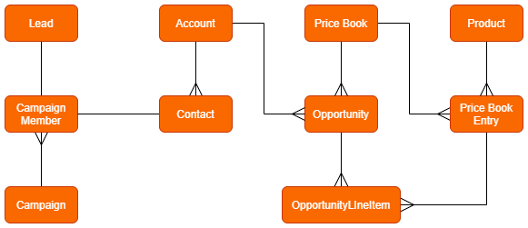

# Module - Sales Cloud

[Longform](<./LFSales Cloud.md>)

## Introduction

- <mark>Sales Cloud is a standard application made by Salesforce that allows us to work with a variety of sales functionality</mark>
- standard objects included with Sales Cloud include Account, Contact, <mark>Lead, Opportunity, Product, Price Book</mark>, Quote, Contract, and Order
- Sales Cloud also includes a variety of automation features
- Sales Cloud comes with Trailhead Playgrounds and Developer Edition orgs

## Lead Creation
- <mark>a lead represents a potential customer</mark> - someone who has expressed interest in our company and products, <mark>but isn't qualified yet</mark>
    - the criteria for qualifying a lead is different from company to company, but it'll be sufficient enough for us to know that we have interest from and enough information from a potential customer to be able to land a deal with them
 
### <mark>Web-to-Lead</mark>

- found at Web-to-Lead page in Setup
- <mark>allows us to generate an HTML form with selected Lead fields that can then be included in an Experience Cloud site or other external website</mark>
- <mark>when users submit this form, a Lead record with their provided information will be automatically created in our org</mark>

### Lead Auto-Response Rules

- found at the Lead Auto-Response Rules page in Setup
- our orgs can only have one active Lead Auto-Response Rule at any given time, but each rule can have multiple rule entries
- when creating a rule entry, we'll chose the sort order, the entry criteria (either through field value criteria or a formula), the name and email address to list as the sender for the auto-response email, and the email template to use for the auto-response email
- <mark>Lead Auto-Response Rules serve to welcome new leads to our business and give them relevant information about our products</mark>
 
### Lead Assignment Rules

- <mark>when a Lead is created through Web-to-Lead, ownership of that record will be determined through our Lead Assignment Rules</mark>
    - in the case that none of our rule entries for our Lead Assignment Rules are fulfilled, the new record will be assigned to the default record owner
    - this default record owner can be modified at the Lead Settings page in Setup
- found at Lead Assignment Rules page in Setup
- we can only have one active Lead Assignment Rule in our orgs at any given time, but each rule can have multiple rule entries
    - when creating a rule entry, we specify sort order, entry criteria, and the user or queue to assign record ownership to

### Lead Processes
- <mark>a Lead Process allows to create a visualization of steps that every lead should go through in order to ensure that our sales representatives are following a consistent procedure with every lead</mark>
- we can create Lead Processes at the Lead Processes page in Setup
- when creating a Lead Process
    - we'll choose the Existing Lead Process (which determine the picklist values included in our new process by default; the default Existing Lead Process is Master which includes all values for the Lead Status field)
    - we'll modify the included picklist values for the Lead Status field for our new process
- we need to create a custom Lead Process within our orgs before we can create a Lead record type
    - because when creating a Lead record type, we choose the associated Lead Process
    - the values for the Lead Status field cannot be modified on the record type itself, rather we need to change the available values by modifying the associated Lead Process
- when we change the Lead Status to Converted, the <mark>Lead Conversion Wizard</mark> appears
    - <mark>this allows to create a new account or associate an existing with our lead, create a new contact or associate an existing contact with our lead, and (optionally) create a new opportunity or associate an existing one with our lead</mark>
    - when we execute the Lead Conversion Wizard, the values from fields on our lead will be given to mapped fields on the new or associated records
    - the system populates the standard fields of accounts, contacts, and opportunities with information from the lead's standard fields
    - we can create mappings for our custom fields by navigating to the Fields & Relationships page on the Lead object and selecting Map Lead Fields
 
## Account and Opportunity Teams

- <mark>Account Teams are collections of users from across the company with diverse skillsets formed to collaborate on an account and its associated records in order to ensure that our sales operation is running smoothly</mark>
- <mark>Opportunity Teams are collections of from across the company with diverse skillsets formed to collaborate on opportunities</mark>
- <mark>we can enable Account Teams at the Account Teams page in Setup</mark>
    - once we've enabled Account Teams, we can create and modify team member roles
- once we've setup team member roles, users can create their own Account Teams by navigating to their Advanced User Details and the Default Account Team section there
    - when working with a team member role, we'll select the access to the Account record, as well as its children opportunities and cases
    - if we have the OWD for the Contact object set to anything other than Controlled By Parent, we'll be able to select the role's access for children contacts as well
- we can add the Account Team related list to Account page layouts, so that users cann add their default teams and other team members as well
- we can enable Opportunity Teams at the Opportunity Team Settings page in Setup
    - <mark>the Account and Opportunity Teams share team member roles</mark>, so we work with our Opportunity Team member roles at the Account Teams page in Setup
    - although our Opportunity and Account Teams share team member roles, this does not mean that the same user needs to occupy the same role (or even be included) on both teams
- users can create their own default Opportunity Teams by navigating to their Advanced User Details and the Default Opportunity Team section there
    - when creating an Opportunity Team, users choose the member role and access to the opportunity record for each team member
- we can add the Opportunity Team related list to Opportunity page layouts so that users can add their default teams and other members as well
- with Opportunity Teams enabled, we can also enable Opportunity Splits at the Opportunity Splits Page in Setup
    - Opportunity Splits allow revenue from an opportunity to be credited to multiple users within the team, rather than just the record owner
- the access levels that we select when creating an Account or Opportunity Team cannot be more restrictive than the OWD on the corresponding object
 

## Opportunity and Sales Processes

- <mark>the Opportunity standard object is used to represent a potential sale</mark>
- <mark>in order to ensure that sales representatives are following the same procedure with each deal that they're working on, we can use Sales Process to provide a visualization of the steps that the opportunity should go through</mark>
- we work with Sales Processes at the Sales Processes page in Setup
- when creating a new Sales Process,
    - we choose the Existing Sales Process (determining the initial picklist values for our new process; the default is Master, which includes all values for the Opportunity Stage field)
    - we can modify the included picklist values for our particular process
- we're unable to create a record type for the Opportunity object until we've created a custom Sales Process and we associate a Sales Process with our Opportunity record types when creating the record types
    - we can't modify the available values for the Opportunity Stage field on Opportunity record types, rather we must modify the associated Sales Process

## Path

[Guide Users with Path](https://help.salesforce.com/s/articleView?id=sf.path_overview.htm&type=5)

- Sales, Lead, and Support Processes allow us to see where a record is in its lifecycle
- <mark>the Path allows us to provide additional guidance throughout the process for a particular record</mark>
- we can create a Path for the Account, Campaign, Case, Contract, Contact, Fulfillment Order, Lead, Opportunity, Order, Quote, Service Appointment, Work Order, and Work Order Line Item standard objects as well as for any custom object with at least one picklist field
- to enable Path, we'll navigate to Path Settings in Setup
- when creating a new Path, we select the 
    - object that our path will be acting on
    - the record type of that object to associate our Path with (each record type can have at most one associated Path)
    - the picklist field that will determine the different steps within our Path
    - once we've made these choices, we'll then be able to work with each step in the path
    - <mark>each step in the path will get its own screen where we can display up to five fields from the object that are related to that specific step as well as include step-specific text guidance for our users to follow to successfully progress the record to the next step</mark>
    - we can optionally add confetti to our path steps
- when we create a new path for the Opportunity or Lead objects, that path will be automatically included on the corresponding record pages
    - if we're creating a path for any other object, we'll need to modify its record page to include the Path standard Lightning component

### Paths vs. Processes
- Paths are more versatile than processes
    - <mark>Paths are available for more objects (not just Case, Lead, and Opportunity)</mark>
    - <mark>we can choose the picklist field that determines the steps in our path</mark>
- Paths allow us to provide step-specific guidance through instruction text and the inclusion of fields relevant to that particular step
 

## Products and Price Books

[Products and Price Books](https://help.salesforce.com/s/articleView?id=sf.products_pricebooks.htm&type=5)

- <mark>a product represents the items/services that our company sells</mark>
- <mark>a price book represents the prices for a particular product, it holds a list of products and their associated prices</mark>
- <mark>we have two types of price books - standard and custom</mark>
    - we can create a standard price book by selecting the Is Standard Price Book checkbox field when working with a price book record
    - before we can add a product to a custom price book, it must first have a standard price
    - products get standard prices being added to a standard price book
- the standard price book functions as a sort of master catalog, holding the default cost of each product we have
- <mark>we can use custom price books to reflect different prices for products</mark> depending on our customer's industry, location, service level agreement, etc.
- we can add a product to a price book from either the product or price book record pages
    - our product can appear in multiple price books because the Prodcut and Price Book objects are related through a junction - the Price Book Entry standard object
- once we've added our products to the desired price books, we can add them to opportunity records through the Add Products button on the Products related list on the Opportunity record page
    - if we're adding products to an opportunity for the first time, we'll be prompted to choose the price book we want to use
    - then we'll be able to add our desired products and optionally change the value for their sales prices (which, by default, is the list price in our chosen price book)
    - we can add multiple products to a single opportunity, but also have multiple opportunities containing the same product because the Product and Opportunity objects are related through a junction - the Opportunity Line Item standard object

## Marketing User and Campaigns

[Get to Know Salesforce Campaigns](https://help.salesforce.com/s/articleView?id=sf.campaigns_def.htm&type=5)

- in addition to sales features, Sales Cloud also gives us the capability to track the outcome of our marketing campaigns
- <mark>in order to allow a user to work with Campaign and Campaign Member records, we can give them the Marketing User feature license</mark>
- <mark>a campaign represents the external marketing campaigns that we have</mark>
- a campaign member represents a potential customer that we gained as the result of a campaign
- <mark>we can relate multiple campaigns together to form a campaign hierarchy</mark>
    - we'll do so through the Parent Campaign lookup field on the Campaign object
    - <mark>this allows us to rleate up to five levels of campaigns that can be organized by factors such as marketing strategy, media channel, or time period, with the parent campaigns being general and their children being more specific</mark>
- we can create records of the Campaign Member object, which allow us to relate a Campaign to either a Lead or Contact to show that we generated that customer as a result of our campaign

## Simplified Sales Cloud Data Model

 