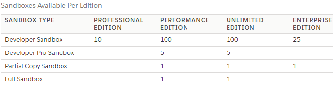
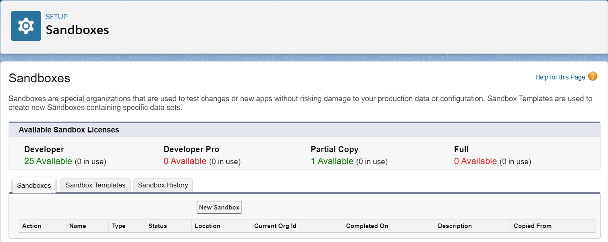
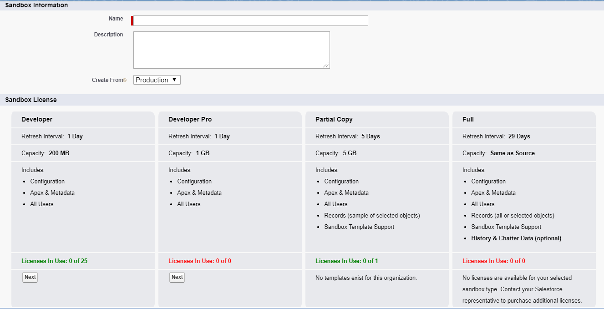
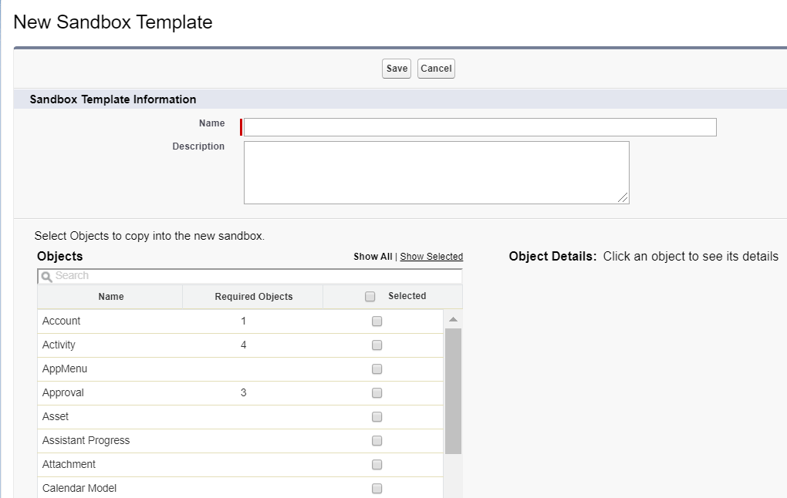
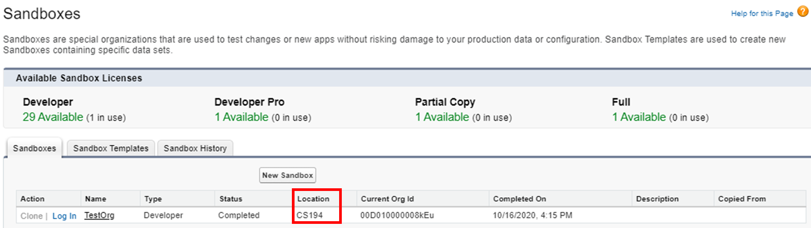

# Module - Sandboxes

This module introduces the types of sandboxes in Salesforce and sandbox managment.

## Table of Contents

* [The Sandbox](#the-sandbox)
* [Sandbox License Types](#sandbox-license-types)
* [Developer and Developer Pro Sandboxes](#developer-and-developer-pro-sandboxes)
* [Partial Copy Sandboxes](#partial-copy-sandboxes)
* [Full Copy Sandboxes](#full-copy-sandboxes)
* [Sandbox Management](#sandbox-management)
  * [Creating Sandboxes](#creating-sandboxes)
  * [Creating Sandbox Templates](#creating-sandbox-templates)
  * [Refreshing Sandboxes](#refreshing-sandboxes)

### Helpful References/Links

* [Sandboxes: Staging Environments for Customizing and Testing (Salesforce Help)](https://help.salesforce.com/articleView?id=deploy_sandboxes_intro.htm&type=5)
* [Salesforce Sandbox Preview Guide](https://sandbox-preview.herokuapp.com/cheatsheet)
* [Sandbox Licenses and Storage by Type (Salesforce Help)](https://help.salesforce.com/articleView?id=data_sandbox_environments.htm&type=5)
* [General Sandbox and Sandbox Storage Limits (Salesforce Help)](https://help.salesforce.com/articleView?id=deploy_sandboxes_limits.htm&type=5)
* [Create, Clone, or Refresh a Sandbox (Salesforce Help)](https://help.salesforce.com/articleView?id=data_sandbox_create_parent.htm&type=5)
* [Manage Your Sandboxes (Salesforce Help)](https://help.salesforce.com/articleView?id=data_sandbox_manage.htm&type=5)
* [Records copied when you refresh Partial Data sandbox (Knowledge Article)](https://help.salesforce.com/articleView?id=000332642&type=1&mode=1)

## The Sandbox

Salesforce sandboxes are a unique type of Salesforce org and a beast that we don't really encounter in training. Sandboxes are development environments that are available in `Professional`, `Enterprise`, `Performance`, and `Unlimited Edition` orgs - not `Developer Editions` or `Trailhead Playgrounds`, hence our lack of familiarity. There are four types of sandboxes: the `Developer`, `Developer Pro`, `Partial Copy` and `Full Copy` boxes, differentiated by the license required to create them, their available storage, how frequently they can be refreshed, and their use cases.

These environments are useful for multiple reasons. First, we can use preview sandboxes to test and explore features of an upcoming release approximately four weeks before all orgs are updated with the release. Additionally, we can't write code directly in production orgs - any code must be migrated into the org and so we commonly develop in sandboxes because of the ease of moving these customizations between a sandbox and a production org.

Secondly, we always want to ensure that we don't cause any issues in our production org by implementing and testing any non-trivial changes in a different environment from our production org - we don't want any bugs to corrupt production data or disrupt our users. Because sandboxes are copies of our production org, we can copy the data and users from our production environment into our sandbox and therefore still get the benefit of testing these changes against realistic data.

With these considerations in mind, let's discuss each type in more detail after a brief discussion about license types.

## Sandbox License Types

Although we can purchase additional licenses, each of the org types mentioned above comes with a certain amount of licenses automatically, as shown by the image below:

In order to create a sandbox, we _must_ have an available license. Sandbox licenses are hierarchical, so a `Full` sandbox license can be used to create any type of sandbox, a `Partial Copy` license can be used to create a `Partial Copy`, `Developer Pro`, or `Developer` sandbox, and a `Developer Pro` license can be consumed by either a `Developer Pro` or `Developer` sandbox. In addition to the base number of licenses included with each Salesforce org, we can purchase additional `Developer Pro` licenses (each of which also comes with 5 `Developer` licenses), more `Partial Copy` licenses (each of which comes with 10 `Developer` licenses), or extra `Full` licenses (each of which includes 15 `Developer` licenses).

## Developer and Developer Pro Sandboxes

`Developer` and `Developer Pro` environments are used primarily as independent development and testing orgs. Both only include metadata from our orgs (i.e. information about our org such as page layouts, tabs, Apex code, objects and their fields, etc.) - these sandboxes do not copy production records and therefore don't allow use of templates. We can refresh either of these environments once per day, pulling the latest customizations (i.e. metadata) from our production org.

The main difference between the two is storage size: `Developer` boxes give up to 200 MB of data (i.e. record) storage and an additional 200 MB of file storage, while `Developer Pro` boxes give as much as 1 GB each for files and data. However, `Developer Pro` boxes are also different because they are sometimes used for integration testing, quality assurance, and training users to operate and take advantage of new customizations.

## Partial Copy Sandboxes

While we can use `Developer Pro` sandboxes for integration testing and training, it is more common to use the `Partial Copy` box for these tasks. This type of environment is particularly useful for testing because, unlike `Developer` and `Developer Pro` boxes, it includes metadata as well as some record data from our production org. Note, however, that this environment has a maximum file storage of 5 GB and a data storage maximum of 5 GB, so we _must_ use templates to specify the objects whose records we would like to copy from our production org.

With this sample data, we can also perform user acceptance testing (UAT), where we expose new features to a certain subset of users before they are released to the production org to get feedback and find and fix any hidden issues. `Partial Copy` sandboxes can be refreshed once every five days.

## Full Copy Sandboxes

`Full` or `Full Copy` sandboxes are the final and largest type of sandbox, with file and data storage limits equal to the corresponding limits for our production org. This environment is also intended for testing, particularly load testing and performance testing. Because it is effectively an exact replica of our production org, we can use it to see how our new customizations will influence our org's efficiency without having to deploy those customizations to production and risk disrupting our users.

Once we've finished testing, we'll use the box as a staging environment, coordinating all relevant changes (perhaps originally developed in multiple different `Developer` or `Developer Pro` sandboxes) into one deployment artifact. Note that companies that only have the `Enterprise` edition of Salesforce might use the `Partial Copy` sandbox for load testing, performance testing, and staging because they don't have a `Full Copy` license included with their org.

To reduce the amount of time it takes to create the environment, we can use templates as in `Partial Copy` boxes, but we aren't required to do so. If we don't utilize a template, a `Full` sandbox will replicate all records that are in our production org, rather than a subset of them. While it may be tempting to use this type for integration testing and UAT, it is not necessarily a good idea because of the more expensive license requirement and much slower refresh rate: `Full` sandboxes can only be refreshed once every 29 days, meaning that they may be much less in sync with our production org metadata than may be a `Partial Copy` box.

See the following table for a summary of our tour of sandbox types.

| Sandbox Type | Includes Production Metadata | Includes Production Records | Data Storage | File Storage |
| -- | -- | -- | -- | -- |
| Developer | &#x2611; | | 200 MB | 200 MB |
| Developer Pro | &#x2611; | | 1 GB | 1 GB |
| Partial Copy | &#x2611; | &#x2611; | 5 GB | 5GB |
| Full Copy | &#x2611; | &#x2611; | Equals Production Org Data Storage | Equals Production Org File Storage |

## Sandbox Management

Now that we have an idea of the types of sandboxes we can create, let's walk through the process of performing various sandbox management operations, including creating sandbox templates. We'll perform all of these operations from the `Sandboxes` page, located at `Setup` > `Environments` > `Sandboxes` and shown in the following image. This page also shows our available and consumed sandbox licenses.

### Creating Sandboxes

First up: creating sandboxes. To begin, we click the `New Sandbox` button on the `Sandboxes` page, which directs us to a screen similar to the below screenshot.

On this page, we choose a name for our sandbox, the org that we'll copy the metadata for our sandbox from, and the type of our new sandbox. It is considered a best practice to name the sandbox after the feature we'll be using it to develop or its purpose (such as quality assurance testing).

By default, we create new sandboxes from our production org, but we can choose to clone a sandbox by selecting any other sandbox already made from the same production org in the `Create From:` dropdown. We can also clone a sandbox by clicking the `Clone` link next to the name of the desired source box on the `Sandboxes` page.

Cloning boxes is useful when we have multiple environments that need the same configuration because we can save time when creating them. All record data from the source org of a clone is copied to the clone, which also consumes the same type of license as its source org does.

Recall that sandboxes are hierarchical, so even though we don't have a `Developer Pro` sandbox license in the above image, we can still create a `Developer Pro` sandbox by consuming our `Partial Copy` license.

Once we've clicked `Next` under our desired sandbox type, we can optionally choose an Apex class to run after the environment is created or each time it is refreshed. This is particularly useful for the `Developer` and `Developer Pro` boxes because it allows us to get around the limitation of not being able to copy production records by creating data factories through Apex classes to automatically populate our boxes with test data. We can then click `Create` to queue the sandbox creation.

The sandbox will go through various statuses while it is being created, from `Pending` to `Processing` to `Activating` to `Completed`, all of which can be observed on the `Sandboxes` page. Boxes can take up to a few days to be created, depending on the server load and the type of box we're making (e.g. a `Full Copy` sandbox based off of a production org with a massive amount of records will take longer than a `Developer` box). When the creation has finished, we'll receive an email notification.

### Creating Sandbox Templates

We earlier stated that sandbox templates allow us to include copies of production records in `Partial Copy` or `Full` sandboxes, so let's take a look at how to create one. From the `Sandboxes` page, we can click the `Sandbox Templates` tab and select `New Sandbox Template`, which will take us to the screen shown in the following image.

Here, we provide a name for our template and choose the objects whose production records we want copied to our box. Some objects will be automatically selected when we choose another object, as determined by the relationships between standard objects and the custom relationships we've created. For example, when we select the `Account` object, the `Contact` object is automatically included as well.

Once we've configured our template, we can click `Save` and then select the template on the same screen that we add any Apex classes when creating a sandbox. Note that we can't choose which specific records we want to include, only the objects. If our object has less than 10,000 records, Salesforce will copy all of them when our box is being created or refreshed. If it has more than 10,000 records, Salesforce will copy a random sample of 10,000 records of the object.

### Refreshing Sandboxes

The last part of sandbox management that we'll discuss is refreshing a sandbox, which will allow us to pull the latest metadata from a source org.

To refresh a box, we navigate to the `Sandboxes` page and click the `Refresh` link next to the desired sandbox. On the following page, we can choose to change the org that we're refreshing our metadata from by changing the `Create From:` dropdown and change (or retain) the license type of the box by clicking `Next` under our desired license.

On the next screen, we can choose a template if we're refreshing a `Partial Copy` or `Full Copy` sandbox and optionally select the `Auto Activate` checkbox before clicking the `Create` button to begin the refresh process. If we don't choose to auto-activate, we'll have to click the `Activate` link next to the box once it's finished refreshing before we'll be able to login.

Note that the first screen (i.e. the one where we optionally change the license and source org of the sandbox) will be skipped if we're refreshing a clone because the clone will automatically retain its original license and be refreshed from its original source org.

When deciding to refresh a sandbox, we may want to consider the time of the year and if we want to preview the next release's features. Let's clarify - we earlier said that sandboxes can be used to preview the upcoming release before its general distribution. To get this preview, we have to make sure our sandbox is hosted on one of the Salesforce servers that's designated as a preview instance.

So do we have to visit the data centers in person or pay off some Salesforce employee to make sure we're on a preview instance? Nope, we just need to navigate to the [Salesforce Sandbox Preview Guide](https://sandbox-preview.herokuapp.com/) and search for the instance of our sandbox, which we can find in the `Location` column (surrounded by the red rectangle in the following image) of the `Sandboxes` page we saw earlier.

If our sandbox isn't hosted on a preview instance and we'd like to use it as a preview sandbox, we just need to refresh it in the approximately twelve week period that's after the last update and before the sandbox preview period. However, if we refresh any sandbox in the sandbox preview period (approximately four weeks before each update), then it will be hosted on a non-preview instance (regardless of whether it was actively previewing the upcoming release before the refresh or not).
