<link rel="stylesheet" type="text/css" media="all" href="css/main.css" />

# Module - Apex Testing Framework

This module introduces unit testing of apex classes and triggers.

[[_TOC_]]

#### Helpful references/Links

* [Documentation](https://developer.salesforce.com/docs/atlas.en-us.apexcode.meta/apexcode/apex_testing.htm)
* [Testing Web Service Callouts](https://developer.salesforce.com/docs/atlas.en-us.apexcode.meta/apexcode/apex_callouts_wsdl2apex_testing.htm)
* [Testing HTTP Callouts](https://developer.salesforce.com/docs/atlas.en-us.apexcode.meta/apexcode/apex_classes_restful_http_testing.htm)

#### Annotation Quick Reference 

* `@isTest(SeeAllData=true|false)` - Declares a class or method as a test, with optional parameter to access org data. Defaults to false.
* `@TestSetup` - Declares a method as a setup method.
* `@TestVisible` - Declares a private method or variable as accessible to a test class.

## Why do we test? _(Or why I stopped worrying and learned to love the test)_ 

Testing is a vital process inside of salesforce, nothing we code can be deployed without a minimum code coverage provided by tests. However while that sets a requirement that we _MUST_ test, the question remains of _WHY?_ When we create code we want to validate that it will execute or function as expected, and that nothing strange is happening as a side effect. While we could perform manual testing, where we act as an end user and see if everything performs as expected, it is unlikely to catch all the use cases and would need to be performed everytime an update occurs.

Fortunately that is where the Apex Testing Framework comes in, allowing us to write unit tests. Essentially we write code that in turn will test our code. This allows us to ensure that not only can we test for a variety of use cases, but that the code can be routinely tested whenever an update occurs to ensure there was no regression and the code still performs as expected. This also allows us to use _Test-driven Development. (TDD)_ 

### Wait, TDD?

Test-driven development is a process through which use cases or requirements are turned into test classes, and then code is written that will pass the test. TDD has roots in the eXtreme Programming agile framework, but has been adopted outside of the framework, including by salesforce itself. Internal developemnt at the cloud giant is itself test-driven.

## Test Classes

Unit tests are methods that verify a specific piece of code is behaving correctly, and these are contained within a test class. Test classes are declared using the `@isTest` annotation.

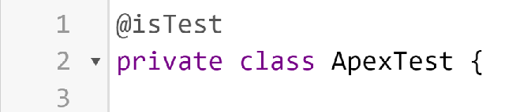

Test classes and methods may be private or public, as access levels in regards to test do not matter. Further classes defined as a test cannot be interfaces, enums, or inner classes. Lastly, test classes are not counted among the rest of the apex classes in terms of overall code coverage, as you might imagine if we had to test the test classes it would quickly become an infinite loop of development.

>>>
   
 <strong>Gail Phorsh Says</strong>: Generally you want to name your test class after the class it is testing. So if you are testing a class named 'Apex', the test for it would be 'ApexTest'. 
 This isn't required, but makes it easy to understand your test classes purpose. My parents used a similar methodology for my name!
>>>

## Test Methods

Test methods are defined using the `@isTest` annotation as well. Unit test methods take no arguments and return no values, and must be `static`.

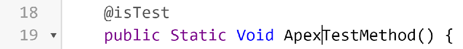

The purpose of a test method is to evaluate a discrete piece of code to ensure it is functioning as expected. It can do so by asserting if values being returned or set by the code are the expected values. If for example the method being tested is supposed to multiply any number it is given by two, then we should be able to pass in the argument of three, and be returned the value of six. To accomplish this we use a selection of system class methods called assert, assertEquals, and assertNotEquals. 

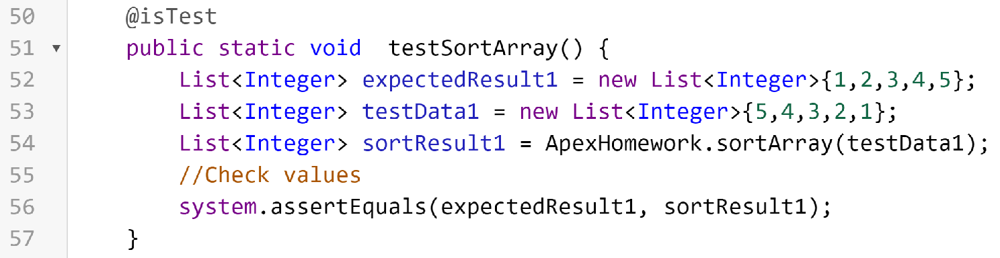

Test methods cannot be used to test web service callouts. Instead you'll need to create a mock callout. (See the links detailing this in helpful links above.) 

## Data in Test Classes

Inevitably when working on tests, there will come a time when we need to test code that operates on data. Test classes by default cannot access org data, tests are isolated and thus cannot typically access the database. Though we do have the ability to make our test classes gain access to that data, whenever possible we want to avoid doing so.

To that end we need to be able to generate test data, and we have a couple of options to this end. We can load a CSV of data, or we can generate it through code. In the latter case we also should talk about test utility classes, and all important code reusability.

>>>
   
 <strong>Gail Phorsh Says</strong>: Test classes are well known commitment phobes, and will not commit data to the database, so even if you define new records and insert them, they are ephemeral and will vanish once the test is completed. Just like so many tinder dates...
>>>

### Test Setup

While the data created in a test class may not persist, it can still be used within the confines of the test transaction. While we can make use of this and create data we need for our tests within the test methods, it is often beneficial to instead create a test setup method. A test setup method is a unique type of method that is executed before each individual method. This means we can write the code to create the data we need once, and have that data provided fresh and clean to each method we then run in the class.

We declare a test setup method using the `@testSetup` annotation.

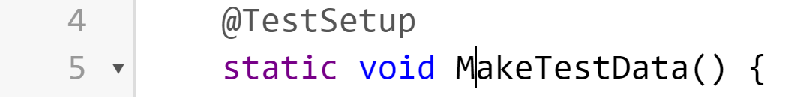

>>>
   
 <strong>Gail Phorsh Says</strong>: A test class that uses a test setup method cannot also have methods with SeeAllData=true. They have been bitter rivals ever since the band split up.
>>>

### Loading Test Data

You can also load data in via a CSV file stored as a static resource. This allows for us to quickly generate test data while keeping the amount of code being written low. Once it has been loaded as a static resource you can make use of the loadData method of the test class, passing the sObjectType token and the name of the static resource to be loaded.

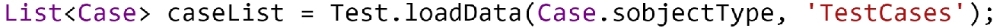

### SOQL & SOSL in Test Classes 

When writing SOQL and SOSL in test classes you will find the results are limited. SOQL will only return records generated in the method or in the test setup method, and SOSL always will return an empty list of lists. SOQL can return actual data, but only if the method or class is set to SeeAllData=true.

#### Test.setFixedSearchResults 

If you need a SOSL query to return a value, you need to make use of the Test.setFixedSearchResults method. This method takes in a argument of a list, which it in turn will return as the SOSL query results.

## Test Utility Classes

Test utility classes are test classes that feature reusable code that could be called on by multiple test classes. Just as we use test setup methods to avoid rewriting the same data generation across multiple methods, so to can we further offset that by using a test data factory. Imagine we have a dozen different classes that deal with accounts, now rather than having a dozen different account generation code blocks we instead create one test utility class which can generate as many as we need on a test by test basis. Test utility classes still use the `@isTest` class annotation, but their other methods are not, and can be called by test classes.

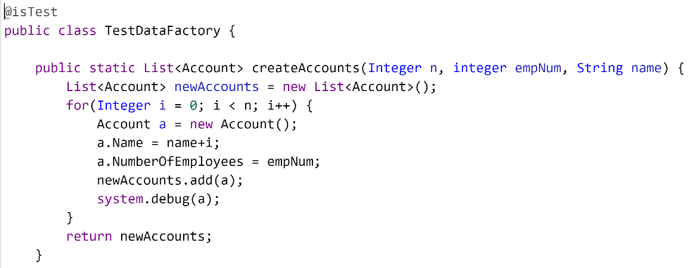

## Test Visibility

When it comes to testing our code, we may need to access aspects of our code, or of our database, we normally cannot. Below we talk about how we overcome those limitations, for good or ill.

### `@testVisible`

The `@testVisible` annotation makes private class members accessible by test classes. This allows the test method to perform any tests it needs to upon them regardless of their normal accessibility.

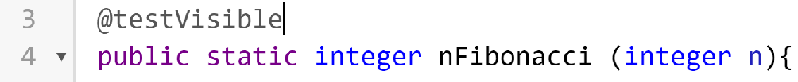

### `@isTest(SeeAllData=true)`

The `@isTest` annotation has a boolean parameter called SeeAllData, and by default it is false. This means that the test class or method has no ability to access the actual org data. Generally speaking this is what we want, but there are some cases where you might want to test against your orgs actual data.

We can accomplish this by setting the boolean to true, like in the example below.

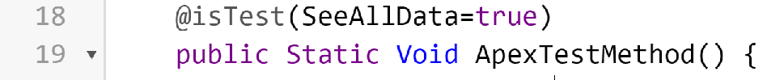

>>>
   
 <strong>Gail Phorsh Says</strong>: You can have individual methods that have SeeAllData as true or false, but if you declare SeeAllData=true on the class level, you cannot make some of the methods to then be false. The problems with a class based society, always stepping on the little guy.
>>>

## System Classes and Methods Used in Testing.

During the course of working with tests, we have a couple of tools we can use

### Test.StartTest() & Test.StopTest()

StartTest and StopTest test class methods are an incredibly important tool for testing, and they work primarily for two things. First is that they provide a new context for the test in terms of governor limits, and second they force asynchronous code to behave synchonously.

The former is important because it is entirely possible that as a part of preparing everything needed for the test we have executed certain DML statements or SOQL queries. This would be the test class context. Now if the code we intend to test also makes DML statements or SOQL queries and it operated in the same context we might end up in a situation where the test fails due to hitting those limits. By placing the code we want to test within the start and stop test methods we are providing them with a new context in which to operate. Salesforce is being told that these two operations should be counted as separate transactions in terms of governor limits.

The latter is important because if we attempt to test ansynchonous code it will almost always fail, because the system.assert will execute prior to the value being returned by the asynchronous method. By calling the ansynchronous code inside of start and stop test, it forces the code to behave synchronously for the purpose of the test.

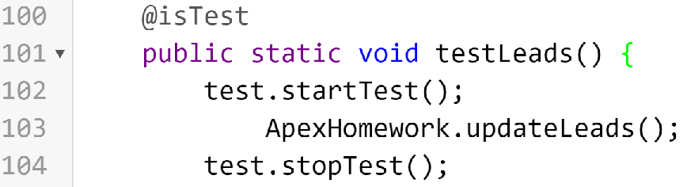

>>>
   
 <strong>Gail Phorsh Says</strong>: Test.StartTest and Test.StopTest can only be used inside a test class, no spare governor limits here!
>>>

### System.Assert, AssertEquals, and AssertNotEquals

We've already touched on these before, but let us now take a look at each.

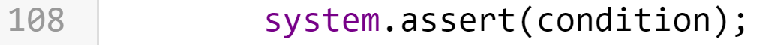

System.Assert() is a method which evaluates the condition given, and if true the test passes, else the test fails.

System.AssertEquals() takes in two values. The first value is the expected value according to what you expect to be returned. The second value is the actual value returned. If they match then the test has passed, else the test fails.

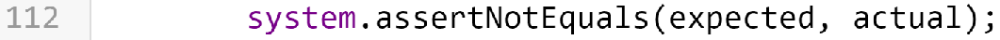

System.AssertNotEquals() likewise takes two values, but operates inversely to AssertEquals. If the first value does **NOT** match, then the test passes, else if they do it fails.

### System.RunAs(){}

Last of our tools is the RunAs() method of the system class. We use RunAs() in order to test against specific users or profiles.

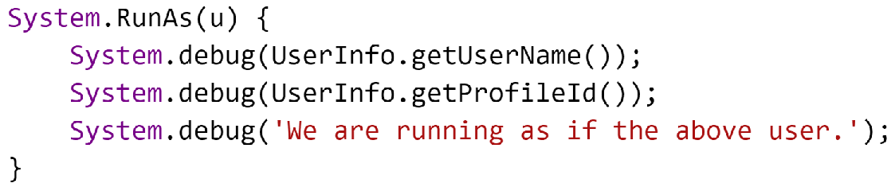

In the above code snippet we see that we have passed in a user stored in a variable called u, and then within the RunAs block we execute code in the context of that user. This means we can test the access given by our code, and ensure they can or cannot access certain records or code.

## Test Execution 

Salesforce provides a plethora of options for running your tests and getting the results, here are our options.

### Running Tests with Developer Console

The developer console is a remarkable tool when it comes to then seeing what is and is not covered. Once you have executed a test on a class, you can open then class and select in the top left code coverage. 

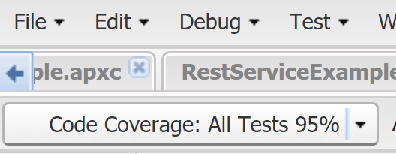

By selecting this you'll see that it can highlight the lines covered by test in blue, and those not tested in red. 

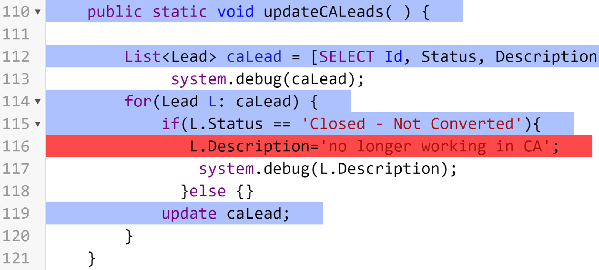

### Running tests with Visual Studio Code

You can also execute tests through Visual Studio Code. You can do this by selecting the erlenmeyer flask on the left side of VSC.  
  
Once this is selected you can select and run the tests from the apex test menu.  
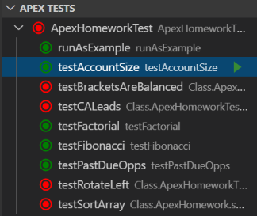 
Once a test has run if it was a success it will turn green, else red if it failed. If you want to view your code coverage you can do that by selecting the hamburger button from the bottom of VSC. 
 
Selecting this will enable you to see your code coverage akin to how you can do so in the Developer Console.  
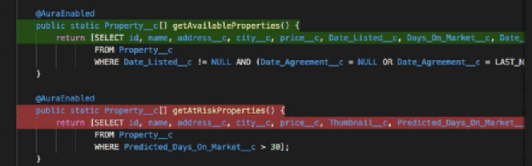 

### Running Tests with Test Execution UI

You can also run tests and see their results through the set-up menu in your org. You can find it under *custom code > apex test execution.*

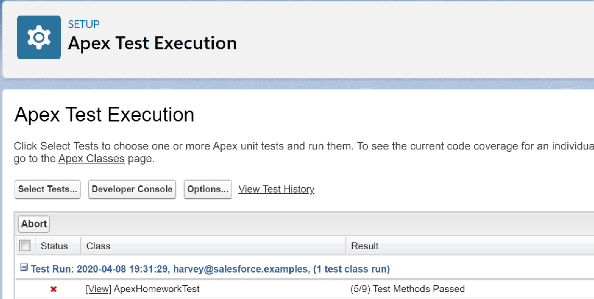

### Running Tests with API

Finally through both the SOAP API and the Tooling API you can have tests run remotely.

In the SOAP API this can be accomplished using the runTests() call. With this you can run specific tests, or all tests, and they are executed synchronously.
* [More on RunTests()](https://developer.salesforce.com/docs/atlas.en-us.apexcode.meta/apexcode/sforce_api_calls_runtests.htm)

In the Tooling API this can be accomplished using /runTestsAsynchronous/ and /runTestsSynchronous/ endpoints to run them asynchronously or synchronously respectively.
* [More on runTestsAsynchronously and runTestsSynchronously](https://developer.salesforce.com/docs/atlas.en-us.224.0.api_tooling.meta/api_tooling/intro_rest_resources.htm)

## Code Coverage _(And what makes for good tests)_

Salesforce requires all code being put into a production org has at least 75% code coverage, what what exactly does that mean? Code coverage speaks to the percentage of lines of code that have been covered by a test. That we have verified that our code has been tested, and passed those tests and performed as expected.

Generally speaking you should be aiming for as high a code coverage as is reasonable, particularly when it comes to the more complicated portions of your code base where there are higher chances for things to have gone awry.

>>>
   
 <strong>Gail Phorsh Says</strong>: Code coverage alone does not mean that your tests are good, or even adequate. My therapist says I should tell myself I am adequate, but I just don't feel like I can.
>>>

## Testing Best Practices

When it comes to testing there is one question you have have had in the back of your mind thus far. We need to test, and it leads to better code... but what do I test? Fear not, for we have now arrived at that elusive answer. For apex there are five best practices to keep in mind when determing what it is you should be testing.

### Positive and Negative Testing

Positive tests are ones in which we ensure that the expected behavior occurs whenever the user correctly makes use of it. If we expect our addition method to return 2 when we give it 1 + 1, we are making a positive test. If everything is correct, we get the correct answer.

Negative testing is where we test to ensure that if things are not correctly used we are handling it gracefully and the errors being returned are the correct ones.

### Single Action and Bulk Action Testing

Single action testing is simple enough. If we are passed a single record, does the code excute correctly. Bulk testing asks the same thing, but now we want to see what happens if we do it 200 times instead. Is there a certain point to where our code cannot handle the records being passed in.

>>>
   
 <strong>Gail Phorsh Says</strong>: Remember, we always want to bulkify our code where applicable. I plan to bulk up myself, I just signed up for jazzercise!
>>>

### Restricted User Testing

Are we sharing, or not sharing, access as is appropriate. We test restricted users to verify unauthorized users are not being given access to records or details they are not supposed to have access to. 

