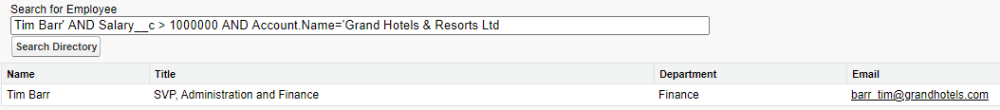

# Module - Dynamic Apex

This module introduces dynamic Apex, particularly dynamic SOQL and SOSL.

## Table of Contents

* [Active Apex](#active-apex)
* [Dynamic Apex Through the Schema Namespace](#dynamic-apex-through-the-schema-namespace)
* [Dynamic SOQL](#dynamic-soql)
* [SOQL Injection](#soql-injection)
* [Dynamic SOSL](#dynamic-sosl)

### Helpful Links/References

* [Dynamic Apex (Apex Developer Guide)](https://developer.salesforce.com/docs/atlas.en-us.apexcode.meta/apexcode/apex_dynamic.htm)
* [Describing sObjects Using Schema Method (Apex Developer Guide)](https://developer.salesforce.com/docs/atlas.en-us.apexcode.meta/apexcode/apex_dynamic_describeSObject.htm)
* [DescribeSObjectResult Class (Apex Developer Guide)](https://developer.salesforce.com/docs/atlas.en-us.apexcode.meta/apexcode/apex_methods_system_sobject_describe.htm#apex_methods_system_sobject_describe)
* [DescribeFieldResult Class (Apex Developer Guide)](https://developer.salesforce.com/docs/atlas.en-us.apexcode.meta/apexcode/apex_methods_system_fields_describe.htm#apex_methods_system_fields_describe)
* [Dynamic SOQL (Apex Developer Guide)](https://developer.salesforce.com/docs/atlas.en-us.apexcode.meta/apexcode/apex_dynamic_soql.htm)
* [Using Apex Variables in SOQL and SOSL Queries (Apex Developer Guide)](https://developer.salesforce.com/docs/atlas.en-us.apexcode.meta/apexcode/langCon_apex_SOQL_variables.htm)
* [Date Formats and Date Literals (SOQL and SOSL Reference)](https://developer.salesforce.com/docs/atlas.en-us.soql_sosl.meta/soql_sosl/sforce_api_calls_soql_select_dateformats.htm)
* [SOQL Injection (Apex Developer Guide)](https://developer.salesforce.com/docs/atlas.en-us.apexcode.meta/apexcode/pages_security_tips_soql_injection.htm)
* [Dynamic SOSL (Apex Developer Guide)](https://developer.salesforce.com/docs/atlas.en-us.apexcode.meta/apexcode/apex_dynamic_sosl.htm)

## Active Apex

Let's close our eyes for a second and imagine ideal Apex code. It promotes reusability through the creation of flexible functions that are input-agnostic in a way that ensures that it doesn't break no matter what user input it receives. In a word, it's dynamic. In this module, we'll strive to write such code by discussing how we can use information from classes in the `Schema` namespace, along with dynamic SOQL and dynamic SOSL to make Apex classes that result in flexible, input-agnostic apps.

## Dynamic Apex Through the Schema Namespace

In the our discussion of the Apex `System` and `Schema` namespaces, we briefly mentioned the `DescribeSObjectResult` and `DescribeFieldResult` classes contained within `Schema`. We commonly use these classes to implement dynamic Apex with, e.g. picklist values. By its very nature, hardcoding any value (picklist values included) is antithetical to dynamic code.

Unfortunately, we may often see hardcoded picklist field values in a custom controller for a Visualforce page or Lightning component. Take the following Visualforce page and associated controller:

```visualforce
<apex:page controller="AccountController">
    <apex:form>
        <apex:pageBlock>
            <apex:inputField value="{!acc.Name}" label="Name"/>
            <apex:selectList value="{!acc.AccountSource}" label="Source">
                <apex:selectOptions value="{!accSources}"/>
            </apex:selectList>
            <apex:commandButton value="Save" action="{!saveAccount}"/>
        </apex:pageBlock>
    </apex:form>
</apex:page>
```

```apex
public class AccountController {
    public Account acc {get;set;}
    public List<SelectOption> accSources {get{
        accSources = new List<SelectOption>();
        accSources.add(new SelectOption('Web', 'Web'));
        accSources.add(new SelectOption('Phone Inquiry', 'Phone Inquiry'));
        accSources.add(new SelectOption('Partner Referral', 'Partner Referral'));
        accSources.add(new SelectOption('Purchased List', 'Purchased List'));
        accSources.add(new SelectOption('Other', 'Other'));
        return accSources;
    }set;}

    public AccountController(){
        this.acc = new Account();
    }

    public void saveAccount(){
        insert this.acc;
    }
}
```

The above code makes a page that allows a user to insert a new account record, providing its name and source. However, we have hardcoded the available picklist values for the `AccountSource` field. If an administrator later modifies the set of values by adding, deleting, or otherwise modifying an individual value, our page will be out-of-date. To prevent this from happening, we can leverage the `getPicklistValues()` method of the `DescribeFieldResult` class and modify our controller to the following:

```apex
public class AccountController {
    public Account acc {get;set;}
    public List<SelectOption> accSources {get{
        List<Schema.PicklistEntry> sources = 
            Schema.SObjectType.Account.fields.AccountSource.getPicklistValues();
        accSources = new List<SelectOption>();
        for(Schema.PicklistEntry pe : sources){
            accSources.add(new SelectOption(pe.getValue(), pe.getLabel()));
        }
        return accSources;
    }set;}

    public AccountController(){
        this.acc = new Account();
    }

    public void saveAccount(){
        insert this.acc;
    }
}
```

The line beginning with `List<Schema.PicklistEntry>` is the big change here, so let's dissect that line in particular. First, we use the `Account` static variable of the `Schema.SObjectType` class (which has a member variable for each standard and custom object). When we call this variable through dot notation, it returns a `DescribeSObjectResult` object.

The `fields` property of this object has a reference to each of our Account fields, so we access the `AccountSource` field through dot notation to get the corresponding `DescribeFieldResult` object. Finally, we use the `getPicklistValues()` method of the `DescribeFieldResult` class, which returns a list of `Schema.PicklistEntry` objects.

Although they are made from two different classes, `Schema.PicklistEntry` and `SelectOption` objects both have values and labels, so we use a for loop to populate the value and label of an option with the same properties from an element of our list of picklist values.

## Dynamic SOQL

When we're talking about dynamic code, we're referring to code whose contents (e.g. variable values) are not fully known before runtime. Therefore, we can define dynamic SOQL as implementing SOQL queries where the query itself isn't entirely defined until runtime.

We've actually already seen and discussed dynamic SOQL, we just didn't identify it as such at the time - when we're using variable binding with our queries, we're implementing dynamic SOQL. Sure, _we_ may often know what the value of the variable is or will be when we're writing the code, but the _compiler_ does not. As far as the compiler is concerned, our bind variables are just references to values and it's more than happy to leave the difficulty of retrieving the corresponding value to the runtime system. 

While variable binding is nice, it's not the most ideal tool for dynamic SOQL - remember, we perform variable binding by prepending the variable name with a colon (`:`), but this won't work if we're attaching it to a date literal like `LAST_N_MONTHS` because this literal literally ends in a colon itself. Additionally, we don't have the ability to use variable binding to, e.g., only include certain filters in our `WHERE` clause. In these cases, we turn to the `Database.query()` method.

`Database.query()` accepts a string that we can create through control flow and therefore construct our query based on user input. For example, if our user doesn't specify a value for a certain filter, our control flow will recognize that and simply not include the filter as part of our query. Note that the string we pass to the query method is _not_ enclosed by square brackets. In addition, we can't perform variable binding with object fields in query strings. However, we can bind variables of other primitive data types to get around this restriction.

Let's take a look at an example of dynamic SOQL through the following Visualforce page and associated Apex controller.

```visualforce
<apex:page controller="AccountFinderController">
    <apex:form>
        <apex:pageBlock>
            <apex:outputLabel for="numInput" value="Minimum Number of Employees"/>
            <apex:inputText value="{!numEmployees}" id="numInput"/>
            <br/>
            <apex:commandButton value="Find Matching Accounts" 
                action="{!returnMatchingAccounts}"/>
            <br/>
            <apex:outputText value="{!errorMessage}"/>
        </apex:pageBlock>
    </apex:form>

    <apex:pageBlock>
        <apex:pageBlockTable value="{!matchingAccs}" var="a">
            <apex:column value="{!a.Name}"/>
            <apex:column value="{!a.NumberOfEmployees}"/>
        </apex:pageBlockTable>
    </apex:pageBlock>
</apex:page>
```

```apex
public class AccountFinderController {
    public String numEmployees {get;set;}
    public List<Account> matchingAccs{get;set;}
    public String errorMessage {get;set;}

    public void returnMatchingAccounts(){
        try{
            String queryString = 'SELECT Id, Name, NumberOfEmployees FROM' +
                ' Account';
            Integer n;
            if(String.isEmpty(this.numEmployees)){
                n = Integer.valueOf(this.numEmployees);
                queryString += ' WHERE NumberOfEmployees >=:n';
            }
            this.matchingAccs = Database.query(queryString);

        }
        catch(Exception e){
            this.errorMessage = 'Please enter a number in the above text box.';
            this.matchingAccs = new List<Account>();
        }
    }
}
```

Within the `returnMatchingAccounts()` method, we first construct a basic query string. Our table will display the name of an account and the number of employees who work for that company, so we construct our initial string to retrieve those fields. If the user enters a value in the `<apex:inputText>` component labeled `numInput`, we'll convert this value to an integer and perform concatenation to append a `WHERE` clause to our query string to filter for accounts who have a greater number of employees than the specified value.

Because this variable is not a field of an sObject, we have no trouble binding it in our query string. If it was a field on an sObject, we would assign the value to a primitive variable and then bind that primitive variable. But, as we just said, `numEmployees` isn't an object field, so why are we using `n` - a separate variable? Out of an abundance of caution - it's time we discuss SOQL injection.

## SOQL Injection

Whenever we use dynamic SOQL and accept user-defined input, we're opening the door for SOQL injection attacks, which occur when a user modifies the structure of a query by inputting malicious code designed to perform unintended operations. Because SOQL only has read functionality, SOQL injection isn't dangerous in the same way SQL injection is dangerous - SQL injection can result in data deletion, and while SOQL injection can't do the same, it can still expose sensitive data.

In our example above, we prevented SOQL injection by using type casting and exception handling - if the user input a malicious string, our type conversion would fail, code execution would enter our `catch` block, our error message would be displayed, and no sensitive data would be exposed. But what if we were expecting a string value?

In this case, we have a couple of options at our disposal. But before we get to those choices, let's write some bad code. The Visualforce page and accompanying Apex controller below act as an employee directory designed to allow users to enter the name of an employee to get their contact information.

```visualforce
<apex:page controller="EmployeeDirectoryController">
    <apex:pageBlock>
        <apex:pageBlockSection>
            <apex:form>
                <apex:outputLabel value="Search for Employee" 
                    for="employeeInput"/>
                &nbsp;
                <apex:inputText value="{!employeeName}" id="employeeInput"
                    size="100"/>
                <br/>
                <apex:commandButton value="Search Directory" 
                    action="{!searchForEmployee}"/>
            </apex:form>
        </apex:pageBlockSection>
        <apex:pageBlockTable value="{!employees}" var="employee"    
            rendered="{!renderTable}" >
            <apex:column value="{!employee.Name}"/>
            <apex:column value="{!employee.Title}"/>
            <apex:column value="{!employee.Department}"/>
            <apex:column value="{!employee.Email}"/>
        </apex:pageBlockTable>
    </apex:pageBlock>
</apex:page>
```

```apex
public class EmployeeDirectoryController {
    public String employeeName {get;set;}
    public Boolean renderTable {get;set;}
	public ApexPages.StandardSetController setController {get;set;}
    public List<Contact> employees {get{
        return this.setController.getSelected();
    }}

    public EmployeeDirectoryController() {
        this.renderTable = false;
    }
    
    public void searchForEmployee() {
        List<Contact> cons = Database.query('SELECT Id, Name, Title, ' +
            'Department, Email FROM Contact WHERE Name = \'' +
            this.employeeName + '\'');
        if (this.setController == null) {
            this.setController = new ApexPages.StandardSetController(cons);
        } else {
            this.setController.setSelected(cons);
        }
        if(this.renderTable != true) this.renderTable = true;
   	}
}
```

Our page has a form that includes a text box to hold the name of an employee. When the user clicks the `<apex:commandButton>` labelled `Search Directory`, the `searchForEmployee()` method of our custom controller is invoked. 

This method starts by invoking `Database.query()` with the user-entered value as a condition. Note that we must enclose the employee name in escaped single quotes since the string we pass to `Database.query()` is itself delimited by single quotes. `searchForEmployee()` then checks if the class member variable `setController`, an instance of the `ApexPages.StandardSetController` class, has been created. We're using this corresponding standard controller because we're able to make use of many of its methods, even though we've chosen to write a custom controller.

If `setController` has not been defined, we pass the records returned by `Database.query()` to its constructor. If it has been defined, we pass those same records to its `setSelected()` method. `searchForEmployee()` then ends by ensuring the `Boolean` used to render our table is `true` (we initialized it to a `false` value earlier in our constructor). Because the table is now rendered, the value for the `employees` list will be implicitly retrieved through our getter, which calls the `getSelected()` method of `setController`.

Alright, now that we've worked our way through our example, let's break it. Consider a user who has a basic knowledge of Salesforce. This user knows what SOQL queries look like and they'd like to determine if a particular employee at one of our subsidiaries makes more than $1,000,000 per year (in this example, we've created a custom `Salary__c` field on `Contact` that stores this information). This bad actor visits our page and enters the following query:

<p align="center">

Oh no - it looks like they've successfully found that `Tim Barr` has at least a nine-figure salary! Let's discuss how they did it, so we can understand how to prevent this in the future. The malicious person ended the first filter condition with a single quote and then filtered based on `Salary__c` value. Because they knew that the input box was expecting a string, they finished by filtering on a string value that they knew - the subsidiary that employs Tim. We can easily imagine how this could be extrapolated to other situations that could expose even more sensitive information, such as credit card, bank account, and social security numbers, so let's discuss how to prevent it.

In this case, we have a couple of options at our disposal. We could use a static query (i.e. a regular SOQL query with the square brackets) and bind the string variable to, e.g., a filter value. The system will treat everything within the bound variable as a _single_ string. So if the user tries to do something such as the malicious query above, we'll be protected and our table will be empty, assuming we don't have a contact named `Tim Barr' AND Salary__c > 1000000 AND Account.Name = 'Grand Hotels and Resorts Ltd` (which sounds like a very unfortunate name to have).

But even though this would technically be dynamic SOQL - because we're using the bind variable - it doesn't give us the full capabilities of dynamism, so we might want to use `Database.query()` instead. In this case, we'd turn to another option - the `String.escapeSingleQuotes()` method. This method will add an escape character (the backslash) before any single quotes in the string it receives, ensuring that the entire user input will be treated again as a single string. So we can replace our line that invokes `Database.query()` in our controller with the following code.

```apex
String userInput = String.escapeSingleQuotes(this.employeeName);
List<Contact> cons = Database.query('SELECT Id, Name, Title, Department, ' +
    'Email FROM Contact WHERE Name = \'' + userInput + '\'');
```

We haven't yet addressed the possibility of SOQL injection in the `SELECT` clause of a dynamic query. Actually, we haven't discussed dynamism with the `SELECT` clause at all - so let's do so now. Because we have string concatenation at our disposal, we could accept user input to determine the fields our query returns in the first place.

If we were to implement this, we would want to have the user choose the fields to query from, e.g., a picklist, rather than entering them in a text box to ensure that they don't retrieve any information they shouldn't see. Remember, when we have controlled user input (through tools such as picklists and checkboxes), we can not only ensure that our users will not be able to perform injection attacks, but prevent them from even attempting such a travesty.

## Dynamic SOSL

Just like dynamic SOQL, dynamic SOSL comes in two forms: binding and a query method, `Search.query()`. This former form is much more flexible than its SOQL counterpart because we can perform binding in the `FIND` clause of a SOSL statement, not just in our conditions.

Our second form, `Search.query()`, is like `Database.query()` in that it takes a string (which we can construct based on user input through control flow) as its lone parameter. This search string is enclosed by single quotes, rather than square brackets, so we'll need to escape any string literals that exist within the search itself, such as those surrounding value after the `FIND` clause. As always, enabling custom user input opens the door for malicious code, so we should be sure to protect against SOSL injection, which we can do through the methods we discussed for stopping SOQL injection above.
