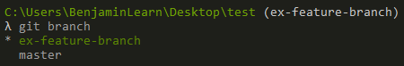
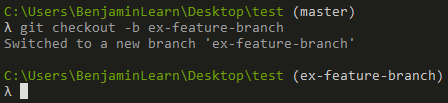
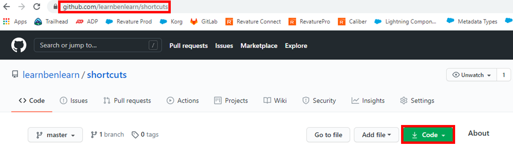
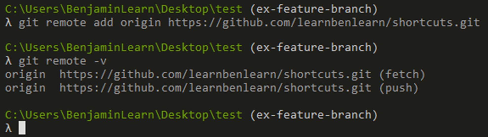
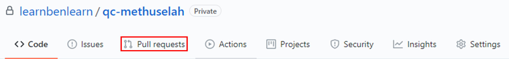
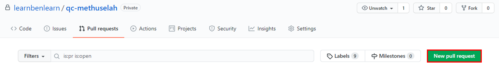
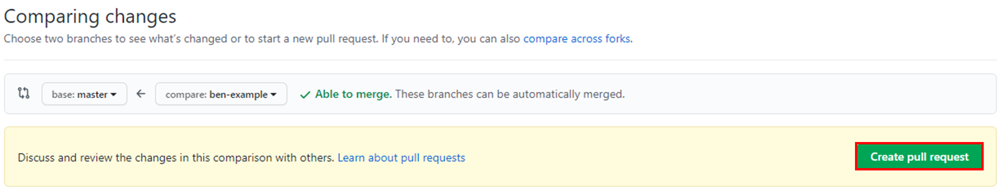
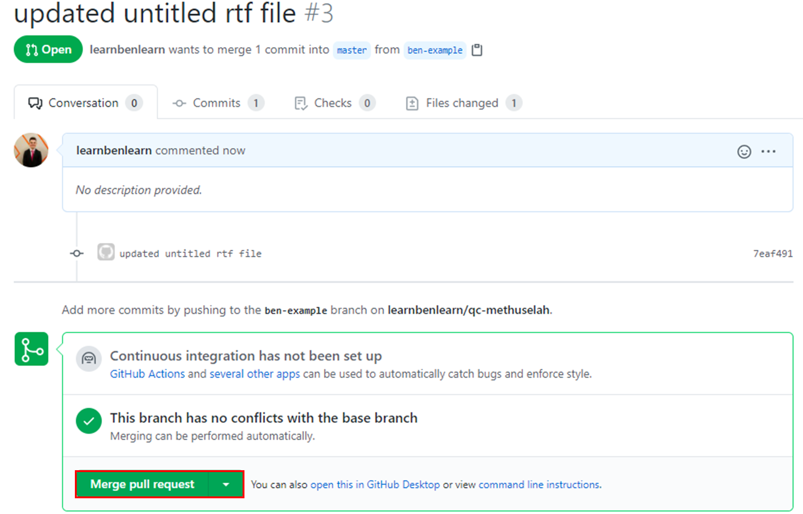

# Module - Git & Github

- [Module - Git & Github](#module---git---github)
  * [Intro to Git & Github](#intro-to-git---github)
  * [Git Branching](#git-branching)
  * [Working with Remote Repositories from the Command Line](#working-with-remote-repositories-from-the-command-line)
  * [Pull Requests](#pull-requests)
  * [Recipe](#recipe)

[Git Cheat Sheet](https://training.github.com/downloads/github-git-cheat-sheet.pdf)
[Dangit, Git!?!](https://dangitgit.com/)
[git_training (UnseenWizard, Github)](https://github.com/UnseenWizzard/git_training)


## Intro to Git & Github

Git

* git is a distributed version control system for tracking changes to source code made while developing
* the entire codebase/history of a project is available on a developer's computer as a local repository
    * allows for easy branching and merging
    * local repo contains all information that the remote repo (i.e. the place where our code is stored remotely) had the last time the local and remote synced
* particularly useful for organizing/integrating code written by multiple developers

Github

* cloud-based git repo hosting service
    * other popular git hosting services include GitLab, Bitbucket, and SourceForge
* git is the command line tool, Github is a web-based UI
* in addition to basic git features, Github also provides features such as access control, wikis, and kanban boards with issues

Initializing Repositories

* we initialize a local repository by running the `git init` command from the command line in the directory (i.e. folder) we want to create the repository in
* this command will create a `.git/` directory within our current directory
    * because its name starts with a period, this is a hidden directory - it's not visible by default through tools like the `File Explorer` on windows
    * the `.git/` directory is the local repository - it stores information such as commits, the address of any remote repositories, and other details

Git Config

We can change the name and email that is associated with your Git commits using the git config command.

To set this globally, meaning for every repository on your computer, execute the following command:

```bash
git config --global user.name "YOUR NAME"
git config --global user.email "email@example.com"
```

And to change these settings for a single repository:

```bash
git config user.name "YOUR NAME"
git config user.email "email@example.com"

```

Add the email address to your account on GitHub, so that your commits are attributed to 
you and appear in your contributions graph on your profile!

Terminology

<p align="center"></p>

* `Working Directory`
    * the location of untracked files and files that have been modified since the last commit
    * we can list the files in the working directory with the `git status` command
* `Staging Area`
    * a holding area for code that we're going to commit to our repo
    * we can pick and choose what we commit from the staging area and when we commit it

Staging Files

* we can add specific files to the staging area with the `git add <file-name>` command, with the name of our file replacing the `<file-name>` placeholder
    * if we have multiple files to stage, we'll list them following the `git add` command, with their names separated by spaces
* much more commonly, we'll add _all_ changes that we've made since the last commit with the `git add .` command (the period signifies that we're adding all files with changes in the `Working Directory` to the `Staging Area`)

Committing Locally

[git-commit](https://git-scm.com/docs/git-commit)

* we commit changes from the `Staging Area` to our local repo with the `git commit` command
* if we only want to commit specific files from the `Staging Area`, we'll list their space-separated names following this command
* if we'd like to commit all files in the `Staging Area`, we don't have to specify any filenames after the command
* we should include the `-m` flag following our command, which we'll follow with a commit message in quotes that explains the changes that we've made

Pushing Local Changes to a Remote Repository

[git-push](https://git-scm.com/docs/git-push)

* once we've committed our changes locally, we can push them to our remote repository with:

```bash
git push <remote-repo-alias> <remote-repo-branch>
```

* where we'll replace the placeholders as appropriate
* most of the time, the name of the remote branch that we're pushing to should be the same as the name of the branch that we're in locally
* `<remote-repo-alias>` will commonly be `origin`

How Does git Work?

* git isn't smart (shhh) - it doesn't know the syntax of any programming languages
* but it does know when things change
* when we initialize a local repository, git begins tracking all the files within that repository (all the files that aren't included in the `.gitignore` file, that is)
* when a change is made to a tracked file, git keeps track of that in the `Working Directory`
    * this change can be anything - something important like a line of code, or something trivial like a new whitespace or newline
* after we commit our changes locally with the `git commit` command, the cycle begins again
    * when a change is made after this new commit, it's tracked in the `Working Directory`

## Git Branching

[Git Head](https://www.javatpoint.com/git-head#:~:text=The%20HEAD%20points%20out%20the,transferred%20to%20the%20new%20branch.)

[3.1 Git Branching - Branches in a Nutshell](https://git-scm.com/book/en/v2/Git-Branching-Branches-in-a-Nutshell)

Branching

* when we initialize a git repository, the `git init` command creates a default `master` branch (among performing other tasks)
    * this branch is meant to hold our production-ready project code
    * keeping the `master` branch clean allows it to serve as our source of truth - i.e. what all developers on the team agree is the code that is ready to be live in production or is already live in production
* a branch is the `HEAD` of a particular series of commits
    * under-the-hood, it's a moving pointer to a commit object
    * the `HEAD` is the latest commit to the branch - every time we make a new commit to that particular branch, the `HEAD` pointer that git uses under-the-hood is updated to point to that latest commit
* at a high-level, we can think of a branch as a timeline of our project, updated with each commit
* by branching, we can take a snapshot of the source branch (most commonly the `master` branch) we're basing our new branch off of and test/develop new features without worrying about modifying (and possibly breaking) our source of truth/production-ready code
* consider the following workflow

<p align="center"></p>

* here, we're creating a branch to work on a new feature
    * once we've finished our feature and tested it, we can merge this branch back into `master` and push the changes to our production environment

Creating New Branches

* we create new local branches with the `git branch <branch-name>` command, which we follow with the name of our new branch, e.g. `git branch my-feature-branch`
    * running `git branch` without any parameters or arguments will list all branches in our local repository, highlighting our current branch, as below:

<p align="center"></p>

Switching Branches

* we can switch branches locally with the `git checkout <branch-name>` command
    * e.g. `git checkout my-feature-branch`
    * switching to our feature branch ensures that any changes we're about to make _will not_ modify our `master` branch
* we can create a new branch and switch to it with a single command by preceding the name of our new branch with the `-b` flag, e.g.

<p align="center"></p>

Merging Branches Locally

* when we've finished our feature and tested it sufficiently, we can merge our feature branch back into the `master` branch
    * alternatively, we might merge our feature branch into, e.g., a testing branch
* many times, we'll do this on Github with pull requests, but we can perform this operation locally as well
* to merge branches locally, we'll switch to the target branch (i.e. the one we're merging into) and run `git merge <source-branch> -m "merge message"`, replacing `<source-branch>` with the name of our feature branch and `"merge message"` with a descriptive message
* we can then run the `git add`, `git commit`, and `git push` commands to deploy our changes to our remote repo

Good Branching Strategies

* commonly, we want to create feature-based branches - i.e. one branch per feature
* we should also name our branches based off the features they pertain to - e.g. a branch that's being used to develop a component that will list all users in a table should be named something like `user-list-comp`

## Working with Remote Repositories from the Command Line

Local-Remote Communication Commands

* there are four commands that cause our local repo to communicate with a remote repository
    * `git clone`
    * `git fetch`
    * `git pull`
    * `git push`
* we've already detailed `git push`, so we'll explore the remaining three in order

Cloning Remote Repositories

* if we're working on a project that already has an existing remote repository, we'll most likely clone the remote repo rather than creating our own local repo with the `git init` command
* to clone a remote repo, we'll need the corresponding address
* we can get this address by adding `.git` onto the end of the url of the remote repo (surrounded by the top red rectangle)
* alternatively, we can get and copy the address by clicking the `Code` button (surrounded by the bottom red rectangle)

<p align="center"></p>

* once we have the remote repo address, we'll use the `git clone` command followed by the remote address, e.g. `git clone https://github.com/learnbenlearn/shortcuts.git`
* when we run this command it
    * creates a directory with the same name as the remote repo within our current directory
    * initializes a local repo in this new directory
    * makes local copies of all branches in the remote repo and their contents
    * adds the remote repo address to our local repo with the alias `origin`

Manually Adding Remotes

* if we don't use the `git clone` command, we can manually add a remote repository to a local repository with `git remote add <remote-repo-alias> <remote-repo-address>`, replacing `<remote-repo-alias>` with our desired alias (which will commonly be `origin`) and `<remote-repo-address>` with the address that our remote repo lives at (again ending with `.git`)
    * e.g.

<p align="center"></p>

* in the above example, we also use the `git remote -v` command, which lists all of our remote connections

Fetching from Remote Repositories

[git-fetch](https://git-scm.com/docs/git-fetch)

* the `git fetch` command downloads changes from a remote repository - but it _does not_ commit them to our local repository
    * we specify the remote repository following the command, e.g. `git fetch origin`

Pulling from Remote Repositories

* we use the `git pull` command to get the latest changes made to remote repositories
    * this command both fetches _and_ commits the remote changes to our local repository
* we follow the command with the alias of our remote repository and the specific remote branch we're pulling from (which will commonly have the same name as the branch we're in locally), e.g. `git pull origin master`
* we'll need to pull before pushing if there are any new changes (that we don't yet have locally) made to the remote branch that's connected to the local branch we're working in

Laziness

* if we've cloned a remote repo and we're working in a branch that has a connection to a remote branch, we can run the `git pull` and `git push` commands without any arguments or parameters
    * i.e. the remote repo alias and branch name will be pulled from the default values, which are the cloned repo and current branch, respectively

## Pull Requests

* to merge branches on Github, we'll create a pull request
* first, we'll click `Pull requests` on our repository in the Github UI

<p align="center"></p>

* then, we'll click `New pull request`

<p align="center"></p>

* on the following page, we'll choose the source branch (which we'll set with the `compare:` dropdown) and the target branch (which we'll set with the `base:` dropdown)
* once we're good to go, we'll click `Create pull request` and then `Create pull request` again on the following screen

<p align="center"></p>

* once we're ready to merge, we'll click `Merge pull request` and then `Confirm merge` on the following screen

<p align="center"></p>

## Recipe

So putting this all together, our recipe for commiting any changes we've made to a remote repository is:

1. Stage the local changes with `git add`
2. Commit the changes locally with `git commit`, including a commit message
3. If the remote branch has changes that we don't yet have locally, get them locally with `git pull`
4. Push our changes to the remote repo with `git push`
