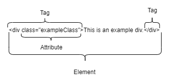
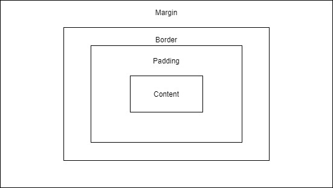

# Module - HTML & CSS

This module introduces HTML and CSS.

## Table of Contents

- [Module - HTML & CSS](#module---html---css)
  * [Table of Contents](#table-of-contents)
    + [Helpful References/Links](#helpful-references-links)
  * [Introduction to HTML](#introduction-to-html)
    + [Elements](#elements)
    + [Attributes](#attributes)
      - [The class Attribute](#the-class-attribute)
      - [The id Attribute](#the-id-attribute)
  * [Starting HTML Documents](#starting-html-documents)
    + [The \<head\> Tag](#the---head---tag)
    + [The \<body\> Tag and Common HTML Elements](#the---body---tag-and-common-html-elements)
      - [Hyperlinks](#hyperlinks)
      - [Images](#images)
      - [Tables](#tables)
      - [Lists](#lists)
      - [Other Common HTML Elements](#other-common-html-elements)
      - [Semantic Markup](#semantic-markup)
      - [Web Accessibility](#web-accessibility)
  * [Responsive Web Design](#responsive-web-design)
  * [Styling HTML with CSS](#styling-html-with-css)
  * [The Box Model](#the-box-model)
    + [Margins](#margins)
    + [Borders](#borders)
    + [Padding](#padding)
  * [Other CSS Properties](#other-css-properties)

### Helpful References/Links

* [HTML Element Reference - By Category (w3schools)](https://www.w3schools.com/tags/ref_byfunc.asp)
* [HTML \<title\> Tag (w3schools)](https://www.w3schools.com/tags/tag_title.asp)
* [HTML \<meta\> name Attribute (w3schools)](https://www.w3schools.com/tags/att_meta_name.asp)
* [HTML \<ol\> Tag (w3schools)](https://www.w3schools.com/tags/tag_ol.asp)
* [How To Add CSS (w3schools)](https://www.w3schools.com/css/css_howto.asp)
* [CSS Reference (w3schools)](https://www.w3schools.com/cssref/default.asp)
* [CSS Box Model (w3schools)](https://www.w3schools.com/css/css_boxmodel.asp)
* [CSS border Property (w3schools)](https://www.w3schools.com/cssref/pr_border.asp)
* [CSS Units (w3schools)](https://www.w3schools.com/cssref/css_units.asp)
* [CSS Legal Color Values (w3schools)](https://www.w3schools.com/cssref/css_colors_legal.asp)
* [Flexbox (MDN web docs)](https://developer.mozilla.org/en-US/docs/Learn/CSS/CSS_layout/Flexbox)

## Introduction to HTML

HTML, or HyperText Markup Language, is a markup language for creating web pages and applications. HTML syntax includes elements and attributes that web browsers parse in order to render the content of the webpage. We use CSS to introduce styling to our HTML pages and JavaScript to create dynamic behavior in our pages.

### Elements

HTML is composed of many different elements that provide the structure of the document. Elements are defined within HTML files using tags and contain the opening tag, closing tag, and everything in between (attributes, text, other tags and elements, etc.). The tag is enclosed within angle brackets and most elements have a closing tag which defines the end of the element, using the forward slash notation - for example, a closing "div" tag would be `</div>`. As we alluded to earlier, HTML elements may be *nested* within other elements, as in the following example:

```html
<div> text inside the div but outside the paragraph
  <p> this text is inside the paragraph </p>
</div>
```

In order for HTML to be valid, tags must be properly nested - an outer tag cannot be closed before an inner one. For example, the following markup would not be considered valid:

```html
<div> invalid!
  <p> cannot close the div here => </div>
</p>
```

Not all elements have closing tags, some are self-closing.

### Attributes

HTML elements can also have attributes defined within the opening tag - these are key/value pairs that define the characteristics of the element by giving metadata about the tag that are important for the browser to know such as element-specific styling, the end url of a link, and/or classes/ids. The key is the name of the property being set and the value is always enclosed by quotations. While many HTML elements have their own unique properties, there are also global properties that are available to all visible elements, some of which will be discussed shortly. But first, see the below image for further clarification on the difference between elements, attributes, and tags.

<p align="center"></p>

#### The class Attribute

Classes are primarily used to group elements that should have a common appearance - if you have multiple elements that should have the same styling, assign the same class to each of them. To assign a class, simply write the property name (`class`) followed by an equals sign and opening and closing quotes containing the name of the class. An element can have multiple classes, so long as they are separated by a single space within the quotes.

#### The id Attribute

If there is styling that should be unique to a given element (or, as we will see in a future module, if you wish to interact with the element programatically), you can specify the element's `id`. Any id given to an element should be unique across the entire document - it should not be used for any other elements.

## Starting HTML Documents

Every HTML document (ending with `.html` extension) should begin with a special tag known as the `DOCTYPE` declaration - this lets browsers know what kind of document they are using (HTML, in our case) as well as which version of the markup language is being used. For HTML5, the newest version and the one which we'll be using, the `DOCTYPE` syntax is:

```html
<!DOCTYPE html>
```

The `DOCTYPE` declaration tag does not have a closing tag and is not self-closing. Following this tag, we include the `<html>` tag which begins the root of our document. Everything about our webpage will be nested within this tag.

Within the `html` element we have two important tags - the `<head>` and the `<body>` tags. The `head` element will contain all the metadata associated with the page, including the title, character encoding, and references to external stylesheets. The `body` element contains the actual content of our page that will be rendered on the screen by the browser.

### The \<head\> Tag

As we said in the previous section, the `<head>` element contains the metadata associated with the page. One of the elements that can be placed within the head is the `<title>` element, which holds a title for our page between its opening and closing tags and is required for all HTML pages. While your page may still render without a title, you must have one if you wish to validate it, i.e. use a program that parses your markup and ensures you are writing error-free HTML.

The `<meta>` tag holds metadata, i.e. information, about our page. We specify the purpose of the metadata by setting the `name` attribute in the tag. A `name` set to `application-name` gives the name of the web application for the page, `author` corresponds to the HTML document's author, `description` gives an explanation of the markup's purpose and use, `generator` holds any software packages used to create the document, `keywords` contains key terms for search engines to pick up on, and `viewport` allows us to manipulate what part of the page is visible to the user.

Next is `<link>`, which we will most frequently use to declare the external CSS document we are using for the page (we'll discuss CSS later in this module). We do this by giving a value of `stylesheet` to the `rel` attribute (which holds the relationship between the linked document and our HTML page), `text/css` to the `type` attribute, and the relative path to the CSS file from the directory containing the HTML document to the `href` attribute. Alternatively, we can include internal styling by using the `<style>` element, which holds the design for our page.

`<script>` can contain either internal JavaScript or a relative path to an external JavaScript file. 
While we are discussing this tag in the context of the page's `head`, we may at times find it useful to 
include our code at the end of the `body` instead in order to improve the visual performance of our page. 
HTML documents render sequentially, so any JavaScript in the `head` will finish loading before any visual 
elements in the body begin to load. This can be problematic and visibly slow our page if we have a large 
amount of code in the `head`. We could alternatively use the 'defer' attribute, like in our example below. 
This will ensure that the script is only run after the page has finished parsing and will function 
the same as placing our scripts at the end of the body. We also have the 'async' option. This will 
download the script in parallel to parsing the page, and then execute as soon as it's available. 
Your use case will determine the method you use. We will explore JavaScript more fully in a later module.

Lastly, `<base>` allows us to give a base url for all hyperlinks in our document (i.e. all hyperlinks 
will specify an addition to the end of the url to take us to a specific page whose url starts with 
that base url). We can also set the behavior of hyperlinks (whether they open in a new tab, the same 
tab, etc.) through the `target` attribute of this tag.

This is not a complete list of tags that can be used in the `head` of a document. Other tags, 
such as images or hyperlinks can be placed within the `head` and will still render, but it is a best 
practice to reserve the `head` solely for metadata tags (i.e. those that we have discussed in this section).

```html
<head>
	<title>My Title</title>
	<meta charset="utf-8">
	<meta name="description" content="Place the meta description text here.">
	<meta name="viewport" content="width=device-width, initial-scale=1.0">
	<link rel="stylesheet" type="text/css" href="path/to/css/file">
	<script src="demo_defer.js" defer></script>
</head>
```
[More info on meta tags and search engine optimization](https://ahrefs.com/blog/seo-meta-tags/#meta-robots)

### The \<body\> Tag and Common HTML Elements

Visible elements are elements that make up the portion of the HTML page that is visible to the user (i.e. they are not metadata) and are usually contained within the `<body>` element. Before listing some of the HTML elements available for use, it's important to know the difference between inline and block-level elements. Block-level elements implicitly have newlines before and after, therefore taking the entire width of the page by default, instead of rendering within the line itself and taking only the space they need like inline elements do. One example of a block element is `<div>`, and a common inline element is `<span>`. Try them out on your webpage and notice the difference.

#### Hyperlinks

To make a clickable hyperlink in a webpage, use the `<a>` tag. We must specify the `href` attribute, which holds the url to which the user is redirected. See below:

```html
<p> Here is a <a href="www.google.com">link to Google!</a></p>
```

Optionally, we can also include the `target` attribute, which tells the browser where to open the hyperlink (e.g. in a new tab, the current tab, etc.).

#### Images

We display images through use of the `` tag, a self-closing tag that requires the `src` attribute, where we specify the relative path or URL to the image file. We can also use the `alt` attribute to display alternative text in the event that the image is unable to be shown (e.g. if the url is incorrect or if the image has been removed from that url) or to assist screen readers for users with sight problems.

#### Tables

To create a table, we first write opening and closing `<table>` tags. Within those tags, `<tr>` defines a table row, `<td>` defines a cell of data in the table, and `<th>` is used for table headers. Unlike images and hyperlinks, tables do not have unique attributes in HTML5, but they can still make use of `style`, `class`, `id`, and other global attributes to which all elements have access. See the below code for an example of a table:

```html
<table>
  <thead>
    <tr>
      <th>Id</th>
      <th>Name</th>
    </tr>
  </thead>
  <tbody>
    <tr>
      <td>1</td>
      <td>Alice</td>
    </tr>
    <tr>
      <td>2</td>
      <td>Bob</td>
    </tr>
    <tr>
      <td>3</td>
      <td>Charlie</td>
    </tr>
  </tbody>
</table>
```

#### Lists

There are two options for making lists in HTML - ordered and unordered lists. Ordered lists are defined with `<ol>` and are numbered by default, although we can change from numbers to, e.g., roman numerals or letters by setting the `type` attribute. These lists can also use the `reversed` attribute, which takes no value and displays the list in a descending order, and the `start` attribute, which takes a number that represents the starting value of the list (e.g. the first item in a list with a `start` of three will be number three, the next will be number four, and so on). There are also unordered lists, which have no unique attributes in HTML5; these are defined with `<ul>` and contain bulleted items. The items in both ordered and unordered lists are wrapped within `<li>` tags:

```html
<ol> <!-- ordered lists render as 1, 2, 3, etc.. -->
  <li>First item</li>
  <li>Second item</li>
  <li>Third item</li>
</ol>
<ul> <!-- list items in here will just be bullet points -->
  <li>First item</li>
  <li>Second item</li>
  <li>Third item</li>
</ul>
```

#### Other Common HTML Elements

See below for other common HTML elements, note that this is by no means an exhaustive list of all available tags, see a reference such as w3schools for a more comprehensive list.

* `<div>` - a block-level element defining a division of the page
* `<p>` - a block-level element defining a paragraph
* `<span>` - an inline element for grouping text or elements
* `<b>` - bold text
* `<i>` - italicized text
* `<h1>`, `<h2>`, ... `<h6>` - headings, `h1` is largest and `h6` is smallest; all are block-level elements
* `<br/>` - self-closing tag for line breaks
* `<!-- -->` - holds comments

#### Semantic Markup

Many HTML tags have semantic meaning. That is, the element itself conveys some information about the 
type of content contained between the opening and closing tags.

For example, when a browser encounters an h1 heading it interprets that tag to mean that the contents 
of the h1 element constitute the most important heading of the section that contains the element. The 
semantic meaning of an h1 tag is that it is used to identify the most important header of a specific 
web page or section.

But what's the purpose of semantic markup? Well when we use semantic markup we get the benefit of 
increased search engine optimization with search engine web crawlers. Also better compatibility with 
browser translation tools and increased accessibility for people who use screen readers. 

Some common semantic tags:
* ```<header></header>```
* ```<nav></nav>```
* ```<section></section>```
* ```<article></article>```
* ```<aside></aside>```
* ```<footer></footer>```

Note that we must use these tags correctly for them to actually be helpful and semantic. We wouldn't 
use footer for a navigation bar for example. Take a look at the image below for an example of where 
these elements are suppose to go. 


#### Web Accessibility

In our last section we described how semantic markup can be used to enhance the accessibility of our 
site. In this section we will provide some more tools.

[ARIA](https://developer.mozilla.org/en-US/docs/Web/Accessibility/ARIA)
[tabindex](https://developer.mozilla.org/en-US/docs/Web/HTML/Global_attributes/tabindex)

## Responsive Web Design

Simply put, the best designed HTML pages are responsive. Have you ever viewed a website on your phone that made you scroll horizontally to see the entire width of the page or one with distorted images/page elements? This experience is becoming more and more rare as websites continue to adopt responsive web design, i.e. the implementation of webpages that adapt to the device viewing it and the size of that device. There are many ways to implement responsive web design in our HTML pages, one of which we previously discussed in `The <head> Tag` section: setting the viewport. Introduced in HTML5, the viewport allows us to tell the browser how to control the size and scale of the document based on the device viewing it.

We can also make our webpages responsive by wrapping images in `<picture>` tags which contain at least one `<source>` tag. The `<source>` tag has a media attribute where we can set the minimum width allowed for a picture. If the size of the device is below this value, the browser will not render the image. This tag is a new feature introduced in HTML5, so all `<picture>` tags must end with an `` tag in order to ensure that browsers that do not recognize or understand HTML5 will still be able to render an image from the markup.

A final option for adaptive webpages is making use of various aspects of styling, which we will discuss further in the next section.

## Styling HTML with CSS

CSS stands for Cascading Style Sheets and is the main way to style our HTML pages. When the browser displays an HTML page, it first loads and parses the HTML to create the Document Object Model (DOM) tree, which represents the page. Next, the browser loads and parses any CSS to style the appropriate nodes of the tree, before finally displaying the DOM contents.

The CSS language is made of selectors, declarations, properties, and values that together give design rules that the browser interprets when it is performing this parsing. Selectors determine the element(s) being styled and prepend any blocks of styling. We can select by HTML tag, an element's `class`, an element's `id`, or other attributes. Note that we can select by any combination of tag, `class`, and non-`id` attribute, but all `id` selections should be solitary because best practices dictate that the `id` is unique across all elements in the document, so there should be no need for further specification. To select by a tag, we simply use the tag name, such as `p`. For `class` selection, a period precedes the name of the `class`. We select by `id` using a hashtag followed by the id value. Finally, we have the option to further specify any tag selectors by using attribute selectors, which give an attribute and its value within square brackets, e.g. `p[align="center"]`.

Following selectors, we have a set of curly braces that contain the corresponding declaration. The declaration is made of colon-separated property-value pairs. Our declarations can contain more than one property specification, in which case the properties are separated by semicolons.

CSS can be included inline, interally in our HTML page, or externally in a separate `.css` stylesheet. Inline CSS is specified in the `style` attribute of the HTML element and contains only property specifications (no curly braces or selector, because the styled element is already determined by virtue of being the one containing the `style` attribute). Let's look at an example use:

```html
<div style="background-color:blue">This div tag contains inline styling.<\div>
```

Our next form of styling, internal styling, has the same appearance as external styling (with the selectors and declarations containing property specifications), but, as we said earlier, it is included within the `<style>` tag located in the `<head>` of the document. Finally, external CSS is located in a separate file that we reference through the `<link>` element in the page's `<head>`. Let's look at an example CSS file; note that this code could be copied and pasted into a `<style>` tag in an HTML page without needing to make any adjustments.

```css
p {
    background-color:blue;
}

.className {
    background-color:red;
}

#idName {
    background-color:black;
}

p[align="center"]{
    background-color:green;
}

p.className[align="center"]{
    background-color:yellow;
}
```

Each HTML element will follow the styling rules dictated by the most specific selector that it matches. For example, a `<p>` without `className` or the `align` attribute set to `center` will be given a blue background by the above code, a `<p>` with the `align` attribute set to `center` but without `className` will be given a green background, and a `<p>` with the alignment and the `className class` will be given a yellow background.

We can use inline, internal, and external styling, but conflicting property definitions will override each other by order of precedence: inline styling takes the highest precedence, followed by internal styling, and finally external styling.

## The Box Model

The box model is a container that wraps around each HTML element in a webpage and a tool that we frequently use in CSS.

<p align="center"></p>

We can apply styling at each level of the box, which is shown in the above image. The margin is the outermost layer, representing a transparent space outside of the element's border, the next innermost layer that serves as an opaque perimeter around the element. After that is the padding, which is spacing between the border and the final layer: the content, where the text/images of our element are held.

### Margins

An element's margins can be determined through the `margin`, `margin-bottom`, `margin-left`, `margin-top`, and/or `margin-right` properties. The `margin` property is a shorthand property (one that implicitly determines the value of more specific properties based on the values given to it) that lets us specify the width of the element's margins through relative or absolute sizes.

Using a relative size allows us to implement responsive design, usually through specifying the percentage of the parent element that the margin takes up or by using the em unit, which relates to the size of the element's font. Absolute sizes can take many different units, including pixels, cm, and in, among others.

We can also specify more than one width value for the `margin` property. If we specify two values, the first determines the width of the top and bottom margin and the second does the same for the left and right sides. If we specify three values, the first relates to the top, the second to the left and right, and the last to the bottom. Finally, we can dictate four values, in which case they relate to (in order) the top, right, bottom, and left margins.

Rather than specifying the `margin` property, we can give values to the `margin-bottom`, `margin-left`, `margin-top`, and/or `margin-right` properties, which each only take one value relating to the bottom, left, top, and right margins, respectively.

### Borders

Border properties include `border`, `border-bottom`, `border-left`, `border-top`, `border-right`, and 
`border-color`; the first five of which are shorthand properties. In the `border` property, we can 
specify (in order) the width, style (which is required), and color of the border.

The width can be `thin`, `medium`, `thick`, a relative size, or an absolute size and can also take 
single or multiple values in an analogous way to that of the `margin` property. Style determines the 
line style of the border and can take values such as `dotted`, `solid`, or `dashed`. Lastly, color 
determines the border's color. There are many ways to specify colors in CSS, including hexadecimal values 
prepended with a hashtag, color names such as `black` or `blue`, the `rgb` function, which takes the 
comma-separated integer values (between 0 and 255) for red, green, and blue as parameters (e.g. `rgb(1, 
23, 28)`). We also have HSL(hue, saturation, lightness).

`border-bottom`, `border-left`, `border-top`, and `border-right` have the same possible subproperties as 
`border`, but they only apply to the bottom, left, top, and right of the border, respectively, and we can 
only write one width value per property. Finally, we can specify the border's color individually through 
the `border-color` property.

[We also have a border-radius property as well](https://developer.mozilla.org/en-US/docs/Web/CSS/border-radius)

### Padding

An element's padding is determined through any of the `padding`, `padding-bottom`, `padding-left`, `padding-right`, and/or `padding-top` properties, each of which is analogous to the corresponding margin property and takes a width value(s) specifying the padding.

## Other CSS Properties

We will conclude this module by talking about some other common and useful CSS properties. First are properties relating to backgrounds: `background`, `background-color`, and `background-image`. The `background` property is a shorthand property that can determine background color, image, position, and other properties. `background-color`, on the other hand, only specifies the color of the background, and can take any of the CSS color formats (color names, hexadecimals, the `rgb` function, etc.). Lastly, `background-image` allows use of a picture background and takes the `url` function to which we pass the relative path to or url address holding the image in parentheses as a parameter.

Another group of properties are those that determine font, including `font`, `font-family`, and `font-size`. As a shorthand, `font` can specify values for the type of font and its size, as well as whether it's bold or italicized. `font-family` takes the name of the font and `font-size` takes a relative, absolute, or keyword (such as `medium`) size.

The next group is the positional/size group, which contains the `position` property, where we dictate the type of positional values we will specify. Possible values include `absolute`, which positions the element according to the values we give in relation to the page itself, and `sticky`, which will initially follow a specified position, but will move with the user's screen as they scroll through the page.

The `bottom`, `left`, `top`, and `right` properties take absolute or relative lengths determining where the element is positioned on the page. We declare the size of the element itself through `width` and `height`, which similarly take absolute or relative lengths. We can also promote webpage responsiveness through the `max-height` and `max-width` properties, which determine the maximum size of an element (regardless of device size), as well as the `min-height` and `min-width` properties, which do the same for an element's minimum size.

Lastly, we have arrangement properties to modify how our elements are displayed on the page. We can give the `display` property values such as `inline` (making the element an inline element), `block` (making the element a block element), or `flex`, among other possibilities.

The `flex` value allows us to use the flexbox, which is a responsive container for holding HTML elements. With this value, we can also specify the `flex-direction`, `flex-flow`, and `flex-wrap` properties. `flex-direction` can take various values, including `row` (which displays the elements in a row), `row-reverse` (which does the same but displays the elements in the reverse of the order they are defined in our document), `column` (which displays the elements in a column), and `column-reverse` (analogous to `row-reverse`, but for columns). Giving a value of `wrap` to `flex-wrap` lets elements wrap to the next line when the end of the window is reached. Alternatively, we can specify values for both the wrap and direction of the flexbox with the shorthand `flex-flow` property.

[Flexbox video tutorial](https://www.youtube.com/watch?v=fYq5PXgSsbE)

[Game to help learn flexbox!](https://flexboxfroggy.com/)

[CSS Grids is another important tool!](https://www.youtube.com/watch?v=9zBsdzdE4sM&t=1s)