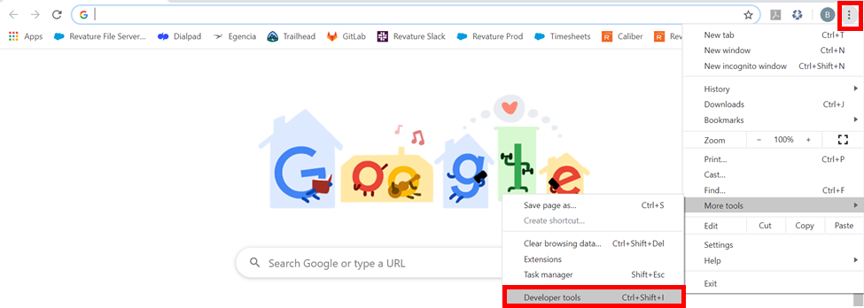

# Module - JavaScript

This module introduces JavaScript, and many other related topics.

## Table of Contents

- [Module - JavaScript](#module---javascript)
  * [Table of Contents](#table-of-contents)
  * [Helpful References/Links](#helpful-references-links)
  * [JavaScript Introduction](#javascript-introduction)
    + [JavaScript Comments and Printing to the Console](#javascript-comments-and-printing-to-the-console)
  * [JavaScript Variables, data types, and scope](#javascript-variables--data-types--and-scope)
  * [JavaScript Operators](#javascript-operators)
  * [JavaScript Functions](#javascript-functions)
    + [Wait, explain hoisting?](#wait--explain-hoisting-)
  * [JavaScript Objects](#javascript-objects)
  * [JavaScript Classes](#javascript-classes)
  * [Falsy Values](#falsy-values)
  * [JavaScript Control Flow](#javascript-control-flow)
  * [Loops](#loops)
  * [Running JavaScript in HTML](#running-javascript-in-html)
  * [The JavaScript Browser Console](#the-javascript-browser-console)
  * [JavaScript Modules](#javascript-modules)
  * [JavaScript Decorators](#javascript-decorators)
  * [The DOM](#the-dom)
  * [Events and Event Listeners](#events-and-event-listeners)
    + [Event Propagation](#event-propagation)
    + [Adding and Removing Event Listeners](#adding-and-removing-event-listeners)
    + [The Event Object](#the-event-object)
  * [Date functions](#date-functions)
  * [Putting it all together - String and DOM manipulation](#putting-it-all-together---string-and-dom-manipulation)
  * [Async JS](#async-js)
    + [Event Loop](#event-loop)
    + [Callbacks](#callbacks)
    + [Promises](#promises)
    + [Async/Await](#async-await)
    + [Fetch API](#fetch-api)
  * [Out of Scope](#out-of-scope)

## Helpful References/Links

* [JavaScript Data Types (w3schools)](https://www.w3schools.com/js/js_datatypes.asp)
* [Data types (JavaScript.info)](https://javascript.info/types)
* [JavaScript String Reference (w3schools)](https://www.w3schools.com/jsref/jsref_obj_string.asp)
* [JavaScript Array Reference (w3schools)](https://www.w3schools.com/jsref/jsref_obj_array.asp)
* [JavaScript HTML DOM (w3schools)](https://www.w3schools.com/js/js_htmldom.asp)
* [HTML DOM Events (w3schools)](https://www.w3schools.com/jsref/dom_obj_event.asp)
* [Equality comparisons and sameness (MDN web docs)](https://developer.mozilla.org/en-US/docs/Web/JavaScript/Equality_comparisons_and_sameness)
* [Comparison operators (MDN web docs)](https://developer.mozilla.org/en-US/docs/Web/JavaScript/Reference/Operators/Comparison_Operators)
* [Conditional (ternary) operator (MDN web docs)](https://developer.mozilla.org/en-US/docs/Web/JavaScript/Reference/Operators/Conditional_Operator)
* [JavaScript Arithmetic (w3schools)](https://www.w3schools.com/js/js_arithmetic.asp)
* [JavaScript Break and Continue (w3schools)](https://www.w3schools.com/js/js_break.asp)
* [for...in (MDN web docs)](https://developer.mozilla.org/en-US/docs/Web/JavaScript/Reference/Statements/for...in)
* [for await...of (MDN web docs)](https://developer.mozilla.org/en-US/docs/Web/JavaScript/Reference/Statements/for-await...of)
* [JavaScript HTML DOM Elements (Nodes) (w3schools)](https://www.w3schools.com/js/js_htmldom_nodes.asp)
* [The HTML DOM Element Object (w3schools)](https://www.w3schools.com/jsref/dom_obj_all.asp)
* [The XMLHttpRequest Object (w3schools)](https://www.w3schools.com/xml/dom_http.asp)
* [JSON - Introduction (w3schools)](https://www.w3schools.com/js/js_json_intro.asp)
* [JavaScript and HTML DOM Reference (w3schools)](https://www.w3schools.com/jsref/default.asp)
* [JavaScript (MDN web docs)](https://developer.mozilla.org/en-US/docs/Web/JavaScript)
* [DOM Manipulation](https://developer.mozilla.org/en-US/docs/Learn/JavaScript/Client-side_web_APIs/Manipulating_documents)

## JavaScript Introduction

JavaScript (JS) is the main scripting language of the web - it's used for client-side functionality 
by a great deal of websites and can be interpreted by all major browsers. The language drawn from 
concepts of the C language, can be used for object-oriented, functional, or procedural programming, 
and was built mainly for modifying and interacting with the DOM (both the HTML elements and their 
associated CSS; we will discuss this in more detail later) on the client-side. As such, JS cannot 
normally be run outside of a web browser. We do have frameworks such as Node.js that were created 
to allow JS to be executed outside of a browser, however. In our studies, we will only deal with 
this language within the browser.

JS is case-sensitive, loosely typed, and dynamically typed. Loose typing means that we don't 
declare the type of a variable when declaring said variable. Dynamic typing means that the type of 
the variable is determined at runtime (instead of compile time) and can change throughout the program 
with implicit conversion. Lastly, JS is an interpreted language. Compiled languages (such as C) have 
a compiler - a sort of middleman translator that breaks the language down into machine code that can 
be understood and run by the processor; while interpreted languages can be read and run one line at 
a time by the interpreter (the browser in the case of JavaScript).

### JavaScript Comments and Printing to the Console

JS has single-line and block comments, with single line comments prepended by // and block comments 
wrapped within /* and */. The console.log() function allows us to print output to the console.

## JavaScript Variables, data types, and scope

JavaScript variables, containers used to store values, are not declared with data types like some other languages, 
but they are declared with one of three scope-enforcing keywords: var, let, and const. What is scope you ask? 
Scope is what determines where a variable may be referenced. Variables declared without a scope default to var, 
which gives either global or function scope depending on where the variable is defined (more on functions later). 
If the var variable is defined outside of any function, it has global scope and can be referenced anywhere 
within the file. If it is defined within a function, it has function scope and can be referenced anywhere within 
that function, but not outside of it. Variables declared with the let keyword can have block scope, meaning that 
they can be referred in the block of code that declares them and any inner code blocks. Const can also 
enforce block scope, but cannot have its value changed after initial assignment (this rule gets a 
little funky with objects - we cannot assign a different _object_ to a const variable, but we can 
change the _properties_ of an object assigned to a const variable).

Although we do not declare data types for variables, JS still has data types. There are six 
primitive types: 

  - string - Strings can be enclosed in either single or double quotes. 
  - boolean - Booleans take true or false values.
  - number - Numbers can have decimals, but are not required to - in contrast to some other languages, JS has just one data type for all numbers. The number type also has three symbolic values: +Infinity, -Infinity, and NaN ("Not a Number").
  - undefined - Variables take an undefined value if they are not assigned a value when they are declared.
  - symbol - Once created, it's value is kept private and for internal use. All that remains after creation is the symbol reference. Every time one is created you will get a unique symbol, guaranteed to be different from all other symbols. You can pass a parameter to symbol() to provide a description. These are often used for object properties because each one is unique. You can see an example of this in the JavaScript Objects section of this module.
  - null - The null type is similar to undefined except that it is explicitly assigned.

All variables that do not hold one of these six primitive types are objects.

In order to determine a variable's type, we can use the typeof operator (except for the null type, 
where the typeof operator is a dirty liar), as below:

```JavaScript
var a = 5;
var b;
var c = null;

//will print 'number'
console.log(typeof(a));

//will print 'undefined'
console.log(typeof(b));

//will print 'object'
console.log(typeof(c));
```

## JavaScript Operators

Operators are the symbols we use to assign a value to a variable, do arithmetic, or evaluate expressions. 
    
We have already used one assignment operator earlier. 
```JavaScript
let x = 3;
```

Our arithmetic operators:
  - ```+``` addition
  - ```-``` subtraction
  - ```*``` multiplication
  - ```**``` exponentiation
  - ```/``` division
  - ```%``` modulus (division remainder)
  - ```++``` increment (increase value by 1)
  - ```--``` decrement (decrese value by 1)

The other assigment operators: 
  - ```+=```  example: ```x+=y``` same as ```x = x + y```
  - ```-=```  example: ```x-=y``` same as ```x = x - y```
  - ```*=``` example: ```x*=y``` same as ```x = x * y```
  - ```/=```  example: ```x/=y``` same as ```x = x / y```
  - ```%=```  example: ```x%=y``` same as ```x = x % y```
  - ```**=``` example: ```x**=y``` same as ```x = x ** y```

String Operators (this is called concatenation)

```
let text1 = "John";
let text2 = "Doe";
let text3 = text1 + " " + text2;
```

With the newer versions of JavaScript we can use template literals to avoid heavy string concatenation. Notice 
the use of backticks instead of quotes, as well as the ${} syntax to place a variable inside. 

```JavaScript
let name = 'Robert Paulson';
let str = `His name is ${name}`;
console.log(str);
```

JavaScript Comparison Operators

  - ```==``` equal to
  - ```===``` equal to and equal data type
  - ```!=``` not equal
  - ```!==``` not equal value or not equal type
  - ```>``` greater than 
  - ```<``` less than
  - ```>=``` greater than or equal to
  - ```<=``` less than or equal to
  - ```?``` ternary operator

example for ternary operator:
```JavaScript
function getFee(isMember) {
  return (isMember ? '$2.00' : '$10.00');
}

console.log(getFee(true));
// expected output: "$2.00"
console.log(getFee(false));
// expected output: "$10.00"
```

JavaScript Logical Operators

  - '&&' and
  - '||' or
  - '!' not

JavaScript Type Operators

  - typeof - returns data type
  - instanceof - Returns true if an object is an instance of an object type

[Check out this link for more info about operators!](https://www.w3schools.com/js/js_operators.asp)

## JavaScript Functions

JavaScript funcitons are blocks of code that we can define and choose to run as we wish. Take a look at some 
examples below.

```JavaScript
function myFunc() {
  console.log('This is my function!');
}

//we can call it and have it run like so:
myFunc();

//we can pass values into our functions to be used as we see fit:
function multiply(a, b) {
  //functions can call other functions
  //myFunc();
	
  //notice we can output the results of our funciton using the return keyword
  return a * b;
}

// in this case 5 is 'a' and 3 is 'b'. 15 will display in the console.
console.log(multiply(5, 3));
```

We also have what is known as anonymous functions. These functions do not require a name, they are stored in a 
variable and invoked when we use the variable name. 

```JavaScript
const x = function(a,b) {return a * b};
let z = x(4,3);
```

To add to our function toolbox we can also make use of arrow functions. This is a newer syntax and is not supported 
in IE11 or earlier. Arrow functions allow us to omit the function keyword, the return keyword, and the curly brackets.

```JavaScript
//normal
let normalFunction = function(x, y) {
  return x * y;
}

//arrow function

//note you can only omit the return keyword and curly brackets if the function has a single statement
const arrowFunction = (x, y) => x * y;
```

We have another consideration when using arrow funcitons however. For one thing, it's probably best to define them 
as a const. This is a safer bet as you can be assured that your function expression will never be overwritten.
Arrow functions are also not hoisted. Meaning they must be defined before they are used. 

### Wait, explain hoisting?

Hosting is an odd quirk of JavaScript. It actually allows for a variable or function to be used before it has 
been declared. It moves all declarations automatically to the top of the scope.

```JavaScript
x = 'Hello world!';
console.log(x);
var x;
```

The let and const keywords do not behave this way, however. They are hoisted, but not initialized. The following 
will produce an error.

```JavaScript
x = 3;
let x;
```

Note the difference. Hoisting only moves the declaration to the top of the scope, not the initilization itself. 
So the following will produce: '5 undefined'.

```JavaScript
var num1 = 5;
console.log(`${num1} ${num2}`);
var num2 = 7;
```

An example of function hoisting:

```JavaScript
myFunction("my message");

function myFunction(x) {
  console.log(x);
}
```

It's usually a best pratice to just define all of your variables at the top of the scope anyway. This will help 
you avoid any headaches that may arise from this odd quirk. 

## JavaScript Objects

JavaScript objects are a data type, but not a primitive. This means that they can be broken down into further 
pieces. The JS object type includes collections, which are either arrays or objects, (yes objects are part 
of, but not the entirety of, the object data type), and functions. Our first type of object we will discuss 
is called an object literal. An object is made up of properties (similar to variables but don't confuse the two) 
and methods (similar to functions, also don't confuse it). The terminology is important when we begin to delve 
into Object Oriented principles. Let's take a look at an object literal below.

```JavaScript
// here is an example of the symbol primitive being used 
const SYMBOLPROPERTY = Symbol('This is a symbol description!');

let myObj = {
  myProperty: 4,
  myOtherProperty: 'We can store all kinds of data types',
  [SYMBOLPROPERTY]: 'This value is paired with a symbol key',
  myMethod: () => {
    console.log('This is a method called from an object literal!');
  }
}

// we can access our objects properties and method like so
console.log(myObj.myProperty);
console.log(myObj[SYMBOLPROPERTY]);
myObj.myMethod();
```

As we said, objects can include arrays as well. These are zero-indexed lists of elements that can contain 
comma-separated values of different primitive or object data types. JS arrays have dynamic size. Arrays can 
be initialized with or without values and with square brackets or the Array constructor (although the latter 
is not considered a best practice). see below:

```JavaScript
let h = [1, 3];
console.log(typeof h); // will print 'object'
console.log(h.length); // to get size of array
```

## JavaScript Classes

JavaScript classes act as a blueprint to create objects. They were introduced in ECMAScript 2015 (ES6). 
Let's take a look at some examples to get a feel for how classes work.

```JavaScript
class Car {
  constructor(name, year, miles){
    this.name = name;
    this._year = year;
    this.miles = miles;
  }

  get age() {
    const n = new Date();
    return `The car is ${n.getFullYear() - this._year} year(s) old!`;
  }

  set year(year) {
    this._year = year;
  }

  odometerAdd(distance) {
    this.miles += distance;
  }
}
```

In this example of a class we are making use of a few concepts, let's break down each. First is the class constructor, 
this is a block of code that will execute upon instantiation of a car object. Meaning once the below code is run, we will 
expect to have a car object created in memory that has the name of 'Hyundai' and has 113,000 miles on it. Note that due to 
hoisting, we must delcare our class before we initialize our object. While the class may get hoisted, its initilizations will 
not.

```JavaScript
let c = new Car('Hyundai', 2016, 113000);
```

Next we see 'get age'. This is a javascript getter, a block of code that will execute whenever the property is accessed. 
```JavaScript
let c = new Car('Hyundai', 2016, 113000);
c.age;
// will print:
// 'The car is currentYear-2016 year(s) old!'
```

Next we see a JavaScript setter. This is a block of code that will execute when an assignment is applied. Note 
the naming of the setter and property here. The property has been named '_year' so we can distinguish between the two. 
```JavaScript
let c = new Car('Hyundai', 2016, 113000);
c.year = 2021;
c.age;
//c.age will print based on our updated call to the setter
```

The 'odometerAdd' is a method, not a getter or setter. It's simply adding miles to our odometer.

There is a lot more to JavaScript classes. Including: private fields, static fields, inheritence through the extends keyword, 
and more. We won't go over it all here, but we will have a longer discussion about object oriented principles when we discuss 
future topics. 

## Falsy Values

Falsy (or falsey) values are those that evaluate to false in a conditional expression. There are 
six falsy values in JS: false (pretty unexpected, right?), 0, empty string (either '' or "" because 
the language accepts either single or double quotes), null, undefined, and NaN (which paradoxically 
is a number). Every other value in JS is truthy - 1, -2, "a", true, etc.

Null and undefined values are only equal to other null and undefined values, respectively. In addition, NaN is 
not equal to any value, not even itself.

## JavaScript Control Flow

Since we've just talked about values in conditional expressions, it's a great time to talk about 
control flow in JS. Control flow allows us to skip certain lines of code/only execute certain code 
or repeat code. 

An if statement evaluates the code wrapped in parentheses to either true or false. If true, the 
code block is executed. If false, nothing is executed.

```JavaScript
if(conditionToTestIfTrue) {
  //code to be executed here
}
```

You will often see an if statement used in combination with an else clause. An else clause is a 
fallback to an if statement and will only get executed if the previous if statement is false.

```JavaScript
if(conditionToTestIfTrue) {
  //code to be executed here
} else {
  //code to execute if condition was false
}
```

Ff statements can also be combined with an else if clause. This is like an else statement, but 
with its own condition. It will only run if its condition is true, and the previous statement's 
condition was false.

```JavaScript
if(conditionToTestIfTrue) {
  //code to be executed here
} else if(conditionToTestIfTrue) {
  //code to execute if first condition was false
} else {
  //code to execute if both were false
}
```

The ternary operator is used as a shortcut for the if-else statement. This operator tests a 
condition; if the condition is true, it returns a certain value, otherwise it returns a different 
value:

```JavaScript
conditionToTest ? valueToBeReturnedIfTrue : valueToBeReturnedIfFalse
```


The switch statement begins with the switch keyword, followed by the tested expression in 
parentheses and the opening and closing curly braces. Within the curly braces, each value is 
preceded by the case keyword and succeeded by a colon and an inner code block. If the inner code 
block does not end in a break statement, the code will continue execution until it reaches a break 
statement. The default keyword will run its code block of no other case matches. See the code below 
for an example:

```JavaScript
var orderNumber = 1;
switch(orderNumber){
  /* the switch expression has been evaluated (it's only evaluated once) and the 
  value 1 has replaced the expression orderNumber for equality checks */
	
  case 1:
	console.log('Ordered a hot dog.');
  case 2:
	/* perhaps we are running a promotion where every hot dog comes with a 
	free side of fries, in which case we would not want to have the first case
	end in a break statement */
	console.log('Ordered fries.');
	break;
  case 3:
	/* the break statement after the second case ensures that any number 1 or
	2 orders will not continue execution into this case */
	console.log('Ordered a hamburger.');
	break;
  default:
	console.log('Unknown order.');
}
```

## Loops

Example of a 'for' loop. We define a variable to be used to increment, the evaulation, and then 
define our increment itself.

```JavaScript
var myArray = [];
for(let i=0; i < myArray.length; i++){
  // iteration code
}
```

Example of a 'while' loop. Notice we have to increment inside the loop or we could potentially 
create an infinite loop.
```JavaScript
var a = 0;
while(a < 5){
  // iteration code
  a++;
}
```

Example of a 'do-while' loop. Notice how we alsways run the loop once no matter what in our 
'do' block. Then we evaluate if we should continue with 'while'.
```JavaScript
var b = false;
/* because b is false, this do-while loop will only execute once and stop
iterating once it checks its condition after the first execution */
do{
  // iteration code
} while(b);
```

Example of a 'for-of' loop. This will iterate over iterable objects. 
```JavaScript
const array1 = ['a', 'b', 'c'];

for (const element of array1) {
  console.log(element);
}

// expected output: "a"
// expected output: "b"
// expected output: "c"
```

Example of a 'for-in' loop. This iterates over all enumerable properties of an object.
```JavaScript
const object = { a: 1, b: 2, c: 3 };

for (const property in object) {
  console.log(property + ': ' + object[property]);
}

// expected output:
// "a: 1"
// "b: 2"
// "c: 3"
```

## Running JavaScript in HTML

We have three ways to make use of our JavaScript in HTML: inline, internally, or externally. We 
write inline code by adding it to the appropriate event attribute of the opening tag of an HTML 
element. Although it is common for the values of these attributes to be function calls, we can 
define all of the desired functionality in the tag (our code is not enclosed within a function if 
we do this). See the following button with an output statement tied to the onclick attribute:

```HTML
<button type="button" onclick="console.log('button clicked');">Hey, I'm a button!</button>
```

Internal and external JavaScript both make use of the \<script\> tag (a non-self-closing tag). 
With internal code, we define our functions in between the opening and closing \<script\> tags and 
later add function calls to our event attributes in our elements. Take the following example HTML 
file:

```HTML
<!DOCTYPE html>
<html>
  <head>
    <script>
	  function buttonClicked(){
        console.log('button clicked');
	  }
    </script>
  </head>
  <body>
    <button type="button" onclick="buttonClicked()">Hey, I'm a button!
    </button>
  </body>
</html>
```

Recall that only the \<!DOCTYPE html\> line is required for all non-HTML5 pages, the rest 
(the \<html\>, \<head\>, and \<body\> tags) are just adhering to best practices.

External JS makes use of the same \<script\> tag, only this time with the src attribute of the 
tag set to the relative path to the JS file. For example, a file named buttonHandlers located in 
the same folder as our HTML page would be accessed through the tags 
\<script src="./buttonHandlers.js"\>\</script\> (all JS files end with the .js extension). 
It is advisible to keep our code external to our markup if we use the same logic in many different 
webpages, or if we simply want to keep our markup file as short and readable as possible.

We can use as many \<script\> tags, for either internal or external logic, as we would like to 
throughout our HTML file in the file's head, body, or both. However, because our HTML pages load 
sequentially, we may want to include all JS scripts at the end of our pages so that our 
visible elements can load first and the page does not appear slow to the user.

We could alternatively use the 'defer' attribute, like in our example below. 
This will ensure that the script is only run after the page has finished parsing and will function 
the same as placing our scripts at the end of the body. We also have the 'async' option. This will 
download the script in parallel to parsing the page, and then execute as soon as it's available. 
Your use case will determine the method you use.

```HTML
<head>
  <title>My Title</title>
  <meta charset="utf-8">
  <meta name="description" content="Place the meta description text here.">
  <meta name="viewport" content="width=device-width, initial-scale=1.0">
  <link rel="stylesheet" type="text/css" href="path/to/css/file">
  <script src="demo_defer.js" defer></script>
</head>
```

## The JavaScript Browser Console

As we stated earlier, all modern browsers can interpret JavaScript code. This is why we include our JS 
in an HTML page to test it - when we open the HTML page, it will open in our default browser, which has a 
JS console in which we can execute our functions through direct function calls. To open up the JavaScript 
console in Chrome, click the button enclosed in the top red rectangle in the first below image, hover over 
More tools, then select Developer tools (enclosed in the lower red rectangle; you could also use the 
shortcut shown in the picture). The second below image shows the console that will be opened, through which 
we can call functions as shown.

<p align="center"></p>

<p align="center"></p>

To open a similar console in Firefox, click the button in the top red rectangle in the first following picture, then Web Developer (enclosed in another red rectangle), and finally Web Console (surrounded by a red rectangle in the second picture below). Other browser's consoles can be found through comparable paths, but we will not address those here - particularly for those weirdos who use Brave, they're on their own.

<p align="center"></p>

<p align="center"></p>

## JavaScript Modules

A module is simply a JavaScript file with its own variables, functions, ect. that can be imported into another JavaScript file. 

We have two keywords to remember, import and export. Both keywords may only be used within a module. Because 
these keywords can only be used within a module, that means that we will have a 'top level' module to consider. 
Let's take a look at an example to get an idea. 

index.js - Notice the import statement. We can take one or more imports at a time. 
```JavaScript
import {name, myFunc} from './moduleTest.js';
console.log(name);
myFunc();
```

moduleTest.js - Notice the export statements. We can export primitives, functions, and objects. Classes are 
a special type of function, so we can export those as well.
```JavaScript
export const name = "john";
export function myFunc() {
  console.log('This is a function from my module!');
}
```

index.html - Notice the type="module" attribute. This is required to specify the file as a module. As only 
modules can use import/export statements. Also make note that modules are always deffered by default, so 
no need to specify the defer attribute or move the script element to the bottom of the body. 
```HTML
<!DOCTYPE html>
<html>
  <head>
    <title>Module Example</title>
    <script type="module" src="index.js"></script>
  </head>
</html>
```

So far we've only been working with named exports. We also have what is known as default exports. These are 
often used to provide a default function/class from the module. Let's take a look.

```JavaScript
export default function() {
  //code
}
```

```JavaScript
import myDefaultFunction from './moduleTest.js';
```

Note the lack of curly braces on our import statement. We can only have one default export per module, and 
we know in this case it's our function, so really we could name it whatever we want in our import. We just 
chose to name it 'myDefaultFunction' here to demonstrate. 

Much like our discussion of classes, there is a lot more to modules that we will not cover here. Please 
refer to the documentation or your trainer for more specifics.

## JavaScript Decorators

A decorator is a function that changes the behavior of functions/methods, properties, and classes that is passed to it by returning 
a new function. This allows us to add features without modifying the orginal functionality. The JavaScript implementation of decorators is a 
little different compared to other languages. For example, JavaScript has properties with its objects, and these properties have values and 
extra information describing various access to a property. Let's take a look at that:

```JavaScript
const car = {
  topMilesPerHour : 130,
  makeAndModel : 'Mitsubishi Lancer'
};

console.log(Object.getOwnPropertyDescriptor(car, 'makeAndModel'));

/*
The console.log will print:

{
  configurable: true,
  enumerable: true,
  value: 'Mitsubishi Lancer',
  writable: true
}

*/
```

Possible values:
- configurable - tracks if the property can be changed/deleted
- enumerable - whether or not the property shows up when you enumerate the properties, such as in a for loop
- writable - determines if you can change the property value with the assigment operator '='
- value - the value of the property. Could be a primitive, collection, or a function itself.
- get & set - any getters or setters; these are the access descriptors

If we wish to set one of our property descriptions, we can do it like so:
```JavaScript
Object.defineProperty(car, 'topMilesPerHour', {
  writable: false,
  value: 140
});
```

The above example effectively makes the topMilesPerHour field read only.

Let's write a decorator now that has the same functionality.

Creating our decorator:
```JavaScript
function readOnly(target, key, descriptor) {
  descriptor.writable = false;
  return descriptor;
}
```

Let's break all that down, starting with the parameters we are passing into the function.

- target - class of our object
- key - string of the property name we are using the decorator on
- descriptor - the property's descriptor object

We then see that we are changing the descriptor object of whatever property gets passed in from our target/key. 
In this case we are changing the 'descriptor.writable = true' to false, thereby making this property read only. We do this by returning a new version 
of the descriptor with our changes.

Our class:
```JavaScript
class car = {
  @readOnly
  topMilesPerHour : 130,
  makeAndModel : 'Mitsubishi Lancer',
};
```

This was a simple example of a class member decorator. There are a variety of use cases for decorators, and those will depend on your business need. 
Ideally, decorators can be used to help write clean and scalable code by allowing you to add features to methods, classes, and properties in an easy way 
without modifying the original functionality.

## The DOM

The Document Object Model (DOM) is the World Wide Web Consortium (W3C) standard for accessing documents - there is a core DOM, an XML DOM, and the HTML DOM. The last one will be our focus here - it's how our JavaScript can interact with and manipulate our HTML and CSS. In the HTML DOM, the Document is the html page/browser, the Objects are the elements in that page, and the Model is the way in which we access, interact with, change, add, and delete our elements. The DOM for any given HTML page can be represented by an object tree with individual nodes for each object. The root of this tree is the document object, i.e. the \<html\> tag (the window object represents the browser and contains the entire document). Let's write an example HTML file and then represent its DOM below (we'll refer back to this file throughout the remainder of this section):
```HTML
<!DOCTYPE html>
<html>
  <head></head>
  <body>
    <div class="contentBlock">
	  <p class="contentSection" id="jobDescription"></p>
	  <p class="contentSection" id="jobQualifications"></p>
    </div>
  </body>
</html>
```

<p align="center"></p>

We can access elements within the DOM through the getElementById, getElementsByClassName, and getElementsByTagName document methods. We enclose the desired property in quotes in each desired method call. For example, document.getElementById("jobDescription") would return the above paragraph element whose id is jobDescription. getElementsByClassName and getElementsByTagName return collections of HTML elements fitting the prescribed condition.

Additionally, we can retrieve objects through querySelector, which allows us to filter by id or class and/or tag utilizing CSS selector syntax. For example, document.querySelector("#jobDescription") and document.querySelector("p.contentSection") will return the above paragraph element whose id is jobDescription and the above paragraph elements that have the contentSection class, respectively.

Once we've retrieved the reference to the element, we can edit its innerHTML, which holds the markup between the tag, or outerHTML, which holds the entire element (including the markup between the tags). See below for further clarification.

<p align="center"></p>

We can also make use of innerText, which will only return the text that is inside the element and also ignores 
any spacing such as br elements. Or textContent, which will return the text inside the element and includes any 
spacing given. 

## Events and Event Listeners

Events are actions that happen inside the browser. These include user interaction, such as the click of a button or moving the mouse, as well as occurrences that are not directly caused by the user, such as a page finishing loading or the completion of a CSS animation. As we stated previously, the HTML DOM defines how we access, interact with, change, add, and delete elements. Many of these changes happen in response to events through event listeners, functions that are added to HTML elements, wait for an event to happen, and then react to and handle its occurrence. We add/remove event listeners in JS through use of the addEventListener and removeEventListener functions, respectively, both of which are methods of all DOM objects. As the existence of these methods would suggest, we do not have to declare event listeners in our HTML file, we can reserve that responsibility for our JS. We also have the ability to dynamically change which event listener is handling which event throughout the lifetime of our page. We will discuss the parameters of these methods and demonstrate their use shortly, after we address event propagation.

### Event Propagation

Event propagation is the order in which elements are able to handle events after they occur. There are two main methods of event propagation: bubbling and capturing - these correspond to an event's phases. When a DOM event happens, it goes through three phases. First is the capturing phase, in which the event travels down to the source element, where the event occurred (such as the button that was clicked), from the root of the DOM tree. Second is the target phase; it acts like a sort of bridge between the other two phases and occurs when the event is at the source element. The last phase is the bubbling phase, where the event moves from the source element back up to the root of the DOM tree.

In bubbling propagation, event listeners act in the target and bubbling phases - the source element gets first crack at handling the event and then any outer elements may handle the event in order as it travels up the DOM tree. In capturing, on the other hand, handlers fire in the capturing and target phases - the root element is first in line to handle the event, and then any inner elements may respond to the event as it moves down the object tree. Bubbling is much more common than capturing - it is the default method of event propagation. In fact, the capturing phase is usually obfuscated from us.

Let's take a look at figures of the order in which elements in the HTML file from The DOM section handle an event that occurs in one of the paragraph elements; first in bubbling (the first image below) and then in capturing (the second image below).

<p align="center"></p>

<p align="center"></p>

### Adding and Removing Event Listeners

Now that we have discussed propagation, we can return to the addEventListener and removeEventListener methods. Each take three parameters: the type of event to be handled, the code to execute when the event occurs (usually this is a function call, but it does not have to be - it can be an anonymous function; however, a function call is preferred to promote abstraction and code reusability), and whether to use capturing or bubbling. The third parameter, useCapture, is a boolean that defaults to false, meaning that bubbling is the default propagation method. It is common practice to pair these methods with the DOM selection methods we touched on earlier in order to retrieve and add/remove listeners easily. Let's look at some examples of these methods using elements from our HTML file we wrote in The DOM section:

```JavaScript
document.querySelector("div.contentBlock").addEventListener("mouseover", handleDivHover);
document.querySelector("#jobDescription").addEventListener("mouseover", handleParHover);
document.querySelector("#jobDescription").removeEventListener("mouseover", handleParHover);
```

**Note**: We do not follow up the function names with parenthesis as we do not want to call it yet, just provide the reference to it.

Let's take note of some things about the above code. First, because the third parameter in both methods has a default value, we don't have to specify an argument for it unless we want to use capturing instead of bubbling. Second, the events in our method calls differ from their corresponding attributes in HTML elements in that the "on" is removed - e.g., the event in our above code is "mouseover" instead of "onmouseover." Lastly, because we are using bubbling, when a user moves the mouse over the paragraph element with the jobDescription id, the handleParHover() method will be called first, followed by the handleDivHover() method. This correlates to the order in which the event arrives at the corresponding elements in the target and bubbling phases (assume that we have defined the handleParHover() and handleDivHover() methods elsewhere).

### The Event Object

JS has an Event object from which all other event objects (such as the KeyboardEvent object) inherit, giving common properties and methods to all events. Here, we will detail those methods and properties that assist us in stopping and cancelling events. The stopPropagation() and stopImmediatePropagation() functions end an event's journey through the object tree. stopPropagation() does not allow any other elements to handle the event - i.e. if we are in the capturing phase and an event listener calls this method, no children of the element holding that event listener can handle that event in the remainder of the capturing phase and no elements _period_ can handle the event in the bubbling phase. stopImmediatePropagation() is even more restrictive: in addition to performing the functionality of stopPropagation(), this method also prevents any not-yet-fired handlers on the element that holds the handler calling this method from firing. In contrast, cancelBubble() only stops the bubbling phase of an event.

Lastly, the cancellable property returns a boolean value that indicates if we can cancel an event's default action, at which point we can call the preventDefault() method to stop that action. Note that preventDefault() does not stop event propagation; it only stops the automatic action associated with the HTML element, such as a redirect to a url from an \<a\> element.

## Date functions

Like many other languages, we have a variety of date functioncs we can make use of. Here are some of the most 
common examples below:

```JavaScript
const date = new Date();
console.log(date);
console.log('Year : ' + date.getFullYear());
console.log('Month (from 0-11) : ' + date.getMonth());
console.log('Date (from 1-31) : ' + date.getDate());
console.log('Day of week (from 0-6) : ' + date.getDay());
console.log('Hour (from 0-23) : ' + date.getHours());
console.log('Minutes (from 0-59) : ' + date.getMinutes());
console.log('Seconds (from 0-59) : ' + date.getSeconds());
console.log('Milliseconds (from 0-999) : ' + date.getMilliseconds());

// we also have UTC equivalents for universal time

console.log('UTC minutes : ' + date.getUTCMinutes());
```

## Putting it all together - String and DOM manipulation

Below you can find a couple examples of events being used to manipulate the dom as well as manipulate strings.

Here we are listening for the click of a button to fire off our addElem function. We can see that querySelector is 
being used to retrieve a reference to a div element. We are then creating a paragraph element with JavaScript and 
insterting some text into that element before appending it to the div we retrieved. 

```JavaScript
let addElemBtn = document.querySelector("#addElemBtn");
addElemBtn.addEventListener("click", addElem);

function addElem() {
  let myDiv = document.querySelector("#addElem");
  let elem = document.createElement("p");
  elem.textContent = "This is my new element!";
  myDiv.appendChild(elem);
}
```

While we don't make use of these methods in the above example, we also have ```document.removeChild()``` available to us to remove a 
html element and ```document.replaceChild(new elemenent here, old element here)``` to replace a html element. 

In the example below we are waiting on a button click to fire off our createWordSalad function. We can see we are 
using querySelector to get both an element with the id of textInput as well as worldSalad. We then create a string 
that will be manipulated with the value of our user's textInput. We then see an example of the replace string method. 
This is one of many string methods. This particular one will search for the text in the first parameter and replace 
it with text in the second parameter. In our example, instead of text in the first parameter, we opted to use a regular 
expression. After that we finally set the textContent of our wordSalad element to our crazy 
string we created. 
```JavaScript
let textAreaBtn = document.querySelector("#textAreaBtn");
textAreaBtn.addEventListener("click", createWordSalad);

function createWordSalad() {
  let wordSalad = document.querySelector("#wordSalad");
  let textInput = document.querySelector("#textInput");
  let str = textInput.value;
  str = str.replace(/ +the +/, " Did you ever hear the tragedy of Darth Plagueis The Wise? ");
  str = str.replace(/ *The +/, " My dog ate my homework. ");
  str = str.replace(/ +or +/, " Are we there yet? ");
  str = str.replace(/ +and +/, " That rug really tied the room together. ");
  wordSalad.textContent = str;
}
```

Below we can see some short examples of other common string methods:
```JavaScript
let text = 'This is my string!';
console.log(text.length);
// 18

// extracts part of a string and returns the extracted part in a new string
console.log(text.slice(5,7));
// 'is'

// if the parameters are negative, the position will start from the end of the string. Notice how you can omit the second parameter and it will simply include the rest of the string. 
console.log(text.slice(-7));
// 'string!'

// similar to slice but can not accept negative indexes
console.log(text.substring(5,7))
// 'is'

// Another example of replace
console.log(text.replace('string', 'super cool string'));
// 'This is my super cool string!'

//uppercase and lower case
console.log(text.toUpperCase());
// 'THIS IS MY STRING!'
console.log(text.toLowerCase());
// 'this is my string!'

//remove white space from both sides of a string
let str = '     whoa     ';
console.log(str);
// '     whoa     '
console.log(str.trim());
// 'whoa'
```

## Async JS

### Event Loop
JavaScript can be described as synchronous, blocking, or single threaded. Meaning that only one operation can be in progress at any given time. We have a few tools that we can use to try and work around that problem, but we will discuss those a bit later. 
For now, we need to get to grips with what exactly JavaScript is doing under the hood. There are a few pieces at play here: the call stack, event loop, and message queue.
The call stack is connected to our message queue by way of our event loop. The event loop’s job is to check if the call stack is empty and, if so, supply the call stack a function from our message queue. Our message queue is a first in, first out structure. 
As our event loop supplies a function from the message queue, the function gets put into a stack frame. These stack frames get placed into the call stack. This is a structure that is first in, last out. When one function calls another, a new stack frame is placed on top of it. This continues until the inner most function returns, at which point the stack frame is “popped” off of the stack. This will happen for each of the functions until the call stack is empty. This is our single thread of JavaScript in action. 
Now that we know this process, where does asynchronous behavior fit in? 
Well, there are certain browser APIs that we have available that handle our asynchronous tasks for us. Some examples would be setTimeout, DOM events, or a XMLHttpRequest. When the JavaScript runtime detects an asynchronous function in the callstack, it returns immediately, and the process continues within the browser API. When that task finishes in the browser API the results are sent to the message queue, where it can then be picked back up by the event loop and make it’s way to the call stack to be processed.


### Callbacks
A callback is a function that can be passed in as an argument to another function. This allows a function to call another function and the callback can then be run after another function has finished. This was used a lot more in the past with XMLHttpRequests as an example. You would have to define callback functions for success or failure scenarios depending on the data you got back. This could often lead to very nested and ugly looking code that was hard to maintain. Hence, promises. 

### Promises
Promises give you a pretty big hint of what they do right in the name. They are an action or task that is yet unfulfilled. A promise can go two ways, they can be resolved, or they can be rejected. 

```JavaScript
// "Producing Code" (May take some time)
let myPromise = new Promise(function(myResolve, myReject) {

  myResolve(); // when successful
  myReject();  // when error
});

// "Consuming Code" (Must wait for a fulfilled Promise)
myPromise.then(
  function(value) { /* code if successful */ } 
)
.catch(
  function(error) { /* code if some error */ }
);
```

Another example
```JavaScript
let myPromise = new Promise(function(myResolve, myReject) {
  setTimeout(function() { myResolve("HII !!"); }, 3000);
});

myPromise.then(function(value) {
  //do stuff here with value
});
```
### Async/Await

Async and Await are two keywords that we can use that make promises easier to write. Async makes a function return a promise, while await makes a function wait for a promise. These keywords can help us avoid “.then()” nesting. 

```JavaScript
async function myAsync() {
  let myPromise = new Promise(function(myResolve, myReject) {
    setTimeout(function() { myResolve("HII x2 !!"); }, 3000);
  });

  let message = await myPromise;
  console.log(message);
}

myAsync();
```

### Fetch API

The Fetch API provides us with a way to interact with and retrieve resources from across the network and from 
external web services. Fetch is promise based, so it works a bit differently than the older XMLHttpRequest. Let's 
take a look at an example of using fetch to retireve data from a public API!

```JavaScript
function getJoke(category) {
  fetch(`https://api.chucknorris.io/jokes/random?category=${category}`)
  .then(r => r.json())
  .then(res => console.log(res.value));
}
```

So that's a pretty simple example. Let's break it down. First of all, we are making use of the [chuck norris API](https://api.chucknorris.io/). 
We can see on the docs for the API (public APIs will provide docs on how to comsume the service) we have info on 
both the different types of request URLs to access the data, as well as an expected JSON result. We can then use 
all this information to retrive and display our results. 

Our function takes an input that we are using in our template literal to build the request URL. Next, as we 
alluded to earlier, fetch will return a promise that we need to handle. So we will make use of the .then() method 
to take our response and parse the json into a JavaScript object. Once we return that, into another .then() method, 
we can use our JavaScript object and the value key to retrive the joke. 

Let's take a look at another example below using the PokeAPI. We are going to put multiple concepts we've 
learned today into practice. We have a simple text input that will take the name of a pokemon. Once we 
click the submit button, it will retrieve a list of abilities for that pokemon. 

Our HTML:
```HTML
<!DOCTYPE html>
<html>

  <head>
    <title>PokeAPI</title>
    <script src="index.js" defer></script>
  </head>

  <body>
    <label for="textInput">Enter Pokemon Name:</label>
    <input type="text" id="textInput">
    <button id="btn">Search Pokemon Abilities!</button>

    <h2>Pokemon Abilities:</h2>
    <div id="myDiv"></div>
  </body>
</html>
```

Our JavaScript:
```JavaScript
document.querySelector('#btn').addEventListener("click", getInfo);


async function getInfo() {
  let pokemon = document.querySelector('#textInput').value;
  let res = await fetch(`https://pokeapi.co/api/v2/pokemon/${pokemon}`);
  let parsedRes = await res.json();
  let myDiv = document.querySelector('#myDiv');
  myDiv.innerHTML = "";
  let pokemonAbilities = parsedRes.abilities;
  for(let i = 0; i < pokemonAbilities.length; i++) {
	
    let pElem = document.createElement('p');
    pElem.innerText = pokemonAbilities[i].ability.name;
    myDiv.appendChild(pElem);
  }
}
```

## Out of Scope

Our JavaScript introduction is not meant to be comprehensive. 
As such, there are many topics related to our studies that we did not discuss because they were out of the 
scope of this module. However, your author always seeks to be as helpful as possible, so links to 
documentation on some of these topics are included in the Helpful References/Links section. Let's touch on 
them and briefly explain some other topics.

First, any useful string and array methods that we did not talk about can be found at the JavaScript String 
Reference (w3schools) and JavaScript Array Reference (w3schools) links, respectively.

In our DOM sections, we briefly talked about ways to manipulate the DOM including creating, inserting, 
removing, and appending elements. To get the parents, siblings, or children nodes of an object on the DOM 
tree, information can be found at the JavaScript HTML DOM Elements (Nodes) (w3schools) 
and The HTML DOM Element Object (w3schools) references.

To learn more about the older XMLHttpRequest object, you can find info at The XMLHttpRequest Object 
(w3schools). Some further information about JSON is located at JSON - Introduction (w3schools).

JS has no single authoritative documentation source. But this is not to say that there is not good 
documentation to be found. A couple particularly good websites are w3schools (see the JavaScript and HTML 
DOM Reference (w3schools) link) and the MDN web docs (see JavaScript (MDN web docs)); w3schools is your 
author's personal preference for a quick cheatsheet.

Some final words of caution: don't use the document.write() method or the eval() method; document.write() 
erases and replaces any existing DOM elements and eval() is a door to malicious code injection.

Alright, now go forth and script!