# Module - Data Management

This module introduces Salesforce data management tools, as well as explaining what is needed for quality data.

## Table of Contents

* [Quality Data](#quality-data)
* [Quality Data (Revisited)](#quality-data-revisited)
* [Ensuring Quality Data in Salesforce](#ensuring-quality-data-in-salesforce)
* [Bulk Data Management Tools](#bulk-data-management-tools)
  * [Mass Transfer](#mass-transfer)
  * [Mass Delete](#mass-delete)
  * [The Recycle Bin](#the-recycle-bin)
  * [Data Import and Export Tools](#data-import-and-export-tools)
    * [Data Import Wizard](#data-import-wizard)
    * [Data Loader and External Id Fields](#data-loader-and-external-id-fields)
    * [Third-Party Tools](#third-party-tools)
    * [Data Export Service](#data-export-service)

### Helpful Links/References

* [Data.com Prospector and Clean retirement (Trailblazer Community)](https://help.salesforce.com/articleView?id=000318293&type=1&mode=1)
* [Mass Transfer Records (Salesforce Help)](https://help.salesforce.com/articleView?id=admin_transfer.htm&type=5)
* [Transferring Records (Salesforce Help)](https://help.salesforce.com/articleView?id=data_about_transfer.htm&type=5)
* [Delete Multiple Records and Reports (Salesforce Help)](https://help.salesforce.com/articleView?id=admin_massdelete.htm&type=5)
* [View, Restore, and Manage the Recycle Bin in Salesforce Classic (Salesforce Help)](https://help.salesforce.com/articleView?id=home_delete.htm&type=5)
* [Manage the Recycle Bin in Lightning Experience (Salesforce Help)](https://help.salesforce.com/articleView?id=recycle_bin_manage.htm&type=5)
* [Notes on Using Mass Delete (Salesforce Help)](https://help.salesforce.com/articleView?id=admin_massdelete_notes.htm&type=5)
* [Import Data with the Data Import Wizard (Salesforce Help)](https://help.salesforce.com/articleView?id=import_with_data_import_wizard.htm&type=5)
* [What permissions do I need to import records? (Salesforce Help)](https://help.salesforce.com/articleView?id=faq_import_general_permissions.htm&type=5)
* [General Importing Questions (Salesforce Help)](https://help.salesforce.com/articleView?id=faq_import_general.htm&type=5)
* [Data Loader (Salesforce Help)](https://help.salesforce.com/articleView?id=data_loader.htm&type=5)
* [dataloader.io](https://dataloader.io/)
* [Export Backup Data from Salesforce (Salesforce Help)](https://help.salesforce.com/articleView?id=admin_exportdata.htm&type=5)
* [Data Export FAQ (Salesforce Help)](https://help.salesforce.com/articleView?language=en_US&type=1&mode=1&id=000319973)

## Quality Data

Low quality data is like unwritten material - no one likes it and... well actually that's about the only similarity they have. Hmm... maybe that wasn't the best metaphor to start off 
with. Alright, pack it up and reset the board, we're starting this module again.

## Quality Data (Revisited)

Low quality data is like a false start to a set of lecture notes - no one likes it and honestly we might be better off if it didn't even exist. In any database, having good data is 
important - if our data isn't actionable, it's literally a waste of space. So what factors should we look to achieve when populating our database? We'll focus on six: accuracy, 
completeness, consistency, currency, uniqueness, and validity.

Accurate data is essential - the decisions we make based off of our data will never be correct if the data itself is incorrect. But our information should also be as complete as 
possible to give us the most wholistic picture we can get of the subject.

Consistency is important because a standard format will allow any person within the organization to understand the information, whether they personally collected it or not, and it'll 
make it much easier to programatically interact with and report on that information. We should also aim for currency because a company acting on the way the world was five months ago 
will only be successful if they've invented time travel. Lastly, data should be unique and valid (i.e. necessary) - redundant or unnecessary data only serves to clutter up a database.

## Ensuring Quality Data in Salesforce

While we're only just now talking about creating good data, we've actually previously discussed many of the declarative tools that will help us achieve this goal. For example, a 
simple way to require complete information is just that - we make required fields for any information that we always need, so that records can only be inserted if they adhere to or 
exceed our standards for completeness.

To provide a consistent format for fields on records, we can create validation rules, which we will discuss more shorty. Consider a validation rule that checks to see that a value 
entered for a state field is one of the 50 two-letter U.S. state abbreviations, thereby eliminating the possibility of some records having full state names while others are abbreviated.

Currency can be achieved through process automation because we can invoke a field update on a parent 
when a field on a child record is updated and we can similarly invoke a process to update all related 
children when a field on a parent record is updated. In this way we can, e.g., update the mailing 
addresses of any contacts when the business address of their related account changes.

Processes also increase accuracy because any automatic record updates reduce the amount of input users 
must manually enter and therefore decrease the possiblity of human error. We can also reduce the 
chances of human error with paths and flows. Recall that each stage in a path can have stage-specific 
instructions and screen flows can be used as wizards with a set of instructions for each screen, so 
each tool can give the user guidance and information to assist them in collecting correct data.

Unique data is much easier to achieve because we can create duplicate and matching rules to guarantee that no 
redundant data is entered. We will discuss duplicate/matching rules shortly. On the other hand, implementing the 
final factor of quality data, validity is not done with a declarative tool so much as it is accomplished before any 
customization begins. When forming our data model, we should constantly be asking ourselves if all of the objects and 
fields we are planning on creating are absolutely necessary.

If, for instance, we are creating a solution for a large chain of auto body shops, it may be valuable 
to have the cell phone numbers of the chain's customers, but there is no good reason to collect 
information about the make and model of those cell phones - including fields for these values would 
just clutter our org and raise the possiblity of our users wasting their time by collecting and 
entering unneeded data.

## Validation rules 
Rules that verify that data a user enters meet standards before saving a record. Can have a custom 
error message appear by the field or on top of the page. This is configured on the object in object 
manager. We enter an error condition formula and if it evaluates to true, we display our error. 


- We have many functions available to us in the formula builder
  - REGEX - A series of characters that define a search pattern.
  - VLOOLUP - VLOOKUP(field_to_return, field_on_lookup_object, lookup_value) Searches an object for a record where the specified field matches the specified lookup_value. If a match is found, returns another specified field value.
- We can conditionally make certain fields required using validation rules
  - AND(Account_Market = "Corporate", Test = "")
  - This will give an error message if "Test" has no value when Account Market is "Corporate".

## Duplicate rules / Matching rules

- A matching rule compares field values to determine whether a record is similar enough to existing records to be considered a duplicate. For example, a matching rule can specify that if the Email and Phone values of two records match exactly, the records might be duplicates. We can not only check for exact matches, but close matches as well. We can configure this for certain standard objects, and it is called fuzzy matching. An exact match would only catch John Smith, whereas a fuzzy match rule would also catch Jon Smith, Johnny Smith, Jonathan Smith, etc. However, fuzzy matching is not perfect, and when it comes to names tends to mainly work with western names.
- Duplicate rules work together with your matching rules to prevent users from creating duplicate records. A matching rule determines whether the record a user is creating or updating is similar enough to other records to be considered a duplicate, whereas a duplicate rule tells Salesforce what action to take when duplicates are identified. For example, a duplicate rule can block users from saving records that have been identified as possible duplicates, or simply alert users that they may be creating a duplicate but allow them to save the record anyway.

## Bulk Data Management Tools

As we've said before, Salesforce is designed to be used by large companies who store hundreds of 
thousands or millions of records (or even more!). Because of this, we may need to perform operations 
on large amounts of records at once.

### Mass Transfer

Consider the case of a sales rep who leaves our company. Obviously, we should assign all the leads that they owned to someone who still works for us, but we don't want to have to go through and change the owner of every record one at a time. Enter the `Mass Transfer` tool, which we can find at `Setup` | `Data` | `Mass Transfer Records` and use to transfer ownership of multiple accounts, leads, services contracts, or records of custom objects to another user.

To work with any records that we don't own, we must have `(a)` read access to the record and the `Transfer Record` permission, `(b)` `Modify All` on the corresponding object or the `Modify All Data` permission, `(c)` have edit access to the object and either be above the record owner in the role hierarchy or be working with lead records with a `Public Read/Write/Transfer` OWD setting, or `(d)` have the `Transfer Lead` permission, the ability to create records of the lead object, and edit access to any records with which we wish to work.

Because we are changing record ownership, all ownership-based sharing rules will be reevaluated and all access to the affected records provided through manual sharing or Apex sharing (with the exception of access given to records of custom objects through a custom sharing reason) will be removed. The new owner of any account records will also be the owner of any related activities and contacts and the new owner of any lead records will also own any related activities (unless the new lead owner is a queue).

Alright, now that we've gotten the disclaimers out of the way, let's take a look at the tool in action. The following screenshot shows the `Mass Transfer` page.

<p align="center">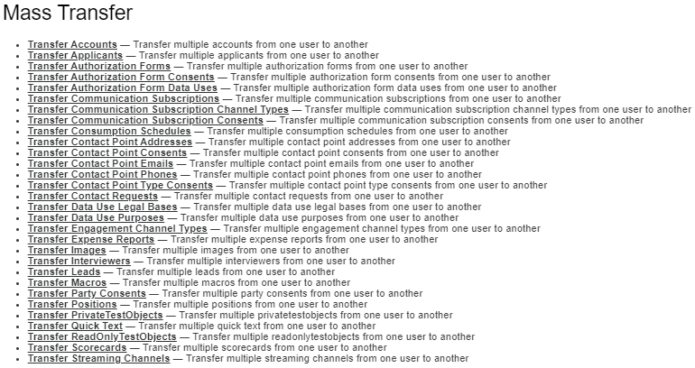</p>

Once we've selected an object from this page, we can optionally filter the records by field value criteria as well as the user or queue who currently owns the records on the following screen. This is also where we select the user or queue to which we are transferring ownership, as shown in the below picture.

<p align="center">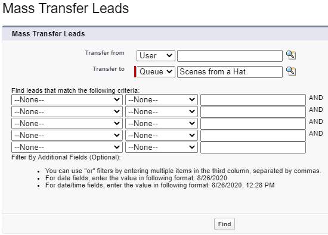</p>

After clicking the `Find` button, a table of records similar to the following one will display all records that match our criteria. We can then select the records we wish to transfer and click the `Transfer` button (surrounded by the red rectangle).

<p align="center">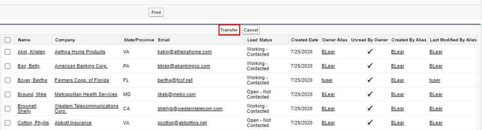</p>

### Mass Delete

`Mass Transfer` isn't the only bulk tool in our arsenal - we also have the `Mass Delete` feature. This device is particularly useful if we make an error on the field values for records that we import (we'll get to data import tools shortly) or we simply want to free space by removing old records from our org that we've already backed up in an external system.

Found at `Setup` | `Data` | `Mass Delete Records`, the feature allows us to delete up to 250 records of the Account, Lead, Activity, Contact, Case, Solution, or Product objects or up to 250 reports at once so long as we have the `Modify All Data` permission. Note that any related children records will also be deleted.

Let's take a look at the page, as shown by the following image.

<p align="center">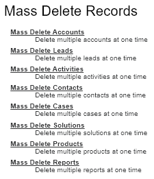</p>

After selecting an object, we'll be directed to a screen (displayed by the next picture) where we'll optionally choose the field criteria to filter the records and click the `Search` button once we've made our selections. Note that we can choose to permanently delete the records by selecting the checkbox surrounded by the red rectangle when selecting records from the results before clicking the `Delete` button.

<p align="center">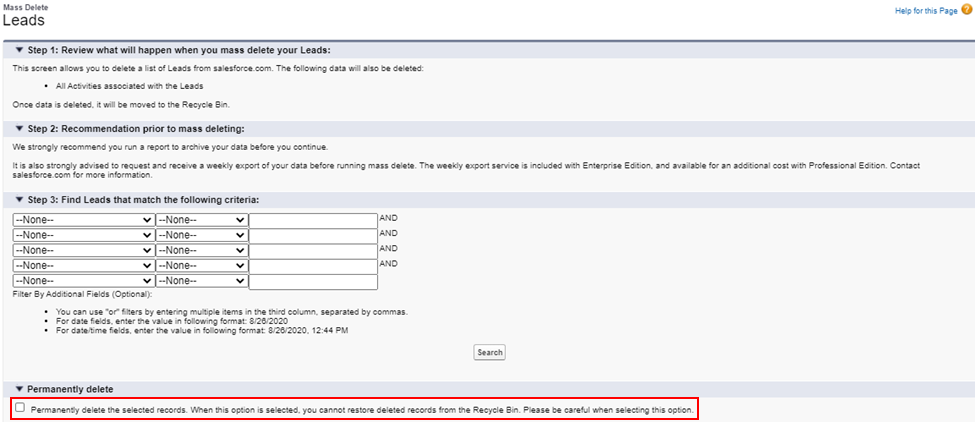</p>

### The Recycle Bin

If we choose not to permanently delete the records, they'll go where all soft-deleted records go - the recycle bin. We can get to our recycle bin by searching for the `Recycle Bin` tab (shown below) in App Launcher.

<p align="center">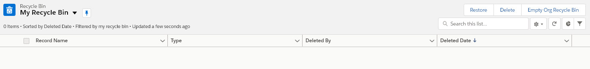</p>

While soft-deleted records (i.e. those in the recycle bin) don't count against our org's regular storage limit, the storage size of the bin is based on the storage size of our org. Once we soft-delete a record, it will stay in the recycle bin for up to 15 days or until we permanently delete it by selecting the record(s) and the `Delete` button in the image below. Alternatively, we can restore the record with the `Restore` button.

If we have the `Modify All Data` permission, we'll be able to switch the list view to `Org Recycle Bin` and view the records that other users deleted, choosing to delete or restore individual records or groups of records with the `Delete` and `Restore` buttons, respectively. Alternatively, we can completely purge the recycle bin by selecting the `Empty Org Recycle Bin` button.

### Data Import and Export Tools

Salesforce has a robust set of data import and export tools so that we don't have to manually enter records from another system into our org or vice versa. Let's begin our exploration of these tools with `Data Import Wizard`.

#### Data Import Wizard

Located at `Setup` | `Integrations` | `Data Import Wizard`, this feature allows us to import as many as 50,000 records at a time. Not all standard objects are supported (only Account, Contact, Lead, Solution, Campaign Member and person account records can be imported), but every custom object is.

Of course, just like with any feature in Salesforce, a user must have certain permissions to be able to use `Data Import Wizard`. The following table displays the permissions needed to import records for each available object.

| Object | Object Permissions Needed | Other Permissions Needed |
| ----- | ---- | ---- |
| Account and Contact | Read, Create, Edit | Modify All Data (for records owned by others) or Import Personal Contacts |
| Lead | Read, Create, Edit | Import Leads |
| Solution | Read, Create, Edit, Delete | Import Solutions |
| Custom Objects | Read, Create, Edit | Import Custom Objects or Modify All Data |

In addition, users must have read and edit access to any field that they wish to populate, as well as having that field on their assigned page layout. As admins, we already have the necessary permissions to use `Data Import Wizard` and we have the `Edit Read Only Fields` permission, so we only need to have read access to any fields to which we wish to give values.

Let's demonstrate the use of Data Import Wizard by importing some records of a custom object to our org. To setup this example, we've created a custom object named `NHL Player`, added a master-detail relationship from this object to `Account` named `Team`, and added a text field named `Position` to the custom object. In addition, we've created an account record with the name `Pittsburgh Penguins`.

Let's take a look at the first few lines of our import file (the full import file can be found [here](<./example_files/penguins.csv>)):

```csv
Account,Name,Position
Pittsburgh Penguins,Anthony Angello,F
Pittsburgh Penguins,Zachary Aston-Reese,F
```

This file format is known as CSV, or comma-separated values, and it's what we'll use for all of our data import tools. The first line of our file contains column headers, which are required and will be used later to match our data to object fields.

Let's get started by clicking the `Launch Wizard!` button on the `Data Import Wizard` page (shown below).

<p align="center">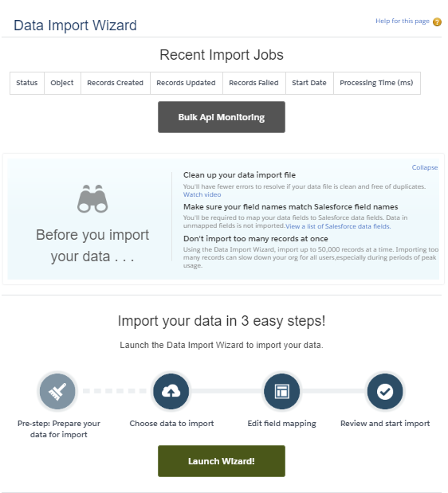</p>

After we've launched the wizard, we'll be directed to a page similar to the following image, where we've chosen NHL Players from the `Custom objects` tab in the `What kind of data are you importing?` column. We've also selected `Add new records` in the `What do you want to do?` column and chosen `Account Name` for the field that we'll use to match the master in the master-detail relationship to the Account object. While we could use use external Id fields to match the
relationship (and we will later with `Data Loader`), our current method requires less setup.

<p align="center">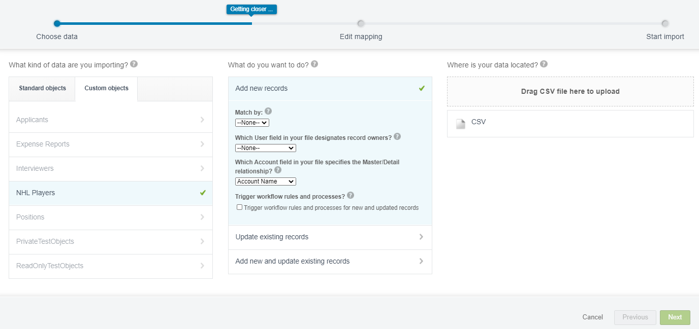</p>

Before we move on, let's point out a few other features of the wizard. We can choose to run workflow rules, processes, and record-triggered flows on the records that we import by selecting the `Trigger workflow rules and processes for new and updated records` checkbox, but we are not required to run these automation tools on our imports and they do not run by default on `Data Import Wizard` imports.

In addition, this tool gives us duplicate prevention when we select a unique field under the `Match by:` dropdown. If a record in our org and one of our imports have the same value for this field, the existing record will be updated and a new record _will not_ be created (even if we've chosen the `Add new records` option).

Now, let's drag our CSV file to the `Where is your data located?` column and click the `Next` button (in the bottom right corner of the page in the above image). This takes us to the mapping screen, displayed below:

<p align="center">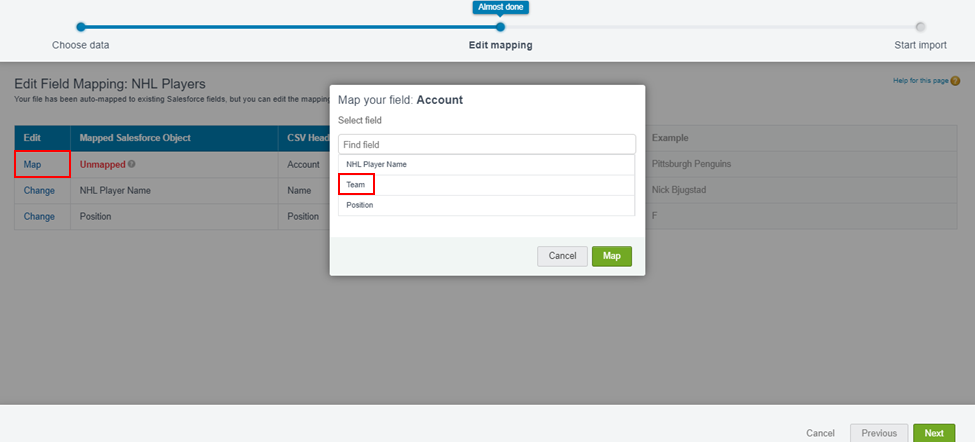</p>

The wizard was able to automatically connect our `Name` and `Position` columns to the fields with the same labels, but we still have to map the relationship field. When we click the `Map` button in the first row of the table (surrounded by the leftmost red rectangle in the above image), the displayed popup appears. Here, we can select the `Team` field and click the `Map` button.

Note that we do not have to map every column in our file to a field, but any unmapped columns will be ignored (i.e. not imported to our org). Upon clicking the `Next` button, we will be taken to a screen where we can review our choices and click `Start Import` to import the records.

After the job has started, we can go to `Setup` | `Environment` | `Jobs` | `Bulk Data Load Jobs` or click the `Bulk Api Monitoring` button on the `Data Import Wizard` page to check its progress.

We can only perform one job with the import wizard at a time. In addition, any users without access to the `Setup` menu that have access to `Data Import Wizard` will have to access the tool from their user settings. This can be done by clicking the avatar (enclosed in the rightmost red rectangle in the following image), `Settings` (enclosed in the second from the right red rectangle), and clicking `Data Import Wizard` (surrounded by the leftmost red rectangle) from the left sidebar on the resulting page.

<p align="center">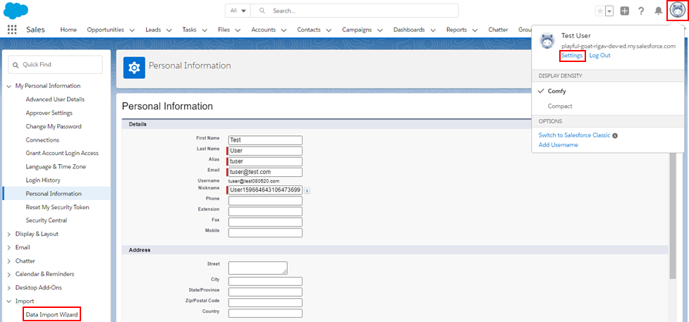</p>

#### Data Loader and External Id Fields

When we want to import more than 50,000 records at a time, import records of an object that `Data Import Wizard` does not support, schedule imports, export data, or perform other operations, we can turn to `Data Loader`, which supports all objects. Found at `Setup` | `Integrations` | `Data Loader`, this feature is a separate client we must download locally. Once downloaded, the tool will allow us to work with up to 5,000,000 records at once.

After selecting the appropriate download link and following the related instructions, we can open the application, which will take us to the following start menu:

<p align="center">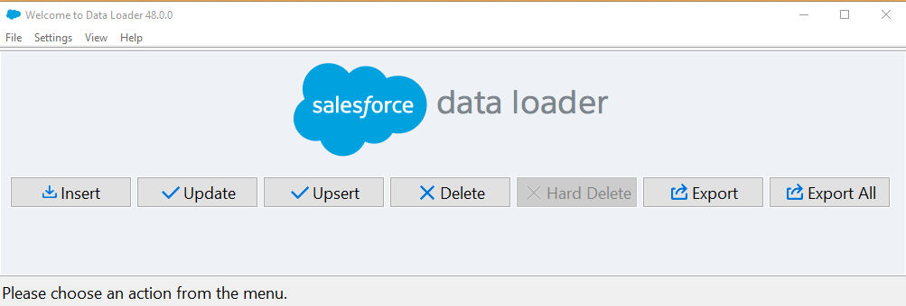</p>

This tool allows us to take one of seven actions: `Insert`, `Update`, `Upsert`, `Delete`, `Hard Delete`, `Export`, and `Export All`, the first four of which are analogous to the DML statements of the same name.

We'll demonstrate its use shortly, but first let's perform some setup in our org. Because we're going to import records of our NHL Player object, we'll need to make an external Id field on the Account object.

External Id fields are used to hold primary keys or other unique values that identify our records in external systems. They preserve relationships across data migrations and prevent the creation of duplicate records by identifying those that are already in our org through matching external Id values.

Once we've started the field creation wizard with a `Text` field data type, we can select the `External ID` checkbox that's surrounded by the red rectangle in the following screenshot.

<p align="center">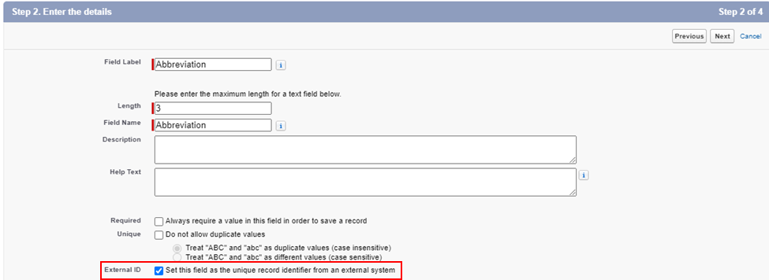</p>

After we've created the field, we'll create a new account with the name `Tampa Bay Lightning` and an abbreviation/external Id of `TBL`. We're almost ready to import, but let's first take a look at the first few lines of our import file (the full file can be found [here](<example_files/lightning.csv>)):

```csv
Account,Name,Position
TBL,Zach Bogosian,D
TBL,Erik Cernak,D
```

Because we've included the external Id of our desired account, we'll be able to successfully import our records as details of the `Tampa Bay Lightning` record. In order to use this external Id field, we'll need to choose the `Upsert` operation in the `Data Loader` menu because `Insert` doesn't support external Ids.

After clicking an operation, we'll first be prompted to login to our org and click `Allow` to enable `Data Loader`, then we'll select the object whose records we're importing, browse, and select the CSV import file, as we've done in the following image.

<p align="center">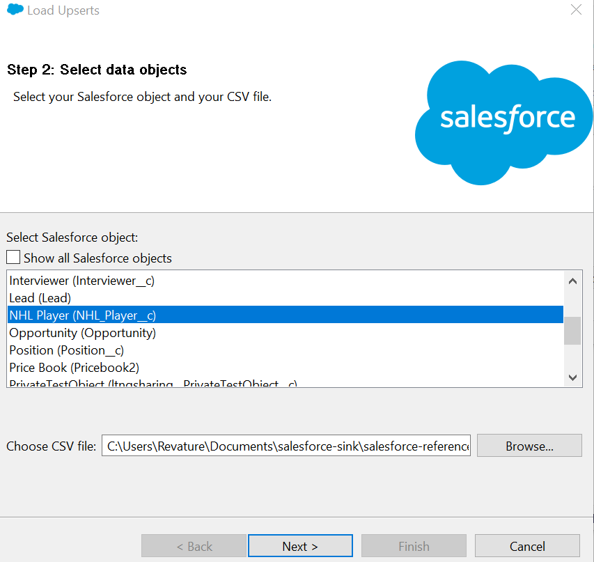</p>

After clicking `Next >`, we'll be prompted to select a field to match existing records so that `Data Loader` knows which records to update and which records are not in our org and therefore need to be inserted. However, because we haven't defined any external Id fields on our NHL Player object, the `Id` field is the only field available for matching. So we'll just click `Next >` again, which takes us to the following screen:

<p align="center"></p>

Here, we've chosen our external Id field that we put on the Account object (`Abbreviation__c`) to match the appropriate record as the master of our imports. After clicking `Next >` again, we'll map our fields for import in `Step 3`, shown below.

<p align="center">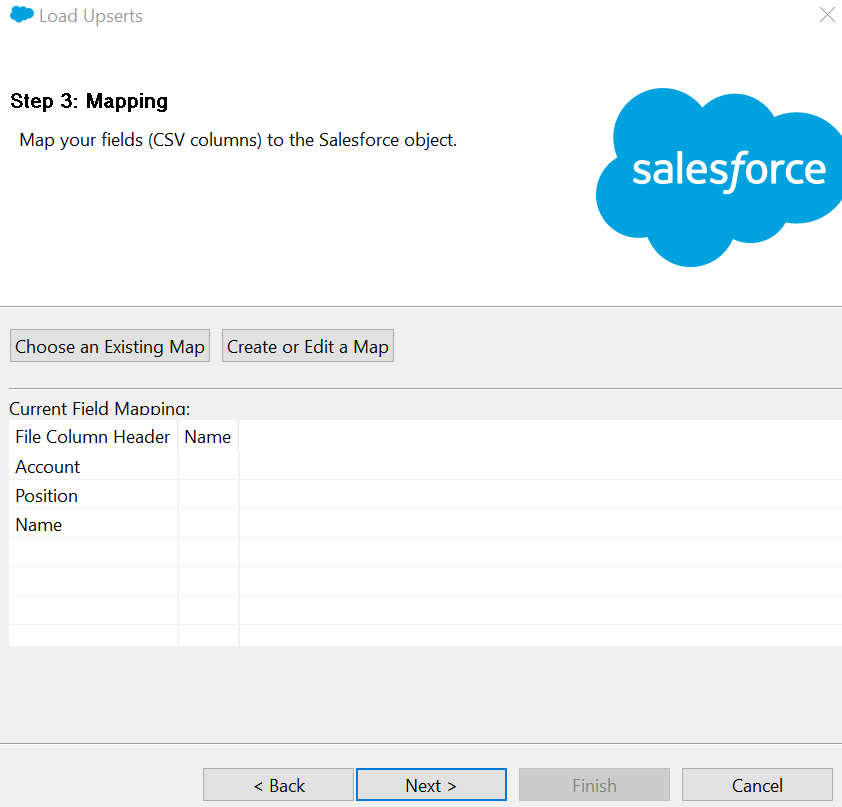</p>

`Data Loader` allows us to save field mappings, so we can use the `Choose an Existing Map` button and select our mapping file to automatically apply our selections. If we don't have an existing map, we can choose the `Create or Edit a Map` button, which will open the following popup:

<p align="center">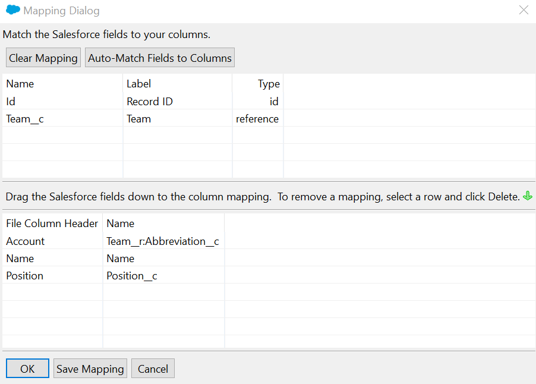</p>

In the above image, we've already clicked the `Auto-Match Fields to Columns` button. This button automatically mapped the `Name` and `Position` columns, so we only needed to drag the `Team__r:Abbreviation__c` field to the `Account` column. If we wish to reuse this mapping at a later date, we can click the `Save Mapping` button and save it as an `.sdl` (Salesforce Data Loader) file.

Once we click `OK` and `Next >`, we finish the wizard by selecting where our error and success CSV files will be saved before clicking `Finish` and `Yes` on the resulting popup to begin the import. Each import or delete operation we perform with `Data Loader` will generate these CSV files, which we can use to find why any failures occurred and fix the mistakes. Note that we didn't have the option to choose to run workflow rules and processes because those tools will always run for imports performed using `Data Loader`.

Because the Penguins couldn't even beat the Canadiens in the Stanley Cup Qualifiers, let's delete them from our org using `Data Loader`. In order to delete the records, we'll first need their Ids, so we'll start by performing an export operation. When exporting the records, we can select either `Export` or `Export All`, the difference between the two being that `Export All` will also export soft-deleted records.

After choosing the `Export` button, we'll first select the object whose records we're retrieving and a location and filename for the CSV file that will hold the results, as we've done in the following image.

<p align="center">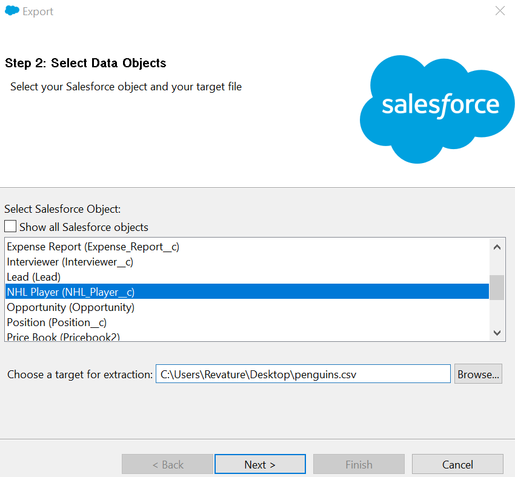</p>

On the next screen (shown below), we'll determine the records to export by constructing a SOQL query using declarative tools, manually entering values, or both.

<p align="center">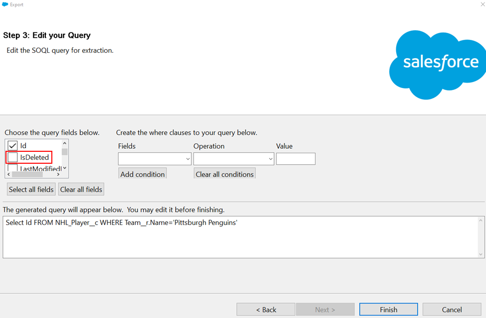</p>

We can declaratively choose our desired fields by selecting them from the `Choose the query fields below.` list or manually enter them in the text box. In addition, we can filter the records using the `Create the where clauses to your query below.` dropdowns. However, the condition we're using in the above query is more complex than those tools can construct, so we simply wrote it in the text box manually.

Take special note of the `IsDeleted` field (surrounded by the red rectangle) - if we had chosen the `Export All` operation instead, we could use the value of this system field to figure out which retrieved records were soft-deleted and which were not. Once we've clicked the `Finish` button, we'll be ready to start our delete operation.

After choosing `Delete`, we'll select the object whose records we want to delete and the CSV file holding the Ids of those records, as we've done in the image below.

<p align="center">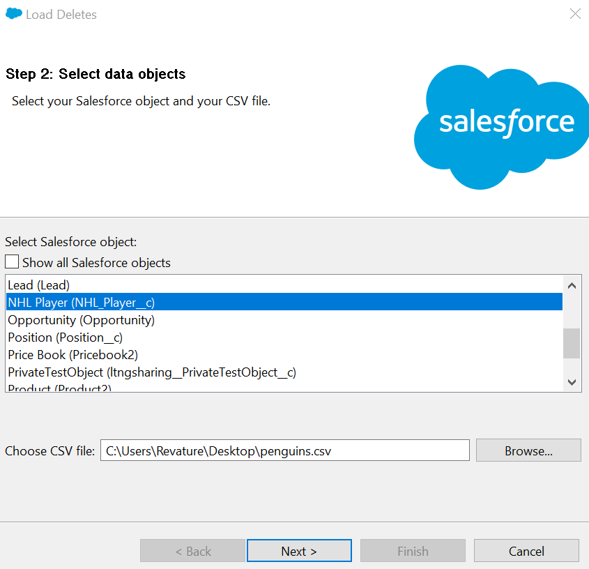</p>

Once we click `Next >`, we'll map the Id field in a similar manner to what we did when upserting data before clicking `Next >` again. Then, on the final step, we'll choose the directory that will hold our success and error CSV files and click `Finish` and `Yes` on the resulting popup to begin the job.

After our job has finished, the now soft-deleted records will be in our org's recycle bin. Had we wanted to bypass the recycle bin and permanently delete the records, we would have used the `Hard Delete` operation instead. To enable this option, we must have the `Bulk API Hard Delete` permission. We'll also need to select `Settings` under the `Settings` menu in the `Data Loader` window and choose the `Use Bulk API` checkbox (surrounded by the red rectangle in the following image). Because the save button is located offscreen, we'll need to hit the `Enter` key for our selection to persist.

<p align="center">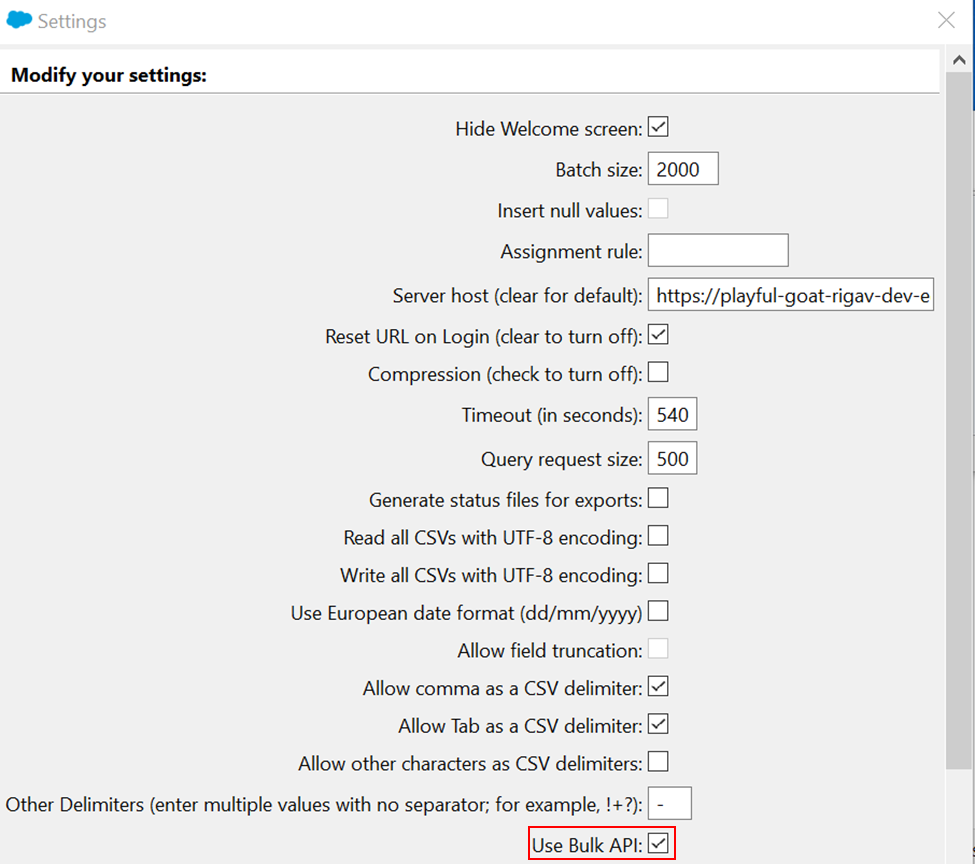</p>

We must enable Bulk API usage because `Data Loader` uses the SOAP API by default. While the SOAP API will work for most of our use cases, the Bulk API will generally be more efficient because of its implementation (which includes the use of parallel processing).

Any user who wants to use `Data Loader` must have the `API Enabled` permission and the object permissions required for the operation they wish to perform, shown in the following table.

| Operation | Object Permissions Needed |
| -- | -- |
| Insert | Read, Create |
| Update | Read, Edit |
| Upsert | Read, Create, Edit |
| Delete and Hard Delete | Read, Edit, Delete |
| Export and Export All | Read |

Finally, the Windows installation of `Data Loader` includes a CLI that we can use to automate operations, such as regular data exports.

#### Third-Party Tools

If we need to interact with more than 5,000,000 records at a time, we can turn to external tools such as `dataloader.io`. These tools use the Salesforce APIs to interact with our data and have no strict upper limit on the number of records we can declaratively import, export, or delete. For instance, `dataloader.io`, which we can get to by clicking the link in `Setup` | `Integrations` | `Dataloader.Io` or navigating to `dataloader.io` in our web browser, only limits record numbers based on how much we're willing to pay - if we choose the Enterprise option, there is no record limit.

#### Data Export Service

As we've seen, `Data Loader` and third-party tools such as `dataloader.io` allow us to export records. But we can also use `Data Export Service`, found at `Setup` | `Data` | `Data Export`, up to once per week. To perform a weekly export, we click `Export Now` on the data export page. If we wish to schedule a weekly or monthly export, we click `Schedule Export` on the same page.

Upon clicking either option, we'll be prompted to select the object(s) whose records we wish to export and begin the process. When the job is complete, we'll receive an email and be able to revisit the data export page to download an archived directory of CSV files.