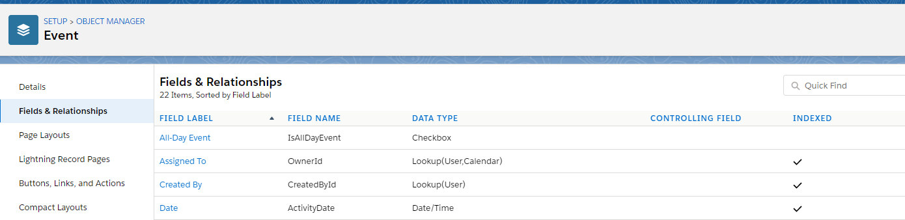
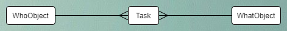
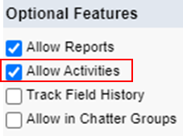
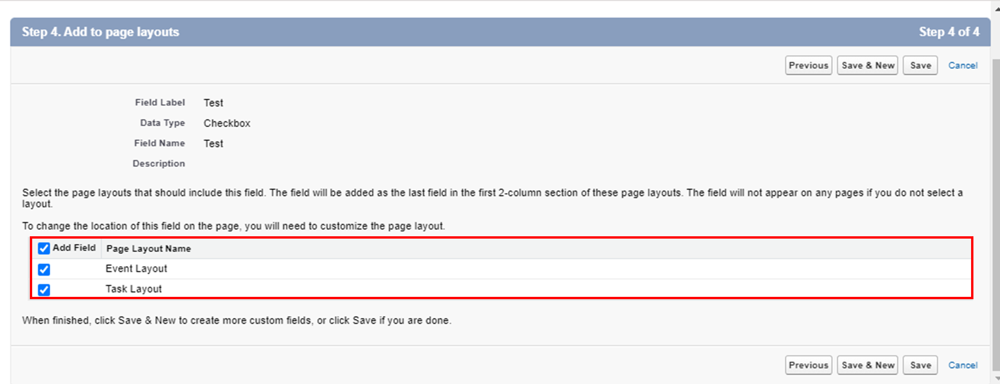
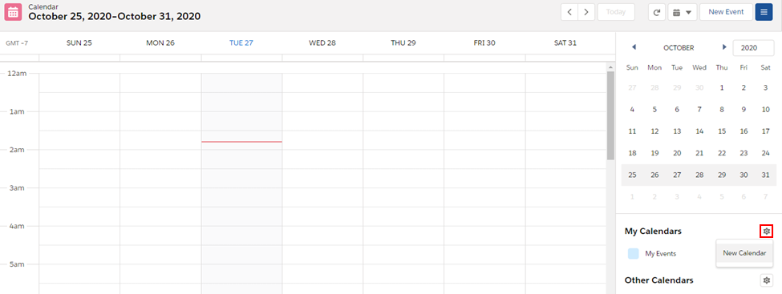
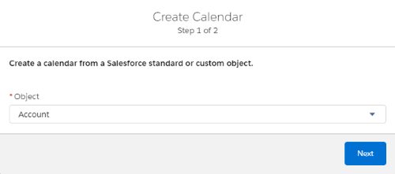
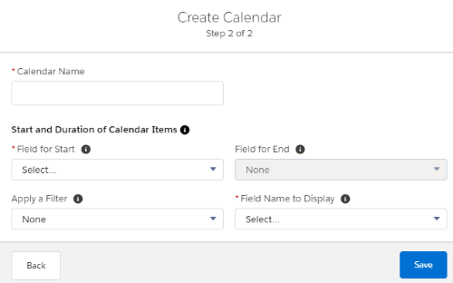
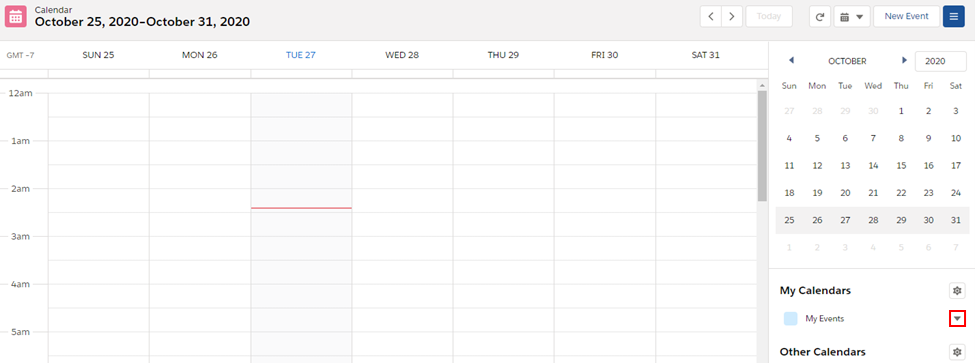
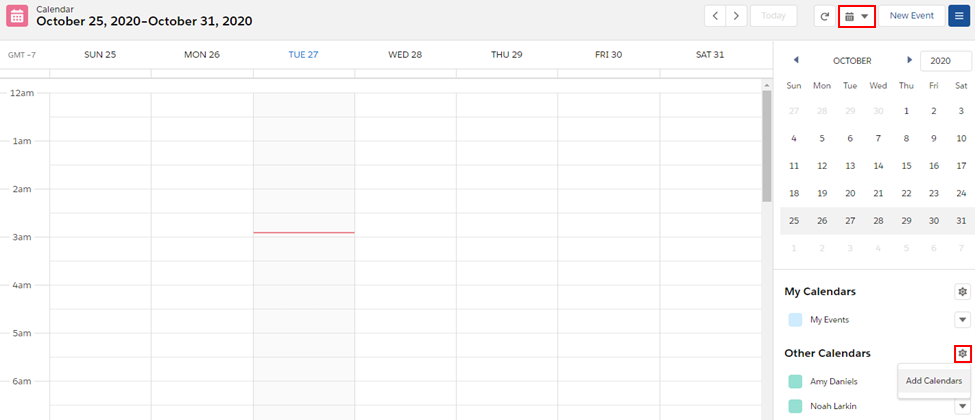
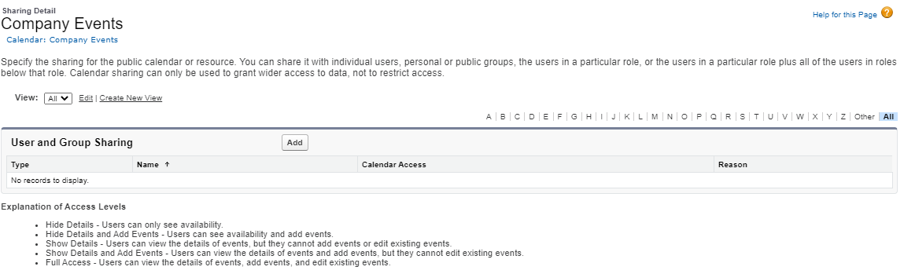

# Module - Activities

This module introduces the types of activites in Salesforce, how they're managed, and how they're viewed.

## Table of Contents

* [Why Be Normal](#why-be-normal)
* [Tasks and the User Interface](#tasks-and-the-user-interface)
* [Events and the User Interface](#events-and-the-user-interface)
* [Calendars](#calendars)
    * [Object Calendars](#object-calendars)
    * [Sharing Calendars](#sharing-calendars)
    * [Availability View](#availability-view)
    * [Public and Resource Calendars](#public-and-resource-calendars)

### Helpful References/Links

* [Task and Event Objects (Object Reference for Salesforce and Lightning Platform)](https://developer.salesforce.com/docs/atlas.en-us.object_reference.meta/object_reference/sforce_api_erd_activities.htm)
* [Event (Object Reference for Salesforce and Lightning Platform)](https://developer.salesforce.com/docs/atlas.en-us.object_reference.meta/object_reference/sforce_api_objects_event.htm)
* [Task (Object Reference for Salesforce and Lightning Platform)](https://developer.salesforce.com/docs/atlas.en-us.object_reference.meta/object_reference/sforce_api_objects_task.htm)
* [Create custom fields for Tasks or Events (Salesforce Knowledge Article)](https://help.salesforce.com/articleView?id=000335522&language=en_US&type=1&mode=1)
* [Start Using Tasks (Salesforce Help)](https://help.salesforce.com/articleView?id=creating_tasks.htm&type=5)
* [Today's Tasks and list views in Lightning Experience (Salesforce Knowledge Article)](https://help.salesforce.com/articleView?id=000316467&language=en_US&type=1&mode=1)
* [Standard Lightning Page Components (Salesforce Help)](https://help.salesforce.com/articleView?id=lightning_page_components.htm&type=5)
* [Manage Events in Lightning Experience (Salesforce Help)](https://help.salesforce.com/articleView?id=viewing_events_lex.htm&type=5)
* [Access the Tasks and Events list views (Salesforce Knowledge Article)](https://help.salesforce.com/articleView?id=000326316&type=1&mode=1)
* [Guidelines for Tracking Activities (Salesforce Help)](https://help.salesforce.com/articleView?id=activities_view.htm&type=5)
* [Calendar Views in Lightning Experience (Salesforce Help)](https://help.salesforce.com/articleView?id=activities_using_calendar_icons_lex.htm&type=5)
* [Use Calendars to Track and Visualize Dates in Salesforce Objects in Lightning Experience (Salesforce Help)](https://help.salesforce.com/articleView?id=calendar_create_examples.htm&type=5)
* [Sharing Default Access Settings (Salesforce Help)](https://help.salesforce.com/articleView?id=sharing_model_fields.htm&type=5)
* [Find a Time That Works for Everyone in Availability View (Salesforce Winter '20 Release Notes)](https://releasenotes.docs.salesforce.com/en-us/winter20/release-notes/rn_sales_productivity_calendar_availability_view.htm)
* [Create and Manage a Public Calendar or a Resource Calendar (Salesforce Help)](https://help.salesforce.com/articleView?id=customize_groupcal.htm&type=5)

## Why Be Normal

Salesforce can be a strange beast, and in our explorations of the platform in these lecture notes, we try to be as expansive and exhaustive as possible when detailing with these oddities. One of the most bizarre Salesforce configuration choices made is the construction of the activity data model and how we interact with it.

Because we've developed that habit of going more in depth with the material than is necessary, we'll continue to do so in this module, particularly in explaining said data model and how configure activity objects. However, note that this is to provide extra background (and, arguably, an example of bad design choices) - the Administrator certification will not require the level of detail we're about to give.

Alright, now that we've got our disclaimer out of the way, let's quickly define the two types of activities in Salesforce, tasks and events, before we get into the particulars. Tasks are like sticky notes or members of a to do list - they have a set due date or time that they need to be completed by and serve to give users reminders of what they need to accomplish. For example, a user might be assigned a task to send a welcome email to a new lead or notify a customer of a quote price. Events, on the other hand, have a start and end time and include activities such as meetings and conferences - commitments that we would include on our calendars.

Well that's simple enough: we just have two more standard objects to work with: `Task` and `Event`. Like all standard objects, these two come with standard fields. If we need some additional information, such as a video call link for a meeting, we can just create a custom field by navigating to `Setup` > `Object Manager`, choosing the appropriate object (`Event` in this case), clicking `Fields & Relationships` from the left sidebar, and ....

Oh, there doesn't seem to be a `New` button to create a custom field. Can we not create custom fields for activities? Well actually, we can - we just need to navigate to a different place. Let's take a look at an ERD involving the `Task` object to begin our explanation.

And the analogous ERD for the `Event` object:

As we can see, the first and second diagrams are identical (with the exception of `Event` replacing `Task`) because of two particular relationship fields that both of these activity objects have. The first is the `WhatId`, holding the ID of the non-human object that the activity is related to, such as the `Contract` whose quote needs to be calculated.

Instead of listing each of the possible objects that we can relate through this field, we've collectively represented them by the `WhatObject` in our diagrams. We've done so because there's a sizeable amount of objects to list - the `WhatId` field can hold the record ID of an `Account`, `Asset`, `Campaign`, `Case`, `Contract`, `Opportunity`, `Product2`, `Solution`, or custom object record (or a record of a few other, less commonly used standard objects) provided that, in the case of the custom object, activities have been enabled. 

To enable activities for a custom object, we simply select the `Allow Activities` checkbox (surrounded by the red rectangle in the following image) in the `Optional Features` section of the object creation or edit page. Note that if we are editing an object to allow activities where it didn't before, we'll have to manually add the activities related lists to that object's page layouts.

Let's move on to the second relationship field on both of our activity objects, `WhoId`, which is used if the related record is one of a human object (i.e. a `Contact` or `Lead`), such as the new lead whose inbox is desparately waiting for that welcome email. Again, rather than including both of these possible person objects in our illustrations, we've collectively represented them by the `WhoObject`.

From what we've seen so far, the `Task` and `Event` objects seem to function largely the same. With this thought in mind, it's possible to contort ourselves enough that we get why Salesforce made the choices they did when determining how we configure these objects. Let's revisit that issue of creating custom fields to see the result of those decisions.

To create a custom field for `Task` or `Event`, we navigate to `Setup` > `Object Manager` > `Activity` > `Fields & Relationships` and click `New`. We'll then walk through the field creation wizard as normal, but the last step will look a little different.

As the red rectangle in the above image highlights, we can't add these fields to some sort of activity layout. Rather, the page layouts we can add them to are those for the `Event` and `Task` objects. So if we want to create custom field for either of these objects, we'll need to navigate to `Activity` in `Object Manager`.

So is `Activity` an object? Well... erm... sort of? As we've just witnessed, `Activity` acts like a wrapper for `Task` and `Event`, holding the custom fields for both. But there is no `Activity` object available to query or hold custom buttons, links, actions, validation rules, or triggers.

That being said, if we're migrating customizations between orgs through the `Metadata API`, we'll have to retrieve `Activity` as an instance of the `CustomObject` metadata type (in addition to either or both of the `Task` and `Event` `CustomObject` instances) to migrate the custom fields we've created for tasks and/or events. There are some standard report types for events and tasks, but if we want to create a custom report type, we'll have to do so with `Activities` as the "primary object."

Like we've said before: Salesforce makes the rules, so with standard features, they get to choose the set of rules by which they play.

## Tasks and the User Interface

Tasks are, by default, assigned to the user who created them. However, this default can be changed not only when creating a task, but also when it's later modified by any user who has the appropriate permissions. Such a user has the `Edit Tasks` system permission and is either currently assigned to the task or can view, edit, and delete it through the avenues laid out in the `Security & Access` module.

If we are assigned a task, it will show up in a variety of places including the `Today's Tasks` component on default Lightning home pages. This component displays the first five tasks assigned to the viewing user that are due on the current day. Tasks also appear in the variety of list views on the `Tasks` tab, as well as reports created from the `Tasks and Events` standard report type, one of the litany of standard activity report types, or a custom activity report type.

If a task is not completed, past its due date, and related to an opportunity that is not `Closed Won` or `Closed Lost`, an alert will show up on the `Kanban` view on the `Opportunity` tab. A similar alert will appear if an opportunity that is not `Closed Won` or `Closed Lost` has no incomplete activities.

Tasks of all sorts can be seen on record pages because we can create or edit tasks using the `Activity` standard component that is included by default on the Lightning record pages of the standard objects we mentioned earlier (`Account`, `Asset`, `Campaign`, `Case`, `Contact`, `Contract`, `Lead`, `Opportunity`, `Product2`, and `Solution`) and those of a custom object that has activities enabled. This component also has a `New Task` tab to create tasks.

Record pages also show tasks through the `Chatter` standard Lightning component that displays updates to related tasks and is included by default on any object that can have tasks and has Chatter `Feed Tracking`. Lastly, tasks can be viewed on calendars, a subject we'll discuss later in this module.

## Events and the User Interface

Just like tasks, events are owned by the user who creates them by default. They can be modified by any user who has the `Edit Events` permission and is either the event owner or has view, edit, and delete access to the record through the sharing model. If we need to have an event that lasts more than 24 hours, we can make a multiday event by simply ensuring that the start and end are more than one day apart (the setting needed to create multiday events, `Enable Multiday Events`, is selected by default).

Once we've created either a single or multiday event, we see it in a variety of places similar to those that show tasks. For example, the `Today's Events` standard Lightning component that is included on Lightning home pages by default shows the next five scheduled events for the current day.

As with tasks, events display on the `Chatter` and `Activity` standard Lightning components on Lightning record pages for all objects that events can be related to (the latter component also includes a `New Event` tab to create events). Events can also be seen in reports made from either the `Tasks and Events` or `Events with Invitees` standard report types, one of the standard report types associated with `Activities`, or a custom report type with `Activities` as the "primary object."

Lastly, we can not only view, but also create events from the `Calendar` tab by clicking the `New Event` button.

## Calendars

Let's conclude this module by talking about a subject that's gotten a few mentions so far: calendars. When we visit the `Calendar` tab, we see the standard, premade `My Events` calendar that consists of `Event` records that we own. While Salesforce calendars, such as this standard example, allow us to view upcoming tasks and events, they also have many capabilities beyond those basic functions, so let's dive in.

### Object Calendars

While we have the default `My Events` calendar, we can create custom calendars based off of a date field on an object that will display the records of the object based on their value for said field. To do so, we first navigate to the `Calendar` tab, click the gear icon surrounded by the red rectangle in the following image, and select `New Calendar`.

This will cause the following popup to appear where we first choose the object that the calendar will be associated with and click `Next`.

On the second screen of the wizard (shown below), we enter a name for the calendar, choose the date field that determines the start of a record on the calendar, choose the field that displays as the title for members of the calendar, and optionally filter the records and choose the date field that determines the end of a record on the calendar.

### Sharing Calendars

We can also interact with other users' calendars and view their schedules, but discussing this capability further requires us to talk about the unique OWD options available for the `Calendar` standard object.

The default calendar OWD is `Hide Details and Add Events`, which allows us to add events to a another users' calendar, but shows only shows the start and end times of any existing commitments those users have, with `busy` as the label for existing events and no other information provided. This setting is a step above the `Hide Details` OWD, which doesn't allow us to add events to another users' calendar nor see information about their events beyond the start and end times.

The `Show Details` setting also doesn't allow us to add events to other users' calendars, but it does give the ability to view all information about those users' existing commitments (i.e. not just the start and end times). `Show Details and Add Events` is the final and least restrictive OWD, allowing us to see all information about other users' existing events and add new events to their calendars.

Depending on the OWD we've chosen, we may be able to share our calendars with others in the org. To do so, we can simply click the &#9660; button surrounded by the red rectangle in the following screenshot.

In the resulting popup, we choose the user(s) we would like to grant access to and select the `Share` button. The table below lists the access levels that we can give when manually sharing a calendar, depending on the OWD chosen for the `Calendar` standard object. Note that we cannot select the `Hide Details` access level when sharing a calendar because this is the most restrictive - every user, regardless of our OWD already has at least this much access. We also can't share if the OWD for calendars is `Show Details and Add Events` because users will already have the most permissive level of access we can grant.

| OWD | Hide Details and Add Events | Show Details | Show Details and Add Events |
| --- | --------------------------- | ------------ | ---------------------- |
| Hide Details |  |  |  |
| Hide Details and Add Events | | |  |
| Show Details | | |  |

### Availability View

Regardless of the level of access we have to other users' calendars, we can still see if they're busy at a given time for the purpose of scheduling events that include them. To do so, we first need to add the relevant calendars to our `Calendar` tab by selecting the gear button surrounded by the bottom red rectangle in the below screenshot and `Add Calendars`.

On the resulting popup, we can choose the type of calendar we'd like to add to our view (person calendars or public and resource calendars) and click `Add`. Once we've added the calendars we'd like to compare, we can select the calendar icon surrounded by the top red rectangle in the above image and choose the `Availability` view.

We'll then be able to juxtapose each of the calendars on a given day to schedule events that don't conflict with prior commitments.

### Public and Resource Calendars

The final calendar features we'll discuss are the public and resource calendars. Public calendars are generally used for company- or department-wide events such as meetings or social events. Resource calendars, on the other hand, are used to denote the availability of materials shared across departments or the entire company, such as a conference room.

To create either of these types of calendars, we navigate to `Setup` > `Company Settings` > `Calendar Settings` > `Public Calendars and Resources`. Once there, we click the `New` button in our desired section (either `Public Calendars` or `Resources`). On the next screen, we provide a name for the calendar and select the `Active` checkbox (which must be selected for users to interact with the calendar).

After we click `Save`, we'll be taken to a `Calendar Detail` page where we can select the `Sharing` button to navigate to a `User and Group Sharing` page similar to the image below. Note that we can also arrive at this page by clicking the `Sharing` link next to the name of the calendar on the `Public Calendars and Resources` page.

Choosing the `Add` button will take us to a screen where we can provide access to individual users, those holding a specific role (and optionally their subordinates), and/or public groups. When providing this access, we can choose from one of five levels: `Hide Details`, `Hide Details and Add Events`, `Show Details`, `Show Details and Add Events`, and `Full Access`.

This new, final access level allows users to not only see information about the events included in the public or resource calendar and create events, but also edit existing events on the calendar. If a user hasn't been given at least `Hide Details` access, they won't be able to see any events on the calendar (let alone create or edit them).
