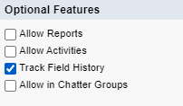
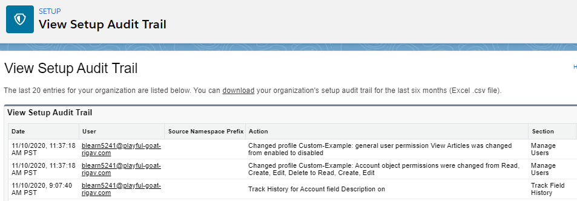

# Module - Auditing

This module introduces the tools Salesforce offers for auditing changes to both metadata and data.

## Table of Contents

* [Paperwork](#paperwork)
* [Field Tracking](#field-tracking)
    * [Field Audit Trail](#field-audit-trail)
* [Setup Audit Trail](#setup-audit-trail)

### Helpful Links/References

* [Field History Tracking (Salesforce Help)](https://help.salesforce.com/articleView?id=tracking_field_history.htm&type=5)
* [StandardObjectNameHistory (SOAP API Developer Guide)](https://developer.salesforce.com/docs/atlas.en-us.api.meta/api/sforce_api_associated_objects_history.htm)
* [Using Relationship Queries with History Objects (SOQL and SOSL Reference)](https://developer.salesforce.com/docs/atlas.en-us.soql_sosl.meta/soql_sosl/sforce_api_calls_soql_relationships_query_hist.htm)
* [Field Audit Trail (Salesforce Help)](https://help.salesforce.com/articleView?id=field_audit_trail.htm&type=5)
* [Monitor Setup Changes with Setup Audit Trail (Salesforce Help)](https://help.salesforce.com/articleView?id=admin_monitorsetup.htm&type=5)

## Paperwork

Your author's dad was an administrator at a Pennsylvania state prison before he retired. One of his duties was being the lead in preparing for the prison's yearly audit and it was.... not his favorite time of the year to say the least. Auditing is, in your author's humble opinion, fairly boring, so why do it?

Well it may be legally required depending on our industry. For example, healthcare companies have to keep records for at least seven years to comply with federal law. But it's also good for our own purposes - we may want to see how, e.g., certain characteristics of an opportunity predict our ability to close and win it. Throughout this module, we'll detail Salesforce's auditing tools for both metadata and data. As an added bonus, because we only need to perform a brief amount of setup and we're off and running, there's no boring record keeping to manually carry out.

## Field Tracking

The first tool in our auditing arsenal is `Field History Tracking`. This feature allows us to track the changes made to particular fields on certain standard objects (including frequently used ones such as `Account`, `Asset`, `Campaign`, `Case`, `Contact`, `Contract`, `Entitlement`, `Lead`, `Opportunity`, `Order`, `Order Product`, `Price Book Entry`, and `Product`) and all custom objects.

To enable `Field History Tracking` on a capable standard object, we navigate to `Setup` > `Object Manager`, select the name of the standard object, choose `Fields & Relationships` from the left sidebar, and select the `Set History Tracking` button. On the following screen, we'll select the `Enable StandardObject History` (e.g. `Enable Contact History`) checkbox, make our selections from the resulting available fields, and click `Save`. We may see some fields in a `Track changes only` section instead of `Track old and new values` - we'll explain the reason behind that shortly.

To enable `Field History Tracking` for a custom object, we first select the `Track Field History` checkbox in the `Optional Features` section of the object creation/edit screen (pictured below). After that, we navigate to `Fields & Relationships` for the object and select `Set History Tracking`. From there, the process is the same as for standard objects, except there is no enable history checkbox to select because we've already performed that configuration when setting up the object.

Once enabled, changes to tracked fields will display in the `History` related list for the given object (e.g. `Account History`). Note that we'll have to manually add this related list to page layouts - even if we enable history tracking when _creating_ a custom object, the list won't be automatically added to the page layouts for us.

The related list displays the date and time of the change, the user who made the change, and the field that was changed. Changes to most fields will also display the old and new field values, but this is not the case for fields with more than 255 characters (such as standard Description fields or custom `Text Area (Long)`/`Text Area (Rich)` fields). Additionally, we cannot track the history of `Formula`, `Roll-Up Summary`, or `Auto Number` fields at all. We are also unable to track the standard `CreatedBy` and `LastModifiedBy` fields, although this isn't really a hindrance because, as we said earlier, each tracked change identifies the user who made it.

`Field History Tracking` starts when we enable it - changes previously made to records aren't retroactively displayed - and we can track a maximum of 20 fields per object. This data can be seen in the user interface both through the related lists and historical trend reports for up to 18 months. Note that history data doesn't count against our org's data storage limits.

We can also access history data by consuming one of Salesforce's out-of-the-box APIs, such as the SOAP API, and/or querying the history objects through, e.g. Data Loader. History object names follow the format `StandardObjectHistory` (e.g. `AccountHistory`) for standard objects and `CustomObject__History` (that's two underscores).

This is all well and good, but what if, like our example earlier, we're legally required to retain audit data for more than two years?

### Field Audit Trail

Funnily enough, Salesforce thought we might ask such a question - it's why they offer the `Field Audit Trail` as an add-on that we can purchase. Like in `Field History Tracking`, history data stored through `Field Audit Trail` doesn't count against our org's data storage limits. But unlike `Field History Tracking`, this second tool can keep our data for up to ten years after it is archived, which by default occurs after it has existed in our production org for 18 months (although this can be edited).

`Field Audit Trail` allows us to track up to 60 fields per object as long as those fields don't have the `Formula`, `Roll-Up Summary`, `Auto Number`, `Text Area (Long)`, `Text Area (Rich)`, or `Picklist (Multi-Select)` data types. It also doesn't track the `CreatedBy` and `LastModifiedBy` fields. But again, because it takes note of the user who made a given change, this isn't really an issue.

This tool is available for most of the common standard objects, including `Account`, `Asset`, `Campaign`, `Case`, `Contact`, `Contract`, `Entitlement`, `Lead`, `Opportunity`, `Order`, `Order Product`, `Price Book`, `Price Book Entry`, and `Product` (note the addition of `Price Book`, which can't use the basic history tracking). In addition, we can use the feature with any custom object that has `Field History Tracking` enabled.

So how can we possibly store this presumably massive amount of history data for all of these objects? Salesforce uses a special type of object: the big object (and in this case, the `FieldHistoryArchive` big object in particular). Big objects are designed to efficiently store and provide access to billions of records.

## Setup Audit Trail

In contrast to the `Field Audit Trail` and `Field History Tracking`, which allow us to track changes to data, `Setup Audit Trail` is used to track modifications made to metadata. We can view the feature by navigating to `Setup` > `Security` > `View Setup Audit Trail`, where we'll see a page similar to the following.

As we can see, this page displays the date of a partcular change, the user who made it, and the substance of the change. The user interface shows the 20 most recent changes, but we can click the `download` link to get a CSV file containing information about all changes made in the past 180 days (configuration changes are deleted after this time period). The table below displays a non-exhaustive list of metadata whose changes are captured by `Setup Audit Trail`.

<table>
    <thead>
        <tr>
            <th colspan="3">Setup Audit Trail Tracked Changes</th>
        </tr>
    </thead>
    <tbody>
        <tr>
            <td>Activity Settings</td>
            <td>Apex Classes</td>
            <td>Apex Triggers</td>
        </tr>
        <tr>
            <td>Approval Processes</td>
            <td>Compact Layouts</td>
            <td>Company Information</td>
        </tr>
        <tr>
            <td>Custom Apps</td>
            <td>Custom Buttons</td>
            <td>Custom Fields</td>
        </tr>
        <tr>
            <td>Custom Links</td>
            <td>Custom Metadata Records</td>
            <td>Custom Metadata Types</td>
        </tr>
        <tr>
            <td>Custom Objects</td>
            <td>Custom Settings</td>
            <td>Custom Tabs</td>
        </tr>
        <tr>
            <td>Data Import Wizard Use</td>
            <td>Flows</td>
            <td>Lightning Pages</td>
        </tr>
        <tr>
            <td>Mass Delete Use</td>
            <td>Mass Transfer Use</td>
            <td>Multiple Currencies</td>
        </tr>
        <tr>
            <td>OWDs</td>
            <td>Page Layouts</td>
            <td>Permission Sets</td>
        </tr>
        <tr>
            <td>Profiles</td>
            <td>Public Groups</td>
            <td>Role-Based Sharing</td>
        </tr>
        <tr>
            <td>Roles</td>
            <td>Search Layouts</td>
            <td>Session Settings</td>
        </tr>
        <tr>
            <td>Sharing Rules</td>
            <td>Users</td>
            <td>Visualforce Pages</td>
        </tr>
        <tr>
            <td>Workflow Actions</td>
            <td></td>
            <td></td>
        </tr>
    </tbody>
</table>
