# Module - Deployment

This module introduces packages and other deployment options.

## Table of Contents

* [Deployment](#deployment)
* [Packages](#packages)
    * [Unmanaged Packages](#unmanaged-packages)
    * [Managed Packages](#managed-packages)
* [Change Sets](#change-sets)
* [Workbench](#workbench)
* [Ant Migration Tool](#ant-migration-tool)
* [A Code Coverage Reminder](#a-code-coverage-reminder)

### Helpful References/Links

* [Understanding Packages (Salesforce Help)](https://help.salesforce.com/articleView?id=sharing_apps.htm&type=5)
* [Components Automatically Added to Packages (Salesforce Help)](https://help.salesforce.com/articleView?id=packaging_components_auto_added.htm&type=5)
* [Editing Components and Attributes After Installation (Salesforce Help)](https://help.salesforce.com/articleView?id=packaging_component_attributes.htm&type=5)
* [Deprecated Annotation (Apex Developer Guide)](https://developer.salesforce.com/docs/atlas.en-us.apexcode.meta/apexcode/apex_classes_annotation_deprecated.htm)
* [Connect Organizations for Deployment (Salesforce Help)](https://help.salesforce.com/articleView?id=deploy_connection_parent.htm&type=5)
* [Upload Outbound Change Sets (Salesforce Help)](https://help.salesforce.com/articleView?id=changesets_about_outbound.htm&type=5)
* [Deploy Inbound Change Sets (Salesforce Help)](https://help.salesforce.com/articleView?id=changesets_about_inbound.htm&type=5)
* [Monitor Deployments (Salesforce Help)](https://help.salesforce.com/articleView?id=deploy_monitoring.htm&type=5#quickdeploy)
* [Deploy Your Components in Less Time (Generally Available) (Salesforce Spring '15 Release Notes)](https://releasenotes.docs.salesforce.com/en-us/spring15/release-notes/rn_quick_deployment_ga.htm)
* [Change Sets Best Practices (Salesforce Help)](https://help.salesforce.com/articleView?id=changesets_best_practices.htm&type=5)
* [workbench](https://workbench.developerforce.com/login.php)
* [About (workbench)](https://workbench.developerforce.com/about.php)
* [Deploy Using the Ant Migration Tool (Salesforce Help)](https://help.salesforce.com/articleView?id=code_tools_ant_using.htm&type=5)
* [Installing the Ant Migration Tool (Ant Migration Tool Guide)](https://developer.salesforce.com/docs/atlas.en-us.224.0.daas.meta/daas/forcemigrationtool_container_install.htm)
* [Entering Salesforce Connection Information (Ant Migration Tool Guide)](https://developer.salesforce.com/docs/atlas.en-us.224.0.daas.meta/daas/forcemigrationtool_connect.htm)
* [Constructing a Project Manifest (Ant Migration Tool Guide)](https://developer.salesforce.com/docs/atlas.en-us.224.0.daas.meta/daas/daas_package.htm)
* [Creating Retrieve Targets (Ant Migration Tool Guide)](https://developer.salesforce.com/docs/atlas.en-us.224.0.daas.meta/daas/forcemigrationtool_build.htm)
* [Deleting Files from an Organization (Ant Migration Tool Guide)](https://developer.salesforce.com/docs/atlas.en-us.224.0.daas.meta/daas/daas_destructive_changes.htm)
* [Understanding Testing in Apex (Apex Developers Guide)](https://developer.salesforce.com/docs/atlas.en-us.224.0.apexcode.meta/apexcode/apex_testing_intro.htm)

## Deployment

Thus far in our Salesforce journey, we've explored many tools used for development on the Salesforce platform. But of course development is not the end of the story - in most cases, we'll be developing in a place other than our production org, so we'll have to migrate our customizations.

The options available to perform that deployment are precisely what we'll be discussing in this module. Note that we'll be talking about deploying _metadata_ - the information the system uses to construct our customizations - _not_ record data. We'll discuss the wealth of choices we have during this module, but before we begin we should note that deployment is an overwriting operation - i.e. if there's a Lightning page in a deployment and a different version of the same page exists in the destination org, this latter version will be entirely overwritten.

## Packages

We'll begin with packages, which are containers used to easily and declaratively distribute metadata primarily between unrelated orgs. They can range in size from something as small as a lonely object to something as large as a suite of applications. The packages we'll touch on here come in two forms: managed and unmanaged. Let's hit the latter first.

### Unmanaged Packages

Unmanaged packages can be created in any org (including `Trailhead Playgrounds` and `Developer Editions`) by navigating to `Setup` > `Apps` > `Packaging` > `Package Manager`, seen in the image below.

<p align="center">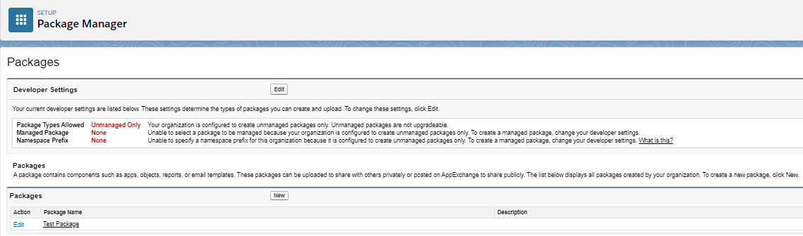</p>

To create a new unmanaged package, we unsurprisingly click the `New` button, at which point we'll be prompted to provide a name and description for the package. Next, we'll be taken to the package detail screen, displayed in the following screenshot.

<p align="center">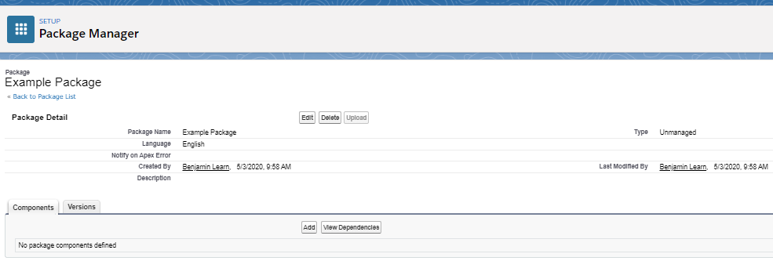</p>

By clicking the `Add` button, we can add a large variety of customizations to the package, including custom objects, custom apps, and Apex code. Once we select the checkboxes next to the desired customizations and click `Add to Package`, we will be returned to the package detail page. Note that if we select a custom object, its fields, page layouts, and list views will be automatically added as well.

Once we've added all desired customizations, we can click `Upload`, which will take us to the package upload page (seen in the following image).

<p align="center">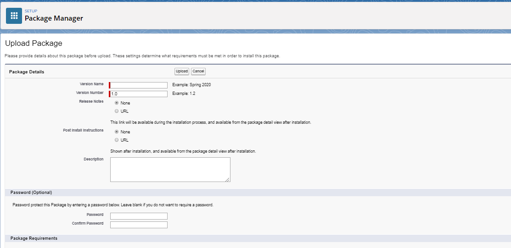</p>

Here, we provide a name and version number for the current version of our package. We can also optionally choose to create a password that will be required for anyone to install our package in their org. In addition, we have the option to select any required features (such as `Chatter`) or enable certain object requirements. Object requirements include `Record Types` (where at least one record type must have been created in the installing org for the particular object), `Sharing` (where the object must have its own sharing settings - i.e. it cannot have a `Controlled by Parent` OWD), `Field History Tracking`, and `Feed Tracking`. If an org that doesn't adhere to our object or feature requirements attempts to install the package, the operation will fail.

Once we click the `Upload` button, we'll be directed to the version detail page, shown in the following image.

<p align="center">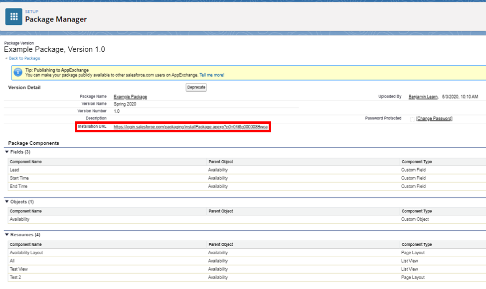</p>

We should take particular note of the installation url (enclosed in the red rectangle) - unmanaged packages cannot be uploaded to AppExchange, so other Salesforce users that wish to install our package in their orgs must have this url to do so. If someone is installing our customizations in a `Trailhead Playground`, they can copy and paste the package Id (the final 15 characters of the installation url) in the `Package ID` box in the `Install a Package` tab of the `Playground Starter` app.

Each new version receives a new Id and users cannot install a new version of an unmanaged package until they uninstall any other versions of that package. Because of the new Id and this installation limitation, we say that unmanaged packages are non-upgradable. Additionally, we cannot protect any custom code included in unmanaged packages, so they're most commonly used for open source projects and applications.

### Managed Packages

Unlike their unmanaged counterparts, managed packages can only be created in `Developer Editions` and `Trailhead Playgrounds`. To configure such an org to create managed packages, we again go to the packages page at `Setup` > `Apps` > `Packaging` > `Package Manager`. After clicking the `Edit` button in the `Developer Settings` section and then choosing `Continue` on the following page, we'll be taken to the below screen.

<p align="center">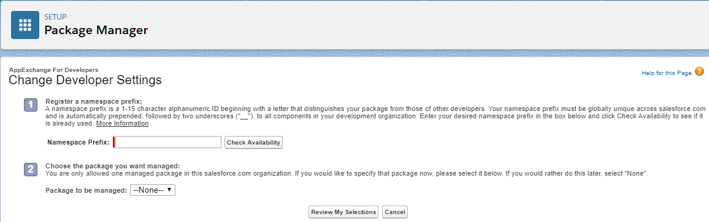</p>

On this page, we specify the namespace for our package - in contrast to unmanaged packages, managed ones receive a unique namespace separate from the default `c` provided to the rest of the installing org. This means that any customizations with the same name in both an installing org and our managed package will not conflict because the system keeps them separate by prepending the package namespace to all metadata within said package.

Once we've chosen an awesome namespace, the package screen will change to reflect our ability to create both managed and unmanaged packages, as seen in the following image.

<p align="center">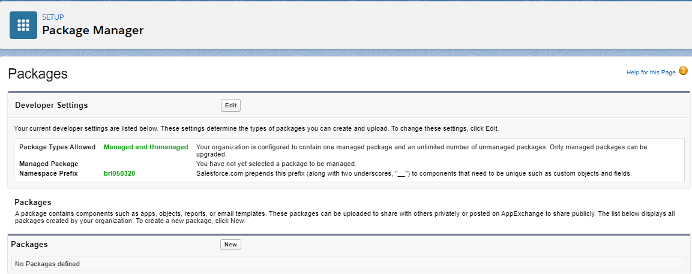</p>

Now that the settings have been configured, we simply check the `Managed` checkbox when creating a new package. The process of adding customizations to the package is the same as for unmanaged packages. Once we have added all desired metadata, we can click the `Upload` button, which will direct us to the following page.

<p align="center">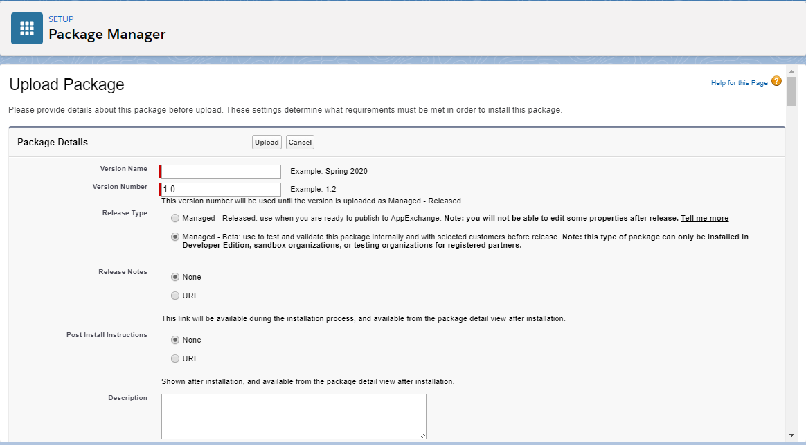</p>

The `Managed - Beta` designation shown in the above image is used when we are testing the package in another org before it is released to the public. If we choose `Managed - Released` instead, there are some package modifications that can no longer be performed, such as changing the name of an Apex class. However, if our package version is `Managed - Released`, it can be added to `AppExchange`.

Managed packages uploaded to `AppExchange` can be updated without any subscribers needing to remove any prior package versions or receive a new package Id, so we say that they are upgradeable. However, the package itself being upgradeable doesn't mean that all components and component attributes within it can be modified. Let's explain, starting with the following image, courtesy of the `Understanding Packages` link in the `Helpful Links/References` section.

<p align="center">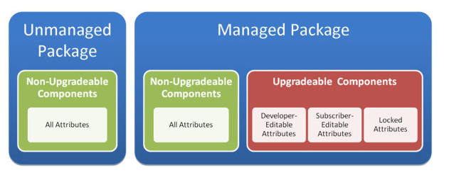</p>

As the diagram shows, the metadata components within a managed package fall into two categories - upgradeable (e.g. custom objects) and non-upgradeable (such as dashboards). We can further divide the attributes of upgradeable components into three categories: developer-editable, subscriber-editable, and locked. We can change the value of the first type of attribute (e.g. the label of a custom object) and have our modifications reflected in subsequent package versions for both new and existing customers.

The second attribute type is a slight misnomer because subscriber-editable attributes can actually be changed by both developers and subscribers (i.e. customers). For example, either person can modify the `Allow Activities` and `Allow Reports` checkboxes for a custom object. But because these are "subscriber-editable" attributes, existing customers won't get any changes that we as developers make, even in subsequent package versions. However, if we make a new package version that, e.g., allows activities for a custom object where the prior version didn't, new customers will get the custom object with the `Allow Activities` checkbox selected when they install our package.

This type of attribute is in contrast to our final type, locked attributes, which can't be modified by anyone - developer or subscriber. Examples of such an attribute include the API name of a custom object and the name of an Apex class as we mentioned earlier.

We've been referring to those who install our managed packages as "customers" because we can sell these packages, either with a one-time or subscription-based payment model. Of course, it wouldn't make much sense for us to offer a subscription service if our customers could see all of our work - they could just copy our code and stop paying us. Therefore, managed packages automatically obfuscate any non-`global` code - meaning that the installing user will not be able to access and see our intellectual property, but they'll still be to make use of it.

If we do have `global` code in our package that we're planning to remove in future versions, we can use the `@deprecated` annotation. This annotation lets our subscribers know that the `global` method, class, custom exception, enum, interface, or variable following it can no longer be referenced and will not be available in future package versions. Any users who install the package for the first time after the code receives this annotation will not see that code at all.

## Change Sets

[Check here for a video from Ben, showcasing change sets](https://revature0-my.sharepoint.com/personal/benjamin_learn_revature_com/_layouts/15/onedrive.aspx?id=%2Fpersonal%2Fbenjamin%5Flearn%5Frevature%5Fcom%2FDocuments%2FChange%20Sets%2Emp4&parent=%2Fpersonal%2Fbenjamin%5Flearn%5Frevature%5Fcom%2FDocuments)

Change sets are declarative deployment tools used to transfer groups of customizations (metadata) between _related_ orgs. Take note of the emphasis in that last sentence - a change set can only be deployed between a production org and one of its sandboxes, a sandbox and its corresponding production org, or two sandboxes with the same corresponding production org. Because this feature is unavailable in `Developer Editions` and `Trailhead Playgrounds`, we might not get a lot of hands on experience with it - so we'll be sure to walk through the related operations in detail throughout this section.

Before we can deploy any change sets, we have to make a deployment connection between our sandboxes and/or production org. To do so, we navigate to `Setup` > `Environments` > `Deploy` > `Deployment Settings` in the target org (i.e. the org that will receive the change set), as shown below.

<p align="center">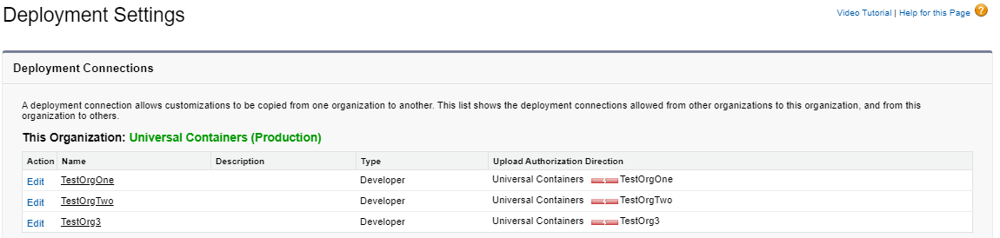</p>

By clicking on the `Edit` link next to one of the listed orgs, we'll be directed to a screen like that displayed in the following image, where we can select `Allow Inbound Changes`.

<p align="center">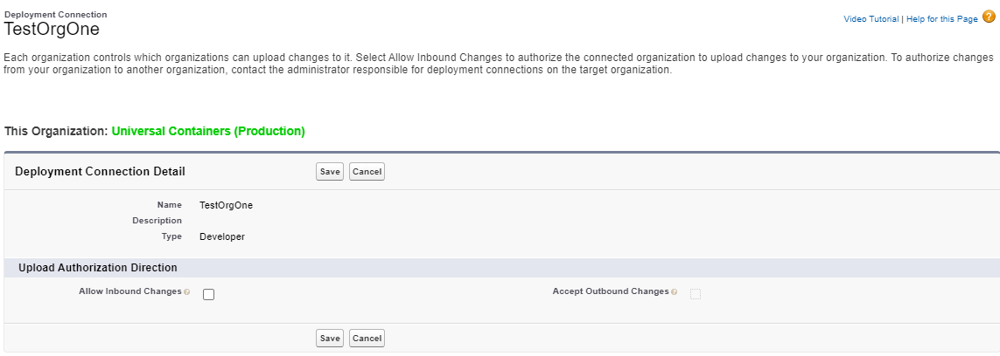</p>

Because we're in a production org in our above examples, enabling this option will allow our sandbox to deploy changes to this org. Note that we cannot enable the deployment of change sets from one related org to another by editing the settings in the source org, i.e. we can only select `Allow Inbound Changes` in any org. So if we wanted to give our production org the ability to deploy change sets to our sandbox, we'd have to select `Allow Inbound Changes` in the sandbox. 

Once we've configured our deployment settings, we go to the source org and declaratively add components to a new outbound change set - the artifact containing the components we want to deploy to our target org - in much the same way as we would add components to an unmanaged or managed package. We begin by navigating to `Setup` > `Environments` > `Change Sets` > `Outbound Change Sets` and clicking `New`. On the resulting page, we'll provide a name for the set and select `Save`. After that, we'll arrive at the change set detail page (shown in the following screenshot), where we can add metadata to our artifact.

<p align="center">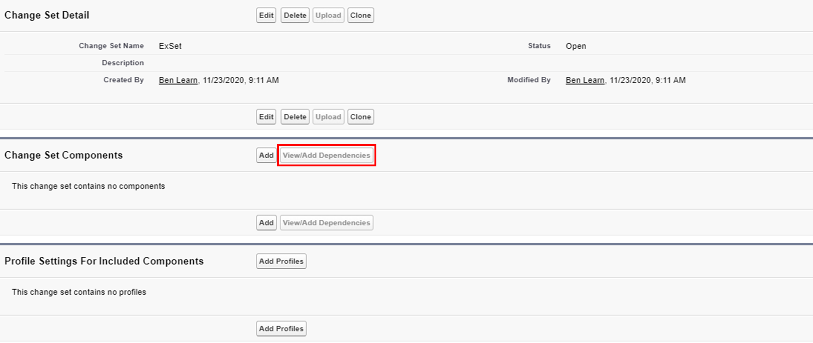</p>

Because sets don't automatically include metadata that our selected customizations depend on, we should select the `View/Add Dependencies` button (surrounded by the red rectangle above), to view the necessary customizations and ensure that they are either (a) included in our change set or (b) already in the target org. If neither of these conditions are fulfilled, our deployment will fail when we attempt it. Note that we can include profiles by selecting them after clicking the `Add Profiles` button.

When all desired customizations have been added to our set, we can click `Upload`, select our target org, and click `Upload` again to finalize our preparations. Change sets cannot be versioned and are uneditable once they're uploaded, so if we realize that we need to add or remove components to an already-uploaded set, we'll need to clone the set, make our changes to the clone, and then upload the clone. 

To actually perform the deployment and then be able to make use of the customizations in our target org, we return to said target org. We then begin working with the now inbound set by navigating to `Setup` > `Environments` > `Change Sets` > `Inbound Change Sets`. But before we start the deployment, let's talk about what actually happens during the operation.

First, Apex tests run according to the testing options that we'll discuss shortly. Additionally, the target org's counterparts to any components included in the change set are locked during the entirety of the operation so that they cannot be edited. Because of these factors, the process can be disruptive due to the amount of resources used and the possibly long time it takes to complete, as well as the locking of components.

To reduce any disturbances, we should adopt the best practices of factoring in the time that our Apex tests will take to complete and deploying change sets inbound to production orgs outside of business hours so that our users are not affected. Further, we can adopt another best practice - change set validation - to make our process more efficient.

Validating a change set separates the two main operations involved in the deployment: validation and the actual deployment itself. During validation, Apex tests in our target org run according to the chosen test option, all component dependencies are ensured, and any error messages that we would encounter in the actual deployment (whether due to failing tests, insufficient test coverage, or missing dependencies) display. Not only will this allow us to catch any problems, but we can then quick deploy our now-validated change set.

Quick deployment is an available option if we've validated our change set in the past ten days, all Apex tests were successful during validation, and we met the code coverage requirements that we'll explore at the end of this module. If we use a quick deploy, our Apex tests won't be rerun and dependencies won't be checked again - we'll just get right to the deployment part of the operation.

We can start validation by selecting the `Validate` link next to the desired set on the `Inbound Change Sets` page in the target org. We'll then choose from one of the testing choices described in the following table before clicking `Validate` again.

| Test Option | Requirements Enforced |
| ----------- | --------------------- |
| Default | Sandbox: no tests executed. Production org: all local tests executed if Apex classes or triggers are in change set. |
| Run local tests | All local tests in target org run. |
| Run all tests | All tests run. |
| Run specified tests | Only specified tests run |

Note that local tests are all those that aren't from managed packages - i.e. those tests within both the org and the change set. We should also point out that we can only successfully validate when choosing the last option if our specified tests cover at least 75% of _each_ class and trigger in the set - that's a requirement enforced on each Apex file individually, not the general conditions that we'll discuss later.

Validation still takes resources from the target org - we're still executing tests and checking dependencies, so all affected metadata in the target org is still locked. However, we can still see a benefit because of our ability to, e.g., validate a change set during off-hours one night and deploy it the next.

Once validation has finished, we can navigate to `Setup` > `Environments` > `Deploy` > `Deployment Status` (a page which holds information about all of our inbound change set operations) and select the `View Details` link next to the appropriate validation. If our change set is eligible for quick deployment, an option for implementing it will appear on the resulting page.

If we decide against quick deployment, we can simply click the `Deploy` link next to the set on the `Inbound Change Sets` page. When an error is encountered during deployment - whether it's a missing dependency, a failing test, or insufficient test coverage - the entire transaction is rolled back because it is an all-or-none operation. In this case, we'd have to fix whatever problem occurred and then manually restart the process.

However, despite the fact that usernames are unique across all orgs - even sandboxes - we don't have to worry about issues due to user references in any deployed components. When we create a sandbox, the system makes a "copy" of each production user (we put copy in quotes because the username in the sandbox and production org are still different for a given user). Because the system creates these users, it knows the corresponding production username for a sandbox user record and can therefore resolve user references appropriately by comparing those usernames. The system actually attempts to perform this matching whenever we deploy metadata through any tool, but there's a much smaller chance of it automatically succeeding when the migration isn't between two related orgs.

Note that we can't rename components through change sets. For example, if the target org and source orgs both have a custom object named `UncreativeName__c`, changing the object's name to `CreativeName__c` in the source org and deploying a change set with the modification will just create a new `CreativeName__c` object in the target org and the original will still exist. We also can't delete metadata through change sets, so we accomplish any deletion or renaming by performing the adjustments in `Setup` in the destination org or using a different deployment option.

A set won't be available for deployment at all if the sandbox that uploaded it has been deleted or refreshed, the set itself has been deleted in the source org, or the set expired (we can view an outbound change set's expiration date on its detail page in the source org). Finally, because sets move metadata between the connected orgs without making any copies on our local machines, it becomes much more of a nuisance to implement version control than it is with other deployment tools. 

## Workbench

We can also perform declarative deployments through the use of [Workbench](https://workbench.developerforce.com/login.php), a web-based tool that was made by Salesforce but isn't officially supported by the company. Workbench provides a user interface for us to interact with Salesforce's Bulk, REST, Streaming, and Metadata APIs, in addition to any Apex that we expose as a custom REST or SOAP webservice.

Because the Metadata API is part of the aforementioned group, Workbench can be used to deploy and retrieve metadata. To deploy, we navigate to the Workbench url, login to the source org, and select `Migration` > `Deploy`, which will take us to the following screen.

<p align="center">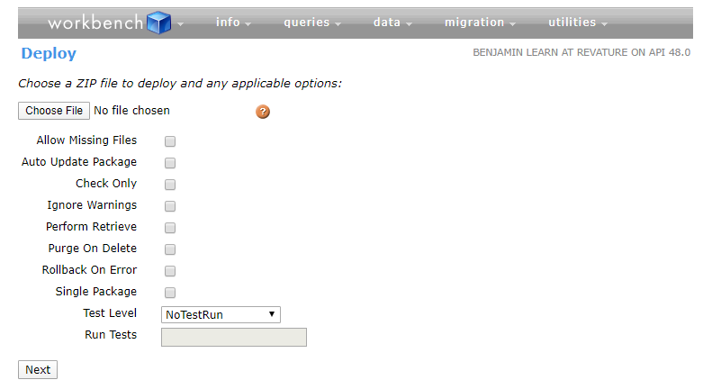</p>

Once here, we choose an archived directory that contains the metadata to deploy, in addition to a `package.xml` manifest. After we choose any of the desired options, we click `Next`, review our choices on the following screen, and click `Deploy` to initiate the operation.

To retrieve metadata using Workbench, we navigate to `Migration` > `Retrieve`, where we'll see a screen resembling the below image.

<p align="center">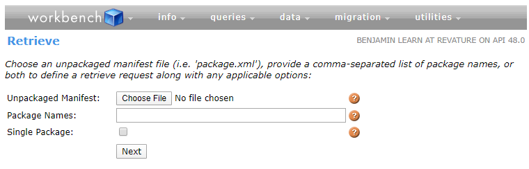</p>

Here, we can upload an XML file specifying the metadata we wish to retrieve and/or specify the names of the packages we wish to pull from the target org. Upon clicking `Next`, we will be able to review our choices and click `Retrieve` to initiate the process.

## Ant Migration Tool

If we're looking to deploy using a CLI, we can turn to the Ant Migration Tool, which is a Java application that utilizes the Apache Ant library to allow us to use the command line to migrate customizations between related or unrelated orgs. Once we download the CLI to our local machine (through the following [link](https://gs0.salesforce.com/dwnld/SfdcAnt/salesforce_ant_50.0.zip)), we'll be able to leverage the Metadata API to deploy and retrieve customizations.

To configure our installation, we work with the `build.properties`, `build.xml`, `package.xml`, and `destructiveChanges.xml` files. `build.properties` includes information to connect to our org and looks like the following example:

```txt
sf.username = sampleusername@sampleurl.com
sf.password = supersecurepassword
sf.serverurl = https://login.salesforce.com
```

The username, password, and serverurl specifications let the tool know where it should send our authentication request. If we'd rather authenticate through OAuth, we can specify an `sf.sessionId` parameter with an access token in place of `sf.username` and `sf.password`.

We next use the `build.xml` file to specify commands that Apache Ant will execute. The `package.xml` file declares the components that we intend to either retrieve or deploy. Because we're using the Metadata API under the hood, this file looks the same as its cousin that we interact with when working on SFDX projects. If we'd like to delete metadata from an org, we can include a `descrutiveChanges.xml` file, which looks the same as our `package.xml` file.

Now that we've further explained the configuration files, we can detail how they fit into our order of operations. Obviously, we begin by defining our `build.properties` file with credentials for the source org. We then specify an `<sf:retrieve>` parameter in our `build.xml` and the metadata components we wish to copy locally in `package.xml`. Next, we run the command `ant retrieve` while we're in the directory containing the build and package files.

Once we have our local copy of the metadata, we can deploy it by updating `build.properties` with credentials for the destination org, adding an `<sf:retrieve>` parameter to `build.xml`, and executing the command `ant deploy` from within the directory holding the build and package files.

As we implied through our description of `destructiveChanges.xml`, this tool, unlike others such as change sets or unmanaged packages, allows us to delete metadata from an org. Additionally, because we're working from the command line, we can create scripts that execute Ant commands and create cronjobs to schedule the regular invocation of those scripts.

Of course, as we've already said, we also use the Metadata API for migration when working with SFDX, which we explore in the `SFDX & Visual Studio Code` unit.

## A Code Coverage Reminder

Many of the deployment options we discussed in this module have testing requirements for any Apex files that they include, so let's conclude by reminding ourselves about the details of these thresholds. To deploy customizations to a production org, we need to have at least 75% of our custom Apex code covered by tests (obviously, this calculation excludes classes marked with `@isTest`). Additionally, all triggers included in a deployment must have at least some coverage. If we're working in the Developer Console, our coverage percentage can be seen from the `Tests` tab after test execution.

But as we've emphasized in the past, having acceptable code coverage does not necessarily mean that our tests are sufficient and our code will function properly. To ensure that we've achieved these latter goals, we should adhere to testing best practices as well.
