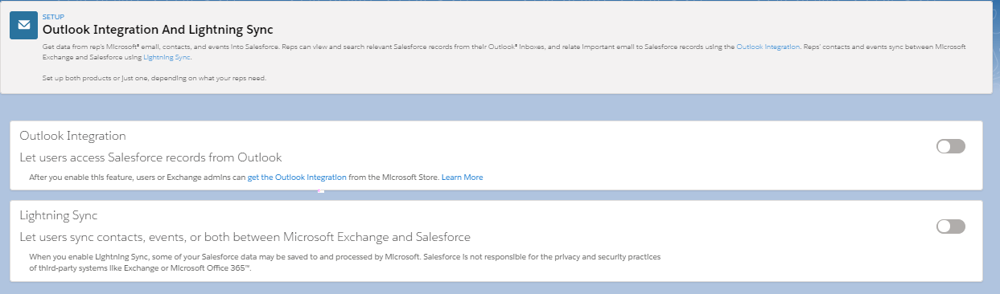
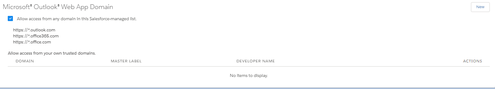

# Module - External Applications

This module covers external email services, Heroku, and factors in determining the use of AppExchange.

## Table of Contents

- [Module - External Applications](#module---external-applications)
  * [Table of Contents](#table-of-contents)
  * [Helpful References/Links](#helpful-references-links)
  * [External Applications](#external-applications)
  * [Heroku](#heroku)
    + [Heroku](#heroku-1)
        * [What is heroku](#what-is-heroku)
        * [What are dynos?](#what-are-dynos-)
        * [What is salesforce connect?](#what-is-salesforce-connect-)
        * [What is postgres?](#what-is-postgres-)
        * [What is apache kafka?](#what-is-apache-kafka-)
        * [What is redis?](#what-is-redis-)
        * [What is apache kafka?](#what-is-apache-kafka--1)
  * [External Email Services](#external-email-services)
        * [What are the capabilities of Outlook integration?](#what-are-the-capabilities-of-outlook-integration-)
        * [What are the capabilities of Lightning for Gmail?](#what-are-the-capabilities-of-lightning-for-gmail-)
    + [Outlook Integration and Gmail Integration](#outlook-integration-and-gmail-integration)

## Helpful References/Links

* [Outlook and Gmail Integration on Desktop (Salesforce Help)](https://help.salesforce.com/articleView?id=email_int_overview.htm&type=5)
* [Outlook and Gmail Integration and Inbox Features (Salesforce Help)](https://help.salesforce.com/articleView?id=email_int_features.htm&type=5)
* [Outlook Integration System Requirements (Salesforce Help)](https://help.salesforce.com/articleView?id=app_for_outlook_system_requirements.htm&type=5)
* [Considerations for Setting Up the Outlook Integration (Salesforce Help)](https://help.salesforce.com/articleView?id=app_for_outlook_setup_considerations.htm&type=5)
* [Gmail Integration System Requirements (Salesforce Help)](https://help.salesforce.com/articleView?id=app_for_gmail_system_requirements.htm&type=5)
* [Considerations for Setting Up the Gmail Integration (Salesforce Help)](https://help.salesforce.com/articleView?id=app_for_gmail_setup_considerations.htm&type=5)
* [Email and Event Logging from Outlook and Gmail to Salesforce (Salesforce Help)](https://help.salesforce.com/articleView?id=email_int_user_view_work_log.htm&type=5)
* [Create Salesforce Records from Outlook and Gmail (Salesforce Help)](https://help.salesforce.com/articleView?id=email_int_user_view_work_create_records.htm&type=5)

## External Applications

As the name of this module suggests, we'll be discussing software external to our org throughout it. But, depending on context, what's "external" about the application may change.

For example, when we're discussing Heroku, our applications will be external in the sense that they're residing outside of our org, on an entirely separate platform (albeit one that's still owned by Salesforce). When we're detailing Outlook Integration and Gmail Integration, not only will the application(s) reside outside of our org, but it will have also been developed by programmers who are external to our company - developers working for Salesforce itself. Finally, when we're talking about AppExchange and the appropriate times to look for solutions on it, we'll be speaking of applications that are within our org after we install them, but have been made by those outside of our company.

Let's summarize these distinctions with the following table.

| Concept | Contains Applications/Is An Application Developed By Someone Outside of Our Company | Contains/Is an Application Hosted Outside of Our Org |
| ------- | ------------------------------ | ----------- |
| Heroku | Possibly, but we can develop applications on the platform as well | Yes |
| Gmail Integration and Outlook Integration | Yes | Yes |
| AppExchange | Yes | No |

## Heroku

### Heroku

##### What is heroku
		Heroku is a platform as a service based on a managed container system with integrated data services. Owned by salesforce, it also features salesforce connect, allowing for easy integration.

##### What are dynos?
		Heroku uses the container model to run and scale all apps, those containers are referred to as dynos and provide light-weight isolated environments that provide compute, memory, OS, and ephemeral filesystem. They are run on a shared host, but are completely isolated from each other.

##### What is salesforce connect?
		Salesforce connect allows you to connect your salesforce org to an app on the heroku platform.

##### What is postgres?
		Postgres is the relational database used by heroku.
		(It isn't exclusive to heroku, but the exposure they get to it is exclusively through the context of an overview of heroku.)

##### What is apache kafka?
		Apache kafka is a messaging service that follows a pub-sub model available in heroku.
		(It isn't exclusive to heroku, but the exposure they get to it is exclusively through the context of an overview of heroku.)

##### What is redis?
		Redis is the in-memory key-value data store used by Heroku.
		(It isn't exclusive to heroku, but the exposure they get to it is exclusively through the context of an overview of heroku.)

https://www.salesforce.com/blog/2015/12/announcing-salesforce-connect.html
https://trailhead.salesforce.com/content/learn/modules/salesforce_heroku_integration/getting_started_with_integration
https://developer.salesforce.com/blogs/developer-relations/2015/02/access-salesforce-data-external-sources-lightning-connect.html
https://help.salesforce.com/articleView?id=salesforce_connect.htm&type=5
https://help.salesforce.com/articleView?id=heroku_connect_about.htm&type=5
https://help.salesforce.com/articleView?id=external_data_sources.htm&type=5
https://www.heroku.com/connect
https://elements.heroku.com/addons/heroku-postgresql
https://elements.heroku.com/addons

Heroku
* PAAS for with app development/deployment
* founded in 2007, bought by Salesforce in 2010
* apps are run in containers called dynos
  * analogous to Docker containers
  * each dyno is an isolated execution environment with its own files and memory
  * need to support more users visiting/using your app? just pay to increase the number of dynos its running on
* Salesforce connect
  * external objects!
  * establish connection between database on Heroku and Salesforce org
  * data in Heroku database isn't actually saved in Salesforce, rather it's proxied and accessed in real time as the records of external objects
* Heroku connect
  * establish connection between Heroku and Salesforce org
  * data can be proxied or replicated
  * if proxied, Heroku Connect exposes database to Salesforce Connect
  * if replicated, can be replicated one way or bidirectional
    * syncing performed near-real time
    * when you're accessing replicated data in Salesforce org, the data is actually stored within your salesforce org, unlike when proxying
* Heroku add-ons
  * Heroku connect (see above)
  * Heroku Postgres
    * Heroku add-on
    * = Postgresql database in Heroku
  * Heroku Redis
    * Heroku add-on
    * = Redis but on Heroku
    * Redis is in-memory key-value database
    * in-memory databases (IMDBs) store data in RAM rather than in disk drives
      * good b/c faster access, bad because db crash = RAM cleared = data gone if no backups
  * Apache Kafka on Heroku
    * Heroku add-on
    * = Apache Kafka, but on heroku (v surprising)
    * Apache kafka is stream-processing software
      * follows pub-sub model
      * application can either publish streams of records or subscribe to topics and process the associate stream of records

##### What is apache kafka?
		Apache kafka is a messaging service that follows a pub-sub model available in heroku.
		(It isn't exclusive to heroku, but the exposure they get to it is exclusively through the context of an overview of heroku.)

## External Email Services

##### What are the capabilities of Outlook integration?
		Allows users to use global actions inside of outlook, relate emails and events to records, utilize org-made email templates, and create new contacts and leads from email sender/recipient information. and emails to records.

##### What are the capabilities of Lightning for Gmail?
		It allows users to relate emails and meetings to salesforce records, and allows users to view salesforce CRM info related to emails, such as contacts.

### Outlook Integration and Gmail Integration

Although they are two different services, Outlook Integration and Gmail Integration offer many of the same features. Available to Salesforce users without additional cost, both offer the ability to relate emails and events to contact, lead, or user records through `Enhanced Email` provided that the email address on the record matches the email address from the email or event. If there is no matching address, users can create a lead or contact with the information from the email. Additionally, employees can leverage email templates created in Salesforce in their email applications to save time.

To enable Outlook Integration, navigate to `Setup` > `Email` > `Outlook Integration and Sync` (shown in the first image below) and enable `Let users access Salesforce records from Outlook`. By default, this allows the feature to be used for all Outlook domains ending in outlook.com, office365.com, or office.com. If your organization uses a custom Outlook domain, you can navigate to the `Microsoft Outlook Web App Domain` section (shown in the second image below) and click `New` to add the domain. Enabling Outlook Integration also turns on enhanced emails by default. Further, you have the ability to enable features that will let you configure the global actions Outlook users see (`Email Application Publisher Layouts`) and the layout (`Customize Content with Lightning App Builder`).

\

Once Outlook Integration has been prepared in Salesforce, end users can go to their Outlook app, install the `Salesforce` add-in and then click `File` > `Manage Add-ins` and turn on `Salesforce`. Once they select an email or calendar event, they will be prompted to login to the Salesforce org and will then be able to use the included features.

To enable similar functionality for Gmail, navigate to `Setup` > `Email` > `Gmail Integration and Sync` and enable `Let users access Salesforce records from Gmail`. Again, enhanced email features are added automatically and you have the option to manage displayed global actions through the publisher layouts and the layout of features through the app builder.

Once the Salesforce preparation is complete, users can add the `Salesforce` extension in the `Chrome Web Store`, navigate to Gmail and then login to the Salesforce org to be able to use the included features.

For information on supported email clients and email server configuration, see the `Outlook Integration System Requirements`, `Considerations for Setting Up the Outlook Integration`, `Gmail Integration System Requirements`, and `Considerations for Setting Up the Gmail Integration` links in the `Helpful Links/References` section. Note that Outlook Integration is the preferred replacement for the soon-to-be-deprecated Salesforce for Outlook, offering comparable abilities without the need to manually upgrade the software when a new version of Salesforce is released.