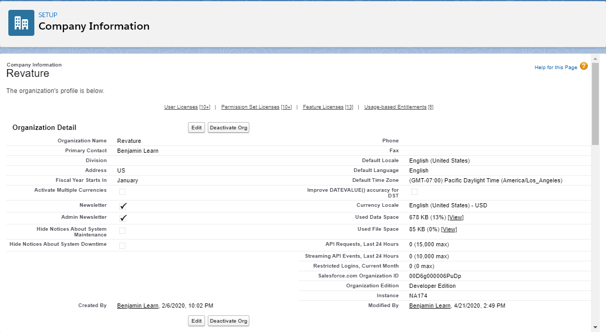
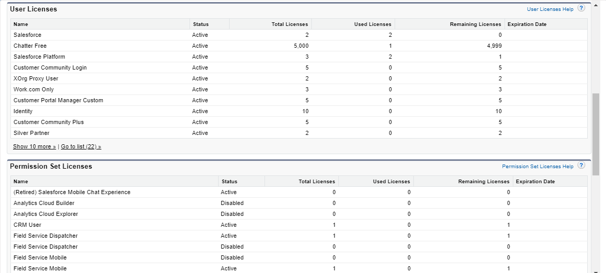
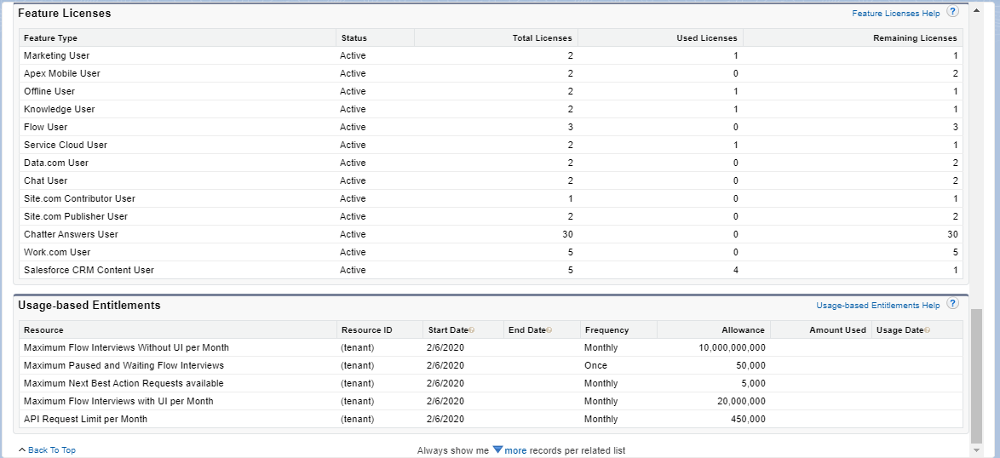
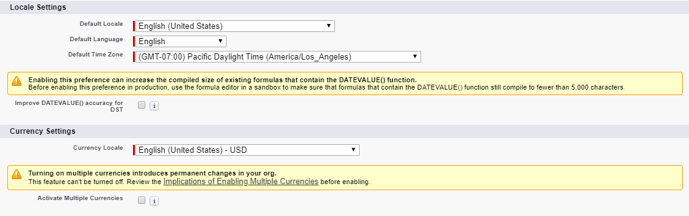
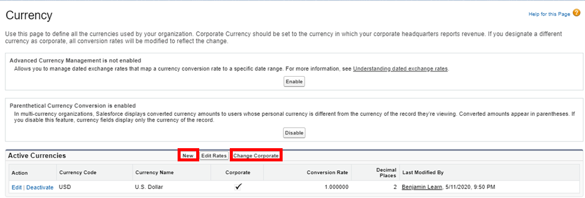
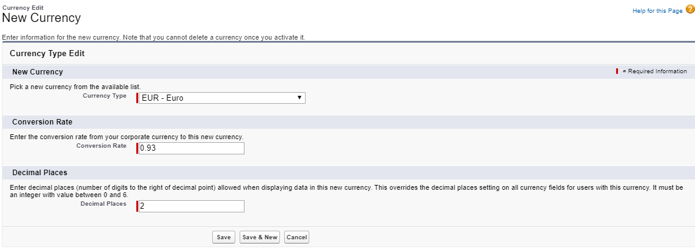
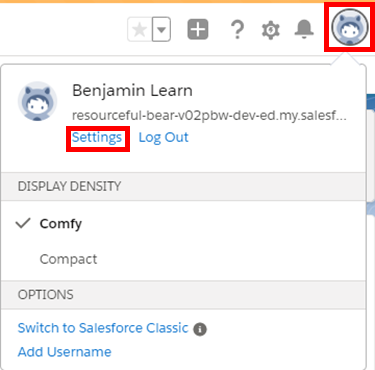
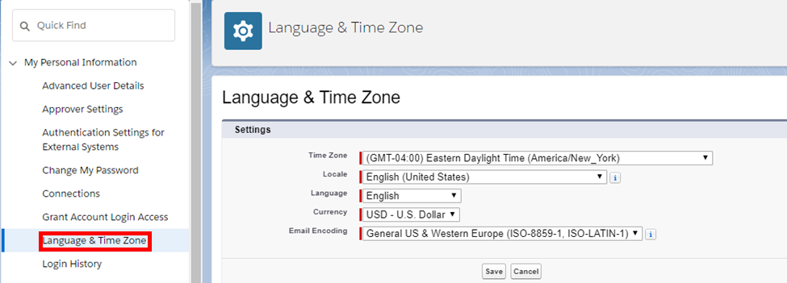
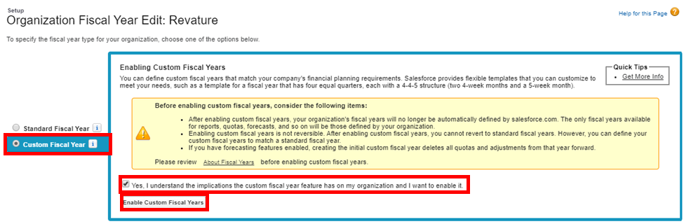

# Module - Org Configuration

This module introduces currency management, fiscal years, and trusted IPs in Salesforce, as well as the Company Information page.

## Table of Contents

* [Company Information (Salesforce Org Overview)](#company-information-(salesforce-org-overview))
* [Multiple Currencies](#multiple-currencies)
* [Custom Fiscal Years](#custom-fiscal-years)
* [Trusted IPs and MFA](#trusted-ips-and-mfa)

### Helpful References/Links

* [API Requests Limits (Salesforce Developer Limits Quick Reference)](https://developer.salesforce.com/docs/atlas.en-us.206.0.salesforce_app_limits_cheatsheet.meta/salesforce_app_limits_cheatsheet/salesforce_app_limits_platform_api.htm)
* [Select Your Language, Locale, and Currency (Salesforce Help)](https://help.salesforce.com/articleView?id=admin_language_locale_currency.htm&type=5)
* [User Licenses (Salesforce Help)](https://help.salesforce.com/articleView?err=1&id=users_understanding_license_types.htm&type=5)
* [Communities User Licenses (Salesforce Help)](https://help.salesforce.com/articleView?id=users_license_types_communities.htm&type=5)
* [Available Feature Licenses (Salesforce Help)](https://help.salesforce.com/articleView?err=1&id=users_feature_licenses_available.htm&type=5)
* [Considerations for Enabling Multiple Currencies (Salesforce Help)](https://help.salesforce.com/articleView?id=admin_enable_multicurrency_implications.htm&type=5)
* [Define Your Fiscal Year (Salesforce Help)](https://help.salesforce.com/articleView?id=admin_about_cfy.htm&type=5)

## Company Information (Salesforce Org Overview)

In this module, we'll discuss some broad organization-wide settings as well as where we can go to view information about our company and its Salesforce use. First, we'll explore the appropriately named `Company Information` page, which can be found at `Setup` > `Company Settings` > `Company Information`. It's fairly long, so we'll break it into sections and explain each in detail. First, we have the `Organization Detail` section, shown in the below image.

This section displays some basic information about our company such as its name, points of contact, and address, as well as our org's default settings like locale, language, and time zone. We configure these defaults for our entire org, but our users can personalize their language, locale, and time zone in their user settings.

Additionally, we have information about our organization edition (Trailhead Playgrounds are displayed as Developer Editions because a playground is a special type of Developer Edition), allocated and used storage space for all data (and for files specifically), and the amount of API requests we have made in the past 24 hours. Note that we are interacting with the underlying API and therefore making an API request any time we run Apex code.

Finally, there is information about our fiscal year and the currencies that we use; we'll discuss those in more detail shortly. For now though, let's take a look at the next sections of the page:

The tables in the `User Licenses` and `Permission Set Licenses` sections shown above contain information about the number of total licenses for a given type, how many of that type have been consumed, and how many remain. Note that community user licenses can be either member-based or login-based; if they are login-based, our company will purchase a set number of monthly logins for the user (where multiple logins on the same day count as only one login).

Let's take a look at the final sections:

The `Feature Licenses` section displays the same information for feature licenses and the `Usage-based Entitlements` section shows the monthly governor limits for features such as flows and API requests and how much of the monthly limit we have used.

## Multiple Currencies

Staying on the `Company Information` page, let's turn to multiple currencies. By default, each org can only have one currency at a time. But this may be a hindrance for, e.g., multinational companies, so Salesforce allows us to enable the use of multiple currencies within our org. We'll do so by clicking the `Edit` button and then, on the following screen, scrolling to the sections shown in the below image.

The `Locale Settings` allow us to change our org's default language, locale, and time zone, but the `Currency Settings` section is our primary focus here. To activate multiple currencies, we select the appropriately named `Activate Multiple Currencies` checkbox, scroll to the bottom of the page, and click `Save`. Note that multiple currencies cannot be disabled once we activate them.

After we have activated the feature, the `Company Information` page will display a `Currency Setup` button, which will direct us to the currency setup page, pictured below.

If we have multiple currencies created, we can switch the default currency for the org by selecting the `Change Corporate` button (enclosed in the right red rectangle). If we have not created another currency, we can do so by clicking the `New` button (enclosed in the left red rectangle). On the following currency creation page, we'll select the new currency from a list of currency codes and names, set the conversion rate from the default currency to the new currency, and choose the number of decimal places used in conversion, as demonstrated in the following picture.

With multiple currencies are enabled, users can set their own personal default currency (choosing from one of the active currencies created through the currency setup page) in addition to being able to personalize the locale, language, and time zone. To select a personal currency, users first navigate to their personal settings by clicking the avatar in the upper right hand corner of the page (enclosed in the rightmost red rectangle in the following image) and then choosing `Settings` (surrounded by the leftmost red rectangle in the following image).

In their settings, users can select `Language & Time Zone` (enclosed in the red rectangle in the below screenshot) from the left sidebar to choose their personal time zone, locale, language, and/or currency. Note that the values of any time fields will be converted to a user's chosen time zone and the values of any currency fields will be shown in the org's default currency, with the equivalent value in the user's personal currency following in parentheses.

## Custom Fiscal Years

We'll now leave the `Company Information` page to talk about custom fiscal years. To navigate to fiscal year settings, we go to `Setup` > `Company Settings` > `Fiscal Year`. By default, our org has a standard fiscal year that begins on the first day of January every year. However, we can make our fiscal year start on the first day of any month in the Gregorian calendar without creating a custom year by simply selecting a different value from the `Fiscal Year Start Month` dropdown.

If we need further customization, we can select the `Custom Fiscal Year` radio button (surrounded by the left red rectangle in the below image). Like multiple currencies, custom fiscal years cannot be deactivated once they are activated, so we must select the checkbox enclosed by the top right red rectangle in the following image and click the `Enable Custom Fiscal Years` button (surrounded by the bottom right red rectangle).

Once the feature has been enabled, we can click `New` on the fiscal year page to create a new custom fiscal year using one of the template structures shown in the image below.

Note that by enabling custom fiscal years, we lose the ability to use fiscal date functions in SOQL queries and existing forecasts from the first quarter of the first custom fiscal year are deleted. We also must define a new custom fiscal year annually - Salesforce won't automatically create new ones for us based on past templates.

## Trusted IPs and MFA

The final topics we'll touch on in this lesson are trusted IPs and multi-factor authentication (MFA). Although not enabled by default, Salesforce gives us the ability to set up MFA requirements for our users, by enabling the setting on a profile-by-profile basis.

To require MFA for the users holding given profile, we navigate to the profile detail page with `Enhanced Profile User Interface` enabled, then click `System Permissions`, `Edit Properties`, and scroll down to and check the `Multi-Factor Authentication for User Interface Logins` field before clicking `Save`. If we are using the default profile interface, we can toggle the same settings by navigating to the `General User Permissions` section of the profile detail page.

Once MFA has been enabled, we can add `Trusted IP Ranges`, which are functionally a subset of login IPs where users are not required to verify their identity through another form of authentication even if MFA is configured on their profile. Take note of the word 'subset' in the previous sentence - if the range of trusted IPs exceeds the range of login IPs for a profile, the trusted IPs are effectively restricted to those login IPs (there's no need for MFA if we can't login in the first place). If a user is outside of the trusted IPs, but within the login IPs, they will be required to provide a second form of authentication.

While login IPs are configured for individual profiles, trusted IPs are an org-wide setting that we can configure by navigating to `Setup` > `Security` > `Network Access`, clicking the `New` button, and entering a starting and ending IP address.
