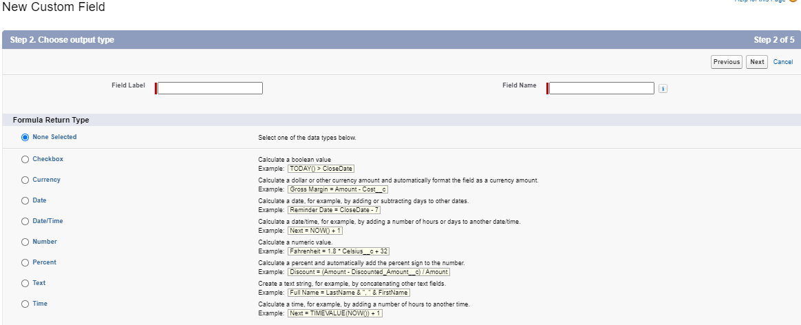
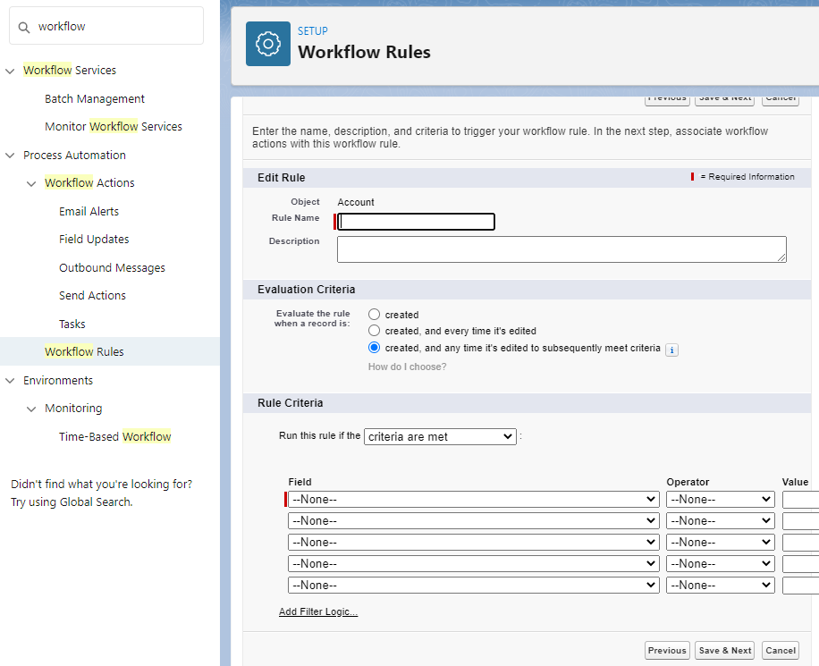
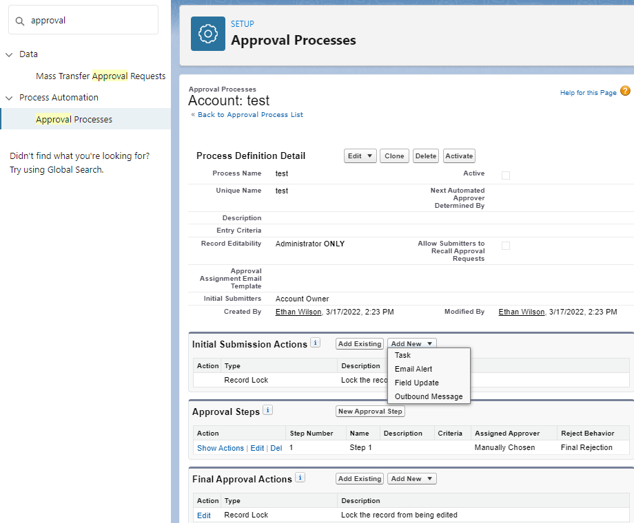
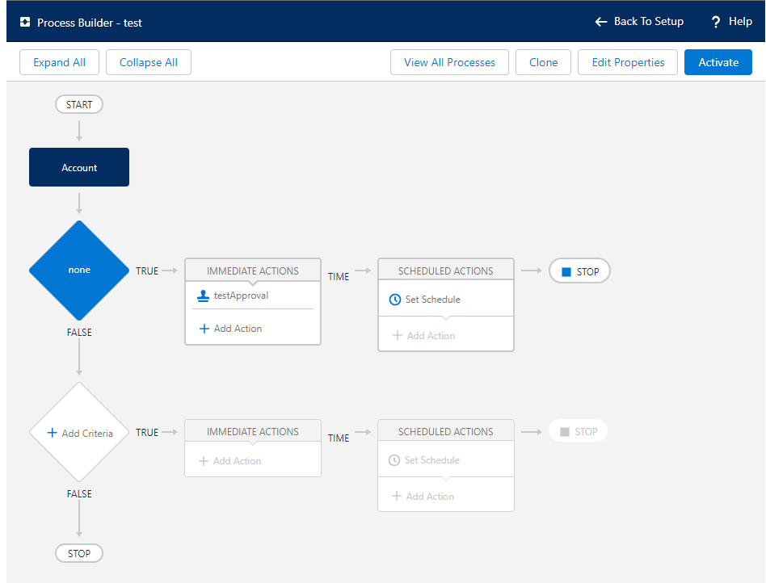
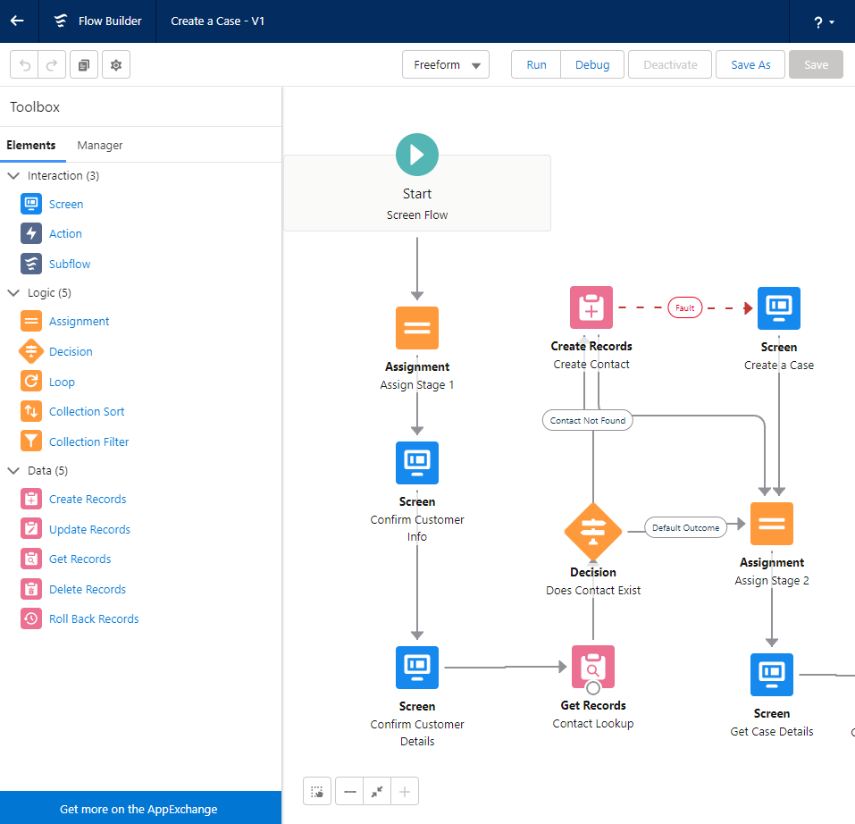
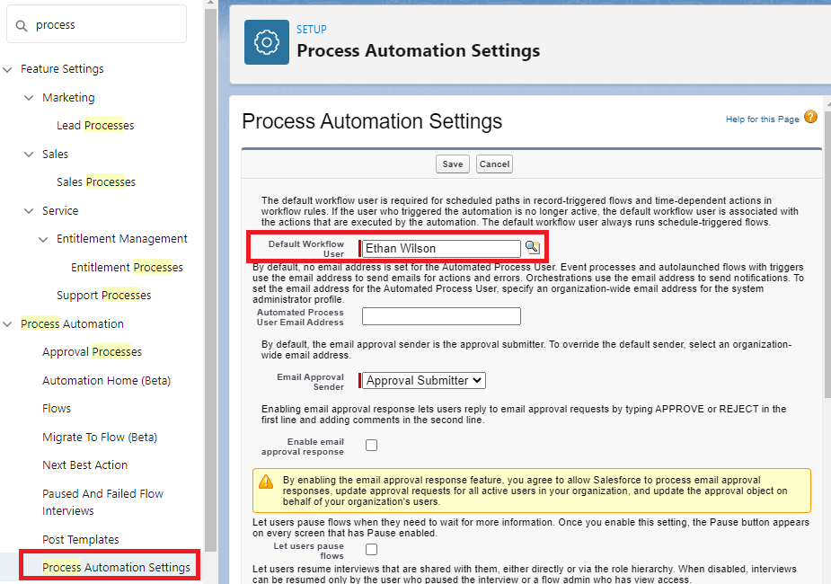
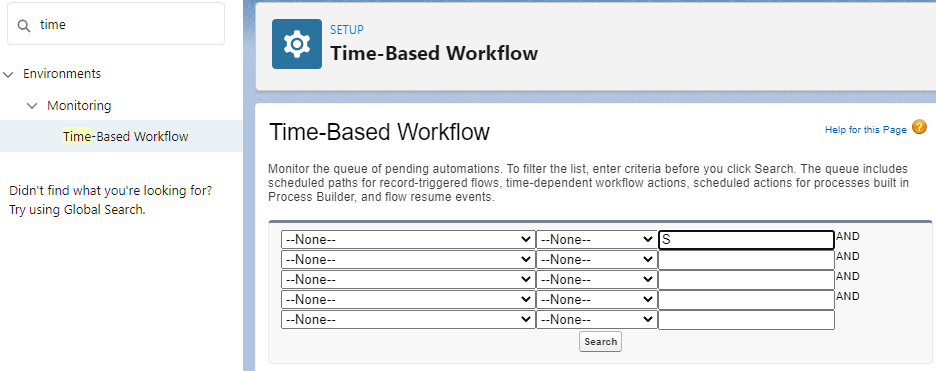
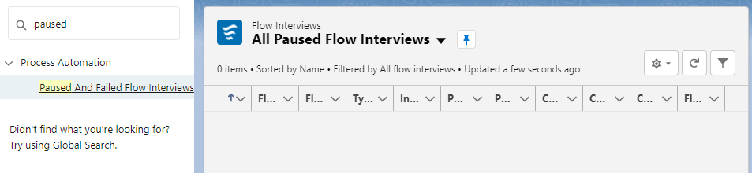

# Module - Admin Process Automation

This module introduces process automation in Salesforce.

#### Helpful References/Links

* [Formulas: How Do I ... ? (Salesforce Help)](https://help.salesforce.com/articleView?id=how_do_i.htm&type=0)
* [Formulas Quick Reference](https://resources.docs.salesforce.com/224/latest/en-us/sfdc/pdf/salesforce_formulas_cheatsheet.pdf)
* [Formula Data Types (Salesforce Help)](https://help.salesforce.com/articleView?id=choosing_a_formula_data_type.htm&type=5)

## The Declarative Frontier

We've discussed previously that it is a best practice to use declarative customizations over 
programmatic customizations whenever possible and we have now arrived at the limit of those 
declarative tools. We will begin this module by discussing basic automation tools such as formula 
fields, before moving on to more complex devices such as workflows and approval processes and ending 
with the most powerful declarative instruments available to us: processes and flows. Behold the 
landscape, beyond the declarative tools discussed in this module lies only wilderness.... well 
actually code is what lies beyond this module, but that's beside the point.

## Formula Fields

We briefly touched on formula fields in the `Admin Data Model` module, but let's give a more comprehensive overview here. When creating formula fields, we build a formula that will be evaluated to a value of the data type we select. At the time that users are creating or updating records, formula fields are read-only - their values are determined by the equation we wrote when creating the field and they cannot be directly edited. Let's walk through the process of creating one of these fields.

After selecting the `Formula` field data type in the first step of creating a new field, you will be presented with the following screen.

Here, we choose the return type of our formula. The available options are `Checkbox` (i.e. a Boolean), `Currency`, `Date`, `Date/Time`, `Number`, `Percent`, `Text`, and `Time`. Note that when choosing the `Currency`, `Number`, or `Percent` return types, we are prompted to choose the number of decimal places for our returned value. If we choose to use a whole number for currency (e.g. zero decimal places), Salesforce will round the returned value to the nearest even number to give that whole number (e.g. $16.50 becomes $16 and $99.3 becomes $100).

# Process Automation

## Workflows 

- A workflow is an automatic process triggered by specific criteria set when it is created. A 
workflow rule is the container of this process.

  - Possible evaluation criteria for workflow rule? 
    - Created
    - Created and every time it’s edited
    - Created and any time it’s edited to subsequently meet criteria
  - Rule criteria settings
    - Criteria are met - You select a field from the record, an evaluation, and value. e.g. Amount equal or greater than 50,000.
    - Formula evaluates to true - You build a formula that evaluates to a boolean value. These can be more complex than a 'simple criteria are met' evaluation.
  - Types of actions a workflow can perform:
    - Create a task (Activities must be enabled on the object)
    - Update field for record that invoked workflow
    - Send Email alert
    - Send Outbound SOAP message
    - mnemonic - CUSS
    - Time dependent workflow actions are available as well
   

   
## Approval processes
- Approval processes allow you to create a multi-step process through which you can designate 
specific actions to be taken based on the stage and approval status.
  - Actions that can be performed with an approval process are:
    - Create task (Activities must be enabled on the object)
    - Update a field
    - Send email alert
    - Send outbound SOAP message
    - mnemonic - CUSS
  - When creating we have the jump start wizard and standard setup wizard.
    - More options in standard setup wizard, we can change things such as: setting up an automated approver based on a field on the record, set up the approval page layout, and specify which users are allowed to submit the initial request for approval.
  - There are multiple stages we can define and customize during the approval process. Each of these 
  stages can have our CUSS actions we defined earlier.
    - Initial submission actions
    - Approval steps, where we can define additional approvers and customize approve and reject actions for each step we define.
    - Final approval actions
    - Final rejection actions
    - Recall actions
  - By default the record is locked from being edited when it has been submitted for approval. Only 
  admins and users with View and modify all permissions could edit it at that point. This is 
  customizable, however.
  - Must click submit for approval… But can set up flows to automatically submit for approval as well.
  

  
## Process builder
- The process builder allows you to create automated processes that execute upon specific criteria 
being met. It is similar in this respect to workflows but has many additional features and enhanced 
capabilities.
  - We have several process types:
    - (record change process) A record change
      - We specify the object and choose to start when either: a record is created or when a record is created or edited.
    - (event process) Platform event message is received
    - (invokable process) Is invoked by another process
  - Then we select the criteria for executing actions
    - Conditions are met
      - Can check status of a certain field and then take actions based on that
    - Formula evaluates to true
    - No criteria – just execute the actions!
  - We can then specify immediate actions to take as well as scheduled actions
    - Run Apex code
      - Method must be annotated with @InvocableMethod
    - Create a record
    - Update a record
    - Send Email alerts 
    - Launch Flows
    - Post to chatter
    - Launch invokable Process
    - Quick actions
    - Work with Quip documents, chat rooms, folders (service that hosts cloud documents)
    - Send custom notification
    - Submit for approval
  - Process builder best practices
    - Only one process per object
    - User isNew() on new record creation only
	

	
## Flows 
- Flows are a powerful declarative tool to perform actions in either your salesforce org or even external systems. We have 5 types of flows available:
  - Record triggered flow – launched when record is created, updated, or deleted
  - Autolaunched flow – launches from Apex, processes, REST API, and more
  - Platform event-triggered flow – launches from platform event messages
  - Screen flow – guides a user through a business process that’s launched from lightning pages, experience cloud sites, quick actions, and more
  - Schedule-triggered flow – launches at specified time and frequency for each record in a batch
  - mnemonic - R.A.P.S.S.
- Flows can:
  - Create/update/delete records
  - Create chatter posts
  - Submit approval requests
  - Send emails
  - Call apex code
    - Method must be annotated with @InvocableMethod 
	- [OR you can use the Process.Plugin interface. This is an older way and not necesarrily recommended](https://help.salesforce.com/s/articleView?id=sf.flow_build_extend_apex.htm&type=5)
  - Create tasks
  - Launch other flows
  - Send custom notifications
  - send outbound SOAP messages (on Professional, Enterprise, Performance, Unlimited, and Developer Editions)
- Flow builder 
  - The flow builder is a gui for flow creation. It features a canvas which represents the flow itself, and a toolbox which includes the elements and resources you can use to build the flow.
    - Flow elements represent actions that a flow can execute, such as reading/writing data, displaying information through screens, and executing business logic.
    - Flow resources reference values that can be referenced throughout the flow.
- We can configure a record trigger flow to trigger when a record is created/updated/ created or updated / deleted
  - When updating records, we can specify if we want the flow to run for every time a record is updated and meets condition requirements or only when a record is updated to meet condition requirements.  
- Record triggered flows can also be configured to add a scheduled path if you want part of or the entire flow to run sometime after the triggering record is created. That scheduled time can be based on when the record is created or based on a field value in the record.

## The default workflow user 
- Required for scheduled paths in record-triggered flows and time-dependent actions in workflow rules. If the user who triggered the automation is no longer active, the default workflow user is associated with the actions that are executed by the automation. The default workflow user always runs schedule-triggered flows.

## What is a platform event?
Secure, scalable, and custom event notifications within salesforce or from external sources based on a publish-subscribe architecture. They can trigger a process or a flow. They are similar to custom objects and are defined in the same way but have an __e suffix. These can be published through processes, flows, Apex, or API.

## Monitoring Processes
Setup > environments > Monitoring > Time-based workflow

- From here we can monitor the queue of pending automations. This includes scheduled record triggered flows, time-dependent workflow actions, scheduled actions build in process builder, and flow resume events.

Setup > process automation > paused and failed flow interviews

- Here we can see any flows that are actively paused or any flows that have failed.

