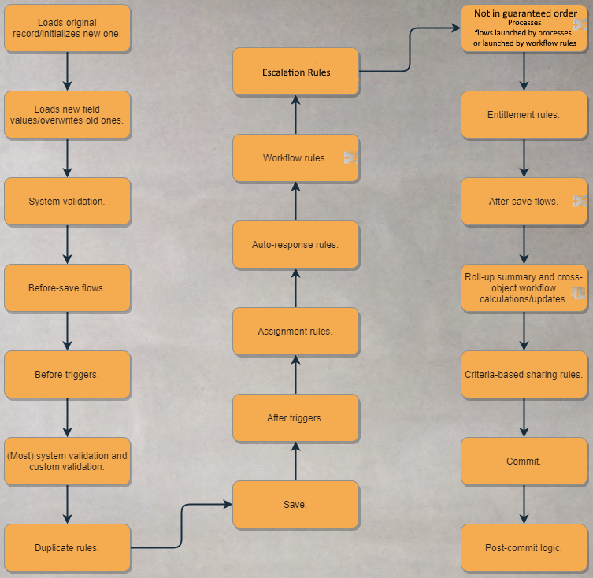
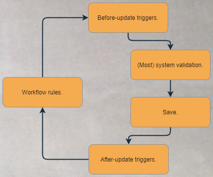
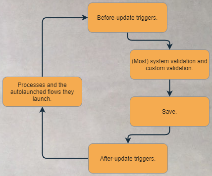
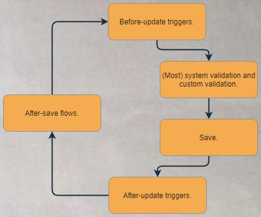
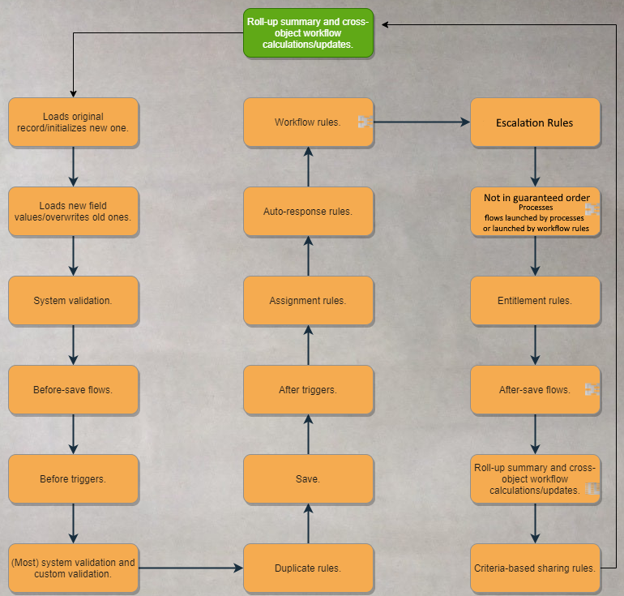

# Module - Order of Execution

This module lists the steps involved in the Order of Execution, considers its consequences, and defines transactions.

### Helpful Links/References

* [Triggers and the Order of Execution (Apex Developer Guide)](https://developer.salesforce.com/docs/atlas.en-us.apexcode.meta/apexcode/apex_triggers_order_of_execution.htm)
* [Order Of Execution, Apex Transactions, and Governor Limits (Trailhead Live)](https://trailhead.salesforce.com/live/videos/a2r3k000001WFqS/order-of-execution-apex-transactions-and-governor-limits/?type=all)
* [Apex Transactions (Apex Developer Guide)](https://developer.salesforce.com/docs/atlas.en-us.apexcode.meta/apexcode/apex_transaction.htm)

## The Save Order of Execution

How does Salesforce keep track of _what_ should happen and _when_ it should happen when we save a 
record? Enter the Save Order of Execution. The Save Order of Execution is the series of steps that 
happen on the server when we invoke any insert, update, or upsert operations on a record, whether by 
using Apex code or pressing the save button in the user interface (on a record page, Visualforce page, 
or Lightning component).

Let's take a look at the steps Salesforce goes through in both of these cases:

Wow, that's a lot! And what's that on a few of those steps, do you have some bugs on your screen? Actually, no - we'll get to to those in a second, but first let's give a more in-depth explanation of some of the steps after a couple of quick sidenotes. First, while our series of steps here differs slightly from the official documentation, the content and order of the two are the same. Secondly, this is the case as of the Summer '20 release of Salesforce, but the Save Order of Execution is liable to change with any Salesforce release and often does.

With that, let's get into our explanations. Starting from the top, the original record is loaded and old field values are overwritten only if we are editing an existing record, not inserting a new one. If we're inserting a new record, it will be initialized in our first step and the new field values will be loaded in the second step before moving on.

If the save comes from the user interface, the system validation in the third step includes actions such as making sure required fields have been given a value (regardless of whether the fields are required on the object itself or only on the particular page layout that the save operation started from), field values adhere to their maximum lengths, unique fields have been given a unique value, the value given to all fields matches the data types set for them, and foreign keys (i.e. relationship fields) aren't pointing to themselves. On the other hand, if the save comes from another source (such as an API), the validation in this step only ensures that the foreign keys on a record aren't pointing to themselves.

When we get to the verification in the sixth step, all system validation (validating required fields, field value lengths and data types, unique fields, and foreign keys) is rerun regardless of where the save request came from, with the exception of checking for values on fields that are only required for the particular page layout - whenever we say that most system validation is rerun, this is what we're excluding. This step is also when our validation rules are executed.

When the record save occurs in the eighth step, we can no longer programmatically edit the record - this is why the records in after triggers are read-only. However, the save only writes data to the database - it doesn't commit it, so the changes can still be rolled back later. But the save does populate system fields including the record's ID, `CreatedDate`, and `CreatedBy` fields if the record is being created and the `LastModifiedDate`, `LastModifiedBy`, and `SystemModStamp` fields regardless of the operation being performed. Therefore, the save step is also the reason we can interact with record IDs in after-insert triggers, but not in before-insert triggers.

Moving on, the commit in our 19th step will only occur at the end of the transaction (which we'll touch on more later), but once it does, we don't have to worry about our changes being be rolled back. On the other hand, if any prior step in the Order of Execution fails, our entire transaction will fail and none of our changes will be persisted.

Our final step, the post-commit logic, is where any outbound messages invoked by workflow rules and any emails or email alerts invoked by auto-response rules, workflow rules, processes, flows, or Apex that occurred during our transaction are sent. Note that these communications are _queued_ in their respective steps in the Order of Execution, but are not actually _sent_ until this step so that they are not sent if the transaction fails. This is also where any asynchronous Apex invoked during the transaction is queued.

Alright, let's get to those bugs on your screen.

### Spurs

Because 20 steps isn't hard enough on its own, we also must discuss the Order of Execution steps that are rerun at certain points throughout the procedure. Let's begin by zooming in on that workflow rule step.

#### Workflow Rules

When we use the field update action on a workflow rule, we're invoking more operations than we may initially realize. A workflow rule field update action that _changes_ a field's value (changes, not updates to the same value) causes the system to rerun before-update triggers, most system validation steps (again, excluding page layout-specific validation), the save, and after-update triggers, as shown by the following image.

Let's make a few observations. First, only the update triggers rerun, even if the initial operation was a record insert/creation. Because the rerun of the before-update triggers occurs before the recursive save, we can still edit the values of the record's fields in these triggers. However, since this spur does not include our validation rules or duplicate rules, a workflow rule can update a field to a value that violates those rules and have that value successfully commited to the database.

Lastly, we may go through this spur multiple times depending on the configuration of our workflow rules. If we have selected the `Re-evaluate Workflow Rules After Field Change` checkbox on the field update action that invoked the spur, then any workflow rules whose criteria are now met but weren't before will execute, causing us to rerun this small series of steps again. This cycle can happen up to five times after the initial spur run through, meaning that these steps can run up to six times in total just from workflow rules.

#### Processes

Let's now move on to detail the processes and the autolaunched flows they invoke. As the image below shows, when a process field update action or an autolaunched flow changes the value of a field, another subset of steps are rerun. This spur again includes before-update triggers, most system validation steps, the save, and after-update triggers. However, it also includes validation rules, which are run along with the system validation.

If we've created a recursive process by selecting the appropriate checkbox in the advanced options of our process configuration, we can again find ourselves rerunning this spur up to five additional times, for a total of six executions of this subseries of steps, so long as at least one of the criteria of the process is satisfied.

#### After-Save Flows

Unlike after triggers, after-save flows can update a field value on the record that invoked the Save Order of Execution. If this update changes a field value, we will again encounter another spur, pictured below. This spur is identical to the one that we just discussed with processes, rerunning before-update triggers, most system validation and validation rules, the save, and after-update triggers.

#### Roll-Up Summaries and Cross-Object Workflows

If the record being updated is the child in a master-detail relationship and its changes are such that the value of a roll-up summary field on the master record changes or one of the workflow rules on the child executes a field update that changes the value of a field on the master record, we will again have more to consider with the Order of Execution. In either of these cases, the master record will go through the entire Save Order of Execution, with the exception of the commit and post-commit logic steps, because these only occur once per transaction.

This spur is represented in the below image, where the green represents the ongoing Save Order of Execution procedure on the detail record.

Notice that this new Order of Execution includes the possibility of all of the spurs we've encountered so far. Because we can chain up to three master-detail relationships together, this spur can be invoked up to three times.

Consider a detail record going through the Save Order of Execution. If an update to one of its field values changes the value of a roll-up summary field on the master record or one of its workflow rules changes the value of a field on the master record, the master will go through its own Order of Execution procedure.

This event can then repeat with the master record invoking changes to the original detail's grandparent and causing it to go through the Order of Execution and the original detail's grandparent then causing changes to the original detail's great-grandparent and invoking the procedure on the great-grandparent record.

Keep in mind that the original Save Order of Execution is still dependent on the success of these spurs - if a step fails on the great-grandparent record, the procedures on the grandparent, parent, and original detail records will fail as well.

## Order Within Steps

When creating triggers and processes, we said that it was a best practice to stick to one trigger per object and one process per object. We want to stick to this best practice to know the order in which our customizations will run - the place of triggers and processes are known in the Order of Execution, but if we have multiple triggers or multiple processes acting on a single object, we have no guarantees about the sequence in which they'll occur within their given steps.

However, if we stick to one trigger, we can determine the order of operations carried out in the code simply by the order of our lines of code. Similarly, our processes will evaluate each criteria node in the order we define them and, unlike workflow rules, the actions we define will be executed in order of their definition as well.

## Transactions

Let's finish this module by discussion transactions and their boundaries. This topic is important because we 
earlier saw that the commit and post-commit logic steps in the Save Order of Execution only happen once in a given 
transaction and we will later see that many of the limits governing the operations we perform in our Apex code are 
also enforced on a per-transaction basis.

Starting off with a definition, a transaction is a collection of operations executed through a single interaction 
with the server. If the entire transaction (and all the records within it) does not successfully proceed through 
all steps of the Save Order of Execution up to the commit step, all changes in the transaction are rolled back 
(note that failing DML operations from Database class methods with `allOrNone` set to `false` are considered 
successful in this context). Simply put, a transaction starts when the Salesforce servers are hit and only ends 
after the commit step.

The boundary of a transaction can be a trigger, class method, anonymous block of code, Visualforce page, or custom 
web service method. E.g., if we click a button on a Visualforce page, all of the triggers and declarative features 
that execute as a result of that click are a single transaction. But because asynchronous Apex is only queued after 
the commit is performed, the execution of any asynchronous code occurs in a separate transaction.

We'll employ an analogy to solidify this concept: when we go to the grocery store, we pay for all of our items at 
once in a single transaction at checkout. It doesn't matter what kinds of groceries we're buying; fruits/vegetables, 
ingredients to make a cake, light bulbs, and even that super-comfy couch are all part of the same transaction.

We might even be buying some items that we weren't originally planning to - maybe some pecans that we're only 
getting as part of that cake recipe. We can think of those pecans as an implicit part of our transaction - we 
weren't planning to get them, but because we're baking that cake, we unintentionally caused ourselves to buy them. 
This is similar to the declarative and programmatic features like triggers and workflow rules that are implicitly 
part of our transactions even if we didn't plan on them being included when we invoked the operation.

But what if this grocery store is cash-only and we don't have enough cash on hand to buy all of our items at once? 
Let's suppose we ask the cashier if they can hold the items we'll buy after running to the ATM and they agree. 
We'll then pay for those items later, in a separate transaction, once we have more cash, just like the separate 
transaction that envelopes asynchronous Apex, which we can use to execute some operations later with a fresh set 
of governor limits.
