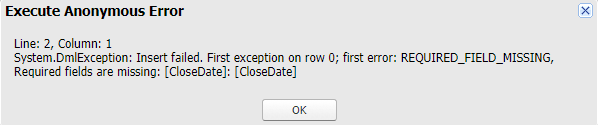
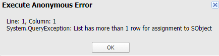
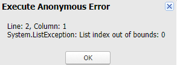
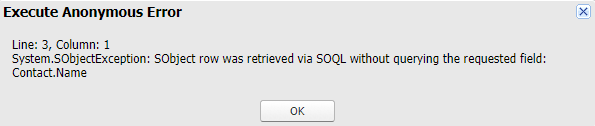
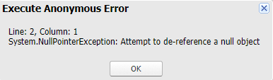
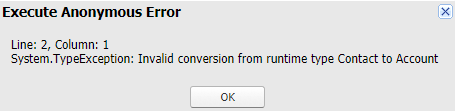
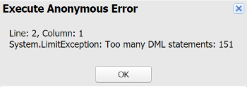
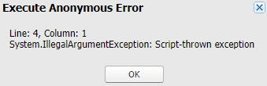
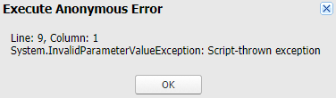
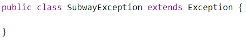

# Module - Apex Exceptions

This module introduces standard exceptions in Apex, exception handling, and custom exceptions.

## Table of Contents

* [Exceptions](#exceptions)
* [Standard Exceptions](#standard-exceptions)
* [Custom Exceptions](#custom-exceptions)
* [Try-Catch-Finally Blocks](#try-catch-finally-blocks)
* [Exception Handling and Methods](#exception-handling-and-methods)
	* [DmlException Methods](#dmlexception-methods)

### Helpful References/Links

* [Exception Class and Built-In Exceptions (Apex Developer Guide)](https://developer.salesforce.com/docs/atlas.en-us.apexcode.meta/apexcode/apex_classes_exception_methods.htm)
* [Exceptions in Apex (Apex Developer Guide)](https://developer.salesforce.com/docs/atlas.en-us.apexcode.meta/apexcode/apex_exception_definition.htm)
* [Create Custom Exceptions (Apex Developer Guide)](https://developer.salesforce.com/docs/atlas.en-us.apexcode.meta/apexcode/apex_exception_custom.htm)

## Exceptions

Sometimes things go wrong. Our alma mater might start the season 0-4, the washer might keep swallowing our socks, or our code fails at runtime. We'll have to hope that Will Levis can solve the first problem, so let's turn our attention to the latter in this module. Note that we're going to explore problems that occur at runtime - not syntax errors, which are found at compile time because Apex is a compiled language.

Exceptions may be unavoidable in some cases, so to that end we'll attempt to have our code fail gracefully through error handling. And of course, because we're going to demonstrate how some exceptions occur, we'll get to break a lot of things throughout this unit.

## Standard Exceptions

There are 26 standard exceptions in the `System` namespace, so let's begin by listing each of them in the table below.

<table>
    <thead>
        <tr>
            <th colspan="3">StandardApexExceptions</th>
        </tr>
    </thead>
    <tbody>
		<tr>
			<td>AsyncException</td>
			<td>BigObjectException</td>
			<td>CalloutException</td>
		</tr>
		<tr>
			<td>DmlException</td>
			<td>EmailException</td>
			<td>ExternalObjectException</td>
		</tr>
		<tr>
			<td>IllegalArgumentException</td>
			<td>InvalidParameterValueException</td>
			<td>LimitException</td>
		</tr>
		<tr>
			<td>JSONException</td>
			<td>ListException</td>
			<td>MathException</td>
		</tr>
		<tr>
			<td>NoAccessException</td>
			<td>NoDataFoundException</td>
			<td>NoSuchElementException</td>
		</tr>
		<tr>
			<td>NullPointerException</td>
			<td>QueryException</td>
			<td>RequiredFeatureMissing</td>
		</tr>
		<tr>
			<td>SearchException</td>
			<td>SecurityException</td>
			<td>SerializationException</td>
		</tr>
		<tr>
			<td>SObjectException</td>
			<td>StringException</td>
			<td>TypeException</td>
		</tr>
		<tr>
			<td>VisualforceException</td>
			<td>XmlException</td>
			<td></td>
		</tr>
	</tbody>
</table>

Wow, that's a lot of exceptions! Some of these may look familiar, and many have names that divulge what invokes them. But let's begin by categorizing them into seven groups.

Group one, external services, includes `CalloutException`, `EmailException`, and `ExternalObjectException`. Next up is group two, database, holding `DMLException`, `QueryException`, `SearchException`, and `SObjectException`. Group three corresponds to data types and variables and contains `IllegalArgumentException`, `ListException`, `NullPointerException`, `StringException`, and `TypeException`.

Our fourth group is made of `InvalidParameterValueException`, `NoAccessException`, `NoDataFoundException`, `SerializationException`, and `VisualforceException` and relates to Visualforce. The fifth group, data formats, holds `JSONException` and `XmlException`. The sixth category, uncatchable exceptions, is a pretty lonely bunch because it only contains `LimitException`. Finally, our last group, miscellaneous, contains `AsyncException`, `BigObjectException`, `MathException`, `NoSuchElementException`, `RequiredFeatureMissing`, and `SecurityException`.

We'll provide at least a brief description of all of these errors, but we'll give some of the more common ones - namely `DmlException`, `IllegalArgumentException`, `InvalidParameterValueException`, `LimitException`, `ListException`, `NullPointerException`, `QueryException`, `SObjectException`, and `TypeException` - some more air time. Let's begin with our brief descriptions through the following table, which includes an example for a select number of the exceptions.

| Standard Exception | Is Thrown When There's a Problem with... | Example |
| ------------------ | ----------------------------------------- | ------- |
| AsyncException | An asynchronous operation | Exceeding the limit of 100 batch jobs in the Apex Flex Queue |
| BigObjectException | A big object | A connection timeout when querying a big object using SOQL |
| CalloutException | A webservice callout | Callout to an invalid URL |
| EmailException | An email sent from Apex code | Attempting to send an email to a contact without an email address |
| ExternalObjectException | An external object | An invalid external data source URL when trying to query an external object |
| JSONException | Serializing or deserializing JSON | |
| MathException | A problem with a mathematical operation | Dividing by zero |
| NoAccessException | Unauthorized access from a Visualforce page | A user who doesn't have permission to run flows attempting to invoke a flow from a Visualforce page |
| NoDataFoundException | Trying to find data that doesn't exist from a Visualforce page | Passing the Id of a deleted record as a URL parameter to a Visualforce page that is overriding a record view page |
| NoSuchElementException | A collection iterable trying to access an out-of-bounds element | |
| RequiredFeatureMissing | A required Chatter feature when Chatter hasn't been enabled | |
| SearchException | A SOSL query | Search string under two characters |
| SecurityException | A static method in the Crypto utility class | |
| SerializationException | An attempt to serialize data in a Visualforce page | |
| StringException | A string | Using an out-of-bounds starting index with the substring() method |
| VisualforceException | A Visualforce page | |
| XmlException | The use of the XmlStreamReader or XmlStreamWriter classes | Attempting to use one of the write methods from the XmlStreamWriter class after the input stream has been closed |

Okay, let's leave those aside and get to the exceptions that we encounter more commonly. We'll begin with the `DmlException`, which is raised when we have an issue with a DML operation. For example, we may try to insert an opportunity with the following code:

```apex
Opportunity opp = new Opportunity(Name='Large Cheesecake Order',
	StageName='Prospecting');
insert opp;
```

But because we've forgotten to include a value for the required `CloseDate` field, we'd get the following message.

<p align="center"></p>

Continuing in the spirit of interacting with the database, let's turn to `QueryException`, which is raised when there's a problem with a SOQL query. We'll most commonly encounter it when we're attempting to assign the result of a query that returns either zero or multiple records to a single sObject, like with the following code.

```apex
Contact con = [SELECT Id FROM Contact WHERE Account.Name='Edge Communications'];
```

Which invokes the error:

<p align="center"></p>

To avoid this problem, we could use the `LIMIT` clause in our query to ensure that no more than one record is returned, but this would still leave the possibility of an error when no records fit our query criteria. The better way to steer clear of this exception is to assign the result of all queries to lists of sObjects, rather than single sObjects.

We can still run into difficulties here though. If our query returns zero records and we assign that result to a list, we won't raise the `QueryException`. But as soon as we try to explicitly access the nonexistent account at any of that list's indices, we'll get the `ListException`, which we can accidentally raise through the following code.

```apex
List<Account> accs = [SELECT Id FROM Account WHERE Name='Edge'];
System.debug(accs[0].Name);
```

Which gives us the error:

<p align="center"></p>

Because the `ListException` occurs whenever we have a problem working with a list - most commonly when trying to access an out-of-bounds index (either the zeroth index in a list with no elements or an index greater than or equal to the number of elements in the list) - we can avoid it by not accessing any list indices directly. Our solution is then the collection `for` loop, like we implement in the below code.

```apex
List<Account> accs = [SELECT Id FROM Account WHERE Name='Edge'];
for(Account a : accs) {
	System.debug(a.Name);
}
```

Because our list has no elements, our `for` loop won't have any iterations, so we'll avoid referring to a non-existent list element.

Another exception that we can encounter when working with SOQL is the `SObjectException`, which will be raised if we successfully execute a query, but attempt to reference a field that we didn't query for (as we try to do in the below code).

```apex
List<Contact> cons = [SELECT Id FROM Contact WHERE Account.Name=
	'Edge Communications'];
for(Contact c : cons){
	System.debug(c.Name);
}
```

This code invokes the exception:

<p align="center"></p>

Note that we can _assign_ values to fields that we haven't retrieved in SOQL queries, but we cannot _reference_ those fields until we assign them values.

`NullPointerException`, which occurs in a similar set of circumstances, is thrown anytime we attempt to dereference a `null` value. Consider the following code block, where we're trying to create a new contact.

```apex
Contact c;
c.Name = 'Jake';
```

Because we've forgotten to initialize the contact through a constructor call, it still has a `null` value. When we attempt to access the `Name` field of `c`, we're trying to get the `Name` of a `null` value, which by definition has no fields to access. Therefore, we encounter the following problem:

<p align="center"></p>

This example is emblematic of most times we'll run into this exception - i.e. its most common cause is that we've forgotten to initialize a variable, so we can eliminate it with a quick constructor call.

Let's continue using examples with contacts by turning to `TypeExceptions`, which happen when there's a problem when attempting to convert a value from one data type to another. Consider the following code block where we're attempting to convert an instance of a `Contact` assigned to a generic `SObject` to an instance of an `Account`.

```apex
SObject sobj = new Contact();
Account a = (Account) sobj;
```

Here, we get the exception:

<p align="center"></p>

Of course, we might not be working with generic `SObjects` all that often, so we'll probably run into the `LimitException` more often. This error occurs whenever our code exceeds a governor limit, so because the governor on the number of DML operations in a single transaction is 150, the following code raises this exception (pictured following the code).

```apex
for(Integer i = 0; i < 200; i++) {
	insert new Contact(LastName='Creative Name ' + i);
}
```

<p align="center"></p>

Note that the system doesn't care _how_ much we exceed a limit by, as soon as we exceed the limit (with our 151st DML statement in this case), the exception is thrown.

It's much more difficult to run into `IllegalArgumentException` and `InvalidParameterValueException`. These exceptions occur when an illegal argument is given when calling a method (`IllegalArgumentException`) and an invalid parameter value is given to a method or there's an issue with a URL parameter for a Visualforce page (`InvalidParameterValueException`). Wait... aren't an invalid parameter value and an illegal argument pretty much the same thing?

Well, kind of - the documentation says that an `IllegalArgumentException` is thrown when, e.g., a method that requires a non-`null` value is given a `null` value. On the other hand, we could paint a picture where an `InvalidParameterValueException` is thrown when a non-`null` value is given to a method, but the argument doesn't meet other conditions. But still, this difference is more than a little semantical and honestly, in practice, it'll be fairly difficult to run into either of these exceptions.

Recall that our code must be compiled before it can be saved to our org as metadata and later executed. The compiler is pretty smart - if we try to pass a `null` value to a system-defined method that needs non-`null` values, the compiler will catch it. It'll similarly stop us if we attempt to pass a parameter of an incorrect type to a method.

Therefore, we'll probably only run into these exceptions when they're thrown by custom code. Oh yeah - we can throw standard exceptions ourselves. Take the following method, which creates records of a custom object containing information about completed batch Apex jobs so that they can be viewed in the UI.

```apex
public class CreateBatchJobInfo {
    public static void createRecord(Id aajId) {
        if(aajId == null) {
            throw new IllegalArgumentException();
        }
        
        List<AsyncApexJob> aajs = [SELECT Id, ApexClassId, JobItemsProcessed,
			NumberOfErrors FROM AsyncApexJob WHERE JobType='BatchApex' AND
			Status='Completed' AND Id = :aajId];
        if(aajs.size() == 0) {
            throw new InvalidParameterValueException('aajId',
				'Not completed batch job');
        }
        
        String batchClassName = [SELECT Name FROM ApexClass WHERE Id = 
			:aajs[0].ApexClassId].Name;
        BatchJobInfo__c bji = new BatchJobInfo__c(
			Batch_Apex_Class__c=batchClassName,
			Failed_Batches__c=aajs[0].NumberOfErrors,
			Successful_Batches__c=
				aajs[0].JobItemsProcessed - aajs[0].NumberOfErrors);
        insert bji;
    }
}
```

When our method receives a `null` Id, it throws an `IllegalArgumentException` (shown in the first image below). When it is passed the `Id` of a record that isn't a completed batch `AsyncApexJob`, it throws an `InvalidParameterValueException` (displayed in the second image below). Note that we can see that these are exceptions thrown by custom code because of the `Script-thrown exception` error message. Note also that the constructor for the latter exception takes two strings - all other standard exceptions have constructors that require no arguments.

<p align="center"></p>

<p align="center">

## Custom Exceptions

While we can throw standard exceptions, there might be times where there's not really a standard exception whose name fits our use case and we'd rather create and throw our own custom exception. We can accomplish the first part of this goal by simply making a new Apex class that has a name ending in `Exception` and extends the `Exception` superclass. Note that this suffix is a requirement - we can't create a custom exception that doesn't end with `Exception`. If we're working in the Developer Console and we create a class with such a suffix, the IDE will automatically add the extension to our signature for us, as the default template below displays.

<p align="center"></p>

Once we've created the exception, we can throw it anywhere in our code by using the `throw` keyword, followed by an instance of the Apex class that represents our exception, e.g. `throw new SubwayException()` to invoke the error that we created above.

There are four constructors that we can use with our custom exceptions. The first takes no arguments and may therefore be a little boring. The next constructor takes a single string which will represent our exception method. We can alternately invoke the third constructor by passing an instance of a different exception. Finally, we can invoke the fourth constructor by passing both a string to serve as an error message and an instance of an existing exception.

We'll see the value of these last two constructors throughout the remainder of this module when we discuss exception handling and inherited methods from the `Exception` superclass. But because our custom exceptions are classes themselves, we can override these superclass methods (with the exception of `getTypeName()`) as part of the class body that we can choose to write.

## Try-Catch-Finally Blocks

At the beginning of this module, we said that our goal was to "fail gracefully" in cases where exceptions are unavoidable. Well, we've certainly demonstrated many ways to fail so far, but we haven't really touched that "gracefully" part yet. Enter exception handling.

Our main way of exception handling in Apex, as in many other languages, is the `try-catch-finally` block, which allows us to deal with any error and continue execution without crashing. Let's explain each member of this group.

First is the `try` block, which contains code that could possibly throw an exception. Following the `try` block, we can have one or more `catch` blocks that capture any errors thrown in the `try` block and handle them. These `catch` blocks have a single parameter - an instance of the type of exception they handle. These can be specific exceptions, such as `DmlException`, or the generic `Exception`. However, because all exceptions are instance of that latter superclass, we should put any `catch` blocks that work with generic exceptions last or our other `catch` blocks will never be reached. We should also note that we cannot have multiple `catch` blocks related to the same `try` that handle the same error.

Lastly, we can conclude the series with the `finally` block, which will execute both in the case that the code in the `try` block raised an exception _and_ in the case that it didn't. We commonly use these blocks to perform any necessary cleanup of resources.

Note that `try` blocks don't like to be lonely - they must be followed by either a `catch` or `finally`. `Try-catch` blocks (with no `finally`) and `try-finally` blocks (with no `catch`) are both valid, but, in the latter case, another entity must capture the exception - an uncaught error will cause our code to crash and the corresponding message will be displayed in the user interface (if our code was invoked by a user), even if we have a `try-finally` block. Finally, `try-catch-finally` blocks will not work for any `LimitExceptions` because these errors cannot be caught.

## Exception Handling and Methods

So we've now discussed how to ensure our code doesn't crash by implementing `try-catch-finally` blocks, but we haven't really made them incredibly useful yet. For example, we haven't touched on how we can print the error message to the debug logs. Luckily, as we alluded to earlier, because all exceptions (both standard and custom) extend the `Exception` superclass, they inherit the methods from that class, which are listed in the following table.

| Method | Parameter Type | Return Type | Purpose |
| ------ | -------------- | ----------- | ------- |
| getCause() | N/A | Exception | Returns nested exception |
| getLineNumber() | N/A | Integer | Returns code line number that threw exception |
| getMessage() | N/A | String | Returns exception message |
| getStackTraceString() | N/A | String | Returns stack trace |
| getTypeName() | N/A | String | Returns type of exception |
| initCause() | Exception | void | Sets exception cause |
| setMessage() | String | void | Sets exception message |

These last two methods are particularly useful when we're capturing and rethrowing exceptions. For example, let's consider our `CreateBatchJobInfo` class from earlier. Instead of having the `createRecord()` method handle its own problems, perhaps we'd like to have whatever called the method take care of them. In fact, we've kind of already made this a requirement because our method doesn't have any error handling as currently constructed.

However, it's not incredibly useful to know that an `InvalidParameterValueException` or `IllegalArgumentException` occurred _somewhere_ in our code - we'd probably like to know what part of our code threw it. To that end, let's create a new custom exception named `BatchJobInfoException` and add some `catch` blocks to our `createRecord()` method.

```apex
public class CreateBatchJobInfo {
    public static void createRecord(Id aajId) {
        try {
            if(aajId == null) {
                throw new IllegalArgumentException();
        	}
        
        	List<AsyncApexJob> aajs = [SELECT Id, ApexClassId, JobItemsProcessed,
				NumberOfErrors FROM AsyncApexJob WHERE JobType='BatchApex' AND
				Status='Completed' AND Id = :aajId];
        	if(aajs.size() == 0) {
            	throw new InvalidParameterValueException('aajId',
					'Not completed batch job');
        	}
        
        	String batchClassName = [SELECT Name FROM ApexClass WHERE Id =
				:aajs[0].ApexClassId].Name;
        	BatchJobInfo__c bji = new BatchJobInfo__c(
				Batch_Apex_Class__c=batchClassName,
				Failed_Batches__c=aajs[0].NumberOfErrors,
				Successful_Batches__c=
					aajs[0].JobItemsProcessed - aajs[0].NumberOfErrors);
        	insert bji;
        } catch(IllegalArgumentException e) {
            throw new BatchJobInfoException('Exception in createRecord():' + 
				'aajId cannot be null', e);
        } catch(InvalidParameterValueException e) {
            throw new BatchJobInfoException('Exception in createRecord() ' + 
				'aajId is not the record Id of a completed batch job', e);
        } catch(Exception e){
            throw new BatchJobInfoException(e);
        }
    }
}
```

Wait, we didn't use the `setMessage()` or `initCause()` methods at all! Well perhaps we didn't call them _explicitly_, but these methods were used under the hood. Let's explain: the two-parameter version of custom exception constructor that we use when throwing our custom exception calls `initCause()` so that the original exception is set as the cause of our new custom exception (i.e. the original exception is nested as an inner exception) and included in any stack trace invoked on the custom exception. It also makes an implicit call to `setMessage()` so that our `BatchJobInfoException` has the string we passed to the constructor as its message. In our final `catch` block, we pass only the instance of `Exception` to our constructor, so that only the `initCause()` method is used.

Of course, we could just construct a new instance of our custom exception using the zero-argument constructor and explicitly call both methods ourselves, but that just sounds like _so_ much more code to write. Additionally, if we attempt to call the `initCause()` method on a captured exception that already has a cause we'll... raise another exception (a `TypeException` to be specific).

### DmlException Methods

Let's finish this module by diving a little deeper into the `DmlException`, which holds a special place in the standard errors. This entity will hold all failed records and all problems with those records. In fact, it has its own set of methods beyond those that are inherited from the `Exception` parent class. Let's list these new methods in the following table.

| Method | Parameter Type | Return Type | Purpose |
| ------ | -------------- | ----------- | ------- |
| getDmlFieldNames() | Integer | List\<String> | Returns names of field(s) that raised the exception for the specified record |
| getDmlFields() | Integer | List<Schema.sObjectField> | Returns instances of field(s) that raised the exception for the specified record |
| getDmlId() | Integer | String | Returns Id of specified record |
| getDmlIndex() | Integer | Integer | Returns index of specified record in failing DML statement |
| getDmlMessage() | Integer | String | Returns exception message for specified record |
| getDmlType() | Integer | System.StatusCode | Returns System.StatusCode enum for specified record |
| getNumDml() | N/A | Integer | Returns number of failed records |

If a record failed while we were attempting to insert it, the `getDmlId()` method will return `null`. This makes sense because the record never successfully made it into the database, so it can't have been given an Id. The `getDmlIndex()` method will return `0` for any DML operations that act on a single record. This highlights how the failing records are zero-indexed in our `DmlException`. Lastly, the `System.StatusCode` enum returned by `getDmlType()` has a large variety of values, such as `REQUIRED_FIELD_MISSING`.
