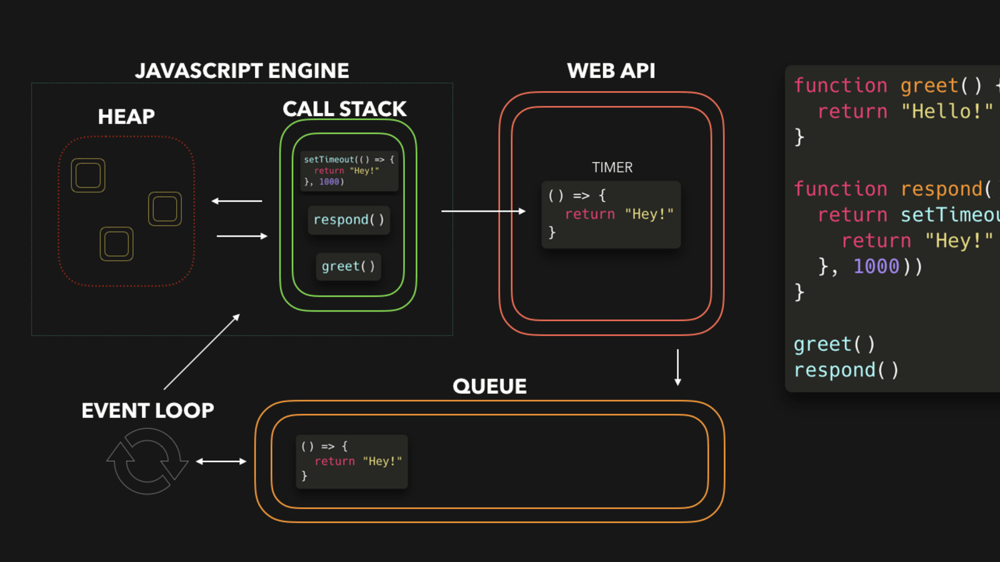

## Async JS

## Event Loop
JavaScript can be described as synchronous, blocking, or single threaded. Meaning that only one operation can be in progress at any given time. We have a few tools that we can use to try and work around that problem, but we will discuss those a bit later. 
For now, we need to get to grips with what exactly JavaScript is doing under the hood. There are a few pieces at play here: the call stack, event loop, and message queue.
The call stack is connected to our message queue by way of our event loop. The event loop’s job is to check if the call stack is empty and, if so, supply the call stack a function from our message queue. Our message queue is a first in, first out structure. 
As our event loop supplies a function from the message queue, the function gets put into a stack frame. These stack frames get placed into the call stack. This is a structure that is first in, last out. When one function calls another, a new stack frame is placed on top of it. This continues until the inner most function returns, at which point the stack frame is “popped” off of the stack. This will happen for each of the functions until the call stack is empty. This is our single thread of JavaScript in action. 
Now that we know this process, where does asynchronous behavior fit in? 
Well, there are certain browser APIs that we have available that handle our asynchronous tasks for us. Some examples would be setTimeout, DOM events, or a XMLHttpRequest. When the JavaScript runtime detects an asynchronous function in the callstack, it returns immediately, and the process continues within the browser API. When that task finishes in the browser API the results are sent to the message queue, where it can then be picked back up by the event loop and make it’s way to the call stack to be processed.



## Callbacks
A callback is a function that can be passed in as an argument to another function. This allows a function to call another function and the callback can then be run after another function has finished. This was used a lot more in the past with XMLHttpRequests as an example. You would have to define callback functions for success or failure scenarios depending on the data you got back. This could often lead to very nested and ugly looking code that was hard to maintain. Hence, promises. 

## Promises
Promises give you a pretty big hint of what they do right in the name. They are an action or task that is yet unfulfilled. A promise can go two ways, they can be resolved, or they can be rejected. 

```
// "Producing Code" (May take some time)
let myPromise = new Promise(function(myResolve, myReject) {

  myResolve(); // when successful
  myReject();  // when error
});

// "Consuming Code" (Must wait for a fulfilled Promise)
myPromise.then(
  function(value) { /* code if successful */ } 
)
.catch(
function(error) { /* code if some error */ }
);
```

Another example
```
let myPromise = new Promise(function(myResolve, myReject) {
  setTimeout(function() { myResolve("HII !!"); }, 3000);
});

myPromise.then(function(value) {
  //do stuff here with value
});
```
## Async/Await

Async and Await are two keywords that we can use that make promises easier to write. Async makes a function return a promise, while await makes a function wait for a promise. These keywords can help us avoid “.then()” nesting. 

```
async function myAsync() {
    let myPromise = new Promise(function(myResolve, myReject) {
        setTimeout(function() { myResolve("HII x2 !!"); }, 3000);
    });

    let message = await myPromise;
    console.log(message);
}

myAsync();
```

## Fetch API
