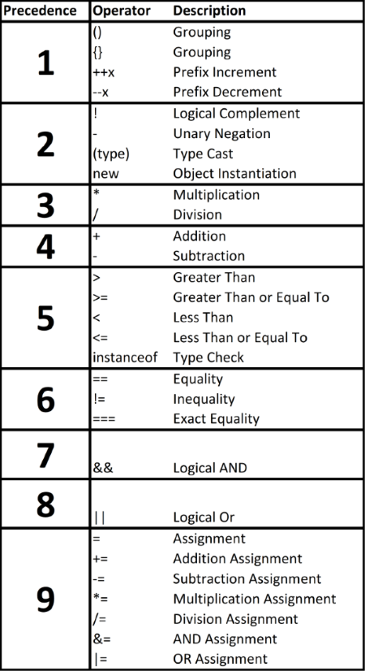

# Module - Introduction to Apex

This module introduces Apex.

## Table of Contents

- [Module - Introduction to Apex](#module---introduction-to-apex)
  * [Table of Contents](#table-of-contents)
    + [Helpful References/Links](#helpful-references-links)
  * [Apex Programming!](#apex-programming-)
  * [Object Orientation](#object-orientation)
  * [Methods](#methods)
  * [Primitive Variables and Assignment Statements](#primitive-variables-and-assignment-statements)
  * [Objects, Objects, and ... Objects?](#objects--objects--and--objects-)
  * [The sObject Type](#the-sobject-type)
    + [API Names](#api-names)
    + [Working with sObjects](#working-with-sobjects)
  * [Apex Type Casting](#apex-type-casting)
  * [Enum](#enum)
  * [Collections](#collections)
    + [Lists](#lists)
    + [Sets](#sets)
    + [Maps](#maps)
    + [Collection Nesting](#collection-nesting)
  * [Operators and Precedence](#operators-and-precedence)
  * [Control Flow](#control-flow)
  * [Conditionals](#conditionals)
    + [Switch Statements](#switch-statements)
    + [While Loops](#while-loops)
    + [Do-While Loops](#do-while-loops)
    + [For Loops](#for-loops)
  * [Comments and Comment Best Practices](#comments-and-comment-best-practices)
  * [Apex Development Environments](#apex-development-environments)

### Helpful References/Links

* [Apex Developer Guide](https://developer.salesforce.com/docs/atlas.en-us.apexcode.meta/apexcode/apex_dev_guide.htm)
* [Apex (Salesforce Developer Centers)](https://developer.salesforce.com/developer-centers/apex)
* [Intro to Apex Code for Programmers Webinar (Salesforce Developers, YouTube)](https://www.youtube.com/watch?v=WBeCWlbGX38)
* [When Should I Use Apex? (Apex Developer Guide)](https://developer.salesforce.com/docs/atlas.en-us.apexcode.meta/apexcode/apex_intro_when_use_apex.htm)
* [Salesforce Platfrom API Versions 21.0 through 30.0 Retirement](https://help.salesforce.com/s/articleView?id=000354473&type=1)
* [Delete Custom Objects (Salesforce Help)](https://help.salesforce.com/articleView?id=dev_deleting_custom_objects.htm&type=5)
* [Delete Fields (Salesforce Help)](https://help.salesforce.com/articleView?id=deleting_fields.htm&type=5)
* [Passing Parameters by Reference and By Value in Apex (Salesforce Developers Blog)](https://developer.salesforce.com/blogs/developer-relations/2012/05/passing-parameters-by-reference-and-by-value-in-apex.html)
* [Reserved Keywords (Apex Developer Guide)](https://developer.salesforce.com/docs/atlas.en-us.apexcode.meta/apexcode/apex_reserved_words.htm)
* [Primitive Data Types (Apex Developer Guide)](https://developer.salesforce.com/docs/atlas.en-us.apexcode.meta/apexcode/langCon_apex_primitives.htm)
* [sObject Types (Apex Developer Guide)](https://developer.salesforce.com/docs/atlas.en-us.apexcode.meta/apexcode/langCon_apex_SObject_types.htm)
* [Rules of Conversion (Apex Developer Guide)](https://developer.salesforce.com/docs/atlas.en-us.apexcode.meta/apexcode/langCon_apex_rules_of_conversion.htm)
* [Enums (Apex Developer Guide)](https://developer.salesforce.com/docs/atlas.en-us.apexcode.meta/apexcode/langCon_apex_enums.htm)
* [Enum Methods (Apex Devleoper Guide)](https://developer.salesforce.com/docs/atlas.en-us.apexcode.meta/apexcode/apex_methods_system_enum.htm)
* [Collections (Apex Developer Guide)](https://developer.salesforce.com/docs/atlas.en-us.apexcode.meta/apexcode/langCon_apex_collections.htm)
* [List Class (Apex Developer Guide)](https://developer.salesforce.com/docs/atlas.en-us.apexcode.meta/apexcode/apex_methods_system_list.htm#apex_methods_system_list)
* [Set Class (Apex Developer Guide)](https://developer.salesforce.com/docs/atlas.en-us.apexcode.meta/apexcode/apex_methods_system_set.htm)
* [Map Class (Apex Developer Guide)](https://developer.salesforce.com/docs/atlas.en-us.apexcode.meta/apexcode/apex_methods_system_map.htm#apex_methods_system_map)
* [Expressions and Operators (Apex Developer Guide)](https://developer.salesforce.com/docs/atlas.en-us.apexcode.meta/apexcode/langCon_apex_expressions.htm)
* [Using the instanceof Keyword (Apex Developer Guide)](https://developer.salesforce.com/docs/atlas.en-us.apexcode.meta/apexcode/apex_classes_keywords_instanceof.htm)
* [Control Flow Statements (Apex Developer Guide)](https://developer.salesforce.com/docs/atlas.en-us.apexcode.meta/apexcode/langCon_apex_control_flow.htm)
* [Writing Apex Using Development Environments (Apex Developer Guide)](https://developer.salesforce.com/docs/atlas.en-us.apexcode.meta/apexcode/apex_intro_writing_apex.htm)

## Apex Programming!

Alright, without further ado, the moment we've all been waiting for: it's time to start programming on the Salesforce platform with Apex. Created in 2007, Apex is Salesforce's case-insensitive, cloud-hosted, Java-like, multitenant-aware, object-oriented, proprietary, strongly-typed, tightly-integrated, versioned programming language. Whoa, that's a lot of adjectives (and hyphens) that we'll further explain shortly, but first let's discuss when we want to use Apex in the first place.

As a best practice, we want to exhaust all of our capabilities for declarative development before turning to writing our own code, so a lot of our Apex use cases will be when we need a more powerful [insert declarative feature here]. For example, we use Apex when we want to create custom validation more complex than what's allowed by Validation Rules, more powerful business process automation than can be done through Process Builder or flows, or record access through sharing that will persist across ownership changes. In addition, we turn to Apex when we want to write custom backend functionality for our programmatic user interfaces and when we want to create custom webservices instead of utilizing one of Salesforce's out-of-the-box APIs.

Okay, on to our adjectives. First, Apex is case-insensitive, meaning that the language sees no difference between upper and lowercase characters in variable names, class names, method names, and keywords. Therefore, we could define a variable named `pittsburghSteelers` and later refer to it as `PittsburghSteelers` without any problems. Note, however, that string literals are still case-sensitive. For example, consider the following code:

```java
String pittsburghSteelers = 'undefeated';
PittsburghSteelers = 'Undefeated';
```

Because variable names are case-insensitive, we had no trouble referring to the variable we declared in the first line with the code in the second line. But because string literals in Apex are case-sensitive, the value of the variable changed from the first to second line.

It is your ever-humble author's opinion that we should use Apex like we would responsibly use a case-sensitive language, despite its characteristics. We'll be working with other, case-sensitive, languages throughout training, so treating everything as case-sensitive will reduce our chance for simple syntax errors. In addition, we should strive to write clear, clean code with consistent format and syntax, and taking "advantage" of case-insensitivity would arguably violate this principle.

But the coin has two sides - when we say "like we would responsibly use a case-sensitive language," we have some best practices to adhere to there as well. We can take "advantage" of case-sensitivity in some languages by having one variable named `counter` and another named `Counter`, but this would make our code much more difficult for other developers (and us) to read.

Okay, let's move on to another couple of our adjectives. Apex is a proprietary language and therefore Salesforce determines how and where we can use the language. The "where" is the Lightning platform, which interprets our code. Because the Lightning platform is hosted in the cloud, Apex is cloud-hosted as well.

However, this does not mean that we can't ever get local copies of our Apex code. In fact, we can quite easily pull down Apex to a local environment from the cloud to, e.g., store it in a version control system or migrate it to a different org. We just can't execute any Apex code locally.

Despite its unique characteristics, Apex will likely look familiar to us. Even though the underlying implementation of the two languages is pretty different, Apex syntax looks pretty similar to Java syntax. By extension, Apex has a fair amount in common with the C family of languages (C, C++, etc.). If we've programmed before, we shouldn't have too much trouble picking up Apex.

The differences we've highlighted so far don't seem too substantial, so what _truly_ makes Apex unique? We'll highlight many distinct properties, but they all draw from the idea that Apex isn't just used to work with and manipulate the Lightning platform - rather the language _is_ a part of the platform itself.

Salesforce is a multitenant environment and Apex knows this, therefore Apex is designed to function efficiently to ensure that the many different Salesforce customers are able to execute their operations using the same shared resources without performance issues. One of the ways this efficiency is enforced is through the Apex governor limits that we'll discuss in a subsequent module, creatively named `Governor Limits`.

But the relationship between Apex and the platform doesn't just stop us from hogging all of the resources to ourselves - it also lets us interact with our org's database quite easily. We can use the language's built-in support for inline `DML`, `SOQL`, and `SOSL` without performing any prior setup.

This integration extends to declarative configurations. Apex allows us to work with instances of all standard objects and standard fields. In addition, any custom objects and fields that we declare in the user interface are available for use in our code as well. The relationship goes both ways: any custom object or custom field referenced in Apex can't be deleted nor have its API name changed, so we don't have to worry about an administrator (or our own forgetful selves) breaking our code without realizing it.

But surely we have to worry about our code breaking when Salesforce automatically releases updates three times a year, right? Not the case, and to explain why, let's talk about what happens when a Salesforce release occurs. Each Salesforce release has its own API version and this number is incremented with each subsequent release. For example, the API version of the `Winter '21` Salesforce update is `50.0`.

When our Apex code is saved in our org, it's also saved with an API version. By default, it uses the current API version, although we can choose versions as far back as `21.0`. That's the `Summer '10` Salesforce update for those of us keeping track at home; although Salesforce has recently been retiring API versions and plans to retire everything before API version `31.0` (the `Summer '13` Salesforce release) with the `Summer '22` update. But as long as the API version we've chosen is still supported, when our code is invoked, the system retrieves it and executes it in the context of that API version. That's right - we can run code in an environment designed for a time before One Direction existed.

So if our code will be supported across Salesforce releases, why should we ever update it - we don't want to fix what isn't broken, right? Not so fast - although Salesforce maintains support for our code by supporting prior API versions, we still have some maintenance to consider. This ties in to one of the reasons we want to develop declaratively when we can - Salesforce supports declarative customizations across releases _and_ our existing declarative configurations get to take advantage of the newest features included in the current release.

When we develop programmatically with Apex, we'll still get the support across updates, but _we_ assume the burden of maintenance. If we want to code using the newest Apex has to offer, we'll have to change the API version of that code. If something within our code has been deprecated between API versions, we'll have to rewrite at least some of it (this is the key point here and more broadly when we compare the advantages and disadvantages of developing declaratively and programmatically in Salesforce).

Let's finish describing the characteristics of Apex by once again broadening our scope to describe similarities between Apex and other languages. Like Java, Apex is a strongly-typed language. This means that the language itself cannot convert between unrelated data types. For example, the following code will result in an exception:

```java
Integer steelersWins = 7;
steelersWins += 'And no losses!';
```

Because strings aren't related to integers, the system can't convert our `steelersWins` variable to a string to concatenate with the `'And no losses!'` literal.

To get a little deeper into the weeds, it is Apex's static typing (not its strong typing) that requires us to declare the data types of all of our variables because the data types of variables in statically-typed languages must be known at compile time. The inability to implicitly convert variables between unrelated data types (e.g. from an integer to a string) is what is emblematic of Apex's strong typing, _not_ the fact that we must declare data types in the first place.

Okay, let's now move on to variable types in Apex and.... wait a second, didn't we also say that Apex is object-oriented? What about that?

## Object Orientation

What makes object-oriented languages different from procedural or functional languages? It's in the name - object-oriented programming (OOP) focuses on use of objects. Your author once heard an object defined as "pretty much anything," and while it's difficult to say that such a broad definition is completely incorrect, we'll be more specific here.

An object is an instantiation of a class. It has state (things an object knows about itself) and behavior (things it can do). So then what is a class? Simply put, a class is a template for objects that contains the methods (i.e. functions) that will define an object's behavior and the variables that will hold an object's state.

These definitions may seem a little vauge or unclear, so let's solidify the concepts with some examples. We can think of an NFL team as a class and the Pittsburgh Steelers as an instance of this class. The Steelers have state (their record for the current season, hometown, home stadium, etc.) and behavior (updating their record after each game, selling season tickets, etc.).

Similarly, we can picture a car as a class and the 2018 Nissan Sentra as an instance of such a class. The Sentra has state (current mileage, number of cylinders in the engine, and color, among others) in addition to behavior (shifting gears, unlocking/locking doors, etc.). For our final example, let's consider a city. We define a city as a class and Topeka, Kansas as an instance of the class because of its (all together now) state (e.g. current population, number of McDonald's, and so on) and behavior (such as collecting taxes and electing a mayor).

We'll leave the process of instantiating objects to our `Object-Oriented Principles in Apex` module, but let's briefly touch on how we declare classes now because they are one of the two types of Apex files that we can create (with Apex triggers being the second type). To declare a class, we use an access modifier, followed by the `class` keyword, the name of our class, and finally a set of curly braces that contain the code that makes up our class, as below.

```java
public class ACreativeClassName {

}
```

We do have other options, but again, we'll leave those for our broader discussion of how OOP is implemented in the language. As we can see, Apex, like many languages, requires curly braces for any multiline block of code (they can be omitted for single statements).

Outer Apex classes must be contained within files bearing the same name and are commonly named using Pascal case, where the first letters of all words in the class name are capitalized (note that class names cannot have whitespace).

## Methods

As we alluded to earlier, a method is an Apex function contained within a class that is used to perform a certain action. Each method begins with a method signature (i.e. declaration) that defines our interactions with it. Method signatures start with an (optional) access modifier, followed by the method's return type, name, any parameters that the method takes within parentheses, and finally the body of the method contained within curly braces.

We'll get to the access modifier in a future module, so let's start with the return type. A method's return type is the data type of the value that it spits out. Apex methods can return at most one value literal (e.g. one `Integer`, or one `List<Account>`, etc.), but they are not required to do so. If we don't want our method to give any value, we declare it with a `void` return type. Permitted return types include those that we'll discuss in the remainder of this module, as well as instances of custom classes that we create.

Method names generally follow the camelcase naming convention, where the first letter of all words except the first is capitalized and the remaining letters in the method name are all lowercase. The method name is followed by parentheses regardless of whether it defines parameters - our methods aren't required to have parameters, but if they don't, they must have an empty set of parentheses following the method name to signify this.

We'll specify any parameters by their data type followed by the parameter name; because this parameter name has method scope, we'll use it to refer to the parameter throughout the method body. Valid parameter data types correspond to valid return types: the data types we'll discuss in this lesson and instances of custom classes. If we declare multiple parameters, we'll separate them by commas.

Let's make a quick term clarification: parameters are what we declare in method signatures - local variables that our method works with throughout its execution. Arguments, on the other hand, are variables or values assigned to a method's parameters by the code that calls said method.

So are Apex parameter values (i.e. arguments) passed by value or reference? Before we answer that, let's take a step back and define those two terms. When a variable is passed by value to a method, a new copy of the variable is created just for that method. The method can then change the value of its copy all it wants before it returns - the value of the original variable will not be modified and any changes made to the copy will be lost when the copy is destroyed.

In contrast, passing by reference passes the memory address of the variable, rather than a copy. Any modifications the method makes to what it's given will be done to the value stored at that memory address, i.e. to the original variable.

Back to our question: are Apex arguments passed by value or reference? Yes. Let's clarify: any values given to parameters that have a primitive data type (which we'll define shortly) are passed by value, so the original variable will not be changed.

Parameters that aren't of a primitive data type are.... also passed by value. However, the contents of those variables are passed by reference. So the non-primitive variable from before the method call will be the non-primitive variable after the method returns (e.g. the method can't assign a different object to the memory address), but the contents of that variable (e.g. the fields of an object, the elements of a list, etc.) may have changed.

Okay, let's put everything that we've talked about so far together and look at an example method:

```java
public class Apartment {
    public Decimal calcCostPerSqFoot(Decimal monthlyRent, Decimal sqFootage) {
        Decimal costPerSqFoot = monthlyRent / sqFootage;
        return costPerSqFoot;
    }
}
```

We've enclosed our method, `calcCostPerSqFoot`, within an `Apartment` class. Our method declares that it has a `Decimal` return type, so we use the `return` keyword at the end of our method to return a variable of the corresponding data type.

## Primitive Variables and Assignment Statements

Now that we've discussed object behavior through methods, let's move to variables to discuss object state. Variables are storage devices for values that can be referenced later in our code and are useful for storing an object's state, among other purposes. The system associates a variable name with an address in its memory and when that name is referenced, the system looks to that address and returns the value stored there.

To declare a variable in Apex, we specify the variable's data type and name. If the variable is outside of a method, we have the option to prepend this declaration with an access modifier (the default is `private` if we don't). Variables declared within a method are locally scoped - they can only be accessed within the method itself and therefore have no need for an access modifier.

If we don't give a variable a value when declaring it, it is initialized to a `null` value (this is the case for _all_ variables, not just those of a primitive data type). But we can assign a value in our declaration using an assignment statement, which uses the `=` assignment operator follwed by the value we're assigning.

We create constants, i.e. variables whose values don't change after they're initialized, by introducing the `final` keyword. If we have the ability to and choose to use an access modifier when declaring a constant variable, the `final` keyword can go directly before or directly after that access modifier.

When declaring a primitive Apex variable, we have a variety of available data types to choose from. Let's begin by demonstrating each of these in the following code block.

```java
Blob binary;
Boolean isMonday;
Date today;
DateTime rightNow;
Decimal hourlyWage;
Double hourlyWageLong;
Id edgeCommunicationsId;
Integer franceGDP;
Long franceGDPLong;
Object exampleObj;
String emailBody;
Time lunchTime;
```

Before things are thrown and words are said that can't be taken back, let's clear up any confusion. Apex primitives aren't like primitives in other programming languages, rather they're more comparable to wrapper classes in Java. It's time to pull up our knee-high socks and break out the bug spray because we're about to get really into the weeds.

In a general sense, any programming language data type is primitive if it is indivisible - i.e. it can't be broken down into smaller, simpler, constituent parts of different data types. All Apex primitives follow this principle, but _all_ Apex data types - primitive or not - are actually instantiations of classes.

Creating a primitive in Apex might obscure this fact because we aren't required to explicitly invoke the class constructor with the `new` keyword, but we still get the benefits of having our type represented as a class, namely a variety of useful methods included with each object. Because all Apex variables are objects (i.e. class instantiations), _any_ Apex variable that isn't assigned a value when it's declared defaults to a `null` value, regardless of whether the variable is a primitive, non-primitive, `Boolean`, or a `String` named `BillyBobThornton`.

Alright, let's zoom out and briefly define each of the primitive types. First up, `Blob`. Variables of this type are used to hold binary data, so we honestly won't run into them much, if at all, in training. We can declare a `Boolean` variable to hold either a `true` or `false` value and we'll commonly use them for the control flow that we'll detail later in this module, but we should keep in mind that, as we just discussed, `Booleans` that haven't been initialized have are `null` rather than `true` or `false`.

The next types, `Date`, `DateTime`, and `Time`, hold a date, a date and time, or a time, respectively, and are similar to the corresponding field data types that we use when configuring CRM object fields declaratively. Let's continue grouping with `Decimal`, `Double`, `Integer`, and `Long`, which all hold numbers. `Integer` takes integers (i.e. whole numbers) and has a 32-bit size. The size of a `Decimal` variable is arbitrary based on its declaration, but it can be used to store non-whole numbers. `Long` and `Double` are 64-bit versions of `Integer` and `Decimal`, respectively.

As we said in the `Data Model` module, we see 18 character, not 15 character record Ids in Apex code and this is precisely what the `Id` data type holds. Note that Apex is really fond of the 18 character version - if we try to hardcode a 15 character record Id to an `Id` variable, the system will find the corresponding 18 character Id and update our variable to that value.

Recall that the "case-insensitivity" of the 18 character Id means that it is guaranteed to be unique if operated on by a case-insensitive system. But Apex treats string literals as case-sensitive and the value of an `Id` variable is a string literal, so Apex therefore treats the 18 character Id as case-sensitive as well. For example, if a record's 18 character Id is `yPniadd31Kmd2ZvKSN`, an `Id` variable with that value will hold exactly `yPniadd31Kmd2ZvKSN`, not `yPniadd31Kmd2ZvKSn` or any other variation.... did we really just type out 18 random alphanumeric characters to get a point across? Yes, yes we did.

Let's set `Object` to the side for a little bit (it'll need its own clarification) and move on to the `String` data type, which holds zero or more characters enclosed in _single_ quotes. Note the emphasis - we can only use single quotes in Apex, double quotes will not delineate a string literal. Unlike other languages, Apex does not have a data type to hold individual characters. This is why `String` is primitive in Apex - we can take `'a'` from `'a longer string'` and assign it to a new variable, but the new variable holding `a` is still a `String`, so we haven't broken the original `String` into simpler constituents. Both `Strings` are primitive in the same way that two `Integers` holding `5` and `54` are both primitive.

Before we conclude this section, let's explicitly point out something that might've flown under the radar in our examples so far: the semicolon. Like a lot of C-family languages, Apex requires that every line of code ends with some sort of punctuation, either an opening or closing curly brace if we're starting or ending a control flow statement, method, or class, or a semicolon if we're doing anything else.

## Objects, Objects, and ... Objects?

Giving an answer of "I'm gonna floor it" in response to a question can take on vastly different meanings depending on the question asked. For example, saying that we're "gonna floor it" when asked what work we're planning on doing with the kitchen today is completely distinct from giving the same response to someone asking how we're going to catch that traffic light. The point is that context matters.

The same principle applies when we're talking about objects on the Salesforce platform - the precise definition of the term will depend on the surrounding context. We're going to need to make some clarifications on just what these different definitions are, but let's set some ground rules first: if we're referring to the primitive data type, we'll highlight it as `Object`. If we're referring to an instance of a class, we'll simply use the word object. Lastly, in the case that we're referencing the standard and custom objects we declaratively configure in Salesforce, we'll use the term `sObject`.

Let's begin with the primitive `Object` from our previous section. While it may be tempting for us to think that anything named `Object` is automatically non-primitive, we shouldn't - Apex is just trying to get in our heads. `Object` is a generic type in Apex, meaning that it can be used to hold a value of any data type. But this flexibility is also its downfall - in order to make sure that there's never a case where, e.g., we attempt to retrieve the Name field on an `Integer` value stored in an `Object`, we don't have the ability to reference individual properties of a non-primitive stored in a variable with an `Object` data type.

Because of this, we won't use `Object` all that much. Like the witness of a crime telling the police that the perpetrator was a white male who was somewhere between 20 and 60 and approximately 5'6" to 6'5" tall, the `Object` type is just too general to be helpful. In fact the `Object` type is so general that its corresponding class is an ancestor of all Apex data type classes, including the `sObject` type.

## The sObject Type

`sObject` and its subtypes are one of the main ways we see the benefits of Apex's tight integration with the Salesforce platform. The `SObject` class is an abstract superclass that can be used to refer to any standard Salesforce object (such as `Account`) or any custom object (e.g. `Creatively_Named_Custom_Object__c`) that we create declaratively - it's how we represent record data within our code. Let's restate that for emphasis: _all_ CRM objects (standard or custom) in our database have an `SObject` subclass that we can use within Apex without any configuration required. Instances of the `SObject` class, such as what we declare in the following code block, are commonly referred to as `generic sObjects`.

```java
SObject genericSObject = new Account();
```

Remember, the `SObject` class itself is abstract, so we can't instantiate it directly. But because it is an ancestor of classes representing all of our standard and custom objects, we can assign an instance of any of those subclasses to an `SObject`. We honestly won't use the `generic sObject` that frequently because it's much more limited than its subclasses, most importantly in that we can't access specific fields of an `SObject` instance through dot notation.

### API Names

Since we'll be using those subclasses in all likelihood, we should probably discuss how to refer to them. When we previewed API names in the `Data Model` module, we said that we would use them to programmatically interact with objects and fields. API names follow some general rules, starting with the fact that standard objects and standard fields have only alphanumeric characters - any whitespace in the label of a standard object or standard field is removed. Most of the time, this will be the only difference between a standard entity's label and API name, but this is not always the case. For example, the API names of the `Product` and `Price Book` standard objects are `Product2` and `Pricebook2`, respectively.

We can see the API name of a standard or custom object by navigating to `Setup` > `Object Manager` and observing the `API NAME` column surrounded by the red rectangle in the following image.

<p align="center"></p>

We can't modify standard object API names, but we do have some control over those of custom objects. When we are creating or editing a custom object, the `Object Name` field highlighted in the below screenshot is autopopulated for us by default when we exit the `Label` field, with underscores replacing any whitespaces in the label.

<p align="center"></p>

Once we've saved the object configuration, the API name is generated from the `Object Name` by appending the `__c` (that's two underscores!) suffix. While we can customize the `Object Name` to our liking, the system will always impose `__c`.

To find the API name of a field, we navigate to `Setup` > `Object Manager`, select the name of the object holding the field, choose `Fields & Relationships` from the left sidebar, and look through the `FIELD NAME` column. The following image highlights this column for the `Account` object.

<p align="center"></p>

Like with standard object API names, we can't modify the API names of standard fields. However, standard field API names don't adhere to general naming conventions as strictly, so it never hurts to look at a resource such as this page to be sure we know how to reference a specific field.

Similarly to custom objects, custom fields give us some freedom in choice of our API name. Our field's API name will be the system-added and enforced `__c` suffix tacked on to the end of the value that we give to `Field Name` (pictured below) when creating or editing a custom field. This field is autopopulated when we exit `Field Label` and replaces all whitespace in the label with underscores by default.

<p align="center"></p>

### Working with sObjects

Before we get too far ahead of ourselves, let's clarify a common naming convention with the following code.

```java
SObject genericSObject = new Account();
Account acc = new Account(Name='Atlantic Records');
acc.Industry = 'Entertainment';
```

Even though our `acc` variable is an instance of an `SObject` subclass rather than the superclass itself, it is still common to refer to both the `genericSObject` and `acc` variables as `"sObjects"`. That is, this term has multiple meanings: it represents both an instance of the `SObject` abstract superclass and a representation of a record of any standard or custom object in Apex code. To help mitigate any confusion, we'll use sObject (unhighlighted) when we're invoking this second definition.

As our code block shows, we interact with sObjects and their fields through their respective API names. Again, all sObjects are classes in Apex, so we start off by invoking the constructor for our specific type (`Account` in this case) in the second line. The constructors underlying these classes are extremely versatile - we can specify values for any fields on the object in the constructor call. If we choose to pass the values for multiple fields to the constructor, we'll comma-separate the field-value pairs, which themselves are separated by an assignment sign (`=`).

We said earlier that one of the main disadvantages of the `SObject` superclass is the fact that we can't refer to fields through dot notation. sObject subclasses impose no such restraint, so we assign a value to the `Industry` field of our `acc` object on the third line of code by writing the name of our variable and the desired field, separated by a period (e.g. `acc.Industry`).

## Apex Type Casting

Type casting, also known as type conversion, is the act of converting a value from one data type to store it in a variable of another data type. There are two types of type casting: implicit and explicit.

Implicit conversion is done automatically by the system, with no work required from us. There are two main forms of implicit casting in Apex: casting between number data types and casting between `Ids` and `Strings`.

Let's be like an efficiently boarding plane and start with the back first. Because `Ids` are string literals, we can always implicitly convert from an `Id` to a `String`, like in the following code. However, not all `Strings` are `Ids`, so we can implictly change a `String` value to an `Id` only if the `String` is a valid Id. If this is not the case, a runtime exception will be thrown. We can make sure that our conversion will be valid by using the `instanceof` keyword (we'll demonstrate this process later when we discuss control flow).

Implicit type conversion betweeen numeric data types is much more straightfoward. As shown by the following image, numeric primitive types in Apex form a hierarchy from `Integer` to `Long`, then `Double`, and `Decimal`.

<p align="center"></p>

The system can implicitly convert from a numeric type to any other numeric type that's above it in the hierarchy, so the following is valid Apex code:

```java
Integer a = 1;
Decimal b = a;
```

If we want to convert between unrelated data types, we must invoke explicit type conversion by directly calling type conversion methods. This is one of the benefits of all Apex primitives being instantiations of classes - many types have methods to convert values from another data type. For example, if we wanted to convert a `String` to an `Integer`, we could just use the following code, where the `valueOf()` method from the `Integer` class changes the `'1'` `String` to an `Integer` value.

```java
String a = '1';
Integer b = Integer.valueOf(a);
```

Note that we can also invoke explicit conversion between two _related_ types by putting our desired type within parentheses directly following the assignment operator, as in the code below.

```java
Decimal a = 1.7;
Integer b = (Integer) a;
```

Apex doesn't round when we explicitly convert between numeric types in this way, so the value of `b` is `1`. We'll most commonly use this capability when converting from `Object` to a more specific type or from a generic `SObject` to one of its subclasses so that we have an easier time working with its field values.

## Enum

Enums are an abstract data type (ADT) with a predefined set of values that don't really adhere to a numeric order (if they did, we could throw them in an ordered collection like the `List`) - we can think of them like picklists for our code.

Because we might need a refresher from our Comp Sci 100 courses in college (or might've never taken such a class), let's offer a brief definition of ADTs more broadly. An abstract data type is a class that defines sets of values and operations. The specific implentation of these operations is abstracted from us, but they are very useful for forming data structures. Common ADT implementations include linked lists, queues, stacks, and priority queues.

As an ADT, the enum has some abstracted methods that we'll explore shortly. Enums come in two flavors: system-defined (such as `Trigger.operationType`) and user-defined. To define an enum, we use an access modifier, followed by the `enum` keyword, the name of the enum, and finally its possible values enclosed within curly braces, as we do in the following code block:

```java
public enum NBADivision {
    Atlantic,
    Central,
    Southeast,
    Northwest,
    Pacific, 
    Southwest
};

NBADivision atlantic = NBADivision.Atlantic;
System.debug(NBADivision.values());
System.debug(atlantic.name());
System.debug(atlantic.ordinal());
```

The enum values that we specify cannot have spaces or be string literals. As our second line of code indicates, an enum is just like any other data type after we declare it - we can use it as the data type of a method parameter, variable, or as a method's return type. We access a specific value within the enum through dot notation.

In the third line of code, we use the `System.debug()` method. We'll commonly use this method because it prints what's passed to it to the debug log, so we can quickly, e.g., check variable values and make sure our methods are functioning as expected. Our first debug call uses the `values()` method that all enums get. This method returns all of our enum's possible values in a list of elements with that enum's type.

All enum values also come with standard methods, specifically the `name()` method that we invoke in our next-to-last line of code and the `ordinal()` method that we invoke in the final code line. These methods return the value assigned to the enum instance and the index of the chosen value within the list of defined enum values, respectively. So if enums are indexed, why don't we use them more often over `Lists`? Quite simply, `Lists` have a much larger amount of standard functionality.

Note that we can use enums as classes and therefore define custom methods on them, but we cannot define custom methods for the individual enum values.

## Collections

Collections are non-primitive data types because they are divisible, meaning that we can break them down into simpler constituent parts (e.g., we can grab an individual `Integer` from a `List`). There's no direct limit on the number of elements we can put in a collection. But note that there is a limit on heap size - i.e. the amount of memory used by objects defined in our code at any one time - that incredibly large collections may violate.

Collections come in three forms, `Lists`, `Sets`, and `Maps`, so let's dive into each.

### Lists

We'll begin with the `List`, which is a comma-separated, ordered, indexed group of single values called elements that all share the same data type. Because `Lists` are ordered and indexed, we can access individual elements by their index in the `List` and the `List` can contain duplicate values.

Element indices are determined by the order in which elements are added to the `Lists`. All `Lists` are zero-indexed, meaning that the first element added to them has the index `0`, rather than `1`. Let's take a look at some example code:

```java
List<Integer> midtermGrades = new List<Integer>{90, 85, 88};
List<Integer> finalGrades = new List<Integer>();
Integer[] totalGrades = new Integer[1];
midtermGrades[2] = 82;
finalGrades.add(83);
```

In the first line of code, we demonstrate one way to instantiate this collection. To declare any collection variable in Apex, we can start with the collection's keyword (e.g. `List`). When we're working with a `List`, we follow this by declaring the data type that we'll use for the elements within angle brackets (e.g. `Integer`). On the right side of the assignment statement, we call the `List` constructor with the `new` keyword and a repetition of our data type specifications. If we want to add elements to the list in the same line that we initialize it, we follow our second set of angle brackets with a set of curly braces containing comma-separated elements.

On the other hand, if we don't want to add any elements to the `List` when declaring it, we can just follow the angle brackets with an empty set of parentheses to explicitly invoke the `List` constructor. If we're declaring a non-nested collection, we can also use array notation through square brackets following the data type of the collection's elements, as in the third line of code. The right side of the assignment operator in this line uses the same array notation and the number passed within square brackets indicates the initial size of the `List` (one element in our case).

We also use array notation to access a specific element in the `List` by passing that element's index within the brackets. But if we want to add a new element, we use the appropriately named `add()` method from the `List` class, which comes in two varieties. The first version takes a single parameter, the element to add, and appends it to the end of our `List` - this is what we used in the final line of our code example above.

The second takes two parameters: the index that we want to insert an element at and the element to insert, in that order. If we use the two-parameter `add()` method, the element we give as an argument to the method will be placed at that index and the index of every subsequent element will be incremented by one, so the size of the `List` increases by one as well. Let's demonstrate this concept with an example.

```java
List<Integer> intList = new Integer[6];
intList.add(3);
intList.add(2, 1);
intList.add(2, 3);
```

The following table displays the list size (which we can retrieve with the `size()` method from the `List` class) and content after each line of the above code.

| After Line | intList Size | intList |
| ---------- | ------------ | ------- |
| 1 | 6 | (null, null, null, null, null, null) |
| 2 | 7 | (null, null, null, null, null, null, 3) |
| 3 | 8 | (null, null, 1, null, null, null, null, 3) |
| 4 | 9 | (null, null, 3, 1, null, null, null, null, 3) |

All `Lists` have dynamic size - even those whose size is specified at declaration. In fact, all of our collections in Apex are dynamically-sized. We should also note that we can mix and match list notations, so each line in the following code block is valid.

```java
List<Integer> comboOne = new List<Integer>();
List<Integer> comboTwo = new List<Integer>{1};
List<Integer> comboThree = new Integer[1];
Integer[] comboFour = new List<Integer>();
Integer[] comboFive = new List<Integer>{1};
Integer[] comboSix = new Integer[1];
```

Let's note some specifics. First, if we're using array notation on the right side of the assignment operator in a `List` declaration, we _must_ pass an `Integer` within the square brackets to specify the initial size. Second, let's draw some distinctions: `comboTwo` and `comboFive` are `Lists` whose lone elements are both `1`, while `comboThree` and `comboSix` are `Lists` whose lone elements are both `null`.

### Sets

Unlike `Lists`, `Sets` are unordered collections and therefore must contain unique values. We'll commonly use this collection for such use cases as storing all unique Ids of related `Accounts` when iterating through `Orders` or creating a collection of unique `Contact` emails from our database to ensure that a new contact isn't entered with a duplicate email.

We declare `Sets` similarly to how we declare `Lists`, except we can't use array notation and we use the `Set` keyword instead of `List`. The `Set` class also has `size()` and `add()` methods that are used to find the `Set` length and insert an element into the collection, respectively. However, because `Sets` are not indexed, the `Set` class has no two-parameter `add()` method and there are no indices to reference with array notation.

So to determine if a `Set` contains a particular element we use the... well we use the `contains()` method from the `Set` class, passing it the element for which we're looking. If the `Set` does hold that element, this method will return `true`. Otherwise, it'll return `false`.

Let's demonstrate what we've discussed about `Sets` with some code.

```java
Set<String> emailSet = new Set<String>();
emailSet.add('outdateddomain@aol.com');
emailSet.add('outdateddomain@aol.com');
System.debug(emailSet.size());
```

Even though `Sets` can't have duplicate values, Apex doesn't raise an exception if we attempt to add a duplicate. Rather, because it doesn't want to start a fight, it will just ignore us when we try to insert a duplicate and the `Set` will not change (i.e. the output of the debug statement in our final line of code is `1`).

### Maps

Our final collection type, the `Map`, is a group of key-value pairs. Each key must be unique, but we can have duplicate values. Keys and values can be instances of any data type and we can have a `null` key or `null` value(s). However, if we're programming responsibly, we'll probably never use `null` keys. 

Let's look at some example code to examine `Map` syntax.

```java
Map<String, Account> highValueAccs = new Map<String, Account> {
    'Edge Communications' => new Account(),
    'Dull Communications' => new Account()
};
Map<String, Account> worstCustomers = new Map<String, Account>();
worstCustomers.put('Boundary Communications', new Account()));
```

Whew, that's a lot of new syntax, so let's highlight some important points. First up, `Map` declarations. Because `Maps` hold key-value pairs rather than single elements, we must declare two data types in the angle brackets following the `Map` keyword - the data type of the keys followed by the data type of the values, with a comma separating the two.

If we're instantiating a `Map` with elements, we'll again place them within curly braces. But we'll indicate the key-value pairs by specifying the key, followed by an arrow operator (`=>`) and the corresponding value. To create multiple elements in the declaration, we'll comma-separate them, just as we do when declaring `highValueAccs`. Conversely, when we're instantiating the `Map` without elements, we'll again directly invoke the `Map` class constructor by following the angle brackets on the right side of the assignment operator with empty parentheses.

To add elements to a `Map` after declaration, we'll use the `Map` class `put()` method, which takes two parameters: the key and the value for the new element. Even though our keys must be unique, recall that Apex doesn't like to yell, so it won't raise an exception if we attempt to insert a duplicate key with `put()`. Rather, Apex will find the same key that already exists within the `Map` and overwrite its value with what we passed to the method.

Time for some more code.

```java
Map<String, Integer> accRevenues = new Map<String, Integer>();
accRevenues.put('dull Communications', 5);
accRevenues.put('Dull Communications', 1000000);
System.debug(accRevenues.get('dull Communications'));
```

In the final line of our example above, we use the `Map` class' `get()` method, which takes a key as an argument. If the key is within the `Map`, this method will return the corresponding value. If this is not the case, `null` will be returned. Recall that Apex string literals _are_ case-sensitive, so our debug statement will output `5`, not `1000000`.

### Collection Nesting

When we work with `SOSL` and especially if we ever need to, e.g. parse JSON returned from an API in Apex, we'll become quick friends with nested collections. Hint: we're going to become friends with nested collections, so we might as well address them now.

Collections can contain other collections in addition to primitives, sObjects, instances of custom classes, and enums. In fact, `Lists`, `Sets`, and the keys in a `Map` can all contain any collection and can have up to four nested levels of collections, for a total of five collections. `Map` values are even less restrictive - there's no hard limit on the number of nested collections they can have.

Therefore, as gross as it might appear, the following code block consists entirely of valid Apex.

```java
Set<List<Set<List<Set<Integer>>>>> grossSet = new       
    Set<List<Set<List<Set<Integer>>>>>();

Map<List<List<List<List<List<String>>>>>, 
    List<List<List<List<List<List<Integer>>>>>>> grossMapOne = new 
    Map<List<List<List<List<List<String>>>>>, 
    List<List<List<List<List<List<Integer>>>>>>>();

Map<String, List<List<List<List<List<List<Integer>>>>>>> grossMapTwo = new 
    Map<String, List<List<List<List<List<List<Integer>>>>>>>();
```

## Operators and Precedence

Like many programming languages, Apex contains a large amount of operators available for use in expressions. Because the control flow that we're about to discuss shortly will rely heavily on these operators, this is a good time to talk about them. Let's begin by taking a look at the following table, which shows the precedence tiers of the operators that we'll be detailing. Note that if two or more operators are in the same precedence tier, they will be evaluated from left-to-right.

<p align="center"></p>

Starting with the first tier, we've already seen both parentheses and curly braces used for grouping. We used curly braces to denote the boundaries of classes and methods, define sets of values when declaring enums, and assign values to collections in the same statement where they're declared. As we'll see soon, curly braces will also denote the boundaries of code blocks executed as part of control flow operations.

We've already employed parentheses to group parameters in method signatures and to invoke methods and provide them with arguments. Parentheses will also be used to surround the conditional statements we create with control flow. Unlike curly braces, parentheses can also be used _within_ expressions to increase the precedence of a certain part of the expression and therefore evaluate it earlier.

The increment (`++`) and decrement (`--`) operators, in contrast, are new to us. These operators increase (increment) and decrease (decrement) the value of a numeric variable by `1`, respectively. We'll use these operators in control flow as well, but they also have a place in other expressions. If the operator is prefixed (i.e. before the variable), the variable's post-operation value will be used in the expression. Postfixed operators (i.e. those after the variable), will result in the variables pre-operation value being used in the expression. In either case, the variable will have a new value after the expression. Let's showcase these operators with some code:

```java
Integer a = 1;
Integer  b = x++ + 2;
Integer c = ++x + 3;
```

Let's show the values of the variables after each line of code through the following table.

| Code Line | a | b | c |
| --------- | - | - | - |
| 1 | 1 | Not Initialized Yet | Not Initialized Yet |
| 2 | 2 | 3 | Not Initialized Yet |
| 3 | 3 | 3 | 6 |

Because a postfixed operation only changes a variable's value after the enclosing expression has been calculated, it has no place in operator precedence, so the prefixed operators are the only ones that show in this tier.

Moving on to our second tier, the logical complement operator (`!`) negates a `Boolean` value so that `true` becomes `false` and vice versa. The negation operator (`-`, note that this is distinct from the subtraction operator) multiplies `Integer` or `Double` values by `-1`. We've already seen the final two operators in this tier, `(type)` and `new`, when we've explicitly converted between related data types and instantiated objects, respectively.

The third and fourth tiers contain traditional mathematical operations with which we're familiar. The third category holds multiplication and division, which we can perform between any combination of `Double` and `Integer` values. While the members of the fourth tier, addition and subtraction, can also be performed with any combination of `Double` and `Integer` values, they are more flexible, as we can see in the following table, which displays the possible data types for each variable in the expression `x + y`. Note that the final row in the table corresponds to string concatenation.

| If x is a... | Then y must be ... |
| ------------ | ------------------- |
| Integer/Double | an Integer/Double |
| Date | an Integer |
| DateTime | an Integer/Double |
| String | any non-null value |


The fifth precedence group includes many self-explanatory inequality operators as well as the `instanceof` keyword. The remaining inequality operator, `!=`, is a member of the sixth category, along with the equality and strict/exact equality operators. All of the operations in these tiers return a `Boolean` value indicating the veracity of the operation. Note that the strict equality operator only returns `true` if the two variables being compared reference the same memory location.

The logical operators in the seventh and eighth tiers also return `Boolean` values, but these are left-associative, meaning that the system only evaluates the value on the right-side of the operator if the result of the expression depends on it. Therefore, the expression to the right of `&&` is only checked if the expression on the left evaluated to `true` and the expression to the right of `||` is only checked if the expression on the right evaluated to `false`. While we most commonly think of using the operators in the fifth through eighth groups in conditionals for control flow, we do have the ability to assign expressions using these operators to a `Boolean` variable, as in the following code.

```java
Boolean a = true;
Boolean b = false;
Boolean c = a && b; // false is assigned to c

Integer intOne = 1;
Integer intTwo = 2;
Boolean d = intTwo > intOne; // true is assigned to d
Boolean e = intTwo == intOne; // false is assigned to e
```

Our ninth and final group contains assignment operators. In addition to the generic assignment operator, `=`, that we've encountered so far, there exists a variety of combination assignment operators. `+=`, `-=`, `*=`, and `/=` perform addition, subtraction, multiplication, and division with the values on both sides of the assignment and assign the result to the variable on the left of the operator.

The AND assignment combination will assign `true` to the `Boolean` variable on the left of the operator only if the variable being manipulated and the expression/variable on the right side of the operator are `true`. On the other hand, the OR assignment combination will result in a `true` assignment unless both sides of the operator evaluate to `false`. 

## Control Flow

When we write lines of code (in Apex or otherwise), they normally execute sequentially, one line after another, never skipping, never repeating. Control flow allows us to change this by only executing certain lines of code or repeating execution of some code depending on the type of control flow used.

## Conditionals

Let's start with the simplest type of control flow, the conditional, which takes one execution path of a possible many depending on specified conditions. To write a conditional, we begin with an `if` statement. This statement starts with the `if` keyword and a `Boolean` condition in parentheses, followed by a code block enclosed in curly braces that will be executed if the condition is satisfied. These `Boolean` conditions are one of the primary places we use the operators in the fifth through eighth precedence groups we discussed earlier because these operators always return a `Boolean` value.

Let's look at an example:

```java
Integer i = 0;
Integer j = 0;
if(i == j) {
    System.debug('i and j are equal');
}
```

If we would like to add additional execution paths to our conditional, we can use the `else if` statement, which takes the same form as the `if` statement, with the exception of the `else if` keywords instead of the `if` keyword. Let's modify our code to add such a statement.

```java
Integer i = 0;
Integer j = 0;

if(i == j) {
    System.debug('i and j are equal');
} else if(i > j) {
    System.debug('i is greater than j');
}
```

The members of a conditional are evaluated sequentially and only one code block within a conditional will be executed, so our `else if` statement will only be reached in the case that `i` and `j` are not equal. Otherwise, the code block following the `if` statement will execute and the system will skip to the line after the end of the conditional (the line after the curly brace closing the code block following our `else if` statement in this case).

The `else` statement is our other option for adding conditional execution paths. Unlike the prior two statements, `else` is followed directly by a code block contained in parentheses. It has no condition to evaluate because it acts as a catchall - when the execution of our conditional reaches the `else` statement, the following code block is automatically run. Let's demonstrate the use of `else` by adding such a statement to our example.

```java
Integer i = 0;
Integer j = 0;

if(i == j) {
    System.debug('i and j are equal');
} else if(i > j) {
    System.debug('i is greater than j');
} else {
    System.debug('i is less than j');
}
```

Each conditional must contain exactly one `if` statement - as soon as the system sees a second `if`, it treats it as a new conditional. However, they can contain zero or more `else if` statements and zero or one `else` statements. Note that all `else if` statements must follow an `if` and precede an `else` and therefore `else` must be the final statement in the conditional if it is used at all. We should also order our `else if` statements from most specific to most general, or the code associated with the more specific conditions will never execute because their conditions will never be reached, just as our second `else if` in the following code will never be reached.

```java
Integer i = 1;
if(i < 0) {
    System.debug('i is negative');
} else if(i >= 5) {
    System.debug('i is greater than or equal to 5');
} else if(i >= 0) {
    System.debug('though the condition is true, this code block will ' +
        'never execute');
}
```

If the code block following an `if`, `else if`, or `else` statement is only one line long, we can drop the curly braces. So we can shorten our earlier example to the following:

```java
Integer i = 0;
Integer j = 1;

if(i == j) System.debug('i and j are equal');
else if(i > j) System.debug('i is greater than j');
else System.debug('i is less than j');
```

We should exercise caution when creating conditions that only check the value of a single `Boolean` variable because, as we mentioned earlier and as is demonstrated in the following example using a `Boolean` variable named `bool`, `Booleans` can have a `null` value in addition to the traditional `true` and `false`.

```java
if(bool) System.debug('This will print if bool is true');
else System.debug('This will print if bool is false or null');
```

As we alluded to earlier, we can use the conditional and the `instanceof` keyword to ensure that a `String` is a valid `Id` before performing the implicit type conversion, like we do in the below code that works with a `String` variable named `accIdString`.

```java
if(accIdString instanceof Id) Id accId = accIdString;
```

As the code shows, we follow the `instanceof` keyword with the alternate class that we want to check. But the system is smart - our syntax will be invalid and therefore our code will not be able to be compiled if the classes on both sides of the keyword are identical (e.g. checking if a `String` variable is an instance of the `String` class) or if the variable on the left of the keyword is a subclass of the class on the right side of the keyword (e.g. checking if an `Account` variable is an instance of the `SObject` class) because these are always true. We run into the same syntax error when using the keyword with numeric data types between which the system can implicitly convert.

We frequently use conditionals to avoid the `NullPointerException` by making sure that the variable we're planning to work with is not `null`, like we do when working with a `Contact` sObject called `con` in the below code.

```java
if(con != null) String accName = con.Account.Name;
else String accName;
System.debug('The related account is ' + accName);
```

If this is too much writing for our tastes, we can shorten it using the ternary operator. Ternary operators are shorthand `if-else` statements that begin with a condition, followed by `?`, a single statement to execute if the condition is true, a colon (`:`), and a single statement to execute if the condition is false. With this tool, we can modify our previous example to the following:

```java
String accName = con != null ? con.Account.Name : null;
System.debug('The related account is ' + accName);
```

If our fingers are still tired, we even have a further shortening tool available for this particular use case: the safe navigation operator. This operator takes the form `?.` and replaces our `null` checks by returning `null` if the value to the left of the operator is `null`. Otherwise, it returns the result of the dot notation of the values on the left and right side of the operators separated by a period. Using this tool, the following code will assign `con.Account.Name` to `accName` so long as `con` is not `null`.

```java
String accName = con?.Account.Name;
System.debug('The related account is ' + accName);
```

Let's conclude this section by demonstrating the use of parentheses. Wait.... we've been using parentheses throughout this section. Okay, let's try this again: let's conclude this section by demonstrating _another_ use of parentheses. Like we said when discussing operator precedence, parentheses can be used to manipulate the order in which our operators evaluate. 

Consider the following scenario: a package that we're waiting for isn't at our home yet. The local post office delivers by 4:00 pm every day except for Sundays and federal holidays, so our package may still arrive if it is before 4:00 pm and not one of those days. Let's try to represent this with the following conditional that uses the Apex `DateTime` class and two `Boolean` variables named `isSunday` and `isFederalHoliday`.

```java
if(!isSunday || isFederalHoliday && DateTime.now().hour() < 16) {
    System.debug('The package may be delivered today');
}
```

The `DateTime.now()` method returns the current local date and time and the `hour()` method from the same class gives us the hour of a `DateTime` value on a 24 hour clock. We're attempting to use the negation operator to make sure that it is not Sunday or a federal holiday, but as the following table shows, our implementation is not exactly working the way we want it to.

| isSunday | isFederalHoliday | Before 4:00 pm | Debug Executed |
| -------- | ---------------- | -------------- | -------------- |
| true | true | true |  |
| true | true | false | |
| true | false | true | |
| true | false | false | |
| false | true | true |  |
| false | true | false |  |
| false | false | true | |
| false | false | false |  |

We only want our debug statement to execute when it is before 4:00 pm on a day that is not Sunday or a federal holiday, but as the above table shows, we're all out of whack - our debug statement doesn't execute the _one_ time we want it to, but it does execute in four cases that we _don't_ want it to execute, so what went wrong? We forgot to consider operator precedence, but we can rectify this with a single set of parentheses. Let's modify our conditional:

```java
if(!(isSunday || isFederalHoliday) && DateTime.now().hour() < 16) {
    System.debug('The package may be delivered today');
}
```

All we did was add parentheses surrounding `isSunday || isFederalHoliday` in our condition, but this was enough to manipulate the precedence of our operations to what we desired - as the following table shows, our debug statement now executes when we want it to and _only_ when we want it to.

| isSunday | isFederalHoliday | Before 4:00 pm | Debug Executed |
| -------- | ---------------- | -------------- | -------------- |
| true | true | true | |
| true | true | false | |
| true | false | true | |
| true | false | false | |
| false | true | true | |
| false | true | false | |
| false | false | true |  |
| false | false | false | |

### Switch Statements

While we can write conditional blocks that use `if`, `else if`, and `else` statements to check if the same variable/expression is equal to different values or if a generic sObject is an instance of different `sObject` subclasses, the `switch` statement is the preferred tool for both of these use cases. `Switch` statements reduce the amount of repetitive code we have to write and make it clear that we're continually checking the same variable/expression against different values or the same generic `sObject` against different sObject types.

Let's demonstrate a `switch` statement with the following code that uses `chosenDivision`, an instance of the `NBADivision` enum we made earlier, to debug the conference in which in the division resides.

```java
switch on chosenDivision {
    when Atlantic, Central, Southeast {
        System.debug('The ' + chosenDivision + ' division is in the Eastern ' +
            'Conference.');
    } when Northwest, Pacific, Southwest {
        System.debug('The ' + chosenDivision + ' division is in the Western ' + 
            'Conference.');
    } when else {
        System.debug('Unknown division.');
    }
}
```

As our code shows, Apex `switch` statements look a little different than those of other languages we may have used. They begin with the keywords `switch on` followed by the variable/expression whose value we are checking or generic sObject whose type we are checking. After this, we have an opening curly brace followed by our cases. 

Each case starts with the `when` keyword followed by the value (or multiple comma-separated values) associated with that particular case and curly braces surrounding an associated code block. If the variable/expression/generic sObject matches the value (or one of the values) for a case, the associated code block executes and the system then skips to the end of the `switch` statement before continuing execution. Because our code blocks for each case are delineated by curly braces rather than indentation, we don't end them with `break` statements because there is no possibility for fallthrough execution, where we unintentionally continue execution to subsequent case code blocks.

The optional default case is denoted by the `when else` keywords, followed by a set of curly braces enclosing associated code. As we've seen, the expression or variable following our `switch on` keywords can be an enum instance, but it can also be an `Integer`, `Long`, or `String`. In addition, as we've said earlier and the following code block using a generic `SObject` variable named `generalSObject` shows, we can use these statements to check the type of a generic `sObject`.

```java
switch on generalSObject {
    when Account a {
        System.debug('generalSObject is an Account with name ' + a.Name);
    } when Contact c {
        System.debug('generalSObject is a Contact with name ' + c.Name);
    } when else {
        System.debug('generalSObject is neither an Account nor a Contact');
    }
}
```

As we can see, cases that work with generic `sObjects` look a little different than those for our other `switch` statements. Our non-default cases declare an sObject type and variable name following the `when` keyword. When one of these non-default cases is fulfilled, a variable scoped to the corresponding code block with the specified name and sObject type is declared. We take advantage of this fact with our debug statements in our first two cases.

### While Loops

When we defined control flow, we said that it allows us to repeatedly execute some code. We implement this repetition through various Apex loops, starting with the `while` loop.

Let's look at an example:

```java
Integer i = 0;
while(i < 5) {
    System.debug('i is less than 5');
    i++;
}
```

As we can see, our loop starts with the `while` keyword, followed by a condition in parentheses and an associated code block contained in curly braces. Our loop will execute so long as its condition is satisfied. We can accidentally write a condition that will never be violated if we, e.g., don't increment/decrement a counter variable correctly. If this happens and we don't use a `break` statement in our loop (which forces the system to exit the loop and continue execution after the end of the loop), we'll have written an infinite loop that will quickly violate governor limits. Because of this danger, the `while` loop is really only the preferred tool if we want our execution to stop based on something other than the number of times it has executed.

### Do-While Loops

Let's begin our exploration of the do-while loop with an example.

```java
String coinResult;

do {
    coinResult = Coin.flip();
    System.debug('Flipped coin, result is: ' + coinResult);
} while(coinResult != 'Tails');
```

Here, we're using a do-while loop to continue flipping a coin so long as it's heads using the `flip()` method of a custom `Coin` class (for simplicity, this method is abstracted from us). We always want to flip the coin at least once, so this choice of loop is ideal. Let's explain: the loop begins with the `do` keyword, followed by a code block enclosed by curly braces. Only after the closing curly brace do we add the `while` keyword followed by a condition in parentheses and an ending semicolon.

This structure reflects the loop's execution - the code is executed before the condition is evaluated, so do-while loops will always execute at least once, regardless of the veracity of their condition.

### For Loops

The `for` loop is the final type of control flow available in Apex. `For` loops are the desired tool for any repetitive code execution where we know the number of iterations ahead of time because their structure mitigates the possibility of inadvertently creating an infinite loop. Let's see why:

```java
List<String> xflTeams = new List<String>{
    'Dallas Renegades',
    'Houston Roughnecks',
    'Los Angeles Wildcats',
    'Seattle Dragons',
    'DC Defenders',
    'New York Guardians',
    'St. Louis Battlehawks',
    'Tampa Bay Vipers'
};

for(Integer i = 0; i < xflTeams.size(); i++) {
    System.debug(xflTeams[i]);
}
```

Here, we've instantiated a list containing XFL teams. Our `for` loop shockingly begins with the `for` keyword followed by our loop's configuration in parentheses and curly braces enclosing the code block to execute repetitively. The structure of our configuration depends on the type of `for` loop we're creating. In the example above, we're making a traditional `for` loop, where our configuration contains an initialization statement, an exit condition, and an iteration operation, with the three separated by semicolons.

The initialization statement is where we declare our execution variable, which will determine the number of times the loop runs, and assign it an initial value. Note that performing the declaration here is optional - we can use a variable that was previously declared - but we must assign a value to the variable at this step (even if it has already been initialized). If we choose to instantiate a new variable in our initialization statement, it will be scoped to the `for` loop and its related code block.

In the exit condition, we specify a `Boolean` expression that enforces constraints on the execution variable. So long as this expression remains `true`, the loop will continue execution. As soon as the expression is `false`, the loop will stop execution - unlike do-while loops, `for` loops are not guaranteed to execute at least once. This exit condition is where we see what exactly is meant by "knowing" the number of times our loop should run before it executes - we do not have to know the actual number of times the loop should run (e.g. being able to say our loop should run ten times), we only need to be able to represent it through use of variables. If we rework our code as a function with a `List` parameter, we'd have no idea how many elements the `List` contains before runtime, but we'll still be able to use the class' `size()` method and therefore a `for` loop.

Lastly, our iteration operation will most commonly be an increment or decrement of our execution variable, but it can be a more complex expression.

In this particular case, we can accomplish the same task with less code. Apex, like many other languages, offers a shorthand `for` loop to iterate through a collection. Let's check it out (for brevity, our code assumes that `xflTeams` has already been declared and given values):

```java
for(String s : xflTeams) {
    System.debug(s);
}
```

The configuration with this type of loop is much shorter. Within the parentheses, we begin by declaring a variable with the same data type as the elements of the collection through which we're iterating. Note that the variable declaration _must_ happen here - unlike the traditional `for` loop, this shorthand requires that the execution variable declaration occurs after the `for` keyword. This is followed by a colon (`:`) and the name of the collection (either a `List` or `Set`) that we're executing over before the curly braces enclosing the related code block.

The shorthand here is valuable for many reasons. As we've already said, it requires less writing. But it is also more efficient because we remove both the exit condition check and iteration operation from each loop execution. Finally, it removes the chance for us to have an index error in the inequality comparison serving as our exit condition by removing the exit condition entirely.

## Comments and Comment Best Practices

Code commenting is a great practice for us to implement - it can help anyone who is later maintaining/upgrading our code (ourselves included) because it communicates the code's purpose and goals. Of course, as the saying goes, moderation is best in all things. Judicious commenting can improve code readability, but over-commenting will do just the opposite _and_ make us write more (gross).

We can reduce the amount of commenting needed by writing self-documenting code, i.e. code whose purpose is clear without comments. One of the easiest ways to create self-documenting code is to provide descriptive names for variables and methods. Take our previous example: there was no need for us to add a comment to explain the purpose of the `xflTeams` `List` because we used a descriptive variable name instead of a poor one such as `stringList`.

With this in mind, we can define a good commenting benchmark to hit: one comment before each method that describes the parameters, returned value, and purpose of the method as briefly as possible. If we do something especially unusual or hard to decipher within a method, we can add another comment to explain that specific code line/block.

Alright, now that we've devised our commenting strategy, let's see how we can put it in action. Apex has two types of comments, single-line and block comments. Single-line comments begin with two forward slashes (`//`) and last only until the end of the line. When the system encounters a single-line comment, it ignores the line and continues execution at the next non-comment line.

Block comments begin with a forward slash and an asterisk (`/*`) and end with an asterisk followed by a forward slash (`*/`). Because _we_ define where a block comment ends, it can take up multiple lines. Therefore, when the system encounters a block comment, it ignores it and continues execution at the line following the close of the comment.

Let's see this comment syntax in action:

```java
// this is a single line comment

/* this is a block comment
it can take up multiple lines */
```

## Apex Development Environments

Alright, now that we've been thorougly introduced to the Apex language, let's conclude this module by discussing where we can write Apex code. We'll start with the worst option and move to the best, as determined by your all-powerful yet ever-humble author. The Setup menu that we've worked with when declaratively developing on the Salesforce platform also contains an editor that we can open by navigating to `Setup` > `Custom Code` > `Apex Classes` and choosing `New` or selecting the `Edit` link next to an existing Apex class.

Alright, now that we've mentioned this editor, let's start tearing it down. This editor does not give us a template when we create a new class, auto-indent lines of code, autocomplete code blocks, nor perform real-time error checking. Syntax errors are only caught when we attempt to save our code, but because code can only be saved to the database if it successfully compiles and it won't compile if it contains an error, our code will not save unless it is error-free. Overall, this option is like being given a choice between ice cream and a slice of pie and deciding to be punched in the face instead - a strange and almost masochistic decision.

Next option: the Developer Console. We can reach this interactive development environment, or IDE, by clicking  > `Developer Console`. The Developer Console can be a little finicky if we open it in a new window, so it's best to open it in a new tab instead. Let's get a look at this environment:

<p align="center"></p>

Ah, this looks like a much better place to write code! We can have multiple files open in different tabs within the console to more easily switch between, e.g. related classes, while working. In addition, a helpful asterisk will appear next to any file that has been modified since its last save so that we don't lose our work. Each Apex class, trigger, or Visualforce page opened will also have its API version shown, as highlighted by the red rectangle in the above image.

The image also displays the default template we get when creating a new class, which takes the following form:

```java
public class nameOfClass {

}
```

The only modification we made in the Developer Console was adding a newline after the closing curly brace. Speaking of curly braces, the Developer Console gives us autocompletion capabilities by creating a corresponding closing piece of punctuation for any opening curly braces or parentheses that we write, as well as showing available methods and properties for a given class when we use dot notation.

This IDE also auto-indents our code lines and we can even fix indentation by selecting the desired code and navigating to `Edit` > `Fix Indentation` or holding `Shift` + `Tab`. Sidebar - in your author's opinion, Salesforce has weird (read: wrong) indentation conventions with some uses of curly braces.  

While the console still requires our code to successfully compile before it can be saved, it does give us somewhat real-time error checking - syntax errors will display in the `Problems` tab at the bottom of the page. While we're at it, let's highlight some of the other tabs.

`Logs` allows us to view auto-generated (and user-configured) debug logs, which we can then further dissect through a variety of perspectives. With the `Tests` tab, we can execute the test classes and methods we write for our custom code and get feedback including if they were successful and the amount of code covered by our tests.

The `Checkpoints` tab allows us to view and manage checkpoints, a debugging tool we'll detail in the `SFDX & Visual Studio Code` module. Lastly, the `Query Editor` tab allows us to create and execute SOQL and SOSL queries, among many other capabilities.

The Developer Console even gives us the ability to find object and field API names by navigating to `File` > `Open`, which will open the following popup.

<p align="center"></p>

As the picture shows, we select `Objects` from the `Entity Type` column. We can then double click our desired object from the `Entities` column (which displays object API names) to open a new tab in the console with the API names of this object's fields. As we can see from the image below showing this tab for the `Account` object, the Developer Console actually displays more fields than we can see through `Object Manager` in `Setup`.

<p align="center"></p>

So with all of these capabilities, is the Developer Console our best option for Apex (and more broadly Salesforce) development? Not quite, for a few reasons, including the previously mentioned finickiness. In addition, the IDE can't create Lightning Web Components. But most importantly, the console doesn't lock any open files to other users in the org, so two developers working in the same org can be editing the same class at the same time and continuously overwrite each other's changes with every save.

The best development environments are Visual Studio Code, which Salesforce has adopted as its third-party editor of choice and provided great extensions for (see the `SFDX & Visual Studio Code` module), and the currently-in-pilot Code Builder. Both of these options avoid the pitfalls of the Developer Console while providing even more functionality.
