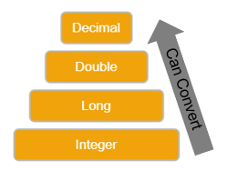

# Module - Introduction to Apex

[Apex Developer Guide](https://developer.salesforce.com/docs/atlas.en-us.apexcode.meta/apexcode/apex_dev_guide.htm)

[Apex Reference Guide](https://developer.salesforce.com/docs/atlas.en-us.apexref.meta/apexref/apex_ref_guide.htm)

[Apex (Salesforce Developer Centers)](https://developer.salesforce.com/developer-centers/apex)

- [Module - Introduction to Apex](#module---introduction-to-apex)
  * [Introduction to Apex](#introduction-to-apex)
    + [Object Orientation](#object-orientation)
    + [Methods](#methods)
  * [Primitive Variables](#primitive-variables)
    + [Objects in Apex](#objects-in-apex)
  * [The sObject Type](#the-sobject-type)
  * [Apex Type Casting](#apex-type-casting)
  * [Collections](#collections)
    + [<mark>Lists</mark>](#-mark-lists--mark-)
  * [<mark>Sets</mark>](#-mark-sets--mark-)
    + [<mark>Maps</mark>](#-mark-maps--mark-)
    + [Collection Nesting](#collection-nesting)
  * [Operators and Precedence](#operators-and-precedence)
  * [Control Flow](#control-flow)
    + [<mark>Conditionals</mark>](#-mark-conditionals--mark-)
    + [<mark>Switch Statements</mark>](#-mark-switch-statements--mark-)
    + [<mark>While and Do Loops</mark>](#-mark-while-and-do-loops--mark-)
    + [<mark>For Loops</mark>](#-mark-for-loops--mark-)
  * [Apex Development Environments](#apex-development-environments)
    + [Developer Console](#developer-console)
    + [Visual Studio Code](#visual-studio-code)
  * [Enum](#enum)
  * [Comments and Comment Best Practices](#comments-and-comment-best-practices)

## Introduction to Apex

- <mark>Apex is Salesforce's case-insensitive</mark> (meaning that it treats method/variable/class names case-insensitively, the values of string literals in Apex are case-sensitive), <mark>cloud-hosted, Java-like, multitenant-aware, object-oriented, proprietary, strongly-typed, versioned programming language</mark>
- Apex is a properietary language, so Salesforce determines where and how we can execute Apex code
    - the only place we can execute Apex is on the Salesforce platform
    - the Salesforce platform is hosted in the cloud, so Apex is as well
    - we can't execute Apex code outside of Salesforce (this means that we can't execute Apex code locally)
    - but we can retrieve our Apex locally to be able to work with it through source control, we just can't run it locally
- Because Apex knows that it's running on a multitenant environment, it prevents us from monopolizing those shared resources through the use of Apex governor limits
    - Apex governor limits set maximums on our interactions with, e.g. the database
    - if we violate a governor limit, an uncatchable LimitException will be thrown, the transaction will fail, and any changes won't be persisted
- Apex is not just used on the Salesforce platform it's a part of the platform itself
    - as a result of this, we can include DML, SOQL, and SOSL inline in our code without performing any prior setup
    - this also provides protection for our declarative configurations - any custom object or custom field referenced in Apex can't be deleted or have its API name changed, so we have assurance that an administrator (or perhaps ourselves) won't accidentally break our code without realizing it
    - Apex allows us to work with instances of our standard and custom objects as well as all of their fields
- each Salesforce release (Spring, Summer, Winter) has its own API version and this number is incremented with each release
    - e.g. the Winter '22 release has API version 53.0
    - whenever we save our Apex code to our org, it's also saved with an API version
    - when our code is invoked, the system retrieves it and executes it in the context of the API version that it was saved with
    - i.e. Salesforce releases are backwards-compatible, so they won't break our existing customizations (programmatic or declarative)
    - we'll likely still want to maintain our code by making it compliant with the current API version in order to take advantage of any new features that have been added to the language since the API version our code is currently using
    - this is one of the reasons (along with the increased speed) that we have the best practice of developing declaratively when possible on the Salesforce platform, because Salesforce releases automatically bring our declarative customizations to the current API version
    - and if Salesforce is going to remove or retire support for a declarative feature, we'll be notified well ahead of time
- by being a strongly-typed language, Apex cannot implicitly convert values between unrelated data types
- Apex is also statically typed, meaning that we need to declare the data types of our variables when declaring the variables themselves
- like other C family languages, all lines of Apex code must end with either a closing curly brace or a semicolon

### Object Orientation

- object-oriented languages make use of objects and classes
- <mark>a class is a template for objects that contains the methods (i.e. functions) that will define an object's behavior and the variables that will hold an object's state</mark>
- <mark>an object is an instance of a class that has state (things that it knows about itself) and behavior (things that it can do)</mark>
- Apex classes are one of two file types that we can save Apex code in (the other is an Apex trigger)
- to declare a top-level class, we use an access modifier, the class keyword, and the name of our class
    - the body of our class follows, surrounded by curly braces
    - e.g.

```java
public class Clown {
}
```
 
- by convention, class names are Pascal case (i.e. the first letter of every word is capitalized and there's no spaces) and method/variable names are camelcase (i.e. the first letter of every word except for the first word is capitalized and there's no spaces)

### Methods

- an Apex method is a function that's contained in a class and used to execute an action
- each method begins with a method signature (i.e. declaration)
- the method signature has an (optional) access modifier, the method's return type, name, any parameters that the method takes in parentheses, and then the body of the method in curly braces

```java
public Integer meta() {
}
```

## Primitive Variables

[Primitive Data Types (Apex Developer Guide)](https://developer.salesforce.com/docs/atlas.en-us.apexcode.meta/apexcode/langCon_apex_primitives.htm)

- Apex's primitive data types are
    - Blob (used to hold binary data)
    - Boolean
    - Date
    - DateTime
    - Decimal
    - Double
    - Id
        - used to store the 18-character version of a record Id
    - Integer
    - Long
    - Object
    - String
    - Time
- Apex primitive number data types
    - Integer holds integers (i.e. whole numbers) and has a 32-bit size
    - Decimal is used to hold non-whole numbers
    - Long and Double are 64-bit versions of Integer and Decimal, respectively
- to declare a variable in Apex, we specify the variable's data type and name
    - if we don't initialize a variable (i.e. give it an initial value when declaring it), it'll be initialized to a null value, regardless of data type
- we can create constants by using the final keyword at the start of our variable declaration
- Apex primitives aren't like primitives in other programming languages, rather they're more comparable to wrapper classes in Java
    - variables of all Apex data types - whether primitive or not - are instantiations of classes
    - this means that our primitive variables have instance methods for common tasks such as type conversion

### Objects in Apex

- the primitive Object is a generic data type in Apex, meaning that it can hold a value of any data type
    - in order for safety, we don't have the ability to reference the properties of a non-primitive value stored in an Object variable
    - most of the time, we'll use Object as a tool throughout type conversion rather than using it to work with our variable values (e.g. when parsing JSON)
 
## The sObject Type

[sObject Types (Apex Developer Guide)](https://developer.salesforce.com/docs/atlas.en-us.apexcode.meta/apexcode/langCon_apex_SObject_types.htm)

- sObject and its subtypes are a result of Apex being a part of the Salesforce platform
- the sObject type can hold a record of any Salesforce object (standard or custom) - i.e. it's a generic sObject
- each of the standard and custom objects in our org are represented through subclasses of sObject and we can use these subclasses to hold records of a specific sObject type
    - the genericisim of the sObject type means we can't use dot notation to refer to the values of individual fields on an sObject stored in a generic sObject
- the classes representing standard and custom objects have the same name as the corresponding object's API name
    - for standard objects, the API name is generally just the name of the object with any whitespace removed (this isn't always the case, e.g. Product2 is the API name for the Product standard object)
    - for custom objects, the API name always ends with a __c suffix
    - we can see the API names of our objects in a variety of places, such as Object Manager
    - the API names for custom fields also always end with a __c suffix
    - we can read from or assign a value to a field on a record through dot notation if we're working with a variable of a specific sObject type, e.g.

```java
Account acc = new Account(Name='Atlantic');
acc.Industry = 'Entertainment';
``` 

- commonly, the records that we work with in our Apex code through instances of sObject and its subclasses are themselves referred to as sObjects
- to create a new sObject (i.e. record), we instantiate the corresponding class
    - e.g.

```java
Account acc = new Account(Name='Atlantic Records');
```
 
    - we'll do so by making a constructor call with the new keyword
    - sObject constructors are overloaded, so we can pass a value for any field (standard or custom) as an argument when making a constructor call by writing the API name of the field and assigning it a value
- to refer to fields of an sObject after instantiation, we'll use dot notation with the API name of the field

## Apex Type Casting

[Rules of Conversion (Apex Developer Guide)](https://developer.salesforce.com/docs/atlas.en-us.apexcode.meta/apexcode/langCon_apex_rules_of_conversion.htm)

- type casting, also known as type conversion, is act of converting a value from one data type to store it in a variable of another data type
- <mark>implicit type casting</mark>
    - implicit type conversion is done automatically by the language
    - there two main forms of implicit casting in Apex
        - <mark>casting between numeric primitive data types</mark>
            - the numeric primitive types in Apex form a hierarchy

<p align="center"></p>

            - we can convert a value from a hierarchically lower data type to a value of a hierarchically higher data type implicitly

```java
Integer a = 1;
Decimal b = a;
```

        - <mark>casting between Ids and Strings</mark>
            - Apex can implicitly cast any Id value to a String
            - Apex can implicitly cast a String value to an Id, provided that the String is a valid record Id
- <mark>explicit type casting</mark>
    - <mark>we convert between unrelated data types by invoking conversion methods</mark>
    - recall that all Apex primitive variables are instantiations of classes
    - <mark>many of the classes representing Apex variables have methods to convert values between data types</mark>
    - e.g.

```java
String a = '1';
Integer b = Integer.valueOf(a);
``` 

    - <mark>we can also convert between related data types by putting the desired data type in parentheses after the assignment operator</mark> (i.e. the equals sign)

```java
Decimal a = 1.7;
Integer b = (Integer) a;
``` 

        - Apex doesn't round values when we explicitly convert between numeric types in this way
 
## Collections

[Collections (Apex Developer Guide)](https://developer.salesforce.com/docs/atlas.en-us.apexcode.meta/apexcode/langCon_apex_collections.htm)

- Apex collections aren't statically-sized (i.e. we can add additional elements to collections even if that would make them bigger than the size they were declared with)
- there are three types of collections in Apex - List, Set, and Map

### <mark>Lists</mark>

[List Class (Apex Developer Guide)](https://developer.salesforce.com/docs/atlas.en-us.apexcode.meta/apexcode/apex_methods_system_list.htm#apex_methods_system_list)

- <mark>comma-separated, ordered, indexed groups of values (i.e. elements) that all share the same data type</mark>
- <mark>because Lists are ordered and indexed, we can access individual elements through their index in the List and the List can contain duplicate values</mark>
- <mark>Lists are zero-indexed</mark>, the first element in the List has the index 0

```java
List<String> shoppingList = new List<String>();
List<String> clownCars = new List<String>{
    'Nova',
    'Bus'
};
shoppingList.add('Chuck E. Cheese Pizza');
shoppingList.add('Volvo 1962');
shoppingList[0] = 'Chuck E. Cheese Tokens';
``` 

    - we instantiate a collection in Apex by declaring the data type in the format collectionDataType<elementDataType>, e.g. List<String>
    - we can instantiate an empty collection by making the constructor call with an empty set of parentheses, e.g. new List<String>()
    - we can instantiate a collection with values by replacing the parentheses in the constructor call with curly braces and comma-separating the values
        - we can add elements to a List with the use of the add() method
- with Lists, we can also use array notation when initializing or declaring a List
    - e.g.

```java
String[] chuckECheesePrizes = new String[3];
```

        - array notation for List declarations follows the format elementDataType[], e.g. String[]
        - if we use array notation on the right side of the assignment statement, the value passed to the square brackets will specify the initial size of the List
 
## <mark>Sets</mark>

[Set Class (Apex Developer Guide)](https://developer.salesforce.com/docs/atlas.en-us.apexcode.meta/apexcode/apex_methods_system_set.htm)

- <mark>unordered collections and therefore must contain unique values</mark>
- commonly used for, e.g., storing all unique Ids of related Accounts when iterating through Orders or creating a collection of unique Contact emails from our database to ensure that a new contact isn't entered with a duplicate value
- we declare Sets similarly to how we declare Lists (except that we can't use array notation)
- the Set class has
    - an add() method used to add an element to the Set
        - if we attempt to add a duplicate value to a Set using the add() method, it'll just be ignored
    - a size() method returns the size of the Set (the List class has a method of the same name that performs the same function)
    - a contains() method used to see if a value exists within the Set (will return true if this is the case and false otherwise)
- e.g.

```java
Set<String> emailSet = new Set<String>();
emailSet.add('johndow@owiej.com');
``` 

### <mark>Maps</mark>

[Map Class (Apex Developer Guide)](https://developer.salesforce.com/docs/atlas.en-us.apexcode.meta/apexcode/apex_methods_system_map.htm#apex_methods_system_map)

- <mark>groups of key-value pairs where each key must be unique, but we can have duplicate values</mark>
- e.g.

```java
Map<String, Account> highValueAccs = new Map<String, Account>{
    'Edge Communications' => new Account(),
    'Dull Communications' => new Account()
};
```
 
    - Map variables are declared with the following format for their data type Map<keyDataType, valueDataType>, e.g. Map<String, Account)
    - if we initialize a Map with elements, the key and corresponding value will be separated by the arrow operator (=>)
- the Map class has 
    - a put() method
        - adds or updates an element in the Map
        - takes two arguments - the first is the key to assign a value to and the second is the value to assign to that key
        - if the key is already within the Map, it'll be updated to have the new value (because the keys in Maps must be unique)

### Collection Nesting

- we can nest collections inside of other collections with Apex code
- we'll frequently do so when, e.g. when executing SOSL searches and when parsing JSON
    - if the key is doesn't exist yet in the Map, the key will be added to the Map with that value

## Operators and Precedence

[Expressions and Operators (Apex Developer Guide)](https://developer.salesforce.com/docs/atlas.en-us.apexcode.meta/apexcode/langCon_apex_expressions.htm)

<p align="center"></p>

## Control Flow

[Control Flow Statements (Apex Developer Guide)](https://developer.salesforce.com/docs/atlas.en-us.apexcode.meta/apexcode/langCon_apex_control_flow.htm)

### <mark>Conditionals</mark>

- the conditional statement syntax is identical to that of the conditional in JavaScript
- we can also write shorthand if-else statements in Apex in Apex with the use of the ternary operator
    - we follow the format condition ? valueToReturnIfTrue : valueToReturnIfFalse, e.g.

```java
Contact con = generic instanceof Contact ? generic : null;
```

### <mark>Switch Statements</mark>

- the switch statement is used when we're checking if the same variable/expression is equal to different values or if a generic sObject is an instance of different sObject subclasses
- the syntax of a switch statement is as follows

```java
switch on expressionOrVariableToTest {
    when valueA {
        // code to execute when expressionOrVariableToTest is equal to valueA
    } when valueB, valueC {
        // code to execute when expressionOrVariableToTest is equal to valueB or valueC
    } when else {
        // code to execute when none of the cases are satisfied
    }
}
```

- we can't have fallthrough in Apex switch statements and therefore have no need to include a break statement at the end of our cases

### <mark>While and Do Loops</mark>

- while and do while loops in Apex have the same syntax as they do in JavaScript
- while loops will execute so long as their condition remains true
- do-while loops will execute at least once (regardless of the veracity of their condition) and then continue to execute so long as the condition is true

### <mark>For Loops</mark>

- we want to use our for loops when we have a way to know the number of iterations we want for our loop ahead of time
- <mark>Apex has a traditional for loop that looks like the one we're familiar with from C-family languages</mark>
    - i.e. it follows the format for(iterableVariableDeclaration; exitCondition; incrementOrDecrementOperation) {}
    - e.g.

```java
for(Integer i = 0; i < 10; i++){}
``` 

- <mark>Apex has an enhanced for loop that allows us to iterate through Lists and Sets</mark>
    - this follows the format for(collectionElementDataType iterableVariable : listOrSetToIterateThrough){}
    - e.g.

```java
for(Account a : accs) {}
``` 

## Apex Development Environments

[Writing Apex Using Development Environments (Apex Developer Guide)](https://developer.salesforce.com/docs/atlas.en-us.apexcode.meta/apexcode/apex_intro_writing_apex.htm)

### Developer Console

- we can find the Developer Console in our orgs by clicking the Setup gear and Developer Console
- the Developer Console can have some finicky behavior if we open it in a new window (as it does by default), so it can be best to open it in a new tab instead)
- the Developer console allows us to open Apex classes and triggers, Visualforce pages, Aura components, standard and custom objects within our org (and their fields), static resources, etc.
- if we open an Apex class/trigger or Visualforce page, the Developer Console will also show the API version of that entity
- the Developer Console has autocomplete functionality
- we can execute Apex code without saving it to our orgs by clicking Debug > Open Execute Anonymous Window (or CTRL+E)
    - if we select the Open Log checkbox on the Execute Anonymous Window then the debug log generated as a result of our execution will be automatically opened
    - although the code in an Execute Anonymous Window won't be saved to our orgs, any changes that it makes to records will persist
- the Developer Console also has a variety of tabs at the bottom
    - the Logs tab shows us debug logs that we can open and parse
        - opening the Developer Console automatically creates a User Trace Flag associated with the user we're logged in as, so any code that we execute from the Developer Console will generate a Debug Log
    - the Tests tab shows us the result of our Apex tests and the code coverage we have from them
    - the Query Editor tab allows us to run SOQL queries and SOSL searches outside of Apex code (although we can execute SOQL queries and SOSL searches inline in Apex)
    - the Problems tab shows any syntax errors in our opening code files (e.g. classes or triggers)
        - we can't save any file in the Developer Console if it has any syntax errors - we need to resolve them before we'll be able to save it
    - the Developer Console doesn't lock any files we have open in it
        - so two developers in the same org can work on the same, e.g. Apex class, at the same time and continuously overwrite each other's changes with subsequent classes
    - the Developer Console can't be used to create Lightning Web Components
 
### Visual Studio Code

- Salesforce has adopted Visual Studio Code as its preferred third-party IDE and has released official extensions for it (e.g. Salesforce Extension Pack)
 
## Enum

- an abstract data type (ADT) with a predefined set of values that don't really adhere to a numeric order
- we can think of them like picklists for our code
- an abstract data type is a class that defines sets of values and operations
- as an ADT, Enum has some abstracted methods for us to work with its values
- there are two types of Enums - system-defined Enums (e.g. Trigger.operationType and System.StatusCode)
- to define an Enum, we follow the format acceess modifier, enum keyword, name of the Enum, and possible Enum values in curly braces

```java
public enum NBADivision {
    Atlantic,
    Central,
    Southeast,
    Northwest,
    Pacific,
    Southwest
};
```

- we can instantiate Enums just like variables of any other type

```java
NBADivision atlantic = NBADivision.Atlantic
``` 

- we can refer to Enum values through dot notation
- the values of an Enum cannot have spaces or be string literals
- we can call the values() method on the Enum to return all possible values for that Enum
- we can call name() method on an Enum variable to return the value assigned to that variable
- we can call ordinal() method on an Enum variable to return the index of the chosen value in the list of defind Enum values

```java
System.debug(NBADivision.values());
System.debug(atlantic.name());
System.debug(atlantic.ordinal());
```

## Comments and Comment Best Practices

- Apex comments are syntactically identical to comments in JavaScript
    - a single line comment starts with //
    - a block comment (or multiline comment) starts /* and ends with */
- we want to comment our code judiciously
    - we can reduce the amount of comments that we need to write to make our code clear by writing self-documenting code, i.e. code whose purpose is clear without comments
    - one of the easiest ways to create self-documenting code is to provide descriptive names for variables and methods
    - we want to avoid writing short or non-descriptive variable and method names (e.g. anything that's not an iterable variable shouldn't be named a, b, or the like)
- a good commenting benchmark is one comment before each method that describes the parameters, returned value, and purpose as briefly as possible
- if do something especially unusual or hard to decipher within a method, we can add another comment to explain that specific code line/block
