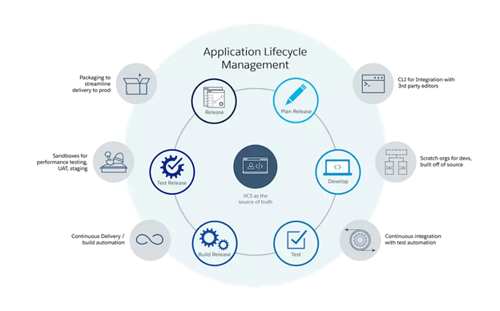
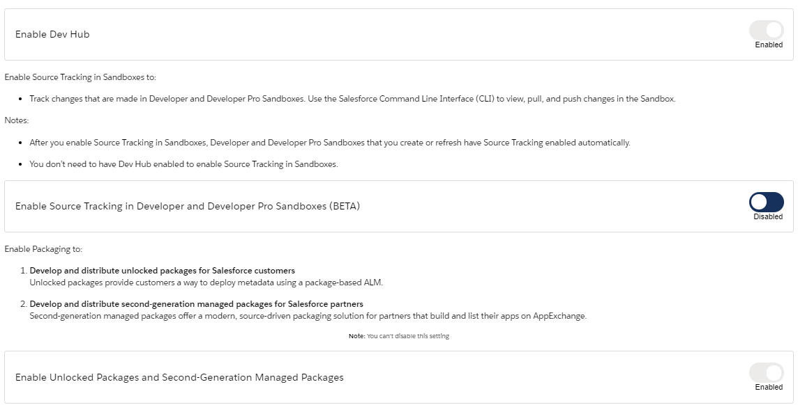
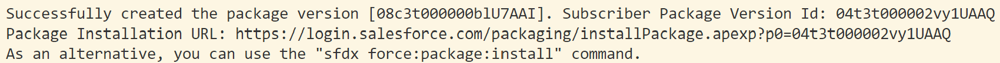
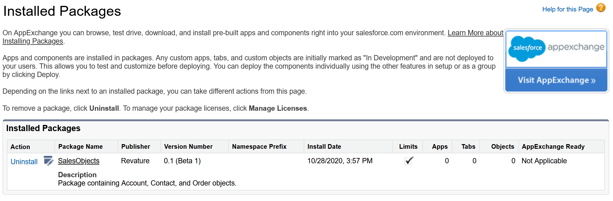

# Module - Package Based Development

This module introduces package based development and the role of scratch orgs in the development model.

## Table of Contents

* [Package Based Development](#package-based-development)
* [Dev Hub](#dev-hub)
* [Scratch Orgs](#scratch-orgs)
    * [The Scratch Org Definition File](#the-scratch-org-definition-file)
    * [SFDX Commands for Scratch Orgs](#sfdx-commands-for-scratch-orgs)
    * [Scratch Orgs vs. Sandboxes](#scratch-orgs-vs-sandboxes)
* [The Project Configuration File](#the-project-configuration-file)
* [Creating Unlocked Packages](#creating-unlocked-packages)
* [Moving Toward Package Based Development](#moving-toward-package-based-development)

### Helpful References/Links

* [Package-Based Development Model (Salesforce DX Developer Guide)](https://developer.salesforce.com/docs/atlas.en-us.sfdx_dev.meta/sfdx_dev/sfdx_dev_unlocked_pkg_pkg_dev.htm)
* [Understand What Application Lifecycle Management Is (Application Lifecycle and Development Models, Trailhead)](https://trailhead.salesforce.com/en/content/learn/modules/application-lifecycle-and-development-models/understand-what-application-lifecycle-management-is)
* [Command Reference (Salesforce Extensions for Visual Studio Code)](https://developer.salesforce.com/tools/vscode/en/user-guide/vscode-commands/)
* [force Namespace (Salesforce CLI Command Reference)](https://developer.salesforce.com/docs/atlas.en-us.sfdx_cli_reference.meta/sfdx_cli_reference/cli_reference_force.htm)
* [Scratch Orgs (Salesforce DX Developer Guide)](https://developer.salesforce.com/docs/atlas.en-us.sfdx_dev.meta/sfdx_dev/sfdx_dev_scratch_orgs.htm)
* [Scratch Org Features (Salesforce DX Developer Guide)](https://developer.salesforce.com/docs/atlas.en-us.sfdx_dev.meta/sfdx_dev/sfdx_dev_scratch_orgs_def_file_config_values.htm#sfdx_dev_scratch_orgs_def_file_config_values)
* [Settings (Metadata API Developer Guide)](https://developer.salesforce.com/docs/atlas.en-us.228.0.api_meta.meta/api_meta/meta_settings.htm)
* [Build Your Own Scratch Org Definition File (Salesforce DX Developer Guide)](https://developer.salesforce.com/docs/atlas.en-us.sfdx_dev.meta/sfdx_dev/sfdx_dev_scratch_orgs_def_file.htm)
* [Push Source to the Scratch Org (Salesforce DX Developer Guide)](https://developer.salesforce.com/docs/atlas.en-us.sfdx_dev.meta/sfdx_dev/sfdx_dev_push_md_to_scratch_org.htm)
* [Salesforce DX Project Configuration (Salesforce DX Developer Guide)](https://developer.salesforce.com/docs/atlas.en-us.sfdx_dev.meta/sfdx_dev/sfdx_dev_ws_config.htm)
* [Project Configuration File for Packages (Salesforce DX Developer Guide)](https://developer.salesforce.com/docs/atlas.en-us.sfdx_dev.meta/sfdx_dev/sfdx_dev2gp_config_file.htm)
* [Install Packages from a URL (Salesforce DX Developer Guide)](https://developer.salesforce.com/docs/atlas.en-us.sfdx_dev.meta/sfdx_dev/sfdx_dev_unlocked_pkg_install_pkg_ui.htm)
* [Working with Modular Development and Unlocked Packages: Part 1 (Salesforce Developers Blog)](https://developer.salesforce.com/blogs/2018/06/working-with-modular-development-and-unlocked-packages-part-1.html)
* [Working with Modular Development and Unlocked Packages: Part 2 (Salesforce Developers Blog)](https://developer.salesforce.com/blogs/2018/06/working-with-modular-development-and-unlocked-packages-part-2.html)
* [Working with Modular Development and Unlocked Packages: Part 3 (Salesforce Developers Blog)](https://developer.salesforce.com/blogs/2018/06/working-with-modular-development-and-unlocked-packages-part-3.html)
* [Successfully Retrieve Org Metadata Using Packages | Developer Quick Takes (YouTube)](https://www.youtube.com/watch?v=GBNmNbq02WI)
* [Working with the Salesforce Scratch Org using VS Code | Developer Quick Takes (Youtube)](https://www.youtube.com/watch?v=BOdrQozvgrQ&list=PLgIMQe2PKPSJdFGHjGpjd1FbCsOqq5H8t&index=27)

## Package Based Development

In the olden days, Salesforce developers would often have to go out of their way to incorporate version control systems, as well as iterative and modular development practices. This changed with the introduction of package based development, a model where metadata is organized into unlocked packages, which are versioned groups of related metadata used to migrate customizations between orgs.

Note that these unlocked packages are distinct from and have different motivations than both unmanaged and managed packages. The latter two are designed to be distributed to orgs that others outside of our company own and manage, while unlocked packages are meant to be distributed between orgs that _we_ control.

Package development is beneficial for many reasons, the first being that it fits hand-in-glove with Agile software development. We can embody the Agile principle of adapting to new feature requests from clients and users by simply creating a new version of our package.

Because we are separating our metadata into different containers, rather than deploying everything needed in a single artifact such as a change set, we can easily implement the iterative and modular development process that is at the core of the Agile methodology. If different teams working on different features finish at different times, the team that completed their customizations can release their package and move on to the next request in our backlog rather than waiting for everyone else to finish unrelated customizations.

This separation of source into related containers also increases the organization of and our understanding of our metadata - the contents of the packages themselves allow us to see which customizations depend on each other and relate to certain apps or features. Package development necessitates working from the command line, so we don't have to go out of our way to incorporate source/version control because we can quickly update a remote repository serving as our source of truth while developing. Finally, our package versions serve as a log of changes to metadata over time, making it easier to audit our development history.

With package development working in concert with SFDX and source control, we can implement a powerful and flexible development lifecycle that looks like the one below (found in the `Understand What Application Lifecycle Management Is` unit of the `Application Lifecycle and Development Models` badge on Trailhead).

<p align="center"></p>

## Dev Hub

Before we get into the meat of package development, we need to perform some setup. In the `SFDX & Visual Studio Code` module, we saw how to connect an org to our Salesforce projects. Here we'll connect a `Dev Hub` org to our project, which is required to create scratch orgs and unlocked packages. Our process will be pretty similar with a small amount of configuration that we need to do first.

To perform this configuration, we navigate to `Setup` > `Development` > `Dev Hub`. Then we implement the `Enable Dev Hub` toggle to be able to create scratch orgs. Implementing the resulting `Enable Unlocked Packages and Second Generation Managed Packages` toggle will allow us to create unlocked packages and managed packages from the command line. Once we've configured the settings, our page should look like the following image.

<p align="center"></p>

Now we can use the `sfdx force:auth:web:login` CLI command to authorize the org as a Dev Hub. We can pass an alias for the org to the command's `-a` flag and include the `-d` flag to set the org as our project's default Dev Hub. Alternatively, we can use the `SFDX: Authorize a Dev Hub` action from the command palette to accomplish the same task.

To make an already authorized org into a default Dev Hub, we'll use the `sfdx force:config:set` command in the terminal, passing the alias of the desired org to the `defaultdevhubusername` parameter, as in the following example:

```bash
sfdx force:config:set defaultdevhubusername=DevHub
```

Note that this parameter is not a flag and there is no equivalent command palette action because the `SFDX: Authorize a Dev Hub` action automatically sets the org as the default Dev Hub for the project. We can optionally include the `-g` flag to set the Dev Hub as the default for all projects in our local environment, rather than being the default for only the current project.

Let's summarize these commands with the following table.

| Action | CLI Command | Command Palette Action |
| ------ | ----------- | ----------------------- |
| Authorize a DevHub | sfdx force:auth:web:login | SFDX: Authorize a Dev Hub |
| Set a Default DevHub | sfdx force:config:set defaultdevhubusername=orgAlias | N/A |

## Scratch Orgs 

A scratch org is a small, configurable, short-term, disposable development environment commonly used with package development. These orgs have 200 MB of storage for data and additional 50 MB for files. While they're automatically deleted after seven days, we can configure our settings such that scratch orgs are deleted after as little as one day or last for as long as 30 days.

The number of scratch orgs we can create in a day depends on our edition of Salesforce. With `Developer Editions`, we can create up to six scratch orgs in one day and have up to three scratch orgs active at any one time. These environments are the rare case where `Trailhead Playgrounds` have greater allocations: playgrounds allow us to create up to ten scratch orgs in one day and maintain up to five active scratch orgs at once. We can view active scratch orgs in our Dev Hub orgs by navigating to the `Active Scratch Orgs` tab, which will show information such as any features enabled for the orgs.

These features can include items that the edition of the Dev Hub org normally wouldn't allow. For example, we can experiment with Einstein Analytics in a scratch org made from a `Developer Edition` Dev Hub, even though `Developer Editions` themselves don't come with Einstein Analytics licenses by default. We enable such settings by configuring our scratch org definition file.

### The Scratch Org Definition File

SFDX projects created with the default template include a scratch org definition file in the form of `project-scratch-def.json` in the project's `config` directory. While we can create our own custom definition files, we can also just repurpose and modify this existing one to suit our needs.

Let's take a look at an example definition file where we've done just that and highlight its parts.

```json
{
    "edition": "Developer",
    "features": [
        "Entitlements",
        "FieldAuditTrail"
    ],
    "hasSampleData": true,
    "objectSettings": {
        "case": {
            "sharingModel": "readWrite"
        }
    },
    "settings": {
        "securitySettings": {
            "enableAdminLoginAsAnyUser": true,
            "sessionSettings": {
                "forceRelogin": false
            }
        }
    }
}
```

Starting at the top, `edition` is the only required key for a definition file. This key's value can be `Developer`, `Enterprise`, `Group`, or `Professional` and it determines the edition of the scratch org that we're creating.

The `features` key takes a list of names of the features we would like to enable for our scratch org. In this file, we've chosen to enable `Entitlements` and the `Field Audit Trail`. A full list of available features can be found at the `Scratch Org Features` link in the `Helpful References/Links` section. Note that some features require us to specify a numeric value - the corresponding list elements for these will take the form `"featureName:value"`.

By enabling the `hasSampleData` key, we've included example data (similar to the data which we see in a newly created `Developer Edition` or `Trailhead Playground`) in our scratch org that we can use for testing. If we don't specifically enable this setting, our scratch org will not have any records when it's created.

The `objectSettings` key is used to set the OWDs for objects and/or create record types and its value is also an object. This inner object has keys which are camelcase API names of the standard objects we wish to configure. Note that as of the Winter '21 release of Salesforce, we cannot configure custom objects through the definition file.

`sharingModel`, `defaultRecordType`, or both keys can be mapped to our camelcase standard object API names. The value given to the `sharingModel` key determines the OWD for the object and can be either `private`, `read`, `readWrite`, `readWriteTransfer`, `fullAccess`, `controlledByParent`, `controlledByCampaign`, or `controlledByLeadOrContent`, although the options available from this list will depend on the object we've chosen.

The `defaultRecordType` key takes an alphanumeric string beginning with a lowercase letter as its value. This setting is useful because it creates a record type, which we will have to do before installing any packages in a scratch org if those packages create record types.

Moving on, we arrive at another nested key-value object, `settings`. The keys within the object assigned to the value of `settings` can be any valid Metadata API settings, which we can find at the `Settings` link in the `Helpful Links/References` section. Some options, such as the security settings that we're configuring in the above file, can have another layer of nested objects. Our security configuration in this example allows administrators to login as any user to test changes and doesn't make them relogin to the org with their credentials when they click the logout link while viewing as another user.

Although we didn't include any other keys in our file, there are others available. Let's highlight one more in particular: `release`, which can be used during the approximately four week preview period before each Salesforce update. When set to `preview`, it will allow us to test features included in the upcoming update in our scratch orgs.

The value of the definition file is encapsulated in two key factors: its portability and flexibility. Because our definitions are included in our projects, we can push them to our version control system so that multiple developers working on a project can create scratch orgs from _different_ Dev Hubs with the _same_ configuration. Additionally, we can use these orgs to explore tools that our regular licenses don't give us access to before we make a purchasing decision, as well as using them to preview upcoming releases.

### SFDX Commands for Scratch Orgs

Now that we've discussed enabling Dev Hub and configuring a definition file, we're ready to create a scratch org. We can do so by using the Salesforce CLI `sfdx force:org:create` command or the `SFDX: Create a Default Scratch Org` action included with the Salesforce Extensions for Visual Studio Code.

If we choose the CLI command, we pass the path to our definition file to the `-f` flag (the path to the default file is `config/project-scratch-def.json`), an alias for our scratch org to the `-a` flag , and optionally include the `-s` flag to make our scratch org the default org for the current project.

With all of this together, a complete CLI command to create a scratch org will look like the following:

```bash
sfdx force:org:create -f config/project-scratch-def.json -a MyScratchOrg -s
```

So once we've created the scratch org, do we migrate metadata with the usual deploy and retrieve commands? Actually no - the process of managing metadata involving a scratch org is much simpler. The CLI and corresponding command palette commands to push metadata to a scratch org are `sfdx force:source:push` and `SFDX: Push Source to Default Scratch Org`, respectively. To pull metadata from a scratch org, we can use the `sfdx force:source:pull` CLI command or the `SFDX: Pull Source from Default Scratch Org` command palette action.

What makes these commands simpler? Is it just because we only have to remember two words (push and pull) rather than four (push, pull, deploy, and retrieve)? Maybe that's part of the reason, but there are some much more important factors. Namely that we don't have to include any flags in the command (beyond possibly passing the alias of the desired scratch org to the `-u` flag if it's not already the default org for our project) because (essential point upcoming!) these commands work a lot like Git does.

When we run the push command for the first time with a scratch org, all source pointed to by our `sfdx-project.json` file (which we'll detail later in this module) is deployed to the org. Once the deployment is complete, the CLI starts tracking all metadata in our local directory and in the scratch org.

Any changes that are made to the local source can be pushed to the scratch org with the push command (again, no parameters required if the scratch org is our project's default org). Similarly, any changes made in the scratch org can be pulled down to the local source with the pull command. We don't have to worry about specifying metadata types and instances - the CLI knows what changed, so it takes care of the heavy lifting for us.

The CLI also knows the local directory that metadata was originally created in, so it doesn't create duplicate files in multiple directories when retrieving changed metadata from a scratch org. Rather, our source is always pulled down to its proper home.

As if this weren't enough, the CLI also tries to automatically resolve any username references in our source by replacing them with the default username for the scratch org. This takes away the headache of having to fix a deployment that failed because a user specified as a community site admin or approval step approver isn't in our target org.

Additionally, SFDX has a series of commands that are similar to `git status`, allowing us to see changes that have been made (either locally, in our default scratch org, or both) since our last push or pull by simply using the desired flag with the `sfdx force:source:status` command in the terminal or choosing one of the analogous command palette actions. Let's list the variations of these commands and review others that we already talked about in this section in the following table.

| Action | CLI Command | Command Palette Command |
| --------------- | --------------------------- | --------------------- |
| Create a Scratch Org | sfdx force:org:create | SFDX: Create a Default Scratch Org |
| Push to the Default Scratch Org | sfdx force:source:push | SFDX: Push Source to Default Scratch Org |
| Pull from the Default Scratch Org | sfdx force:source:pull | SFDX: Pull Source from Default Scratch Org |
| View All Changes | sfdx force:source:status -a | SFDX: View All Changes (Local and in Default Scratch Org) |
| View Local Changes | sfdx force:source:status -l | SFDX: View Local Changes |
| View Scratch Org Changes | sfdx force:source:status -r | SFDX: View Changes in Default Scratch Org |

These features collectively highlight one of the benefits of package development that we stated earlier: when we're using scratch orgs in combination with package development, source management is very similar to what it's like with version control systems such as Git, so it's painless to involve Git and other tools in our day-to-day development. 

### Scratch Orgs vs. Sandboxes

Now that we've introduced scratch orgs, let's discuss the variety of advantages they have over sandboxes in the context of package development. First let's set a ground rule: because the storage of a scratch org is most comparable to that of a `Developer` sandbox, we're most likely choosing between creating a scratch org or that `Developer` sandbox.

Recall that sandboxes, when created, replicate all the metadata from the source org. Scratch orgs, on the other hand, have no metadata when created, so we get to choose the source that they contain. This lack of metadata also means that the time required to create a scratch org is much less than the time needed to make a sandbox, and this difference will increase as our code base and amount of customizations our production org has both increase.

The scratch org's emptiness is valuable because it allows us to preserve the modularity we create when moving to package development by deploying only the package that we're working on and its dependencies to our scratch org. We can then parse large code bases and silo our problems. If another developer was working on a different package and pushed broken code to our shared repository, that's now their problem, not ours - our deployment won't include that package and we'll be just fine.

Scratch orgs are also preferred over sandboxes for continuous integration - because of their quick creation and the large amount of them we can make in a day (up to 200 if we have the `Performance` or `Unlimited Editions` of Salesforce), we can set up a service that, e.g. creates a scratch org, deploys all source in a certain repository branch to the scratch org, and runs all Apex tests whenever we commit to said branch in our remote repository. In fact, we can leverage the Salesforce CLI to write the scripts that execute such a pipeline. While we can refresh a `Developer` sandbox once per day, this simply may not be frequent enough for our commits.

Despite all of these advantages, there is still a home for the sandbox in our development process. The scratch org is fleeting and small, so if we're looking to perform performance or load testing, we'll still want to use a much larger environment such as the `Full Copy` sandbox. We'll also likely want to use such an environment to collect changes before they're deployed to production.

In addition, some of the scratch org's benefits can be disadvantages in particular contexts. For example, because the scratch org doesn't include any metadata or data by default, it doesn't automatically get copies of production users. So to avoid manual setup, we'll still want to reserve user acceptance testing for something like a `Partial Copy` sandbox.

## The Project Configuration File

The project configuration file is what signifies that a directory is an SFDX project and specifies the path(s) to our source. It's a little more restrictive than the scratch org definition file in that it must be named `sfdx-project.json`.

When we make an SFDX project, the file is automatically created for us, but there's much more configuration to be had. So, just as we did with the scratch org definition file, let's take a look at an example and then dissect it.

```json
{
    "packageDirectories": [
        {
            "path": "baseObjects",
        },
        {
            "path": "feature",
            "default": true
        }
    ],
    "namespace": "",
    "sfdcLoginUrl": "https://login.salesforce.com",
    "sourceApiVersion": "47.0",
}
```

Our configuration files will get longer throughout the remainder of this module, but for now let's start with the required `packageDirectories` key. The value corresponding to this key is a list of objects, each of which specifies a relative `path` to a source directory.

This is how the Salesforce CLI knows what to push to a scratch org when we perform the initial deployment. All source in any directory that a `path` key points to will be deployed. Any changes made to the source in the scratch org will be reflected with updates to the appropriate local directory when a pull command is executed. If we create new metadata in the scratch org that didn't exist locally, the pull command will place it in the default path (`feature` in our example). Note that we must indicate our default path if we have multiple elements in the value for `packageDirectories` and we can only have one default path.

We'll pass a value to the `namespace` key if we're creating managed packages using the CLI, but it's fine with a null value otherwise. Similarly, we can accept the default `sfdcLoginUrl` value unless we want to change the address that we're taken to when we run `sfdx force:auth` commands to authorize Salesfore orgs.

Lastly, the value of the `sourceApiVersion` key determines what attributes are received for a given metadata type when we're using either the `sfdx force:source:push` or `sfdx force:source:pull` commands. This is relevant if we're working with a metadata type that has changed in a recent release. For example, our configuration file above would make it so that the pull and push commands wouldn't retrieve any dynamic forms included on Lightning record pages because these were only released with API version `50.0`, not version `47.0`.

## Creating Unlocked Packages

Alright, now that we're somewhere around nine pages into our notes on package based development we're finally ready to create the vehicle for this model: the unlocked package. Before we can package, we must have something to package, so we'll need to have an SFDX project that contains some metadata. We can get such a configuration by, e.g., creating a new project and retrieving source from an org or cloning an existing project hosted in a remote repository.

The command that we'll use to create a package from this source will modify our project configuration file, so let's give a "before picture" of the default `sfdx-project.json`:

```json
{
    "packageDirectories": [
        {
            "path": "force-app",
            "default": true
        }
    ],
    "namespace": "",
    "sfdcLoginUrl": "https://login.salesforce.com",
    "sourceApiVersion": "50.0"
}
```

We create a package with the `sfdx force:package:create` CLI command. This action takes a variety of parameters, so let's list some of the most important in the following table.

<table align="center">
    <tr>
        <th>Flag</th>
        <th>Required?</th>
        <th>Value</th>
    </tr>
    <tr>
        <td>-n</td>
        <td></td>
        <td>Package Name</td>
    </tr>
    <tr>
        <td>-t</td>
        <td></td>
        <td>Package Type (Unlocked or Managed)</td>
    </tr>
    <tr>
        <td>-r</td>
        <td></td>
        <td>Path to Package Metadata</td>
    </tr>
    <tr>
        <td>-d</td>
        <td></td>
        <td>Package Description</td>
    </tr>
</table>

We'll demonstrate creating a pair of unlocked packages: one holding the `Account`, `Contact`, and `Order` standard objects and the other containing the page layouts for the same objects. While performing our setup, we moved the objects into a `SalesObjects` directory and the layouts into a `SalesLayouts` directory, so the structure of our source currently looks like the following (for brevity, we won't list each of the files and subdirectories in the object directories):

```
SalesLayouts/
    layouts/
        Account-Account %28Marketing%29 Layout.layout-meta.xml
        Account-Account %28Sales%29 Layout.layout-meta.xml
        Account-Account %28Support%29 Layout.layout-meta.xml
        Account-Account Layout.layout-meta.xml
        Contact-Contact %28Marketing%29 Layout.layout-meta.xml
        Contact-Contact %28Sales%29 Layout.layout-meta.xml
        Contact-Contact %28Support%29 Layout.layout-meta.xml
        Contact-Contact Layout.layout-meta.xml
        Order-Order Layout.layout-meta.xml
SalesObjects/
    objects/
        Account/
            ...
        Contact/
            ...
        Order/
            ...
```

Running the following command will create our first unlocked package from the `SalesObjects` directory.

```bash
sfdx force:package:create -n SalesObjects -t Unlocked -r SalesObjects -d 
    "Package containing Account, Contact, and Order objects."
```

This process automatically changes our project configuration file to what we see below:

```json
{
    "packageDirectories": [
        {
            "path": "force-app",
            "default": true
        },
        {
            "path": "SalesObjects",
            "package": "SalesObjects",
            "versionName": "ver 0.1",
            "versionNumber": "0.1.0.NEXT",
            "default": false
        }
    ],
    "namespace": "",
    "sfdcLoginUrl": "https://login.salesforce.com",
    "sourceApiVersion": "50.0",
    "packageAliases": {
        "SalesObjects": "0Ho3t000000blucCAA"
    }
}
```

The `force-app` directory no longer contains any relevant files for us, so we'll remove it from future versions of the file and make the `SalesObjects` directory our default path.

When taking note of the additions, we see that an element of the `packageDirectories` list was automatically created for our new package. In addition to the `path` and `default` keys, this element also has the `package` key with the name of the package as its value, the `versionName` key with a customizable version name as the corresponding value, and the `versionNumber` key. The value for this last key is also customizable, but we want to ensure that it ends in `NEXT` if we do modify it so that the version numbers of our packages automatically increment when we create them. Lastly, we see that a `packageAliases` parameter has also been automatically added to the end of our file. This parameter has an object as its value, where the keys correspond to names of packages and their versions and the corresponding values indicate package IDs.

Alright, now that we've taken stock of the modifications, let's create a package for our layouts with the following command: 

```bash
sfdx force:package:create -n SalesLayouts -t Unlocked -r SalesLayouts -d 
    "Package containing page layouts for the Account, Contact, and Order objects."
```

This command modifies our project configuration file so that it looks like the following:

```json
{
    "packageDirectories": [
        {
            "path": "SalesObjects",
            "package": "SalesObjects",
            "versionName": "ver 0.1",
            "versionNumber": "0.1.0.NEXT",
            "default": true
        },
        {
            "path": "SalesLayouts",
            "package": "SalesLayouts",
            "versionName": "ver 0.1",
            "versionNumber": "0.1.0.NEXT",
            "default": false
        }
    ],
    "namespace": "",
    "sfdcLoginUrl": "https://login.salesforce.com",
    "sourceApiVersion": "50.0",
    "packageAliases": {
        "SalesObjects": "0Ho3t000000blucCAA",
        "SalesLayouts": "0Ho3t000000bluhCAA"
    }
}
```

We earlier said that unlocked packages allow us to modularize our metadata, but an unlocked package can still depend on other unlocked packages or even managed packages. Let's set up such a dependency now between our `SalesLayouts` and `SalesObjects` packages. To do so, we modify the JSON file to add the dependencies by introducing the appropriately named `dependencies` key to the desired element of the object list corresponding to the `packageDirectories` parameter. The `dependencies` key is another list of objects, where each object in the list specifies a single package upon which the outer package depends. 

To specify a dependency, we can pass a specific package version alias as the value for the `package` key within a dependency object. Alternatively, we can pass the name of a package as the value for the `package` key and specify a version number through the `versionNumber` key. Because we've yet to create any package versions, let's choose this second option for our project configuration file and edit our `default` one more time so that it's the `SalesLayouts` path, as we've done in the following JSON:

```json
{
    "packageDirectories": [
        {
            "path": "SalesObjects",
            "package": "SalesObjects",
            "versionName": "ver 0.1",
            "versionNumber": "0.1.0.NEXT",
            "default": false
        },
        {
            "path": "SalesLayouts",
            "package": "SalesLayouts",
            "versionName": "ver 0.1",
            "versionNumber": "0.1.0.NEXT",
            "default": true,
            "dependencies": [
                {
                    "package": "SalesObjects",
                    "versionNumber": "0.1.0.LATEST"
                }
            ]
        }
    ],
    "namespace": "",
    "sfdcLoginUrl": "https://login.salesforce.com",
    "sourceApiVersion": "50.0",
    "packageAliases": {
        "SalesObjects": "0Ho3t000000blucCAA",
        "SalesLayouts": "0Ho3t000000bluhCAA"
    }
}
```

Now that we're all setup, we can create versions of our packages using the `sfdx force:package:version:create` command. Like with the command to create a package, we have a variety of available flags, so let's summarize some of them in the following table.

<table align="center">
    <tr>
        <th>Flag</th>
        <th>Value/Meaning</th>
    </tr>
    <tr>
        <td>-p</td>
        <td>Package Name</td>
    </tr>
    <tr>
        <td>-d</td>
        <td>Path to Packaged Metadata</td>
    </tr>
    <tr>
        <td>-w i</td>
        <td>Run Version Creation Synchronously for i Minutes</td>
    </tr>
    <tr>
        <td>-x</td>
        <td>No Password Required for Installation</td>
    </tr>
    <tr>
        <td>-k passwordToInstall</td>
        <td>Password Required for Installation</td>
    </tr>
</table>

Note that we must specify either the `-p` or `-d` flag when executing the command, but not both. Similarly, we must include exactly one of the `-x` and `-k` flags. The `-w` flag to run the version creation synchronously is very useful because any errors that occur during the creation process will be printed to the console and the CLI will automatically update our project configuration file for us once it's complete. Note that the package version will still be created even if it doesn't finish in the time we specify - we'll just have to update `sfdx-project.json` ourselves.

Let's put these flags together and create a version of our `SalesObjects` package with the following command, which results in the output pictured below.

```bash
sfdx force:package:version:create -p SalesObjects -x -w 10
```

<p align="center"></p>

We can use a similar command (shown below) to create a version of our `SalesLayouts` package.

```bash
sfdx force:package:version:create -p SalesLayouts -x -w 10
```

Because we ran both of these commands synchronously, the `sfdx-project.json` file was automatically updated. All but the `packageAliases` value remains the same, so we'll only show that key-value pair for brevity.

```json
"packageAliases": {
    "SalesObjects": "0Ho3t000000blucCAA",
    "SalesLayouts": "0Ho3t000000bluhCAA",
    "SalesObjects@0.1.0-1": "04t3t000002vy1UAAQ",
    "SalesLayouts@0.1.0-1": "04t3t000002vy1jAAA"
}
```

Now that we've created package versions, we can install them in orgs through one of two ways. First, we can visit a `Package Installation URL`, login to the org that we want to install the package in, and follow the prompts as we would when installing, e.g. an unmanaged package.

The `Package Installation URL` can be `https://login.salesforce.com/packaging/installPackage.apexp?p0=ID`, where ID is replaced by the ID of the desired package version, e.g. `04t3000002vy1UAAQ` to install the first version of our `SalesObjects` package. Alternatively, we can visit an equivalent url by replacing the everything following `.com` in our org's url with `/packagingSetupUI/ipLanding.app?apvId=ID`, where ID is again a placeholder for the ID of the desired version. 

Rather than install the package through a web browser, we could continue working from the command line by utilizing the `sfdx force:package:install` command. As has become our habit, we'll list some of the parameters this action takes in the following table.

<table align="center">
    <tr>
        <th>Flag</th>
        <th>Value</th>
    </tr>
    <tr>
        <td>-p</td>
        <td>Package Version Id or Package Version Alias</td>
    </tr>
    <tr>
        <td>-k passwordToInstall</td>
        <td>Password Required for Installation</td>
    </tr>
    <tr>
        <td>-w i</td>
        <td>Run Package Installation Synchronously for i Minutes</td>
    </tr>
    <tr>
        <td>-u targetOrgName</td>
        <td>Target Org for Package Installation</td>
    </tr>
</table>
Putting all of these flags together, we can install the first version of our `SalesObjects` package in a scratch org with the alias `testScratch` using the following command.

```bash
sfdx force:package:install -p SalesObjects@0.1.0-1 -w 10 -u testScratch
```

Once the installation has completed, we can see that the package has been installed by navigating to `Setup` > `Apps` > `Packaging` > `Installed Packages` in our scratch org, where we'll see a page similar to the image below.

<p align="center"></p>

The number of package versions that we can create in a given day is limited by our Salesforce edition and equal to the number of scratch orgs our edition allows us to create in one day. So we can create up to ten package versions daily when working with a Dev Hub that's a `Trailhead Playground` and up to six daily when working with a `Developer Edition` Dev Hub.

We can view our version creation limits and the remaining number of versions we can create using the `sfdx force:limits:api:display` command, providing the alias of the desired org to the `-u` flag if we don't want the limits for the project's default org. In the command's output, `Package2VersionCreates` is the relevant governor, but the command also displays limits and remaining invocations for a variety of other operations.

When we create an unlocked package, the Dev Hub org for the enclosing SFDX project is set as the owner of the package. This is important because we won't be able to work with packages if the Dev Hub org that owned them has expired or been deleted. Even if the owning Dev Hub is still active, we won't be able to install an unlocked package version in a production org until the version has been released. Unlocked package versions are beta when created, so we'll need to use the `sfdx force:package:version:promote` command to release them, passing the package version alias or ID to the `-p` flag.

Installing a new version of an unlocked package in any org will overwrite any prior versions of that package, and therefore any changes that an admin may have made to the package contents. Note that unlike other deployment tools such as change sets, unlocked packages can be deployed to delete metadata because the CLI tracks _all_ changes, not just additions.

We introduced a large amount of commands in this section, so let's finish it by summarizing them in the following table. These commands only exist for the CLI - there are no equivalent command palette actions. However, we can use this command line dependence to our advantage to, e.g., create scripts that automate the process of creating a new version of an unlocked package.

| Action | CLI Command |
| ------ | ----------- |
| Create a Package | sfdx force:package:create |
| Create a Package Version | sfdx force:package:version:create |
| Install a Package | sfdx force:package:install |
| Display Maximum and Remaining Operation Invocations | sfdx force:limits:api:display |
| Release a Package | sfdx force:package:version:promote |

## Moving Toward Package Based Development

Compared to other development models, package development is pretty new. Therefore, it's likely that Salesforce customers adopting the model have large amounts of existing metadata that needs to be siloed into different packages. With this in mind, let's conclude this module by talking about how we can transition to package development.

We know that we need to categorize and modularize existing source during the migration, but _how_ do we go about this? Unfortunately, it's an imperfect science, so we'll often need to employ a trial-and-error process. There's no hard limit on how large or small a package should be, although we generally want to lean toward smaller unlocked packages because we can take advantage of their ability to depend on other packages.

The same place we generally start when developing - the data model - is a good place to begin here as well. Many customizations may depend on the same basic setup features, such as certain objects, so we can create a setup package (sort of like what we did with our `SalesObjects` package) that others will list as a dependency.

Moving to package development may require some work up front, but we'll be rewarded in the long run with greater understanding of our metadata and a more efficient development process overall.
