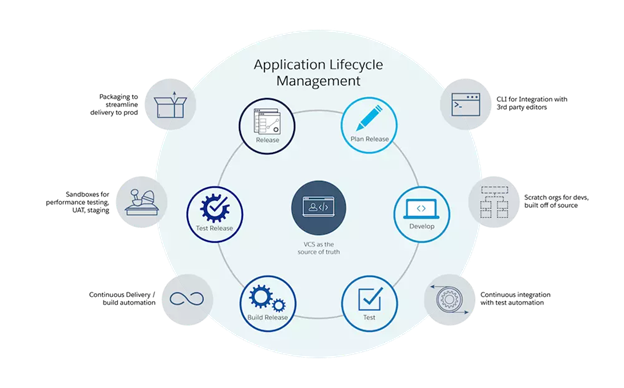
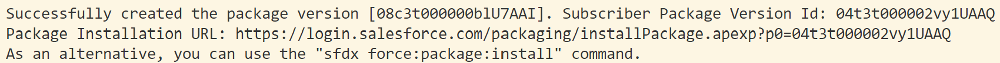

# Module - Package Based Development

[Longform](<./LFPackage Based Development.md>)

* [force Namespace](https://developer.salesforce.com/docs/atlas.en-us.sfdx_cli_reference.meta/sfdx_cli_reference/cli_reference_force.htm)
* [Working with Modular Development and Unlocked Packages: Part 1](https://developer.salesforce.com/blogs/2018/06/working-with-modular-development-and-unlocked-packages-part-1.html)
* [Working with Modular Development and Unlocked Packages: Part 2](https://developer.salesforce.com/blogs/2018/06/working-with-modular-development-and-unlocked-packages-part-2.html)
* [Working with Modular Development and Unlocked Packages: Part 3](https://developer.salesforce.com/blogs/2018/06/working-with-modular-development-and-unlocked-packages-part-3.html)

## Package Based Development

Package Based Development

* in the dark ages, developing in Salesforce wasn't the most convenient thing
* developers would have to go out of their way to incorporate version control systems, as well as iterative and modular development practices
* this changed with the introduction of package based development
* <mark>package based development is a model where metadata is organized into unlocked packages</mark>
* <mark>unlocked packages are versioned groups of related metadata used to migrate customizations between orgs</mark>
* unlocked packages are different from BOTH unmanaged and managed packages
    * unmanaged and managed packages are designed to be distributed to orgs that other people (not us) control
    * unlocked packages are meant to be distributed between orgs that we control
    * unlike managed packages, metadata in unlocked packages isn't obfuscated and can be modified
    * unlike unmanaged packages, unlocked packages are upgradeable

Package Based Development Benefits

* <mark>fits hand-in-glove with Agile software development</mark>
    * can adapt to new feature requests from clients and users by simply creating a new version of a package
* <mark>because we're making different unlocked packages, we can implement iterative and modular development</mark>
    * if one team finishes their feature, they can release the corresponding package instead of waiting for every other team to finish
* <mark>separating into multiple packages also increases our understanding of and organization of our metadata</mark> - the contents of the packages will hold clues as to which customizations depend on each other and relate to certain apps/features
* package development makes us work from the command line - and we can work with Git from the command line too, so <mark>we really don't have to go out of our way to incorporate version control</mark>
* <mark>package versions serve as a log of changes to metadata over time, making easy to audit our development history</mark>
* all together, package development can allow us to implement a powerful and flexible development lifecycle like the one below (from the `Understand What Application Lifecycle Management Is` unit of the `Application Lifecycle and Development Models` Trailhead badge)

<p align="center"></p>

## Dev Hub

Setup

* connecting a Dev Hub org to an SFDX project is _almost_ the same as connecting a regular org to an SFDX project
* <mark>a Dev Hub is required to create scratch orgs and unlocked packages</mark>
* to connect a Dev Hub, we first enable Dev Hub in our org by navigating to `Setup` > `Development` > `Dev Hub` and enabling the `Enable Dev Hub` toggle
    * this will allow us to create scratch orgs
* to be able to create unlocked packages, we'll want to enable the `Enable Unlocked Packages and Second Generation Managed Packages` toggle on the same page
* then we can use one of the following commands to have our changes reflected in Visual Studio Code

| Action | CLI Command | Command Palette Action |
| ------ | ----------- | ---------------------- |
| Authorize a DevHub | `sfdx auth:web:login` | `SFDX: Authorize a Dev Hub` |
| Set a Default DevHub | `sfdx config:set defaultdevhubusername=chosenOrgAlias` | N/A |

* when using the login CLI command, we specify the alias we want to refer to the org with by including the `-a` flag, followed by the alias
    * we use the `-d` flag to set the org as our project's default Dev Hub
* to make an an already-authorized org into our default Dev Hub, we'll use the `config:set` command
    * we can include the `-g` flag to make the org the default Dev Hub for all projects in our local environment

## [Scratch Orgs](https://developer.salesforce.com/docs/atlas.en-us.sfdx_dev.meta/sfdx_dev/sfdx_dev_scratch_orgs.htm)

Overview

* <mark>a scratch org is a small, configurable, short-term, disposable development environment commonly used with pacakge development</mark>
* scratch orgs have 200 MB of storage for data and an additional 50 MB for files
* by default, they're automatically deleted after seven days, but we can change this so that they're deleted after as little as one day or as long as 30 days
* the number of scratch orgs we can create in a day depends on our Salesforce edition

| Salesforce Edition | Maximum Scratch Orgs Made in One Day | Maximum Scratch Orgs Active at One Time |
| ------------------ | ------------------------------------ | --------------------------------------- |
| Developer Edition | 6 | 3 |
| Trailhead Playground | 10 | 5 |

* we can view active scratch orgs in our Dev Hub by navigating to the `Active Scratch Orgs` tab
    * this also shows information such as any features enabled for the scratch orgs
    * the features that we can enable include items that the edition of the Dev Hub org wouldn't normally allow
    * for example, we can enable Einstein Analytics in a scratch org made from a Developer Edition Dev Hub, even though Developer Editions don't come with Einstein Analytics by default
    * Salesforce does this to allow us to experiment with features before making purchasing decisions and test features in general
    * we specify the features enabled for a scratch org through the scratch org definition file

### The Scratch Org Definition File

* SFDX projects created with the default template include a scratch org definition file in the form of `project-scratch-def.json` in the project's `config` directory
* we can repurpose and modify this file to suit our needs or create a new definition JSON file
* example definition file:

```json
{
    "edition": "Developer",
    "features": [
        "Entitlements",
        "FieldAuditTrail"
    ],
    "hasSampleData": true,
    "objectSettings": {
        "case": {
            "sharingModel": "readWrite"
        }
    },
    "settings": {
        "securitySettings": {
            "enableAdminLoginAsAnyUser": true,
            "sessionSettings": {
                "forceRelogin": false
            }
        }
    }
}
```

| Definition File Key | Explanation | Possible Values |
| ------------------- | ------- | --------------- |
| `edition` | The edition of the scratch org we're creating. | `Developer`, `Enterprise`, `Group`, `Professional` |
| `features` | Takes a list of the names of features we would like to enable for our scratch org. | `Entitlements`, `Field Audit Trail`, [etc.](https://developer.salesforce.com/docs/atlas.en-us.sfdx_dev.meta/sfdx_dev/sfdx_dev_scratch_orgs_def_file_config_values.htm#sfdx_dev_scratch_orgs_def_file_config_values) |
| `hasSampleData` | Determines if sample data is included in our org (similar to the sample data in a Trailhead Playground). | `true`, `false` |
| `objectSettings` | Used to specify OWDs for objects and/or create record types. | An object (see below). |
| `settings` | Used to specify any valid Metadata API settings. | `securitySettings`, [etc.](https://developer.salesforce.com/docs/atlas.en-us.228.0.api_meta.meta/api_meta/meta_settings.htm) |
| `release` | Used during the ~4 week preview period before each Salesforce update to preview the upcoming release. | `preview` (preview features in the upcoming release in scratch org), `previous` (stay on the current release) |

* `edition` is the only required definition file key
* the value we give to `objectSettings` is another object
    * this object has key-value pairs where the key corresponds to an sObject and the values are settings for that object
        * for this nested object, possible keys include:

| `objectSettings` Object Key | Explanation | Possible Values |
| --------------------------- | ----------- | --------------- |
| `sharingModel` | Determines the OWD for the object. | `private`, `read`, `readWrite`, `readWriteTransfer`, `fullAccess`, `controlledByParent`, `controlledByCampaign`, `controlledByLeadOrContent` |
| `defaultRecordType` | Used to create a record type (we need to do this before installing any packages in a scratch org if those packages include record types). | An alphanumeric string that begins with a lowercase letter. |

* the definition file is valuable because of its portability and flexibility
* our definition files are included in our projects, so we can push them to our version control system so that multiple developers working on a project can create scratch orgs from possibly different Dev Hubs with the same configuration

### SFDX Commands for Scratch Orgs

| Action | CLI Command | Command Palette Command |
| ------ | ----------- | ----------------------- |
| Create a Scratch Org | `sfdx force:org:create` | `SFDX: Create a Default Scratch Org` |
| Push to the Default Scratch Org | `sfdx force:source:push` | `SFDX: Push Source to Default Scratch Org` |
| Pull from the Default Scratch Org | `sfdx force:source:pull` | `SFDX: Pull Source from Default Scratch Org` |
| View All Changes | `sfdx force:source:status -a` | `SFDX: View All Changes (Local and in Default Scratch Org)` |
| View Local Changes | `sfdx force:source:status -l` | `SFDX: View Local Changes` |
| View Scratch Org Changes | `sfdx force:source:status -r` | `SFDX: View Changes in Default Scratch Org` |

Creating Scratch Orgs

* when creating a scratch org through the CLI, we pass the path to our definition file to the `-f` flag, an alias for our scratch org to the `-a` flag, and optionally include the `-s` flag to make our scratch org the default org for the current project
    * e.g.

```bash
sfdx force:org:create -f config/project-scratch-def.json -a MyScratchOrg -s
```

Push and Pull

* the metadata management commands for scratch orgs (pull and push) are much simpler than their regular counterparts (retrieve and deploy)
* we don't have to include any flags with push/pull (beyond possibly passing the alias of the target org if it's not already our project default) because these commands work a lot like Git does
* when we run the push command for the first time with a scratch org, all source pointed to by our `sfdx-project.json` file is deployed to the org
* once the deployment is complete, the CLI starts tracking all metadata in our local directory and in the scratch org
* any changes made to the local source can be pushed to the scratch org with the push command
* any changes made in the scratch org can be pulled down locally with the pull command
* we don't need to specify metadata types and instances - the CLI knows what's changed, so it does the heavy lifting
* the CLI also knows the local directory that metadata was originally created in, so it doesn't create duplicate files in multiple directories when retrieving changed metadata from a scratch org
    * our source is always pulled down to its proper home
* the CLI tries to automatically resolve any username references by replacing them with the default username for the scratch org
    * huh, sounds nice
* SFDX also has a series of commands that are similar to `git status`, allowing us to see changes that have been made since our last push or pull

### Scratch Orgs vs. Sandboxes

Ground Rule

* because the storage of a scratch org is most comparable to the storage of a `Developer` sandbox, we're most likely choosing between creating a scratch org or a `Developer` sandbox

Comparison

* when we create sandboxes, they replicate all the metadata from the source org
    * <mark>scratch orgs, on the other hand, have no custom metadata when created</mark>
    * <mark>so we get to choose the source they contain</mark>
    * because they don't have metadata, it's also much faster to create a scratch org than to create a sandbox
    * this time difference will only increase as our code base and the amount of customizations in our source orgs increase
* the scratch org's lack of metadata allows us to preserve modularity
    * we can deploy only the package we're working on and its dependencies to our scratch org
    * so we can parse and silo parts of large code bases
    * if another developer was working on a different package and pushed broken code to a shared repository, that's their problem - our deployment won't include that package and we'll be just fine
* scratch orgs are preferred over sandboxes for continuous integration
    * they're quick to create and we can make a large amount of them in a single day (up to 200 for `Performance` or `Unlimited` editions of Salesforce)
    * so we can set up a service that creates a scratch org, deploys all source in a certain repo branch to the scratch org, and runs all Apex tests
    * we can then have this service invoked whenever a commit is made to the corresponding branch in our repository
    * we can leverage the Salesforce CLI to write scripts that make such a pipeline possible
    * even though we can refresh a `Developer` sandbox once per day, this might not be frequent enough for our commits in this scenario

A Home For Sandboxes

* the existence of scratch orgs _does not_ make sandboxes obselete
* scratch orgs are fleeting and small, so we'll still use sandboxes for tasks like performance or load testing
* we'll also probably want to use a sandbox as a staging environment to collect all changes before a final deployment
* some scratch org benefits can actually be disadvantages in certain contexts
    * e.g. scratch orgs don't include any custom metadata by default
    * sandboxes (in addition to copying metadata) also copy user records from the source org, but scratch orgs don't automatically get these user record copies
    * this means we'd have to go through extra steps to setup user acceptance testing for a scratch org - so we should leave this for the sandbox instead

## [The Project Configuration File](https://developer.salesforce.com/docs/atlas.en-us.sfdx_dev.meta/sfdx_dev/sfdx_dev_ws_config.htm)

* the existence of the project configuration file is how the Salesforce CLI knows that a given directory is an SFDX project
* the project configuration specifies the path or paths to our source
* it _must_ be named `sfdx-project.json` and a default is included in our SFDX projects
* example configuration file:

```json
{
    "packageDirectories": [
        {
            "path": "baseObjects",
        },
        {
            "path": "feature",
            "default": true
        }
    ],
    "namespace": "",
    "sfdcLoginUrl": "https://login.salesforce.com",
    "sourceApiVersion": "47.0",
}
```

| Project Configuration File Key | Explanation |
| ------------------------------ | ----------- |
| `packageDirectories` | Mapped to a list of objects, each of which specifies a relative `path` to a source directory. |
| `namespace` | Used to specify our namespace if we're creating managed packages using the Salesforce CLI (can have a null value otherwise). |
| `sfdcLoginUrl` | The default URL we're taken to when we run `sfdx force:auth` commands to authorize Salesforce orgs. |
| `sourceApiVersion` | Determines the API version we're working with and therefore the attributes retrieved for a given metadata type when using push or pull commands. |

* the `packageDirectories` key value is what the CLI uses to determine what to push to a scratch org when we perform the initial push
* all source included in any directory that a nested `path` key points to will be deployed
* any changes made to the source in the scratch org will be reflected with updates to the appropriate local directory when we run a pull command
* if we create new metadata in the scratch org that didn't exist locally, the pull command will place it in the default path (i.e. in the directory associated with the `default` key that has a value of `true`)
    * we must indicate our default path if we list more than one path
    * we can only have one default path

## Creating Unlocked Packages

Creating Packages

* before we can package, we need to have something to package, so we'll need to have an SFDX project that contains some metadata
    * we can get this by, e.g. creating a new project and retrieving source from an org or cloning an existing project that's hosted in a remote repository
* the commands we'll use will modify our project configuration file, so let's take a look at a "before picture" of the default `sfdx-project.json`:

```json
{
    "packageDirectories": [
        {
            "path": "force-app",
            "default": true
        }
    ],
    "namespace": "",
    "sfdcLoginUrl": "https://login.salesforce.com",
    "sourceApiVersion": "50.0"
}
```

* we create a package with `sfdx force:package:create`
    * command parameters:

<table align="center">
    <tr>
        <th>Flag</th>
        <th>Required?</th>
        <th>Value</th>
    </tr>
    <tr>
        <td>-n</td>
        <td></td>
        <td>Package Name</td>
    </tr>
    <tr>
        <td>-t</td>
        <td></td>
        <td>Package Type (Unlocked or Managed)</td>
    </tr>
    <tr>
        <td>-r</td>
        <td></td>
        <td>Path to Package Metadata</td>
    </tr>
    <tr>
        <td>-d</td>
        <td></td>
        <td>Package Description</td>
    </tr>
</table>

Creating Packages Demo

* we're going to demonstrate creating a pair of unlocked packages throughout the rest of these notes
    * one will hold the Account, Contact, and Order standard objects
    * the other will hold the page layouts for the same objects
* when performing our setup, we moved the objects into a `SalesObjects` directory in our project and the layouts into a `SalesLayouts` directory in our project
* the structure of our source currently looks like the following (for brevity, not every file is listed)

```
SalesLayouts/
    layouts/
        Account-Account %28Marketing%29 Layout.layout-meta.xml
        Account-Account %28Sales%29 Layout.layout-meta.xml
        Account-Account %28Support%29 Layout.layout-meta.xml
        Account-Account Layout.layout-meta.xml
        Contact-Contact %28Marketing%29 Layout.layout-meta.xml
        Contact-Contact %28Sales%29 Layout.layout-meta.xml
        Contact-Contact %28Support%29 Layout.layout-meta.xml
        Contact-Contact Layout.layout-meta.xml
        Order-Order Layout.layout-meta.xml
SalesObjects/
    objects/
        Account/
            ...
        Contact/
            ...
        Order/
            ...
```

* we'll create an unlocked package form the `SalesObjects` directory with


```bash
sfdx force:package:create -n SalesObjects -t Unlocked -r SalesObjects -d 
    "Package containing Account, Contact, and Order objects."
```

* this command automatically changes our project configuration file to

```json
{
    "packageDirectories": [
        {
            "path": "force-app",
            "default": true
        },
        {
            "path": "SalesObjects",
            "package": "SalesObjects",
            "versionName": "ver 0.1",
            "versionNumber": "0.1.0.NEXT",
            "default": false
        }
    ],
    "namespace": "",
    "sfdcLoginUrl": "https://login.salesforce.com",
    "sourceApiVersion": "50.0",
    "packageAliases": {
        "SalesObjects": "0Ho3t000000blucCAA"
    }
}
```

* since we're not working with the `force-app` directory, we'll remove it from subsequent versions of this file and make `SalesObjects` our default path
* an element of the `packageDirectories` array was automatically created for our new package
    * this element has the `path` and `default` keys, as well as the `package` key (holding the name of the package), the `versionName` key (holding a customizable version name), and the `versionNumber` key
    * we can customize the `versionNumber` value, but we'll want to ensure that it ends in `NEXT` so that the version numbers of our packages automatically increment when we create them
* a `packageAliases` key has been automatically added to the end of our file
    * the value of this key is an object where the keys correspond to the names of packages and their versions and the corresponding values indicate package Ids
* next, we'll create a package for our layouts with

```bash
sfdx force:package:create -n SalesLayouts -t Unlocked -r SalesLayouts -d 
    "Package containing page layouts for the Account, Contact, and Order objects."
```

* which modifies our project configuration file to

```json
{
    "packageDirectories": [
        {
            "path": "SalesObjects",
            "package": "SalesObjects",
            "versionName": "ver 0.1",
            "versionNumber": "0.1.0.NEXT",
            "default": true
        },
        {
            "path": "SalesLayouts",
            "package": "SalesLayouts",
            "versionName": "ver 0.1",
            "versionNumber": "0.1.0.NEXT",
            "default": false
        }
    ],
    "namespace": "",
    "sfdcLoginUrl": "https://login.salesforce.com",
    "sourceApiVersion": "50.0",
    "packageAliases": {
        "SalesObjects": "0Ho3t000000blucCAA",
        "SalesLayouts": "0Ho3t000000bluhCAA"
    }
}
```

* <mark>unlocked packages allow us to modularize our metadata, but an unlocked package can still depend on other unlocked packages or even managed packages</mark>
* we'll set up a dependency for the `SalesLayouts` package on the `SalesObjects` package by introducing the `dependencies` key to the element of the `packageDirectories` array that relates to `SalesLayouts`
    * `dependencies` is another array of objects, where each object specifies a single package upon which the outer package depends
    * to specify a dependency, we'll pass the name of the package as the value for the nested `package` key and the version number as the value for the nested `versionNumber` key
* let's make this change in our configuration file and edit our default so that it's now `SalesLayouts`:

```json
{
    "packageDirectories": [
        {
            "path": "SalesObjects",
            "package": "SalesObjects",
            "versionName": "ver 0.1",
            "versionNumber": "0.1.0.NEXT",
            "default": false
        },
        {
            "path": "SalesLayouts",
            "package": "SalesLayouts",
            "versionName": "ver 0.1",
            "versionNumber": "0.1.0.NEXT",
            "default": true,
            "dependencies": [
                {
                    "package": "SalesObjects",
                    "versionNumber": "0.1.0.LATEST"
                }
            ]
        }
    ],
    "namespace": "",
    "sfdcLoginUrl": "https://login.salesforce.com",
    "sourceApiVersion": "50.0",
    "packageAliases": {
        "SalesObjects": "0Ho3t000000blucCAA",
        "SalesLayouts": "0Ho3t000000bluhCAA"
    }
}
```

Creating Package Versions

* we create pacakge versions using `sfdx force:package:version:create`
    * command parameters:

<table align="center">
    <tr>
        <th>Flag</th>
        <th>Value/Meaning</th>
    </tr>
    <tr>
        <td>-p</td>
        <td>Package Name</td>
    </tr>
    <tr>
        <td>-d</td>
        <td>Path to Packaged Metadata</td>
    </tr>
    <tr>
        <td>-w i</td>
        <td>Run Version Creation Synchronously for i Minutes</td>
    </tr>
    <tr>
        <td>-x</td>
        <td>No Password Required for Installation</td>
    </tr>
    <tr>
        <td>-k passwordToInstall</td>
        <td>Password Required for Installation</td>
    </tr>
</table>

* we must include exactly one of `-p` and `-d`
* we must include exactly one of `-x` and `-k`
* `-w` is very useful because any errors that occur during the version creation will be printed to the console and the CLI will automatically update our project configuration file for us once it's complete
    * the package version will still be created even if it doesn't finish in the time we specify with `-w`, we'll just have to update `sfdx-project.json` manually

Creating Package Versions Demo

* we'll make a version of our `SalesObjects` package with

```bash
sfdx force:package:version:create -p SalesObjects -x -w 10
```

* which gives the output

<p align="center"></p>

* we'll make a version of the `SalesLayouts` package with

```bash
sfdx force:package:version:create -p SalesLayouts -x -w 10
```

* because we ran both of the commands synchronously, the CLI automatically updated the `sfdx-project.json` file
    * all but the `packageAliases` value is the same, so we'll only show this key-value pair for brevity:

```json
"packageAliases": {
    "SalesObjects": "0Ho3t000000blucCAA",
    "SalesLayouts": "0Ho3t000000bluhCAA",
    "SalesObjects@0.1.0-1": "04t3t000002vy1UAAQ",
    "SalesLayouts@0.1.0-1": "04t3t000002vy1jAAA"
}
```

Installing Package Versions

* we can install package versions in one of two ways: visiting a `Package Installation URL` or using the CLI
* `Package Installation URL`
    * we'll visit the URL, which will follow the format `https://login.salesforce.com/packaging/installPackage.apexp?p0=ID`, where `ID` will be replaced by our package version Id
        * then we'll login to our org and follow the prompts to install the package (they're similar to the prompts we see when installing an unmanaged package)
    * we could also replace everything following `.com` in our org's URL with `/packagingSetupUI/ipLanding.app?apvId=ID`, where Id is again a placeholder
* we can install using the CLI with `sfdx force:package:install`
    * command parameters: 

<table align="center">
    <tr>
        <th>Flag</th>
        <th>Value</th>
    </tr>
    <tr>
        <td>-p</td>
        <td>Package Version Id or Package Version Alias</td>
    </tr>
    <tr>
        <td>-k passwordToInstall</td>
        <td>Password Required for Installation</td>
    </tr>
    <tr>
        <td>-w i</td>
        <td>Run Package Installation Synchronously for i Minutes</td>
    </tr>
    <tr>
        <td>-u targetOrgName</td>
        <td>Target Org for Package Installation</td>
    </tr>
</table>

* once the installation has completed, we can see the package by navigating to `Setup` > `Apps` > `Packaging` > `Installed Packages`  in our target org

Limits and Considerations

* the number of package versions we can create in a single day is equal to the number of scratch orgs our Salesforce edition lets us create in a single day
* when we create an unlocked package, the Dev Hub org for the enclosing SFDX project is set as the owner of the package
    * we won't be able to work with the packages and their versions if the Dev Hub org that owned them has expired or been deleted
* we can't install an unlocked package version in a production org until it's released
    * unlocked package versions are beta when created
    * we'll release them with `sfdx force:package:version:promote`
* <mark>installing a new version of an unlocked package in any org will overwrite any prior versions of that package and therefore any changes made by admins to the package contents</mark>
* unlike some other deployment tools, <mark>unlocked packages can be deployed to delete metadata because the CLI tracks _all_ changes, not just additions</mark>

## Moving Toward Package Based Development

The Process

* we need to categorize and modularize existing source when migrating to package based development
* it's an imperfect science, so we'll often need to employ trial-and-error
* there's no hard limit on how large or small a package should be, but we generally want to lean toward smaller packages because we can use dependencies
* it's generally a good idea to start with the data model
    * many customizations depend on the same basic setup features (e.g. certain objects), so we can create a setup package (similar to our `SalesObjects` package) that others list as a dependency

