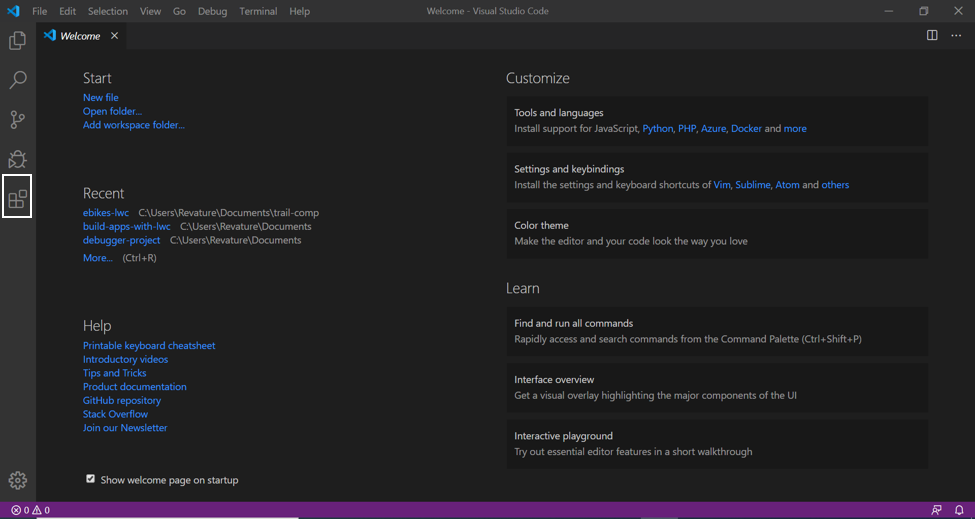
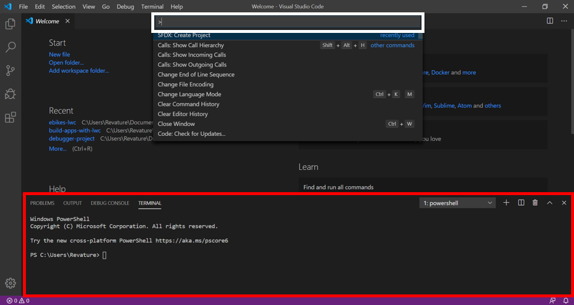
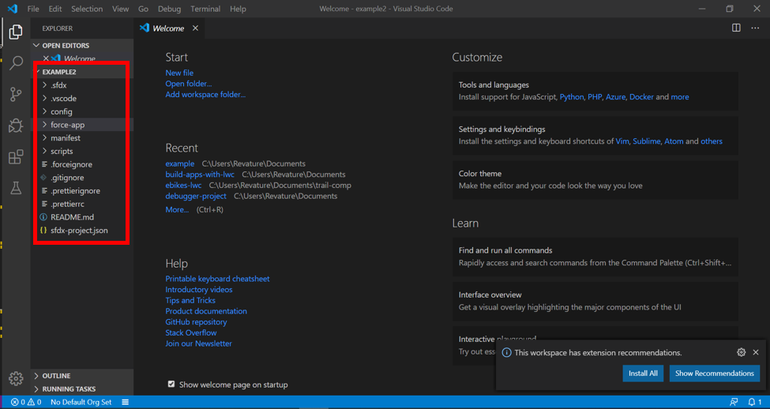
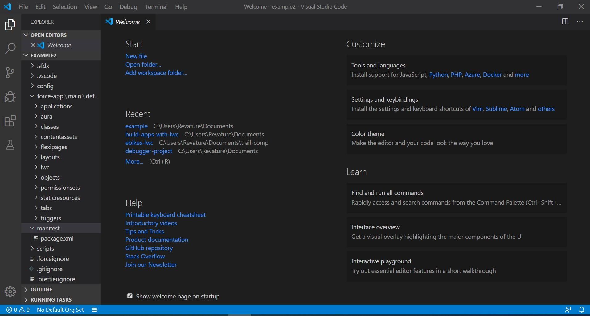
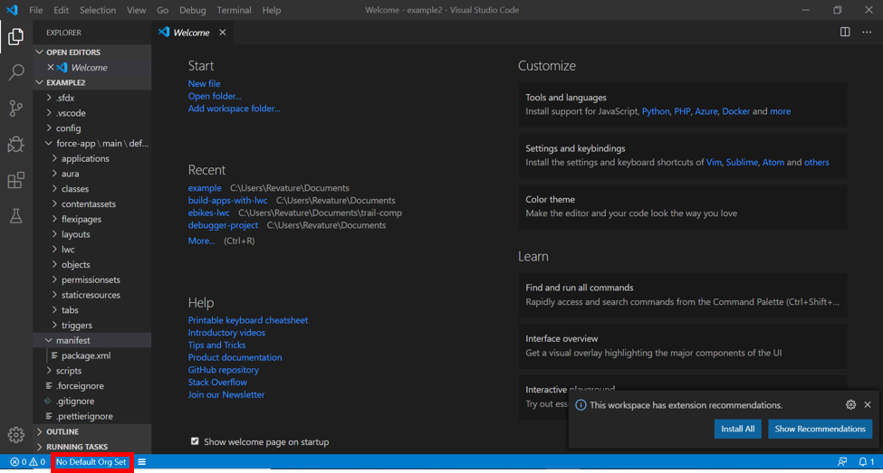

# Module - SFDX & Visual Studio Code

This module introduces SFDX and the use of Visual Studio Code for development.

## Table of Contents

### Helpful References/Links

* [Visual Studio Code Download](https://code.visualstudio.com/download)
* [Salesforce CLI Download](https://developer.salesforce.com/tools/sfdxcli)
* [Salesforce CLI Install Instructions](https://developer.salesforce.com/docs/atlas.en-us.sfdx_setup.meta/sfdx_setup/sfdx_setup_install_cli.htm)
* [Salesforce Extension Pack Download](https://developer.salesforce.com/docs/atlas.en-us.sfdx_setup.meta/sfdx_setup/sfdx_setup_install_cli.htm)
* [Metadata Types (Metadata API Developer Guide)](https://developer.salesforce.com/docs/atlas.en-us.api_meta.meta/api_meta/meta_types_list.htm)
* [force Namespace (Salesforce CLI Command Reference)](https://developer.salesforce.com/docs/atlas.en-us.sfdx_cli_reference.meta/sfdx_cli_reference/cli_reference_force.htm)
* [Command Reference (Salesforce Extensions for Visual Studio Code)](https://developer.salesforce.com/tools/vscode/en/user-guide/vscode-commands/)

## Salesforce Development Environments

While we have many options for development environments when coding for the Salesforce platform, Visual Studio Code (VSC) is the best available option. Let's lay out the landscape, walking through all of the available choices, and see why this is the case.

## Why Visual Studio Code? _(A word about your development environment options)_

The olden days also contained the (still available) Development Mode Footer 

In addition, the VDMF renders your code in Salesforce Classic.

Finally, as the name suggests, you can only edit code in the Visualforce Framework (Visualforce pages and their associated Apex controllers) in the VDMF.

Next, we will touch on the Page Edit. To get to this option, you can search for Visualforce Pages or Apex Classes in the Quick Find in Setup, then click the Edit button. Read that last sentence again, the Page Edit is limited to only editing Visualforce markup or Apex code, i.e. once we get to material such as Aura components, this won't be an option for all of the markup you will have to write. In my opinion, this is a fine enough choice for quick edits, but it's not an IDE, so you miss out on all those fine features. Are there some days where you just don't have your head on straight and you're making a lot of syntax mistakes? Me too. Unfortunately, this editor won't catch those in real-time for you (you'll have to try to preview your Visualforce page to get all the fun errors).

Finally, the last cloud-based development environment is the Developer Console. As stated earlier, it is by no means perfect, but it certainly has its uses. The Developer Console is the easiest environment to run tests in and (arguably) debug your code; it has a nice user interface for creating files. But it has some major drawbacks. As mentioned before, it is buggy. Sometimes you can get Container ID errors that pop-up and yell at you, sometimes it decides to take FOREVER to save. Most damaging, the Developer Console can't be bothered to lock a file to other users while you are editing it. So if you and another user in the same org are editing the same file at the same time, you'll keep overwriting each other's work (fun!). It also does not let you save your code unless it is exception-free (whether this is a good or bad thing can be debated).

Alright, the moment you have been waiting for with bated breath: VS Code. After the dark ages of the Force.com IDE, Salesforce decided to turn toward VS Code as the preferred third-party IDE. The Salesforce CLI (available outside of VS Code as well) and Salesforce Extension Pack for VS Code give a lot of great features that makes VS Code a robust and powerful tool. The extension pack comes with support for Aura Components, Lightning Web Components, Visualforce, and Apex. Creating a new class or file can be as easy as right-clicking the appropriate folder and choosing the correct command, or pressing CTRL + Shift + P on Windows or Command + Shift + P on Mac to bring up the command palette and typing in the appropriate action. The command palette also offers options for authorizing orgs (which we'll explain later), deploying and retrieving source code, and more. If you're weird like me and would prefer to type these actions out as shell commands, you can open a terminal within VS Code and execute the corresponding Salesforce CLI commands. In fact, two main Salesforce development models (the Org and Package Development Models) heavily utilize integration with VS Code. Finally, VS Code comes with built-in git integration. This is *important*: once you start working on team-based projects, VS Code will become essential to you - it will be the pipeline connecting your individual org and your team's source of truth living in your version/source control system.

## Installing Visual Studio Code

You can download Visual Studio Code [here](https://code.visualstudio.com/download). In addition to installing Visual Studio Code, you should download and install the [Salesforce CLI](https://developer.salesforce.com/tools/sfdxcli), following the instructions [here](https://developer.salesforce.com/docs/atlas.en-us.sfdx_setup.meta/sfdx_setup/sfdx_setup_install_cli.htm). You can install the Salesforce Extensions for Visual Studio Code either from the link in the Helpful References/Links section, or by clicking the Extension tab on the sidebar in VS Code (surrounded by the white rectangle in the picture below) and searching for 'Salesforce Extension Pack'.

## SFDX

The Salesforce Developer Experience (SFDX) is the overarching group of integrated development tools we were talking about earlier: Salesforce Extensions for Visual Studio Code and the Salesforce CLI. Emerging out of the darkness that was the era of the Force.com IDE, SFDX is source-driven development-focused (i.e. it easily interacts with Git, as we stated earlier). With SFDX, you can retrieve a larger range of metadata (definitions that describe your org) than in the past. SFDX is an essential part of the two development models (Org and Package Based Development) we discussed in the Why Visual Studio Code? section. Package Based Development (PBD) involves breaking your metadata into (usually) independent packages and makes use of development tools such as scratch orgs (we'll talk more in-depth about PBD later in this module). Org Based Development (OBD) differs from PBD in that we don't have separate packages, rather all of our source lives together in one location. Throughout the rest of this module, we'll look at commands related to PBD, OBD, and general use of VS Code for Salesforce, defining terms and concepts where necessary.

## SFDX Commands

#### Command Palette vs. Terminal

There are two ways to go about performing the same actions in VS Code. You can bring up the command palette (through CTRL + Shift + P on Windows or Command + Shift + P on Mac; enclosed by the white rectangle above) and enter the command (the palette will suggest actions as you type). You may also enter the terminal (enclosed in the red rectangle above) in VS Code by clicking on the View dropdown, then clicking Terminal or using the shorcut CTRL + ' on Windows or ^ + ' on Mac. Once the terminal is open, you can type a command (there is no auto-complete in the terminal). Your author sometimes prefers to do things through the terminal to feel more like a super cool shell programmer.

The table at the beginning of each succeeding section will list the actions we'll discuss in that section. For some of the actions, the terminal and command palette commands don't have exactly the same effect, but we'll highlight where this is the case.

#### Creating Projects and Packages

| Action | Terminal Command | Command Palette Command |
| --------------- | --------------------------- | --------------------- |
| Create an SFDX Project | sfdx force:project:create -n nameOfProject | SFDX: Create Project |
| Create an SFDX Project with Manifest | sfdx force:project:create -n nameOfProject -x manifest/package.xml | SFDX: Create Project with Manifest |

A project is a set of default directories and files that can easily be pushed to a version control system or our org. The first picture above shows the default folders/files created by making a project with manifest. Our actual customizations live in the force-app/main/default directory (expanded in the second image). By default this directory contains twelve inner directories, each corresponding to a different metadata type. For example, the Triggers directory will hold Apex triggers. For a complete list of metadata types, check out Metadata Types in Helpful References/Links.

The difference between a project and a project with manifest is the manifest/package.xml file shown in the second image (collapsed to just the manifest directory in the first image). The package.xml manifest will get its own section later in this module.

#### Authorizing Orgs

| Action | Terminal Command | Command Palette Command |
| --------------- | --------------------------- | --------------------- |
| Authorize an Org | sfdx force:auth:web:login -a orgAliasName | SFDX: Authorize an Org |

Having a project/package is great, but if we want to have that source ever do anything in an org, we have to connect an org to VS Code in the first place! Running the command to authorize an org through either the command palette or terminal will open up new tab with a Salesforce login screen in your browser, where you will enter your credentials for the org you wish to connect and click 'Allow' on the following page. 

#### Setting Defaults and Aliases

| Action | Terminal Command | Command Palette Command |
| --------------- | --------------------------- | --------------------- |
| Set a Default Org | sfdx force:config:set defaultusername=orgAlias | SFDX: Set a Default Org |
| Set an Org Alias | sfdx force:alias:set aliasName=orgusername@org.com | N/A |

what about global

If you have been using command palette commands, you will usually not have a use for this command as the SFDX: Authorize an Org command automatically sets the newly authorized org as the project default. A third way to go about setting a default is by clicking the No Default Org Set button in the below picture, which will open up the command palette and allow you to select a default org for that project. Once you have set a default org, No Default Org button will change to a plug icon followed by the alias of that org.

Speaking of aliases, they're pretty helpful! Rather having to decipher that awesomeadmin@resourceful-bear-v02pbw.com is the username for the connected org where you are working on, for example, your Project 2; you can set an alias for that org, such as RevatureProject2 that makes the purpose of the org much clearer. If you've been using the command palette commands, you set an alias when authorizing an org (or a default is set for you), which is why there's no separate palette command for aliasing. Aliases can also be set through the authorization terminal commands with the -a parameters.

#### Opening Connected Orgs

| Action | Terminal Command | Command Palette Command |
| --------------- | --------------------------- | --------------------- |
| Open a Connected Org | sfdx force:org:open -u orgAlias | SFDX: Open Default Org |

Now that you have an org connected, all you have to do to login to that org is go to Trailhead, login, go to your Hands-on Orgs, and finally click on the username of that org, right? Wrong! You can open a connected org from VS Code. You can specify an org in the terminal command for opening orgs; but if you don't, the default org for your project will be opened. This holds true for all terminal commands - if you have a default org set and don't specify an org in the command, the default org will be the targete of that action (huh, that's why they call it a default!).

#### Listing Connected Orgs

| Action | Terminal Command | Command Palette Command |
| --------------- | --------------------------- | --------------------- |
| List All Connected Orgs | sfdx force:org:list | SFDX: List All Aliases |

The terminal and command palette commands for listing connected orgs are not quite the same: the command palette command will display only the names of _aliased_ orgs in the Output tab at the bottom of the VS Code window. On the other hand, the terminal command will display all connected orgs (including orgs that you may not have given an alias when authorizing through the terminal), as well as additional information such as whether the org is the default Dev Hub for the project.

#### Deploying and Retrieving Source to and from Orgs

| Action | Terminal Command | Command Palette Command |
| --------------- | --------------------------- | --------------------- |
| Deploy Source to an Org | sfdx force:source:deploy | SFDX: Deploy Source to Org |
| Retrieve Source from an Org | sfdx force:source:retrieve | SFDX: Retrieve Source From Org |

There are many ways to deploy and retrieve source from orgs; we'll quickly touch on each. First let's note the terminology, when we are interacting with non-scratch orgs, we deploy and retrieve source; when we are using git, we push and pull source. There are two important things to recognize in this nomenclature difference. The first is recognizing the appropriate command (i.e. don't waste your time searching for SFDX: Push Source to Org). The second is understanding the different meanings: when pulling and pushing with git (and, as we'll discuss shortly, from and to scratch orgs), the operation will be rolled back if the system detects a conflict between the local and remote source. There are _no_ such protections with deploying and retrieving; when you are deploying source to an org, you are overwriting the source currently in that org and when you are retrieving from an org, you are overwriting the local source.

With that out of the way, let's first address variations of terminal commands. You can add the -x parameter and the path to your package.xml file (usually manifest/package.xml) to deploy the metadata specified in the file to your org or retrieve that same metadata from your org. Instead, you could add the -p parameter and specify the path to your actual source, getting as granular as you would like (e.g. force-app/main/default/ and force-app/main/default/classes/exampleClass.cls are both valid paths). Alternately, you can add the -m parameter and specify either the metadata type that you would like to deploy/retrieve all instances of or the specific members of that metadata type (e.g. -m ApexClass or -m ApexClass:exampleClass). The path (-p) and metadata (-m) parameters can be comma-separated lists of multiple paths/metadata types, respectively.

Before moving on, let's quickly address file extensions. Developer Console users may have assumed that the .cls extension above was a typo, because of course the file extension for an Apex class is .apxc, right? Well.... not exactly - many file extensions are different outside of Salesforce; and that .cls instead of .apxc is just one example. Check the file extensions of your local source for more examples. Don't worry though - you don't have to do anything special to deploy a .cls file to a target .apxc file, Salesforce takes care of that for you.

There are additional nuances in the command palette commands. SFDX: Deploy Source to Org and SFDX: Retrieve Source from Org cannot be entered from the command palette, rather you right-click on the force-app/main/default directory or any of its subdirectories/files and choose the appropriate command. If you have a file open in VS Code, you can enter the shortcut to open the command palette and choose SFDX: Retrieve This Source from Org or SFDX: Deploy This Source to Org to retrieve/deploy, respectively, the source in that particular file. Finally, if your project has a manifest, you can open the command palette and choose SFDX: Retrieve Source in Manifest from Org or SFDX: Deploy Source in Manifest to Org to retrieve/deploy the metadata specified in your package.xml file.

## Package.xml Manifest

Alright, time to finally address the package.xml manifest! Let's take a look at an example of the package.xml file:

    <?xml version="1.0" encoding="UTF-8" standalone="yes"?>
    <Package xmlns="http://soap.sforce.com/2006/04/metadata">
        <types>
            <members>*</members>
            <name>ApexClass</name>
        </types>
        <version>47.0</version>
    </Package>

This is a shortened version of the default package.xml created when you create a project with manifest, so let's quickly break down this bite-sized file. The first line indicates the type of the file - it's XML. As much as your didactic author would like XML to stand for eXtreme Markup Language, it actually stands for Extensible Markup Language, and consists of tags that look a lot like HTML tags. The second line specifies the XML namespace, which dictates the syntax for our file.

The following lines consist of \<members> and \<name> tags nested in \<types> tags. Each types tag contains one name, which specifies the type of metadata contained in the tag, and at least one member, which specifies which components (i.e. instances) of that type to retrieve/deploy. It is best practice to have at most one types tag per metadata type. Members are specified through their API names. In some cases, members can also be specified by using the asterisk (*), but there are varying levels of support among the different metadata types. For example, using the asterisk for the CustomObject type will only retrieve custom objects (not standard objects, even though CustomObject is also the metadata type for standard objects). On the other hand, the Report metadata type does not support use of the asterisk at all. Check the documentation for wildcard support!

The last line before the closing package tag specifies the Salesforce API version used for the metadata. In the case of our example file, it's API version 47.0, which corresponds to the Winter '19 release of Salesforce.

#### Wait, What About all Those Other XML files?

You may have noticed that your source has two files for each metadata component: the actual component file itself and then an additional componentname.metadataextension-meta.xml file. Rather than wrapping metadata in package tags, these files wrap metadata in the tag for the appropriate metadata type (e.g. CustomObject tags for objects). They contain information about that individual metadata component. For types like ApexClass, this can be as simple as the API version and whether the class is active or not. Other types like CustomObject have much longer files that specify details such as their Search Layouts and Organization Wide Defaults for sharing. These XML files are automatically deployed/retrieved as part of the corresponding metadata component.

## help!!

In addition to looking at the documentation linked in the Helpful References/Links section, you can also append -h as the sole parameter with any Salesforce CLI command to print information about using that particular command to the terminal.
