# Module - SOQL

This module introduces SOQL.

## Table of Contents

* [From SQL to SOQL (and DML)](#from-sql-to-soql-and-dml)
* [Basic SOQL Syntax](#basic-soql-syntax)
* [Query Editor](#query-editor)
* [Optional SOQL Clauses](#optional-soql-clauses)
	* [WHERE](#where)
	* [WITH](#with)
	* [GROUP BY and HAVING](#group-by-and-having)
	* [ORDER BY](#order-by)
	* [LIMIT](#limit)
	* [OFFSET](#offset)
	* [FOR REFERENCE](#for-reference)
	* [FOR UPDATE](#for-update)
* [SOQL Return Types](#soql-return-types)
* [Variable Binding in SOQL and SOSL](#variable-binding-in-soql-and-sosl)
* [SOQL Query Functions](#soql-query-functions)
	* [Aggregate Functions](#aggregate-functions)
	* [FORMAT](#format)
	* [Date Functions](#date-functions)
* [Relationship Queries](#relationship-queries)
	* [Child-to-Parent Queries](#child-to-parent-queries)
	* [Parent-to-Child Queries](#parent-to-child-queries)
* [Field Expression Syntax](#field-expression-syntax)
	* [Operators](#operators)
	* [Date Literals](#date-literals)
* [Working with Query Results](#working-with-query-results)
* [SOQL For Loops](#soql-for-loops)

### Helpful References/Links

* [SOQL and SOSL Reference](https://developer.salesforce.com/docs/atlas.en-us.soql_sosl.meta/soql_sosl/sforce_api_calls_soql_sosl_intro.htm)
* [SOQL and SOSL (Apex Developer Guide)](https://developer.salesforce.com/docs/atlas.en-us.apexcode.meta/apexcode/langCon_apex_SOQL.htm)
* [FIELDS() (SOQL and SOSL Reference)](https://developer.salesforce.com/docs/atlas.en-us.soql_sosl.meta/soql_sosl/sforce_api_calls_soql_select_fields.htm)
* [WITH DATA CATEGORY _filteringExpression_ (SOQL and SOSL Reference)](https://developer.salesforce.com/docs/atlas.en-us.soql_sosl.meta/soql_sosl/sforce_api_calls_soql_select_with_datacategory.htm#topic-title)
* [Variable Binding in SOQL and SOSL (Apex Developer Guide)](https://developer.salesforce.com/docs/atlas.en-us.apexcode.meta/apexcode/langCon_apex_SOQL_variables.htm)
* [Aggregate Functions (SOQL and SOSL Reference)](https://developer.salesforce.com/docs/atlas.en-us.soql_sosl.meta/soql_sosl/sforce_api_calls_soql_select_agg_functions.htm)
* [Date Functions (SOQL and SOSL Reference)](https://developer.salesforce.com/docs/atlas.en-us.soql_sosl.meta/soql_sosl/sforce_api_calls_soql_select_date_functions.htm)
* [Date Formats and Date Literals (SOQL and SOSL Reference)](https://developer.salesforce.com/docs/atlas.en-us.234.0.soql_sosl.meta/soql_sosl/sforce_api_calls_soql_select_dateformats.htm)


## From SQL to SOQL and DML

If we have experience working with SQL, the transition to the database languages on the Salesforce platform should not be all that difficult. Let's take a look at a quick diagram including a couple SQL sublanguages to illustrate this point.

<p align="center">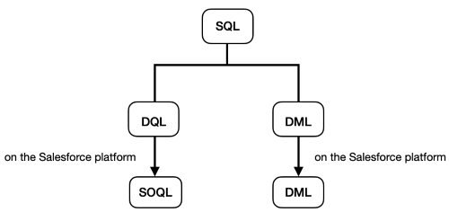</p>

Data Manipulation Language (DML) has a cousin of the same name on the Salesforce platform that also allows us to perform create, update, and delete operations. Data Query Language (DQL) functionality can be found in the Salesforce Object Query Language (SOQL). Despite the comparisons that we're drawing, we want to take note that SOQL and DML are considered to be separate database languages on the Salesforce platform - SOQL has no ability to make changes to the database.

## Basic SOQL Syntax

The basic syntax of the SOQL query is analogous to a DQL statement within square backets, as we can see from the following pseudo-query:

```sql
[SELECT fieldName FROM objectName]
```

Here, `fieldName` in the `SELECT` clause refers to the API name of the field that we want to retrieve. If we want to retrieve multiple fields, we'll simply comma-separate their API names. In the `FROM` clause, `objectName` is the API name of the object that we're querying. To write a valid SOQL query, we must include at least one field in our `SELECT` clause and _exactly_ one object in the `FROM` clause (no more, no less).

SOQL is case-insensitive, but (like with SQL) it is standard to write clauses in all caps to help the readability of our queries by differentiating the system-defined keywords and the specific field names/conditions that are unique to our query.

Before we continue, we need to take note of a piece of DQL functionality - the `*` - which is not available in SOQL and therefore cannot be used to select all fields from an object. However, SOQL does have a `FIELDS()` function, which comes in three forms, as seen in the following table.

| `FIELDS()` Variant | Returns |
| ---------------- | ------- |
| `FIELDS(ALL)` | All fields from an object (both standard and custom). |
| `FIELDS(CUSTOM)` | All custom fields from an object. |
| `FIELDS(STANDARD)` | All standard fields from an object. |

We should note that only the `FIELDS(STANDARD)` variant is available when we're executing a SOQL query within Apex code.

Let's continue our SOQL exploration with optional clauses. But first, a word about those square brackets.

## Query Editor

When using SOQL in our Apex code, the square brackets surrounding the query are required. But as the image below shows, they are not included when using the Query Editor. The Query Editor is a feature of the Developer Console that allows us to edit retrieved records and save our changes to the database, in addition to providing the ability to delete records, insert records, and open up the record detail and edit pages for retrieved records.

<p align="center">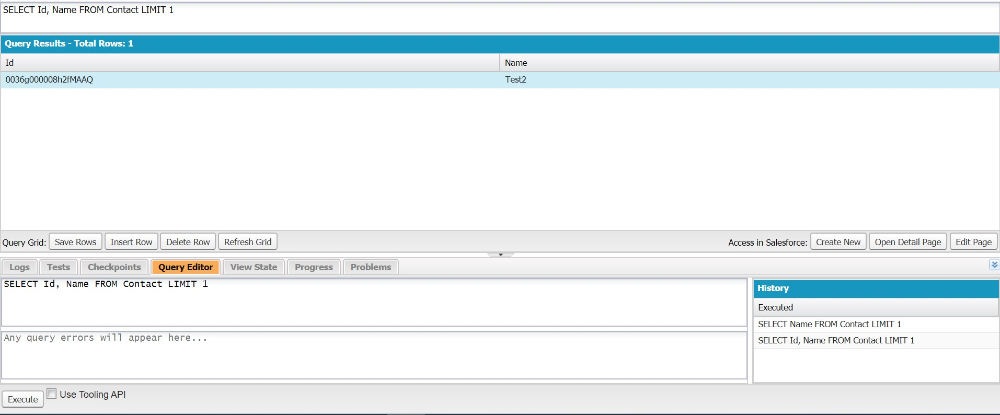</p>

If we use the Query Editor, it will most often be to check the results of our queries before including them in our Apex code. We'll practically always use Apex to manipulate returned records and if we want to perform mass edits to records, other tools such as Microsoft Excel are generally better suited to the job than the Query Editor is.

## Optional SOQL Clauses

Let's turn to the remainder of the available SOQL clauses, which are all optional. The pseudo-query below shows these clauses each on their own line (starting with `WHERE`). The clauses are listed in the order that they must appear in if present (i.e. if we choose to include both a `WHERE` and `LIMIT` clause in our query - neither of which are required - `LIMIT` must come after `WHERE`). The compiler will get very confused if we don't follow the prescribed clause order, giving us an `Unexpected token '('.` syntax error. 

```sql
SELECT fieldName FROM objectName
	WHERE fieldName comparisonOperator value
	WITH
	GROUP BY fieldName
	HAVING aggregate comparisonOperator value
	ORDER BY fieldName
	LIMIT n
	OFFSET n
	FOR REFERENCE
	FOR UPDATE
```

Many of these clauses function similarly to how their SQL cousins do, as we can see in the following table.

| Optional SOQL Clause | Functions the Same in SQL and SOQL |
| -------------------- | ---------------------------- |
| `WHERE` | |
| `WITH` | |
| `GROUP BY` | |
| `HAVING` | |
| `ORDER BY` | |
| `LIMIT` | |
| `OFFSET` | |
| `FOR REFERENCE` | |
| `FOR UPDATE` | |

### WHERE

`WHERE` acts as a filter to include only those records we want to return. The syntax for this clause follows the format `WHERE comparisonOperator value`, e.g.

```java
System.debug([SELECT Name FROM Account WHERE Name = 'Edge Communications']);
``` 

This query produces the following output in our debug logs.

<p align="center">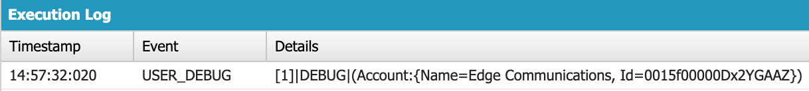</p>  
      
We'll address the available comparison operators later in this module, but let's continue our clause exploration for the moment.

### WITH

While `WHERE` filters based on field value, `WITH` filters based on either data category, user profile Chatter feed, or user permissions. We'll quickly touch on each of the three to varying degrees.

First up: filtering by data categories, which are groups of Salesforce Knowledge articles. We can filter by data category with a statement in the form of `WITH DATA CATEGORY filterExpression` when querying either the `KnowledgeArticleVersion` or `Question` standard objects.

We won't go further in-depth on filtering by a user's profile feed beyond speaking of its existence. So let's instead turn to the `WITH` clause we're likely to use most frequently - `WITH SECURITY_ENFORCED`, which allows us to filter based on user access to the objects and fields in our query. If the running user doesn't have read access to every object and field included in the query, a `System.QueryException` will be thrown and nothing will be returned from the query.

### GROUP BY and HAVING

`GROUP BY` groups retrieved records by the field we specify, while `HAVING` can function like a `WHERE` for the `GROUP BY` clause in that it allows us to filter the grouped records (hence why we're addressing the two together). Let's look at some code that uses `GROUP BY` and `HAVING` in practice.

```java
System.debug([SELECT AccountSource, CustomerPriority__c, SUM(AnnualRevenue) FROM
	Account GROUP BY AccountSource, CustomerPriority__c HAVING SUM(AnnualRevenue) 
	> 0]);
```

Which gives us the following (truncated) output:

<p align="center">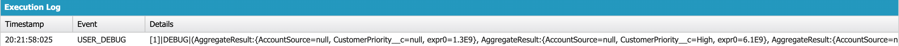</p>

This query returns a sum of the annual revenue for each combination of `AccountSource` and `CustomerPriority__c` values within our records. We're grouping by these fields in part because we must group by any field that is (a) in the `SELECT` clause and (b) not acted on by an aggregate function.

We're also required to use either a `GROUP BY` clause and/or have an aggregate function in our query to use the `HAVING` clause. This latter option implies that `HAVING` allows us to filter our query by the results of an aggregate function - and indeed it does! To be more specific: the `WHERE` clause is used to filter before an aggregate operation is performed, while `HAVING` filters after the results of the aggregate function have been calculated.

### ORDER BY

The simplest version of the `ORDER BY` clause follows the form `ORDER BY fieldName`. But we can expand the clause by optionally specifying whether to sort by ascending (alphabetically/lower-to-higher numbers) or descending (reverse alphabetically/higher-to-lower numbers) order by appending either `ASC` or `DESC` to the end of our clause, respectively. We can also dictate that null field values should be at the top (`NULLS FIRST`) or bottom (`NULLS LAST`) of our sorted list. If we don't include these optional specifications, our query will default to `ASC` and `NULLS FIRST`. If both are included, sort order must precede null value specification.

Now for a query that makes use of `ORDER BY`:

```java
System.debug([SELECT Name, AnnualRevenue FROM Account ORDER BY AnnualRevenue ASC 
	NULLS LAST]);
```

And the associated debug log:

<p align="center">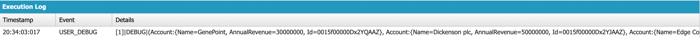</p>

### LIMIT

The `LIMIT` clause is used to restrict the number of returned records to a _maximum_ of the specified integer, e.g.:

```java
System.debug([SELECT Name FROM Account LIMIT 1]);
```

Which outputs the following:

<p align="center">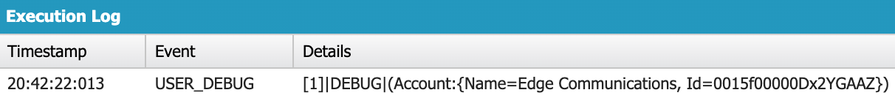</p>

### OFFSET

`OFFSET` skips the specified number of records when returning query results by discarding those records from the list of query results _before_ returning them from the server. That `before` can be important for ensuring that we stay within the governor on the number of records our SOQL queries can collectively retrieve in a single transaction because records discarded with the `OFFSET` clause don't count toward this limit.

So when we execute a query like the following one, the amount of records retrieved for the purposes of governor limits will be the number of accounts in our org, less the ten that we discarded with `OFFSET`.

```java
List<Account> accList = [SELECT Name FROM Account ORDER BY Name OFFSET 10];
```

The above query will first order our records ascending alphabetically by name and then discard the first ten records from the resulting list. This combination of `OFFSET` and `ORDER BY` - along with a `LIMIT` clause - can be used for implementing pagination with groups of records because `LIMIT` will allow us to control the number of records displayed per page, `ORDER BY` will sort the results of our query, and `OFFSET` will discard the specified number of those sorted records so that we only return the records we want to display on a given page.

### FOR REFERENCE

`FOR REFERENCE` updates system fields and `Recently Viewed` lists, so adding this clause will assign the current date to the `LastReferencedDate` field on any records related to the queried record. It will also update the records of the `RecentlyViewed` object, which holds the up to 200 most recently viewed records of an object for a user over the last 90 days. If a record already has a corresponding `RecentlyViewed` record, that `RecentlyViewed` record's system fields will be updated. If there is no related `RecentlyViewed` record, a new one will be created.

### FOR UPDATE

The last optional clause we will touch on is the `FOR UPDATE` clause, which locks records retrieved by the query to other users so that they cannot be edited by anyone or anything except our code for the duration of the transaction. As the name would suggest, this clause is useful when querying for records that will be updated. But we should note that the transaction does not start with the SOQL query and end with its return, rather the records will be locked from at least the first reference to/instantiation of the enclosing class (if the query result is assigned to a class member variable) or method that executes our query until at least the end of the method that caused the query to be executed (whether it contained the query or instantiated a class that contained the query).

## SOQL Return Types

Most of our example code snippets so far have simply printed the results of a query to the debug logs. But we'll obviously want to be able to assign the record(s) returned from a query to a variable in our code, so let's discuss SOQL return types.

The return type that we'll use most often is the `List<sObject>`, where `sObject` will be replaced by the object we're executing the query against (e.g. `List<Account>`), as specified in the `FROM` clause. Note that we don't need to instantiate the `List` ahead of time, so both of the following statements are valid Apex code.

```java
List<Account> accListOne = [SELECT Id FROM Account];
List<Account> accListTwo = new List<Account>([SELECT ID FROM Account]);
```

The other main SOQL return type is a single `sObject`, e.g. a `Contact`. However, we won't use this return type all that often and even when we do, we'll want to ensure that our query will return exactly one record so that we don't get an error. If our query returns zero records or more than one record and we try to assign that result to a single `sObject`, we'll encounter the `QueryException`. While we can use a `LIMIT` clause to ensure that we don't retrieve _more_ than one record, we should recall that this clause simply sets a maximum on the number of returned records - it does not guarantee any minimum number of results, so we can still get an exception if our query doesn't return any records.

Other SOQL return types include `Integer` and `List<AggregateResult>`, but we'll save both of these for our discussion of aggregate functions.

## Variable Binding in SOQL and SOSL

In addition to using integers or string literals with our optional clauses, we can also bind Apex variables within these fitlers. To implement variable binding, we prefix the name of the variable we want to use with a colon (as demonstrated below).

```java
String accountName = 'Edge Communications';
List<Account> accs = [SELECT Id FROM Account WHERE Name = :accountName];
```

Note that we cannot use variable binding in the `SELECT` or `FROM` clauses.

## SOQL Query Functions

### Aggregate Functions

We'll begin our exploration of the functions we can use within our SOQL queries with aggregate functions, which allow us to perform one of six mathematical operations - `COUNT`, `COUNT_DISTINCT`, `MIN`, `MAX`, `SUM`, or `AVG` - against the records that match our SOQL queries, as explained in the following table.

| Aggregate Function | Returns |
| ------------------ | ------- |
| `COUNT` | The number of matching results |
| `COUNT_DISTINCT` | The number of unique, non-null matching results |
| `MIN` | The minimum of the results |
| `MAX` | The maximum of the results |
| `SUM` | The total of the results | 
| `AVG` | The average of the results |

Note that `AVG` and `SUM` can only operate on numeric fields (i.e. those with either the `Currency`, `Number`, `Percent`, `Roll-Up Summary`, or `Formula` - with a numeric return type - field data types). Let's look at some examples of these functions:

```java
Integer numAccounts = [SELECT COUNT() FROM Account];
List<AggregateResult> uniqueSources = [SELECT COUNT_DISTINCT(AccountSource) FROM
	Account];
List<AggregateResult> minRevenue = [SELECT MIN(AnnualRevenue) FROM Account];
List<AggregateResult> maxRevenue = [SELECT MAX(AnnualRevenue) FROM Account];
List<AggregateResult> totalRevenue = [SELECT SUM(AnnualRevenue) FROM Account];
List<AggregateResult> avgRevenue = [SELECT AVG(AnnualRevenue) FROM Account];
```

As we can see from the above queries, aggregate functions introduce the two additional query return types - `Integer` and `List<AggregateResult>` - that we spoke of earlier. Note that the `Integer` return type is _only_ available for queries that use the `COUNT()` function without any parameters or any other fields specified in the `SELECT` clause. But although we didn't discuss it at the time, the `List<AggregateResult>` is also the return type for any queries that use a `GROUP BY` clause.

We should also note that the `AggregateResult` objects returned are read-only and, unlike when working with `sObjects`, we can't use dot notation to reference the fields of an `AggregateResult`. This makes sense because the fields of an `AggregateResult` - unlike the fields of, e.g., `Account` - aren't set ahead of time, rather they're determined by our query.

Therefore, we instead access the fields and function results of our query results by calling the `get()` method on the `AggregateResult`. This method takes a single parameter - a string holding the name of the field whose value we want to retrieve. For fields that haven't been operated on by aggregate functions, this is simple enough because we'll just use the API name of the field. But for fields that are aggregated, we'll need to use a different name. Whenever we include an aggregate function in a query, we'll be able to access the results of that function by passing `exprN` to the `get()` method, where `N` is an integer that starts at `0` for the leftmost aggregate function and increments by one going rightward.

However, we're not limited to using these predetermined, non-self-documenting names. Rather we can make use of aliasing, which is available for any query that uses an aggregate function. To alias, we simply provide our desired name for the function results after the closing parenthesis of the function and before the next part of our query (whether that's a comma before another field in the `SELECT` clause or the beginning of the `FROM` clause).

Let's take a look at some example code to tie this together.

```java
List<AggregateResult> expectedOppRevPerAccount = [SELECT Account.Name accName, 
	SUM(ExpectedRevenue) sumExpectedRev FROM Opportunity GROUP BY Account.Name
	HAVING SUM(ExpectedRevenue) > 0];

for(AggregateResult ar : expectedOppRevPerAccount) {
	System.debug('The expected opportunity revenue for ' + ar.get('accName') + 
		' is $' + ar.get('sumExpectedRev') + '.');
}
```

And the resulting output:

<p align="center">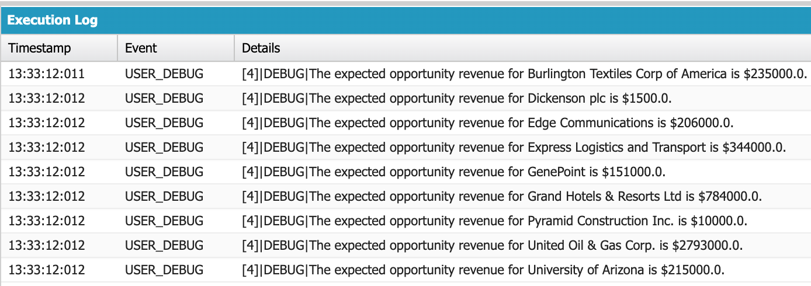</p>

As the code shows, we can also alias other fields in a query that uses aggregate functions. In fact, this is necessary in our particular use case because the `get()` method on `AggregateResult` does not accept dot notation in the argument that we pass to it. Although we grouped the results of our query, we can use an aggregate function without an accompanying `GROUP BY` clause, so long as we don't include a `LIMIT` clause.

### FORMAT

While we attempted to provide well-formatted output from our above query, we didn't get the aggregate function results to be properly formatted as a currency value. Enter the `FORMAT()` function, which we can use to apply the format determined by a user's locale to standard and custom `Number`, `Date`, `Time`, and `Currency` fields. Like aggregate functions, `FORMAT()` also supports aliasing. In fact, we'll need to use aliasing and the `get()` method if we want to retrieve the formatted result. So let's make use of the format function in our above query (for brevity, we'll only display line that includes the query below because everything else from the code snippet in the `Aggregate Functions` section will remain the same).

```java
List<AggregateResult> expectedOppRevPerAccount = [SELECT Account.Name accName, 
	FORMAT(SUM(ExpectedRevenue)) sumExpectedRev FROM Opportunity GROUP BY
	Account.Name HAVING SUM(ExpectedRevenue) > 0];
```

And our new results:

<p align="center">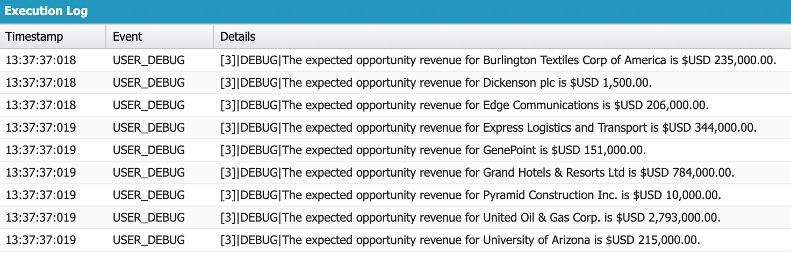</p>

### Date Functions

Of course, having the sum of the expected revenue for all opportunities related to an account across all time isn't all that useful. How do we know if our business with that particular account is growing or declining? How can we tell if there's one time of the year (e.g. the holiday season) that makes up a large portion of our sales to that customer?

For these and other use cases, we can make use of the date functions listed in the following table.

| Date Function | Returns |
| ------------- | ----------- |
| `CALENDAR_MONTH()` | The number corresponding to the month of a date value, from 1 (January) to 12 (December).
| `CALENDAR_QUARTER()` | A number representing the quarter of a date value; either 1 (first quarter - 1 January to 31 March), 2 (second quarter - 1 April to 30 June), 3 (third quarter - 1 July to 30 September), or 4 (fourth quarter - 1 October through 31 December). |
| `CALENDAR_YEAR()` | The four digit year of a date value. |
| `DAY_IN_MONTH()` | The number corresponding to the day of the month for a date value, starting from 1 (the first of the month). |
| `DAY_IN_WEEK()` | The number corresponding the day of the week for a date value, from 1 (Sunday) to 7 (Saturday). |
| `DAY_IN_YEAR()` | The number corresponding to the date's place in the year, from 1 (1 January) to 365 or 366 (31 December, depending on whether the year is a leap year). |
| `DAY_ONLY()` | The date portion of a `DateTime` value. |
| `FISCAL_MONTH()` | The number corresponding to the month of a date value in the fiscal year defined for our org, from 1 (the start of the fiscal year) to 12 (the last month of the fiscal year). |
| `FISCAL_QUARTER()` | A number representing the fiscal quarter of a date value, as determined by the fiscal year defined for our org. |
| `FISCAL_YEAR()` | The four digit number representing the fical year of a date value, as determined by the fiscal year defined for our org. |
| `HOUR_IN_DAY()` | The number representing the hour of a `DateTime` value, in 24-hour format. |
| `WEEK_IN_MONTH()` | The number representing the week of a month for a date value. Starting from 1 for the 1st through the 7th of a month, regardless of the day of the week on which the month started. |
| `WEEK_IN_YEAR()` | The number representing the week of the year for a date value. Starting from 1 for 1 January through 7 January, regardless of the day of the week on which the year started. |

Note that we can use date functions both as filters in our optional clauses and to specify the format for date fields in our `SELECT` clause, as demonstrated by the following examples.

```java
List<Opportunity> currYearOpps = [SELECT Id FROM Opportunity WHERE 
    CALENDAR_YEAR(CreatedDate)=2020];

List<AggregateResults> accCreationDays = [SELECT DAY_IN_WEEK(CreatedDate), 
	COUNT(Name) FROM Account GROUP BY DAY_IN_WEEK(CreatedDate)];
```

If we use a date function in the `SELECT` clause, we must also use the `GROUP BY` clause in our SOQL query, which will make the return type of our query a `List<AggregateResult>`.

## Relationship Queries

Although we've demonstrated some use of relationship queries to this point, we haven't addressed how we go about writing them, so let's rectify that. In what will certainly be different for those of us who have SQL experience, we can't create "JOINS" at runtime in SOQL - i.e. any relationships that we're traversing in our queries must have already been defined ahead of time, in our org's metadata. We have two types of relationship queries - child-to-parent and parent-to-child - and the type we're using will be determined by the object in the `FROM` clause of our main query. If it's the parent object, we'll be writing a parent-to-child query. If it's the child object, we'll use a child-to-parent query.

The examples in the following sections will make use of two relationships, one being the standard lookup from `Contact` to `Account` and the second being a custom master-detail from `Tie_Fighter__c` to `Star_Destroyer__c`.

### Child-to-Parent Queries

Because we create all relationships in Salesforce on the child object, querying from that child to a parent object is really quite simple - we just use dot notation followed by the desired field name on the parent object, e.g.

```java
List<Contact> cons = [SELECT Id, Account.Name FROM Contact];
List<Tie_Fighter__c> ties = [SELECT Id, Star_Destroyer__r.Name FROM
	Tie_Fighter__c];
```

Let's break down the above queries. First, our standard relationship query - the API names for standard relationship fields (those that come predefined with Salesforce) follow the format `ParentObjectAPINameId`, e.g. `AccountId`. When traversing this relationship in a child-to-parent query, we simply drop the `Id` from the field's API name and follow with dot notation.

Custom relationship fields, like all other custom fields, end with the `__c` suffix. However, the suffix that we use in our query will depend on the information we want to retrieve. If we only care about the value of the relationship field (i.e. the Id of the parent record), we'll stick with the `__c` suffix following the API name of the relationship field and avoid the use of dot notation and any field API names from the parent object. If we want to retrieve the value of any other field on the parent record, the suffix will change to `__r` and we'll use dot notation followed by the API name of our desired field.

Note that we can traverse up to five relationships through a child-to-parent query.

### Parent-to-Child Queries

To execute a query on a parent object that retrieves information about children records, we'll make use of a subquery - a second SOQL query nested inside of our `SELECT` clause that acts on the child object. Note that this subquery will be delimited by parentheses rather than square brackets, as the following code shows.

```java
List<Account> acc = [SELECT Id, (SELECT LastName FROM Contacts) FROM Account];
List<Star_Destroyer__c> starDestroyers = [SELECT Id, (SELECT Name FROM 
        Tie_Fighters__r) FROM Star_Destroyer__c];
```

Our subquery _must_ include the `SELECT` and `FROM` clauses, but it can include other, optional clauses to filter children records. The object name in the subquery will depend on whether the relationship is standard or custom. If we're using a standard relationship, we'll use the pluralized API name of the child object (e.g. `Contacts` for the relationship between `Contact` and `Account`, `Opportunities` for the relationship between `Opportunity` and `Account`, etc.).

For custom relationship fields, the API name is again pluralized and - like with the child-to-parent queries - the suffix on the API name changes from `__c` to `__r`. The pluralized API name is determined by the value provided to the `Child Relationship Name` field in the field creation wizard when we're creating/editing the relationship field. By default, this value is the plural label of our custom object, with underscores replacing any whitespaces. But we should note that this `__r` suffix must be used for _all_ custom relationships, whether they're created on a custom object or they're a lookup created on a standard object. In this latter case, the `Child Relationship Name` will default to the pluralized API name of the custom object.

We can view the child name for a custom relationship by navigating to `Setup` > `Object Manager`, then selecting the child object, the `Fields & Relationships` tab, and the relationship field. The child name will be displayed with the `Child Relationship Name` field, as indicated by the red rectangle in the following image.

<p align="center">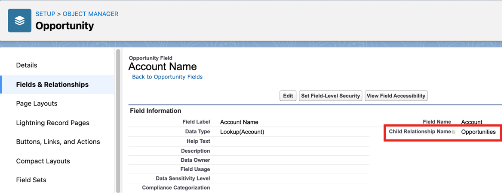</p>

Note that the limit for parent-to-child queries is much more restrictive than that for child-to-parent queries - we can only use one level of subqueries, i.e. we can't nest a subquery inside of a subquery.

If we want to iterate through the children records related to a parent returned by a parent-to-child query, we'll use dot notation with the same value that we used for the `FROM` clause of our subquery as this holds a `List<sObject>`, where `sObject` is a placeholder for the child object. E.g.,

```java
List<Account> accs = [SELECT Id, (SELECT LastName FROM Contacts) FROM Account];
List<Contact> childCons = accs[0].Contacts;
```

## Field Expression Syntax

### Operators

Field expression syntax is the term for the format - `fieldAPIName operator value` - that we follow when specifying filters with our optional SOQL clauses. So in this section, we'll address the operators and literals that we can use in those field expressions. We'll start with the operators, which are displayed in the following table.


| Operator | Use/Meaning | Operator | Function |
| --------------------------- | ----------- | --------------------------- | ------- |
| `=` | Equals | `IN` | Returns `true` if the value matches one in the collection. |
| `!=` | Not Equals | `NOT IN` | Returns `true` so long as the value doesn't match one in the collection. |
| `<` | Less Than | `INCLUDES` | Returns `true` so long as the multi-select picklist field's value matches one of the combinations. |
| `<=` | Less Than or Equal To | `EXCLUDES` | Returns `true` so long as the multi-select picklist field's value doesn't match one of the combinations. |
| `>` | Greater Than | `AND` | Returns `true` so long as the expressions on both sides are `true`. |
| `>=` | Greater Than or Equal To | `OR` | Returns `true` so long as one or both of the expressions on either side are `true`. |
| `LIKE` | Used for Inexact String Matching | `NOT` | Returns `true` if the following expression is `false`. |

Let's further explain some of the above operators. First, the `LIKE` operator, which is used for inexact string matching. When specifying a value after `LIKE` we can use the SOQL wildcards, which are `%` (matches zero or more characters) and `_` (matches exactly one character).

We'll make frequent use of the `IN` operator in our neverending quest to avoid governor limits. Because we want to keep our SOQL queries and DML operations outside of loops whenever possible, we'll oftentimes iterate through a collection of records that contain some piece of information (e.g. an email) that we want to filter the results of a query with, add those values to a `List` or `Set`, and then execute the query _outside_ the loop using the `IN` clause and that collection to filter. Although, if we want to filter on the Id field of, e.g. a parent record, we won't have to go through this process. Let's take a look at some code to demonstrate this last point.

```java
List<Account> accs = [SELECT Id FROM Account];
List<Contact> cons = [SELECT Id FROM Contact WHERE AccountId IN :accs];
System.debug(cons.size());
```

And the resulting output:

<p align="center">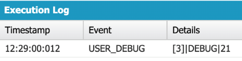</p>

Even though we're binding a `List<Account>` after the operator, rather than a `List<Id>`, the Apex runtime is able to extract the record Ids and compare them to the values of the `AccountId` field on our contacts. Note that this only works for the Id field - to filter based off the value of any other field, we'll have to compare to a collection of the appropriate data type, rather than a collection of `sObjects`.

The `INCLUDES` and `EXCLUDES` operators are also used for comparing against collections, but only when filtering on the values of a multi-select picklist field. Just as when assigning a value to a multi-select picklist in our code, we'll separate the different picklist values in a single combination with a semicolon. Let's demonstrate with an example.

```java
List<Contact> multilingualCons = [SELECT Name FROM Contact WHERE Languages__c
	INCLUDES('English;French', 'English;Spanish')];
```

Each string in the `INCLUDES` operator is a unique combination. So our query will return contacts who speak either (a) English _and_ French or (b) English _and_ Spanish. Matching records can have additional values beyond this (e.g. a contact with English, French, and Chinese as their languages would be returned by the above query), but they _must_ include at least the values needed to match one of our specified combinations. The `EXCLUDES` operator has similar functionality, with the obvious difference that it will remove, rather than return, records that match one of the specified combinations.

Finally, we should take note (if we haven't already) that the comparison operator for equality in SOQL is a single equals sign (`=`), rather than two equals signs (`==`).

### Date Literals

While the comparison and logical operators we discussed in the previous section will take the place of the `operator` in our field expression syntax, date literals and date values will replace the `value` placeholder. The following table displays the available date literals.

| Date Literal | Returns `true` if the `Date` or `DateTime` value is.... |
| ------------ | ------- |
| `YESTERDAY`, `TODAY`, `TOMORROW` | The previous, current, or next day, respectively. |
| `LAST_WEEK`, `THIS_WEEK`, `NEXT_WEEK` | In the previous, current, or next week, respectively. |
| `LAST_MONTH`, `THIS_MONTH`, `NEXT_MONTH` | In the previous, current, or next month, respectively. |
| `LAST_90_DAYS`, `NEXT_90_DAYS` | In the previous or next 90 days, respectively. |
| `LAST_N_DAYS:n`, `NEXT_N_DAYS:n` | In the previous or next `n` days, respectively.* |
| `NEXT_N_WEEKS:n`, `LAST_N_WEEKS:n` | In the previous or next `n` weeks, respectively.* |
| `NEXT_N_MONTHS:n`, `LAST_N_MONTHS:n` | In the previous or next `n` months, respectively.* |
| `LAST_QUARTER`, `THIS_QUARTER`, `NEXT_QUARTER` | In the previous, current, or next quarter, respectively. |
| `LAST_N_QUARTERS:n`, `NEXT_N_QUARTERS:n` | In the previous or next `n` quarters, respectively.* |
| `LAST_YEAR`, `THIS_YEAR`, `NEXT_YEAR` | In the previous, current, or next year, respectively. |
| `LAST_N_YEARS:n`, `NEXT_N_YEARS:n` | In the previous or next `n` years, respectively.* |
| `LAST_FISCAL_QUARTER`, `THIS_FISCAL_QUARTER`, `NEXT_FISCAL_QUARTER` | In the previous, current, or next fiscal quarter, respectively. |
| `LAST_N_FISCAL_QUARTERS:n`, `NEXT_N_FISCAL_QUARTERS:n` | In the previous or next `n` fiscal quarters, respectively.* |
| `LAST_FISCAL_YEAR`, `THIS_FISCAL_YEAR`, `NEXT_FISCAL_YEAR` | In the previous, current, or next fiscal year, respectively. |
| `LAST_N_FISCAL_YEARS:n`, `NEXT_N_FISCAL_YEARS:n` | In the previous or next `n` fiscal years, respectively.* |

<sub>\* = Where `n` is an integer.</sub>

If we'd like to reference a specific, static date in our queries, we can do so by following the `YYYY-MM-DD` format, or one of the standard `DateTime` formats. Note that date values, like Boolean values, are not surrounded by quotes in SOQL query filters.

Regardless of the operators and values we use to filter, we'll want to apply our filters to indexed fields whenever possible, as this will decrease the time it takes for the system to search the database, and therefore decrease the time it takes for our query to return as well.

## Working with Query Results

Let's work our way towards the conclusion of this module with some common SOQL pitfalls to avoid, along with useful tips and tricks to implement. To begin, we should be aware that the `sObject` or `List<sObject>` that is returned from our query will only contain values for the fields that we've specified in our query, even if other fields on the corresponding record have values - i.e. the result of a SOQL query is _not_ a full copy of the corresponding record. This means that we'll raise an `SObjectException` if we attempt to immediately read the value of a field that we didn't retrieve as part of our query, as demonstrated by the following code.

```java
List<Account> accs = [SELECT Id FROM Account];

for(Account a : accs) {
	System.debug(a.Name);
}
```

And the resulting exception:

<p align="center">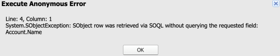</p>

We can assign values to non-retrieved fields and read from those fields once we've assigned to them, we just can't read from them before an assignment if they weren't returned by our query. So in order to read immediatley from a field - whether standard or custom - without prior assignment, we'll need to list it in our query. The Id field is the lone exception to this rule, as its always retrieved from a query, whether specified or not.

The Id field also has unique capabilities in that we can use it to construct a `Map<Id, sObject>` from a query in a single line of code, like in the snippet below.

```java
Map<Id, Account> accMap = new Map<Id, Account>([SELECT Name, AnnualRevenue FROM
	Account]);
```

The Apex runtime automatically extracts the Id values and populates our map with those Ids as keys mapped to the corresponding `sObject`, allowing us to retrieve records from the map by way of their Id without needing to write the code that actually fills the colleciton.

## SOQL For Loops

We'll finish this module by discussing a powerful piece of SOQL functionality - the SOQL for loop - which allows us to implement a balancing act in the pursuit of avoiding multiple (possibly conflicting) governors. Let's take a look at a code block containing such a loop and then further explain it.

```java
for(List<Account> accList : [SELECT Id FROM Account]) {
    System.debug('The size of accList is ' + accList.size() + '.');
    
    Integer innerLoopIterations = 0;
    for(Account a : accList) {
        innerLoopIterations += 1;
    }
    
    System.debug('The nested enhanced for loop ran ' + innerLoopIterations + 
		' times.');
}

System.debug('The amount of SOQL queries executed in this transaction is ' + 
	Limits.getQueries() + '.');
```

And the output when our org has 406 accounts:

<p align="center">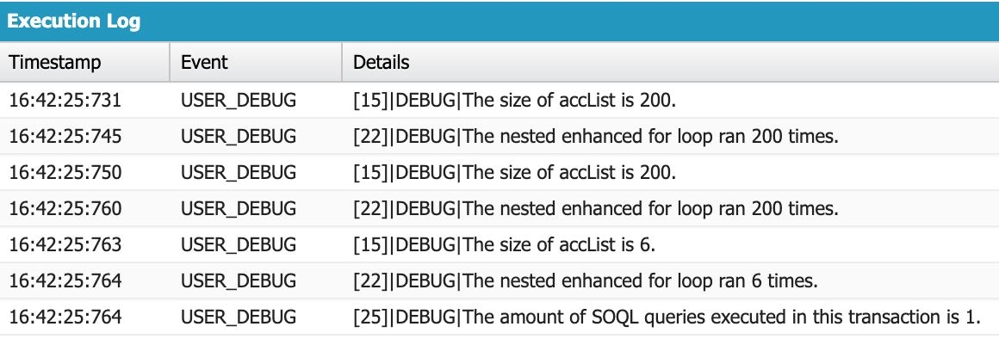</p>

Looking at the syntax of the SOQL for loop, we can see that it's similar to that of an enhanced for loop - we have an iterable variable declaration followed by a colon and a collection to iterate through. The first difference we see is the type of our iterable - rather than being a primitive of the same type as the elements of the collection that we're iterating through, it's a `List<sObject>`, where `sObject` is replaced by the object we're querying. The declaration after the colon also has a change, with a SOQL query replacing the collection we want to iterate through.

As our output suggests, our outer for loop runs once per batch of up to 200 records returned by our query. So because our query found 406 accounts, the outer for loop executed three times with batches of 200, 200, and 6 accounts, respectively. We then used our enhanced for loop to iterate through each record from these batched lists. This allowed us to reduce our heap size because we had no more than 200 records from our query in the heap (i.e. local memory) at a time, which can be an invaluable when we're working with queries that select a large amount of fields and may therefore have us approach the governor on heap size if we're not careful.

But the full power of the SOQL for loop is revealed from our final `System.debug()` call. Despite being broken into three batches - with no more than 200 records in local memory at a single time - our SOQL for loop, as all SOQL for loops, counted as only a single query for the purposes of our governor limits. 
