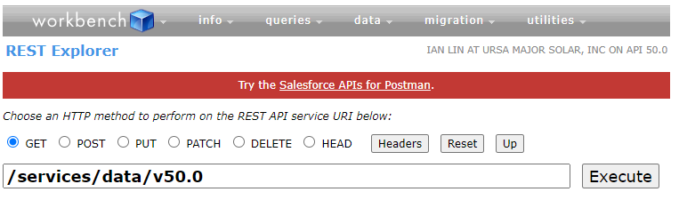
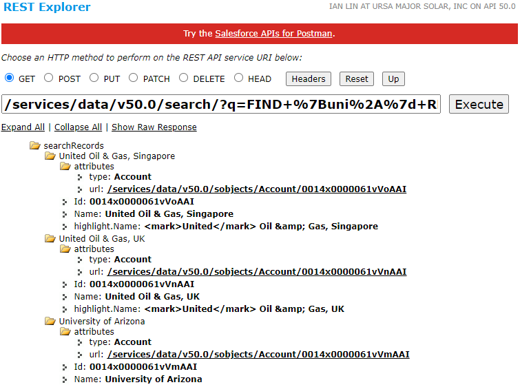
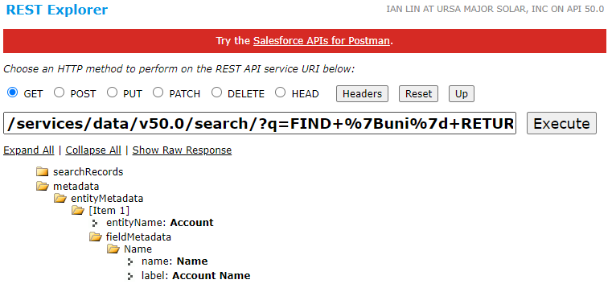
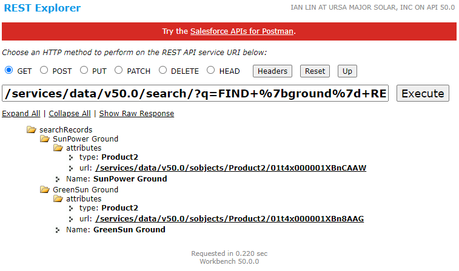

# Module - SOSL

This module introduces SOSL.

## Table of Contents

* [SOSL](#sosl)
    * [Search Strings](#search-strings)
* [Optional SOSL Clauses](#optional-sosl-clauses)
    * [RETURNING Clause-Nesting](#returning-clause-nesting)
    * [SOSL Execution Environments](#sosl-execution-environments)
    * [WITH Clauses](#with-clauses)
        * [Apex-Supported WITH Clauses](#apex-supported-with-clauses)
        * [Other WITH Clauses](#other-with-clauses)
    * [LIMIT](#limit)
* [SOSL and SOQL Use Cases](#sosl-and-soql-use-cases)

### Helpful References/Links

* [SOQL and SOSL Reference](https://developer.salesforce.com/docs/atlas.en-us.soql_sosl.meta/soql_sosl/sforce_api_calls_soql_sosl_intro.htm)
* [SOQL and SOSL (Apex Developer Guide)](https://developer.salesforce.com/docs/atlas.en-us.apexcode.meta/apexcode/langCon_apex_SOQL.htm)
* [DescribeFieldResult Class (Apex Developer Guide)](https://developer.salesforce.com/docs/atlas.en-us.apexcode.meta/apexcode/apex_methods_system_fields_describe.htm#apex_methods_system_fields_describe)
* [Searchable Objects and Fields (Salesforce Help)](https://help.salesforce.com/articleView?id=search_fields.htm&type=5)
* [How Does Search Work? (Salesforce Help)](https://help.salesforce.com/articleView?id=search_how_search_works.htm&type=5)
* [Highlight relevant article text display on public knowledge base (SALESFORCE Stack Exchange)](https://salesforce.stackexchange.com/questions/100620/highlight-relevant-article-text-display-on-public-knowledge-base)
* [WITH SNIPPET (SOQL and SOSL Reference)](https://developer.salesforce.com/docs/atlas.en-us.soql_sosl.meta/soql_sosl/sforce_api_calls_sosl_with_snippet.htm)
* [Dynamic SOSL (Apex Developer Guide)](https://developer.salesforce.com/docs/atlas.en-us.apexcode.meta/apexcode/apex_dynamic_sosl.htm#snippet)
* [Search Class (Apex Developer Guide)](https://developer.salesforce.com/docs/atlas.en-us.apexcode.meta/apexcode/apex_methods_system_search.htm#apex_methods_system_search)
* [SearchResult Class (Apex Developer Guide)](https://developer.salesforce.com/docs/atlas.en-us.apexcode.meta/apexcode/apex_class_Search_SearchResult.htm)
* [workbench](https://workbench.developerforce.com/login.php)
* [HTML URL Encoding (w3schools.com)](https://www.w3schools.com/tags/ref_urlencode.ASP)

## SOSL

SOSL, the Salesforce Object Search Language, is used to perform text queries against a subset of the Search Index (which we'll discuss in more detail shortly). It's a bit of a different beast than SOQL, so let's highlight some of those distinctions by starting off with some example code.

```apex
List<List<sObject>> searchResults = [FIND 'Edge' IN ALL FIELDS RETURNING
    Account(Name)];
```

Well, that's definitely a different syntax! As we've seen before, SOQL syntax is kind of similar to that of SQL. This makes sense because SOQL is sort of analogous to DQL (a SQL sublanguage), but we can't really draw the same connections with SOSL. Because our code above looks pretty unfamiliar, let's break down the search.

To begin, our SOSL searches can be placed right in Apex code just like SOQL queries can be. Additionally, both are enclosed by square brackets when used inline. After the opening square bracket, `FIND` is our first clause. This clause holds our search string - the case-insensitive literal that we want to look for in the Search Index - surrounded by single quotes.

Following our `FIND`, we can optionally specify an `IN` clause which can take values of `ALL FIELDS`, `EMAIL FIELDS`, `NAME FIELDS`, or `PHONE FIELDS` and specifies where we're hunting for our search string. Note that name fields are those where the `isNameField()` method of the corresponding `DescribeFieldResult` instance returns `true`. Additionally, when we say `ALL FIELDS` is our first option, we don't really mean _all_ fields... this is a good time to return to the Search Index for an explanation.

Recall that in our `Indexing` unit, we defined the Search Index as a catalog containing indexed fields on searchable objects. Let's offer a more detailed explanation now, which will be particuarly useful shortly. The Search Index is a catalog of tokens, where each token consists of two parts: the value of an indexed field on a searchable object and a link back to the corresponding record. As we'd expect, the standard objects that are searchable are predetermined for us and cannot be changed, but many of the common standard objects such as `Account`, `Case`, `Contact`, `Lead`, `Product`, `Task`, and `User` are included in this group.

But with custom objects, we control searchability. We can make a custom object searchable by selecting the `Allow Search` checkbox in either the object creation or edit screen (pictured below).

<p align="center"></p>

As we discussed in our `Indexing` notes, standard fields are only be indexed if the system marks them as such. But our custom fields are under our command - these fields are indexed if we mark them as `Unique` or an `External Id`. However, these characteristics are exclusive: only `Auto Number`, `Email`, `Number`, or `Text` data types can be `External Ids`. Additionally, `Picklist (Multi-Select)`, `Currency` (if our org has multiple currencies enabled), `Text Area (Long)`, and `Text Area (Encrypted)` fields cannot be unique.

So how do these searchable objects and indexed fields take part in SOSL? When we execute a SOSL query, the search engine looks in the index for text, `Email`, `Phone`, and/or name fields that contain the string literal we're trying to find. As we said earlier, we're not required to specify an `IN` clause in our search. So if we don't specify this clause, our search will default to `IN ALL FIELDS`. Indexed `Text` fields (that aren't name fields), as well as indexed `Text Area` and `Text Area (Rich)` fields will only be searched when we have such an `IN` clause, either because we've explicitly set it or excluded `IN` altogether.

With that, we're ready to move on to our final SOSL clause, `RETURNING`. This specifies the data that is retrieved, and we really do mean retrieved. `RETURNING` does not determine the objects or fields we search against - those are the responsibilities of the Search Index and the `IN` clause. But wait, if we don't have full control over what we search against, SOSL is starting to sound computationally expensive. Well, it _is_ computationally expensive and we'll see this reflected when we discuss governor limits and SOSL use cases.

Unlike `IN`, `RETURNING` is required for all SOSL searches included in Apex code - we'd have no way to specify the fields and searchable objects that we'd like to return otherwise. Note that while we can only return records of searchable objects (remember, SOSL isn't going to execute against any non-searchable objects so their records would have no way to match our search string), we can return _both_ indexed and non-indexed fields from these records. To declare an object to return and optionally specify returned fields, we write the object API name following `RETURNING` and then specify the API fields to return in parentheses following it.

If we have multiple objects or multiple fields on the same object that we want to retrieve, we'll simply comma-separate them. Just as we saw with SOQL, we don't need to specify the `Id` field for any object because any object named in `RETURNING` will automatically include Ids with its returned records.

As our original code block shows, the return type for a SOSL search is a list of lists of sObjects - i.e. an outer list that contains one inner list per object named in the `RETURNING` clause of the search. So our code from our earlier example will return a `List<List<sObject>>` that will have one element: a list of accounts that contains all records that our search retrieved. Note that the order we name objects in `RETURNING` _will_ be the order that the corresponding lists are indexed in our returned `List<List<sObject>>`. Additionally, the system will only return records that the running user has access to through the sharing model.

### Search Strings

Let's plunge a little deeper into search strings in particular. We've already theorized about the computational cost of running a SOSL search, so some of the requirements that we're about to discuss should be expected. For example, our search string must be at least two characters, or a `System.SearchException` will be thrown at runtime.

We can use wildcards in our search string just like we can use them in filters in SOQL queries, but they take a slightly different form. Our two options are the asterisk (`*`, which matches zero or more characters) and the question mark (`?`, which matches exactly one wildcard character). However, these characters only function as wildcards if they are _not_ leading our string. If they are leading our string, or if we escape them with a backslash, the question mark or asterisk will be interpreted literally.

Note that we also have various operators, such as `AND` and `OR` that we can include in our `FIND` clause to search for multiple _separate_ values.

## Optional SOSL Clauses

We've now discussed the three main clauses of our searches, but they aren't the entirety of available options. Let's turn to the other tools at our disposal: clauses and functions that we can nest inside of `RETURNING`, `WITH` clauses, and the `LIMIT` clause. We'll go in this particular order because it is the same order in which these clauses must be named in our searches (if they're present).

### RETURNING Clause-Nesting

We can include many familiar clauses that we'll recognize from our SOQL exploration within the parentheses surrounding the names of fields we choose to retrieve for a given object as part of `RETURNING`. These are `WHERE`, `ORDER BY`, and `OFFSET` (again if we include these clauses, we must write them in the order we just listed). Consider the following search:

```apex
List<List<sObject>> searchResults = [FIND 'comm' RETURNING Account(Name, 
    Active__c, FORMAT(CreatedDate) WHERE Active__c='Yes' ORDER BY Name 
    OFFSET 10)];
```

As we'd expect, these clauses have same definition here as in SOQL: `WHERE` filters results based on a field-value pair, `ORDER BY` sorts returned records, and `OFFSET` discards the specified number of records before returning results. Our code also shows that we can include the `FORMAT()` function, wrapping it around a `Date`, `Number`, `Time`, or `Currency` field to have the value formatted to the running user's locale. With all of these recognizable devices, our parentheses-bound field specifications can end up looking similar to a SOQL query without the `SELECT` or `FROM` keywords.

### SOSL Execution Environments

Before we move on, a quick word on the places we can use SOSL. As we've already seen, we can use SOSL inline with Apex, but this is not the end of the story. For example, the `Query Editor` in the Developer Console is not just for SOQL queries - we can use it to execute SOSL searches as well. When we choose to do so, we will again exclude the wrapping square brackets. In addition, we'll replace the single quotes that delimit our search string with curly braces, e.g. `FIND {Edge}`.

In addition, we can invoke SOSL through the Salesforce-provided SOAP or REST APIs, which is exactly what we'll do in our next section.

### WITH Clauses

Alright, before we move further, let's throw in a quick disclaimer. Unfortunately, some of what we'll say in this section will seem like it conflicts with the official Salesforce documentation. This is actually _not_ the case - the documentation is just not particularly comprehensible for this subject. But we'll make do and roll with the punches.

There are eight SOSL `WITH` clauses, which we'll tackle in two groups: those that are supported in Apex and those that aren't. In the latter scenario, we'll only see the benefits of the clauses if we're executing our SOSL query through one of Salesforce's APIs.

#### Apex-Supported WITH Clauses

`WITH DATA CATEGORY`, `WITH DivisionFilter`, `WITH NETWORK`, `WITH SPELL_CORRECTION`, and `WITH SNIPPET` are available for Apex code. `WITH DATA CATEGORY` works the same as its SOQL cousin does, allowing us to filter Salesforce Knowledge articles and questions by their associated category. The clause follows the format `WITH DATA CATEGORY dataCategoryGroup operator dataCategoryValue`. The following table displays valid operator values for `WITH DATA CATEGORY`.

| Operator | Meaning |
| -------- | ------- |
| AT | Returns only the articles and questions that have the specified data category group |
| ABOVE | Returns articles and questions that have the specified data category or one of its parent categories |
| BELOW | Returns articles and questions that have the specified data category or one of its subcategories |
| ABOVE_OR_BELOW | Combines ABOVE and BELOW |

Our next clause in this family, `WITH DivisionFilter`, is used with divisions, a feature that allows us to separate and assign records based on the location from which they originate. For example, we could set up divisions so that all cases originating from a contact or account based in the United States are assigned to the North American division. Unfortunately, the `Trailhead Playgrounds` and `Developer Editions` that we work with don't have access to divisions, so we won't be able to make use of this clause. But if we're working with an org with the feature in the future, we'll be able to implement this clause by following the format `WITH DIVISION = divisionName`.

`WITH NETWORK`, a clause used to filter results so that only those from a certain community are returned, _is_ something we can use in playgrounds and `Developer Editions`. We accomplish this by specifying the Id of the site in the form `WITH NETWORK=networkId` or `WITH NETWORK IN (networkId1, networkId2, ....)` depending on the number of communities by which we're filtering.

We'll probably use `WITH SPELL_CORRECTION` much more frequently. In fact, we can practically _guarantee_ that we'll use it more frequently because this clause, which applies spell check to our search string (the string literal in the `FIND` clause), is implicitly included in our search and given a `true` value by default.

`WITH SNIPPET` is the final Apex supported clause, but we have to take a slightly different approach to implement it. Before we get to that though, let's explain the clause itself. Search snippets give us the ability to see the surrounding context of the match to our search string - they return the context and our match (within that context) is enclosed by `<mark>` tags, so long as the field containing the match has the `Email`, `Text`, `Text Area`, `Text Area (Long)`, or `Text Area (Rich)` field data types.

In fact, `WITH SNIPPET` is even more particular: it will only highlight matches in records of the `KnowledgeArticleVersion`, `Case`, `CaseComment`, `FeedItem`, `FeedComment`, `Idea`, and `IdeaComment` objects, or records of a specific returned Knowledge article type. But that's all the requirements, right? Not so - even if a match is found in an eligible field on an eligible object, snippets will only be shown if the search returns less than 20 results. To quote the documentation, "even if we add the `WITH SNIPPET` clause, searches that don't return snippets... don't return snippets.

Lest we think we're done jumping through hoops, we still have to implement dynamic SOSL, a topic that we'll explore more wholistically in a future module. For this specific dynamic SOSL use case, we'll use the `Search.find()` method (rather than the `Search.query()` method that we'll talk about in that future unit). This method takes a string as its lone parameter. Because we're in Apex, this means that we'll have to escape any quotes in our search (such as those surrounding our search term). Additionally, the familiar square brackets enclosing the search are _not_ present.

Alright, we've been discussing this clause for long enough - let's put it into action with the following code.

```apex
Search.SearchResults searchResults = Search.find('FIND \'purchase solar\'' +
    ' RETURNING Knowledge__kav(Answer__c, Title) WITH SNIPPET');
for(Search.SearchResult searchResult : searchResults.get('Knowledge__kav')) {
    Knowledge__kav article = (Knowledge__kav) searchResult.getSObject();
    System.debug(article.Title + ': ' + searchResult.getSnippet());
}
```

`Search.find()` returns an instance of the `Search.SearchResults` wrapper class. We iterate through the list of `Search.SearchResult` (singular) objects returned by the `get()` method of our `Search.SearchResults` instance. This method defines a string parameter that specifies the API name of the object whose records we want. Within our loop, we call the `getSObject()` and `getSnippet()` methods of `Search.SearchResult` to retrieve the generic sObject representing the record and the snippet, respectively.

When executed, our code results in the output (in this example, we've added a knowledge article to our org):

<p align="center"></p>

By default, our snippet returns either the entire length of the field or around 300 characters, whichever is lower. If we want to specify a specific snippet length, we can follow our `WITH SNIPPET` clause with `(target_length=int)`, where `int` is any integer between 50 and 1,000.

#### Other WITH Clauses

The remaining `WITH` clauses - `WITH HIGHLIGHT`, `WITH METADATA`, and `WITH PricebookId` - are not Apex-supported, so we'll have to execute our search through a tool such as Salesforce's REST API if we want to utilize them. Salesforce is a secure platform, and we're grateful for that, but this security means that there's an authentication process that we'd have to go through to authorize our local machine to reach our org before we even used a tool like `cURL` to send requests. Fortunately, we live in a world with `Workbench`, an unofficial (but Salesforce-owned), web-based UI for interacting with our org by consuming Salesforce APIs.

We begin by visiting https://workbench.developerforce.com/login.php, where we may be prompted to login to our orgs through a familiar login screen after checking the `I agree to the terms of service` box and selecting `Login with Salesforce`. Once we've authenticated, we can click the `REST Explorer` link under the `utilities` menu, which will take us to a screen similar to the following image.

<p align="center"></p>

The URL path here isn't something that we'll really touch on until our `Apex Integration Services` module. We'll also reserve any further discussion of how `Workbench` can be used and what all it allows us to accomplish for our unit on `Deployment`. So on to our clauses.

First up: `WITH HIGHLIGHT`. This clause is like a cousin to `WITH SNIPPET` - it will also wrap `<mark>` tags around the match to the search string in any returned fields, but it works with fields on the `Account`, `Campaign`, `Contact`, `Lead`, `Opportunity`, `Quote`, and `User` standard objects (in addition to those of custom objects), in contrast with the fields and objects supported by `WITH SNIPPET`.

We're going to demonstrate the use of this clause shortly, but because we're going to be passing our search through the URL, we'll have to URL-encode it - so let's talk about this first. URL encoding brings some consequences in that whitespace, commas, single quotes, percentage signs, curly braces, and parentheses are all against the rules. Fortunately, we don't really use any of those forms of punctuation in SOSL... oh wait.

What's actually nice is that there are great resources on the web to help us with URL encoding, such as the `HTML URL Encoding (w3schools.com)` reference in the `Helpful References/Links` section. Let's summarize the relevant replacements in the following table.

| Character | URL Encoding |
| --------- | ------------ |
| Whitespace | + |
| * | %2A |
| , | %2C |
| = | %3D |
| { | %7B |
| } | %7d |
| ' | %27 |
| ( | %28 |
| ) | %29 |

Alright, we're almost ready to send our search, but we have one final bit of the URL to put together first. When we're making a SOSL search through the REST API we append `/search/?q=` to the base `/services/data/v50.0` that we saw in our image of the `Workbench REST Explorer` earlier. This `q` is a URL parameter, a variable of sorts that we'll use to pass our search (we'll actually see this same `q` appear in the URL of any Google search, `007`). With this knowledge, we can know transform a SOSL search that would've been `FIND 'uni%' RETURNING Account(Id, Name) WITH HIGHLIGHT` to the following:

```html
/services/data/v50.0/search/?q=FIND+%7Buni%2A%7d+RETURNING+Account%28Id%2CName%29+WITH+HIGHLIGHT 
```

Note that the search string in the `FIND` clause is enclosed by encoded curly braces, rather than encoded single quotes. When we press the `Execute` button in the `REST Explorer`, this URL is appended to the domain of the org we logged into earlier and a REST request is sent to that now-complete URL. Let's see what the results of this request are through the following image, where we can see the `<mark>` enclosed match contained in the `highlight.Name` value.

<p align="center"></p>

We'll now turn to the `WITH METADATA` clause, which allows us to retrieve additional information about the fields we return from our searches. The only valid format for this clause is `WITH METADATA='LABELS'`, so let's see just what this does. We'll again transform our SOSL search to a URL-encoded form, going from what would've been `FIND 'uni' RETURNING Account(Name) WITH METADATA='LABELS'` to the following partial URL:

```html
/services/data/v50.0/search/?q=FIND+%7Buni%7d+RETURNING+Account%28Name%29+WITH+METADATA%3D%27LABELS%27
```

And our corresponding response (shown below, where we've collapsed the `searchResults` to be able to view the clause-specific output) shows that the `metadata` portion is what holds information such as the labels and API names of the returned fields.

<p align="center"></p>

Alright, last `WITH` clause: `WITH PricebookId`. The function of this clause is pretty easy to infer from its name - we use it to filter matching products so that only those who have entries in a certain pricebook or pricebooks are returned from our search. We can therefore encode a search that would've looked like `FIND 'ground' RETURNING Product2(Name) WITH PricebookId = '01s4x000002wWnhAAE'` as the partial URL:

```html
/services/data/v50.0/search/?q=FIND+%7bground%7d+RETURNING+Product2%28Name%29+WITH+PricebookId%3D%2701s4x000002wWnhAAE%27
```

Note that we're about to run this in an org where we've completed the `Manage Products, Prices, Quotes, and Orders` Trailhead badge so that we have some sample data. Although we're hardcoding our pricebook's Id here, we would _not_ do so in a real-world scenario. Instead, the Id value would be added to the URL once we've retrieved it through, e.g. a SOQL query.

Okay, let's smash that `Execute` button one last time. Here are our results:

<p align="center"></p>

This all looks well and good, but let's run the following code in our org to ensure that our result was what we expected.

```apex
List<PricebookEntry> entries = [SELECT Product2.Name FROM PricebookEntry WHERE 
    Pricebook2.Name='Enterprise'];
Set<String> enterpriseProducts = new Set<String>();
for(PricebookEntry entry : entries) {
    enterpriseProducts.add(entry.Product2.Name);
}
System.debug(enterpriseProducts);
```

One product can appear multiple times in a single pricebook by having one listing per supported currency. Therefore, in our example above, we've queried the `PricebookEntry` standard object, which provides a many-to-many relationship between `Product2` and `Pricebook2`, rather than either of the latter objects. For the same reason, we're using a `Set` instead of a `List` to hold our product names.

Okay, drumroll please...... our output is:

<p align="center"></p>

Awesome! This matches what we got back from our REST request - looks like everything worked as expected.

### LIMIT

The function of our final SOSL clause, `LIMIT`, is basically the same as that of its SOQL counterpart, but this new version is a little more flexible. See, SOSL `LIMIT` can be used as a freestanding clause to set a maximum on the total number of returned records. But it can also be nested within the parentheses following an object declaration in the `RETURNING` clause to place a cap on the number of returned records for that specific object. Therefore, we could use the following query to return no more than two account records and no more than ten records of all objects collectively:

```sosl
List<List<sObject>> searchResults = [FIND 'uni' RETURNING Account(Name LIMIT 2),
    Contact(Name) LIMIT 10];
```

## SOSL and SOQL Use Cases

Let's finish this module with a discussion of appropriate SOSL and SOQL use cases. After all, both of these languages retrieve data from our database, so how do we know when to use one over the other? Our basic rule of thumb will be using SOQL when in doubt, but let's provide some explanation behind that.

As we alluded to earlier in this module, SOSL is quite computationally expensive. The one use case where SOSL is not as expensive and actually preferred to SOQL is when we want to search for a specific string within a field, due to tokenization and the under-the-hood workings of the Search Index. Other appropriate SOSL uses include times when we don't know which object has the records containing the string we're looking for/which fields the string is in, when we would like to query multiple _unrelated_ objects, and when we'd like to use one of the `WITH` clauses that don't have a SOQL cousin.

It's no coincidence that these last three are use cases that SOQL simply can't handle, but this is not a knock on SOQL functionality. It's obviously preferrable when we know the object that holds the desired records and the fields that contain the information we want to retrieve, as well as when we want to get data from one object or multiple _related_ objects. SOQL also allows us to filter based on a broader amount of fields - remember, our SOSL `IN` clause dictates that we can only look for our search string in `Name`, `Email`, `Phone`, `Text`, `Text Area`, and/or `Text Area (Rich)` fields. We _especially_ want to use SOQL when we'd like to make use of date/aggregate functions, date literals, or the ability to sort results because these functionalities have no SOSL counterparts.
