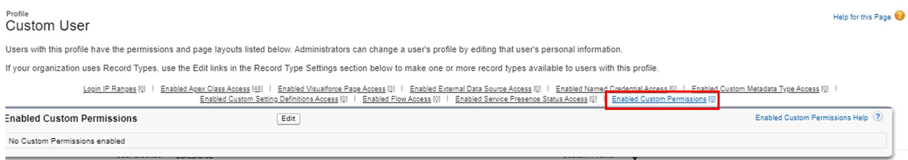

# Module - Advanced Org Customizations

This module introduces custom metadata types and custom permissions.

## Table of Contents

* [Custom Permissions](#custom-permissions)
* [Custom Metadata Types](#custom-metadata-types)
    * [Creating, Reading, and Updating Custom Metadata Records](#creating-reading-and-updating-custom-metadata-records)
    * [Custom Metadata Type Fields](#custom-metadata-type-fields)
    * [Packaging Custom Metadata Types and Records](#packaging-custom-metadata-types-and-records)
    * [Custom Metadata Type Uses](#custom-metadata-type-uses)

### Helpful Links/References

* [Custom Permissions (Salesforce Help)](https://help.salesforce.com/articleView?id=custom_perms_overview.htm&type=5)
* [FeatureManagement Class (Apex Developer Guide)](https://developer.salesforce.com/docs/atlas.en-us.apexcode.meta/apexcode/apex_class_System_FeatureManagement.htm)
* [Global Variables (Salesforce Help)](https://help.salesforce.com/articleView?id=dev_understanding_global_variables.htm&type=5)
* [What are Custom Metadata Types (Salesforce Help)](https://help.salesforce.com/articleView?id=custommetadatatypes_about.htm&type=5)
* [Create, Edit, and Delete Custom Metadata Types and Records (Salesforce Help)](https://help.salesforce.com/articleView?id=custommetadatatypes_metadata_api.htm&type=5)
* [_Custom Metadata Type_\__mdt (SOAP API Developer Guide)](https://developer.salesforce.com/docs/atlas.en-us.api.meta/api/sforce_api_objects_custommetadatatype__mdt.htm)
* [Metadata Namespace (Apex Developer Guide)](https://developer.salesforce.com/docs/atlas.en-us.apexcode.meta/apexcode/apex_namespace_Metadata.htm)
* [Access Custom Metadata Records Programmatically (Salesforce Help)](https://help.salesforce.com/articleView?id=custommetadatatypes_accessing.htm&type=5)
* [Custom Metadata Relationships (Salesforce Help)](https://help.salesforce.com/articleView?id=custommetadatatypes_relationships.htm&type=5)
* [Custom Metadata Allocations and Usage Calculations (Salesforce Help)](https://help.salesforce.com/articleView?id=custommetadatatypes_limits.htm&type=5)

## Custom Permissions

While the out of the box Salesforce settings allow us to control the visibility of features such as processes and apps, we can use Custom Permissions to manage access to functionality within these features, permitting more granular customization. 

Let's walk through an example to explain. First, we navigate to `Setup` > `Custom Code` > `Custom Permissions`, and select `New`. On the following screen (shown below), we provide a label and optionally a description for our new custom setting (the name autopopulates when we exit the label field), before clicking `Save`.

We can then add our permission to a profile by navigating to `Setup` > `Users` > `Profiles` and selecting the name of the profile. If we're using the `Enhanced Profile User Interface`, we'll then click the `Custom Permissions` link, `Edit` on the following page, and move our custom permission from the `Available Custom Permissions` column to the `Enabled Custom Permissions` column before clicking `Save`.

The same procedure applies to adding our permission to a permission set, with the obvious exception of starting by navigating to `Setup` > `Users` > `Permission Sets` and choosing the name of our set. If we're using the regular profile user interface, we can hover over the `Enabled Custom Permissions` link (surrounded by the red rectangle in the following image) at the top of the profile detail page and click `Edit` on the popup, at which point we'll be directed to the same two-column available and enabled permissions screen from the other interface.

Now that we have everything set up, we can refer to our permission within formulas in validation rules, formula fields, flows, and process builder by using the `$Permission` global variable, the API name of our permission, and dot notation, e.g. `$Permission.Large_Discount` for our example above. We could then use this permission in combination with a process on the opportunity object: if a user enters a percentage greater than 50% in a custom `Discount__c` field, we can allow the discount if they have the `Large Discount` permission or send the opportunity record into an approval process in the case that they tried to give such a discount, but are not authorized to do so without further approval.

Alternatively, we could check a user's custom permissions using Apex with the `FeatureManagement.checkPermission()` method, which declares a single parameter (a `String` holding the API name of our permission) and returns a `Boolean` indicating if the running user has authorization.

## Custom Metadata Types

We'll finish this short module by discussing a powerful tool - custom metadata - that allows us to create, package, deploy, and even upgrade our own custom metadata types (CMTs). While a CMT and custom object might appear to be the same at first glance, this new feature has functionality that we haven't seen before.

Like custom objects, CMTS can have fields. But these fields and the values they contain are pure metadata, meaning that the instances (i.e. records) of a CMT are also metadata. Therefore, we can migrate both CMTs and custom metadata records with any tool that uses the Metadata API under-the-hood, such as the `Salesforce Extensions for Visual Studio Code` and `Salesforce CLI`, as well as through our declarative packaging and migration tools.

We primarily use CMTs to hold configuration information for apps. Because the metadata records can be migrated easily, there's no need to create a post-install script to finish setup because everything needed is already included in the deployment.

What sorts of things would we want to include as configuration information? Perhaps master data. For example, consider a postal company that has multiple Salesforce orgs - this company can use metadata records to easily migrate information about, e.g., the prices for shipping different classes of mail (like overnight or next-day air) between their orgs without having to manually create records holding this information in each org.

To create such a CMT, we navigate to `Setup` > `Custom Code` > `Custom Metadata Types` and select `New Custom Metadata Type`, which will take us to the following screen.

Here, we provide a label and plural label for our type (the `Object Name` field will autopopulate when we exit `Label`) and click `Save` to direct ourselves to the CMT detail page. But before we continue on, let's explain the visibility settings, which determine access to our type and possibily its records and are surrounded by the red rectangle in the above image. As we can see from the screenshot, we have three options, which are summarized in the following table.

| Visibility | API Value | Radio Button |
| ---------- | --------- | ------------ |
| Public | Public | All Apex code and APIs can use the type, and it's visible in Setup. |
| Protected (Local) | Protected | Only Apex code in the same namespace can see the type. The name of the type and the record are visible if they're referenced in a formula. |
| Protected (Managed) | PackageProtected | Only Apex code in the same managed package can see the type. The name of the type and the record are visible if they're referenced in a formula. |

Looks like we have some visibility considerations when creating CMTs for a managed package. First, if we want our subscribers/customers to be able to use the type, add records to it, and modify the existing records, we should choose the `Public` setting. If, on the other hand, they should be able to use the CMT but not add records, we should select `Protected (Managed)`. But what if we want our customers to be able to create records for the type but not change the existing records included with our package?

In this case, we can be even more targeted by having a public type but creating protections on the CMT's records. To begin our explanation, let's take a few steps back. When we create a CMT, it gets some standard fields. One of these, `IsProtected` is the relevant field for the topic at hand.

We edit this field by selecting/deselecting the `Protected Component` checkbox when creating or editing a record. When we protect individual records, we can include a public CMT in our package, but ensure that our CMT records themselves are protected.

This will allow our subscribers to create their own custom metadata records - something that can't be done when the type itself is protected - while ensuring that the records we release as part of our package cannot be modified. Note that we must make the choice to protect our type before releasing our package - we can't make a type protected in a package when it's already been released as public in a prior version. Additionally, we don't have to worry about customers changing the configuration of our type, particularly its fields and validation rules, because they are heavily restricted in terms of what they can edit on these entities when they're part of a managed package - regardless of the type's visibility.

Protected records can be read by Apex if the code is in the same namespace (i.e. managed package) as the CMT or the specific protected records. Because we can publish package extensions - which are effectively additional managed packages that depend on the original managed package - the record may not necessarily be in the same namespace as its corresponding type. Of course, these restrictions mean that Apex written by our customers or included in unmanaged packages that are in their orgs can't refer to protected records.

However, as developers, we can modify such records that have been released as a part of a managed package by upgrading the package (although we can't change the value of the `DeveloperName` field through an update), in addition to doing so through eligible Apex.

### Creating, Reading, and Updating Custom Metadata Records

We can use Apex to create CMT records by adding one or more instances of the `Metadata.CustomMetadata` class (which represents a CMT record) to a `Metadata.DeployContainer` object and then passing this latter object and a callback function to the `Metadata.Operations.enqueueDeployment()` method. We use the `Metadata.Operations` class to retrieve, update, or insert CMT records because we're not able to use traditional DML to do so. Of course, this class will only work if the records and/or type are visible to the code, as determined by the settings we've already described. Additionally, note that Apex can't delete custom metadata records. 

Alternatively, we can perform the same operations (in addition to deleting records) declaratively from the `Custom Metadata Types` page. We begin by clicking the `Manage Records` link next to the name of the desired CMT. Or, if we're already at the CMT detail page, we can click the `Manage Plural Label` button (e.g. `Manage Shipping Classes` for a `Shipping Class` CMT). Either way, we'll then click the `New` button on the resulting page, populate our fields, and click `Save` or click the `Edit` link next to an existing record and make our modifications.

If we want to read records in Apex, we can also use SOQL that queries the corresponding type, which has an API name like `TypeDeveloperName__mdt` if it is in the same namespace or `NamespacePrefix__TypeDeveloperName__mdt` otherwise (that's double underscores after both the namespace and API name). Note that SOQL queries on CMTs from test classes _will_ return records because our CMTs are visible to test methods and classes by default.

In addition, there is no limit on the number of queries executed against CMTs in a single transaction, provided that `Text Area (Long)` fields are not queried, in which case the regular limits apply. However, these queries are still limited to retrieving at most 50,000 records collectively in a single transaction.

CMT types and records can be referenced declaratively in formulas included in flows, formula fields, processes, or validation rules through dot notation. To do so, we begin with the `$CustomMetadata` global variable, followed by dot notation specifying the API name of the type. If we're referring to a particular field on a custom metadata record, we'll append the API name of the record and the field through dot notation to the end of our earlier syntax.

Putting it all together, if we want to refer to a field on a metadata record in a declarative tool, we'll follow the format `$CustomMetadata.NamespacePrefix__TypeDeveloperName__mdt.NamespacePrefix__RecordDeveloperName.FieldAPIName` (quite a mouthful). Note that, we don't need to include the namespace prefix if our formula exists within the same namespace as the record or CMT. Additionally, as we discussed earlier, we can still reference metadata records that are part of a `PackageProtected` type - we just can't modify them.

### Custom Metadata Type Fields

As we said earlier, our CMTs have standard fields. While we only discussed `IsProtected` earlier, it's not alone - let's summarize the remaining standard fields in the following table.

| Custom Metadata Record Standard Field | Value Held |
| ------------------ | ---------- |
| DeveloperName | API name of custom metadata record (sans namespace prefix) |
| Id | Custom metadata record Id |
| Label | Custom metadata record label (same as MasterLabel) |
| Language | The language of the record |
| MasterLabel | Same as the Label value |
| NamespacePrefix | The prefix for the associated namespace |
| QualifiedApiName | A concatenation of NamespacePrefix and DeveloperName |

The only standard fields that we can directly edit are the `Label` and `Language`. Although we can indirectly edit the `DeveloperName` by changing the label, our API name will always end in `__mdt`. If we want our records to include additional information, we can of course create custom fields for our type. However, only a subset of the familiar field data types are available for CMTs, namely `Checkbox`, `Date`, `Date/Time`, `Email`, `Number`, `Percent`, `Phone`, `Picklist`, `Text`, `Text Area`, and `URL`.

We can create custom relationship fields for our types, but these take a slightly different form than what we've seen before. `Metadata Relationship` fields come in four flavors: relationships to another CMT, to an `EntityDefinition` (i.e. a standard or custom object), to a `FieldDefinition` (both standard and custom fields on standard and custom objects are eligible), and to an `EntityParticle`, which holds compound geolocation values.

In addition to having fields, CMTs are also similar to standard/custom objects in that they have page layouts and (optionally) validation rules, as we alluded to earlier.

### Packaging Custom Metadata Types and Records

Once we've created all desired types and records, we can add them to declarative migration tools like unmanaged/managed packages and change sets just like we can do with other kinds of metadata. On the package creation page, we can click the `Add` button (surrounded by the red rectangle in the following image) under the `Components` section to begin the process.

On the following page, we'll change the `Component Type:` picklist to `Custom Metadata Type`, select any desired CMTs, and click `Add to Package`. If we want to add custom metadata records, we'll change the component type to the label of our CMT (e.g. `Shipping Class`), select the desired records, and click the same `Add to Package` button.

### Custom Metadata Type Uses

Let's conclude this module by talking about use cases for CMTs. As we said earlier, CMTs can hold app configuration data, but this is not the extent of their abilities. We also utilize them when we want to deploy a common secret - such as authentication information - in a managed package without needing to perform extra configuration once the package is installed. Additionally, custom metadata records can be queried to, e.g., conditionally execute or skip triggers based on their values. Finally, we can take advantage of `Metadata Relationships` to map different objects or fields together through metadata that will persist across migrations.
