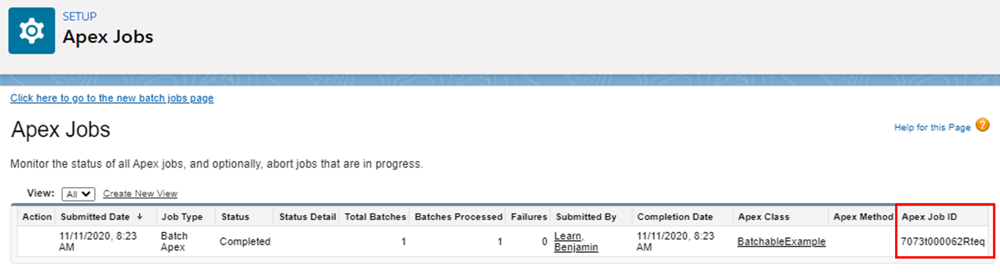
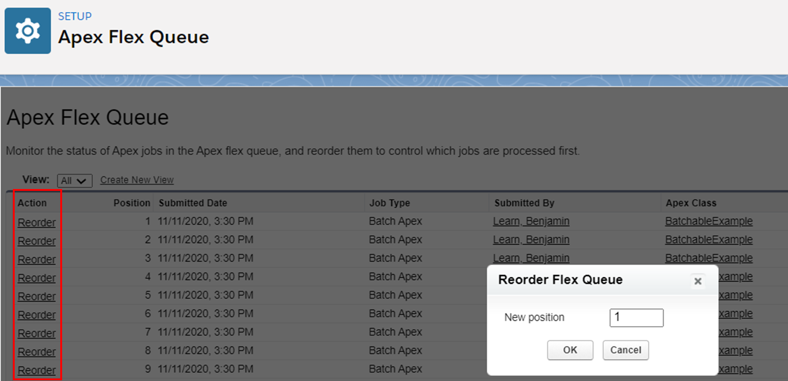
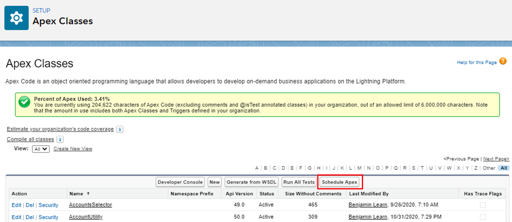
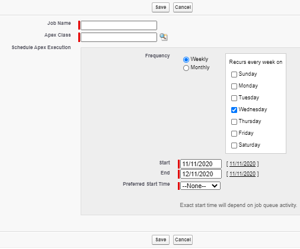
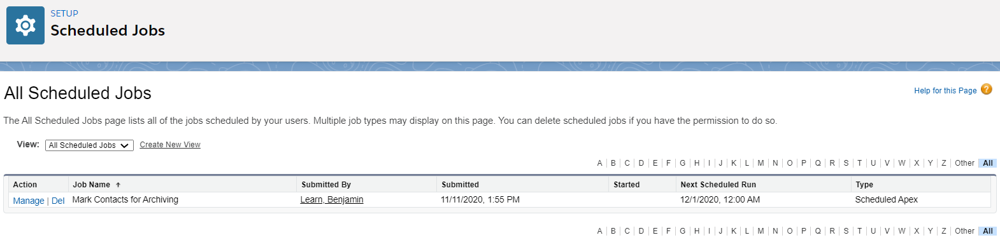
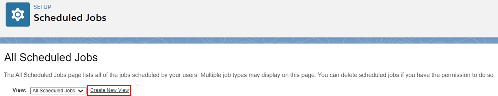
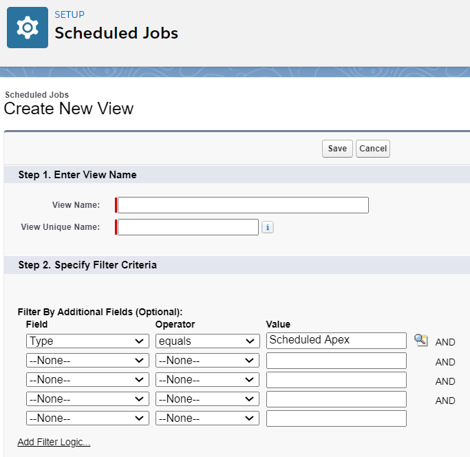

# Module - Asynchronous Apex

This module introduces asynchronous Apex.

## Table of Contents

* [Async Defined](#async-defined)
* [Future Methods](#future-methods)
	* [Testing Future Methods](#testing-future-methods)
* [Queueable Apex](#queueable-apex)
* [Da Batch](#da-batch)
	* [Apex Flex Queue](#apex-flex-queue)
* [Scheduled Apex Jobs](#scheduled-apex-jobs)
	* [CRON](#cron)
	* [CronTrigger, CronJobDetail, and Scheduled Job Limits](#crontrigger-cronjobdetail-and-scheduled-job-limits)
* [AsyncApexJob](#asyncapexjob)

### Helpful References/Links

* [General asynchronous programming concepts (MDN web docs)](https://developer.mozilla.org/en-US/docs/Learn/JavaScript/Asynchronous/Concepts)
* [Asynchronous Apex (Apex Developer Guide)](https://developer.salesforce.com/docs/atlas.en-us.apexcode.meta/apexcode/apex_async_overview.htm)
* [Future Methods (Apex Developer Guide)](https://developer.salesforce.com/docs/atlas.en-us.apexcode.meta/apexcode/apex_invoking_future_methods.htm)
* [sObjects That Cannot Be Used Together in DML Operations (Apex Developer Guide)](https://developer.salesforce.com/docs/atlas.en-us.apexcode.meta/apexcode/apex_dml_non_mix_sobjects.htm)
* [Queueable Apex (Apex Developer Guide)](https://developer.salesforce.com/docs/atlas.en-us.apexcode.meta/apexcode/apex_queueing_jobs.htm)
* [AsyncApexJob (SOAP API Developer Guide)](https://developer.salesforce.com/docs/atlas.en-us.api.meta/api/sforce_api_objects_asyncapexjob.htm)
* [QueueableContext Interface (Apex Developer Guide)](https://developer.salesforce.com/docs/atlas.en-us.apexcode.meta/apexcode/apex_interface_system_queueablecontext.htm)
* [Batch Apex (Apex Developer Guide)](https://developer.salesforce.com/docs/atlas.en-us.apexcode.meta/apexcode/apex_batch.htm)
* [Batchable Interface (Apex Developer Guide)](https://developer.salesforce.com/docs/atlas.en-us.apexcode.meta/apexcode/apex_interface_database_batchable.htm)
* [Database Class (Apex Developer Guide)](https://developer.salesforce.com/docs/atlas.en-us.apexcode.meta/apexcode/apex_methods_system_database.htm)
* [Contact (SOAP API Developer Guide)](https://developer.salesforce.com/docs/atlas.en-us.api.meta/api/sforce_api_objects_contact.htm)
* [Monitoring the Apex Flex Queue (Salesforce Help)](https://help.salesforce.com/articleView?id=code_apex_flex_queue.htm&type=5)
* [FlexQueue Class (Apex Developer Guide)](https://developer.salesforce.com/docs/atlas.en-us.228.0.apexcode.meta/apexcode/apex_class_System_FlexQueue.htm)
* [Apex Scheduler (Apex Developer Guide)](https://developer.salesforce.com/docs/atlas.en-us.apexcode.meta/apexcode/apex_scheduler.htm)
* [System Class (Apex Developer Guide)](https://developer.salesforce.com/docs/atlas.en-us.apexcode.meta/apexcode/apex_methods_system_system.htm)
* [CronTrigger (Object Reference for Salesforce and Lightning Platform)](https://developer.salesforce.com/docs/atlas.en-us.228.0.object_reference.meta/object_reference/sforce_api_objects_crontrigger.htm)
* [CronJobDetail (Object Reference for Salesforce and Lightning Platform)](https://developer.salesforce.com/docs/atlas.en-us.api.meta/api/sforce_api_objects_cronjobdetail.htm)

## Async Defined

Any code that we write executes synchronously by default, meaning that it runs one line at a time and each line must finish execution before the system carries out the next line. For example, if line 137 of `SuperCoolMethod` in `SuperCoolClass` calls `ModeratelyTolerableMethod`, line 138 won't execute until `ModeratelyTolerableMethod` finishes and returns (even if it has a `void` return type).

There are lots of cases where synchronous execution fits our needs just fine, but that's not to say that it's always appropriate. Imagine if `ModeratelyTolerableMethod` was so... well "meh" because it was very resource intensive - when `SuperCoolMethod` calls `ModeratelyTolerableMethod` synchronously, the execution of `SuperCoolMethod` will be stalled while it waits... and waits... and waits for the called method to finish.

As we'll see in a later module, synchronous execution is also less than ideal when our code is making a call to another service on the web - we don't want the successful and continued execution of our program to depend on the availability of someone else's servers and our ability to establish a line of communication with them. That would be like having a barista mess up our coffee so that it wasn't _completely_ perfect and deciding that the best option was to pack it in, head home for the day, and try again tomorrow.

In these and other situations, we turn to asynchronous execution, where we call a function but continue execution in the calling code - i.e. we're executing in parallel rather than serial so we aren't waiting for the called method to return. Note that parallel execution is _not necessarily_ the same as concurrent execution - depending on the type of asynchronous Apex we write, the asynchronous code is executed separately when resources become available, which could be immediately, in a few seconds, or in ten minutes.

Crucially for us Salesforce developers, asynchronous code gets a new set of governor limits because any asynchronous execution is treated as an entirely new transaction and some governor limits, such as the number of SOQL queries we can make, are higher when we execute asynchronously. But whether we're programming on the Salesforce platform or not, asynchronous execution is great because the calling function is not sitting and twiddling its thumbs just waiting for a return that might take a long time to execute in the best case scenario and in the worst case, like a call after a bad date, might never happen.

## Future Methods

As we progress throughout this module, we'll explore more specialized ways of creating asynchronous Apex, but the first and most basic tool in our metaphorical (or possibly literal if we want to put in the time and effort) toolbox is the future method. Future methods are static methods that have the `@future` annotation, which indicates that they are asynchronous (note that this annotation only appears on the method, not the enclosing class). They must also have a `void` return type because, as we proposed earlier, our code shouldn't depend on the result of any asynchronous methods that it calls.

Future methods can have any number of primitive variables or collections of primitives as parameters, but they cannot declare sObject instances as parameters. This is again due to asynchronicity - we don't know when an `@future` method will execute, so if we pass it a record from the database, there is a possibility that said record has been edited in between the time that we retrieved it and when the method executes, in which case we'd be working with outdated data. To get around this restriction, we can pass a record Id or a collection of record Ids to a parameter. Then, within the `@future` method, we query the database to retrieve the related record(s), thereby ensuring that we are working with what's most up-to-date.

These methods are commonly used for performing mixed DML operations, i.e. DML operations on multiple objects. With most combinations of objects, doing these mixes in the same transaction raises no problems. However, DML operations on some objects, specifically a set of objects known as setup objects, must occur in their own transaction that does not operate on records of other objects. Wait, a separate transaction's needed? Sounds like asynchronous Apex is the perfect tool.

So a class that needs to update both setup and non-setup objects can perform all operations on non-setup objects, then call an `@future` method to, e.g., insert a user with a role or update a user's profile. The following table displays a non-exhaustive list of setup objects. Because we don't normally programmatically interact with many of them, their purpose is also listed.

| Object | Purpose |
| ------ | ------- |
| FieldPermissions | Holds enabled field permissions for a Permission Set |
| Group | Represents Public Groups |
| GroupMember | Connects a User record and a Public Group record |
| PermissionSet | Represents a Permission Set |
| PermissionSetAssignment | Connects a User record and a Permission Set record |
| QueueSObject | References a Queue and has a picklist that specifies the objects that the Queue can be assigned records of |
| User | Represents a User |

Note that a `User` record is considered to be part of a mixed DML operation if it is being created with a role or if it is being updated and the `Role`, `Active`, or `Profile` fields (among other, less commonly edited fields) are changed. In addition to mixed DML operations, future methods are also frequently used to make callouts to webservices in order to separate the life of that request from the execution of the original program (as we'll discuss further in the `Apex Integration Services` module).

There are some factors to keep in mind when using this feature. For example, asynchronous methods cannot be used for a setter, getter, or a constructor in the controller for a Visualforce page. A future method is also restricted from calling another future method, i.e. we can't chain future methods.

Finally, a synchronous class that calls multiple future methods has no way of knowing which will start executing first and which will finish first - by virtue of being asynchronous, there is no way to guarantee the time when they begin execution or finish it. Therefore, we shouldn't use separate asynchronous methods to act on the same data because we can't predict the order in which they'll be invoked and finish.

### Testing Future Methods

As we've discussed previously, the `Test.startTest()` and `Test.stopTest()` methods give us a fresh set of governor limits, but they also synchronously execute any asynchronous methods called between them. We should therefore call future methods in test classes between `Test.startTest()` and `Test.stopTest()` invocations to ensure that their execution has completed by the time we reach any assert statements. Take the following Apex class:

```apex
public class FutureExample {
  @future
    public static void futureExample() {
    	PermissionSet ps = new PermissionSet(Name='Creative_Name',
			Label='Creative Label');
        insert ps;
    }
    
    public static void futureInvoker() {
        Account acc = new Account(Name='Important Account');
		insert acc;
		futureExample();
    }
}
```

And its corresponding test class:

```apex
@isTest
private class FutureExample_Test {
	@isTest
    static void testFutureInvoker() {
        Test.startTest();
        FutureExample.futureInvoker();
        Test.stopTest();
		System.assertEquals(1, [SELECT COUNT() FROM Account WHERE Name=
			'Important Account']);
		System.assertEquals(1, [SELECT COUNT() FROM PermissionSet WHERE Name=
			'Creative_Name']);
    }
}
```

As the code shows, even though the `Test.startTest()` and `Test.stopTest()` methods force our future method to execute, the system still treats it as a separate transaction so our test functions successfully.

## Queueable Apex

Queueable Apex is similar to future methods, but it gives us more flexibility, particularly in that we can queue one (but only one) queueable job from another and each job comes with an Id that we can use to keep track of its execution. Queueable classes must implement the `Queueable` interface and must be `public` or `global` (how would we invoke them if they weren't?).

Because this is an interface, we're required to implement a method as part of our class: the `execute()` method. This method is `public` or `global`, has a `void` return type, defines a single parameter (an instance of the `QueueableContext` interface), and is where we implement the logic we want our queued job to perform.

Once we've created a queueable class, we invoke by instantiating the class and calling the `System.enqueueJob()` method. Note that we must instantiate the queueable class because the `Queueable` interface dictates that the `execute()` method must not be `static`. `System.enqueueJob()` has a single parameter (the queueable instantiation we just made) and is what gives us the job Id we talked about earlier. Now that we have this Id, we can navigate to `Setup` > `Environments` > `Jobs` > `Apex Jobs` and view our job's status. Because one queueable job can invoke another, we can execute the `System.enqueueJob()` method from within the `execute()` method of a queueable class. Note that we can only invoke this method 50 times in synchronous transactions and once in asynchronous transactions.

Our process for testing this form of asynchronous Apex is the same as for future methods - we wrap the call to the `System.enqueueJob()` method within `Test.startTest()` and `Test.stopTest()`. However, we can't chain queued jobs in an Apex test, so we'll want to make use of the `Test.isRunningTest()` method in any chaining methods. As the name suggests, this method returns a `Boolean` value indicating if the current execution context is an Apex test. Let's take a look at such an example.

```apex
public class QueueableExample implements Queueable {
    public void execute(QueueableContext qc) {
        Account acc = new Account(Name='Test');
        Integer numJobs = [SELECT COUNT() FROM AsyncApexJob WHERE 
			JobType='Queueable'];
        if((numJobs < 2) && !Test.isRunningTest()){
            System.enqueueJob(new QueueableExample());
        }
    }
}
```

And the corresponding test class:

```apex
@isTest
private class QueueableExample_Test {
	@isTest
    static void testQueueableExample() {
        Test.startTest();
        System.enqueueJob(new QueueableExample());
        Test.stopTest();
		System.assertEquals(1, [SELECT COUNT() FROM AsyncApexJob WHERE 
			JobType='Queueable' AND Status='Completed']);
    }
}
```

As `QueueableExample` shows, there's a standard object named `AsyncApexJob` that tracks information about our asynchronous Apex invocations - we'll talk more about this later because it has some useful properties for some of our other asynchronous options as well. In fact, queueable Apex foreshadows the remaining asynchronous choices that we'll detail in this module - they all require us to implement an interface and have at least one method that takes a `Context` parameter. These parameters are what actually give us the job Ids.

## Da Batch

So if we want to perform operations on large amounts of records we just queue one job from another... from another... from another, right? Not so. Instead, we use batch Apex, which allows us to process large amounts of records (think tens/hundreds of thousands or even millions of records) by breaking the group into smaller batches that are executed separately.

As we foreshadowed, we create a batch class by implementing an interface - the `Database.Batchable` interface. We then enclose the specific type or generic type that our batches will consist of in angle brackets directly following the interface name in our class signature (commonly this will be the generic `sObject`). Let's do just that and start a skeleton for a batch class.

```apex
public class BatchableExample implements Database.Batchable<sObject> {
}
```

Of course, we couldn't actually save the above code to our org - `Database.Batchable` is an interface, so we're required to implement some methods and our class currently has.... zero methods. Looks like we've got some work to do. We'll start with the `start()` method appropriately enough. This method has to be `public` or `global` (again, we couldn't see it otherwise) and performs the setup for our batches. It takes a single parameter of type `Database.BatchableContext` and must return either a list of `sObjects` or a `Database.QueryLocator` object.

It's this second return type that's preferred. Using batch Apex isn't a free pass to forget everything we've ever known about governor limits. Therefore, if we use a traditional SOQL query to retrieve a list of `sObjects` and our query returns more than the 50,000 record transaction limit, we'll violate said limit and our batch job will immediately fail. On the other hand, if we return a `Database.QueryLocator` instance, we're able to create queries that return up to 50,000,000 records (whoa).

To return such an object, we invoke the `Database.getQueryLocator()` method, which takes a query string. Just like in dynamic SOQL, our query is not surrounded by square brackets. Let's implement a start method in our code example from earlier.

```apex
public class BatchableExample implements Database.Batchable<sObject> {
	public Database.QueryLocator start(Database.BatchableContext bc) {
		return Database.getQueryLocator('SELECT Id, LastReferencedDate FROM ' + 
			'Contact');
	}
}
```

Our end product will be a class that marks all contacts that haven't been referenced in the last six months for archiving. To find the appropriate contacts, we're retrieving the `LastReferencedDate` system field, which holds the date and time when a record was last accessed, a related record was accessed, or the record was shown in a list view, whichever is the most recent.

So where will we actually operate on the retrieved records? In the `execute()` method - which is what we're required to implement next. `execute()` must be `public` or `global`, have a `void` return type, and takes two paramters: an instance of the `Database.BatchableContext` interface and a list of `sObjects` or generic types. Because this method contains the logic that runs on our batches, it executes once for each batch of records.

Let's explain: when we invoke a batch Apex job, it enters a queue on Salesforce's servers. After our `start()` method returns, the system breaks the returned records into batches of 200 (this is the default, we'll discuss how to modify it shortly). Each of these groups is then queued and executed as a separate transaction, so this is specifically where the power of this form of asynchronous execution lies. Because the batches are queued on the server and the server is a shared resource, we should strive to reduce our number of batches when setting their size so that our job can finish faster. However, we should note that the order in which the batches execute isn't guaranteed, so we shouldn't have any code that depends on being executed at a certain time.

Because each batch is its own transaction, this form of asynchronous code still requires us to write efficiently - if we have, e.g., a DML statement in a loop and our batches have 200 records, they'll all fail because they'll each individually violate the 150 DML operation transaction limit. But the separation means that each batch has its own commit, so if one batch in the job fails, only the changes to records in _that_ specific batch will be rolled back - all changes to records in successful batches will be persisted.

Now that we've thorougly discussed the `execute()` method, let's add it to our example.

```apex
public class BatchableExample implements Database.Batchable<sObject> {
	public Database.QueryLocator start(Database.BatchableContext bc) {
		return Database.getQueryLocator('SELECT Id, LastReferencedDate FROM ' + 
		'Contact');
	}

	public void execute(Database.BatchableContext bc, List<sObject> generics){
		List<Contact> cons = new List<Contact>();
		Contact con;
		for(sObject generic : generics) {
			con = (Contact) generic;
			if(con.LastReferencedDate < DateTime.now().addMonths(-6)){
				con.Ready_to_Archive__c = true;
			}
			cons.add(con);
		}
		update cons;
	}
}
```

Here, we iterate through each record in the batch and cast them to `con` to be able to work with their fields using dot notation. Once that's done, we check to see if the `LastReferencedDate` is more than six months ago. If it is, we update `Ready_to_Archive__c`, a custom checkbox field, to signify this. Lastly, we update the batch of records outside of our loop.

So what's left to do? Not much, honestly. But we do have one last method to implement: `finish()`. This method must be `public` or `global` (surprising), have a `void` return type, and declare a single parameter - an instance of the `Database.BatchableContext` interface. Once we've defined our method signature, we've done all that's required of us. We can use the `finish()` method to perform post-execution cleanup logic or invoke another batch job because we can chain batch jobs together. But if we don't need to do any of that, a defined, but empty method will be just fine.

With that said, let's finish off our batch class.

```apex
public class BatchableExample implements Database.Batchable<sObject> {
	public Database.QueryLocator start(Database.BatchableContext bc) {
		return Database.getQueryLocator('SELECT Id, LastReferencedDate FROM ' + 
			'Contact');
	}

	public void execute(Database.BatchableContext bc, List<sObject> generics){
		List<Contact> cons = new List<Contact>();
		Contact con;
		for(sObject generic : generics) {
			con = (Contact) generic;
			if(con.LastReferencedDate < DateTime.now().addMonths(-6)){
				con.Ready_to_Archive__c = true;
			}
			cons.add(con);
		}
		update cons;
	}

	public void finish(Database.BatchableContext bc) {
	}
}
```

Now that we've done the work, we invoke our job using the `Database.executeBatch()` method, passing an instance of the class as an argument. This execution method has an optional second parameter where we can specify the size of our batches. As we said earlier, the default size is 200, but we can make our batches as small as one record - probably not the best idea - or as large as 2,000 records. Like the `System.enqueueJob()` method for queueable Apex, `Database.executeBatch()` adds our job to a queue to be executed when resources are available and returns a job Id that we can use to track our execution.

Let's take a look at the `Apex Jobs` page to see the information we can glean.

<p align="center"></p>

As the red rectangle highlights, the far right column of the table displays the job Id. Looks like our batch class executed successfully - awesome!

Before we conclude this section, let's tie up a few loose ends. First, we test batch Apex analogously to how we tested our other asynchronous options: by wrapping the call to `Database.executeBatch()` in `Test.startTest()` and `Test.stopTest()`. Second, we are limited to having at most five batch jobs that are queued or actively executing. Lastly, as a best practice, we shouldn't include subqueries in our `start()` method. If we do so, it makes the implementation of our job slower, so we should put any needed subqueries in the `execute()` method instead.

### Apex Flex Queue

So if we're limited to five queued/actively exeucting batch jobs and we add a sixth to an already full queue, is our subscription to Salesforce immediately cancelled? Thankfully, no. Instead, jobs are put in the `Apex Flex Queue`, which we can see at `Setup` > `Environments` > `Jobs` > `Apex Flex Queue`. This holding cell can contain up to 100 batch jobs. When the number of jobs in our batch queue becomes less than five, jobs are taken from the beginning of the flex queue and moved to the batch queue - i.e. the flex queue follows a FIFO principle by default. 

On the flex page, we can select the `Reorder` link (in the column surrounded by the red rectangle in the below image), which will bring up a popup where we can select the new place of the job in the queue.

<p align="center"></p>

Note that when we're interacting with the UI, the first job is in position `1`. But we can also interact with the flex queue programmatically through the `FlexQueue` class. This class contains methods such as `moveJobToFront()`, which takes the job Id of the job that we want to have at the top of the queue.

## Scheduled Apex Jobs

If we want to have our code execute at a set time, we can turn to schedulable Apex. As we've come to expect, we create a scheduled class by implementing the `Schedulable` interface. Unlike the `Database.Batchable` interface, this new tool doesn't like being a burden - its only requirements are that we implement an `execute()` method and make our class `public` or `global`. The method has the same options for access modifiers as the class, in addition to having a `void` return type and a single parameter of type `SchedulableContext`.

As its name suggests, the `execute()` method is where we implement the logic we want to run at the set time chosen. This can include logic such as queueing a batch Apex job, so we can have an archiving operation that runs, e.g., once a month. To invoke our scheduled job, we call the `System.schedule()` method and pass it three parameters: a name for our job, a CRON expression (a what? don't worry, we'll get to it shortly), and an instance of our schedulable class, in that order. Like we've gotten used to, this method will return a job Id that we can then use to track our execution by visiting `Setup` > `Environments` > `Jobs` > `Scheduled Jobs`.

As far as testing goes, we just need to repeat our popular principle - wrap the call to a `System.schedule()` method in `Test.startTest()` and `Test.stopTest()`. Because `Test.stopTest()` forces our job to execute synchronously, we can do whatever we want with our CRON expressions in a test class - they still have to be present, but the time we choose doesn't matter. Note that `Test.stopTest()` only forces the _first_ layer of asynchronous code to execute. So if we're testing a scheduled class that executes a batch class, only the scheduled class will execute synchronously. Therefore, we should assert that the batch job has been queued when testing the scheduled class and leave a test for the output of the batch job to a method that tests the batch class specifically.

### CRON

CRON expressions are strings that denote time. While we use them to schedule jobs in Apex code, their most common use is for scheduling jobs on the command lines of Unix-based systems. Salesforce CRON expressions have a slightly different form than UNIX ones, so if we see something that we're not quite used to, that's probably why.

Apex CRONs can have either six or seven space-separated values. In order, these values dictate the second, minute, hour, day of the month, month, day of the week, and optionally the year when the job should run. Let's borrow a helpful table from the `Apex Scheduler` page of the `Apex Developer Guide` to see the options available to pass to each of these.

<p align="center"></p>

Pretty simple, right? Guess we're done here then. What's that? There are some special characters? Well then, we should probably explain those too. Let's create our own table this time:

| Special Character | Purpose |
| ----------------- | ------- |
| , | Delimit values to choose more than one month, day of month, day of week, or year. |
| - | Denotes range to specify multiple of the same values that can use the , special character |
| * | Uses all options available for a given value. |
| ? | No value specified. Used when dictating a day of the month but not a day of the week or vice versa. |
| / | Specifies an increment. |
| L | Last day of the period. Either last day of the month or last day of the week (Saturday). |
| W | Nearest weekday for a particular day of the month. |
| # | Specify the particular day of the month when choosing the day of the week. |

Okay, let's give a little more background on a couple of those. First, the `/` character specifies an increment so that we can be more targeted in our days of the month/week, month, or year. For example, we could use `1/3` for our month value to have the job run quarterly (in January, April, July, and October).

The `W` character is used when we want to have a job only run on weekdays. For example, we could pass `15W` as our day of the month value so that the job will run on the 15th of the month if it's a weekday, the nearest Monday if the 15th is a Sunday, or the nearest Friday if the 15th is a Saturday. Lastly, `#` is like a more digestable `/` for the days of the week. It takes the format `weekday#day_of_month`, so `6#3` means that a job would run on the third Friday of the month.

As we probably inferred from our discussion of CRON expressions, the ambiguity of the values means that we can easily configure our jobs to run repetitively. For example, scheduling a job for `'0 0 0 1 * ?'` would mean that it would be queued on the first second of every month.

Now that we've gone into such detail explaining these strings, it's probably a good time to mention that we can avoid them altogether by choosing to set our job from the UI instead. To do so, we navigate to `Setup` > `Custom Code` > `Apex Classes` and select the `Schedule Apex` button (surrounded by the red rectangle in the following image).

<p align="center"></p>

This button will direct us to the following page, where we'll be able to configure a job to run once or multiple times without having to decipher some strange syntax (but honestly, what's the fun in that?).

<p align="center"></p>

Like we said earlier, jobs will show on the `Scheduled Jobs` page after they're set. The image below displays an example of this page, where we can click the `Manage` link to adjust the set time of the job or remove it entirely by clicking the `Del` link.

<p align="center"></p>

### CronTrigger, CronJobDetail, and Scheduled Job Limits

We are limited to having 100 scheduled jobs at any one time - note that one scheduled job configured to run repeatedly only counts once against this limit - so how do we make sure that we are abiding by this cap? Let's start with the declarative option.

To set this up, we'll return to our old friend, the `Scheduled Jobs` page and select the `Create New View` link (surrounded by the red rectangle in the following image).

<p align="center"></p>

On the resulting screen, we enter a name for the view and configure our filters so that only jobs with `Scheduled Apex` as their `Type` are shown. We must do this because other scheduled operations, such as scheduled flows and data exports are regarded as scheduled jobs.

<p align="center"></p>

But what if we'd like to quickly retrieve a count of the scheduled jobs, or display this information in an external system? In these cases, we would turn to the `CronTrigger` and `CronJobDetail` objects. Relevant fields on `CronTrigger` include `CronExpression`, `CronJobDetailId`, `EndTime`, `NextFireTime`, `PreviousFireTime`, `StartTime`, `State` (which can be either `WAITING`, `ACQUIRED`, `EXECUTING`, `COMPLETE`, `ERROR`, `DELETED`, `PAUSED`, `BLOCKED`, or `PAUSED_BLOCKED`), and `TimesTriggered`. `CronJobDetailId` is a lookup relationship to `CronJobDetail`, whose relevant fields include `JobType` (where a value of `7` corresponds to scheduled Apex) and `Name`.

If we want to programmatically cancel a job to, e.g., edit the schedulable class (because we can't edit a class if it has active or scheduled jobs), we can use the `System.abortJob()` method. This method takes the `Id` of the corresponding `CronTrigger` record which is, unhelpfully, different from the job Id. So to retrieve the `Id` of the desired job and then cancel it, we can implement code like the following:

```apex
Id cronTriggerId = [SELECT Id FROM CronTrigger WHERE CronJobDetail.Name=
	'Mark Contacts for Archiving'].Id;
System.abortJob(cronTriggerId);
```

## AsyncApexJob

Let's conclude this module by broadening the sentiment that we just left off on - interacting with queued/scheduled jobs programmatically. The `CronTrigger` object contains a lot of information about scheduled jobs, but for the other forms of asynchronous Apex, we turn to the previously mentioned `AsyncApexJob` class. This object contains such fields as `ApexClassId`, `CompletedDate`, `JobItemsProcessed`, `JobType`, `MethodName`, `NumberOfErrors`, `Status`, and `TotalJobItems`.

`JobType` can take values of `Future`, `BatchApex`, `BatchApexWorker`, and `Queueable`, among others. Note that `BatchApexWorker` signifies an _individual_ batch within a larger batch job, so we'll probably want to filter this type out if we're doing something like checking our number of queued batch jobs. `NumberOfErrors` and `TotalJobItems` correspond to the number of batches with errors and the total number of completed batches, respectively, for a batch job. Lastly, `Status` can take values of `Holding` (which is the `Status` for a batch job in the `Apex Flex Queue`), `Queued`, `Preparing`, `Processing`, `Aborted`, `Completed`, and `Failed`.

We can use the `System.abortJob()` method with `AsyncApexJob` to cancel future, batch, or queueable Apex by passing the `Id` of the related `AsyncApexJob` record to the method. Additionally, as we've demonstrated throughout this module, we can make use of this class in our test code.
