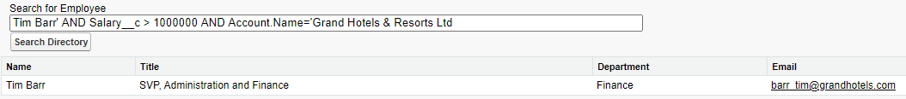

# Module - Dynamic Apex

This module introduces dynamic Apex, particularly dynamic SOQL and SOSL.

## Table of Contents

- [Module - Dynamic Apex](#module---dynamic-apex)
  * [Table of Contents](#table-of-contents)
    + [Helpful Links/References](#helpful-links-references)
  * [Active Apex](#active-apex)
  * [Dynamic Apex Through the Schema Namespace](#dynamic-apex-through-the-schema-namespace)
  * [Dynamic SOQL](#dynamic-soql)
  * [SOQL Injection](#soql-injection)
  * [Dynamic SOSL](#dynamic-sosl)

### Helpful Links/References

* [Dynamic Apex (Apex Developer Guide)](https://developer.salesforce.com/docs/atlas.en-us.apexcode.meta/apexcode/apex_dynamic.htm)
* [Describing sObjects Using Schema Method (Apex Developer Guide)](https://developer.salesforce.com/docs/atlas.en-us.apexcode.meta/apexcode/apex_dynamic_describeSObject.htm)
* [DescribeSObjectResult Class (Apex Developer Guide)](https://developer.salesforce.com/docs/atlas.en-us.apexcode.meta/apexcode/apex_methods_system_sobject_describe.htm#apex_methods_system_sobject_describe)
* [DescribeFieldResult Class (Apex Developer Guide)](https://developer.salesforce.com/docs/atlas.en-us.apexcode.meta/apexcode/apex_methods_system_fields_describe.htm#apex_methods_system_fields_describe)
* [Dynamic SOQL (Apex Developer Guide)](https://developer.salesforce.com/docs/atlas.en-us.apexcode.meta/apexcode/apex_dynamic_soql.htm)
* [Using Apex Variables in SOQL and SOSL Queries (Apex Developer Guide)](https://developer.salesforce.com/docs/atlas.en-us.apexcode.meta/apexcode/langCon_apex_SOQL_variables.htm)
* [Date Formats and Date Literals (SOQL and SOSL Reference)](https://developer.salesforce.com/docs/atlas.en-us.soql_sosl.meta/soql_sosl/sforce_api_calls_soql_select_dateformats.htm)
* [SOQL Injection (Apex Developer Guide)](https://developer.salesforce.com/docs/atlas.en-us.apexcode.meta/apexcode/pages_security_tips_soql_injection.htm)
* [Dynamic SOSL (Apex Developer Guide)](https://developer.salesforce.com/docs/atlas.en-us.apexcode.meta/apexcode/apex_dynamic_sosl.htm)

## Active Apex

Let's close our eyes for a second and imagine ideal Apex code. It promotes reusability through the creation of flexible functions that are input-agnostic in a way that ensures that it doesn't break no matter what user input it receives. In a word, it's dynamic. In this module, we'll strive to write such code by discussing how we can use information from classes in the `Schema` namespace, along with dynamic SOQL and dynamic SOSL to make Apex classes that result in flexible, input-agnostic apps.

## Dynamic Apex Through the Schema Namespace

We have the `DescribeSObjectResult` and `DescribeFieldResult` classes contained within the `Schema` 
namespace. We commonly use these classes to implement dynamic Apex with, e.g. picklist values. By its 
very nature, hardcoding any value (picklist values included) is antithetical to dynamic code.

DescribeSObjectResult will net us info about our objects. Let's take a look at that to begin. 

We have a coulple ways of going about getting our information. Either through the use of a token and 
a method (getDescribe) or through the use of a static variable. Let's look at both ways:
```java
//using the Account.sObjectType token with the getDescribe method
Schema.DescribeSObjectResult dsr = Account.sObjectType.getDescribe();

//using a static member variable
Schema.DescribeSObjectResult dsr = Schema.SObjectType.Account;
```

There are many methods available once we have a DescribeSObjectResult. For now, let's just focus on 
looking at the fields of our object. (We will return to other methods later.) Notice below how 
we can use the fields member variable to get information about a particular field. This will return 
for us an instance of a DescribeFieldResult.

```java
public static void getAccountIndustries() {
		Schema.DescribeFieldResult fr = Schema.SObjectType.Account.fields.Industry;

        /*
            Below would have the same effect as above. We are just using a token with the 
			getDescribe method to get the information. Instead of using a static member variable 
			like we did above. 
			
            Schema.DescribeFieldResult fr = Account.Industry.getDescribe();
        */
		
        List<Schema.PicklistEntry> pl = fr.getPicklistValues();
        List<String> picklistOptions = new List<String>();
        for(Schema.PicklistEntry pe : pl) {
            picklistOptions.add(pe.getValue());
        }
        return picklistOptions;
    }
}
```

Once we have a DescribeFieldResult available we can make use of some of its many methods. One being 
getPicklistValues. We can see that we can use that to return a list of Schema.PicklistEntry. The 
Schema.PicklistEntry class has a method called getValue that we can make use of to then get the value 
of each and every picklist option. 

## Dynamic SOQL

When we're talking about dynamic code, we're referring to code whose contents (e.g. variable values) are not fully known before runtime. Therefore, we can define dynamic SOQL 
as implementing SOQL queries where the query itself isn't entirely defined until runtime.

We've actually already seen and discussed dynamic SOQL, we just didn't identify it as such at the time - when we're using variable binding with our queries, we're implementing 
dynamic SOQL. Sure, _we_ may often know what the value of the variable is or will be when we're writing the code, but the _compiler_ does not. As far as the compiler is concerned, 
our bind variables are just references to values and it's more than happy to leave the difficulty of retrieving the corresponding value to the runtime system. 

While variable binding is nice, it's not the most ideal tool for dynamic SOQL - remember, we perform variable binding by prepending the variable name with a colon (`:`), but this 
won't work if we're attaching it to a date literal like `LAST_N_MONTHS` because this literal literally ends in a colon itself. Additionally, we don't have the ability to use 
variable binding to, e.g., only include certain filters in our `WHERE` clause. In these cases, we turn to the `Database.query()` method.

`Database.query()` accepts a string that we can create through control flow and therefore construct our query based on user input. For example, if our user doesn't specify a value 
for a certain filter, our control flow will recognize that and simply not include the filter as part of our query. Note that the string we pass to the query method is _not_ 
enclosed by square brackets. In addition, we can't perform variable binding with object fields in query strings. However, we can bind variables of other primitive data types to 
get around this restriction.

Let's take a look at an example:

```java
public static List<Contact> dynSoql(String searchTerm) {

        String query = 'SELECT Id FROM Contact WHERE Name =: searchTerm';
        List<Contact> conList = Database.query(query);
        return conList;
    }
```

## SOQL Injection

Whenever we use dynamic SOQL and accept user-defined input, we're opening the door for SOQL injection attacks, which occur when a user modifies the structure of a query by 
inputting malicious code designed to perform unintended operations. Because SOQL only has read functionality, SOQL injection isn't dangerous in the same way SQL injection is 
dangerous - SQL injection can result in data deletion, and while SOQL injection can't do the same, it can still expose sensitive data.

A common way this could be done is by inserting single quotes into a search box for example. An attacker could use that in a way to manipulate a search string and get info 
they normally wouldn't have access to. Consider a user who has a basic knowledge of Salesforce. This user knows what SOQL queries look like and they'd like to determine if 
a particular employee at one of our subsidiaries makes more than $1,000,000 per year (in this example, we've created a custom Salary__c field on Contact that stores this 
information). This bad actor visits our page and enters the following query:



Oh no - it looks like they've successfully found that Tim Barr has at least a nine-figure salary! Let's discuss how they did it, so we can understand how to prevent this 
in the future. The malicious person ended the first filter condition with a single quote and then filtered based on Salary__c value. Because they knew that the input box 
was expecting a string, they finished by filtering on a string value that they knew - the subsidiary that employs Tim. We can easily imagine how this could be extrapolated 
to other situations that could expose even more sensitive information, such as credit card, bank account, and social security numbers, so let's discuss how to prevent it.

In this case, we have a couple of options at our disposal. We could use a static query (i.e. a regular SOQL query with the square brackets) and bind the string variable to, 
e.g., a filter value. The system will treat everything within the bound variable as a single string. So if the user tries to do something such as the malicious query above, 
we'll be protected and our table will be empty, assuming we don't have a contact named Tim Barr' AND Salary__c > 1000000 AND Account.Name = 'Grand Hotels and Resorts Ltd 
(which sounds like a very unfortunate name to have).

But even though this would technically be dynamic SOQL - because we're using the bind variable - it doesn't give us the full capabilities of dynamism, so we might want to use 
Database.query() instead. In this case, we'd turn to another option - the String.escapeSingleQuotes() method. This method will add an escape character (the backslash) before any 
single quotes in the string it receives, ensuring that the entire user input will be treated again as a single string. 


```java
public static List<Contact> dynSoql(String searchTerm) {

		String sanitizedSearchTerm = String.escapeSingleQuotes(searchTerm);
        String query = 'SELECT Id FROM Contact WHERE Name =: sanitizedSearchTerm';
        List<Contact> conList = Database.query(query);
        return conList;
    }
```

Here we see our example from the last section, with the addition of the String class method escapeSingleQuotes. This helps ensure our query is being treated as one string and 
that malicious text cannot be used against us.

We haven't yet addressed the possibility of SOQL injection in the SELECT clause of a dynamic query. Actually, we haven't discussed dynamism with the SELECT clause at all - 
so let's do so now. Because we have string concatenation at our disposal, we could accept user input to determine the fields our query returns in the first place.

If we were to implement this, we would want to have the user choose the fields to query from, e.g., a picklist, rather than entering them in a text box to ensure that they don't 
retrieve any information they shouldn't see. Remember, when we have controlled user input (through tools such as picklists and checkboxes), we can not only ensure that our users 
will not be able to perform injection attacks, but prevent them from even attempting such a travesty.

## Dynamic SOSL

Just like dynamic SOQL, dynamic SOSL comes in two forms: binding and a query method, `Search.query()`. This former form is much more flexible than its SOQL counterpart because we 
can perform binding in the `FIND` clause of a SOSL statement, not just in our conditions.

Our second form, `Search.query()`, is like `Database.query()` in that it takes a string (which we can construct based on user input through control flow) as its lone parameter. 
This search string is enclosed by single quotes, rather than square brackets, so we'll need to escape any string literals that exist within the search itself, such as those 
surrounding value after the `FIND` clause. As always, enabling custom user input opens the door for malicious code, so we should be sure to protect against SOSL injection, which 
we can do through the methods we discussed for stopping SOQL injection above.

```java
public static List<List<sObject>> dynSosl(String searchTerm) {
        
        String sanitizedSearchTerm = String.escapeSingleQuotes(searchTerm);
        String query = 'Find :sanitizedSearchTerm RETURNING Contact(Phone, Email)';
        List<List<Contact>> soslResults = search.query(query);
        return soslResults;
    }
```