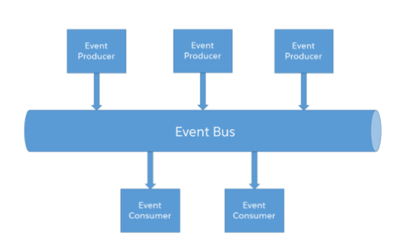
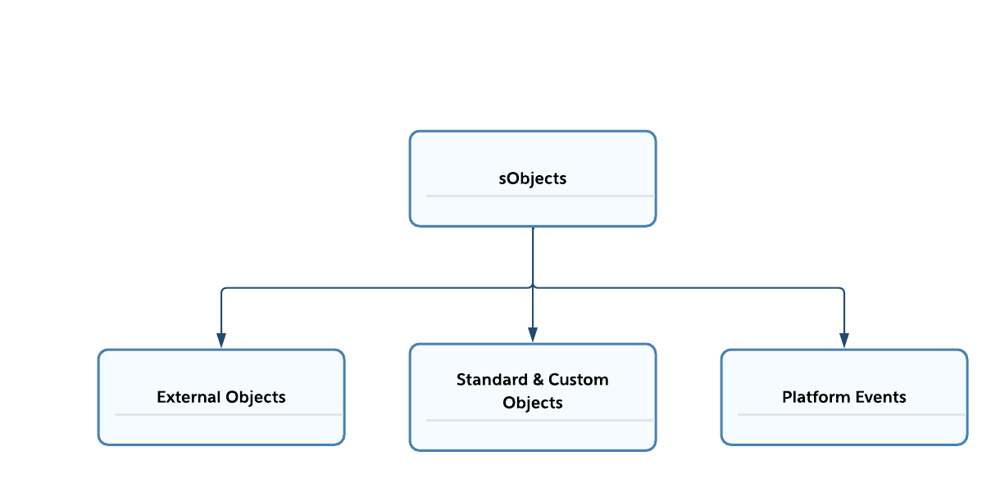
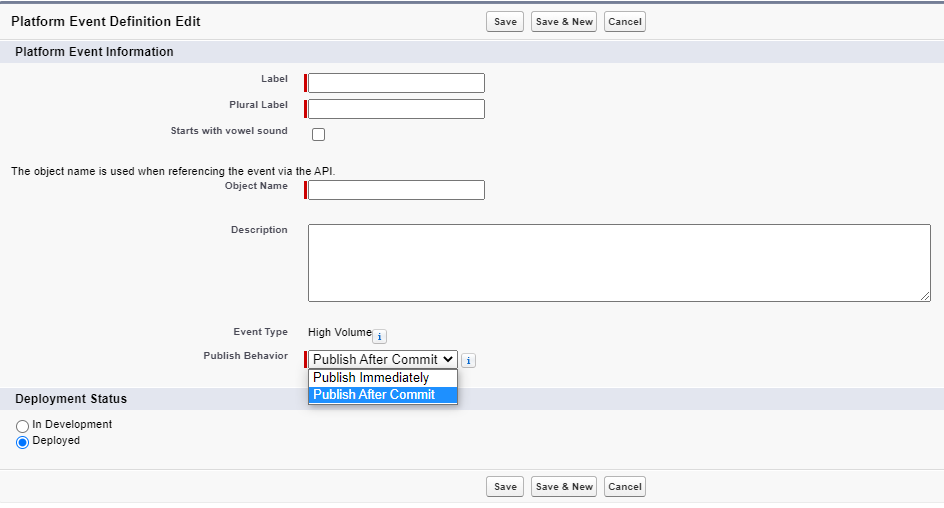

# Module - Platform Events

[Platform Events Developer Guide](https://developer.salesforce.com/docs/atlas.en-us.platform_events.meta/platform_events/platform_events_intro.htm)

[APIs and Integration (Salesforce Developer Centers)](https://developer.salesforce.com/developer-centers/integration-apis)

## Streaming Events in Salesforce

[What’s the Difference Between the Salesforce Events?](https://developer.salesforce.com/docs/atlas.en-us.platform_events.meta/platform_events/platform_events_intro_other_events.htm)

[Generic Events (Streaming API Developer Guide)](https://developer.salesforce.com/docs/atlas.en-us.api_streaming.meta/api_streaming/generic_streaming_intro.htm)

[PushTopic Events (Streaming API Developer Guide)](https://developer.salesforce.com/docs/atlas.en-us.api_streaming.meta/api_streaming/pushtopic_events_intro.htm)

[Change Data Capture Developer Guide](https://developer.salesforce.com/docs/atlas.en-us.change_data_capture.meta/change_data_capture/cdc_intro.htm)

- Salesforce offers four types of streaming events - platform events, generic events, change data capture events, and PushTopic events

| Entities | Difference Between Them |
| -------- | ----------------------- |
| Data & Custom Events | Data events (i.e. change data capture and PushTopic events) are fired automatically after changes to records, while custom events (i.e. generic and platform events) can be fired at a variety of times. |
| Change Data Capture & PushTopic Events | Change data capture events are fired automatically when a record is created, updated, deleted, and undeleted. We can't filter change data capture events - if we want to receive events for one record of an object, we'll need to subscribe to the channel for all records of that object. PushTopic events can be more specific, with events that will only be fired if the record that they were invoked by matches a custom SOQL query. |
| Generic & Platform Events | We define the schema of a platform event (i.e. the fields it contains) ahead of time, while the event message for a generic event is arbitrary and not predefined. |

- we can group these four event types into two categories
	- custom events
		- contains generic and platform events
		- we refer to them as custom events because we can determine their payload, what fires them, and when they're fired
	- data events
		- contains change data capture and PushTopic events
		- these are data events because Salesforce automatically fires them based off of changes to records
		- change data capture events are published for changes to records (e.g. creation, deletion, and undeletion) and fields

## Event-Driven Software Architecture

[Event-Driven Software Architecture (Platform Events Developer Guide)](https://developer.salesforce.com/docs/atlas.en-us.232.0.platform_events.meta/platform_events/platform_events_intro_architecture.htm)

[Introducing the Architect's Guide to Event-Driven Architecture with Salesforce (Salesforce Architects; Medium)](https://medium.com/salesforce-architects/introducing-the-architects-guide-to-event-driven-architecture-with-salesforce-e29dd5a2cdd9)

| Term | Definition |
| ---- | ---------- |
| Event | A notable state change (e.g. a case being resolved, an error occurring during a trigger, etc.). |
| Event Message | Also known as a notification; provides information about the event. |
| Event Producer | The entity that publishes a notification to the event channel. |
| Event Channel | The medium through which the event producer publishes a notification and to which the event consumer subscribes. |
| Event Consumer | The entity that subscribes to the event channel and receives any notifications published to it. |
| Event Bus | An event channel or group of event channels that also temporarily stores events, so that they can be consumed by subscribers at any time within a specified retention window. |

<p align="center"></p>

- an event-driven software architecture is a publisher-subscriber model where event producers publish to a channel that event consumers subscribe to
- these models are beneficial because they
	- send messages in near-real time, so that the subscriber is notified whenever the event occurs, rather than needing to make a server call to get information about events after they happen
	- allow us to split complex architectures into smaller, _independent_ pieces
		- producers don't have to concern themselves with whether any consumers are listening at the time of publishing and consumers don't have to be concerned about losing connection to the channel because the event bus persists the notifications
		- this means that - if a subscriber loses connection - it can listen to events starting from the point in time that it lost connection, so long as it's within the retention window (which is 24 hours for platform events)
	- are more scalable and reusable than point-to-point (i.e. one-to-one) integrations are, while still giving the ability to keep separate systems up to date

## Platform Events

[Platform Event Fields (Platform Events Developer Guide)](https://developer.salesforce.com/docs/atlas.en-us.platform_events.meta/platform_events/platform_events_define_ui.htm)

[Publishing Platform Events (Platform Events Developer Guide)](https://developer.salesforce.com/docs/atlas.en-us.platform_events.meta/platform_events/platform_events_publish.htm)

[EventBus Class (Apex Reference Guide)](https://developer.salesforce.com/docs/atlas.en-us.apexref.meta/apexref/apex_class_System_eventbus.htm)

[Subscribing to Platform Events (Platform Events Developer Guide)](https://developer.salesforce.com/docs/atlas.en-us.platform_events.meta/platform_events/platform_events_subscribe.htm)

<p align="center"></p>

- platform events are events used to send custom notifications between two entities within Salesforce or between combinations of entities within and outside of Salesforce
- platform events are similar to standard and custom objects because all are types of sObjects
- however, there are key distinctions between platform events and objects, as summarized in the following table

| Characteristic | Custom Object | Platform Event |
| -------------- | ------------- | -------------- |
| Instance | Record | Event message/notification |
| CRUD Operation Support | Full CRUD support | We can create and read notifications, but we cannot update or delete them. We also can't query events through SOQL or SOSL - we can only read them by receiving the message through the event bus. |
| Declarative User Interface Support | We can view records in the Salesforce user interface through declarative tools. | There isn't a method to declaratively surface notifications in the Salesforce user interface; there are no page layouts for platform events. |
| Apex Trigger Support | Supports the `before` and `after` types for the `insert`, `update`, and `delete` operations, as well as the `after undelete` event. | Only supports the `after insert` event. |
| API Name Suffix | `__c` | `__e` |
| Use Case | Store business data .| Notify about a meaningful state change. |

- we define platform events on the `Platform Events` page in `Setup`
- when creating a platform event, we can decide if the notifications for that platform event will be published immediately (`Publish Immediately`) or after the related transaction is committed to the database (`Publish After Commit`), as the image below shows

	<p align="center"></p>

	- if we choose to publish our platform event messages after the transaction is committed to the database, failing transactions won't have any platform event messages published to the event bus
	- so we should choose publishing immediately when we want the events to be sent regardless of the success of the transaction (e.g. if we're using platform events to notify ourselves about errors in triggers)
	- and we should choose publishing after commit when the events are related to data as it will be after the commit (e.g. if we're using platform events to notify ourselves when cases are resolved) or we only want events to be published if the transaction is successful
- after creating the platform event, we'll be taken to the detail page
	- this shows information about the event such as its standard fields, which include `CreatedBy`, `CreatedDate`, `EventUuid`, and `ReplayId` 
- we can also create custom fields on our platform events (this is the major differentiating factor between platform and generic events)
	- we have a limited set of field data types available (`Checkbox`, `Date`, `Date/Time`, `Number`, `Text`, and `Text Area (Long)`)
- we can produce platform events through 
	- flows
	- processes
	- Apex (by way of the `EventBus.publish()` method)
	- Salesforce APIs (by way of CometD)
- because platform events are a subtype of sObjects, we work with them in similar ways to how we work with custom object records
	- e.g., in Apex code, we declare a variable using the API name of the platform event as the data type and assign values to the fields of the event either through arguments to the constructor or assignment using dot notation after we instantiate the event
		- we publish events with the `EventBus.publish()` method, which takes either a platform event message or list of platform event messages, as demonstrated by the following code block

			```java
			Error_Message__e errorMessage = new Error_Message__e();
			errorMessage.Error__c = 'Example error message.';
			EventBus.publish(errorMessage);
			```
	
		- note that custom fields on platform events still end with the `__c` suffix
	- in declarative automation tools, we choose to create records of an object, select our platform event, and continue as normal
- we can subscribe to platform events through
	- flows and processes
		- both flows and processes can be configured to be invoked by the reception of a platform event message
	- Apex triggers (using the `after insert` event)
		- triggers on platform events follow the same principles as triggers on standard and custom objects, so we can use a skeleton like the following:

	```java
	trigger MyPlatformEventTrigger on MyPlatformEvent__e(after insert) {}
	```

	- Aura and Lightning web components through the `<lightning:empApi>` standard component and the `lightning/empApi` module, respectively, which allow us to subscribe to a platform event channel and receive messages
	- external systems (by way of CometD)
	- debug logs

## CometD

[CometD](https://cometd.org/)

[Subscribe to Platform Event Notifications with CometD (Platform Events Developer Guide)](https://developer.salesforce.com/docs/atlas.en-us.platform_events.meta/platform_events/platform_events_subscribe_cometd.htm)

[EMP-Connector (GitHub)](https://github.com/forcedotcom/EMP-Connector)

[Bayeux Protocol, CometD, and Long Polling (Streaming API Developer Guide)](https://developer.salesforce.com/docs/atlas.en-us.api_streaming.meta/api_streaming/BayeauxProtocolAndCometD.htm)

- an event bus that's built on top of the Bayeux protocol and is available as either a Java or JavaScript library
- CometD is not Salesforce-specific, but can be used to publish and subscribe to platform events in systems outside of Salesforce
- we can write our own CometD client or use the EMP connector, an open source tool for connecting to CometD and listening on/publishing to an event channel
	- the EMP connector is also used for the `<lightning:empApi>` standard Lightning component and `lightning/empApi` module
