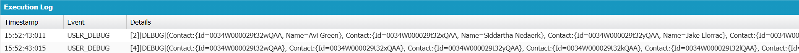
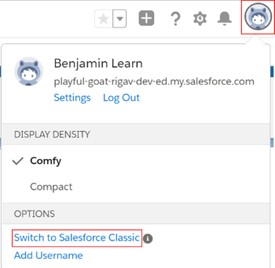
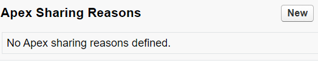

# Module - Apex Security & Sharing

This module introduces security and sharing in Apex.

## Table of Contents

* [Apex Security](#apex-security)
  * [Record Level Security](#record-level-security)
  * [Object and Field Level Security](#object-and-field-level-security)
* [Apex Managed Sharing](#apex-managed-sharing)

### Helpful References/Links

* [Apex Security and Sharing (Apex Developer Guide)](https://developer.salesforce.com/docs/atlas.en-us.apexcode.meta/apexcode/apex_security_sharing_chapter.htm)
* [Using the with sharing, without sharing, and inherited sharing Keywords (Apex Developer Guide)](https://developer.salesforce.com/docs/atlas.en-us.apexcode.meta/apexcode/apex_classes_keywords_sharing.htm)
* [Filter SOQL Queries Using WITH SECURITY_ENFORCED (Apex Developer Guide)](https://developer.salesforce.com/docs/atlas.en-us.apexcode.meta/apexcode/apex_classes_with_security_enforced.htm)
* [Enforce Security With the stripInaccessible Method (Apex Developer Guide)](https://developer.salesforce.com/docs/atlas.en-us.apexcode.meta/apexcode/apex_classes_with_security_stripInaccessible.htm)
* [Security Class (Apex Developer Guide)](https://developer.salesforce.com/docs/atlas.en-us.apexcode.meta/apexcode/apex_class_System_Security.htm#topic-title)
* [AccessType Enum (Apex Developer Guide)](https://developer.salesforce.com/docs/atlas.en-us.apexcode.meta/apexcode/apex_enum_System_AccessType.htm#topic-title)
* [DescribeSObjectResult Class (Apex Developer Guide)](https://developer.salesforce.com/docs/atlas.en-us.apexcode.meta/apexcode/apex_methods_system_sobject_describe.htm#apex_methods_system_sobject_describe)
* [Data Access Control (Apex Developer Guide)](https://developer.salesforce.com/docs/atlas.en-us.apexcode.meta/apexcode/pages_security_tips_data_access_control.htm)
* [DescribeFieldResult Class (Apex Developer Guide)](https://developer.salesforce.com/docs/atlas.en-us.apexcode.meta/apexcode/apex_methods_system_fields_describe.htm)
* [Understanding Sharing (Apex Developer Guide)](https://developer.salesforce.com/docs/atlas.en-us.apexcode.meta/apexcode/apex_bulk_sharing_understanding.htm)
* [Sharing a Record Using Apex (Apex Developer Guide)](https://developer.salesforce.com/docs/atlas.en-us.apexcode.meta/apexcode/apex_bulk_sharing_understanding.htm)


## Apex Security

Apex security is one of our main topics in this module, so it might be best to start off by defining it. Apex security pertains to ensuring that our Apex code respects the object, field, and record level security (which we configured declaratively) for whatever user is indirectly or directly running the code. Because we often create custom Apex controllers for Visualforce pages and Lightning components, Apex security by extension will also ensure that our declarative security model is respected when users are interacting with these interfaces. Let's go through how we can enforce the settings at each of these three layers.

### Record Level Security

We'll begin with record level security because it's the most unique. By default, our Apex code tends to run in system mode - Apex is a part of the platform, so it can operate on all records in our database. Additionally, Apex is quite a generous language, so it says to itself "if I can access and modify all of these records, anyone who runs this code should be able to access and modify all of them as well."

But of course, we might not always want that to be the case. For example, we may want to ensure that a user sees only the records that they can access through the sharing model when we show them a Visualforce page that displays a table of accounts. So how do we talk Apex out of its charity? Through use of sharing keywords.

There are three sharing keywords/phrases available in the language: `with sharing`, `without sharing`, and `inherited sharing`. If we choose to specify one of them for a given class, we'll place it directly after the access modifier in the class signature, as we do in the following code.

```apex
public with sharing NotSoGenerousClass {
}
```

Each of the sharing phrases has a different outcome, so let's dive a little deeper into them. `with sharing` is pretty simple - it enforces the record access of the user who is explicitly or implicitly invoking our class. Recall that records are only accessible/modifiable if the user either owns them or has permission to perform the corresponding operation on them through the declarative sharing model.

If we use the `without sharing` phrase, Apex will be forced to run in system mode, which again is generally the default. The effect of our final phrase, `inherited sharing`, depends on the surrounding context. If an `inherited sharing` class is called by a `with sharing` class,  it will respect the record access of the running user. On the other hand, if an `inherited sharing` class is called by a method from a `without sharing` class, it will run in system mode and therefore ignore the access of the running user. Pretty simple, right? Let's make things more complicated.

What if our `inherited sharing` class isn't called by something else, but is instead the first piece of code executed in our transaction? In this case, it will act as `with sharing` and enforce record level security. To put it succinctly, a method in an `inherited sharing` class will only act as if it is `without sharing` if the class that calls it is itself `without sharing` - `inherited sharing` is the same as `with sharing` in any other context.

While we're in the habit of breaking things, what happens if we don't specify any sharing phrase at all? We've been very careful to say that system mode is the default _most_ of the time, but let's be more specific. A class that has no sharing phrase will act as `without sharing` if it's the first piece of code executed in our transaction. But if an unspecified class is called by another class, it will act like `inherited sharing` and take on the context of the class holding the method that invoked it.

We've gotten a little into the weeds in this section, so let's summarize our findings through the following table.

| Sharing Phrase | When starting transaction, acts like | When called by without sharing, acts like | When called by with sharing, acts like |
| -------------- | ------------------------------------------ | ------------------------------------------ | ---------------------- |
| with sharing | with sharing | with sharing | with sharing |
| without sharing | without sharing | without sharing | without sharing |
| inherited sharing | with sharing | without sharing | with sharing |
| no phrase | without sharing | without sharing | with sharing |

### Object and Field Level Security

For the most part, the tools available to enforce object level security in our Apex code are the same as those available for field level security, so let's tackle them together. We have three main ways to enforce these security levels. From easiest to most difficult to implement (and least to most precise), these are the `WITH SECURITY_ENFORCED` SOQL clause, the `Security.stripInaccessible()` method, and the classes and methods of the `Schema` namespace, and we'll explore them in just that order.

Using `WITH SECURITY_ENFORCED` is like putting a picture hanger into a wall with a sledgehammer - sure, it might work, but it's neither graceful nor precise. However, it's pretty quick to implement because all we have to do is write this clause following any `WHERE` filters in our query. Then, when our query is executed, the system will check to make sure that the user invoking the query has read access to any objects and _all_ fields that are queried. If a user's profile/permission set combination don't give them access to a particular object or field, the interpreter will throw a `System.QueryException` - so we'll have to implement some error handling to get any further information about, e.g., what field or object caused the exception to be thrown. Note that this clause will only check the fields/objects referenced in the `SELECT` and `FROM` query clauses - it won't check anything in a `WHERE`, `GROUP BY`, etc.

Alright, a tool that panics and sends an error as soon as _anything_ goes wrong might not be the best implementation choice, so let's get a little more elegant with the `Security.stripInaccessible()` method. This method has two parameters: an `AccessType` enum (either `AccessType.CREATABLE`, `AccessType.READABLE`, `AccessType.UPDATABLE`, or `AccessType.UPSERTABLE`) and a list of generic sObjects. Of course, because we can implicitly type cast from a class to its parent class, giving this second parameter a list of, e.g., contacts will not cause any issues.

The value returned from the strip method is an instance of the `SObjectAccessDecision` class, which has an instance method named `getRecords()` that returns the post-operation records containing only the field values that are allowed for the operation specified by the `AccessType` enum.

Now that we've explained the broad strokes of this method, let's turn to an example by way of the following code:

```apex
List<sObject> cons = [SELECT Id, Name FROM Contact];
System.debug(cons);
SObjectAccessDecision decision = Security.stripInaccessible(AccessType.UPDATABLE,
  cons);
System.debug(decision.getRecords());
```

This code results in output similar to the following:

<p align="center"></p>

The first debug statement in our example writes a list of contact records, including both the `Name` and `Id` field values. But `Name` on contact is a formula field that concatenates the values of the `FirstName` and `LastName` fields. Because it's a formula, it's not editable by definition. Therefore, when we reach our second debug statement, only the `Id` field value is shown for each record. Wait a second, `Id` isn't editable either - the system gives us our record Id and we don't have the ability to change it - so what's going on here?

The truth is that when we're using the `Security.stripInaccessible()` method, the `Id` fields will _never_ be removed, regardless of the type of access we're checking for - the `Id` is the record's primary key and the system has to have some way to keep track of all records in local memory. Additionally, if a user can access an object, they're automatically granted access to the record `Id`, so the `WITH SECURITY_ENFORCED` SOQL clause will never remove `Ids` either.

So we've seen how this method lets us check for FLS in a more precise manner, but does it offer similar capabilities for object permissions? Unfortunately, no. As far as object permissions go, `Security.stripInaccessible()` acts analogously to `WITH SECURITY_ENFORCED` - if we attempt to check a user's ability to read a field, but they don't have read access to the corresponding object, the method will throw an exception (a `System.NoAccessException` in this case).

How then can we possibly be ballerina-like in our checks for both object and field permissions? To do so, we turn to our third tool: the `Schema` namespace. Let's begin with those object checks, where `SObjectType` and `DescribeSObjectResult` are the relevant classes.

`SObjectType` contains a static member variable for each sObject within our org and returns an instance of the `DescribeSObjectResult` class when we access these variables through dot notation. The `DescribeSObjectResult` class then contains the `isAccessible()`, `isCreateable()`, `isDeletable()`, and `isUpdateable()` methods, all of which return `true` if the running user has the ability to invoke the corresponding operation on records of the specified object and `false` otherwise.

Let's demonstrate an example of these classes in combination through the following code, which ensures that the running user has the ability to create account records before inserting one.

```apex
Account a = new Account(Name='Example');
if(Schema.SObjectType.Account.isCreateable()){
    insert a;
}
```

To check capabilities for a specific field on an object, we'll introduce a third member of the `Schema` namespace: the `DescribeFieldResult` class. Each `DescribeSObjectResult` instance has a `fields` instance variable that we can use (with dot notation) to access the associated `DescribeFieldResult` objects for the sObject's fields. `DescribeFieldResult` has `isAccessible()`, `isCreateable()`, and `isUpdateable()` methods, all of which mirror the functionality of the corresponding methods from the `DescribeSObjectResult` class.

Based off what we've discussed, we can expect our field permission checks to use more dot notation, as we see in the following example that checks for the ability to edit the `Name` of a contact. But field checks through the `Schema` namespace are very valuable because they double dip: the value returned by an `isAccessible()`, `isCreateable()`, or `isUpdateable()` method call on a field is `true` _only_ if the corresponding operation (read, create, or update, respectively) is allowed by both the running user's object and field settings.

```apex
System.debug(Schema.SObjectType.Contact.fields.Name.isUpdateable());
```

Note that, because Salesforce has to make things difficult for us, "createable" and "updateable" have a second "e" in the `DescribeSObjectResult` and `DescribeFieldResult` method names, but not in the values of the `AccessType` enum.

## Apex Managed Sharing

In our discussion of the sharing model in our `Security & Access` unit, we briefly mentioned Apex sharing as the implicit top (and therefore least restrictive) layer of the record access pyramid. We defined Apex sharing as the process of programmatically sharing a record with a user, giving access that can persist across ownership changes (unlike that given through manual sharing). Now that we're comfortable with the Apex language, let's revisit this topic and further explore it.

The main engine for implementing Apex sharing is the share object. Share objects are system objects that Salesforce creates for us - there's one made for each standard and custom object. However, the name of the share object depends on whether the corresponding entity is standard or custom. Share objects associated with standard objects have the word `Share` directly appended to the end of the object API name, so our share object name for `Contact` is `ContactShare`. If we're working with a custom object, a `__Share` (that's two underscores) replaces the `__c` at the end of the API name, so a custom `Jedi__c` object has an associated share object named `Jedi__Share`.

Every share object has four fields that we have to populate: `AccessLevel`, `ParentId`, `RowCause`, and `UserOrGroupId`. The value we pass to `AccessLevel` - which can be either `Read` or `Edit` - corresponds to the type of access we want to give. `UserOrGroupId` takes the record `Id` of the user or group to which we're giving access. Lastly, `ParentId` holds the `Id` of the record we're sharing.

We'll get to the last field, `RowCause`, shortly, but let's make some additional notes before we move on. The `Parent` in `ParentId` doesn't exist for share objects corresponding to standard objects. Rather, `Parent` is replaced by the API name of the corresponding standard object, so `ContactShare` has a `ContactId` field instead of a `ParentId` field. Similarly, `AccessLevel` will also take a different form for share objects related to standard objects. In this case, the standard object's API name will be prepended to `AccessLevel`, so that, e.g., `AccessLevel` becomes `ContactAccessLevel` for `ContactShare`.

Okay, let's return to `RowCause`. This final field is a picklist whose values explain our reason for sharing the record. The default value for this field is `Manual` which is... not very helpful to say the least. See, the `Manual` value is precisely the reason used by the system when it creates the sharing object records that represent our manual shares under-the-hood. Any share records with a `Manual` value for `RowCause` are deleted - i.e. access to the record is removed - when a record owner changes, regardless of whether we explicitly created the share record or the system implicitly did so on our behalf.

If we want to achieve that persistance across ownership changes that we were discussing earlier, we'll have to create a custom sharing reason, which we can only do for custom objects. To make this change, we'll have to navigate to `Salesforce Classic` by clicking our user avatar and `Switch to Salesforce Classic` (both of which are surrounded by red rectangles in the screenshot below).

<p align="center"></p>

Once we've switched interfaces, we navigate to `Setup` > `Create` > `Objects` and select the desired custom object. On this object detail page, we scroll to the `Apex Sharing Reasons` section (pictured below), where we can click `New`, provide a label (the name autopopulates when we exit the label field), and click `Save`.

<p align="center"></p>

Now that we've thoroughly discussed sharing objects, let's demonstrate their implementation through the following code. 

```apex
User ml = [SELECT Id FROM User WHERE Name='Maya Lorrette' LIMIT 1];
List<Case> cases = [SELECT Id FROM Case];
CaseShare cShare = new CaseShare();
cShare.CaseId = cases[0].Id;
cShare.UserOrGroupId = ml.Id;
cShare.CaseAccessLevel='Edit';
insert cShare;

Broker__c broker = [SELECT Id FROM Broker__c LIMIT 1];
Broker__Share bShare = new Broker__Share();
bShare.ParentId = broker.Id;
bShare.UserOrGroupId = ml.Id;
bShare.AccessLevel='Edit';
bShare.RowCause = Schema.Broker__Share.rowCause.Just_Because__c;
insert bShare;
```

As our code shows, we insert sharing records in the same way that we insert records of standard or custom objects. We also see that our custom sharing reason gets a `__c` suffix tacked on to the end of its name. Lastly, just as with manual sharing, Apex sharing _must_ provide access beyond what's given by the OWD for the corresponding object.
