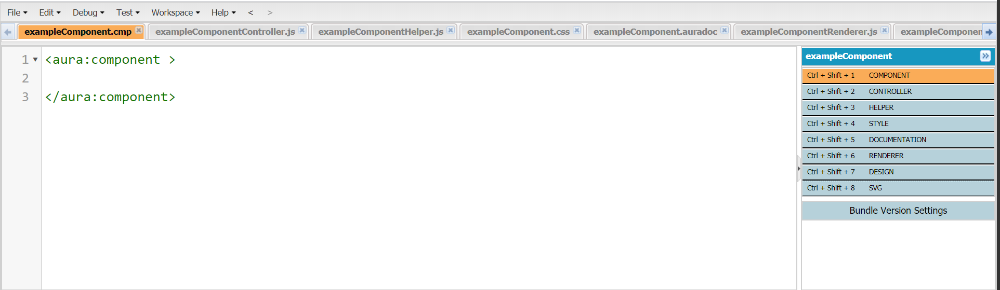
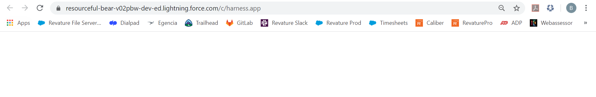
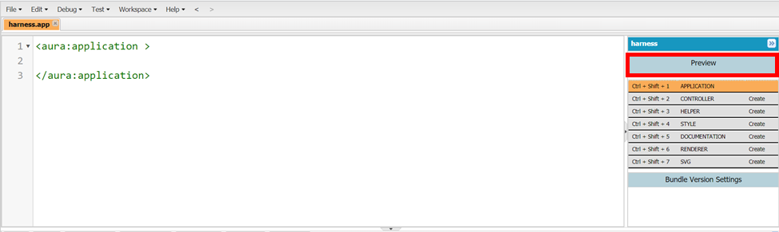
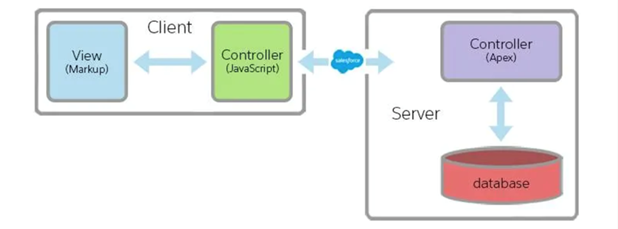
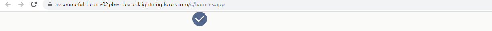

# Module - Aura Component Framework

This module introduces the Lightning Aura Component framework and single-page applications.

## Table of Contents

- [Module - Aura Component Framework](#module---aura-component-framework)
  * [Table of Contents](#table-of-contents)
    + [Helpful References/Links](#helpful-references-links)
  * [AURA Component Framework](#aura-component-framework)
  * [Single-Page Applications (SPAs)](#single-page-applications--spas-)
  * [The Value of Single-Page Applications](#the-value-of-single-page-applications)
  * [Components, Components, and Components](#components--components--and-components)
  * [Aura Component Bundles](#aura-component-bundles)
  * [Viewing Aura Components](#viewing-aura-components)
    + [Lightning Applications](#lightning-applications)
    + [Component Accessibility Interfaces](#component-accessibility-interfaces)
  * [Component Attributes](#component-attributes)
  * [Attributes and Attributes](#attributes-and-attributes)
  * [Expression Syntax](#expression-syntax)
  * [Value Providers](#value-providers)
  * [MVCC Revisited](#mvcc-revisited)
  * [The JavaScript Controller and Helper](#the-javascript-controller-and-helper)
  * [Apex Controllers](#apex-controllers)
    + [Calling Apex Controller Methods](#calling-apex-controller-methods)
  * [Lightning Events](#lightning-events)
  * [Component and Application Events](#component-and-application-events)
    + [Creating Custom Events](#creating-custom-events)
  * [Firing Events](#firing-events)
    + [Firing Lightning Component Library Events](#firing-lightning-component-library-events)
  * [Handling Events](#handling-events)
    + [Handling System Events](#handling-system-events)
  * [Lightning Component Library](#lightning-component-library)
  * [Lightning Data Service](#lightning-data-service)
    + [\<force:recordData\>](#--force-recorddata--)
  * [Error Handling in the Aura Component Framework](#error-handling-in-the-aura-component-framework)
  * [Security in the Aura Component Framework](#security-in-the-aura-component-framework)
    + [Lightning Locker](#lightning-locker)
    + [Apex Security](#apex-security)

### Helpful References/Links

* [Lightning Aura Components Developer Guide](https://developer.salesforce.com/docs/atlas.en-us.lightning.meta/lightning/intro_framework.htm)
* [Component Bundles (Lightning Aura Components Developer Guide)](https://developer.salesforce.com/docs/atlas.en-us.lightning.meta/lightning/components_bundle.htm)
* [Component Markup (Lightning Aura Components Developer Guide)](https://developer.salesforce.com/docs/atlas.en-us.lightning.meta/lightning/components_markup.htm)
* [Creating  Documentation Content (Lightning Aura Components Developer Guide)](https://developer.salesforce.com/docs/atlas.en-us.lightning.meta/lightning/docs_auradoc.htm)
* [Aura Component Bundle Design Resources (Lightning Aura Components Developer Guide)](https://developer.salesforce.com/docs/atlas.en-us.lightning.meta/lightning/components_config_for_app_builder_design_files.htm)
* [Create a Custom Renderer (Lightning Aura Components Developer Guide)](https://developer.salesforce.com/docs/atlas.en-us.224.0.lightning.meta/lightning/js_renderers.htm)
* [Interfaces (Lightning Aura Components Developer Guide)](https://developer.salesforce.com/docs/atlas.en-us.lightning.meta/lightning/oo_interfaces.htm)
* [Interfaces (List of Salesforce-Made Interfaces)](https://developer.salesforce.com/docs/component-library/overview/interfaces)
* [Add Aura Components to Any App with Lightning Out (Beta) (Lightning Aura Components Developer Guide)](https://developer.salesforce.com/docs/atlas.en-us.224.0.lightning.meta/lightning/lightning_out.htm)
* [Salesforce Lightning Design System](https://www.lightningdesignsystem.com/)
* [FAQ (Lightning Design System)](https://www.lightningdesignsystem.com/faq/)
* [Grid (Lightning Design System)](https://www.lightningdesignsystem.com/utilities/grid/)
* [Column Gutters (Grid, Lightning Design System)](https://www.lightningdesignsystem.com/utilities/grid/#Column-Gutters)
* [Alignment (Grid, Lightning Design System)](https://www.lightningdesignsystem.com/utilities/grid/#Alignment)
* [Grid Flow (Grid, Lightning Design System)](https://www.lightningdesignsystem.com/utilities/grid/#Grid-Flow)
* [Column Reordering (Grid, Lightning Design System)](lightningdesignsystem.com/utilities/grid/#Column-Reordering)
* [Icons (Lightning Design System)](https://www.lightningdesignsystem.com/icons/)
* [Icons (Component Blueprint, Lightning Design System)](https://www.lightningdesignsystem.com/components/icons/)
* [Using the Salesforce Lightning Design System in Apps (Lightning Components Developer Guide)](https://developer.salesforce.com/docs/atlas.en-us.206.0.lightning.meta/lightning/apps_slds.htm)
* [Component Attributes (Lightning Aura Components Developer Guide)](https://developer.salesforce.com/docs/atlas.en-us.lightning.meta/lightning/components_attributes.htm)
* [Configure Components for Lightning Pages and the Lightning App Builder (Lightning Aura Components Developer Guide)](https://developer.salesforce.com/docs/atlas.en-us.lightning.meta/lightning/components_config_for_app_builder.htm#components_config_for_app_builder)
* [Components (Salesforce Developers)](https://developer.salesforce.com/docs/component-library/overview/components)
* [Lightning Data Service (Lightning Aura Components Developer Guide)](https://developer.salesforce.com/docs/atlas.en-us.lightning.meta/lightning/data_service.htm)
* [Supported Objects (User Interface API Developer Guide)](https://developer.salesforce.com/docs/atlas.en-us.uiapi.meta/uiapi/ui_api_get_started_supported_objects.htm)
* [Record Form (Aura Component, Component Reference, Salesforce Developers)](https://developer.salesforce.com/docs/component-library/bundle/lightning:recordForm/documentation)
* [Calling a Server-Side Action (Lightning Aura Components Developer Guide)](https://developer.salesforce.com/docs/atlas.en-us.lightning.meta/lightning/controllers_server_actions_call.htm)
* [$A namespace (Lightning Aura Components Developer Guide)](https://developer.salesforce.com/docs/atlas.en-us.lightning.meta/lightning/ref_jsapi_dollarA.htm)
* [Communicating with Events (Lightning Aura Components Developer Guide)](https://developer.salesforce.com/docs/atlas.en-us.lightning.meta/lightning/events_intro.htm)
* [Events (Lightning Component Library, Salesforce Developers)](https://developer.salesforce.com/docs/component-library/overview/events)
* [force:recordData (Aura Component, Component Reference, Salesforce Developers)](https://developer.salesforce.com/docs/component-library/bundle/force:recordData/documentation)
* [Console.error() (MDN web docs)](https://developer.mozilla.org/en-US/docs/Web/API/Console/error)
* [What is Lightning Locker? (Lightning Aura Components Developer Guide)](https://developer.salesforce.com/docs/atlas.en-us.lightning.meta/lightning/security_code.htm)
* [Strict mode (MDN web docs)](https://developer.mozilla.org/en-US/docs/Web/JavaScript/Reference/Strict_mode)
* [Returning Errors from an Apex Server-Side Controller (Lightning Aura Components Developer Guide)](https://developer.salesforce.com/docs/atlas.en-us.lightning.meta/lightning/controllers_server_apex_custom_errors.htm)

## AURA Component Framework

The Lightning Component Framework is made of two programming archetypes: the Lightning Web Component (LWC) and Lightning Aura Component (LAC) 
models. Both models allow us to create a SPA, but it's the latter - Lightning Aura components - that will be our primary focus here.

## Single-Page Applications (SPAs)

Throughout this module, we'll be exploring one half of the Lightning Component Framework, a programmatic Salesforce user interface framework designed 
for making dynamic, responsive single-page applications (SPAs) that can be used by both mobile and desktop users. But before we begin our exploration, 
let's discuss SPAs and their value more broadly using multi-page applications (MPAs for your authors lazy fingers), such as those created through the 
use of Visualforce, as a foil.

The Lightning Component Framework is made of two programming archetypes: the Lightning Web Component (LWC) and Lightning Aura Component (LAC) models. 
Both models allow us to create the SPAs we mentioned above, but it's the latter - Lightning Aura components - that will be our primary focus here.

Before we begin working with the framework itself, let's discuss some of the benefits of doing so. Like Visualforce or LWC, LAC comes with a large 
amount of out-of-the-box, standard components that we can use. However, the LAC model has much better performance than Visualforce pages due to its SPA nature.

In fact, SPAs offer many benefits over traditional, multi-page application frameworks such as Visualforce.

## The Value of Single-Page Applications

SPAs offer many benefits over traditional, multi-page applications (such as those created through use of the Visualforce framework). Most importantly, 
SPAs are designed to work well with mobile devices: they include responsive styling and require fewer server calls. With responsive styling, the page 
automatically resizes based on the size of the device using it. Rather than components taking up a set _length_ on the screen, they take up a 
specific _percentage_ of the screen to make for a smooth transition between desktops, mobile devices, and tablets.

Using fewer server calls mitigates any issues that may be caused by a weak or unstable internet connection from a user's mobile device. In order to 
reduce the amount of server calls, the code returned from a browser includes JavaScript to handle as much user interaction as possible on the client, 
rather than the server. The JavaScript arrives on the client, renders the initial HTML, and then changes the markup in response to events. Because the 
page doesn't have to make a server call and wait for the response to edit the markup, the response to an event generally appears more fluid, faster, and 
native to the user.

However, we must keep in mind the mobile-first principle when writing our SPAs - there's just some logic and processing that phones will not perform quickly 
or efficiently. In these cases, we make asynchronous calls to the server. We've discussed the differences between synchronicity and asynchronicity in the past, 
but let's state them again here. Code normally executes synchronously - one line of code must finish executing before the next line runs. For example, if line 
247 of program x calls a function, line 248 will not execute until that function has returned. Synchronous execution normally fits our purposes, but it is not 
ideal if a function takes a long time to execute or if we are making a call to a remote server. When making said server call, time is a factor - we don't want 
our users to feel as though they are waiting forever for our app to load and therefore believe that the app is slow and was poorly designed.

But we also want to use asynchronicity because there is no guarantee that our call to the server will ever be returned. Perhaps the server crashes before 
handling our request or a natural disaster destroys the data center holding the server. In either of these cases, we would not want the continued and 
successful execution of our program to be depend on feedback from the server - any surviving users of our app would be waiting indefinitely for data that 
will never come. Therefore, our asynchronous calls are standalone - our app will make the call and continue execution without waiting for, depending on, or 
possibly even expecting a response.

There is no hard line to determine when to do processing on the client and when to do it on the server. Obviously, anytime we want to interact with the 
database, we will have to make a server call - there's no way around that. Any other logic needed should generally be kept on the client in order to ensure 
robustness, app fluidity, and faster reactions to user input. But if the amount of required processing is so large that the app appears visibly slower to the 
user, the corresponding logic should be moved from the client-side to the server.


Aura components offer many advantages over Visualforce, arguably most importantly, that they, unlike Visualforce pages, were designed for SPAs. The Aura model 
also promotes code-reusability through use of its components, which are self-contained, reusable units of code. It offers a responsive event-driven architecture 
using Salesforce's Model-View-Controller-Controller (MVCC; that's two controllers!) design system and is easy to integrate with pages on the Lightning platform. 
Finally, the framework features many out of the box (oob), pre-built components and allows us to make use of Salesforce styling.

While there are some limitations with Aura components, notably that they can't be rendered as PDFs like Visualforce pages can be, the benefits far outweigh the disadvantages.

## Components, Components, and Components

Aura components are self-contained, reusable units of code - these are Aura component bundles. We also mentioned that the framework features many oob, pre-built 
components. So we now once again encounter the consequences of Salesforce's not-always-the-best naming practices (there are still more on the way later, I know 
you're excited!). You will frequently see the component bundle referred to as a component, although there is a smaller component file that is itself part of the 
bundle, i.e. the component contains a component. Further, the pre-built components (e.g. `<lightning:card>`) are called components. Finally, to promote reusability 
and modularity, component bundles can contain other component bundles. 

To summarize, component (bundles) are made up of many parts, including components (the ones that are a part of the bundle itself), (oob) components, and possibly 
other, smaller component (bundles). We therefore must be very careful when using the word 'component' - always take context into account and never be afraid to ask for clarification.

## Aura Component Bundles

Aura component bundles can be created through the Developer Console by clicking `File` > `New` > `Lightning Component` or in Visual Studio Code by 
using the `SFDX: Create Lightning Component` command. The component bundle is made of up 
to eight pieces: the component, controller, helper, style, documentation, design, renderer, and SVG (the final seven parts are referred to as 
"resources"). Let's further explore the component and each resource.

>Ethan's wierd mnemonic
  * Component - Cornered
  * Controller - Cats
  * Helper - Have
  * Style - Super
  * Documentation - Dangerous
  * Design - Daring
  * Renderer - Reactions
  * SVG - So, watch out!

The component file contains our markup, which can be both HTML and some model-specific markup similar to that of Visualforce. It has a `.cmp` file 
extension and is the only required part of the bundle. See the following code for an example component file.

```aura
<aura:component>
    This is a very basic aura component
</aura:component>
```

Just like the Visualforce framework, Aura has its own opening and closing markup tags (`<aura:component>` instead of `<apex:page>`). As we said earlier, the modularity of the model is achieved through the ability to instantiate components inside of other components. To do this, we use an optionally self-closing tag that takes the form namespace-colon-component name. The default namespace provided to us by the Salesforce platform is the `c` namespace, so this will generally be the namespace we use. To clarify the concept, let's take a look at an example component file named `parentComponent.cmp` (we'll discuss our motivation for instantiating `childComponent` twice shortly):

```aura
<aura:component>
    <c:childComponent/>
    <c:childComponent/>
</aura:component>
```

Before we move on to the resources included in the bundle, let's quickly discuss the concept of composition. Composition is the process of breaking a large component down into multiple smaller, independent components, thus promoting reusability and allowing for modularity. Although we should always practice composition, its place within our development process is a personal choice: we can start off by building a large component and then break it down when it becomes too big or we have implemented our desired functionality, or we can build small, manageable components from the start.

The next parts of the bundle are the controller and helper, JavaScript files for handling events. We cannot name these files (or any resources) independently - the framework automatically appends `Controller.js` and `Helper.js`, respectively, to the file extension-free name of the component file when they are created. The Aura model offers a close binding between the component and controller files (which we will further detail later in this module) so that the component can easily fire and handle any events in its included controller. Because of this close binding, we do not have to declare the name of the JavaScript files in our markup as we have to when writing HTML - the framework is already aware that `childComponentController.js` is the JavaScript file for `childComponent.cmp`.

It is considered a best practice to keep the controller as free of business logic as possible and move all appropriate logic to the helper. This is both to keep the controller short and readable _and_ because the underlying implementation of the Aura model results in increased efficiency when as much logic as possible is in the helper. Consider our `parentComponent.cmp` example and assume that the `childComponent` bundle contains a controller and helper in addition to the markup file. By instantiating two `childComponent` bundles, we cause the framework to instantiate the `.cmp` file and JS controller twice. But the framework only initializes the helper once - the one helper file is used by both `childComponent` bundles - meaning that we don't consume extra memory by duplicating the helper.

Next, we have the style, a `.css` file that has the same name as the extension-free `.cmp` file and contains any custom styling for the component. As we said earlier, one of the benefits of the Aura model is the provided Salesforce-like styling, but we still have the ability to further customize the appearance of our components. Under the hood, the framework applies the `.THIS` class to each of our elements in the `.cmp` file in order to ensure one component's styling does not override another by applying a sort of namespace to our file. For that reason, the `.THIS` class must be included in all selectors in our style resource. Note that we can still apply additional classes to our component elements.

The documentation resource has the same name as the extension-free `.cmp` file with the `.auradoc` extension and it contains HTML markup that provides more targeted information than may be found in, for example, a project-wide repository. However, this is not an excuse to avoid writing documentation for the project as a whole, rather it is another feature driven by the desire for reusability - anyone wanting to use our component for a purpose other than the original project it was written for will only have to reference this bundle-specific documentation to understand its purpose and how it works. This file can contain escaped component code samples by using `<pre>` tags and using the `&lt;` entity code. For further information on how to implement this, see the `Creating Documentation Link` in the `Helpful References/Links` section.

Earlier, we stated that the Aura model makes it easy to include components in pages on the Lightning platform, especially when utilizing Lightning App Builder, and our next resource, the design resource, can assist us in this endeavor. Like the documentation resource, the design file has the same name as the extension-free component file, but with a `.design` extension. We will further discuss this file when we talk about component attributes.

The renderer resource is another JavaScript file and has the extension-free name of the component file with `Renderer.js` appended. This resource is used to create custom rendering for component elements; but it is much easier to handle the `render` event in the controller and helper, so we will not provide further detail for this resource (see the `Create a Custom Renderer` link in the `Helpful References/Links` section if you would like more information).

The last member of the bundle is the SVG file, having the same name as the component, with the `.svg` extension in place of `.cmp`. SVG stands for scalable vector graphics and is used to define a custom icon for a component in the Lightning App Builder's component menu.

See the below image for an example of a bundle with all eight resources in the Developer Console. The panel on the far right indicates which resources are part of the component bundle (because we have a full bundle, all of the parts are blue; non-included parts would have a gray background). You can quickly navigate to/open a desired bundle member by either using the written keyboard shortcuts or clicking on the corresponding part (e.g. we would click `CONTROLLER` in the far right pane to switch to the `exampleComponentController.js` file). Note that you may choose whether to create each resource when making an Aura component in the Developer Console (again, this does not include the `.cmp` file, which is always required). However, if you create your bundle through Visual Studio Code, all resources will automatically be created for you.



## Viewing Aura Components

### Lightning Applications

For development purposes, we have a way to view components through the Developer Console with the use of a Lightning app, commonly referred to as a harness app. To create a Lightning app, choose `File` > `New` > `Lightning Application` in the Developer Console or use the `SFDX: Create Lightning App` command in Visual Studio Code. Lightning applications have the file extension `.app` and open and close with `<aura:application>` tags. It is a standard practice to name the harness app `harness.app` and reuse the same app across projects because it is only a temporary home for viewing while developing. The harness app is an addressable top-layer component, instantiating all components that you wish to preview. The url assigned to the app takes the following form:

```url
https://<site domain>.lightning.force.com/<namespace>/<appname>
```

The site domain is either the domain assigned to your org by Salesforce or the custom domain you set through `My Domain` (if in a Developer Org). If you are using a Developer Org, your non-custom domain takes the form `na###` (with the pound signs replaced by numbers). If you are using a Trailhead playground, the domain Salesforce assigned to you follows the format `adjective-animal-######-dev-ed` (with the pound signs replaced by alphanumeric characters). As we stated earlier, the default namespace assigned to your org by Salesforce is the `c` namespace. See the below picture for an example url assigned to a harness app in a Trailhead playground.



Note that Lightning apps do not have their own design resources, so any custom, application-wide styling should be defined in the top-level component, not the application file itself. To view this preview from the Developer Console, simply click the `Preview` button enclosed in the red rectangle in the below image. Note that if you have already viewed the app in your current console session, `Preview` will be replaced with `Update Preview`.

<p align="center"></p>

Reusing the harness app and naming it `harness.app` are only best practices _if_ the app is not the final home for our component. For most of our use cases when developing Aura components, this will be the case - embedding our components in Lightning Experience will allow us to take advantage of the features of the platform and provide easier navigation for our users. However, there are some cases where we will not embed our products in Lightning Experience, in which case we would want to provide a more descriptive name for the Lightning Application and would have no reason to reuse it. In fact, Salesforce has released a beta feature called Lightning Out, which allows Aura components to be used in non-Salesforce applications that are not hosted on Salesforce servers; see the `Add Aura Components to Any App with Lightning Out (Beta)` link in the `Helpful References/Links` section.

### Component Accessibility Interfaces

We've been talking about our ability to embed Aura components in Lightning pages, but _how_ do we do this? We do it by implementing Salesforce-made interfaces. See the `Interfaces` link in the `Helpful References/Links` section for a full list of available interfaces; we will only highlight some common and important ones here. In order to implement an interface in an Aura component, we specify the `implements` attribute with a list of comma-separated interface names within the opening `<aura:component>` tag. See the code below for an example.

```aura
<aura:component implements="force:appHostable,lightning:availableForFlowActions">
</aura:component>
```

This attribute is only set in the top-level component; e.g., if we have a parent component that contains children components, we only specify the interfaces in the `<aura:component>` tag of the parent component. Additionally, we can only implement interfaces in Lightning _components_ not Lightning _applications_ - the Lightning app is not designed to be used within Salesforce Lightning Experience, it would just add an unnecessary outer layer that serves the same purpose as Lightning Experience itself, i.e. to host the component.

As can be seen from the code, the interface names have the form `namespace:interfaceName`. Let's highlight some particular members of the `lightning`, `flexipage`, and `force` namespaces. The `lightning:availableForFlowActions` and `lightning:availableForFlowScreens` interfaces allow an Aura component to be used as a flow action and in a flow screen, respectively. `flexipage:availableForAllPageTypes` lets us include a component in any type of Lightning page, while the `flexipage:availableForRecordHome` interface only allows use in Lightning record pages (the `force:hasRecordId` interface is a common partner to the latter). A component implementing `force:appHostable` can be used in a custom tab or the Salesforce mobile app (note that custom tabs must be created for both Lightning Experience and the Salesforce app when using this interface). Finally, `force:lightningQuickAction` gives a component the ability to be used as an object-specific or global action.

## Component Attributes

In the `Apex Introduction` module, we said that it would be pretty nice to be able to store values in our 
code through variables. As expected, we then discovered that Apex has a mechanism for such functionality, 
and we will now make a similar discovery that the Aura framework has an analgous device: the attribute component, 
denoted by the `<aura:attribute>` tag. Aura attributes are used to store values within the 
view (i.e. the component file of the component bundle). Let's take a look at an example attribute tag:

```aura
<aura:attribute name="exampleAtt" type="String" default="This is an example string."/>
```

Some things of note: first, we're not in Apex anymore, Toto. Rather, we're in markup - just as we saw in our interface implementations, double quotes are now an available option (we can still use single quotes if we so desire). Second, there are two required attributes for each aura attribute: `name` and `type`. `name` allows us to refer to the value later (through a mechanism that will be discussed shortly), it must start with a letter or underscore, and can only contain alphanumeric characters and underscores. `type` is analogous to the data type of an Apex variable and can take on many values, these include `Boolean`, `Date`, `DateTime`, `Decimal`, `Double`, `Integer`, `Long`, `String`, `Object`, CRM objects (e.g. Account), and collections. Collections are either arrays, lists, sets, or maps. The latter three cannot contain sObjects - if we want to have a collection of, for example, accounts, we must use the array (e.g. `type="Account[]"`).

There are four optional parameters in Aura attributes: `access`, `default`, `required`, and `description`. `access` determines whether the attribute can be referenced outside of the component namespace (the default access value is `public`, meaning that the attribute can be referenced within its namespace, but not by anything external to that namespace). `default` gives a placeholder attribute value that can be overridden. `required` determines if the attribute must have a value (the default is `false`). Finally, `description` holds an explanation of the purpose of the attribute and its use (this attribute should not be necessary in most cases if our code is self-documenting).

Be aware that assigning default values to sObject Aura attributes can be tricky - the format to do so is an object literal with comma-separated name-value pairs that are themselves colon-separated, but each key and value must be in single quotes and you must define the `sObjectType` key, which takes the API name of the sObject. See the below code for an example of a properly declared sObject Aura attribute with a default value.

```aura
<aura:attribute name="testAcc" type="Account" default="{'sObjectType':'Account',
    'Name':'test'}"/>
```

## Attributes and Attributes

Again, we arrive at a place where we must provide clarification about a term because of Salesforce's naming practices. But this has to be the last such section, right? Nope! Salesforce naming conventions - they're the gift that just keeps giving!

Alright, let's get into it: Aura component markup is built on top of HTML markup, so, just as in HTML, any key-value pairs set within a tag are known as "attributes". Component attributes, which we were discussing in the last section, use the same term. To further the confusion, Aura attributes (i.e. component attributes) can be set as a key-value pair when instantiating the component that contains them. For instance, assume that our `exampleAtt` in the previous section was hosted in an Aura component named `childComponent`. We could set the value of `exampleAtt` when instantiating `childComponent` by using the markup `<c:childComponent exampleAtt="Specified when instantiated"/>`.

This form of instantiation is one of three ways we can populate our Aura attributes, the others being through JavaScript and by binding them to input fields. We'll discuss these latter two in the following section, but first a quick note: to introduce some sense of order and clarity to the model, we will refer to the `<aura:attribute>` tag with either the tag itself or as an "Aura attribute" from here on out. However, you should be aware that Trailhead and Salesforce documentation are bound by no such desire to be kind.

## Expression Syntax

The Aura component framework makes use of expression syntax to refer to variables and 
actions, with the form `{!valueprovider.value}`. We utilize value providers within our expressions to provide clarity and direction when performing data binding 
and action binding. Action binding is the act of using expression syntax in the view to pair controller methods with events. The definition of data 
binding is the process of using expression syntax to wire a value in the component specifically to an `<aura:attribute>`.

## Value Providers

Value providers tell their containing file (either the component file or the JavaScript controller/helper) where to find a variable/method. There are three value providers in the Aura framework: `v`, `c`, and `c`. There's no typos in the previous sentence - there are two different `c` value providers, and they're both distinct from the default `c` namespace (welcome to yet another confusing naming practice!). The format for value providers in expression syntax is as follows: the opening curly brace and exclamation point, then the value provider followed by a dot and the name of the variable, and finally the closing curly brace (e.g. `{!v.exampleAtt}` would refer to our attribute from the `Component Attributes` section).

`v` can be used within both the view and the JavaScript controller/helper; it refers to the Aura attribute in the component with the specified name. When we use `v` in JavaScript, we make use of the `component.get()` and `component.set()` methods. `component.get()` takes the value provider and an Aura attribute name as a parameter, retrieving the value of said attribute. For example, `component.get("v.exampleAtt")` would retrieve the value of `exampleAtt`. `component.set()` takes two parameters: a reference to an element in the view and a new value for said element. We can use this function with Aura attributes by passing the same string literal used in `component.get()` and the new value for the attribute. For example, `component.set("v.exampleAtt", "example")` would set the value of the `exampleAtt` attribute to `"example"`.

The first `c` is only available in the view and refers to actions in the JavaScript controller. This is the close coupling between the controller and component that we spoke of earlier - the circuit is already wired for us, we just have to flip the switch. Because we are within the view, we also use expression syntax with this value provider. So the format is opening curly brace, exaclamation point, value provider, period, method name, and closing curly brace (e.g. `{!c.exampleFunction}` would refer to a function in the JavaScript controller named `exampleFunction`).

The second `c` can only be used in the controller/helper and refers to methods in the Apex controller. Wait, Apex controller? We didn't talk about any Apex in the component bundle. Well, that's because there is no Apex within the component bundle - I'll explain more later. But for now: syntax. We use the `component.get()` methods again because we are within the JavaScript controller, e.g. `component.get("c.myMethod")` refers to an Apex method named `myMethod`.

As you probably assumed, the framework only differentiates between the two `c` providers based on which file they are used in - if you use `c.value` in the view, the model assumes that you are referring to the JavaScript controller because that is the only allowed behavior in the view. Similarly, `c.value` in the JavaScript controller/helper automatically refers to the Apex controller.

## MVCC Revisited

Aura components use an MVCC architecture. This architecture includes both a JavaScript controller _and_ an Apex controller hosted on the client and server, respectively. The model (i.e. the database) is also hosted on the server, while the view (i.e. the component file) is returned to the client in the initial server call. See the below image for a diagram of this design, courtesy of the `Get Started with Aura Components` unit of the `Aura Components Basics` badge on Trailhead.

<p align="center"></p>

## The JavaScript Controller and Helper

When we initially introduced the JavaScript controller and helper, we said that it's a best practice to keep as much logic as possible in the helper because it's only instantiated once no matter how many times we instantiate the component bundle. We've also seen that the framework provides an easy way of referencing controller functions from the component file. With these ideas in mind, close your eyes and imagine an ideal world: you've written a fantastic Aura component, the controller only contains functions that listen for events, and those functions call helper methods to handle all of the complex logic. Your controller is clean and readable, and your component works like a dream. We'll discuss the event part of our ideal scenario later; for now, let's focus on the form of our JS files. But be mindful that the ideal controller is made only of event handlers that call helper functions to actually perform the logic.

We'll look at some actual code in a bit, I promise, but to broaden the sentiment: the renderer (if we choose to create one) is also instantiated once per component instantiation, so as much of its logic as possible should be in the helper as well. If one JS function in your component bundle is calling another JS function in your component bundle, the method being called _must_ be in the helper file - it's meant to act analogously to a utility class and we will use it as such. That _must_ in the previous sentence really is a _must_ - the framework will not allow you to directly call a JS controller method from another JS controller method. The implementation of the Aura Component model is such that only the system can call controller methods, we only have the ability to call helper methods.

Alright, code time - let's take a look at the default controller the model creates for us:

```javascript
({
    myAction : function(component, event, helper) {}
})
```

And similarly, the default helper:

```javascript
({
    helperMethod : function() {}
})
```

Time to break down some aspects of these scripts. First, they should look familiar because of our recent JavaScript studies - these files are simply object literals containing name-value pairs where the names are of the symbol data type and the values are anonymous functions. Because these files are object literals, their pairs must be comma-separated. If you are attempting to save a JS file in the Developer Console and get some verbose, unclear error, check your commas - you may have forgotten to append one after the end of a function. In fact, this is such a common error that some Salesforce documentation recommends always putting a comma at the end of all name-value pairs, regardless of whether you have a subsequent JS function. Your author thinks this looks a little weird syntactically, but if you wish to implement it, by all means go ahead and do so.

You probably noticed that our function declaration in the helper has a looks different than its controller counterpart, this is because of the way the Aura Component model works. Remember how we said the framework wires our controller and component files together automatically? Whenever we perform action binding, we complete that circuit - any time the specific event occurs, the framework calls the bound method and passes it references to the component file, the event that occurred, and the helper file. Because _we_ (not the system) call helper methods, there's more freedom to define the parameters they take. This is why `helperMethod` in the above code is bound to a function that takes no parameters - not because the function can't take parameters, but because we define those parameters ourselves.

We earlier discussed retrieving and modifying `<aura:attribute>` components in the controller, but you can also access non-Aura attribute elements through use of the `component.find()` method. This function takes a string literal whose value is that of the `aura:id` attribute defined on the element we wish to retrieve. E.g., `component.find("thisId")` will return the HTML element `<div aura:id="thisId">`.

In addition to its primary use, we can also use `component.get()` to retrieve model-specific attributes within elements/components (i.e. the name-value pairs within an opening tag). For example, `component.find("thisId").get("v.title")` would return the value assigned to the `title` of `<lightning:card aura:id="thisId" title="Original"/>`. To retrieve a specific field value of an sObject Aura attribute, we only have to use the get method once, e.g. `component.get("v.testAcc.Name")` will return the name assigned to the record bound in `<aura:attribute type="Account" name="testAcc"/>`.

Lastly, because we always seem to run into fun with naming, let's address something quick before the end of this section: the default controller method created by the framework takes a parameter named `component`. But in a lot of documentation, you will see the same parameter referred to as `cmp`. There is no difference between these two names, you can use either one as long as you are self-consistent in your code - if your method takes a parameter named `component`, reference it with `component`. If it takes the `cmp` parameter, refer to that parameter with `cmp`.

## Apex Controllers

Let's move to the server side and talk about the second controller in the MVCC design. These controllers are Apex classes with at least one method that is `public`, `static`, and has the `@AuraEnabled` annotation. Take, for example, the following Apex controller:

```apex
public class exApexController {
    @AuraEnabled
    public static Integer exMethod(){
        return 3;
    }

    @AuraEnabled
    public static Integer exMethod2(String inputString){
        return 3;
    }
}
```

### Calling Apex Controller Methods

As we discussed when exploring value providers, we reference Apex controller methods through the `c` value provider in the JS controller or helper. But the Apex is on the server-side - it is _not_ part of the component bundle - so how does the system know where to look for the method? It knows because we declare the controller name in the component file using the `controller` keyword, in an analogous way to how we declare a custom controller in Visualforce. For example, to use our `exApexController` class in a component, we would write the following code:

```aura
<aura:component controller="exApexController">
</aura:component>
```

Once we've declared the controller, we can access its methods in our JS as follows:

```javascript
({
    myAction : function(component, event, helper) {
        var method = component.get("c.exMethod2");
        method.setParams({inputString : 'hello'});
        method.setCallback(this, function(response){
            if(response.getState() == "SUCCESS"){
                // do some logic
            }

        });
        $A.enqueueAction(method);
    }
})
```

The syntax of the above code is certainly different, but the underlying concepts transfer smoothly from the AJAX we talked about in the `JavaScript` module. Like AJAX, the above code also uses an XMLHttpRequest, the framework just abstracts some of the more repetitive and tedious steps away from us. For example, we don't have to declare the endpoint to which our request is sent because the system knows the url that our Apex class is located at by way of our `controller` declaration in the component.

Because we declare the Apex controller in the component, its methods are referenced through the `component.get()` function. If the method takes parameters (as `exMethod2` in our `exApexController` class does), we use the `setParams` method to assign arguments to those parameters by way of an object literal that holds comma-separated parameter-argument pairs that are themselves colon-separated. Although we did not demonstrate this in the above example, we can use variables previously defined in our function as arguments.

`setCallback` holds our callback function, i.e. the anonymous function that will be executed after our first function (the XMLHttpRequest referenced by `method`) returns; hence the `this` keyword argument. When we receive the server response, we will usually want to check its state through the `getState` property and then execute certain code depending on the state value. In the above code, we check for a `SUCCESS` state which corresponds to an error-free interaction.

Finally, we enqueue the action through the `$A.enqueueAction()` method. This method takes our Apex function reference as an argument and is a part of the `A` namespace that's included in the Aura Component model. It adds our request to a queue to be executed when resources are available and a connection with the server has been established. Once the request has been made and returned, the callback function we set through the `setCallback` method executes.

## Lightning Events

In the `JavaScript` module, we defined events as actions that happen inside the browser. A lightning event is similar - it's an action that happens inside of a Lightning component. However, we handle events slightly differently because we are operating in the context of the Aura Component framework instead of the DOM. The DOM is of course still available to us, but because the underlying framework is packaged differently, there are additional factors that we'll need to take into consideration if we attempt to interact with, e.g., the window object. But the DOM is neither our main concern here nor the main way we will interact with our elements and events, so let's move on.

Events in Aura look a lot like events in the DOM. For example, both contain an onclick event. We can divide lightning events into four broad categories: custom component events, custom application events, system events, and browser events. Custom component and application events are events that we make ourselves, they'll get their own section here shortly. Browser events are the familiar DOM events such as user clicking, user mouse hovering, etc. Finally, system events are events that are related to the framework rather than the DOM, such as the completed rendering of an app or component.

## Component and Application Events

As we said a short time ago: there are two types of custom events in the Aura framework: component and application events. These asynchronous actions serve as our method for communication and passing information between sibling/cousin components, or from child to parent components (we can pass information from parent to child by assigning values for the child component's attributes when we instantiate it in the parent). Component and application events differ in how they propagate and which other components within the application can handle them.

Component events are very similar to the DOM events that we explored in the `JavaScript` module - they go through a capturing phase that starts at the root component of the application and travels down the component hierarchy to the source component (where the event occurred) and then they go through a bubbling phase where they travel from the source component to the root. Just like DOM event listeners, component event handlers fire in the bubbling phase by default, but we do have the option to invoke them in the capturing phase (we will discuss handling events more in a subsequent section). Because of the way they travel, a component event fired in one component cannot be "heard"/handled by another component unless that second component is a direct ancestor of the first. A component that does not fulfill this requirement will not even know that the component event was fired!

Application events, on the other hand, are so named because they are broadcast to every component within the application, no matter what our component family tree looks like. Application events go through three phases: the standard capturing and bubbling phases, followed by a default phase. By default, our application event handlers act in the default phase (which is why it is so named). The default phase differs from the capturing and bubbling phases in that there is no set order that the event propagates through the component family tree and it travels to components that are not ancestors of the source component. But the simple addition of this third phase causes application events to take longer to fully propagate and have worse performance than component events, so it is a best practice to use component events as much as possible - only use an application event if you need to communicate to a component that is not an ancestor of the source component.

### Creating Custom Events

We create custom events in the Developer Console by clicking `File` > `New` > `Lightning Event` or in Visual Studio Code by using the `SFDX: Create Lightning Event` command, both of which create a `.evt` file with the name we provide. Let's take a look at the event template that is provided for us when we use either of these methods:

```aura
<aura:event type="APPLICATION" description="Event template" />
```

That's it - our event files are generally very short (almost always under ten lines long). They start and end with the `<aura:event>` tag, which has four possible parameters: `access`, `description`, `extends`, and `type`. `access` can take a value of `public` or `global` and determines if the event can be used outside of the namespace that defines it. `description` holds a string that offers an explanation of the purpose and functionality of our event. `extends` allows us to extend another event, using the form namespace-colon-name of event to be extended, e.g. `extends="c:parentEvent"` would extend an event named `parentEvent` in the default namespace. Finally, type is the only required parameter and it determines if we are creating an application or component event - we give it values of either `APPLICATION` or `COMPONENT`, respectively. Your author is aware that it is a best practice to use component events and the default event template is an application event; I am unsure of why Salesforce is the way it is, but this is just one of those minor annoyances we must confront.

We said that the purpose of events is to pass information between components, but no parameter of the `<aura:event>` tag appears to give that ability. This is true - we actually achieve that functionality through adding component attributes between the opening and closing event tags. For example:

```aura
<aura:event type="COMPONENT">
    <aura:attribute name="exampleParam" type="String">
</aura:event>
```

Because our Aura attribute is located within an event file, it is referred to as an event parameter. When we fire the event, we will set the values of any parameters it holds with the information we wish to propagate, the component that handles the event will then be able to retrieve the values of those parameters from the event; thus achieving our goal - a channel of communication between components.

## Firing Events

Before we dive into the details, let's make a couple clarifications. First, we don't fire or handle browser events through the mechanisms that we are about to discuss - events such as the `onclick` attribute of a `<lightning:button>` are not fired/handled in the way we will talk about in this section. Rather, those events are fired by the system and handled by the system calling the method we pass to the corresponding event attribute in the component or HTML element. Second, the events we fire are not immediate channels of communication. In order to stick to the principles of modularity, components that fire events should function the same whether that event gets handled or not. Writing a component whose success depends on that event being handled defeats the purpose of modularity - if we have this requirement, why would we separate the firing and handling components in the first place? In a related vein, our events are sent asynchronously to separate the life of the event from the continued execution of the firing component. Trailhead uses the analogy of a radio station to illustrate this concept: the radio station broadcasts on its chosen frequency, regardless of whether anyone is listening.

Okay, time for the details. We refer to the component that fires the event as an event notifier because it "notifies" the application that it may fire a given event before it can fire that event - it's like using your turn signal before changing lanes on the highway. We perform this notification through use of the `<aura:registerEvent>` tag, see the code below for an example.

```aura
<aura:component>
    <aura:registerEvent name="compEvent" type="c:exampleComponentEvent"/>
    <aura:registerEvent name="appEvent" type="c:exampleApplicationEvent"/>
</aura:component>
```

The event notifier tag takes two parameters: a `name` for the event and `type`, which holds the name of the event to be fired in the form namespace-colon-event name. Our markup is the same whether we're throwing an application event or a component event. Our controller code also has a singular format for both event types:

```javascript
    var eventComp = component.getEvent("compEvent");
    eventComp.fire();
    var eventApp = $A.get("e.c:exampleApplicatinoEvent");
    eventApp.fire();
```

Because we have declared our events in the view, we can use the `component.getEvent()` method to retrieve references to them if they are component events and `$A.get()` to retrieve a reference if they are application events. Neither of our example events here takes parameters, but if they did, we would set them with the `setParams` method of the event reference, e.g. `eventComp.setParams({"exampleParam":"exampleValue", "exampleParam2":"exampleValue2"})` - this method takes a JS object literal, just like the `setParams` method of an Apex method reference. We could also use the `setParam` method to set the value of a single parameter, but we will almost always want to use `setParams` instead to keep our functions short. Lastly, we call the `fire()` method of the event, which broadcasts the event to its ancestors or the entire application, depending on its type.

### Firing Lightning Component Library Events

In addition to firing custom events, there are also some framework-defined events that we can fire. These events are part of the Lightning Component Library and they include both the system events that we defined earlier and other events such as `force:navigateToSObject` and `force:showToast`. We'll highlight these two in particular because they are commonly used in Aura development. `force:navigateToSObject` allows us to go to the record page of a given object record, which we specify by giving the Id to the required `recordId` parameter. We can also change which tab of the record page is displayed through the `slideDevName` parameter, which can take values of `chatter`, `related`, or `detail`.

The `force:showToast` event is used to display a toast, i.e. a quick dropdown from the top of the page used to display a message to the user. Toasts are commonly used to display success messages or details of error messages to the user within the interface for the application. The `message` parameter is the only required parameter for this event; we populate it with the information we would like to show to the user.

Our syntax for firing Lightning Component Library events is slightly different than that for firing custom events:

```aura
var userToast = $A.get("e.force:showToast");
navEvt.setParams({"message": "Hey, this is a toast."});
userToast.fire();
```

As you can see from the above controller code, we get the event reference from the `A` namespace, not the view - this is because we don't register the event in the view. The value we pass to the `$A.get()` method is an `e` (for event) followed by a period, the namespace containing the event, a colon, and the name of the event. The rest of our controller code is the same as for firing custom events.

## Handling Events

Our component files must declare any custom events that they handle, just like they declare custom events that they throw. We do this through use of the `<aura:handler>` tag:

```aura
<aura:component>
    <aura:handler name="compEvent" event="c:exampleComponentEvent" action="{!c.handlerFunc}"/>
    <aura:handler event="c:exampleApplicationEvent" action="{!c.otherHandlerFunc}"/>
</aura:component>
```

`event` and `action` are required `<aura:handler>` parameters. Despite the different names, `event` `<aura:handler>` takes the same value as the `type` parameter in `<aura:registerEvent>`. `action` contains expression syntax indicating the JS controller function to call when the event broadcast is received. If we are handling a component event, we must also declare the `name` attribute, which must match that of the corresponding `<aura:registerEvent>`. Note that this attribute is only required and can only be used when handling component events, not application events. Finally, there is an optional `phase` parameter that we can set to `capture` if we want our listener to act in the capturing phase rather than the default bubbling phase. Once we write the markup, we can define the corresponding bound controller action:

```javascript
({
    handlerFunc : function(component, event, helper) {
        console.log('here');
    },

    otherHandlerFunc : function(component, event, helper){
        console.log('here as well');
    }
})
```

Within our controllers, we can use methods such as `getSource()` and `getParam()`. `getSource()` is useful if multiple events (such as button clicks) use the same handler action, in which case `event.getSource().get("v.name")` would return the name of the element of the view that fired the event. `getParam()` takes the name of an attribute passed in the event and returns the value of that parameter.

Components can handle events that they invoke, but your author struggles to think of a case where this would be necessary or useful. If the same component was going to handle and fire the same event, why use an event in the first place? The different elements contained in the component can easily pass information between themselves through event-free JS code.

### Handling System Events

`<aura:handler>` is also used to listen for System events such as the `init` event, which fires after a component has started loading but before it has been rendered. The markup for such an event is:

```aura
<aura:component>
    <aura:handler name="init" value="{!this}" action="{!c.doInit"}/>
</aura:component>
```

The `name` and `value` must follow this format - a name of `init` refers to the component initialization event and a value of `{!this}` refers to the component itself. Although it is not required that we name our action `doInit`, it is commonplace.

## Lightning Component Library

The Lightning Component Framework has a large amount of pre-built components for us to use. These components, such as `<lightning:card>`, `<aura:if>`, `<ltng:require>` and `<lighting:icon>`, are hosted in the Lightning Component Library. The library is available for both Aura components and Lightning web components, which is great because we can use its for common functionality and we don't have to waste our time reinventing the wheel... er writing the wheel when it has already been written?

Anyway, let's talk more specifically about those four components we listed earlier. First is `<lightning:card>` which provides an opaque container surrounding its nested elements. It's useful for visually grouping related information.

`<aura:if>` allows for a sort of control flow within our Aura component. We can use this component to conditionally render markup elements based on a boolean value by specifying the required `isTrue` attribute, which can reference a boolean Aura attribute whose value can be changed by our controller and/or helper.

`<ltng:require>` allows you to load external CSS and JavaScript files that you have uploaded to your org as static resources, by specifying their path in the `styles` or `scripts` parameters, respectively. The expression syntax for referencing a static resource in Aura is similar to the Visualforce counterpart: `{!$Resource.fileName}` will reference a static resource named `fileName` and `{!$Resource.archiveName + 'path/in/archive'}` will reference a static resource in an archived named `archiveName` located at `path/in/archive` within said directory.

Finally, the `<lightning:icon>` component displays the icons available to us the in SLDS library; it takes the `iconName` and `alternativeText` attributes, where we give the name of the icon we want to use and alternative text if the icon cannot be displayed for whatever reason, respectively. See the below component and image for a demonstration of its use.

```aura
<aura:component >
    <div class="slds-grid">
        <div class="slds-col slds-size_1-of-3"/>
        <div class="slds-col slds-size_1-of-3">
            <lightning:icon iconName="action:check" alternativeText="Check"/>
        </div>
    </div>
</aura:component>
```

<p align="center"></p>

For a complete list of components in the Lightning Component Library, see the `Components` link in the `Helpful References/Links` section; we'll mention more components from the library throughout the remainder of this module when they are topically appropriate.

## Lightning Data Service

Maybe in an effort to get us to forgive it for the sometimes-poor naming conventions it thrusts upon us in 
the Aura Component model, Salesforce makes interacting with data in Aura components quite easy through the 
Lightning Data Service (that's LDS, not SLDS). LDS lets our Aura components access the database in the 
fastest, most efficient way possible and it doesn't require us to write any non-markup code. Pretty good deal, 
right?

What makes LDS so efficient? It's designed to reduce any headaches we would normally encounter when following component best practices and building modular, reusable components. If we had a large app with many components that all acted on the same record and didn't use LDS, every one of our components will have to make their own asynchronous calls to Salesforce whenever they want to create, edit, read, or delete anything from the database. Each request takes resources from the client, reducing our app's efficiency. In addition, the more server calls we make, the more we require a strong and constant network connection and the further we stray away from the ideal SPA. Unless we write extra workarounds, we could have conflicting data within different components in our app - one server call may update the record in one component, but if server calls to update the same record in other components are delayed, those components will now display obsolete data.

When we use LDS, the system makes the request for us. It's smart enough to only make one call for the data of any one record - no matter how many components use that record, it will only be instantiated once for our entire app, not once per component. When the LDS call is returned, the service updates all components that hold that record with the new data from the server. Finally, the system caches the record and any updates to it on the client to eliminate network connection headaches - if a user goes offline, LDS will cache the changes locally and update the server when the connection is available again.

There are four LDS components in the Lightning Component Library: `<lightning:recordForm>`, `<lightning:recordViewForm>`, `<lightning:recordEditForm>`, and `<force:recordData>`. 

`<lightning:recordForm`> can take many parameters, we'll talk about the `fields`, `layoutType`, `columns`, `mode`, `objectApiName`, `recordId`, and `recordtypeId` parameters in particular. `objectApiName` is the only required attribute and it's populated with the API name of the object whose record we're manipulating through LDS. `recordId` holds the Id of the record that we're retrieving if reading or updating data - if we're creating a record, we don't populate this field.

`mode` works with `recordId` in determining the operation we are performing. This parameter can take values of `edit`, `view`, or `readonly`. If we have also populated `recordId`, the default mode is `view` (despite the name, this mode also allows us to edit an existing record). If we have not provided an Id, the default mode is `edit`, which also allows us to create records. The final mode, `readonly`, is a non-editable version of `view`. Our `recordId` and `mode` values cannot conflict - we cannot use `readonly` or `view` if we do not provide an Id.

We can populate either the `fields` or `layoutType` parameters, but we should not use both at the same time. `layoutType` can be either `Full` or `Compact`, which correspond to a record's detail page from its object's page layout and a record's detail page from the object's compact layout, respectively. The page layout used with the `Full` value is either the original, system-created page layout (e.g. the `Broker Layout` made for a custom object named `Broker__c`), the page layout assigned to our org's default record type if we have defined record types, or the page layout assigned to the record type we specify with `recordTypeId`.

If we want a more custom view, we can use `fields`, which takes a comma-separated list of field API names, e.g. `fields="Name,AnnualRevenue"`. The fields will display in the order in which we write them. This is a valuable alternative because larger companies that use Salesforce often have separate developers and administrators, so the developer writing an Aura component may not have the ability to edit an object's page layout or compact layout and thus may have to turn to the `fields` parameter. Additionally, we don't want to build the habit of updating/creating page layouts for an object just to fit a specific use case for a single Aura component.

Moving on, the `recordTypeId` parameter only needs a value if there are multiple record types for the object we're interacting with (and a default record type for our organization has not been set) _or_ if we do not want to use the default record type. Finally, `columns` takes an integer that dictates the number of columns shown in our form.

While this basic component is great for a lot of use cases, there are some shortcomings: we can't prepopulate values for a record's fields or delete records with `<lightning:recordForm>`. Additionally, LDS as a whole has some drawbacks: it isn't available for all objects (only those supported by the User Interface API, check the `Supported Objects` link in the `Helpful References/Links` section) and it only allows us to work with one record per form. If we want to operate outside the bounds of LDS, we will have to write our own Apex in an Apex controller.

We've now explored the `<lightning:recordForm>` component. However, this element has its limitations: we can't prepopulate field values when creating a new record using it and there's only so much layout customization available to us - we can't, e.g., provide different columns sizes. But LDS contains other components to allow us to create forms to accept user input or display output to the user such as `<lightning:recordViewForm>` and `<lightning:recordEditForm>`.

`<lightning:recordViewForm>` has two required attributes: `objectApiName` and `recordId`. Just like with `<lightning:recordForm>`, `objectApiName` in the view form takes the API name of the object whose record we want to display. Because we are viewing a record with this component, we must pass the Id of the record we wish to display to the `recordId` component. Unlike the base record form component, the form is not entirely premade for us - we use `<lightning:outputField>` components within the opening and closing view form tags, specifying the `fieldName` attribute of each component to dictate the field that it displays. Because we are displaying a record, we will frequently pair this form with the `force:hasRecordId` and `flexipage:availableForRecordHome` interfaces, as well as an attribute to hold that record Id in order to incorporate our component into a record page. Let's look at an example view form:

```aura
<aura:component implements="flexipage:availableForRecordHome,force:hasRecordId" access="global" >
    <lightning:recordViewForm objectApiName="Account" recordId="{!v.recordId}">
        <lightning:outputField fieldName="Name"/>
        <div class="slds-grid">
            <div class="slds-col slds-size_1-of-2">
                <lightning:outputField fieldName="BillingState"/>
                <lightning:outputField fieldName="Phone"/>
            </div>
            <div class="slds-col slds-size_1-of-2">
                <lightning:outputField fieldName="BillingCountry"/>
                <lightning:outputField fieldName="Industry"/>
            </div>
        </div>
    </lightning:recordViewForm>
</aura:component>
```

In the above code, after our opening `<aura:component>` tag and record Id attribute, we have the opening view form tag, where we specify the object whose record we are displaying and the Id of said record. Inside of the `<lightning:recordViewForm>` tags, we use output field components with the field API names passed to the `fieldName` attribute of those components in order to display the desired record field values. Because we are using the record view form instead of `<lightning:recordForm>`, we have the ability to customize the layout, which we do by manipulating the form columns with the help of the SLDS grid.

`<lightning:recordEditForm>` shares many similarities to the view form - e.g., like the view form, the edit form allows us to customize the layout in a way that we can't with the base `<lightning:recordForm>`. Again, the `objectApiName` attribute of the component is a required parameter - we must specify it to tell the system the object whose record we plan to manipulate. However, the `recordId` parameter for this component is optional. If we specify a value for this attribute, we can edit an existing record; if we do not, we will be able to create a new record and insert it into the database. We can also provide default, prepopulated field values with `<lightning:recordEditForm>` - we do so by specifying the `value` attribute of the `<lightning:inputField>` component, which has an analogous use to that of the `<lightning:outputField>` in our view form. See the following code for an example edit form:

```aura
<aura:component implements="flexipage:availableForAllPageTypes">
    <lightning:recordEditForm objectApiName="Account">
        <lightning:inputField fieldName="Name"/>
        <div class="slds-grid">
            <div class="slds-col slds-size_1-of-2">
                <lightning:inputField fieldName="BillingState"/>
                <lightning:inputField fieldName="Phone"/>
            </div>
            <div class="slds-col slds-size_1-of-2">
                <lightning:inputField fieldName="BillingCountry" value="United States"/>
                <lightning:inputField fieldName="Industry"/>
            </div>
        </div>
        <lightning:button type="submit" label="Save Record"/>
        <lightning:button type="reset" label="Cancel"/>
    </lightning:recordEditForm>
</aura:component>
```

In the above code, we are only going to create a record, not edit an existing one, so we don't pass a value to the `recordId` parameter of `<lightning:recordEditForm>`. Perhaps most of our accounts are in the United States, so we provide a default, prepopulated value for the `BillingCountry` field by specifying the `value` attribute of the corresponding input component. By dictating the types of our buttons, we are able to use the prebuilt functionality of the `<lightning:button>` - our `submit` type button will save the record to the database and the `reset` type button will reset the form (albeit without regenerating our prepopulated field values) without us needing to write any non-markup code. However, if we wished to have more custom button functionality, we could action bind a JavaScript controller function to the `onclick` button attribute instead of specifying a value for the `type`.

### \<force:recordData\>

If we need even more customization than the ability to customize layout with `<lightning:recordViewForm>` or the abilities to customize layout and prepopulate field values `<lightning:recordEditForm>`, LDS offers one final tool: `<force:recordData>`, which requires that we build the form and its functionality ourselves. There are no broadly required attributes for `<force:recordData>`, rather the parameters that we should specify are determined by our purpose for the component.

If we wish to display an existing record, we must pass the record Id to the `recordId` parameter, data bind an `<aura:attribute>` to the `targetFields` attribute, and specify a value for either the `fields` or `layoutType` parameters. The attribute bound to `targetFields` will be populated with the fields returned for the record. Which fields are returned is determined by `fields` or `layoutType` - we can pass a value of either `FULL` or `COMPACT` to `layoutType` to have access to all fields included in the objects page layout or compact layout, respectively. If we instead choose to use `fields`, we give a comma-separated list of the API names of the desired fields. Let's see this functionality in practice:

```aura
<aura:component implements="flexipage:availableForRecordHome,force:hasRecordId">
    <aura:attribute name="acc" type="Account"/>
    <force:recordData recordId="{!v.recordId}" targetFields="{!v.acc}" fields="Name,BillingState,Phone,BillingCountry,Industry"/>
    <lightning:card>
        <lightning:formattedText value="{!v.acc.Name}"/>
    </lightning:card>
</aura:component>
```

When our above component is instantiated, the system will populate the `recordId` attribute of our `<force:recordData>` with the Id from the hosting webpage's url. Then, it will query for that record, returning the field values that we dictated with `fields` and assign the returned data to the `acc` attribute, so that we can later use expression syntax to reference and display those values. To make our current view-only form editable, we can simply give the `Edit` value to the `mode` parameter of `<force:recordData>`. Note that we don't have the ability to use the `<lightning:outputField>` component (or `<lightning:inputField>`) with `<force:recordData>` - those components can only be used with view and edit forms.

When creating a new record, we don't have to specify a record Id for `<force:recordData>`, but as we alluded to earlier in this section, we will have to write some non-markup code to save our record to the database. Let's take a look at an example:

```aura
<aura:component>
    <aura:handler name="init" value="{!this}" action="{!c.doInit}"/>
    <aura:attribute name="acc" type="Account"/>
    <force:recordData aura:id="recordData" targetFields="{!v.acc}" 
                      fields="Name,BillingState,Phone,BillingCountry,Industry"/>
    <lightning:card>
        <lightning:input label="Name" value="{!v.acc.Name}"/>
        <lightning:button label="Save Record" onclick="{!c.save}"/>
    </lightning:card>
</aura:component>
```

```javascript
({
    doInit : function(component, event, helper){
        component.find("recordData").getNewRecord("Account", null, false, $A.getCallback(function(){}));
    },

    save : function(component, event, helper) {
        var recordComp = component.find("recordData").saveRecord(function(saveResult){});
    }
})
```

We begin our component with a handler for the `init` event, bound to an action in our JavaScript controller that calls the `getNewRecord` method of `<force:recordData>` after retrieving a reference to that component with the `component.find()` method. `getNewRecord` takes four parameters: the API name of the object that we wish to interact with, the record type of the record we are creating (by passing a `null` value we are saying that our record will have the master record type), whether to force a server call, and a callback function that is executed when the method returns. Note that our callback here is empty because we are just providing a simple demonstration, in production code we would want a more robust callback. The method creates a new instance of the specified object type and automatically assigns it to the `<aura:attribute>` we bound to the `targetFields` parameter of `<force:recordData>`.

When the user clicks our `Save Record` button, the `save` function in the JavaScript controller is called. This function retrieves a reference to our `<force:recordData>` component and then calls the component's `saveRecord` method to insert the record into the database. `saveRecord` takes a single parameter: a callback function to be executed when the method returns (again, a robust callback function should have some actual code within it).

This component also allows us to delete records - an action not available with the base, view, or edit forms - by using its `deleteRecord` method, see the `force:recordData` link in the `Helpful Links/References` section for details.

## Error Handling in the Aura Component Framework

Just like Apex, JavaScript has try-catch-finally blocks to allow us to catch and handle any errors that occur in our JS controller and helper; they function the same as their Apex counterparts, see the `Apex Exceptions` module if you need a refresher. Once we have caught the error, there are many ways to display it to the user. For instance, we can fire the `force:showToast` event we discussed earlier, conditionally instantiate a component within an `<aura:if>` component to hold the error message, or print the error to the console with the JS `console.error()` method, which takes the string holding our error message as a parameter.

If an error occurred in your Apex code, the system may display an error popup in the component that explains what exactly went wrong. But depending on the error, the popup may only say "An internal server error has occurred..." message in order to protect your org's data. Other errors, such as trying to assign the a SOQL query that returns no results to a single sObject instance, won't trigger the popup at all. In either case, we can utilize the AuraHandledException to provide a more informative and useful error message. To do so, simply use the `throw` keyword and instantiate the exception, passing a string with any error message that occurred, e.g. `throw new AuraHandledException('This is an exception')`.

## Security in the Aura Component Framework

### Lightning Locker

Security in the Aura environment can be broken into two parts that mirror the design of SPAs as a whole: security on the client-side and security on the server-side. Client-side security is mostly handled through Lightning Locker, a very nice piece of Salesforce abstraction that provides a protected architecture that is much more shielded than a basic HTML page with JavaScript. Locker automatically enforces use of JavaScript strict mode, limits DOM access, prevents access of unsupported JS methods, restricts use of the eval() function, and places HTML/DOM elements and global objects in secure wrappers; the DOM access, restrictions on eval(), and secure wrappers are the features that deal with security.

The service only allows components to access elements that are contained within a component within their namespace. Because Salesforce controls the default namespace and any custom namespaces we use, this prevents bad actors from developing their own components that reach into and edit our markup. Similarly, the limits on eval() prevent malicious markup edits - Locker prevents eval() from accessing properties that are not in the global scope. This pairs nicely with the secure wrappers that the service places around HTML/DOM elements, markup elements, and global objects. Locker intercepts any calls to the non-wrapped versions of these elements and redirects them to the secure versions, which restrict access to the underlying object and its properties (in addition to providing some improvements in efficiency due to the underlying implementation). Coupled with eval() restrictions, this feature helps stop cross-site scripting (XSS) attacks. For example, a hacker can't write their own code to edit theevent handler of a button and cause it to redirect the user to a malicious website through the eval() function because the secure wrapper around the element in our markup and the one around the object literal in our JS files remove global scope from the corresponding properties and Locker doesn't allow eval() to access non-global properties.

Lightning Locker is automatically enabled for Lightning components in Lightning Experience, the Salesforce mobile app, and communities; this includes any flows and standard/custom Lightning Apps. But, because the service makes use of some JavaScript features that not all browsers contain, it isn't available in some browsers. Thankfully, this only applies to one browser that Lighnting Experience supports: Internet Explorer 11. Therefore, be sure to instruct your users to instead use a browser such as Google Chrome, Mozilla Firefox, Safari, or Microsoft Edge.

### Apex Security

While the model largely takes care of client-side security for us, we're on the hook for protection on the server-side. The client-side restrictions help ensure that no one outside our organization can harm us through our Aura components; server-side restrictions should follow the principles of Salesforce administrative security, ensuring that no one within our organization accesses data they should not have the ability to access. Remember all Apex code runs in system mode by default, so we have to use the tools we discussed in the Apex Security & Sharing module to achieve this goal. As a refreshser, these tools are class sharing keywords to switch execution from a system to user context, the Schema.sObjectType.objectAPIName.isAccessible() method (e.g. Schema.sObjectType.Account.isAccessible) to ensure the running user has object-level permissions, and the Schema.sObjectType.objectAPIName.fields.fieldAPIName.isAccessible(), Schema.sObjectType.objectAPIName.fields.fieldAPIName.isCreatable(), Schema.sObjectType.objectAPIName.fields.fieldAPIName.isDeletable(), and Schema.sObjectType.objectAPIName.fields.fieldAPIName.isUpdateable() to check the user's appropriate field-level permissions. If such access does not exist for the running user, we can throw a descriptive AuraHandledException and gracefully display it in our view.
