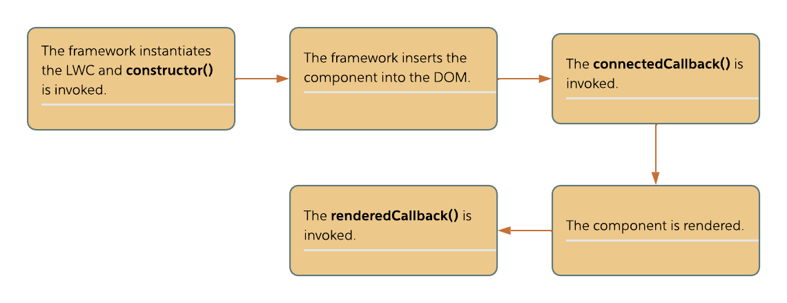
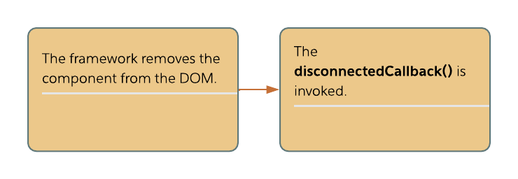
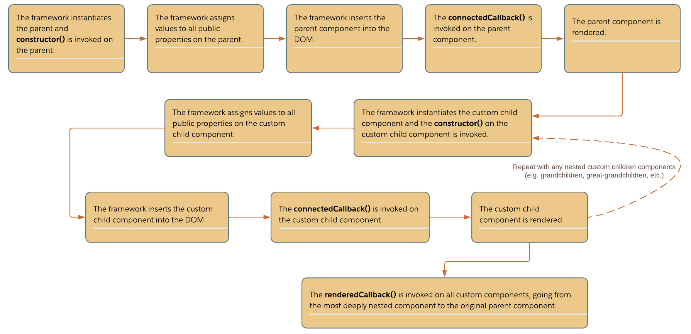
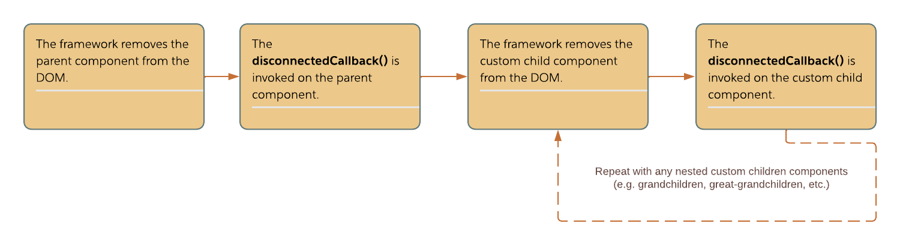

# Module - Lightning Web Components Core Concepts

[Lightning Web Components (Salesforce Developers, YouTube)](https://www.youtube.com/playlist?list=PLgIMQe2PKPSJ0hK7DInqhLlw7QK5Pt6fD)

[LWC Compilation Under the Hood | Developer Quick Takes (Salesforce Developers, YouTube)](https://www.youtube.com/watch?v=G0EyCNtEMB0)

## Introduction to Lightning Web Components (LWC)

- the Lightning Web Component framework is Salesforce's newest programmatic UI framework
- it was released in the Spring '19 of Salesforce
- Lightning web components make use of ECMAScript standards and new HTML standards implemented in browsers since the release of ES6 and subsequent ECMAScript versions
- in fact, the LWC framework is just a small abstraction layer on top of these native web component APIs
- because of this, they're more performant than Aura components
    - when the Aura Component Framework was developed and released, browsers didn't have any implementations for custom HTML elements or modules
    - but in the time between the release of the Aura Component Framework and the Lightning Web Component Framework, standards were updated so that conformant browsers now natively supported templating, custom HTML elements, web components, and JavaScript modules
    - this meant that web component frameworks no longer had to have functionality for these features themselves
    - by removing these responsibilities from the framework and therefore also removing the extra layer of abstraction, newer component models are more performant because they're making use of the browser's native capabilities

## LWC Bundles

- a Lightning web component is a reusable custom HTML template with an associated JavaScript module 
- in addition to holding HTML and JavaScript files, a Lightning web component bundle can contain a CSS file
    - if we're creating a component that will be a visible part of our user interface, we need to include an HTML template and JavaScript module
    - if we're surfacing our component on the Salesforce platform, we need to include a meta XML file and can optionally include an SVG file as well
- HTML template
    - basic HTML template

    ```html
    <template>
    </template>
    ``` 

    - recall that HTML templates are placeholders for markup that isn't immediately rendered when a page is loaded
    - rather it's rendered through custom JS functionality that attaches it to the DOM
    - in LWC, this operation is performed by the framework itself
- JavaScript module
    - by using JavaScript modules, we can reuse JavaScript code without needing to rewrite the same functionality
    - we're also able to export our classes, which will be important for testing
    - basic JS module:

        ```js
        import { LightningElement } from 'lwc';
        export default class MyComponent extends LightningElement  {
            
        }
        ```

        - we're using the import statement to import `LightningElement` from `lwc`, the core JS module for the framework
        - `LightningElement` is a custom wrapper of the `HTMLElement` interface
        - all of our JS modules pertaining to components that are visible UI elements should start with this syntax (i.e. importing `LightningElement` and creating a class that extends it)
        - `MyComponent` is a placeholder for the name of our LWC
- CSS file
    - this file is optional
    - we can include it to provide custom styling for our component
    - but we can also make use of SLDS to be able to include default Salesforce styling without needing to write our own CSS - whether we're creating platform or open source components
- each of the files in a LWC bundle have the name of the component itself followed by the respective file extension
    - e.g. a component named `newAccountForm` would have files with the names `newAccountForm.html`, `newAccountForm.js`, and `newAccountForm.css`
- we can create service components without HTML files to serve as shareable JS code

## HTML Template File

- we can data bind text and attribute values to fields within our component's JS module
    - we do so by surrounding the **identifier** (i.e. the name of the corresponding variable) with curly braces
- we similarly action bind event handlers to event attributes on the elements in our markup by surrounding the identifier (in this case, the name of the handler method) with curly braces
- we can also make use of template directives to conditionally render markup or to iterate through collections
- we have four template directives in the LWC model
    - `if:true` and `if:false`

    ```html
    <template>
        <template if:true={booleanProperty}>
            <!-- markup to render if booleanProperty is true -->
        </template>
        <template if:false={otherBooleanProperty}>
            <!-- markup to render if otherBooleanProperty is false -->
        </template>
    </template>
    ```

    - when the bound boolean property in the JS file is `true`, the markup contained within a template `if:true` directive will be rendered
    - when the bound boolean property in the JS file is `false`, the markup contained within a template `if:false` directive will be rendered
- `for:each`
    - allows us to iterate through a collection and render markup for each item within that collection

    ```html
    <template>
        <template for:each={arrayToIterateThrough} for:item="arrayItem">
            <!-- markup to render for each item in the list -->
        </template>
    </template>
    ```

    - we data bind a collection from our JS file to the `for:each` attribute
    - we provide a value to the `for:item` attribute that we'll use to refer to item we're working with on the current iteration
    - each outer tag within the `for:each` directive needs to include the `key` attribute
    - this attribute is bound to an identifier that's unique for each item within the collection
    - e.g. if we're iterating through a collection of records, we'll usually use the record Id as the `key` value for each of our tags
    - when we're referring to the current item within our `for:each` directive, we'll do so using the data bind syntax that we've observed so far (i.e. curly braces surrounding the variable name)
- `iterator`
    - like the `for:each` directive, this allows us to iterate through a collection
    - but it also provides us the ability to provide special functionality for the first and last items of the collection

    ```html
    <template>
        <template iterator:iteratorName={collectionToIterateThrough}>
            <!-- within our directive, we can work with the iterator property (in this case, iteratorName)
    this property has value, index, first, and last properties -->
        </template>
    </template>
    ```
 
    - the `value` property returns the value of the current item
    - the `index` property holds the index of the item in the collection
    - the `first` and `last` properties are Boolean properties that are `true` if we're working with the first/last item in the collection, respectively, and `false` otherwise (working with these properties is how we can provide custom markup for the first and last items of a collection)
    - like with the `for:item` value in the `for:each` directive, we'll refer to our iterator in the `iterator` directive through data binding (i.e. curly braces surrounding the variable name)
- in addition to template directives, our markup can also hold out-of-the-box components that Salesforce provides through the Lightning Component Library
- we can also instantiate custom LWCs inside of other custom LWCs
    - LWC and Aura components (the precursor to LWCs) are partially interoperable
    - we can instantiate an LWC inside of an Aura component
    - but we cannot instantiate an Aura component inside of a LWC
- to instantiate a component inside of another (i.e. to compose components), we follow the kebab case naming convention with the format `<namespace-component-name>`
    - e.g. `<lightning-card>`
    - with custom components, any capital letters in their camelcase filenames are replaced with lowercase letters after a hypen
        - e.g. `<c-new-account-form>` to instantiate a component named `newAccountForm`
    - the parent component can set public properties/call public methods on its children components, as well as handle events fired by those children


## JavaScript Module

- **fields** are member variables of a JS class
- when we declare variables in a JS class, we don't declare them (and can't declare them) with one of the three scope-enforcing keywords (`let`, `const`, `var`)
- this is because variables declared within a JS class are implicitly scoped to the class itself
- any exposed fields that are available to external code are referred to as **properties**
- **attributes** are the term we use to refer to fields from our JS file when we're using them in our component's HTML template
- when we're doing so, we'll replace the camelcase of a property name in our JS file with kebab case in the HTML template
- e.g. 

```html
<template>
    <!-- the following code would allow us to set a variable in the child component's
JS named exPublicProperty -->
    <c-child-component ex-public-property="example value"></c-child-component>
</template>
```

- when the parent component value assigned to a child component's property changes, the change will automatically propagate to the child component
- we can retrieve HTML elements in our JavaScript by calling the `querySelector()` or `querySelectorAll()` methods on `this.template`
    - we should avoid passing element Ids to these methods, as the framework modifies element Ids to globally-unique values when it renders our components

### Shadow DOM

- recall that the shadow DOM encapsulates the DOM (document object model)
- with this encapsulation, the inner content of a component (e.g. the elements in its markup and the fields, properties, and methods of its JS module) cannot be accessed by entities outside of the component bundle by default
- this is valuable because it allows us to protect our component from arbitrary/accidental outside manipulation
- it also allows us to separate our components for the purposes of applying different styles
 
### LWC Decorators

[LWC Fundamentals - Understanding Decorators | Developer Quick Takes (Salesforce Developers, YouTube)](https://www.youtube.com/watch?v=WbDoaZ1gi3E)

[LWC Fundamentals - The @api Decorator | Developer Quick Takes (Salesforce Developers, YouTube)](https://www.youtube.com/watch?v=F7J5yn3MIXw)

- we have three decorators unique to Lightning web components - `@track`, `@wire`, and `@api`
- each of these decorators will be imported from the `lwc` module
- `@track`
    - allows us to make objects and arrays in our JS reactive
    - this means that the affected parts of our component (i.e. those pieces of markup that deal with the collection) will automatically rerender whenever the contents of a collection annotated with the `track` decorator change
    - we don't need to use this decorator for primitive values because all primitive fields in a Lightning web component are reactive by default
    - but the framework is not reactive to changes to the values of items within a collection by default, thus our need for the `track` decorator
- `@wire`
    - allows us to invoke methods from a Salesforce org, another component, or other external services through use of the wire service
    - with the wire service, the framework will handle the invocation of the decorated method
    - whenever a field or property whose value is set by the wired method is referenced in our markup or JavaScript, the framework will automatically call the wired method to populate it
    - the wired method will return an object with `data` and `error` properties that we can either assign to a field or parse in a function
- `@api`
    - allows us to expose a field or method within our JS module so that other components within our application can work reference/invoke it
    - e.g.

    ```js
    import { LightningElement, api } from 'lwc';

    export default class ChildComponent extends LightningElement {
        @api exPublicProperty;
    }
    ```

    - alternatively, we can create accessor properties by making getter and setter methods for a field in our class
    - we can then expose one of the getter and setter methods with the `api` decorator, but not both
    - e.g.

    ```js
    import { LightningElement, api } from 'lwc';
    export default class ChildComponent extends LightningElement {
        publicProperty;
        
        get exPublicProperty() {
            return this.publicProperty;
        }
        
        @api
        set exPublicProperty(value) {
            if(value > 0) {
                this.publicProperty = value;
            }
        }
    }
    ```

    - as the above code shows, getter and setter methods are preceded by the `get` and `set` keywords, respectively

### Lightning Web Component Lifecycle and Lifecycle Hooks

- lifecycle hooks are callback methods that are invoked after certain events throughout a components lifecycle
- we have five lifecycle hooks within the framework - `constructor()`, `connectedCallback()`, `renderedCallback()`, `disconnectedCallback()`, and `errorCallback()`
- the lifecycle of an LWC can be broken down as follows
    - creation/insertion:

    <p align="center"></p>

    - removal:

    <p align="center"></p>

- when an LWC has custom children components, the lifecycle is modified
    - creation/insertion:

    <p align="center"></p>
    
    - removal:

    <p align="center"></p>

#### `constructor()`

- the `constructor()` callback is invoked when a component is instantiated
- before we invoke any other logic within our `constructor()` callback, we need to invoke the constructor of the parent class (i.e. `LightningElement`) through `super()`
- we can't add any attributes to the custom element associated with our LWC (i.e. the HTML template) through this method because the component hasn't been inserted into the DOM yet
- as our lifecycle diagrams show, the `constructor()` callback for any parent components is invoked before that of their custom children

#### `connectedCallback()`

- the `connectedCallback()` lifecycle hook is invoked after the framework inserts a component into the DOM
- we use this method to perform any setup operations
    - e.g. retrieve data imperatively from an Apex method or subscribe to a channel on the Lightning Message Service
- the `connectedCallback()` lifecycle hook for any parent components is invoked before that of their custom children

#### `renderedCallback()`

- the `renderedCallback()` lifecycle hook is invoked once a component has rendered
- this lifecycle hook is invoked on custom children components before its invoked on their parents
- we should be aware that a component can be rendered and rerendered multiple times throughout its lifecycle
    - consider that primitive fields in an LWC are automatically reactive, and any collections annotated with `@track` are also reactive
    - whenever the value of a reactive field changes, the component will be rerendered, invoking the `renderedCallback()` lifecycle hook once again
- if we have code that we only want to execute when the component is initially rendered, we can use a boolean field in our JS class and use its value to indicate if the `renderedCallback()` lifecycle hook has executed
 
#### `disconnectedCallback()`

- the `disconnectedCallback()` lifecycle hook is invoked when the framework removes a component from the DOM
- this hook executes for any parent components before it executes on their custom children
- we use the `disconnectedCallback()` hook to perform any cleanup operations, such as unsubscribing from a channel of the Lightning Message Service

#### `errorCallback()`

- the `errorCallback()` lifecycle hook is invoked whenever an error occurs in the lifecycle of a child component or if an error occurs in an event handler in a child component
- therefore, we use this lifecycle hook to capture all exceptions that occur in any descendant components
- `errorCallback()` is declared with two parameters
    - a JS object holding the error (named `error`)
    - a string holding the stack trace of the exception (named `stack`)
 
## CSS

- recall that cascading CSS properties don't cross the shadow boundary
- so if we want to share CSS code, we can either
    - specify CSS properties that are inherited
        - although inherited styles are only applied if there's no applicable cascading style - so our components can't contain any local CSS that would override inherited properties
    - share CSS in such a way that it crosses the shadow boundary
- we have two main ways to share CSS that will cross the shadow boundary - CSS modules and custom CSS properties
- CSS modules are LWCs that only have CSS files (and meta XML files if we're writing platform LWCs)
    - once we've created a CSS module, we can import it into the CSS file of another component through the syntax `@import 'namespace/componentName'`, e.g.

    ```css
    @import 'c/appStyles'
    ```

- custom CSS properties are inherited variables that allow us to reuse property values
    - we define custom properties by prefixing the property name with two hyphens (`--`), e.g.

    ```css
    :host {
        --text-background: purple;
    }
    ```

    - here, we're defining the custom property on the `:host` selector, which references the component's shadow host
    - we can then use the `var` function to reference the property, as in the following example

    ```css
    p {
        background-color: var(--text-background);
    }
    ```

## Communicating Between Lightning Web Components

- to communicate between LWCs, we'll follow the principle of "props down, events up"
    - if we want to communicate from parent components to children components, we'll make use of public properties and methods on the child component
        - the fields and methods in a child component can be exposed through the use of the `@api` decorator
        - we can assign values to the properties of a child component when instantiating it or we can pass information through arguments to a method of the child component
    - if we want to communicate from children components to parent components, we'll fire a custom event to do so

### Custom Events

- to create a custom event, we'll instantiate the `CustomEvent` class within our component
- we fire our custom event by calling the `dispatchEvent()` method, passing it the custom event that we instantiated
- when we instantiate the `CustomEvent` class, we'll provide at least one argument to the class constructor
    - this first argument will be the name of our event
- a parent component will be able to handle the event by action binding an event handler to the corresponding event attribute on its instantiation of the component that fires the event
- so if we fired a custom event with the code in the first block below, we'd be able to bind to an event handler with the markup in the second code block

    ```js
    // childComponent.js
    this.dispatchEvent(new CustomEvent('next'));
    ```

    ```html
    <template>
        <c-child-component onnext={methodToHandleEvent}>
        </c-child-component>
    </template>
    ```

    - as our markup shows, the name of the event attribute is the name of the event with the prefix `on`
- we can propagate information through a custom event by providing an additional argument - an object literal - to the constructor when instantiating the custom event
    - we'll assign our desired values to the `detail` key within this object literal, e.g.

    ```js
    const customEvent = new CustomEvent('customeventname', { detail : 'value to propagate' });
    ```

- to handle a custom event that propagates information, our event handler in the parent component will declare a single parameter (commonly named `event`)
- this parameter will be an object with the values that we passed in the second argument to the `CustomEvent` constructor
- so we can retrieve the value propagated through the event by working with the `detail` property of the `event` parameter, e.g.

    ```js
    parentComponentHandlerMethod(event) {
        console.log(event.detail);
    }
    ```
 
- recall that custom events don't cross the shadow boundary by default
- so by default, a custom event can only be handled by the direct parent of the component that fires it
- any grandparent or further ancestor components are on the other side of the shadow boundary, so the event will never reach them
- if we want our event to be handled by grandparent or other ancestor components, we can work with the `bubbles` and `composed` properties of our custom event instance
- recall our four configuration options
    - `bubbles` is `false` and `composed` is `false`
        - the default configuration where the event doesn't bubble up the shadow DOM, nor cross shadow boundaries
    - `bubbles` is `true` and `composed` is `false`
        - the event bubbles up the shadow DOM, but doesn't cross shadow boundaries
    - `bubbles` is `false` and `composed` is `true`
        - the event doesn't bubble up the shadow DOM, rather it jumps from shadow host to shadow host
        - this configuration is considered a bad practice and is not supported for platform LWCs
    - `bubbles` is `true` and `composed` is `true`
        - the event bubbles up the DOM, crosses every shadow boundary, and continues bubbling up the corresponding shadow/light DOMs
        - this configuration is also considered to be a bad practice
 

#### Custom Event Conventions

- when naming a custom event, we want to avoid using any uppercase letters or spaces
- rather, the name of our custom event should be all lowercase
- if we do need to separate words, we should do so through the use of an underscore
- JS passes non-primitive values by reference
    - so if any event handlers modify a non-primitive passed to them (such as an object or an array), this non-primitive value will also be changed in the child component that fired the event
    - therefore, we can inadvertantly modify the values of children component objects when working with data passed through our custom events
    - to avoid this behavior, we can
        - avoid passing any non-primitive values through custom events entirely
        - copy any non-primitive values to new variables and assigning those new variables to the `detail` property instead
		
##  Lightning Data Service

The LDS is a tool that can be used to load, create, edit, or delete a record in a component without the use of Apex code.
LDS handles sharing rules and field-level security automatically. LDS is also very effecient in its performance, so it would be 
considered a best practice to use LDS whenever feasible. 

One big reason LDS is so effecient:
  * It has a cache that is shared with all components that use it. 
    * This means that records only need to be loaded once and can be accessed by other components utilizing LDS. 
	
To interact with LDS we make use of some built-in components of the Salesforce Lightning Component Library.

## lightning-record-form
[Docs reference](https://developer.salesforce.com/docs/component-library/bundle/lightning-record-form/documentation)

Using this component to create record forms is easier than building forms manually with lightning-record-edit-form or lightning-record-view-form. 
The lightning-record-form component provides these helpful features:

  * Switches between view and edit modes automatically when the user begins editing a field in a view form
  * Provides Cancel and Save buttons automatically in edit forms
  * Uses the object's default record layout with support for multiple columns
  * Loads all fields in the object's compact or full layout, or only the fields you specify
  
However, lightning-record-form is less customizable. To customize the form layout or provide custom rendering of record data, use 
lightning-record-edit-form (add or update a record) and lightning-record-view-form (view a record).

## lightning-record-view-form
[Docs reference](https://developer.salesforce.com/docs/component-library/bundle/lightning-record-view-form/documentation)

Use the lightning-record-view-form component to create a form that displays Salesforce record data for specified fields associated with that 
record. The fields are rendered with their labels and current values as read-only.

Use the lightning-output-field component to render fields as read only. 

```
<lightning-record-view-form
    object-api-name={objectApiName}
    record-id={recordId}
>
    <lightning-output-field field-name={nameField}> </lightning-output-field>
</lightning-record-view-form>
```

## lightning-record-edit-form
[Docs reference](https://developer.salesforce.com/docs/component-library/bundle/lightning-record-edit-form/documentation)

Use the lightning-record-edit-form component to create a form that's used to add a Salesforce record or update fields in an existing record on 
an object. The component displays fields with their labels and the current values, and enables you to edit their values.

lightning-record-edit-form supports the following features.

  * Editing a record's specified fields, given the record ID.
  * Creating a record using specified fields.
  * Customizing the form layout
  * Custom rendering of record data
  
To specify editable fields, use lightning-input-field components inside lightning-record-edit-form component.

To display record fields as read-only in lightning-record-edit-form, use lightning-output-field components to specify those fields. You can also 
use HTML and other display components such as lightning-formatted-name to display non-editable content.

To display all fields as read-only, use the lightning-record-form component with mode="readonly" or the lightning-record-view-form component 
instead of lightning-record-edit-form.

```
<lightning-record-edit-form
    object-api-name="{objectApiName}"
    record-id="{recordId}"
>
    <lightning-input-field field-name="{nameField}"> </lightning-input-field>
    <div class="slds-var-m-top_medium">
        <lightning-button variant="brand" type="submit" label="Save">
        </lightning-button>
    </div>
</lightning-record-edit-form>

```

## What about delete?

So we can view with the view-form. Go figure. We can view/edit with the record-form and we can view/edit/create with the record-edit-form. All with 
various levels of customizations and baked in features. But earlier we said we can delete. So what about that? This is where wire adapters and 
functions come into play. 

## Wire Adapters and Functions
[Docs Reference](https://developer.salesforce.com/docs/component-library/documentation/en/lwc/lwc.reference_ui_api)

Wire adapters and JavaScript functions are built on top of Lightning Data Service (LDS) and User Interface API. Use these wire adapters and 
functions to work with Salesforce data and metadata.

These wire adapters and functions first need to be imported in from a module before we can use them. There are many at our disposal:
  * lightning/uiListsApi
  * lightning/uiObjectInfoApi
  * lightning/uiRecordApi
  * and more...
  
 For our purposes, and what you will likely run into the most for now, is the uiRecordApi. This is also where we can start to use the LDS to delete 
 a record if we so wish.
 
 First the import.
 ```
import { deleteRecord } from 'lightning/uiRecordApi';
import { ShowToastEvent } from 'lightning/platformShowToastEvent';
 ```
 
 Then perhaps we have a button press that calls a method in our component's class. Note that deleteRecord from the uiRecordApi will return a promise 
 that we can manipulate. In this case, we are displaying a toast message.
 
 ```
 delete(event) {
	deleteRecord(this.recordId)
	.then(() => {
		this.dispatchEvent(
			new ShowToastEvent({
				title: 'Success',
				message: 'Record deleted',
				variant: 'success'
			})
		)
		.catch(error => {
			this.dispatchEvent(
				new ShowToastEvent({
					title: 'Error deleting record',
					message: error.body.message,
					variant: 'error'
				})
			);
		});
 }
 ```