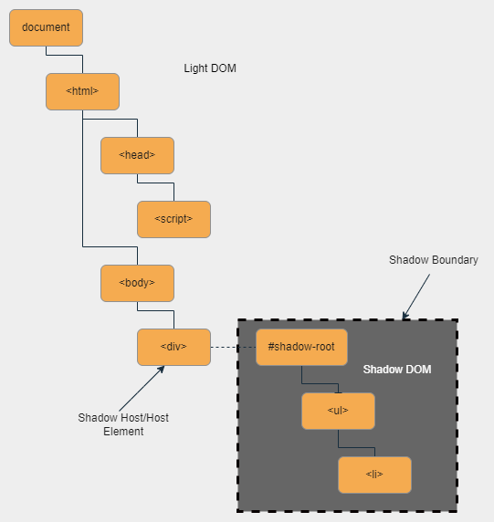
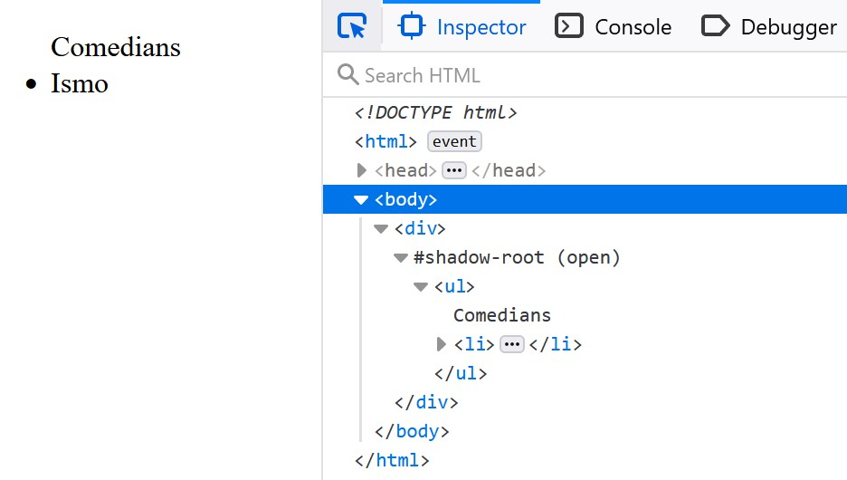
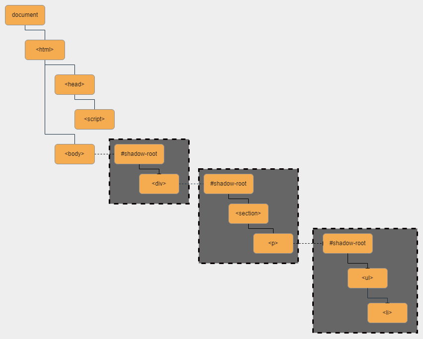
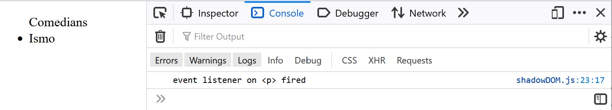
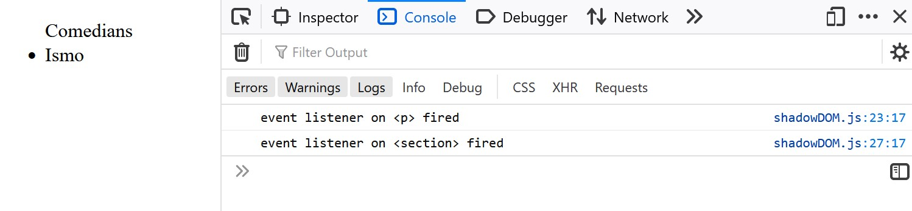
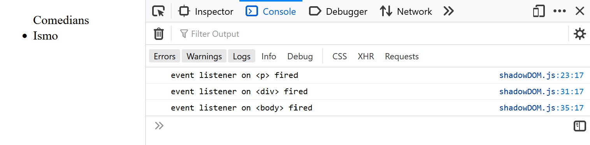
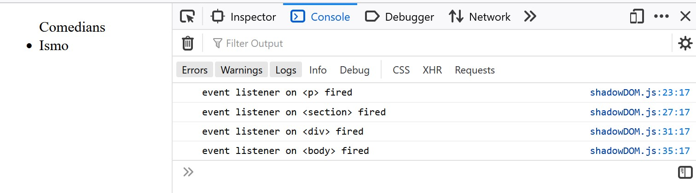

# Modern Web Component Concepts

## Modern Web Components and JavaScript

[The Case for Custom Elements: Part 1 (Rob Dodson, Medium)](https://medium.com/dev-channel/the-case-for-custom-elements-part-1-65d807b4b439)

[Introducing Lightning Web Components Open Source (Salesforce Developers' Blog)](https://developer.salesforce.com/blogs/2019/05/introducing-lightning-web-components-open-source)

[Web components (MDN Web Docs)](https://developer.mozilla.org/en-US/docs/Web/Web_Components)

* JavaScript is a fairly special language
    * it's what powers the modern web stack and is supported by and essential to all major web browsers
    * because it's used in different browsers (and even in server-side applications), there's a variety of environments that can run JavaScript
        * e.g., each major browser has a JavaScript engine that provides just-in-time compilation and then execution of JavaScript code (i.e. the browser compiles the code at runtime)
        * the V8 engine - used by Chrome, Node.js, and all versions of Edge released after 15 January 2020, is an example of such an engine as is SpiderMonkey, which is used by Firefox
    * because JavaScript isn't a proprietary language, there's not guaranteed consistency in terms of what features of the language are supported across browsers (but all major browsers have practically identical JavaScript support for our purposes)
    * JavaScript is standardized through the `ECMAScript` specification, which is managed by ECMA International
        * `ECMAScript` is maintained and evolved by `TC39`, a committee that includes industry leaders and experts from a variety of companies, including Salesforce
        * `ECMAScript` is technically a general scripting language specification, but JavaScript is by far the most popular/well-known `ECMAScript`-compliant language, to the point that the terms `ECMAScript` and JavaScript have grown to have practically equivalent meaning
        * `TC39` releases an `ECMAScript` specification, then JavaScript engines begin to adopt new language features/rules
            * this is why we'll often see, e.g. a browser, list its `ECMAScript` support (e.g. `ES6`) as a shorthand for what "version"/features of JavaScript it supports
    *  the terms `ES6` and/or `ES6+` are frequently used to indicate that a browser/JavaScript engine supports modern JavaScript
        * this is because `ES6` was a transformational update to `ECMAScript`
            * it introduced the `let` and `const` keywords for variable declaration, arrow functions, modules, and promises, among other features
            * it's also notable that the previous version - `ES5` - was originally released in 2009 and `ES6` was released in 2015
            * this means that JavaScript didn't evolve for over a half-decade - a half-decade in which internet usage increased, but (more importantly) smartphones were introduced _and_ became widely adopted
            * starting with `ES6`, a new `ECMAScript` specification is now released annually (and subsequent versions are referred to by their release year, e.g. `ES2020`)
* although not related to `ECMAScript`, JavaScript engines have recently (i.e. since 2017) been adopting APIs for custom HTML elements, the `<template>` element, and the shadow DOM - the foundations of modern web components

### Custom HTML Elements and `<template>`

* since the release of `ES6`, browsers have added support for custom elements and the `template` element
    * the `template` element allows us to store HTML markup that won't be rendered initially - it's not a standalone HTML document - but rather rendered later by JavaScript
* before browsers supported these natively, a web component framework had to create and define it's own component system, parse any framework-specific syntax into vanilla JavaScript, and determine how to work with the (limited) browser APIs to render the components in the most efficient way possible
* this led to frameworks moving closer to the direction of becoming (or at least appearing to be) separate languages, rather than dialects of JavaScript, which made it harder for developers to move from framework to framework
    * Salesforce may be one of the most guilty parties in this, as the Aura Component Framework has some pretty stark differences when compared to, e.g. Angular or React
* but now browsers offer native APIs for custom elements and templating, which has some important effects
    * modern frameworks can take advantage of those APIs, so they don't have to handle (or be as opinionated about) the insertion of components into and removal of components from the DOM and the events that occur as a result of those operations
    * because they can use the browsers' native capabilities, frameworks can be smaller, increasing runtime performance
    * performance increases also manifest themselves because browers can now optimize for the web component functionality that they're offering as part of their JavaScript engines
        * older frameworks were limited to providing abstraction on top of the browser's engine
            * while abstraction is a good principle to follow, any abstraction increases overhead and therefore decreases performance
            * this is especially true when extending an underlying third-party system
* this doesn't make web component frameworks obselete
    * vanilla web components are still fairly new and limited
        * they can also require the developer to write a lot of boilerplate code, which is usually abstracted away by a framework
        * they suffer from a generalism problem - the web component capabilities that a browser offers can't be too opinionated or specific because of how wide an audience the browser needs to serve, so there will always be room for frameworks that are tailored to specific use cases
* skills developed with modern frameworks are also much more transferrable than in the past - there will always be minor syntax differences from framework to framework, but with the adoption and use of browser APIs, there's less that the framework needs to do and therefore less room for framework-specific syntaxes 


### Shadow DOM

[DOM tree (javascript.info)](https://javascript.info/dom-nodes)

[Deep Dive: Shadow DOM & CSS in Lightning Web Components (Salesforce Developers YouTube)](https://www.youtube.com/watch?v=T7OGDMRnjT4)

[Explaining the Shadow DOM | Developer Quick Takes (Salesforce Developers YouTube)](https://www.youtube.com/watch?v=K5i9zMzVlzM)

[Using shadow DOM (MDN Web Docs)](https://developer.mozilla.org/en-US/docs/Web/Web_Components/Using_shadow_DOM)

* the shadow DOM is a `Web Hypertext Application Technology Working Group` (`WHATWG`, a standards body that includes members from Google, Apple, Microsoft, and Mozilla) standard that encapsulates the internal DOM of a web component
* before we cover it further, let's define some terms
    * the **shadow host** is the element we attach the shadow tree to
    * the **shadow boundary** is the border between the shadow DOM and the regular DOM (which is often called the light DOM to place it in contrast to the shadow DOM) - i.e. it separates the `shadow-root` and shadow host
    * the **shadow-root** is the first element of the shadow tree, every descendent element of the `shadow-root` is encapsulated from entities outside the shadow boundary
* in general, the Document Object Model (DOM) is the `World Wide Web Consortium` (`W3C`) standard for accessing documents
    * there are three main types of DOMs - XML DOM, HTML DOM, and the core DOM (which lays out the general standards that the other two types adhere to)
    * because we'll almost always be interacting with the HTML DOM in web development, we usually refer to it as simply the "DOM"
    * the DOM defines how JavaScript can interact with and manipulate our HTML (and indirectly, our CSS)
    * in the DOM, the Document is the html page/browser window, the Objects are the elements on that page, and the Model is the way in which we access, interact with, change, add, and/or delete elements
    * the DOM for an HTML (or any HTML file) can be represented by an object tree with individual nodes for each object (i.e. element)
    * the root of this tree is the document object, i.e. the `<html>` tag (the window object represents the browser and contains the entire document)
* in additional to the DOM tree that represents the entire HTML file, each element has its own DOM subtree that contains its descendant elements
* the DOM subtree for an element can be one of two types - a light tree and a shadow tree
    * the light tree, like the light DOM, is the "regular" subtree that we're used to interacting with
    * the shadow tree is an encapsulated DOM subtree that is not mirrored in the HTML
* an element's shadow tree can't be accidentally/arbitrarily accessed from the main HTML document
    * rather, entities from the main document can only interact with exposed elements in the shadow tree in specified ways
    * this means that elements in the shadow DOM won't be found/returned by regular DOM selection methods (e.g. `getElementById()`, `getElementsByClassName()`, `getElementsByTagName()`, `querySelector()`, and `querySelectorAll()`) that are called from the light DOM
    * this is valuable for a couple reasons
        * it provides encapsulation to prevent outside JavaScript accidentally manipulating our components - by default, one component can't reach into another and change its contents
        * it allows us to promote abstraction and reusability
            * if we want to create truly reusable components, they shouldn't be all that opinionated
                * if we make a child component, the more generic it is, the more reusable it is
                * reusable children components should be stateless - they should get any specific information they need from the more project-specific parent that instantiates them (e.g. a reusable child component might display a picklist and fire events related to operations on it, while the project-specific parent would provide the values and label for the picklist)
                * i.e. reusable children components should be stateless, while project-specific components will be stateful
            * additionally, a parent component _shouldn't_ be able to arbitrarily reach into and modify a child component because this would violate abstraction and destroy the convention of component APIs

#### Sidebar: (Web Component) APIs

[API (MDN Web Docs)](https://developer.mozilla.org/en-US/docs/Glossary/API)

* when reading documentation on web components, we often hear that publicly exposing a field or method will add it to our component's API
* taking a step back, API stands for application programming interface
    * it exposes methods and properties that an external entity can consume
    * that's a fairly general/enigmatic definition, but it's partly because of how pervasive APIs are throughout software development
    * when we think of APIs, we often think of third-party REST/SOAP webservices (e.g. a forex API) that we can pull data from to use in a custom frontend, but the term is much more broadly-applicable
    * the "application" in an API and the program that consumes the API can be
        * two entirely different systems written by developers at different companies
        * an backend and a frontend that are written by the same party
        * a child web component and a parent web component - let's explain
            * when the contents of a web component are encapsulated in its shadow tree, outside entities (including the parent web component) shouldn't reach into the child component and retrieve/manipulate whatever they want
            * rather, they work with methods, properties, and events that are exposed _outside_ of the shadow boundary
            * this encapsulation brings the benefits that all encapsulation brings, including the ability for abstraction
                * so we can freely change the details of a component's implementation (e.g. the body of a method) so long as we don't change the interface (i.e. the method name, its return type, and the parameters it requires) and be ensured that we won't break existing implementations, no matter where our component is used
            * this last point is what allows our web components to be truly reusable - if we design children components that are sufficiently stateless, they can be reused in a variety of contexts (even those for which we didn't originally design them) by working with the same exposed methods, properties, and events

#### Shadow DOM Encapsulation

* the shadow DOM encapsulates
    * markup
        * as we said above, we can't use DOM selection methods from the light DOM to retrieve elements from the shadow DOM
    * events
        * we'll talk about the consequences of this/how to work with this shortly
    * styling
        * cascading styles defined in parent components don't leak into child components (we'll discuss this more later as well)
* consider the following HTML markup and accompanying JS, the result of which can be represented through the DOM tree shown in the figure below

```html
<!DOCTYPE html>
<html>
    <head>
        <script src="./shadowDOM.js"></script>
        <meta charset="UTF-8">
    </head>
    <body>
        <div>
        </div>
    </body>
</html>
```

```js
window.onload = () => {
    const div = document.querySelector('div');
    let shadowRoot = div.attachShadow({mode: 'open'});
    shadowRoot.innerHTML = '<ul>Comedians<li>Ismo</li></ul>';
}
```

<p align="center"></p>

<p align="center"></p>

* we've created a shadow DOM and attached it to the `div` element using the `attachShadow()` method with an `open` `mode`, which allows the `shadowRoot` element to be queried by outside entities
* as the figure shows, the shadow boundary surrounds the descendant components of the `<div>`
* any DOM selection methods executed by components/elements in the light DOM (i.e. outside of the shadow boundary) won't retrieve any components/elements below the `shadow-root` because the shadow boundary obscures those entities from outside actors

#### Crossing the Shadow Boundary

* thus far, we've said that a parent component isn't able to arbitrarily reach into and manipulate a child component due to the encapsulation offered by the shadow DOM
* but this is only one half of encapsulation - the other being permitting access to internal entities in ways that we define and control
* with the shadow DOM, we do this by configuring methods, events, and properties such that they're available outside of the shadow boundary

#### Custom Events and the Shadow Boundary

[Event (MDN Web Docs)](https://developer.mozilla.org/en-US/docs/Web/API/Event)

[CustomEvent (MDN Web Docs)](https://developer.mozilla.org/en-US/docs/Web/API/CustomEvent)

[How Events Bubble in Lightning Web Components (Salesforce Developers' Blog)](https://developer.salesforce.com/blogs/2021/08/how-events-bubble-in-lightning-web-components)

* when communicating between web components, we frequently use `CustomEvent` interface
    * this interface is a part of the JavaScript language; it's what we use to create and fire our own events
    * because it inherits from `Event`, it has access to the `bubbles` and `composed` properties
    * `bubbles` is a Boolean value indicating whether the event bubbles up through the DOM
        * it defaults to `false`
    * `composed` is also a Boolean that indicates whether the event will cross the shadow boundary
        * it also defaults to `false`
    * we can specify values for these properties when instantiating the `CustomEvent`, as shown in the following code snippet

```js
let event = new CustomEvent('myevent', {
    "bubbles": true,
    "composed": false   
})
```

* let's modify our `shadowDOM.html` and `shadowDOM.js` files from above to the following code

```html
<!DOCTYPE html>
<html>
    <head>
        <script src="./shadowDOM.js"></script>
        <meta charset="UTF-8">
    </head>
    <body>
    </body>
</html>
```

```js
window.onload = () => {
    let body = document.querySelector('body');
    let bodyShadowRoot = body.attachShadow({mode: 'open'});
    bodyShadowRoot.innerHTML = '<div></div>';

    let div = bodyShadowRoot.querySelector('div');
    let divShadowRoot = div.attachShadow({mode: 'open'});
    divShadowRoot.innerHTML = "<section><p></p></section>";

    let paragraphEl = divShadowRoot.querySelector('p');
    let pShadowRoot = paragraphEl.attachShadow({mode: 'open'});
    pShadowRoot.innerHTML = '<ul>Comedians<li>Ismo</li></ul>';

    pShadowRoot.querySelector('li').addEventListener('click', function() {
        let evt = new CustomEvent('liclick',{
            "bubbles": false,
            "composed": false
        });
        paragraphEl.dispatchEvent(evt); 
    });

    paragraphEl.addEventListener('liclick', () => {
        console.log('event listener on <p> fired');
    });

    divShadowRoot.querySelector('section').addEventListener('liclick', () => {
        console.log('event listener on <section> fired');
    });

    bodyShadowRoot.querySelector('div').addEventListener('liclick', () => {
        console.log('event listener on <div> fired');
    });

    document.querySelector('body').addEventListener('liclick', () => {
        console.log('event listener on <body> fired');
    });
}
```

* we've removed the `div` element from our markup and attached a shadow DOM to the `body` of our page
* this shadow DOM contains a new `div` element that we then connect another shadow DOM to
* this nested shadow DOM contains `section` and `p` elements, with the `p` having a final shadow DOM that contains the `ul` and `li` elements from before
* we've added an event listener on the `li` element that causes the host element (`p`) to fire a custom event - `liclick` - when `Ismo` is clicked
* there are event listeners on the `p`, `section`, `div`, and `body` elements that handle the `liclick` custom event and log a message to the console when they've done so
* with this modified code, the DOM will now look like the following

<p align="center"></p>

* we have four different configuration options, so let's see what happens when we modify the `bubbles` and `composed` properties of the `liclick` event
    * `bubbles` is `false` and `composed` is `false`
        * the event doesn't bubble past the host `p` element
        * these are the default values for `bubbles` and `composed`
        * they're also the recommended ones because this arrangement gives the best encapsulation
        * when we click `Ismo`, only the `p` event listener hears the event, as shown by the following image

    <p align="center"></p>

    * `bubbles` is `true` and `composed` is `false`
        * because `bubbles` is `true`, the event will bubble up the shadow DOM
        * but because `composed` is false, it won't be able to cross a shadow boundary, so it'll be an internal event that bubbles until it reaches a shadow root
        * when we click `Ismo`, the output is the following

        <p align="center"></p>
        
        * in this case, because the `p` element is firing the event, the next shadow boundary is the one delimiting the light and shadow DOMs at the `div`
        * so the event bubbles from the `p` element to the shadow boundary and therefore is able to be handled by both the `p` and `section` elements

    * `bubbles` is `false` and `composed` is `true`
        * because `bubbles` is false, the event won't bubble up the shadow DOM
        * but because `composed` is true, it can (and will) cross shadow boundaries
            * however, it won't be able to bubble through the light DOM or other shadow DOMs, rather it will jump from shadow host to shadow host
        * after clicking `Ismo`, our output is the following

        <p align="center"></p>

        * as we expected, the event is only able to be handled by our three shadow hosts - the `p`, `div`, and `body` 
        * we should note that using this configuration is considered to be a bad practice

    * `bubbles` is `true` and `composed` is `true`
        * because `bubbles` is `true`, the event will bubble up the shadow DOM and because `composed` is true, the event will be able to cross shadow boundaries
        * therefore, every element will receive and have an opportunity to handle the event, regardless of whether it's part of the same shadow DOM that contains the element that fired the event, a different shadow DOM, or the light DOM
        * we get the following output when clicking `Ismo`

        <p align="center"></p>

        * as we expected, each of our elements with an event listener - the `p`, `section`, `div`, and `body` - receives and handles the event
        * using this configuration is also considered a bad practice

#### Shadow DOM and CSS

[Cascade and inheritance (MDN Web Docs)](https://developer.mozilla.org/en-US/docs/Learn/CSS/Building_blocks/Cascade_and_inheritance)

[Encapsulating Style and Structure with Shadow DOM (CSS-Tricks)](https://css-tricks.com/encapsulating-style-and-structure-with-shadow-dom/)

* CSS styles come in two flavors - cascading and inherited
* cascading styles combine CSS selectors and declarations from multiple definitions
    * this is where the concept of specificity comes into play - if there are multiple conflicting styles that could be applied to the element, those styles corresponding to the most specific selector will win out
    * if there are multiple selectors with equal specificity, the last defined selector will take precedence
* inherited styles are passed down to children components, but are only applied in the case that no cascading style is available
* however, inherited styles can cross the shadow boundary, while cascading styles are unable to do so
* documentation sites such as `W3Schools` and `MDN Web Docs` will indicate if a particular CSS property is an inherited one
* this encapsulation is valuable because we can provide local styles for our web components without needing to worry that they'll be overridden
* however, we may want to allow styles defined in parent components (or elsewhere) to be applied to our web components
* we have a couple options to implement this
    * we can of course define local styles in a component with the use of the `style` element
        * even if we use declarations that match those defined elsewhere within our application, we'll likely not need to worry about these values being repeated and taking up additional memory because many browsers have engines that will work to optimize styles by configuring a single stylesheet that will be used under the hood for preventing the duplication selectors and declarations
        * we can also make use of custom properties, as these cross the shadow boundary
    * we can use a `link` element, but we should keep in mind that a hardcoded path to a stylesheet is not a best practice as the desired file may be saved in different places in different applications and, at a base level, hardcoding is antithetical to reusability

## Single-Page Applications (SPAs)

* we've now discussed the core tenants of modern web component standards, but we haven't discussed why we want to use web components in general
* they're the newest methodology of web development and they allow us to implement reusability
* one of the biggest benefits that we'll get is modularity - the ability to break up our user interface into... components - individual building blocks
* smaller UI pieces bring greater opportunity for reuse in general, but they also make it easier to show certain portions of the UI to our end users and to hide them in response to user interaction
* this can be done with client-side JavaScript, which adheres to SPA principles
* before we get too much into the details, we should take note of the term "single-page", particularly to say that creating an SPA does not _necessarily_ mean that our entire application is represented through a single webpage
    * we can (and should) implement SPA ideas even in multipage applications
* SPAs work well with mobile devices because they have responsive styling and require fewer server calls
    * when a web application has responsive styling, the elements on the page will automatically resize based on the size of the device viewing it
        * we implement responsive styling through specifying percentages, rather than absolute lengths (e.g. pixels)
    * by making fewer server calls, we can mitigate the effects of a weak or unstable internet connection that a mobile device may have
        * to reduce the amount of server calls, we use client-side JavaScript to handle as much reaction to user interaction as possible on the client
        * when we use a framework, the JavaScript included with the framework arrives on the client, renders the initial HTML, and then developer-defined JavaScript can change the markup in response to events
        * with more reaction handled client-side, the application can appear more fluid, native, and faster to the user (even when the user is on a desktop/laptop with a good network connection) because it doesn't need to make a server call and wait for a response
* but an SPA does not eliminate the need for developer-invoked calls to the server - we'll still want to call the server to interact with the database or when we need to perform a large amount of processing
    * when we do make a server call, it should be asynchronous in order to
        * be able to provide reaction that appears fluid to our end users because we'll be able to invoke that call and then continue execution without needing to wait for the response
        * separate the continued, successful execution of our application from the result of the server call
    
## Component Composition

* thorughout this module, we've discussed having reusable and modular components
* when developing, we create such components through composition - the process of breaking our interface up into multiple components
* although it's certainly possible to over-modularize our components - making them too small and therefore adding unnecessary communication overhead and complexity - it's much more common for newer web developers to write components that are too large
* ideally, we'll create smaller, reusable components that can then be hosted inside of parent container components that will be more project-specific 
* we'll want to have the container components be stateful because they have a larger view of the application (i.e. a child component may not know what all needs to change in response to an event occurring within it), we can use them to manage state (even if we're unable to use a library such as `Redux`), and we can have them act as the communication line between their subtrees and the server to ensure that we aren't making duplicate requests
