# Module - Visualforce

This module introduces the Visualforce Framework.

- [Module - Visualforce](#module---visualforce)
      - [Helpful References/Links](#helpful-references-links)
  * [Visualforce](#visualforce)
  * [Static Resources](#static-resources)
  * [The renderAs Attribute](#the-renderas-attribute)
  * [Visualforce Controllers](#visualforce-controllers)
    + [Expression Syntax, Action Binding, and Data Binding](#expression-syntax--action-binding--and-data-binding)
    + [Standard Controllers](#standard-controllers)
    + [Standard Set (List) Controllers](#standard-set--list--controllers)
    + [Controller Extensions](#controller-extensions)
    + [Custom Controllers](#custom-controllers)
    + [When to Use What](#when-to-use-what)
  * [Dividing Your Page with Page Blocks](#dividing-your-page-with-page-blocks)
  * [Accepting Input with Standard Input Components](#accepting-input-with-standard-input-components)
    + [Validating Input Field Values](#validating-input-field-values)
  * [Displaying Data with Standard Output Components](#displaying-data-with-standard-output-components)
  * [Displaying Records in Visualforce Tables](#displaying-records-in-visualforce-tables)
  * [Inline Editing](#inline-editing)
  * [Partial Page Rerendering](#partial-page-rerendering)
  * [The View State and Visualforce Best Practices](#the-view-state-and-visualforce-best-practices)
  * [Parameters](#parameters)
  * [Wrapper Classes](#wrapper-classes)
  * [Visualforce Wizards](#visualforce-wizards)
  * [Testing Visualforce Pages](#testing-visualforce-pages)
  * [Including Visualforce in the Salesforce User Interface](#including-visualforce-in-the-salesforce-user-interface)
  * [Setting Styling in Visualforce](#setting-styling-in-visualforce)
  * [Tabs in Visualforce Pages](#tabs-in-visualforce-pages)
  * [Dynamic Visualforce](#dynamic-visualforce)
  * [Custom Labels](#custom-labels)

#### Helpful References/Links

* [Introducing Visualforce (Visualforce Developer Guide)](https://developer.salesforce.com/docs/atlas.en-us.pages.meta/pages/pages_intro.htm)
* [Creating a Static Resource (Visualforce Developer Guide)](https://developer.salesforce.com/docs/atlas.en-us.pages.meta/pages/pages_resources_create.htm)
* [Using Static Resources (Visualforce Developer Guide)](https://developer.salesforce.com/docs/atlas.en-us.pages.meta/pages/pages_resources.htm)
* [Referencing a Static Resource in Visualforce Markup (Visualforce Developer Guide)](https://developer.salesforce.com/docs/atlas.en-us.pages.meta/pages/pages_resources_reference.htm)
* [Global Variables (Visualforce Developer Guide)](https://developer.salesforce.com/docs/atlas.en-us.pages.meta/pages/pages_variables_global.htm)
* [Accessing Data with a Standard Controller (Visualforce Developer Guide)](https://developer.salesforce.com/docs/atlas.en-us.pages.meta/pages/pages_controller_std_access_data.htm)
* [Using Standard Controller Actions (Visualforce Developer Guide)](https://developer.salesforce.com/docs/atlas.en-us.pages.meta/pages/pages_controller_std_actions.htm)
* [Standard List Controllers (Visualforce Developer Guide)](https://developer.salesforce.com/docs/atlas.en-us.pages.meta/pages/pages_controller_sosc_about.htm)
* [Pagination with a List Controller (Visualforce Developer Guide)](https://developer.salesforce.com/docs/atlas.en-us.pages.meta/pages/pages_controller_sosc_pagination.htm)
* [Using Standard List Controller Actions (Visualforce Developer Guide)](https://developer.salesforce.com/docs/atlas.en-us.pages.meta/pages/pages_controller_sosc_actions.htm)
* [StandardController Class (Apex Developer Guide)](https://developer.salesforce.com/docs/atlas.en-us.apexcode.meta/apexcode/apex_pages_standardcontroller.htm)
* [StandardSetController Class (Apex Developer Guide)](https://developer.salesforce.com/docs/atlas.en-us.apexcode.meta/apexcode/apex_pages_standardsetcontroller.htm)
* [Accessing Data with List Controllers (Visualforce Developer Guide)](https://developer.salesforce.com/docs/atlas.en-us.pages.meta/pages/pages_controller_sosc_access_data.htm)
* [Building a Custom Controller (Visualforce Developer Guide)](https://developer.salesforce.com/docs/atlas.en-us.pages.meta/pages/pages_controller_custom.htm)
* [Controller Methods (Visualforce Developer Guide)](https://developer.salesforce.com/docs/atlas.en-us.pages.meta/pages/pages_controller_methods.htm)
* [What are Custom Controllers and Controller Extensions (Visualforce Developer Guide)](https://developer.salesforce.com/docs/atlas.en-us.pages.meta/pages/pages_controller_def.htm)
* [Considerations for Creating Custom Controllers and Controller Extensions (Visualforce Developer Guide)](https://developer.salesforce.com/docs/atlas.en-us.pages.meta/pages/pages_controller_considerations.htm)
* [Validation Rules and Standard Controllers (Visualforce Developer Guide)](https://developer.salesforce.com/docs/atlas.en-us.pages.meta/pages/pages_controller_std_validation_rules.htm)
* [Validation Rules and Custom Controllers (Visualforce Developer Guide)](https://developer.salesforce.com/docs/atlas.en-us.pages.meta/pages/pages_controller_validation.htm)
* [Enabling Inline Editing (Visualforce Developer Guide)](https://developer.salesforce.com/docs/atlas.en-us.pages.meta/pages/pages_quick_start_inline_editing.htm)
* [Implementing Partial Page Updates with Command Links and Buttons (Visualforce Developer Guide)](https://developer.salesforce.com/docs/atlas.en-us.pages.meta/pages/pages_quick_start_ajax_partial_page_updates.htm)
* [Applying Ajax Behavior to Events on Any Component (Visualforce Developer Guide)](https://developer.salesforce.com/docs/atlas.en-us.pages.meta/pages/pages_quick_start_ajax_partial_page_update_any_component.htm)
* [Optimizing the Performance of Visualforce Pages in the Salesforce App (Visualforce Developer Guide)](https://developer.salesforce.com/docs/atlas.en-us.pages.meta/pages/vf_dev_best_practices_optimizing_performance.htm)
* [Using the transient Keyword (Visualforce Developer Guide)](https://developer.salesforce.com/docs/atlas.en-us.pages.meta/pages/apex_classes_keywords_transient.htm)
* [Best Practices for Improving Visualforce Performance (Visualforce Developer Guide)](https://developer.salesforce.com/docs/atlas.en-us.pages.meta/pages/pages_best_practices_performance.htm)
* [Creating a Wizard (Visualforce Developer Guide)](https://developer.salesforce.com/docs/atlas.en-us.pages.meta/pages/pages_quick_start_wizard.htm)
* [Testing Custom Controllers and Controller Extensions (Visualforce Developer Guide)](https://developer.salesforce.com/docs/atlas.en-us.pages.meta/pages/pages_controller_error_handling.htm)
* [Creating and Displaying Dynamic Components (Visualforce Developer Guide)](https://developer.salesforce.com/docs/atlas.en-us.pages.meta/pages/pages_dynamic_vf_components_implementation.htm)
* [Dynamic Visualforce Components (Visualforce Developer Guide)](https://developer.salesforce.com/docs/atlas.en-us.pages.meta/pages/pages_dynamic_vf_components_intro.htm)
* [Dynamic Visualforce Bindings (Visualforce Developer Guide)](https://developer.salesforce.com/docs/atlas.en-us.pages.meta/pages/pages_dynamic_vf.htm)
* [Dynamic References to Static Resources Using $Resource (Visualforce Developer Guide)](https://developer.salesforce.com/docs/atlas.en-us.pages.meta/pages/pages_dynamic_vf_globals_resource.htm)
* [Custom Labels (Salesforce Help)](https://help.salesforce.com/articleView?id=cl_about.htm&type=5)

## Visualforce

Visualforce is a framework used to build complex user interfaces that are native to Salesforce. This 
framework has a markup language that uses tags and is very similar to HTML. In fact, we can use HTML 
directly within our Visualforce. The framework uses server-side standard controllers to provide easy 
integration and interaction with the database.

To begin writing in the framework, first create a Visualforce page (analogous to an HTML page). This action 
can be performed either in the `Developer Console` by clicking `File` > `New` > `Visualforce Page` or in 
`Visual Studio Code` with the `SFDX: Create Visualforce Page` command. We discussed both of these 
environments in the `Development SFDX & Visual Studio Code` module, but let's offer a quick refresher: the 
`Developer Console` is Salesforce's cloud-based IDE where we can create Apex classes and Visualforce pages, 
as well as create other types of files. `Visual Studio Code` is the preferred third-party tool for 
development for the Salesforce platform, offering a wide range of functionality when used with the 
`Salesforce Extension Pack` and `Salesforce CLI`, including some capabilities not found in the 
`Developer Console`. But the `Developer Console` offers the ability to view your Visualforce page as you're 
developing it, through use of the `Preview` button (enclosed in the red rectangle in the image below). You 
can open existing pages to continue your work in the `Developer Console` by clicking `File`, `Open`, and 
choosing the `Pages` entity type in the popup window.

<p align="center">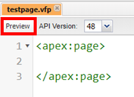</p>

The above picture also displays the default template given when you create a new Visualforce page. As you can see, the page begins and ends with an `<apex:page>` tag. Unlike in HTML, we don't have to worry about including any other tags for structure or metadata to adhere to standards in all of our documents - no `<head>`, no `<body>`, no `<meta>`, etc. But similarly to HTML, the framework offers many prebuilt elements that can be used to provide basic functionality to your page. These elements are referred to as components and are part of the Visualforce Component Library. Commonly used components include `<apex:pageBlock>`, `<apex:outputField>`, and `<apex:dataTable>`, among many others.

## Static Resources

When we were discussing images in HTML, we said that setting the `alt` attribute was important in case the image couldn't be displayed because the browser couldn't render it or it had been moved from the url that we linked to with the `src` attribute. You probably correctly assumed that a way to mitigate the risk of running into the second issue is to store the image locally and change the reference in the `src` attribute from a url to a relative path to the file. Using a static resource in Salesforce is analogous to locally storing an image in this way. Static resources are files, such as images, CSS files, JavaScript files, and archived directories (including .zip and .jar files), that are uploaded to and stored within your org, allowing you to reference and use this content in Visualforce and other places on the platform.

To upload a static resource, go to `Setup` > `Custom Code` > `Static Resources` and click the `New` button, at which point you'll arrive at the static resource upload page (shown in the image below).

<p align="center">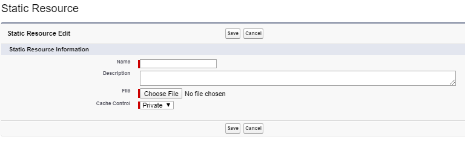</p>

On this page, you define a local name for the resource, choose the resource file from your computer files, and set the cache control for the resource - a value of `Private` means that only you may access any data related to the resource cached on Salesforce's servers, while a value of `Public` means that other users within your org can access the cache and therefore decrease their load times when viewing a page that uses the file.

Each file can be as large as 5 MB and the total size of all resources in an org can be as large as 250 MB. Once you have added the file to your org, you can reference it in your Visualforce through the format `{!$Resource.resourceName}` if it is a single file or `{!URLFOR($Resource.archiveName, 'fileName')}` if it is a file within an archived directory. This format is called expression syntax, we will discuss it in more detail later in this module. The \$ indicates that we are referencing one of the global variables that is included with the framework, in this case the global `Resource` variable.

## The renderAs Attribute

In addition to uploading PDFs to our orgs as static resources, we also have the ability to display our Visualforce pages as PDF files by giving the value `pdf` to the `renderAs` attribute in the opening `<apex:page>` tag (remember that the value for any attribute in markup must be enclosed within double quotes). This feature is useful for making our pages printer-friendly; however, the page is transformed into a PDF before the execution of any JavaScript code that it contains, so this attribute should not be set on any pages that require JavaScript to achieve their desired appearance.

## Visualforce Controllers

In the `Visualforce` section of this module, we said that Visualforce is easy to integrate with the database and mentioned that we can achieve this integration through use of standard controllers. But there are three additional types of controllers in the framework that can be used for dynamic functionality and/or database communication: standard set controllers, controller extensions, and custom controllers. We will discuss each of the four throughout the remainder of this section, but first let's return to a subject we set aside earlier.

### Expression Syntax, Action Binding, and Data Binding

Expression syntax is the format that we saw in the `Static Resources` section, it begins with an opening curly brace and an exclamation point and ends with a closing curly brace. This structure notifies the framework that the following value is not meant to be taken literally, but is rather a reference to another value. While expression syntax is used to include static resources, it is also frequently used for action and data binding.

Action binding is the act of coupling a method inside a page's controller to an event on the page through the syntax `{!methodName}`. Data binding is the act of coupling a variable in a controller to a value on the page through the format `{!variableName}`. Data binding is a double binding, i.e. any changes to the bound value on the page will change the value of the variable in the controller and vice versa. The double binding occurs because controllers in the Visualforce framework pass non-primitive data types by reference instead of value, so both the controller and page are acting on the _same_ data. On the other hand, primitive data types (such as strings) _are_ passed by value, so the double binding does not apply to them _unless_ you use a standard component such as `<apex:inputText>`. I.e. a primitive variable bound to an `<input>` or other HTML element will not automatically update when the value on the page changes. Note that any input element/component that will interact with the database, and other components such as `<apex:commandButton>`, must be enclosed within `<apex:form>` tags.

### Standard Controllers

A standard controller is a set of pre-written, Salesforce-made code that provides functionality for our Visualforce pages. Automatically created for both standard and custom objects, these controllers contain methods that perform actions, such as saving or deleting a record, that mimic the abilities of record detail pages in Lightning Experience. To declare a standard controller, simply specify the `standardController` attribute of the opening `<apex:page>` tag, passing the name of the standard object that you wish to interact with, such as `Account`.

If the url of the page holding your Visualforce page contains the url of a record, e.g. if you are on a record detail page, you can display data from the record's fields by data binding the record variable and field name. The record variable for any standard controller is a lowercase version of the object name, so the expression `{!account.name}` would display the name field of an account record. If your page will not be hosted on a larger page whose url contains a record id, you can use this same method to accept input from the user and commit it to the database, using standard components that we will discuss later in this module.

When coupling record values in your Visualforce page, you will also probably want to make use of some of the methods of the standard controller. Each standard controller has methods such as `cancel`, `save`, `quicksave`, and `delete`, which cancel an edit, save the record and take the user to that record's detail page, save the record without redirecting the user, and delete the record, respectively. To make use of a method, simply action bind it to a standard component such as the `<apex:commandButton>` in your markup by setting the component's `action` attribute. For example, `<apex:commmandButton action="{!delete}" value="Delete Record" id="delButton"/>` creates a button that displays the text "Delete Record" and calls the `delete` method of the standard controller when it is clicked.

### Standard Set (List) Controllers

While standard controllers only allow for interaction with one record at a time, the prebuilt standard set controllers, also known as standard list controllers, allow you to deal with groups of records at once. These controllers are not available for all standard objects, only the `Account`, `Asset`, `Campaign`, `Case`, `Contact`, `Contract`, `Idea`, `Lead`, `Opportunity`, `Order`, `Product2`, `Solution`, and `User` objects (every custom object automatically gets a set controller). To incorporate a list controller, set the `standardController` attribute to the name of the object and the `recordSetVar` attribute (also in the opening `<apex:page>` tag) to a descriptive name - this second attribute determines the name of the list of records and you will reference it throughout the remainder of your page. See below for an example of a list controller declaration.

```
<apex:page standardController="Account" recordSetVar="accs">
</apex:page>
```

In the above markup, the `accs` collection holds all accounts in the org that the running user has permission to see. The members of this collection can be displayed through use of a standard table component (which we will detail later), but only the fields that the user has access to can be shown. The tabled records are paginated, i.e. the list of records is divided into multiple pages (with a default maximum of 20 records per page) so that the user is not overwhelmed with an incredibly lengthy set of records at once. To traverse through the list of records, i.e. between pages, you can action bind the `first`, `last`, `next`, and `previous` methods (which take the user to the first page of records, last page of records, following page of records, and previous page of records, respectively) of the standard set controller to standard components like `<apex:commandButton>`. Like the standard controller, the standard list controller also contains `save`, `quicksave`, and `cancel` methods.

If you wish to display more or less than the default number of records per page, you must write a controller extension. Note that the standard set controller displays all records shown in the last list view that you viewed for the specified object. If no records are showing on your page, go to the list view for the object, change the list view to display all records, and refresh your Visualforce page.

### Controller Extensions
[DOC reference](https://developer.salesforce.com/docs/atlas.en-us.pages.meta/pages/pages_controller_extension.htm)

Controller extensions are custom Apex classes that provide further functionality to a Visualforce page while still allowing you to make use of the prebuilt standard controller or your own custom controller, i.e. they _extend_ the controller. In order to declare an extension in your Visualforce page, pass the name of the Apex class to the `extensions` attribute of the opening `<apex:page>` tag. You can use multiple extensions in a single page, simply comma-separate the names in the `extensions` attribute. In fact, there is no maximum number of extensions per page, but be aware that controller precedence decreases from left to right, so if multiple included extensions have methods with the same signature, the method in the leftmost declared extension will be called when that method is referenced through action binding.

To extend a standard controller, create an Apex class whose constructor takes an `ApexPages.StandardController` object as its sole parameter (as in the first class in the below code). To extend a custom controller, create an Apex class whose constructor takes an object of the custom controller class as its sole parameter (as in the second class in the below code, which serves as an extension of the `AccountController` custom controller). Finally, to extend a standard set controller, create an Apex class whose constructor takes an `ApexPages.StandardSetController` object as its sole parameter (as in the third class in the below code).

```java
public class accountStdExtension {
    public accountStdExtension(ApexPages.StandardController sc){
    }
}

public class accountCustExtension {
    public accountCustExtension(AccountController ac){
    }
}

public class accountSetExtension {
    public accountSetExtension(ApexPages.StandardSetController){
    }
}
```

If you are extending a standard set controller or standard controller, you can call methods from the `StandardSetController` or `StandardController` class, respectively. For example, in order to change the number of records displayed per page by a list controller, pass the desired number to the `setPageSize()` method of the `StandardSetController`.

An example in action:

Apex class
```java
public class myControllerExtension {

    private final Account acct;
    
    // The extension constructor initializes the private member
    // variable acct by using the getRecord method from the standard
    // controller.
    public myControllerExtension(ApexPages.StandardController stdController) {
        this.acct = (Account)stdController.getRecord();
    }

    public String getGreeting() {
        return 'Hello ' + acct.name + ' (' + acct.id + ')';
    }
}
```

visualforce
```
<apex:page standardController="Account" extensions="myControllerExtension">
    {!greeting} <p/>
    <apex:form>
        <apex:inputField value="{!account.name}"/> <p/>
        <apex:commandButton value="Save" action="{!save}"/>
    </apex:form>
</apex:page>
```


### Custom Controllers

Instead of using the prebuilt standard controller, you can create your own by making an Apex class. Custom controllers are declared in Visualforce pages by setting the `controller` attribute of the opening `<apex:page>` tag to the name of the class that serves as the controller. Note that your Visualforce page can declare either _one_ standard controller/standard set controller or _one_ custom controller, not any combination of or multiples of each.

Because you are no longer using the standard controller, you must declare any record variables as properties of your class and instantiate them with any values that you wish in your constructor. Your class may contain getters, setters, or other actions that you bind to events in your Visualforce page. To save some writing, you can use Apex properties rather than coding your own getters and setters. But if you choose to define your own methods, you they must follow the format `setVariableName` and `getVariableName` (the first letter of the variable name is capital in these methods, regardless of if it is capitalized in the variable name itself). Because Apex class variables default to a private scope, we have to declare them as public as well as declaring a setter and getter for them in order to use them in our pages. Take the following Apex class, which contains an Account variable and a setter and getter method for that variable.

```java
public class AccountController{
    public Account acc {get{
            if(acc == null){
                return [SELECT Id, Name FROM Account WHERE 
                    Name='Edge Communications']; 
            }
            else{
                return acc;
            }
        } set;}
}
```

As you can see from the above code, another consequence of using a custom controller instead of a standard one is that we perform record retrieval ourselves using SOQL queries. Similarly, we can use DML to change/insert records. But we also have the option to instantiate and use the `StandardController` class within our class by passing it an instance of the object on which our controller is acting. For an example, see the following custom controller, which is used in a Visualforce page placed in a webpage that has a record Id in the url. It retrieves the corresponding record by way of the standard controller (note that we must type cast the returned object because the standard controller returns an instance of the `sObject` class).

```java
public class AccountController{
    public Account acc{get; set;}

    public AccountController(){
        this.acc = (Account) new ApexPages.StandardController(acc).getRecord();
    }
}
```

Finally, you can also create a custom controller that functions as a custom list controller. To do so, simply instantiate a list of records in the controller and use a SOQL query that returns more than one record. After that, you can build your own pagination methods or instantiate the `StandardSetController` class to leverage its methods.

### When to Use What

With the variety of options available to us, it can seem difficult to know when to use a standard controller with an extension and when to use a custom controller instead. In fact, determining the appropriate combination for a use case is a common question on the Platform Developer I certification exam, so let's set some ground rules to help you decide what you should create.

Obviously, if the standard controller fits all of your requirements, you should use that without any modifications/extensions - there's no point in rewriting what's already been written. You should pair a standard controller and an extension when you want to make use of most of the actions in the controller, but either override at least one of them or add new actions. In the `Standard Set (List) Controllers` section, we said that the standard set controller automatically enforces the permissions of the running user, i.e. it applies our object-level, field-level, and record-level security. This is true of standard controllers as a whole, so the combination of a standard controller and extension is also the correct choice if we wish to enforce security.

The main use case for the custom controller is to run our Apex code in "system" mode, where our object, field, and record security settings are ignored.

## Dividing Your Page with Page Blocks

We will briefly mention and explain some of the Visualforce Component Library page block components, particularly `<apex:pageBlock>`, `<apex:pageBlockSection>`, and `<apex:pageBlockButtons>`, because they are required for some of the standard components that we will discuss later. `<apex:pageBlock>` is sort of analogous to a `<div>` in an HTML page in that it is used to make a division of the page. This component includes styling similar to that of a record detail page in Lightning Experience and we can set the `title` attribute to display a header for the block.

`<apex:pageBlockSection>` must be the direct child of `<apex:pageBlock>`; as the name would suggest, it's a section of the block of the page. This component includes some nice features when paired with other components that we'll see later.

Lastly, `<apex:pageBlockButtons>` must also be the direct child of `<apex:pageBlock>` and can hold `<apex:commandButton>` components inside of it. The documentation will tell you that this component styles children buttons like those in Lightning Experience, but your author doesn't really notice a lot of design difference between an `<apex:commandButton>` inside of an `<apex:pageBlock>` and an `<apex:commandButton>` inside of an `<apex:pageBlockButtons>` that is itself inside of an `<apex:pageBlock>`. In your author's opinion, the biggest reason for wrapping command buttons inside of page block buttons is to have the button appear at the top and bottom of the form (it does this by default).

## Accepting Input with Standard Input Components

Before we get into detailing the variety of input components in the Visualforce Component Library, let's offer a quick reminder that every input component _must_ be contained within an `<apex:form>`. While there are other input components, we will specifically talk about `<apex:input>`, `<apex:inputCheckbox>`, `<apex:inputText>`, `<apex:inputTextarea>`, and `<apex:inputField>`.

`<apex:input>` does not include Salesforce styling and is not bound to a field on a record of a Salesforce object. Therefore, we have to use either a controller extension (if using a standard controller) or a custom controller to interact with and use any values received from this component. In addition, the value `html-5.0` must be passed to the `doctype` parameter of the opening `<apex:page>` tag. This attribute is not a requirement to use `<apex:inputCheckbox>`, `<apex:inputText>`, or `<apex:inputTextarea>`, but all three again have no association with a Salesforce record field and therefore require that we write code to retrieve their values. By default, `<apex:inputCheckbox>` is unchecked. `<apex:inputText>` is similar to an `<apex:input>` that has its `type` attribute set to `text`; `apex:inputTextarea` is a multi-line version of this component.

To allow a user to edit a field of a record, we can use the `<apex:inputField>` component, which is automatically bound to a record field without custom Apex code provided that we specify the `value` attribute. We pass the field API name to `value` within expression syntax (recall that the record variable name is the lowercase object API name if we are using a standard controller) using dot notation, e.g. `value="{!account.name}"` would refer to the name field on the account record retrieved by the standard account controller. Note that capitalization does not matter for field API names when we are specifying them within expression syntax in Visualforce.

The `<apex:inputField>` component is aware of the field data type and other information about the bound field. This means that it will indicate if the field is required by a red line next to the input box (we will see this in a later figure) and show widgets that reflect the field data type (such as a date picker for a field with the date field data type). If we use this component within an `<apex:pageBlockSection>`, the field label will automatically be displayed next to the input box. However, we cannot make the input box read-only - it will only be read-only if the field is already read-only for the running user on the given record.

### Validating Input Field Values

The discussion about inserting data to the database using `<apex:inputField>` may have caused you to wonder how we ensure that data conforms to any validation rules we have placed on the object. Not to worry, there's actually not much to it. If the value of an `<apex:inputField>` violates a validation rule whose error location is on a field, the corresponding `Error Message` will automatically be displayed on the field whenever we try to call the `save` action of the standard controller, just as it would be in Lightning Experience after we press the `Save` button (regardless of whether we are using a standard or custom controller).

On the other hand, if we are using a standard controller and the location of the error is set to the top of the page in the validation rule, simply include an `<apex:messages>` or `<apex:pageMessages>` component on your Visualforce page. Note that these are the `<apex:messages>` and `<apex:pageMessages>` elements, not the `<apex:message>` or `<apex:pageMessage>` components, which will not display the error. Why is this the case? Because Salesforce. Let's take a look at an example of each of the valid components where a created account record validates a validation rule we've created. The first picture corresponds to the below block of code, which uses `<apex:messages>`. The second picture represents the output of the same block of code if it used `<apex:pageMessages>` instead.

```
<apex:page standardController="Account" >
    <apex:form >
        <apex:pageblock>
            <apex:pageBlockSection >
                <apex:inputField value="{!account.name}"/>
                <apex:inputField value="{!account.billingstate}"/>
            </apex:pageBlockSection>
            <apex:pageBlockButtons >
                <apex:commandButton value="Save" action="{!save}"/>
            </apex:pageBlockButtons>
        </apex:pageblock>
    </apex:form>
    <apex:messages/>
</apex:page>
```

<p align="center">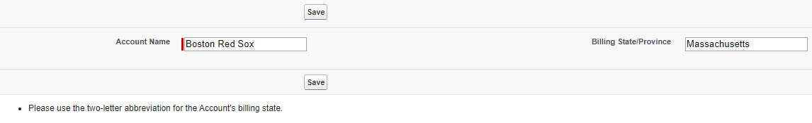</p>

<p align="center">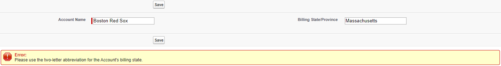</p>

The above code demonstrates the use of many of the concepts we've discussed so far, so let's dissect it before moving on. We open our markup with the form component because we are inserting records to or updating records in the database. Within the form, we use a page block and page block section to automatically label our input fields with the corresponding field label. Our `<apex:inputField>` elements bind themselves to a specific Account field through the expression syntax we give to their value attributes. To display buttons on both the top and bottom of the form, we put our save button (which is action bound to the method of the same name in the standard controller) within an `<apex:pageBlockButtons>`. Finally, to show the error associated with the validation rule, we use either a messages or page messages element.

To achieve the same functionality when using a custom controller, write a save function that follows the format of the following Apex code:

```java
public void saveRecord(){
    try{
        upsert acc;
    }
    catch(DMLException de){
        ApexPages.addMessages(de);
    }
}
```

Here, we wrap our DML statement in a try block. The associated catch block looks for a DMLException (the standard exception type associated with violating a validation rule) and, provided that there is such an exception, passes the message to the `<apex:messages>` or `<apex:pageMessages>` using the `ApexPages.addMessages()` method.

## Displaying Data with Standard Output Components

The Visualforce Component Library also contains a number of output elements: `<apex:outputField>`, `<apex:outputLabel>`, `<apex:outputLink>`, `<apex:outputPanel>`, and `<apex:outputText>`. `<apex:outputField>` allows us to display the field value of a Salesforce record by again specifying its `value` attribute with expression syntax and dot notation (and again, capitalization within this attribute does not matter). As the name would suggest, this component is read-only. Unlike its input cousin, this component does not have to be placed within `<apex:form>` tags. But similar to the corresponding input field, `<apex:outputField>` automatically includes the field label for the specified field if it is placed within an `<apex:pageBlockSection>`.

`<apex:outputLabel>` is commonly paired with the non-`<apex:inputField>` input components; it lets us give a label for these elements that is specified by the `value` attribute. We associate an `<apex:outputLabel>` with an input component by passing the `id` of the input comoponent to the `for` attribute of the label.

`<apex:outputLink>` is analogous to the HTML `<a>` tag. Instead of `href`, this element has a `value` parameter where we provide the url for the desired page. We can provide further parameters for this element by wrapping it around an `<apex:param>` component, which we will talk about later.

`<apex:outputPanel>` is useful when paired with the `<apex:actionSupport>` component we will discuss later in this module (the `id` parameter is available for the vast majority of components in the Visualforce Component Library). Lastly, `<apex:outputText>` allows us to display text to the user. We will want to wrap our text within this tag if we want to give it a special format or font that differs from those of the rest of the page.

## Displaying Records in Visualforce Tables

There are two main options for creating tables in Visualforce pages: the `<apex:pageBlockTable>` and `<apex:dataTable>` standard components. The total collection of data in either table across all pages can be 1,000 records if you are allowing the records to be edited, or 10,000 records if the page is read-only. The main difference between the two is that `<apex:pageBlockTable>` automatically includes Salesforce styling, while `<apex:dataTable>` has no default styling. Additionally, `<apex:pageBlockTable>` is part of the series of page block components we talked about earlier and therefore must be nested inside of either an `<apex:pageBlock>` or `<apex:pageBlockSection>`. Each of the two tables has the required attributes `value` and `var`. We pass a list of records to the `value` attribute using expression syntax and give a variable name to the `var` attribute; this variable name refers to an individual record within the list and will be referenced within the table.

To add columns to tables, we use the `<apex:column>` component. We can include either an `<apex:inputField>` or `<apex:outputField>` within the column tags (although your author is not a fan of the former because you may have to specify styling in order to make the field wide enough to display the field entire value for existing records). Alternatively, we can specify the field through passing it to the `value` attribute of `<apex:column>` with expression syntax. As an added bonus, this second method automatically includes the field label in the column header if it is used within an `<apex:pageBlockTable>`.

Let's look at a page that uses a table component and compare the output of the two tables:

```
<apex:page standardController="Account" recordSetVar="accs">
    <apex:pageBlock>
        <apex:pageBlockTable value="{!accs}" var="acc">
            <apex:column value="{!acc.name}"/>
            <apex:column value="{!acc.numberofemployees}"/>
            <apex:column value="{!acc.annualrevenue}"/>
        </apex:pageBlockTable>
    </apex:pageBlock>
</apex:page>
```

<p align="center">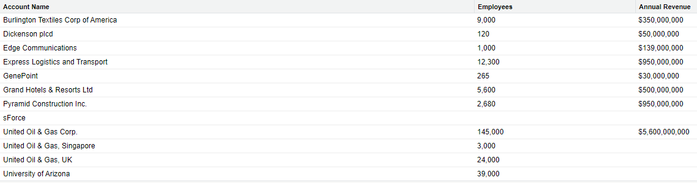</p>

<p align="center">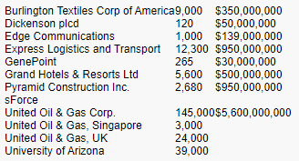</p>

The first image above corresponds to the displayed code, the second image is the output of the same code with pageBlockTable replaced by dataTable. Within the opening table tag, we use expression syntax to set the `value` attribute, notifying the system that we are using the collection of records given to the value of `recordSetVar` in the opening `<apex:page>`. Next, we set the `var` attribute of the table to a variable name that we later refer to in each of our `<apex:column>` components through expression syntax in their `value` attributes.

## Inline Editing

In the `Displaying Data with Standard Output Components` we said that `<apex:outputField>` is read-only; and it is at this point that your author must apologize for not telling you the whole truth. Yes, output fields are uneditable... by default and without extra assistance. However, we can allow the values held in these components to be modified with use of `<apex:inlineEditSupport>`. This new element must be a direct child of `apex:dataList>`, `<apex:dataTable>`, `<apex:form>`, `<apex:outputField>`, `<apex:pageBlock>`, `<apex:pageBlockSection>`, `<apex:pageBlockTable>`, or `<apex:repeat>`.

The easiest way to include inline editing is through use of an `<apex:outputField>` because it requires no custom code. Therefore, we should nest an output field within a table column if we want a quick way to allow values in the table to be changed. See the below code for an example.

```
<apex:page standardController="Account" recordSetVar="accs">
    <apex:form>
        <apex:pageBlock >
            <apex:pageBlockTable value="{!accs}" var="acc">
                <apex:column headerValue="Account Name">
                    <apex:outputField value="{!acc.name}">
                        <apex:inlineEditSupport showOnEdit="updateRecords"/>
                    </apex:outputField>
                </apex:column>
            </apex:pageBlockTable>
            <apex:pageBlockButtons>
                <apex:commandButton value="Update Records" action="{!save}" style="display:none" id="updateRecords"/>
            </apex:pageBlockButtons>
        </apex:pageBlock>
    </apex:form>
</apex:page>
```

<p align="center">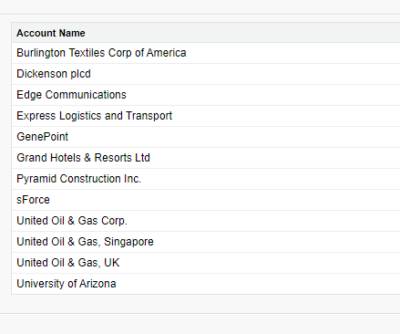</p>

<p align="center">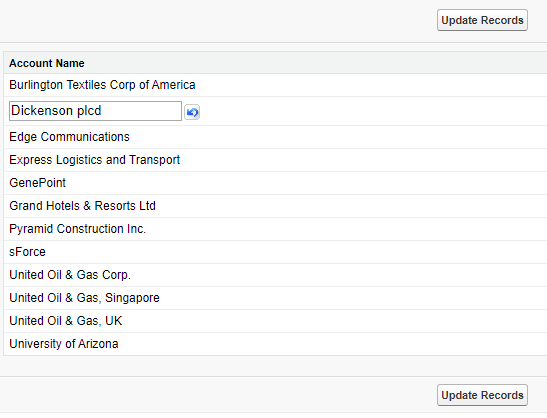</p>

Note that we must wrap our markup in `<apex:form>` tags when using `<apex:inlineEditSupport>`. We then manually apply a column header by setting the `headerValue` attribute in `<apex:column>` because we are no longer specifying the `value` attribute and therefore do not receive the field label as an automatic heading. Within our column, we have an output field that itself contains our `<apex:inlineEditSupport>`. The `showOnEdit` attribute of this component takes a comma-separated list of id values of buttons, so we pass it the id of a custom button we define later in the page. We set the styling of that custom button so that it is initially not shown until inline editing has started (as can be seen in the first picture above). Once the user double clicks an account name within the table, editing is activated and our button is displayed (as seen in the second picture above). The page block table supports inline modifications upon double clicks by default; if we were using a data table, we would have to specify the `event` attribute of `<apex:inlineEditSupport>`, passing it the name of a DOM event that would trigger inline editing capabilities. Note that the standard list controller does not have a `quicksave` method, so we instead action bind the `save` method to our button - this means that the user will be redirected outside of our Visualforce page after they press the button, in this case to the home page of the `Sales` app.

Another method of allowing inline modification on Visualforce pages is to use the `<apex:detail>` component. This component displays the record detail page for the record id to which the formula we pass to the `subject` attribute evaluates (we must pass a formula to this attribute, it cannot be a string literal). While this detail page includes an `Edit` button, pressing that button takes the user to the actual record detail page in Lightning Experience. To keep the user on our Visualforce page when performing modifications, we can pass `true` to the `inlineedit` parameter of `<apex:detail>`.

## Partial Page Rerendering

Let's talk about how the Visualforce framework functions under the hood. When a user visits the url of a Visualforce page, their browser sends a request to the Salesforce servers with the converted url. The Salesforce servers find the Visualforce page based off the information given and then break any framework-specific markup down to HTML before it's returned to the browser because the browser only understands HTML, not Visualforce. Any standard controller, custom controller, or controller extensions remain on the server and the webpage must make another call to the server whenever an event occurs that we have action bound to a controller method. Repetitive server calls can be computationally wasteful. Perhaps we have a large Visualforce page with a checkbox that the user can select to display additional information. When the user checks the checkbox, a DOM event is fired, our page makes an AJAX request to the Force.com server, and the entire page is rerendered, even if the output element that would display the additional information is the only part of the page that changes. In order to implement more selective rerendering, we can use some of the action components of the Visualforce Component Library.

First, we can enclose the components that the server should process within `<apex:actionRegion>`. When a DOM event occurs within the region, the server will only process any components within the region (provided that those components do not act on other elements outside of the region), the rest of the page will be returned to the browser in the same state in which the browser sent it to the server. To asynchronously refresh a component within our region, we can use `<apex:actionSupport>`. There are no required attributes for this component, but you must set the `event` and `reRender` attributes to make full use of the functionality. `event` holds the name of a DOM event, such as `onmouseover` and `reRender` holds the single id or comma-separated list of multiple id values that are refreshed when the event occurs.

To trigger the refresh when a DOM event occurs on a specific component, include the `<apex:actionSupport>` (with the `event` and `reRender` parameters specified) within the opening and closing tags of the component. If you wish to refresh components after a user clicks an `<apex:commandLink>` or `<apex:commandButton>`, simply specify the id(s) of those components in the `reRender` attribute of the link or button, respectively.

To refresh an entire block of the page, wrap it an `<apex:outputPanel>` (which we briefly mentioned in the `Displaying Data with Standard Output Components` section), give the panel an `id`, and pass that value to a `reRender` attribute. When the button/link is clicked or the specified event occurs, the entirety of the panel will be rerendered.

## The View State and Visualforce Best Practices

While we're on the topic of performance, let's discuss the view state. The view state is the hidden data describing the state (i.e. size, type, name, and/or value) of components on your page, values in fields on your page, and objects returned by standard and custom controllers. This set of data is sent to the server when a call is made to describe the current state of the page to which the server will then applly changes. It allows for persistence across server requests - the view state is why, e.g., the value of an input component not identified by an `<apex:actionSupport>` will be maintained when that action is triggered, even though the entire page is refreshed.

Salesforce limits view state size to 170 KB and the server's response time slows with a larger view state. To decrease size, only use `<apex:form>` and `<apex:inputField>` when necessary, remove unneeded components from your page, rework your SOQL queries to only return record data that's relevant to the page (e.g., don't query an object or field that you aren't using on the page), and make diligent use of the `transient` keyword. Like static variables, transient variables aren't included in the view state. Rather, they are instance variables that are not saved and are rather remade with each page refresh.

Additional actions to increase page performance include using stateless components and lazy loading objects. For example, replacing any `<apex:commandLink>` or `<apex:commandButton>` components that redirect users to a different page with `<apex:outputLink>` will reduce server calls because the former two have to make a call to a Salesforce server to receive the output of the bound action (a redirection to a different url), while the latter can simply redirect the user to the specified address without needing to communicate with a Force.com server another time before doing so. Lazy loading objects refers to initializing them with `null` values in controller constructors in order to reduce their size and decrease the time a request takes to complete. The associated getter for a lazy loaded object should then check for the `null` value and initialize the object if that value is found, thereby delaying initialization until the object is needed.

## Parameters

Speaking of links, let's talk about a neat Visualforce feature: the `<apex:param>` component. This component has to be a direct child of `apex:actionFunction>`, `<apex:actionSupport>`, `<apex:commandLink>`, `<apex:outputLink>`, `<apex:outputText>`, or `<flow:interview>`, but it allows us to pass a parameter to its parent. We'll discuss an example use shortly, but first go ahead and Google something. No really, whatever you want - go ahead. Once you do, check out the url, it starts with something like `google.com/search?q=whateveryousearchedfor`. The `q` is a parameter of the url, it tells Google the string for which it should query its search engine.

We can use `<apex:param>` to set this `q` parameter by building off of the following markup format:

```
<apex:page standardController="Account">
    <apex:outputLink value="http:/google.com/search">
        Google Account
        <apex:param name="q" value="{!account.name}"/>
    </apex:outputLink>
</apex:page>
```

When used on a webpage with a record Id in the url, this Visualforce page displays a link with the text "Google Account" that takes the user to a Google search of the account name because we gave the parameter the same name as it holds in Google's urls and passed a value using the `<apex:param>` component. The framework then interpreted our markup, adding the parameter `q` with the result of our data binding as a parameter to the url in the `<apex:outputLink>`. Although `value` is the only required attribute for `<apex:param>`, we had to set the name attribute as well in this example because url parameters are named.

To pass arguments to a parent `<apex:outputText>`, expression syntax within the `value` attribute should contain a zero-indexed integer referring to a nested `<apex:param>`. `{0}` in the `value` would correspond to the first nested `<apex:param>`, `{1}` to the second nested parameter, etc.

## Wrapper Classes

Wrapper classes are a special type of Apex class that is used to collect multiple values in a single object in a way analogous to making a custom data type. We can use wrapper classes to display tables of data in our Visualforce pages that mix lists of records with other properties. For instance, say that we wanted to order our accounts by their annual revenue, providing the rank in each row of the table. To accomplish this task, we could use the following Visualforce page:

```
<apex:page controller="AccountSetController">
        <apex:pageBlock>
            <apex:pageBlockTable value="{!rankedAccounts}" var="ra">
                <apex:column headerValue="Rank" value="{!ra.rank}"/>
                <apex:column value="{!ra.acc.Name}"/>
                <apex:column value="{!ra.acc.AnnualRevenue}"/>
            </apex:pageBlockTable>
        </apex:pageBlock>
</apex:page>
```

And the accompanying custom list controller:

```java
public class AccountSetController {
    public List<Account> accs {get;set;}

    public AccountSetController(){
        this.accs = [SELECT Id, Name, AnnualRevenue FROM Account WHERE AnnualRevenue != null ORDER BY AnnualRevenue DESC];
    }

    public List<wrappedAccRank> getRankedAccounts(){
        List<wrappedAccRank> rankedAccounts = new List<wrappedAccRank>();
        for(Integer i = 0; i < this.accs.size(); i++){
            rankedAccounts.add(new wrappedAccRank(i+1, this.accs[i]));
        }
        return rankedAccounts;
    }

    public class wrappedAccRank{
        public Integer rank {get;set;}
        public Account acc {get;set;}

        public wrappedAccRank(Integer rank, Account acc){
            this.rank = rank;
            this.acc = acc;
        }
    }
}
```

Which together give the output shown in the image below.

<p align="center">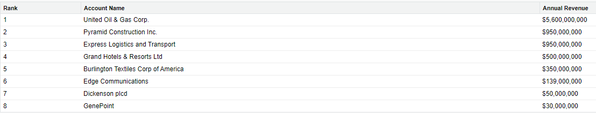</p>

In our controller, we query the database for all account records with non-null annual revenues, ordering the returned list by annual revenue. Our controller also contains our wrapper class, `wrappedAccRank`. This class has two properties: the account record itself and how that account's annual revenue ranks among all accounts in our org. It's a relatively simple class, only containing a constructor that instantiates its properties. In `getRankedAccounts`, we instantiate a list of `wrappedAccRank` objects and then populate that list with the data from our SOQL query.

Our Visualforce page declares that it is using our custom controller and contains a page block table whose data bound `value` attribute automatically calls our `getRankedAccounts` method to retrieve the list of `wrappedAccRank` objects. The columns within the table use dot notation to reference values, note that we explicitly define a header value for the first column because it does not display values of a field from an sObject record and therefore does not automatically receive a heading.

While this is a perfectly sound use of a wrapper class, it is much more common to use wrapper classes to create lists that will be bound to the `data` attribute of an `<apex:chart>` because we can craft a list containing only the values we need and the values do not have to be from fields of a single object.

## Visualforce Wizards

Wizards are sets of pages that guide users through a process one step at a time, with a different page for each step. To create a Visualforce wizard, create a page for each step and use the same custom controller for each page. Buttons that take users to the next or previous step in a process should be action bound to controller methods that return a reference to the appropriate page using the format `Page.visualforcePageName`, which the system directs to the Visualforce page with the given name.

To illustrate, let's create a wizard with three pages: `harryPotter.vfp`, `voldemort.vfp`, and `dumbledore.vfp` (the markup for these pages is displayed in the listed order below).

```
<apex:page controller="WizardController">
    <apex:form>
        <apex:pageBlock>
            Harry Potter
            <br/>
            <apex:commandButton value="Next Wizard!" action="{!tom}"/>
        </apex:pageBlock>
    </apex:form>
</apex:page>
```

```
<apex:page controller="WizardController">
    <apex:form>
        <apex:pageBlock>
            Voldemort
            <apex:pageBlockSection>
                <apex:commandButton value="Previous Wizard!" action="{!harry}"/>
                <apex:commandButton value="Next Wizard!" action="{!albus}"/>
            </apex:pageBlockSection>
        </apex:pageBlock>
    </apex:form>
</apex:page>
```

```
<apex:page controller="WizardController">
    <apex:form>
        <apex:pageBlock>
            Albus Dumbledore
            <br/>
            <apex:commandButton value="Previous Wizard!" action="{!tom}"/>
        </apex:pageBlock>
    </apex:form>
</apex:page>
```

And the associated Apex controller:

```java
public class WizardController {
    public PageReference harry(){
        return Page.harryPotter;
    }

    public PageReference tom(){
        return Page.voldemort;
    }

    public PageReference albus(){
        return Page.dumbledore;
    }
}
```

## Testing Visualforce Pages

There are two parts to testing Visualforce: viewing the markup and writing test classes for any custom Apex code. To ensure that your page has the desired appearance, you should view it in multiple browsers and whatever Salesforce user interface it is intended for (Classic, Lightning Experience, or both).

To test the Apex code, follow all of the principles we discussed in the `Apex Testing Framework` module. Note that your test method should begin with the following lines of code to associate the testing environment with the desired Visualforce page:

```java
PageReference pageRef = Page.myVisualforcePageName;
Test.setCurrentPage(pageRef)
```

In the code above, we instantiate a reference to the Visualforce page we are testing and set it to the currently viewed page in our testing environment. You may then instantiate the custom controller/controller extension and it will grab the page reference from the testing environment. Be sure to test all setters, getters, and other action methods (including methods that redirect the user to a different page) in your controller using positive and negative (and where appropriate, restricted user and bulk) tests.

## Including Visualforce in the Salesforce User Interface

To this point, we've created numerous Visualforce pages, but we haven't yet included any of them in Lightning Experience. To achieve this goal, we can create a `Visualforce Tab`. First, navigate to `Setup` > `User Interface` > `Tabs` and click the `New` button in the `Visualforce Tabs` section, at which point you will be prompted with the following wizard page:

<p align="center">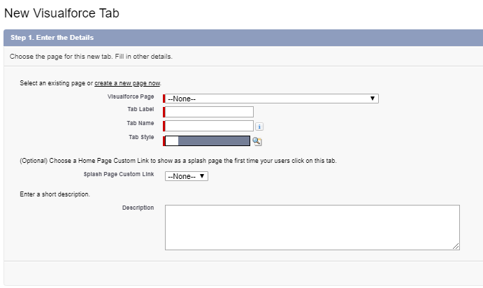</p>

In the first step of this wizard, we will choose our Visualforce page from the `Visualforce Page` dropdown and give it a label, name, and style. The second step of this wizard will prompt you to set the tab visibility for all user profiles. Recall that there are three levels of tab visibility: `Default On`, `Default Off`, and `Tab Hidden`. `Default On` will show the page as a tab in any app that we add it to and `Default Off` will remove the page from any app that we add it to for the specified profile, but will still allow users with that profile to find the tab through use of the `App Launcher`. Lastly `Tab Hidden` will remove the page from any app that we add it to for users with the specified profile as well as removing it from their `App Launcher`. We can add our new tab to apps in the third and final step of this wizard and users will then be directed to our Visualforce page when they click the tab.

If we wish to include our page within an existing tab, we can add it to a page using `Lightning App Builder`, but we first have to enable it for Lightning Experience. To do so, navigate to `Setup` > `Custom Code` > `Visualforce Pages`, select your page from the list, click `Edit`, select the `Available for Lightning Experience, Lightning Communities, and the mobile app` checkbox, and click `Save`. Now you can drag a `Visualforce` standard component (enclosed in the red rectangle in the below image) onto your page in `Lightning App Builder` and choose the selected page.

<p align="center">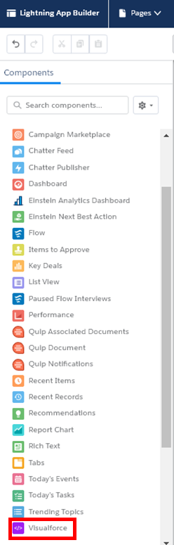</p>

## Setting Styling in Visualforce

In the last section, we discussed placing our Visualforce pages in tabs; in this section, we will detail including tab styling in our pages; and in the following one, we will explore including tabs in our pages. Note that these are three distinct concepts. By default, the styling and color scheme of a Visualforce page is determined by the controller. If you are using the standard controller of a standard object, the styling defaults to that of the tab for said object. If you are using a custom controller, the styling defaults to that of the Home tab. If you are using a custom object with a `Custom Object Tab`, you must pass the object API name to the `tabStyle` attribute of the opening `<apex:page>` tag to inherit that styling. Finally, you can use the color and design of a custom `Visualforce Tab` by passing the name of the page appended with two underscores and "tab".

## Tabs in Visualforce Pages

To include tabs within your page, wrap all of the elements for a given tab within an `<apex:tab>` and nest those tabs inside of an `<apex:tabPanel>`. You can change the default selected tab by passing its `id` to the `selectedTab` attribute of `<apex:tabPanel>`.

## Dynamic Visualforce

We can dynamically instantiate Visualforce components by using the `<apex:dynamicComponent>` component. This element has the required attribute `componentValue`, to which we pass the expression-syntax formatted name of a custom controller or controller extension method that will return a component. Note that your controller method must be the value named in the `componentValue` attribute with the first letter capitalized and prefixed with "get". Take a look at the example below, which contains an `<apex:outputText>` that is only rendered if it is after noon locally. First the Visualforce page:

```
<apex:page controller="DynamicController">
    <apex:dynamicComponent componentValue="{!beforeAfterNoon}"/>
</apex:page>
```

And the associated Apex class:

```java
public class DynamicController {
    public Component.Apex.OutputText getBeforeAfterNoon(){
        if(DateTime.now().hour() >= 12){
            Component.Apex.OutputText ot = new Component.Apex.OutputText();
            ot.value = 'After Noon';
            return ot;
        }
        else{
            return null;
        }
    }
}
```

Alternatively, we can achieve dynamic Visualforce through dynamic bindings. Instead of the expression being evaluated at compile time, it is evaluated at run time. To achieve dynamic bindings, follow the format `{!reference[expression]}`, where reference is either an sObject instance, Apex class, or global variable. For instance, we could use `{!$Resource[resourceName]}` and create a getter for `resourceName` that changed the resource being used based on user input.

## Custom Labels

Custom labels are a tool that can be used in Apex, Visualforce, or Lightning components to translate a base message into the language in the user's settings, provided that we have added support for that language.

First, enable translation workbench by navigating to `Setup` > `User Interface` > `Translation Workbench` > `Translation Language Settings` and clicking `Enable`. Once the settings have been modified, you will see a list of supported languages on the `Translation Language Settings` page. By clicking the `Add` button, you will be taken to a page where you can choose the new supported language (be sure to select the `Active` checkbox in order to use the language).

After you have added all desired languages, navigate to `Setup` > `User Interface` > `Custom Labels`, click `New Custom Label`, and give the label a name and value (the message held in the label). Next, click the name of the newly-made label and click `New` in the `Translations` related list (note that this list is replaced with `Local Translations/Overrides` if you are translating a system-made custom label), at which point you will be taken to a screen similar to the below image. In that image, `Master Label Text` gives the value of the custom label and `Translation Text` will hold the translation of the `Master Label Text` for the language chosen in the `Language` picklist.

<p align="center">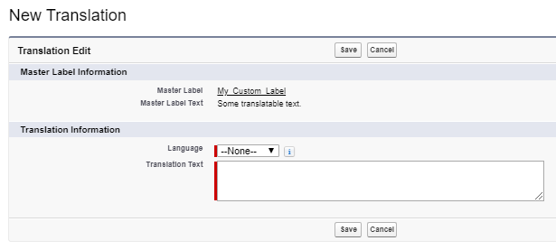</p>

 We could then include that label in our Apex code by using `System.Label` class and appending the name of the label, e.g. `System.Label.My_Custom_Label` for label in the above image. Within Visualforce, we reference a custom label with the `$Label` expression, e.g. `{!$Label.My_Custom_Label}` for the above label.